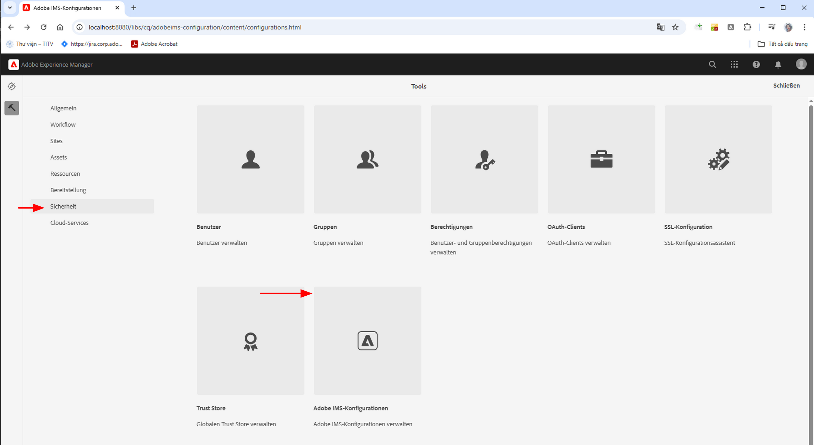
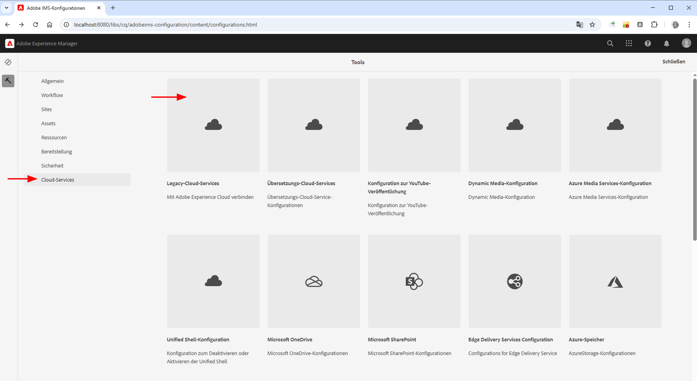

# Integrieren in Adobe Target

Erfahren Sie, wie Sie AEM as a Cloud Service (AEMCS) in Adobe Target integrieren, um personalisierte Inhalte wie Experience Fragments als Angebote in Adobe Target zu aktivieren.

Durch die Integration kann Ihr Marketing-Team personalisierte Inhalte zentral in AEM erstellen und verwalten. Diese Inhalte können dann nahtlos als Angebote in Adobe Target aktiviert werden.

>[!IMPORTANT]
>
>Der Integrationsschritt ist optional, wenn Ihr Team es vorzieht, Angebote vollständig in Adobe Target zu verwalten, ohne AEM als zentralisiertes Content-Repository zu verwenden.

## Allgemeine Schritte

Der Integrationsprozess umfasst vier Hauptschritte, die die Verbindung zwischen AEM und Adobe Target herstellen:

1. **Erstellen und Konfigurieren eines Adobe Developer Console-Projekts**
2. **Erstellen einer Adobe IMS-Konfiguration für Target in AEM**
3. **Erstellen einer älteren Adobe Target-Konfiguration in AEM**
4. **Anwenden derAdobe Target-Konfiguration auf Experience Fragments**

## Erstellen und Konfigurieren eines Adobe Developer Console-Projekts

Damit AEM sicher mit Adobe Target kommunizieren kann, müssen Sie ein Adobe Developer Console-Projekt mithilfe der OAuth-Server-zu-Server-Authentifizierung konfigurieren. Sie können ein vorhandenes Projekt verwenden oder ein neues erstellen. 

1. Wechseln Sie zur [Adobe Developer Console](https://developer.adobe.com/console), und melden Sie sich mit Ihrer Adobe ID an.

2. Erstellen Sie ein neues Projekt, oder öffnen Sie ein vorhandenes.\
   

3. Klicken Sie auf **API hinzufügen**. Filtern Sie im Dialogfeld **API hinzufügen** nach **Experience Cloud**, wählen Sie **Adobe Target** aus, und klicken Sie auf **Weiter**.\
   

4. Wählen Sie im Dialogfeld **API konfigurieren** die Authentifizierungsmethode **OAuth-Server-zu-Server** aus, und klicken Sie auf **Weiter**.\
   

5. Wählen Sie im Schritt **Produktprofile auswählen** die Option **Standard-Workspace** aus,und klicken Sie auf **Konfigurierte API speichern**.\
   

6. Wählen Sie in der linken Navigation **OAuth-Server-zu-Server** aus, und überprüfen Sie die Konfigurationsdetails. Notieren Sie sich die Client-ID und das Client-Geheimnis. Sie benötigen diese Werte, um die IMS-Integration in AEM zu konfigurieren.
   

## Erstellen einer Adobe IMS-Konfiguration für Target in AEM

Erstellen Sie in AEM eine Adobe IMS-Konfiguration für Target mit den Anmeldedaten aus der Adobe Developer Console. Diese Konfiguration ermöglicht AEM die Authentifizierung bei den Adobe Target-APIs.

1. Navigieren Sie in AEM zu **Tools** > **Sicherheit** > **Adobe IMS-Konfigurationen**.\
   

2. Klicken Sie auf **Erstellen**.\
   

3. Geben Sie auf der Seite **Konfiguration des technischen Adobe IMS-Kontos** Folgendes ein:
   - **Cloud-Lösung**: Adobe Target
   - **Titel**: ein Titel für die Konfiguration, z. B. „Adobe Target“
   - **Autorisierungs-Server**: `https://ims-na1.adobelogin.com`
   - **Client-ID**: aus der Adobe Developer Console
   - **Client-Geheimnis**: aus der Adobe Developer Console
   - **Umfang**: aus der Adobe Developer Console
   - **Organisations-ID**: aus der Adobe Developer Console

   Klicken Sie dann auf **Erstellen**.

   

4. Wählen Sie die Konfiguration aus und klicken Sie auf **Konsistenzprüfung**, um die Verbindung zu überprüfen. Eine Erfolgsmeldung bestätigt, dass AEM eine Verbindung zu Adobe Target herstellen kann.\
   

## Erstellen einer Adobe Target-Legacy-Konfiguration in AEM

Um Experience Fragments als Angebote nach Adobe Target zu exportieren, erstellen Sie eine Adobe Target-Legacy-Konfiguration in AEM.

1. Navigieren Sie in AEM zu **Tools** > **Cloud-Services**, und wählen Sie **Legacy-Cloud-Services** aus.\
   

2. Klicken Sie im Abschnitt **Adobe Target** auf **Jetzt konfigurieren**.\
   

3. Geben Sie im Dialogfeld **Konfiguration erstellen** einen Namen wie „Adobe Target Legacy“ ein, und klicken Sie auf **Erstellen**.\
   

4. Geben Sie auf der Seite **Adobe Target Legacy-Konfiguration** Folgendes an:
   - **Authentifizierung**: IMS
   - **Client-Code**: Ihr Adobe Target-Client-Code (in Adobe Target unter **Administration** > **Implementierung** zu finden)
   - **IMS-Konfiguration**: die zuvor erstellte IMS-Konfiguration

   Klicken Sie auf **Mit Adobe Target verbinden**, um die Verbindung zu validieren.

   

## Anwenden der Adobe Target-Konfiguration auf Experience Fragments

Verknüpfen Sie die Adobe Target-Konfiguration mit Ihren Experience Fragments, damit sie exportiert und als Angebote in Target verwendet werden können.

1. Navigieren Sie in AEM zu **Experience Fragments**.\
   

2. Wählen Sie den Stammordner aus, der Ihre Experience Fragments enthält (z. B. `WKND Site Fragments`), und klicken Sie auf **Eigenschaften**.\
   

3. Öffnen Sie auf der Seite **Eigenschaften** die Registerkarte **Cloud-Services**. Wählen Sie im Abschnitt **Cloud Service-Konfiguration** Ihre Adobe Target-Konfiguration aus.\
   

4. Füllen Sie im Abschnitt **Adobe Target**, der angezeigt wird, Folgendes aus:
   - **Adobe Target-Exportformat**: HTML
   - **Adobe Target-Arbeitsbereich**: Wählen Sie den zu verwendenden Arbeitsbereich aus (z. B. „Standard-Workspace“).
   - **Externalizer-Domains**: Geben Sie die Domains ein, aus denen externe URLs generiert werden sollen.

   

5. Klicken Sie auf **Speichern und schließen**, um die Konfiguration zu speichern.

## Überprüfen der Integration

Um sich zu vergewissern, dass die Integration ordnungsgemäß funktioniert, testen Sie die Exportfunktion:

1. Erstellen Sie in AEM ein neues Experience Fragment, oder öffnen Sie ein vorhandenes. Klicken Sie in der Symbolleiste auf **Nach Adobe Target exportieren**.\
   

2. Navigieren Sie in Adobe Target zum Abschnitt **Angebote**, und überprüfen Sie, ob das Experience Fragment als Angebot angezeigt wird.\
   

## Zusätzliche Ressourcen

- [Überblick über das Target-API](https://experienceleague.adobe.com/de/docs/target-dev/developer/api/target-api-overview)
- [Target-Angebot](https://experienceleague.adobe.com/de/docs/target/using/experiences/offers/manage-content)
- [Adobe Developer Console](https://developer.adobe.com/developer-console/docs/guides/)
- [Experience Fragments in AEM](https://experienceleague.adobe.com/de/docs/experience-manager-learn/sites/experience-fragments/experience-fragments-feature-video-use)
