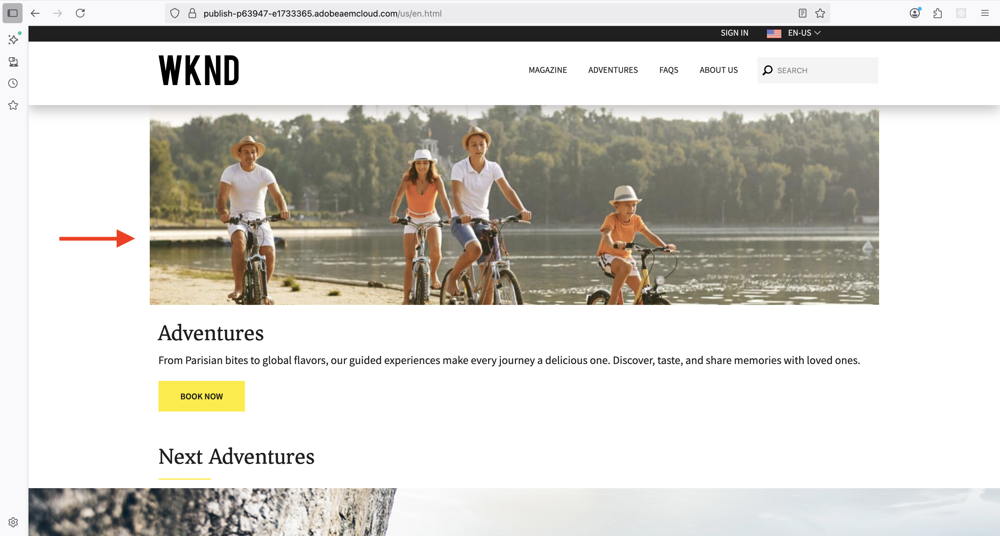
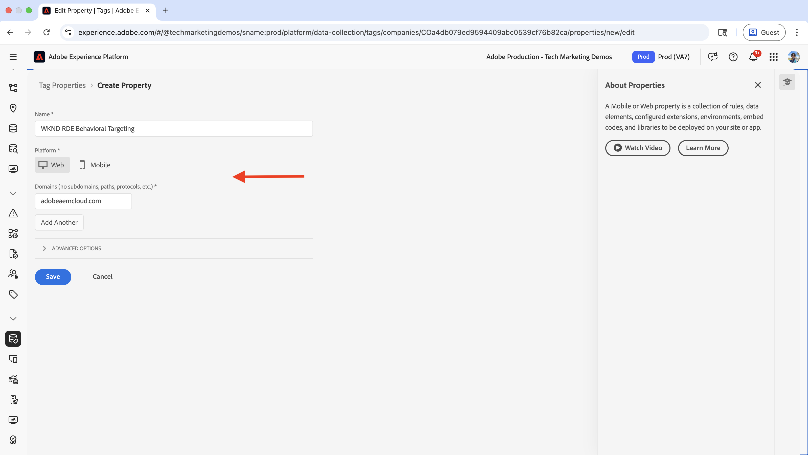
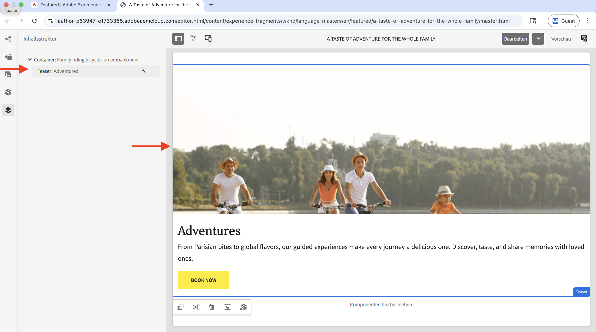
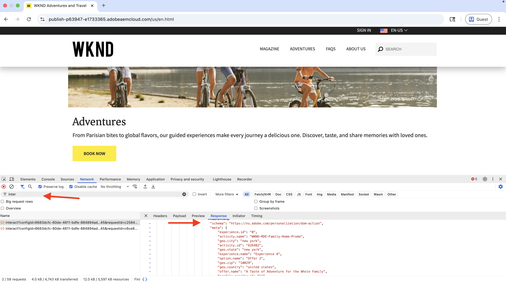

# Verhaltens-Targeting

Erfahren Sie, wie Sie Inhalte basierend auf dem Benutzerverhalten mit Adobe Experience Platform (AEP) und Adobe Target personalisieren können.

Mit der verhaltensbezogenen Zielgruppenbestimmung können Sie für die nächste Seite eine Personalisierung bereitstellen, die auf dem Benutzerverhalten basiert, z. B. den besuchten Seiten, den Produkten oder Kategorien, die besucht wurden. Zu häufigen Szenarien gehören:

- **Hero Section Personalization**: Auf der nächsten Seite basierend auf der Browser-Aktivität des Benutzers personalisierte Hero-Inhalte anzeigen
- **Anpassung von Inhaltselementen**: Ändern von Überschriften, Bildern oder call-to-action-Schaltflächen basierend auf der Browser-Aktivität des Benutzers
- **Anpassung des Seiteninhalts**: Ändern des gesamten Seiteninhalts basierend auf der Browser-Aktivität des Benutzers

## Demo-Anwendungsszenario

In diesem Tutorial zeigt der Prozess, wie **anonyme Benutzer** die entweder die Adventure-Seiten _Bali Surf Camp_, _Riverside Camping_ oder _Tahoe Skiing_ besucht haben, einen personalisierten Helden sehen, der über dem Abschnitt **Nächste Adventures** auf der WKND-Startseite angezeigt wird.



Zu Demozwecken werden Benutzer mit diesem Browser-Verhalten als Zielgruppe **Familienreisende** kategorisiert.

### Live-Demo

Besuchen Sie die [WKND-Aktivierungs](https://wknd.enablementadobe.com/us/en.html)Website, um verhaltensbezogenes Targeting in Aktion zu sehen. Die Website bietet drei verschiedene Erlebnisse beim Targeting im Verhalten:

- **Startseite**: Wenn Benutzer die Startseite besuchen, nachdem sie _Bali Surf Camp_, _Riverside Camping_ oder _Tahoe Skiing_ Adventure-Seiten durchsucht haben, werden sie als Zielgruppe **Family Travelers** kategorisiert und sehen einen personalisierten Held-Abschnitt über dem _Nächste Adventures_.

- **Adventure-Seite**: Wenn Benutzer Adventure-Seiten _Bali Surf Camp_ oder _Surf Camp in Costa Rica_ ansehen, werden sie als Zielgruppe **Surfing-Interesse** kategorisiert und sehen einen personalisierten Hero-Abschnitt auf der Adventure-Seite.

- **Magazinseite**: Wenn Benutzer _drei oder mehr_ Artikel lesen, werden sie als **Magazinleser**-Zielgruppe kategorisiert und sehen einen personalisierten Hero-Abschnitt auf der Magazinseite.

>[!VIDEO](https://video.tv.adobe.com/v/3474001/?learn=on&enablevpops)

>[!TIP]
>
>Die erste Zielgruppe verwendet die **Edge**-Auswertung für die Echtzeit-Personalisierung, während die zweite und dritte Zielgruppe die **Batch**-Auswertung für die Personalisierung verwenden, die sich ideal für wiederkehrende Besucher eignet.

## Voraussetzungen

Bevor Sie mit dem Anwendungsfall Verhaltens-Targeting fortfahren, stellen Sie sicher, dass Sie Folgendes abgeschlossen haben:

- [Adobe Target integrieren](../setup/integrate-adobe-target.md): Ermöglicht Teams die zentrale Erstellung und Verwaltung personalisierter Inhalte in AEM und deren Aktivierung als Angebote in Adobe Target.
- [Tags in Adobe Experience Platform integrieren](../setup/integrate-adobe-tags.md): Ermöglicht Teams die Verwaltung und Bereitstellung von JavaScript für Personalisierung und Datenerfassung, ohne AEM-Code erneut bereitstellen zu müssen.

Machen Sie sich auch mit den Konzepten von [Adobe Experience Cloud Identity Service (ECID)](https://experienceleague.adobe.com/en/docs/id-service/using/home) und [Adobe Experience Platform](https://experienceleague.adobe.com/de/docs/experience-platform/landing/home) vertraut, z. B. Schema, Datenstrom, Zielgruppen, Identitäten und Profile.

Sie können in Adobe Target zwar einfache Zielgruppen erstellen, Adobe Experience Platform (AEP) bietet jedoch den modernen Ansatz, Zielgruppen zu erstellen und zu verwalten und vollständige Kundenprofile mithilfe verschiedener Datenquellen wie Verhaltens- und Transaktionsdaten zu erstellen.

## Allgemeine Schritte

Der Einrichtungsprozess des verhaltensbezogenen Targeting umfasst Schritte für Adobe Experience Platform, AEM und Adobe Target.

1. **In Adobe Experience Platform:**
   1. Schema erstellen und konfigurieren
   2. Erstellen und Konfigurieren eines Datensatzes
   3. Erstellen und Konfigurieren eines Datenstroms
   4. Erstellen und Konfigurieren einer Tag-Eigenschaft
   5. Konfigurieren der Zusammenführungsrichtlinie für das Profil
   6. Einrichten des Adobe Target-Ziels (v2)
   7. Erstellen und Konfigurieren einer Zielgruppe

2. **In AEM:**
   1. Erstellen personalisierter Angebote mit Experience Fragment
   2. Integrieren und Einfügen von Tags-Eigenschaften in AEM-Seiten
   3. Integrieren von Adobe Target und Exportieren personalisierter Angebote nach Adobe Target

3. **In Adobe Target:**
   1. Überprüfen der Audiences und Angebote
   2. Erstellen und Konfigurieren einer Aktivität

4. **Überprüfen Sie die Implementierung des Verhaltens-Targeting auf Ihren AEM-Seiten**

Die verschiedenen Lösungen von AEP werden verwendet, um Verhaltensdaten zu erfassen, zu verwalten und zu sammeln, um Zielgruppen zu erstellen. Diese Zielgruppen werden dann in Adobe Target aktiviert. Mithilfe von Aktivitäten in Adobe Target werden den Benutzenden personalisierte Erlebnisse bereitgestellt.

## Adobe Experience Platform-Schritte

Um Zielgruppen auf der Grundlage von Verhaltensdaten zu erstellen, müssen Daten erfasst und gespeichert werden, wenn Benutzer Ihre Website besuchen oder mit ihr interagieren. Um in diesem Beispiel einen Benutzer als Zielgruppe **Familienreisende** zu kategorisieren, müssen Seitenansichtsdaten erfasst werden. Der Prozess beginnt in der Adobe Experience Platform, um die erforderlichen Komponenten zur Erfassung dieser Daten einzurichten.

Melden Sie sich bei [Adobe Experience Cloud](https://experience.adobe.com/) an und navigieren Sie über **App Switcher oder den Abschnitt Schnellzugriff zu** Experience Platform.


### Schema erstellen und konfigurieren

Ein Schema definiert die Struktur und das Format von Daten, die Sie in Adobe Experience Platform erfassen. Dies stellt die Datenkonsistenz sicher und ermöglicht es Ihnen, basierend auf standardisierten Datenfeldern aussagekräftige Zielgruppen zu erstellen. Für das Verhaltens-Targeting ist ein Schema erforderlich, mit dem Seitenansichtsereignisse und Benutzerinteraktionen erfasst werden können.

Erstellen Sie ein Schema zur Erfassung von Seitenansichtsdaten für das verhaltensbezogene Targeting.

- Adobe Experience Platform Klicken Sie auf der Startseite von **0** im linken Navigationsbereich auf **Schemata“ und dann auf** Schema erstellen **.**

  

- Wählen Sie im **Schema erstellen**-Assistenten für **Schema-**) die Option **Erlebnisereignis** und klicken Sie auf **Weiter**.

  

- Geben **für den Schritt** Name und Überprüfung“ Folgendes ein:
   - **Anzeigename des Schemas**: WKND-RDE-Behavioral-Targeting
   - **Klasse ausgewählt**: XDM ExperienceEvent

  

- Aktualisieren Sie das Schema wie folgt:
   - **Feldergruppe hinzufügen**: AEP Web SDK ExperienceEvent
   - **Profil**: Aktivieren

  

- Klicken Sie auf **Speichern**, um das Schema zu erstellen.

### Erstellen und Konfigurieren eines Datensatzes

Ein Datensatz ist ein Container für Daten, die einem bestimmten Schema folgen. Es dient als Speicherort, an dem Verhaltensdaten erfasst und organisiert werden. Der Datensatz muss für Profil aktiviert sein, um die Erstellung und Personalisierung von Audiences zu ermöglichen.

Erstellen wir einen Datensatz zum Speichern der Seitenansichtsdaten.

- Adobe Experience Platform Klicken Sie in **** im linken Navigationsbereich auf **Datensätze** und dann auf **Datensatz erstellen**.
  

- Wählen Sie im Schritt **Datensatz erstellen** die Option **Datensatz aus Schema** und klicken Sie auf **Weiter**.
  

- Wählen **im Assistenten Datensatz aus Schema**) für den Schritt **Schema auswählen** das Schema **WKND-RDE-Behavioral-Targeting** aus und klicken Sie auf **Weiter**.
  

- Geben **für den Schritt** Datensatz konfigurieren“ Folgendes ein:
   - **name**: WKND-RDE-Behavioral-Targeting
   - **Beschreibung**: Datensatz zum Speichern von Seitenansichtsdaten

  

  Klicken Sie **Beenden**, um den Datensatz zu erstellen.

- Aktualisieren Sie den Datensatz wie folgt:
   - **Profil**: Aktivieren

  

### Erstellen und Konfigurieren eines Datenstroms

Ein Datenstrom ist eine Konfiguration, die definiert, wie Daten von Ihrer Website über die Web-SDK an Adobe Experience Platform fließen. Sie dient als Brücke zwischen Ihrer Website und der Plattform und stellt sicher, dass Daten ordnungsgemäß formatiert sind und an die richtigen Datensätze weitergeleitet werden. Für das Verhaltens-Targeting müssen wir bestimmte Services wie Edge-Segmentierung und Personalization-Ziele aktivieren.

Erstellen wir einen Datenstrom, um Seitenansichtsdaten über die Web-SDK an Experience Platform zu senden.

- Klicken Sie in {0 **Adobe Experience Platform** im linken **auf „Datenströme“ und dann auf** Datenstrom erstellen **.**

- Geben **im Schritt** Neuer Datenstrom“ Folgendes ein:
   - **name**: WKND-RDE-Behavioral-Targeting
   - **Beschreibung**: Datenstrom zum Senden von Seitenansichtsdaten an Experience Platform
   - **Zuordnungsschema**: WKND-RDE-Behavioral-Targeting
Klicken Sie **Speichern**, um den Datenstrom zu erstellen.

  

- Nachdem der Datenstrom erstellt wurde, klicken Sie auf **Service hinzufügen**.

  

- Wählen Sie **Schritt** Service hinzufügen“ aus dem Dropdown-**die Option** Adobe Experience Platform&quot; aus und geben Sie Folgendes ein:
   - **Ereignisdatensatz**: WKND-RDE-Behavioral-Targeting
   - **Profildatensatz**: WKND-RDE-Behavioral-Targeting
   - **Offer Decisioning**: Aktivieren
   - **Edge-Segmentierung**: Aktivieren
   - **Personalization-Ziele**: Aktivieren

  Klicken Sie auf **Speichern**, um den Service hinzuzufügen.

  

- Wählen Sie im Schritt **Service hinzufügen** aus dem Dropdown-Menü **Adobe Target** aus, und geben Sie die **Target-Umgebungs-ID** ein. Die Target-Umgebungs-ID finden Sie in Adobe Target unter **Administration** > **Umgebungen**. Klicken Sie auf **Speichern**, um den Service hinzuzufügen.
  

### Erstellen und Konfigurieren einer Tag-Eigenschaft

Eine Tags-Eigenschaft ist ein Container für JavaScript-Code, der Daten von Ihrer Website erfasst und an Adobe Experience Platform sendet. Sie fungiert als Datenerfassungsschicht, die Benutzerinteraktionen und Seitenansichten erfasst. Beim verhaltensbezogenen Targeting erfassen wir bestimmte Seitendetails wie Seitenname, URL, Site-Bereich und Host-Name, um aussagekräftige Zielgruppen zu erstellen.

Erstellen wir eine Tags-Eigenschaft, die Seitenansichtsdaten erfasst, wenn Benutzer Ihre Website besuchen.

Für diesen Anwendungsfall werden Seitendetails wie Seitenname, URL, Site-Bereich und Host-Name erfasst. Diese Details werden verwendet, um verhaltensbezogene Zielgruppen zu erstellen.

Sie können die Eigenschaft „Tags“ aktualisieren, die Sie im Schritt [Integrieren von Adobe-Tags](../setup/integrate-adobe-tags.md) erstellt haben. Um die Einrichtung jedoch einfach zu halten, wird eine neue Tag-Eigenschaft erstellt.

#### Tag-Eigenschaft erstellen

Um eine Tags-Eigenschaft zu erstellen, führen Sie die folgenden Schritte aus:

- Adobe Experience Platform Klicken Sie in **** im linken Navigationsbereich auf **Tags** und dann auf die Schaltfläche **Neue Eigenschaft**.
  

- Geben Sie im Dialogfeld **Eigenschaft erstellen** Folgendes ein:
   - **Eigenschaftsname**: WKND-RDE-Behavioral-Targeting
   - **Eigenschaftstyp**: Wählen Sie **Web** aus.
   - **Domain**: die Domain, in der Sie die Eigenschaft bereitstellen (z. B. `.adobeaemcloud.com`)

  Klicken Sie **Speichern**, um die Eigenschaft zu erstellen.

  

- Öffnen Sie die neue Eigenschaft, klicken Sie im linken **auf** Erweiterungen und klicken Sie auf die Registerkarte **Katalog**. Suchen Sie nach **Web SDK** und klicken Sie auf die Schaltfläche **Installieren**.
  

- Wählen Sie im Dialogfeld **Erweiterung installieren** den zuvor erstellten **Datenstrom**, und klicken Sie auf **Speichern**.
  

#### Hinzufügen von Datenelementen

Datenelemente sind Variablen, die bestimmte Datenpunkte auf Ihrer Website erfassen und sie für die Verwendung in Regeln und anderen Tags-Konfigurationen verfügbar machen. Sie dienen als Bausteine für die Datenerfassung und ermöglichen es Ihnen, aussagekräftige Informationen aus Benutzerinteraktionen und Seitenansichten zu extrahieren. Für das verhaltensbezogene Targeting müssen Seitendetails wie Hostname, Site-Bereich und Seitenname erfasst werden, um Zielgruppensegmente zu erstellen.

Erstellen Sie die folgenden Datenelemente, um die wichtigen Seitendetails zu erfassen.

- Klicken Sie **linken Navigationsbereich auf** Datenelemente“ und dann auf die Schaltfläche **Neues Datenelement erstellen**.
  

- Geben **im Dialogfeld Neues Datenelement** Folgendes ein:
   - **name**: Host-Name
   - **Erweiterung**: Wählen Sie **Core** aus.
   - **Datenelementtyp**: Wählen Sie **Benutzerdefinierter Code**
   - **Editor öffnen** und geben Sie das folgende Codefragment ein:

     ```javascript
     if(window && window.location && window.location.hostname) {
         return window.location.hostname;
     }
     ```

  

- Erstellen Sie ebenso die folgenden Datenelemente:

   - **name**: Site-Bereich
   - **Erweiterung**: Wählen Sie **Core** aus.
   - **Datenelementtyp**: Wählen Sie **Benutzerdefinierter Code**
   - **Editor öffnen** und geben Sie das folgende Codefragment ein:

     ```javascript
     if(event && event.component && event.component.hasOwnProperty('repo:path')) {
         let pagePath = event.component['repo:path'];
     
         let siteSection = '';
     
         //Check for html String in URL.
         if (pagePath.indexOf('.html') > -1) { 
         siteSection = pagePath.substring(0, pagePath.lastIndexOf('.html'));
     
         //replace slash with colon
         siteSection = siteSection.replaceAll('/', ':');
     
         //remove `:content`
         siteSection = siteSection.replaceAll(':content:','');
         }
     
         return siteSection 
     }        
     ```

   - **name**: Seitenname
   - **Erweiterung**: Wählen Sie **Core** aus.
   - **Datenelementtyp**: Wählen Sie **Benutzerdefinierter Code**
   - **Editor öffnen** und geben Sie das folgende Codefragment ein:

     ```javascript
     if(event && event.component && event.component.hasOwnProperty('dc:title')) {
         // return value of 'dc:title' from the data layer Page object, which is propagated via 'cmp:show' event
         return event.component['dc:title'];
     }        
     ```

- Erstellen Sie anschließend ein Datenelement vom Typ **Variable**. Dieses Datenelement wird mit den Seitendetails gefüllt, bevor es an die Experience Platform gesendet wird.

   - **name**: XDM-Variable PageView
   - **Erweiterung**: Wählen Sie **Adobe Experience Platform Web SDK** aus.
   - **Datenelementtyp**: Wählen Sie **Variable**

  Im rechten Bedienfeld,

   - **Sandbox**: Sandbox auswählen
   - **Schema**: Wählen Sie das Schema **WKND-RDE-Behavioral-Targeting** aus

  Klicken Sie auf **Speichern**, um das Datenelement zu erstellen.

  

- In Ihrer **Datenelemente**-Liste sollten vier Datenelemente vorhanden sein:

  

#### Regeln hinzufügen

Regeln definieren, wann und wie Daten erfasst und an Adobe Experience Platform gesendet werden. Sie dienen als Logikschicht, die bestimmt, was passiert, wenn bestimmte Ereignisse auf Ihrer Website auftreten. Für die verhaltensbezogene Zielgruppenbestimmung werden Regeln erstellt, die Seitenansichtsereignisse erfassen und Datenelemente mit den erfassten Informationen füllen, bevor sie an die Plattform gesendet werden.

Erstellen Sie eine Regel, um das **XDM-Variable PageView**-Datenelement mit den anderen Datenelementen zu füllen, bevor Sie es an die Experience Platform senden. Die Regel wird ausgelöst, wenn ein Benutzer die WKND-Website durchsucht.

- Klicken Sie **linken Navigationsbereich auf** Regeln“ und dann auf die Schaltfläche **Neue Regel erstellen**.
  

- Geben **im Dialogfeld** Neue Regel erstellen“ Folgendes ein:

   - **Name**: alle Seiten - beim Laden

   - Klicken Sie im Abschnitt **Ereignisse** auf **Hinzufügen**, um den Assistenten **Ereigniskonfiguration** zu öffnen.
      - **Erweiterung**: Wählen Sie **Core** aus.
      - **Ereignistyp**: Wählen Sie **Benutzerspezifischer Code**
      - **Editor öffnen** und geben Sie das folgende Codefragment ein:

        ```javascript
        var pageShownEventHandler = function(evt) {
            // defensive coding to avoid a null pointer exception
            if(evt.hasOwnProperty("eventInfo") && evt.eventInfo.hasOwnProperty("path")) {
                //trigger Launch Rule and pass event
                console.debug("cmp:show event: " + evt.eventInfo.path);
                var event = {
                    //include the path of the component that triggered the event
                    path: evt.eventInfo.path,
                    //get the state of the component that triggered the event
                    component: window.adobeDataLayer.getState(evt.eventInfo.path)
                };
        
                //Trigger the Launch Rule, passing in the new 'event' object
                // the 'event' obj can now be referenced by the reserved name 'event' by other Launch data elements
                // i.e 'event.component['someKey']'
                trigger(event);
            }
        }
        
        //set the namespace to avoid a potential race condition
        window.adobeDataLayer = window.adobeDataLayer || [];
        
        //push the event listener for cmp:show into the data layer
        window.adobeDataLayer.push(function (dl) {
            //add event listener for 'cmp:show' and callback to the 'pageShownEventHandler' function
            dl.addEventListener("cmp:show", pageShownEventHandler);
        });
        ```

   - Klicken Sie im Abschnitt **Bedingungen** auf **Hinzufügen**, um den Assistenten **Bedingungskonfiguration** zu öffnen.
      - **Logic Type**: Wählen Sie **Regular**
      - **Erweiterung**: Wählen Sie **Core** aus.
      - **Bedingungstyp**: Wählen Sie **Benutzerdefinierter Code**
      - **Editor öffnen** und geben Sie das folgende Codefragment ein:

        ```javascript
        if(event && event.component && event.component.hasOwnProperty('@type') && event.component.hasOwnProperty('xdm:template')) {
            console.log('The cmp:show event is from PAGE HANDLE IT');
            return true;
        }else{
            console.log('The cmp:show event is NOT from PAGE IGNORE IT');
            return false;
        }            
        ```

   - Klicken Sie im Abschnitt **Aktionen** auf **Hinzufügen**, um den Assistenten **Aktionskonfiguration** zu öffnen.
      - **Erweiterung**: Wählen Sie **Adobe Experience Platform Web SDK** aus.
      - **Aktionstyp**: Wählen Sie **Variable aktualisieren**
      - Ordnen Sie **web** > **webPageDetails** > **name** dem Datenelement **Seitenname** zu

        

      - Ordnen Sie den **Server** dem Datenelement **Hostname** und **siteSection** dem Datenelement **SiteSection** zu. Geben Sie **pageView** > **value** `1` ein, um ein Seitenansichtsereignis anzugeben.

      - Klicken Sie **Änderungen beibehalten**, um die Aktionskonfiguration zu speichern.

   - Klicken Sie erneut auf **Hinzufügen**, um eine weitere Aktion hinzuzufügen und den Assistenten **Aktionskonfiguration** zu öffnen.
      - **Erweiterung**: Wählen Sie **Adobe Experience Platform Web SDK** aus.
      - **Aktionstyp**: Wählen Sie **Ereignis senden**
      - Ordnen Sie im Bereich **Daten** des rechten Bedienfelds das Datenelement **XDM-Variable Pageview** dem Seitentyp **WebPageDetails** zu.

     

      - Aktivieren Sie außerdem im Bereich **Personalization** des rechten Bedienfelds die Option **Visuelle Personalisierungsentscheidungen rendern**.  Klicken Sie dann auf **Änderungen beibehalten**, um die Aktion zu speichern.

     

   - Klicken Sie **Änderungen beibehalten** um die Regel zu speichern.

- Ihre Regel sollte wie folgt aussehen:

  

Die oben genannten Regelerstellungsschritte enthalten eine beträchtliche Anzahl von Details, daher sollten Sie beim Erstellen der Regel vorsichtig sein. Es mag komplex klingen, aber denken Sie daran, dass diese Konfigurationsschritte es Plug-and-Play machen, ohne den AEM-Code aktualisieren und die Anwendung erneut bereitstellen zu müssen.

#### Bibliothek hinzufügen und veröffentlichen

Eine Bibliothek ist eine Sammlung aller Tags-Konfigurationen (Datenelemente, Regeln, Erweiterungen), die auf Ihrer Website erstellt und bereitgestellt werden. Dadurch wird alles zusammengefasst, sodass die Datenerfassung ordnungsgemäß funktioniert. Beim Verhaltens-Targeting wird die Bibliothek veröffentlicht, um die Datenerfassungsregeln auf Ihrer Website aktiv zu machen.

- Klicken Sie **linken Navigationsbereich auf** Veröffentlichungsfluss“ und dann auf die Schaltfläche **Bibliothek hinzufügen**.
  

- Geben **im Dialogfeld** Bibliothek hinzufügen“ Folgendes ein:
   - **Name**: 1.0
   - **Umgebung**: Wählen Sie **Entwicklung** aus.
   - Klicken Sie **Alle geänderten Ressourcen hinzufügen**, um alle Ressourcen auszuwählen.

  Klicken Sie auf **Speichern und in Entwicklung erstellen**, um die Bibliothek zu erstellen.

  

- Nachdem die Bibliothek für die Schwimmspur **Entwicklung“ erstellt wurde** klicken Sie auf die Ellipsen (drei Punkte) und wählen Sie die Option **Genehmigen und in Produktion**.
  

Herzlichen Glückwunsch! Sie haben die Tags-Eigenschaft mit der Regel erstellt, um Seitendetails zu erfassen und an Experience Platform zu senden. Dies ist der grundlegende Schritt zum Erstellen von verhaltensbezogenen Zielgruppen.

### Konfigurieren der Zusammenführungsrichtlinie für das Profil

Eine Zusammenführungsrichtlinie definiert, wie Kundendaten aus mehreren Quellen in einem einzigen Profil zusammengeführt werden. Sie bestimmt, welche Daten bei Konflikten Vorrang haben, und stellt sicher, dass Sie eine vollständige und konsistente Sicht auf jeden Kunden für das Behavioral Targeting haben.

Für diesen Anwendungsfall wird eine Zusammenführungsrichtlinie erstellt oder aktualisiert, die wie folgt lautet:

- **Standard-Zusammenführungsrichtlinie**: Aktivieren
- **Zusammenführungsrichtlinie „Active-On-Edge**: Aktivieren

Um eine Zusammenführungsrichtlinie zu erstellen, führen Sie die folgenden Schritte aus:

- Klicken Sie in {0 **Adobe Experience Platform** im **Navigationsbereich auf „Profile“ und dann auf die Registerkarte** Zusammenführungsrichtlinien **.**

  

- Sie können eine vorhandene Zusammenführungsrichtlinie verwenden, aber für dieses Tutorial wird eine neue Zusammenführungsrichtlinie mit der folgenden Konfiguration erstellt:

  

- Stellen Sie sicher, dass Sie sowohl **Standardmäßige Zusammenführungsrichtlinie** als auch **Active-On-Edge-Zusammenführungsrichtlinie** aktivieren. Diese Einstellungen stellen sicher, dass Ihre Verhaltensdaten ordnungsgemäß vereinheitlicht werden und für die Echtzeit-Zielgruppenbewertung verfügbar sind.

### Einrichten des Adobe Target-Ziels (v2)

Mit dem Adobe Target-Ziel (V2) können Sie in Experience Platform erstellte Verhaltens-Zielgruppen direkt in Adobe Target aktivieren. Mithilfe dieser Verbindung können Ihre Verhaltens-Zielgruppen für Personalisierungsaktivitäten in Adobe Target verwendet werden.

- Klicken Sie in **Adobe Experience Platform** im linken Navigationsbereich auf **Ziele**, klicken Sie auf die Registerkarte **Katalog** und filtern Sie nach **Personalization** und wählen Sie **(v2) Adobe Target**-Ziel aus.

  

- Geben Sie im Schritt **Ziele aktivieren** einen Namen für das Ziel ein und klicken Sie auf die Schaltfläche **Mit Ziel verbinden**.
  

- Geben **im Abschnitt** Zieldetails“ Folgendes ein:
   - **name**: WKND-RDE-Behavioral-Targeting-Destination
   - **Beschreibung**: Ziel für verhaltensbezogene Zielgruppen
   - **Datenstrom**: Wählen Sie den **Datenstrom** aus, den Sie zuvor erstellt haben
   - **Workspace**: Adobe Target-Arbeitsbereich auswählen

  

- Klicken Sie **Weiter** und schließen Sie die Zielkonfiguration ab.

Nach der Konfiguration können Sie mit diesem Ziel verhaltensbezogene Zielgruppen aus Experience Platform in Adobe Target aktivieren, um sie in Personalisierungsaktivitäten zu verwenden.

### Erstellen und Konfigurieren einer Zielgruppe

Eine Zielgruppe definiert eine bestimmte Benutzergruppe anhand ihrer Verhaltensmuster und -merkmale. In diesem Schritt wird unter Verwendung der Verhaltensdatenregeln eine Zielgruppe „Familienreisende“ erstellt.

Um eine Zielgruppe zu erstellen, führen Sie die folgenden Schritte aus:

- Adobe Experience Platform Klicken Sie in **** im linken Navigationsbereich auf **Zielgruppen** und dann auf die Schaltfläche **Zielgruppe erstellen**.
  

- Wählen Sie **Dialogfeld** Zielgruppe erstellen“ die Option **Regel erstellen** und klicken Sie auf die Schaltfläche **Erstellen**.
  

- Geben **im Schritt** Erstellen“ Folgendes ein:
   - **Name**: Familienreisende
   - **Beschreibung**: Benutzer, die familienfreundliche Erlebnisseiten besucht haben
   - **Auswertungsmethode**: **Edge auswählen** (für die Echtzeit-Zielgruppenauswertung)

  

- Klicken Sie dann auf die Registerkarte **Ereignisse** und navigieren Sie zum **Web** > **Web-Seitendetails** und ziehen Sie das Feld **URL** per Drag-and-Drop in den Abschnitt **Ereignisregeln**. Ziehen Sie das Feld **URL** noch zweimal in den Abschnitt **Ereignisregeln**. Geben Sie die folgenden Werte ein:
   - **URL**: Wählen Sie die Option **enthält** und geben Sie `riverside-camping-australia` ein.
   - **URL**: Wählen Sie die Option **enthält** und geben Sie `bali-surf-camp` ein.
   - **URL**: Wählen Sie die Option **enthält** und geben Sie `gastronomic-marais-tour` ein.

  

- Wählen Sie **Abschnitt** die Option **Heute** aus. Ihre Zielgruppe sollte wie folgt aussehen:

  

- Überprüfen Sie die Zielgruppe und klicken Sie auf die Schaltfläche **Für Ziel aktivieren**.

  

- Wählen **im Dialogfeld „Für Ziel aktivieren** das zuvor erstellte Adobe Target-Ziel aus und führen Sie die Schritte zum Aktivieren der Zielgruppe aus.

  

- Es gibt noch keine Daten in AEP, daher ist die Zielgruppenanzahl 0. Sobald Benutzer die Website besuchen, werden Daten erfasst und die Anzahl der Zielgruppen steigt.

  

Herzlichen Glückwunsch! Sie haben die Zielgruppe erstellt und für das Adobe Target-Ziel aktiviert.

Damit sind die Adobe Experience Platform-Schritte abgeschlossen und der Prozess ist bereit, das personalisierte Erlebnis in AEM zu erstellen und in Adobe Target zu verwenden.

## AEM-Schritte

In AEM ist die Tags-Eigenschaft integriert, um Seitenansichtsdaten zu erfassen und an Experience Platform zu senden. Adobe Target ist ebenfalls integriert und es werden personalisierte Angebote für die Zielgruppe **Family Travellers** erstellt. Diese Schritte ermöglichen es AEM, mit dem in Experience Platform erstellten Setup für verhaltensbezogenes Targeting zu arbeiten.

Zunächst melden wir uns beim AEM-Autoren-Service an, um die personalisierten Inhalte zu erstellen und zu konfigurieren.

- Melden Sie sich bei [Adobe Experience Cloud](https://experience.adobe.com/) an und navigieren Sie über **App Switcher oder den Abschnitt Schnellzugriff zu** Experience Manager.

  

- Navigieren Sie zu Ihrer AEM-Autorenumgebung und klicken Sie auf die Schaltfläche **Sites**.
  

### Integrieren und Einfügen von Tags-Eigenschaften in AEM-Seiten

In diesem Schritt wird die zuvor erstellte Tags-Eigenschaft in Ihre AEM-Seiten integriert, was die Datenerfassung für die Verhaltens-Zielgruppenbestimmung ermöglicht. Die Tags-Eigenschaft erfasst automatisch Seitenansichtsdaten und sendet sie an Experience Platform, wenn Benutzer Ihre Website besuchen.

Um die Tags-Eigenschaft in AEM-Seiten zu integrieren, führen Sie die Schritte unter [Integrieren von Tags in Adobe Experience Platform](../setup/integrate-adobe-tags.md) aus.

Stellen Sie sicher, dass Sie die **WKND-RDE-Behavioral-Targeting**-Tags-Eigenschaft verwenden, die zuvor erstellt wurde, und keine andere Eigenschaft.


Nach der Integration beginnt die Tags-Eigenschaft mit der Erfassung von Verhaltensdaten von Ihren AEM-Seiten und sendet sie zur Erstellung von Zielgruppen an Experience Platform.

### Integrieren von Adobe Target und Exportieren personalisierter Angebote in Adobe Target

Dieser Schritt integriert Adobe Target mit AEM und ermöglicht den Export personalisierter Inhalte (Experience Fragments) nach Adobe Target. Diese Verbindung ermöglicht es Adobe Target, den in AEM erstellten Inhalt für Personalisierungsaktivitäten mit den in Experience Platform erstellten verhaltensbezogenen Zielgruppen zu verwenden.

Um Adobe Target zu integrieren und die Zielgruppenangebote **Family Travelers** nach Adobe Target zu exportieren, gehen Sie wie folgt vor [Integrieren von Adobe Target in Adobe Experience Platform](../setup/integrate-adobe-target.md).

Stellen Sie sicher, dass die Target-Konfiguration auf die Experience Fragments angewendet wird, damit sie zur Verwendung bei Personalisierungsaktivitäten in Adobe Target exportiert werden können.


Nach der Integration können Sie Experience Fragments aus AEM nach Adobe Target exportieren, wo sie als personalisierte Angebote für die Verhaltens-Audiences verwendet werden.

### Erstellen personalisierter Angebote für die Audiences

Experience Fragments sind wiederverwendbare Inhaltskomponenten, die als personalisierte Angebote in Adobe Target exportiert werden können. Beim Behavioral Targeting werden Inhalte speziell für die Zielgruppe **Familienreisende“ erstellt** die angezeigt werden, wenn Benutzende die Verhaltenskriterien erfüllen.

Erstellen Sie ein neues Experience Fragment mit personalisierten Inhalten für die Family Travelers-Zielgruppe.

- Klicken Sie in AEM auf **Experience Fragments**

  

- Navigieren Sie zum **WKND Site Fragments**-Ordner, navigieren Sie dann zum **Featured**-Unterordner und klicken Sie auf die Schaltfläche **Erstellen**.

  

- Wählen **Dialogfeld „Experience Fragment erstellen** die Option Webvariantenvorlage aus und klicken Sie auf **Weiter**.

  

- Erstellen Sie das neu erstellte Experience Fragment, indem Sie eine Teaser -Komponente hinzufügen und passen Sie es mit Inhalten an, die für Familienreisende relevant sind. Fügen Sie eine überzeugende Überschrift, Beschreibung und call-to-action hinzu, die Familien anspricht, die sich für Abenteuerreisen interessieren.

  

- Wählen Sie das erstellte Experience Fragment aus und klicken Sie auf die Schaltfläche **In Adobe Target exportieren**.

  

Herzlichen Glückwunsch! Sie haben die Zielgruppenangebote **Family Travelers** für Adobe Target verfasst und exportiert. Das Experience Fragment ist jetzt in Adobe Target als personalisiertes Angebot verfügbar, das in Personalisierungsaktivitäten verwendet werden kann.

## Adobe Target-Schritte

In Adobe Target werden die in Experience Platform erstellten Verhaltens-Audiences und die aus AEM exportierten personalisierten Angebote dahingehend überprüft, ob sie ordnungsgemäß verfügbar sind. Anschließend wird eine Aktivität erstellt, die die Audience-Zielgruppenbestimmung mit den personalisierten Inhalten kombiniert, um das Erlebnis der verhaltensbezogenen Zielgruppenbestimmung bereitzustellen.

- Melden Sie sich bei [Adobe Experience Cloud](https://experience.adobe.com/) an und navigieren Sie über **App Switcher oder den Abschnitt Schnellzugriff zu** Adobe Target.

  

### Überprüfen der Audiences und Angebote

Vor der Erstellung der Personalisierungsaktivität werden die Verhaltens-Zielgruppen aus Experience Platform und die personalisierten Angebote aus AEM dahingehend überprüft, ob sie in Adobe Target ordnungsgemäß verfügbar sind. Dadurch wird sichergestellt, dass alle Komponenten, die für das verhaltensbezogene Targeting benötigt werden, vorhanden sind.

- Klicken Sie in Adobe Target auf **Zielgruppen** und überprüfen Sie, ob die Zielgruppe „Family Travelers“ erstellt wurde.

  

- Durch Klicken auf die Zielgruppe können Sie die Details der Zielgruppe anzeigen und überprüfen, ob sie ordnungsgemäß konfiguriert ist.

  

- Klicken Sie anschließend auf **Angebote** und überprüfen Sie, ob das exportierte AEM-Angebot vorhanden ist. In meinem Fall heißt das Angebot (oder Experience Fragment) **A Taste of Adventure for the Whole Family**.

  

### Erstellen und Konfigurieren einer Aktivität

Eine Aktivität in Adobe Target ist eine Personalisierungskampagne, die definiert, wann und wie personalisierte Inhalte für bestimmte Zielgruppen bereitgestellt werden. Beim verhaltensbezogenen Targeting wird eine Aktivität erstellt, die Benutzern, die den Zielgruppenkriterien für Familienreisende entsprechen, das personalisierte Angebot anzeigt.

Jetzt wird eine Aktivität erstellt, um der Startseite das personalisierte Erlebnis für die Zielgruppe **Familienreisende** bereitzustellen.

- Klicken Sie in Adobe Target **Aktivitäten** und klicken Sie auf die Schaltfläche **Aktivität erstellen** und wählen Sie **Erlebnis-Targeting**-Aktivitätstyp aus.
  

- Wählen Sie **Dialogfeld Experience-** erstellen die Option **Web**-Typ und **Visual** Composer aus und geben Sie die URL der WKND-Site-Startseite ein. Klicken Sie auf **Erstellen**, um die Aktivität zu erstellen.

  

- Wählen Sie im Editor die Zielgruppe **Familienreisende** und fügen Sie das Angebot **Ein Abenteuergeschmack für die ganze Familie** vor dem Abschnitt **Nächstes Abenteuer** hinzu. Siehe den folgenden Screenshot als Referenz.

  

- Klicken Sie **Weiter** und konfigurieren Sie den Abschnitt **Ziele und Einstellungen** mit den entsprechenden Zielen und Metriken. Aktivieren Sie ihn dann, um die Änderungen live zu übertragen.

  

Herzlichen Glückwunsch! Sie haben die Aktivität erstellt und gestartet, um der Zielgruppe **Familienreisende“ auf** WKND-Website-Startseite ein personalisiertes Erlebnis zu bieten. Die Aktivität ist jetzt live und zeigt Benutzern, die den Verhaltenskriterien entsprechen, personalisierte Inhalte an.

## Überprüfen der Implementierung des Verhaltens-Targeting auf Ihren AEM-Seiten

Nachdem der vollständige verhaltensbezogene Targeting-Fluss eingerichtet wurde, wird überprüft, ob alles ordnungsgemäß funktioniert. Dieser Verifizierungsprozess stellt sicher, dass die Datenerfassung, Zielgruppenbewertung und Personalisierung erwartungsgemäß funktionieren.

Überprüfen Sie die Implementierung des Verhaltens-Targeting auf Ihren AEM-Seiten.

- Besuchen Sie die veröffentlichte Website (z. B. die [WKND Enablement-Website](https://wknd.enablementadobe.com/us/en.html)) und durchsuchen Sie entweder _Bali Surf Camp_ oder _Riverside Camping_ oder _Tahoe Skiing_ Adventure-Seiten. Stellen Sie sicher, dass Sie mindestens 30 Sekunden auf der Seite verbringen, um den Trigger des Seitenansichtsereignisses durchzuführen und die Datenerfassung zuzulassen.

- Besuchen Sie dann erneut die Startseite und Sie sollten das personalisierte Erlebnis für die Zielgruppe **Familienreisende** vor dem Abschnitt **Nächstes Abenteuer** sehen.

  

- Öffnen Sie die Entwickler-Tools Ihres Browsers, und wählen Sie die Registerkarte **Netzwerk** aus. Filtern Sie nach `interact`, um die Web SDK-Anfrage zu finden. Die Anfrage sollte die Web-SDK-Ereignisdetails anzeigen.

  

- Die Antwort sollte die Personalisierungsentscheidungen enthalten, die von Adobe Target getroffen wurden, und angeben, dass Sie sich in der Zielgruppe **Familienreisende** befinden.

  

Herzlichen Glückwunsch! Sie haben die Implementierung des Verhaltens-Targeting auf Ihren AEM-Seiten überprüft. Der vollständige Fluss von der Datenerfassung zur Zielgruppenauswertung zur Personalisierung funktioniert jetzt ordnungsgemäß.

## Live-Demo

Um das verhaltensbezogene Targeting in Aktion zu sehen, besuchen Sie die [WKND-Aktivierungs-Website](https://wknd.enablementadobe.com/us/en.html). Es gibt drei verschiedene Erlebnisse beim Targeting im Verhalten:

- **Startseite**: Für das Zielpublikum von Family Travellers wird über dem Abschnitt &quot;_Adventures“ ein personalisiertes_ angezeigt. Wenn ein(e) Benutzende(r) die -Startseite besucht und entweder _Bali Surf Camp_ oder _Riverside Camping_ oder _Tahoe Skiing_-Adventure-Seiten besucht hat, wird der/die Benutzende als Zielgruppe **Family Travellers** kategorisiert. Der Zielgruppentyp ist **Edge**, sodass die Auswertung in Echtzeit erfolgt.

- **Adventure Page**: Für Surf-Enthusiasten wird die Adventure-Seite mit einem personalisierten Hero-Abschnitt angezeigt. Wenn ein(e _Benutzende(r) die Adventure_ Seiten „Bali Surf Camp _oder Surf Camp in Costa Rica_ anzeigt, wird der/die Benutzende als Zielgruppe **Surfing Interest** kategorisiert. Der Zielgruppentyp ist **Batch**, sodass die Auswertung nicht in Echtzeit erfolgt, sondern über einen Zeitraum wie einen Tag. Es ist nützlich für wiederkehrende Besucher.

  

- **Magazinseite**: Bei Magazinlesern wird die Magazinseite mit einem personalisierten Hero-Abschnitt angezeigt. Wenn ein(e _Benutzende(r)_ Artikel liest, wird der/die Benutzende als Zielgruppe **Magazinleser** kategorisiert. Der Zielgruppentyp ist **Batch**, sodass die Auswertung nicht in Echtzeit erfolgt, sondern über einen Zeitraum wie einen Tag. Es ist nützlich für wiederkehrende Besucher.

  

Die erste Zielgruppe verwendet die **Edge**-Auswertung für die Echtzeit-Personalisierung, während die zweite und dritte Zielgruppe die **Batch**-Auswertung für die Personalisierung verwenden, die sich ideal für wiederkehrende Besucher eignet.


## Zusätzliche Ressourcen

- [Adobe Experience Platform Web SDK](https://experienceleague.adobe.com/de/docs/experience-platform/web-sdk/home)
- [Überblick über Datenströme](https://experienceleague.adobe.com/de/docs/experience-platform/datastreams/overview)
- [Visual Experience Composer (VEC)](https://experienceleague.adobe.com/de/docs/target/using/experiences/vec/visual-experience-composer)
- [Edge-Segmentierung](https://experienceleague.adobe.com/en/docs/experience-platform/segmentation/methods/edge-segmentation)
- [Zielgruppentypen](https://experienceleague.adobe.com/en/docs/experience-platform/segmentation/types/overview)
- [Adobe Target-Verbindung](https://experienceleague.adobe.com/en/docs/experience-platform/destinations/catalog/personalization/adobe-target-connection)
