# Experimente (A/B-Tests)

Erfahren Sie, wie Sie verschiedene Inhaltsvarianten auf einer AEM as a Cloud Service (AEMCS)-Website mit Adobe Target testen können.

A/B-Tests helfen Ihnen, verschiedene Versionen von Inhalten zu vergleichen, um zu bestimmen, welche beim Erreichen Ihrer Geschäftsziele besser abschneiden. Zu häufigen Szenarien gehören:

- Testen von Varianten in Überschriften, Bildern oder Schaltflächen mit Aktionsaufrufen auf einer Landingpage
- Vergleichen verschiedener Layouts oder Designs für eine Produktdetailseite
- Bewerten von Werbeangeboten oder Rabattstrategien

## Demo-Anwendungsfall

In diesem Tutorial konfigurieren Sie A/B-Tests für das Experience Fragment (XF) **Camping in Western Australia** auf der WKND-Website. Sie erstellen drei XF-Varianten und verwalten den A/B-Test über Adobe Target.

Die Varianten werden auf der WKND-Startseite angezeigt, sodass Sie die Performance messen und ermitteln können, welche Version Interaktionen und Konversionen am effektivsten fördert.

### Live-Demo

Besuchen Sie die [WKND-Aktivierungs-Website](https://wknd.enablementadobe.com/de/de.html), um den A/B-Test in Aktion zu sehen. Im folgenden Video sehen Sie alle drei Varianten von **Camping in Western Australia**, die über verschiedene Browser auf der Startseite angezeigt werden.

>[!VIDEO](https://video.tv.adobe.com/v/3473005/?learn=on&enablevpops)

## Voraussetzungen

Bevor Sie mit diesem Experiment-Anwendungsszenario fortfahren, stellen Sie sicher, dass Sie Folgendes abgeschlossen haben:

- [Adobe Target-Integration](../setup/integrate-adobe-target.md): Ermöglicht es Ihrem Team, personalisierte Inhalte zentral in AEM zu erstellen und zu verwalten und als Angebote in Adobe Target zu aktivieren.
- [Integration von Tags in Adobe Experience Platform](../setup/integrate-adobe-tags.md): Ermöglicht Ihrem Team die Verwaltung und Bereitstellung von JavaScript für die Personalisierung und Datenerfassung, ohne AEM-Code erneut bereitstellen zu müssen.

## Allgemeine Schritte

Der Einrichtungsprozess von A/B-Tests umfasst sechs Hauptschritte zum Erstellen und Konfigurieren des Experiments:

1. **Erstellen von Inhaltsvarianten in AEM**
2. **Exportieren der Varianten als Angebote nach Adobe Target**
3. **Erstellen einer A/B-Testaktivität in Adobe Target**
4. **Erstellen eines Datenstroms in Adobe Experience Platform**
5. **Aktualisieren der Tags-Eigenschaft mit der Web SDK-Erweiterung**
6. **Überprüfen der Implementierung der A/B-Tests auf Ihren AEM-Seiten**

## Erstellen von Inhaltsvarianten in AEM

In diesem Beispiel verwenden Sie das Experience Fragment (XF) **Camping in Western Australia** aus dem AEM WKND-Projekt, um drei Varianten zu erstellen, die auf der Startseite der WKND-Website für A/B-Tests verwendet werden.

1. Klicken Sie in AEM auf die Karte **Experience Fragments**, navigieren Sie zu **Camping in Western Australia**, und klicken Sie auf **Bearbeiten**.
   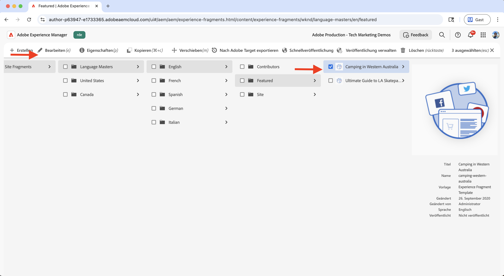

1. Klicken Sie im Editor im Abschnitt **Varianten** auf **Erstellen**, und wählen Sie **Variante** aus.\
   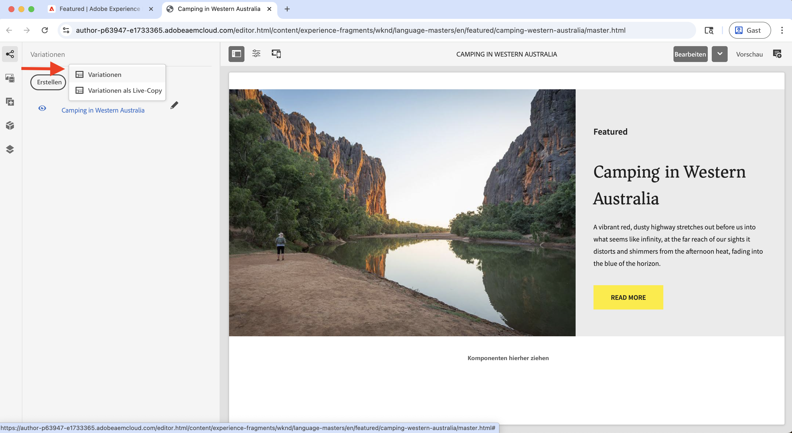

1. Im Dialogfeld **Variante erstellen**:
   - **Vorlage**: Web-Variantenvorlage für Experience Fragment
   - **Titel**: z. B. „Off the Grid“

   Klicken Sie auf **Fertig**.

   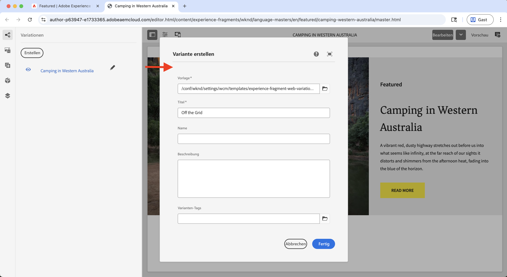

1. Erstellen Sie die Variante, indem Sie die Komponente **Teaser** aus der primären Variante kopieren und dann den Inhalt anpassen (z. B. Titel und Bild aktualisieren).\
   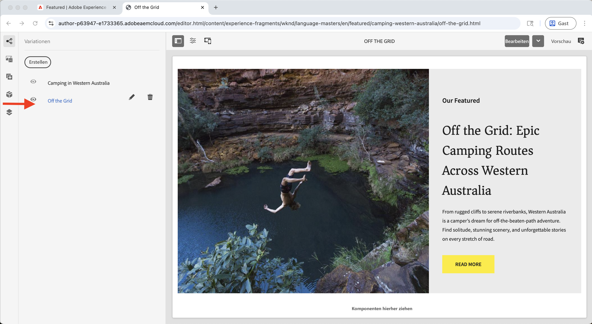

   >[!TIP]
   >Sie können [Varianten generieren](https://experience.adobe.com/aem/generate-variations/) verwenden, um schnell neue Varianten aus dem primären XF zu erstellen.

1. Wiederholen Sie die Schritte, um eine weitere Variante zu erstellen (z. B. „Wandering the Wild“).\
   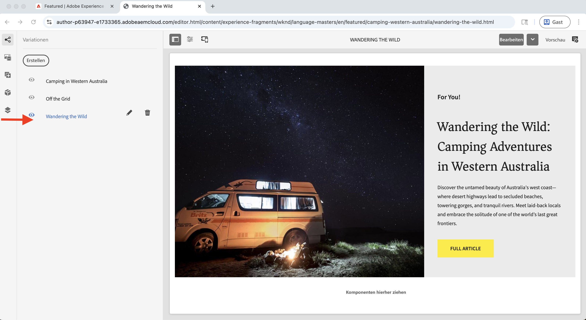

   Sie haben jetzt drei Varianten von Experience Fragments für A/B-Tests.

1. Bevor Sie Varianten mit Adobe Target anzeigen, müssen Sie den vorhandenen statischen Teaser von der Startseite entfernen. Dadurch werden doppelte Inhalte vermieden, da die Experience Fragment-Varianten dynamisch über Target eingefügt werden.

   - Navigieren Sie zur **englischen** Startseite `/content/wknd/language-masters/en`.
   - Löschen Sie im Editor die Teaser-Komponente **Camping in Western Australia**.\
     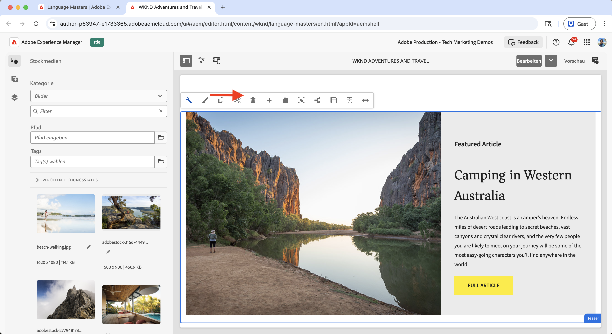

1. Stellen Sie die Änderungen auf der **US > English**-Startseite (`/content/wknd/us/en`) bereit, um die Aktualisierungen zu übertragen.\
   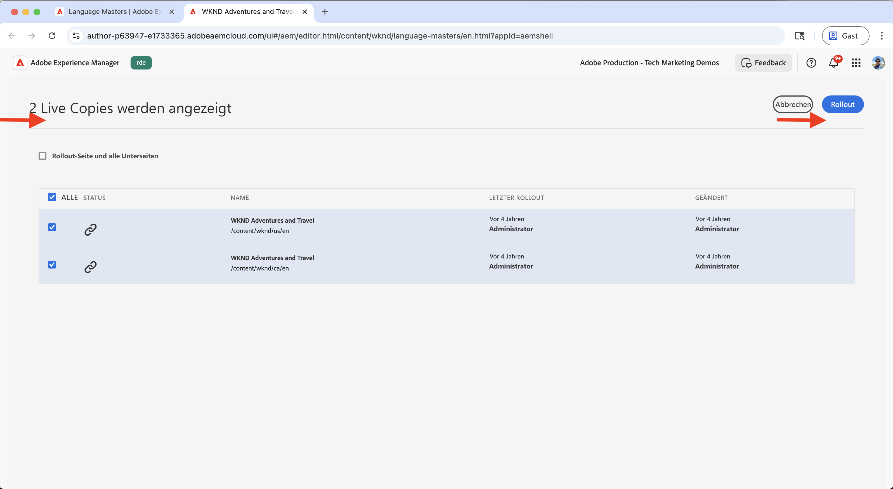

1. Veröffentlichen Sie die **US > English**-Startseite, um die Aktualisierungen live zu schalten.\
   

## Exportieren der Varianten als Angebote nach Adobe Target

Exportieren Sie die Experience Fragment-Varianten, damit sie als Angebote in Adobe Target für den A/B-Test verwendet werden können.

1. Navigieren Sie in AEM zu **Camping in Western Australia**, wählen Sie die drei Varianten aus, und klicken Sie auf **Nach Adobe Target exportieren**.\
   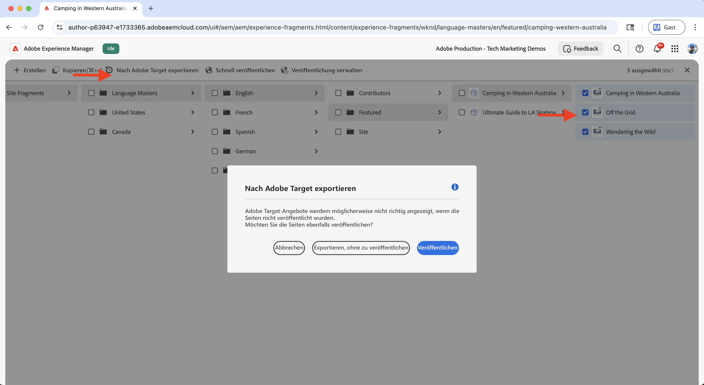

2. Navigieren Sie in Adobe Target zu **Angebote**, um zu überprüfen, ob die Varianten importiert wurden.\
   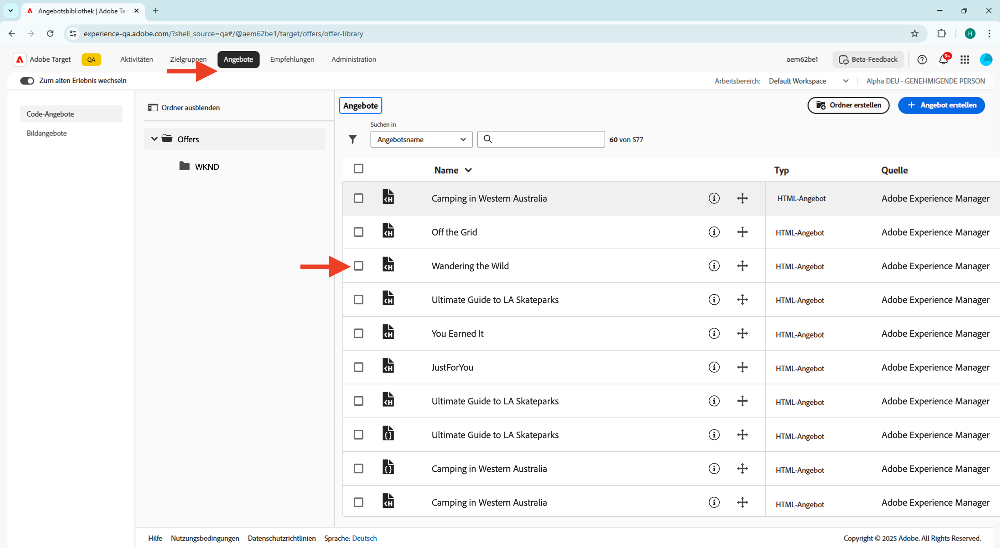

## Erstellen einer A/B-Test-Aktivität in Adobe Target

Nun erstellen Sie eine A/B-Test-Aktivität, um das Experiment auf der Startseite durchzuführen.

1. Installieren Sie die Chrome-Erweiterung [Adobe Experience Cloud Visual Editing Helper](https://chromewebstore.google.com/detail/adobe-experience-cloud-vi/kgmjjkfjacffaebgpkpcllakjifppnca).

1. Navigieren Sie in Adobe Target zu **Aktivitäten**, und klicken Sie auf **Aktivität erstellen**.\
   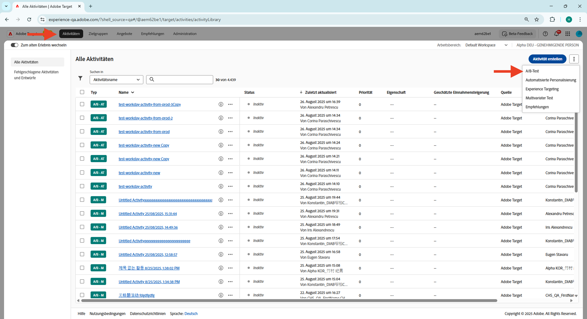

1. Geben Sie im Dialogfeld **A/B-Test-Aktivität erstellen** Folgendes ein:
   - **Typ**: Web
   - **Composer**: Visuell
   - **Aktivitäts-URL**: z. B. `https://wknd.enablementadobe.com/us/en.html`

   Klicken Sie auf **Erstellen**.

   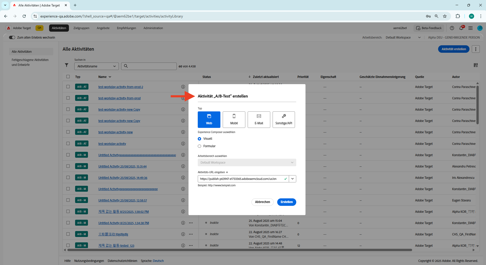

1. Geben Sie der Aktivität einen neuen, beschreibenden Namen (z. B. „WKND-Startseite A/B-Test“).\
   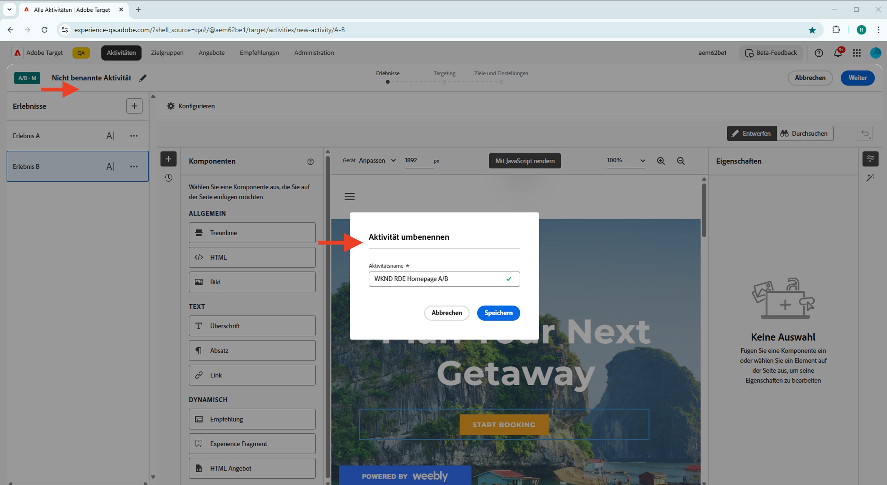

1. Fügen Sie in **Erfahrung A** die Komponente **Experience Fragment** über dem Abschnitt **Letzte Artikel** hinzu.\
   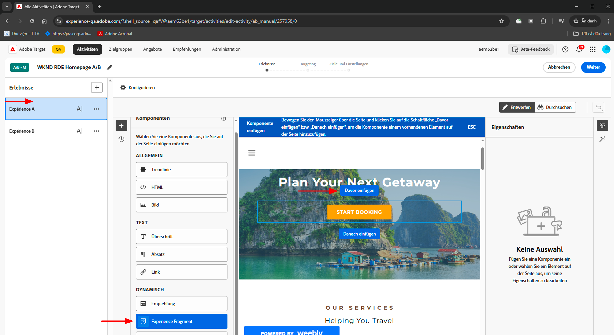

1. Klicken Sie im Komponentendialogfeld auf **Angebot auswählen**.\
   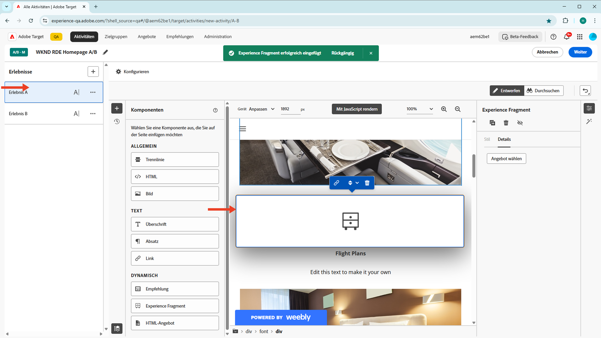

1. Wählen Sie die Variante **Camping in Western Australia**, und klicken Sie auf **Hinzufügen**.\
   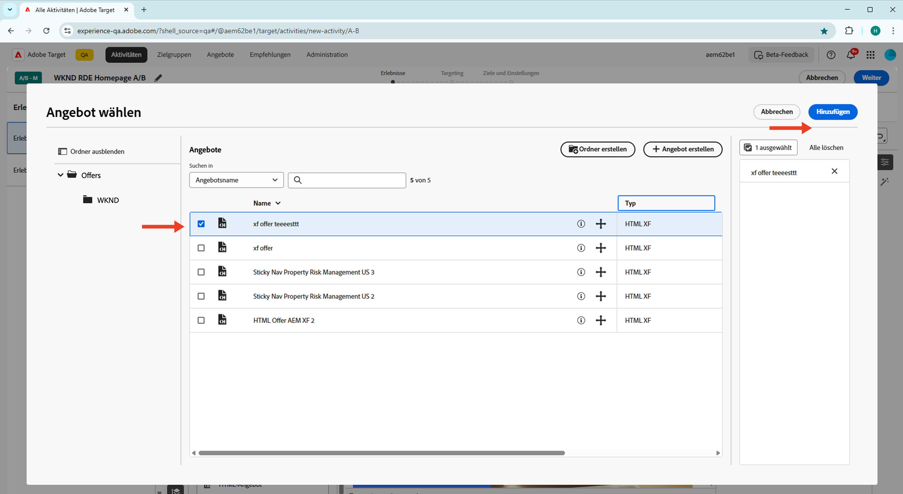

1. Wiederholen Sie den Vorgang für **Erlebnis B** und **C**, indem Sie **Off the Grid** bzw. **Wandering the Wild** auswählen.\
   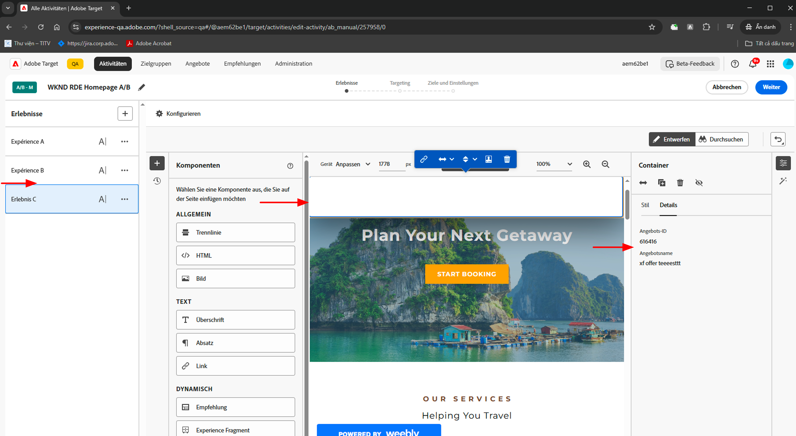

1. Überprüfen Sie im Abschnitt **Targeting**, ob der Traffic gleichmäßig auf alle Erlebnisse aufgeteilt ist.\
   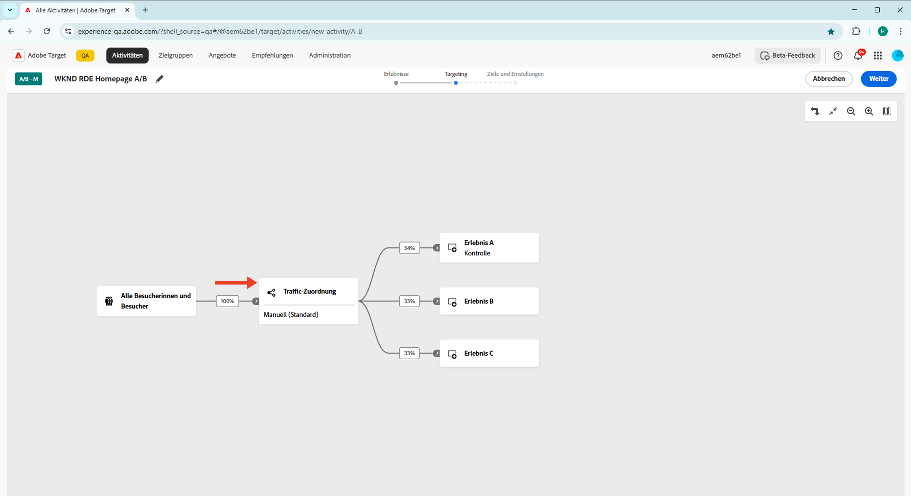

1. Definieren Sie unter **Ziele und Einstellungen** Ihre Erfolgsmetrik (z. B. CTA-Klicks auf das Experience Fragment).\
   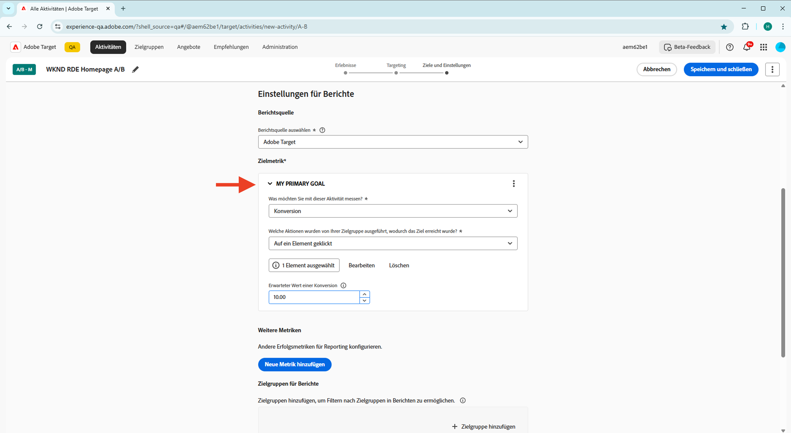

1. Klicken Sie oben rechts auf **Aktivieren**, um den Test zu starten.\
   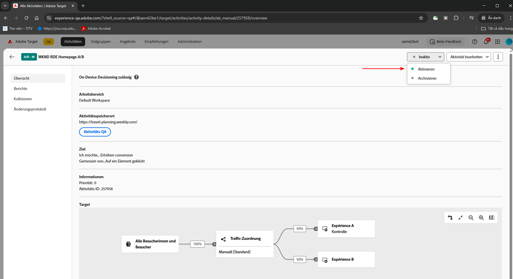

## Erstellen und Konfigurieren eines Datenstroms in Adobe Experience Platform

Um das Adobe Web SDK mit Adobe Target zu verbinden, erstellen Sie einen Datenstrom in Adobe Experience Platform. Der Datenstrom fungiert als Routing-Ebene zwischen dem Web SDK und Adobe Target.

1. Navigieren Sie in Adobe Experience Platform zu **Datenströme**, und klicken Sie auf **Datenstrom erstellen**.\
   

1. Geben Sie im Dialogfeld **Datenstrom erstellen** einen **Namen** für Ihren Datenstrom ein, und klicken Sie auf **Speichern**.\
   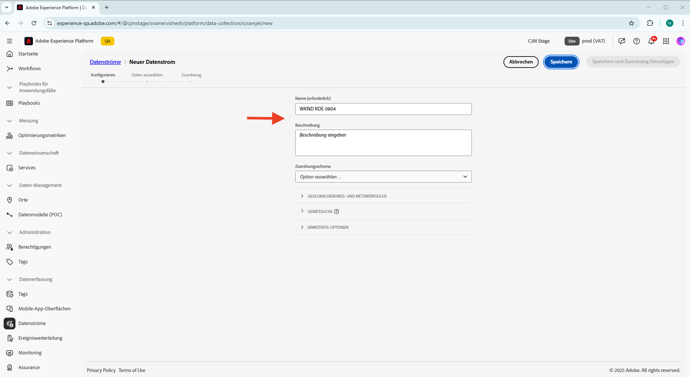

1. Nachdem der Datenstrom erstellt wurde, klicken Sie auf **Service hinzufügen**.\
   

1. Wählen Sie im Schritt **Service hinzufügen** aus dem Dropdown-Menü **Adobe Target** aus, und geben Sie die **Target-Umgebungs-ID** ein. Die Target-Umgebungs-ID finden Sie in Adobe Target unter **Administration** > **Umgebungen**. Klicken Sie auf **Speichern**, um den Service hinzuzufügen.\
   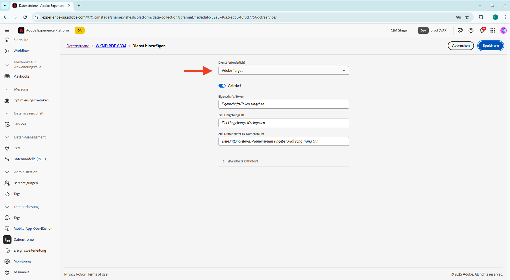

1. Überprüfen Sie die Datenstromdetails, um sicherzustellen, dass der Adobe Target-Service aufgeführt und korrekt konfiguriert ist.\
   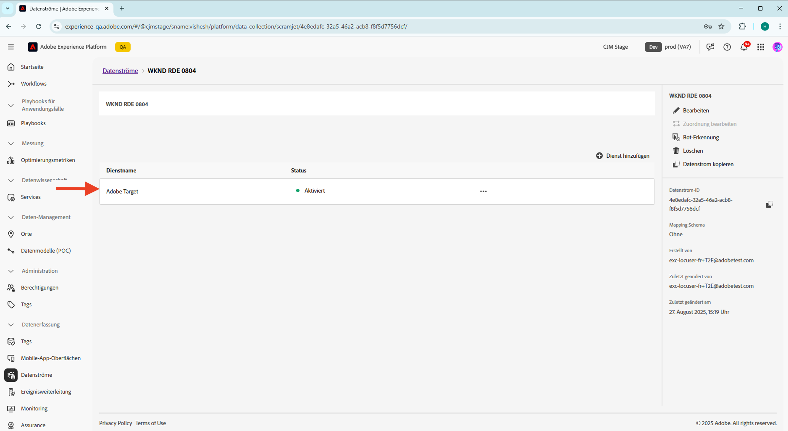

## Aktualisieren der Tags-Eigenschaft mit der Web SDK-Erweiterung

Um Personalisierungs- und Datenerfassungsereignisse von AEM-Seiten zu senden, fügen Sie die Web SDK-Erweiterung zu Ihrer Tags-Eigenschaft hinzu und konfigurieren Sie eine Regel, die beim Laden der Seite ausgelöst wird.

1. Navigieren Sie in Adobe Experience Platform zu **Tags**, und öffnen Sie die Eigenschaft, die Sie im Schritt [Integrieren in Adobe-Tags](../setup/integrate-adobe-tags.md) erstellt haben.
   

1. Klicken Sie im Menü links auf **Erweiterungen** wechseln Sie zur Registerkarte **Katalog**, und suchen Sie nach **Web SDK**. Klicken Sie im rechten Bedienfeld auf **Installieren**.\
   

1. Wählen Sie im Dialogfeld **Erweiterung installieren** den zuvor erstellten **Datenstrom**, und klicken Sie auf **Speichern**.\
   

1. Stellen Sie nach der Installation sicher, dass sowohl die **Adobe Experience Platform Web SDK**- als auch **Core**-Erweiterungen auf der Registerkarte **Installiert** angezeigt werden.\
   

1. Konfigurieren Sie als Nächstes eine Regel, die das Web SDK-Ereignis sendet, wenn die Bibliothek geladen wird. Navigieren Sie im Menü links zu **Regeln** und klicken Sie auf **Neue Regel erstellen**.

   

   >[!TIP]
   >
   >Mit einer Regel können Sie festlegen, wann und wie Tags auf der Grundlage von Benutzerinteraktionen oder Browser-Ereignissen ausgelöst werden.

1. Geben Sie auf dem Bildschirm **Regel erstellen** einen Namen für die Regel ein (z. B. `All Pages - Library Loaded - Send Event`), und klicken Sie im Abschnitt **Ereignisse** auf **+ Hinzufügen**.
   

1. Im Dialogfeld **Ereigniskonfiguration**:
   - **Erweiterung**: Wählen Sie **Core** aus.
   - **Ereignistyp**: Wählen Sie **Bibliothek geladen (Seitenanfang)** aus.
   - **Name**: Geben Sie `Core - Library Loaded (Page Top)` ein.

   Tippen Sie auf **Änderungen beibehalten**, um das Ereignis zu speichern.

   

1. Klicken Sie im Abschnitt **Aktionen** auf **+ Hinzufügen**, um die Aktion zu definieren, die beim Auslösen des Ereignisses auftritt.

1. Im Dialogfeld **Aktionskonfiguration**:
   - **Erweiterung**: Wählen Sie **Adobe Experience Platform Web SDK** aus.
   - **Aktionstyp**: Wählen Sie **Ereignis senden** aus.
   - **Name**: Wählen Sie **AEP Web SDK - Send Event** aus.

   

1. Aktivieren Sie im Bereich **Personalisierung** des rechten Bedienfelds die Option **Visuelle Personalisierungsentscheidungen rendern** aus. Klicken Sie dann auf **Änderungen beibehalten**, um die Aktion zu speichern.\
   

   >[!TIP]
   >
   >   Diese Aktion sendet beim Laden der Seite ein AEP Web SDK-Ereignis, sodass Adobe Target personalisierte Inhalte bereitstellen kann.

1. Überprüfen Sie die fertiggestellte Regel, und klicken Sie auf **Speichern**.
   

1. Um die Änderungen zu übernehmen, gehen Sie zu **Veröffentlichungsablauf** und fügen Sie die aktualisierte Regel einer **Bibliothek** hinzu.\
   

1. Stufen Sie abschließend die Bibliothek zur **Produktion** hoch.
   

## Überprüfen der Implementierung von A/B-Tests auf Ihren AEM-Seiten

Sobald die Aktivität live ist und die Tags-Bibliothek in der Produktion veröffentlicht wurde, können Sie den A/B-Test auf Ihren AEM-Seiten überprüfen.

1. Besuchen Sie die veröffentlichte Website (z. B. [WKND-Aktivierungs-Website](https://wknd.enablementadobe.com/de/de.html)), und beobachten Sie, welche Variante angezeigt wird. Versuchen Sie, über einen anderen Browser oder ein Mobilgerät darauf zuzugreifen, um alternative Varianten anzuzeigen.
   

1. Öffnen Sie die Entwickler-Tools Ihres Browsers, und wählen Sie die Registerkarte **Netzwerk** aus. Filtern Sie nach `interact`, um die Web SDK-Anfrage zu finden. Die Anfrage sollte die Web SDK-Ereignisdetails enthalten.

   

Die Antwort sollte die Personalisierungsentscheidungen enthalten, die von Adobe Target getroffen wurden, und angeben, welche Variante bereitgestellt wurde.\

1. Alternativ können Sie die Chrome-Erweiterung [Adobe Experience Platform Debugger](https://chromewebstore.google.com/detail/adobe-experience-platform/bfnnokhpnncpkdmbokanobigaccjkpob) verwenden, um die Web SDK-Ereignisse zu überprüfen.
   

## Live-Demo

Um den A/B-Test in Aktion zu sehen, besuchen Sie die [WKND-Aktivierungs-Website](https://wknd.enablementadobe.com/de/de.html) und beobachten Sie, wie verschiedene Varianten des Experience Fragments auf der Startseite angezeigt werden.

## Zusätzliche Ressourcen

- [Überblick über den A/B-Test](https://experienceleague.adobe.com/de/docs/target/using/activities/abtest/test-ab)
- [Adobe Experience Platform Web SDK](https://experienceleague.adobe.com/de/docs/experience-platform/web-sdk/home)
- [Überblick über Datenströme](https://experienceleague.adobe.com/de/docs/experience-platform/datastreams/overview)
- [Visual Experience Composer (VEC)](https://experienceleague.adobe.com/de/docs/target/using/experiences/vec/visual-experience-composer)
