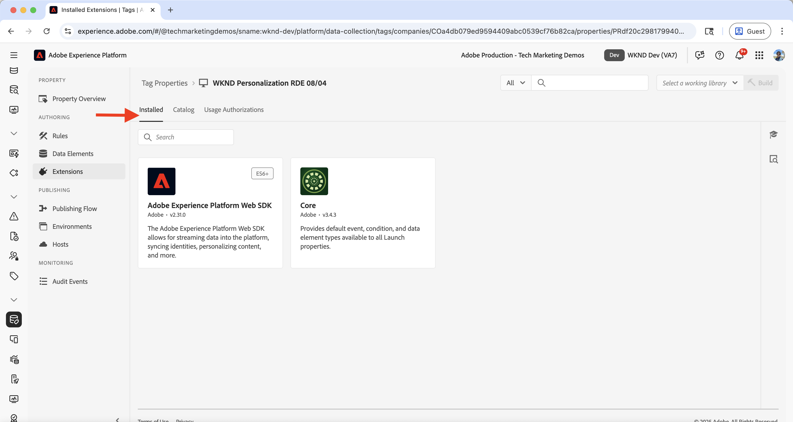

# Experimentieren (A/B-Tests)

Erfahren Sie, wie Sie mithilfe von Adobe Target verschiedene Inhaltsvarianten auf einer AEM as a Cloud Service (AEMCS)-Website testen können.

A/B-Tests helfen Ihnen, verschiedene Versionen von Inhalten zu vergleichen, um zu bestimmen, welche beim Erreichen Ihrer Geschäftsziele besser abschneiden. Häufige Szenarien sind:

- Testen von Varianten in Überschriften, Bildern oder call-to-action-Schaltflächen auf einer Landingpage
- Vergleichen verschiedener Layouts oder Designs für eine Produktdetailseite
- Bewertung von Werbeangeboten oder Rabattstrategien

## Demo-Anwendungsfall

In diesem Tutorial konfigurieren Sie A/B-Tests für das **Camping in Western Australia** Experience Fragment (XF) auf der WKND-Website. Sie erstellen drei XF-Varianten und verwalten den A/B-Test über Adobe Target.

Die Varianten werden auf der WKND-Homepage angezeigt, sodass Sie die Leistung messen und ermitteln können, welche Version zu besserer Interaktion und Konversionen führt.

Besuchen Sie die [WKND-Aktivierungs](https://wknd.enablementadobe.com/us/en.html)Website, um den A/B-Test in Aktion zu sehen.

## Voraussetzungen

Bevor Sie mit diesem Experiment-Anwendungsfall fortfahren, stellen Sie sicher, dass Sie Folgendes abgeschlossen haben:

- [Adobe Target integrieren](../setup/integrate-adobe-target.md): Ermöglicht Ihrem Team, personalisierte Inhalte zentral in AEM zu erstellen und zu verwalten und als Angebote in Adobe Target zu aktivieren.
- [Tags in Adobe Experience Platform integrieren](../setup/integrate-adobe-tags.md): Ermöglicht Ihrem Team die Verwaltung und Bereitstellung von JavaScript für Personalisierung und Datenerfassung, ohne AEM-Code erneut bereitstellen zu müssen.

## Allgemeine Schritte

Der Einrichtungsprozess von A/B-Tests umfasst sechs Hauptschritte zum Erstellen und Konfigurieren des Experiments:

1. **Erstellen von Inhaltsvarianten in AEM**
2. **Exportieren Sie die Varianten als Angebote nach Adobe Target**
3. **Erstellen einer A/B-Testaktivität in Adobe Target**
4. **Erstellen und Konfigurieren eines Datenstroms in Adobe Experience Platform**
5. **Aktualisieren Sie die Tags-Eigenschaft mit der Web SDK-Erweiterung**
6. **Überprüfen Sie die Implementierung der A/B-Tests auf Ihren AEM-Seiten**

## Erstellen von Inhaltsvarianten in AEM

In diesem Beispiel verwenden Sie das **Camping in Western Australia** Experience Fragment (XF) aus dem AEM WKND-Projekt, um drei Varianten zu erstellen, die auf der WKND-Website-Homepage für A/B-Tests verwendet werden.

1. Klicken Sie in AEM auf die Karte **Experience Fragments**, navigieren Sie zu **Camping in Western Australia** und klicken Sie auf **Bearbeiten**.
   

1. Klicken Sie im Editor im Abschnitt **Varianten** auf **Erstellen** und wählen Sie **Variante** aus.\
   

1. Im Dialogfeld **Variante erstellen**:
   - **Vorlage**: Vorlage für Experience Fragment-Web-Variation
   - **Title**: Zum Beispiel „Off the Grid“

   Klicken Sie auf **Fertig**.

   

1. Erstellen Sie die Variante, indem Sie die **Teaser**-Komponente aus der primären Variante kopieren und dann den Inhalt anpassen (z. B. Titel und Bild aktualisieren).\
   

   >[!TIP]
   >Sie können [Varianten generieren](https://experience.adobe.com/aem/generate-variations/) verwenden, um schnell neue Varianten aus der primären XF zu erstellen.

1. Wiederholen Sie die Schritte, um eine weitere Variante zu erstellen (z. B. „Wandering the Wild„).\
   

   Sie haben jetzt drei Varianten von Experience Fragments für A/B-Tests.

1. Bevor Sie Varianten mit Adobe Target anzeigen, müssen Sie den vorhandenen statischen Teaser von der Homepage entfernen. Dadurch werden doppelte Inhalte vermieden, da die Experience Fragment-Varianten dynamisch über Target eingefügt werden.

   - Navigieren Sie zur **Englisch** Homepage `/content/wknd/language-masters/en`
   - Löschen Sie im Editor die Teaser **Komponente „Camping in Western Australia** .\
     

1. Führen Sie ein Rollout der Änderungen auf der **US > Englisch** Homepage (`/content/wknd/us/en`) durch, um die Aktualisierungen weiterzugeben.\
   

1. Veröffentlichen Sie die **USA > Englisch**-Homepage, um die Aktualisierungen live zu schalten.\
   

## Exportieren der Varianten als Angebote nach Adobe Target

Exportieren Sie die Experience Fragment-Varianten, damit sie als Angebote in Adobe Target für den A/B-Test verwendet werden können.

1. Navigieren Sie in AEM zu **Camping in Western Australia** wählen Sie die drei Varianten aus und klicken Sie auf **Nach Adobe Target exportieren**.\
   

2. Navigieren Sie in Adobe Target zu **Angebote** und bestätigen Sie, dass die Varianten importiert wurden.\
   

## Erstellen einer A/B-Test -Aktivität in Adobe Target

Erstellen Sie jetzt eine A/B-Test -Aktivität, um das Experiment auf der Homepage auszuführen.

1. Installieren Sie die Erweiterung [Adobe Experience Cloud Visual Editing Helper](https://chromewebstore.google.com/detail/adobe-experience-cloud-vi/kgmjjkfjacffaebgpkpcllakjifppnca) Chrome .

1. Navigieren Sie in Adobe Target zu **Aktivitäten** und klicken Sie auf **Aktivität erstellen**.\
   

1. Geben Sie **Dialogfeld A/B** Testaktivität erstellen Folgendes ein:
   - **Typ**: Web
   - **Composer**: Visual
   - **Aktivitäts-URL**: z. B. `https://wknd.enablementadobe.com/us/en.html`

   Klicken Sie auf **Erstellen**.

   

1. Benennen Sie die Aktivität in etwas Bedeutsames um (z. B. „WKND Homepage A/B-Test„).\
   

1. Fügen Sie **Experience A** die Komponente **Experience Fragment** über dem Abschnitt **Letzte Artikel** hinzu.\
   

1. Klicken Sie im Komponentendialogfeld auf **Angebot auswählen**.\
   

1. Wählen Sie die Variante **Camping in Western Australia** und klicken Sie auf **Hinzufügen**.\
   

1. Wiederholen Sie den Vorgang für **Erlebnis B** und **C**, indem Sie **Off the Grid** bzw. **Wandering the Wild** auswählen.\
   

1. Bestätigen Sie im **Targeting**, dass der Traffic gleichmäßig auf alle Erlebnisse aufgeteilt ist.\
   

1. Definieren **unter „Ziele** Einstellungen“ Ihre Erfolgsmetrik (z. B. CTA-Klicks auf das Experience Fragment).\
   

1. Klicken **oben rechts** „Aktivieren“, um den Test zu starten.\
   

## Erstellen und Konfigurieren eines Datenstroms in Adobe Experience Platform

Um Adobe Web SDK mit Adobe Target zu verbinden, erstellen Sie einen Datenstrom in Adobe Experience Platform. Der Datenstrom fungiert als Routing-Ebene zwischen der Web-SDK und Adobe Target.

1. Navigieren Sie in Adobe Experience Platform zu **Datenströme** und klicken Sie auf **Datenstrom erstellen**.\
   

1. Geben **im Dialogfeld &quot;** erstellen“ einen **Namen** für Ihren Datenstrom ein und klicken Sie auf **Speichern**.\
   

1. Nachdem der Datenstrom erstellt wurde, klicken Sie auf **Service hinzufügen**.\
   

1. Wählen Sie im **Service hinzufügen** aus dem Dropdown-Menü die **&#x200B;**&#x200B;Adobe Target und geben Sie die **Target-Umgebungs-ID** ein. Die ID der Zielumgebung finden Sie in Adobe Target unter **Administration** > **Umgebungen**. Klicken Sie **Speichern**, um den Dienst hinzuzufügen.\
   

1. Überprüfen Sie die Datenstromdetails, um sicherzustellen, dass der Adobe Target-Service aufgeführt und korrekt konfiguriert ist.\
   

## Aktualisieren der Tags-Eigenschaft mit der Web SDK-Erweiterung

Um Personalisierungs- und Datenerfassungsereignisse von AEM-Seiten zu senden, fügen Sie die Web-SDK-Erweiterung zu Ihrer Tags-Eigenschaft hinzu und konfigurieren Sie eine Regel, die beim Laden der Seite Trigger auslöst.

1. Navigieren Sie in Adobe Experience Platform zu **Tags** und öffnen Sie die Eigenschaft, die Sie im Schritt [Integrieren von Adobe-Tags](../setup/integrate-adobe-tags.md) erstellt haben.
   

1. Klicken Sie im Menü links auf **Erweiterungen** wechseln Sie zur Registerkarte **Katalog** und suchen Sie nach **Web SDK**. Klicken **im rechten Bedienfeld** Installieren“.\
   

1. Wählen **Dialogfeld Erweiterung installieren** den zuvor erstellten **Datenstrom** und klicken Sie auf **Speichern**.\
   

1. Stellen Sie nach der Installation sicher, dass sowohl die **Adobe Experience Platform Web SDK**- als auch **Core**-Erweiterungen auf der Registerkarte **Installiert** angezeigt werden.\
   

1. Konfigurieren Sie als Nächstes eine Regel, die das Web-SDK-Ereignis sendet, wenn die Bibliothek geladen wird. Navigieren Sie **Menü links zu** Regeln“ und klicken Sie auf **Neue Regel erstellen**.

   

   >[!TIP]
   >
   >Mit einer Regel können Sie festlegen, wann und wie Tags auf der Grundlage von Benutzerinteraktionen oder Browser-Ereignissen ausgelöst werden.

1. Geben **im Bildschirm „Regel erstellen** einen Regelnamen ein (z. B. `All Pages - Library Loaded - Send Event`) und klicken Sie auf **+ Hinzufügen** unter dem Abschnitt **Ereignisse**.
   

1. Im Dialogfeld **Ereigniskonfiguration**:
   - **Erweiterung**: Wählen Sie **Core**
   - **Ereignistyp**: Wählen Sie **Bibliothek geladen (Seitenanfang)**
   - **name**: `Core - Library Loaded (Page Top)` eingeben

   Klicken Sie auf **Änderungen beibehalten**, um das Ereignis zu speichern.

   

1. Klicken Sie im **Aktionen** auf **+ Hinzufügen** um die Aktion zu definieren, die beim Auslösen des Ereignisses auftritt.

1. Im Dialogfeld **Aktionskonfiguration**:
   - **Erweiterung**: **Adobe Experience Platform Web SDK auswählen**
   - **Aktionstyp**: Wählen Sie **Ereignis senden**
   - **Name**: **AEP Web SDK - Ereignis senden auswählen**

   

1. Aktivieren Sie im Bereich **Personalization** des rechten Bedienfelds die Option **Visuelle Personalisierungsentscheidungen rendern**. Klicken Sie dann auf **Änderungen beibehalten**, um die Aktion zu speichern.\
   

   >[!TIP]
   >
   >   Diese Aktion sendet beim Laden der Seite ein AEP Web SDK-Ereignis, sodass Adobe Target personalisierte Inhalte bereitstellen kann.

1. Überprüfen Sie die abgeschlossene Regel und klicken Sie auf **Speichern**.
   

1. Um die Änderungen anzuwenden, gehen Sie zu **Veröffentlichungsfluss** und fügen Sie die aktualisierte Regel einer **Bibliothek** hinzu.\
   

1. Leiten Sie abschließend die Bibliothek nach &quot;**&quot;**.
   

## Überprüfen der Implementierung von A/B-Tests auf Ihren AEM-Seiten

Sobald die Aktivität live ist und die Tags-Bibliothek in der Produktionsumgebung veröffentlicht wurde, können Sie den A/B-Test auf Ihren AEM-Seiten überprüfen.

1. Besuchen Sie die veröffentlichte Site (z. B. [WKND-Aktivierungs-](https://wknd.enablementadobe.com/us/en.html)) und beobachten Sie, welche Variante angezeigt wird. Versuchen Sie, über einen anderen Browser oder ein Mobilgerät darauf zuzugreifen, um alternative Varianten anzuzeigen.
   

1. Öffnen Sie die Entwickler-Tools Ihres Browsers und überprüfen Sie die Registerkarte **Netzwerk** . Filtern Sie nach `interact`, um die Web-SDK-Anfrage zu finden. Die Anfrage sollte die Web-SDK-Ereignisdetails enthalten.

   

Die Antwort sollte die Personalisierungsentscheidungen enthalten, die von Adobe Target getroffen wurden, und angeben, welche Variante bereitgestellt wurde.\

1. Alternativ können Sie die Chrome-Erweiterung [Adobe Experience Platform Debugger](https://chromewebstore.google.com/detail/adobe-experience-platform/bfnnokhpnncpkdmbokanobigaccjkpob) verwenden, um die Web-SDK-Ereignisse zu überprüfen.
   

## Live-Demo

Um den A/B-Test in Aktion zu sehen, besuchen Sie die [WKND-Aktivierungs](https://wknd.enablementadobe.com/us/en.html)Website und beobachten Sie, wie verschiedene Varianten des Experience Fragments auf der Homepage angezeigt werden.

## Zusätzliche Ressourcen

- [A/B-Test - Übersicht](https://experienceleague.adobe.com/en/docs/target/using/activities/abtest/test-ab)
- [Adobe Experience Platform Web SDK](https://experienceleague.adobe.com/en/docs/experience-platform/web-sdk/home)
- [Datenströme - Übersicht](https://experienceleague.adobe.com/en/docs/experience-platform/datastreams/overview)
- [Visual Experience Composer (VEC)](https://experienceleague.adobe.com/en/docs/target/using/experiences/vec/visual-experience-composer)