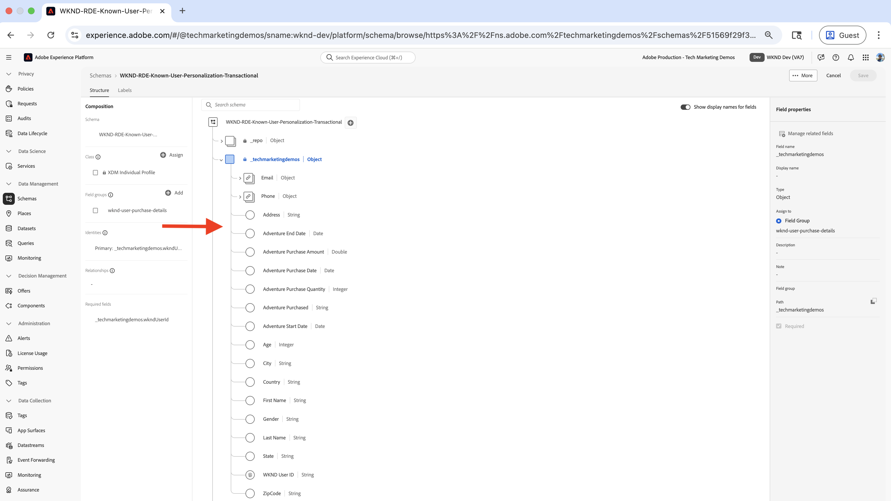
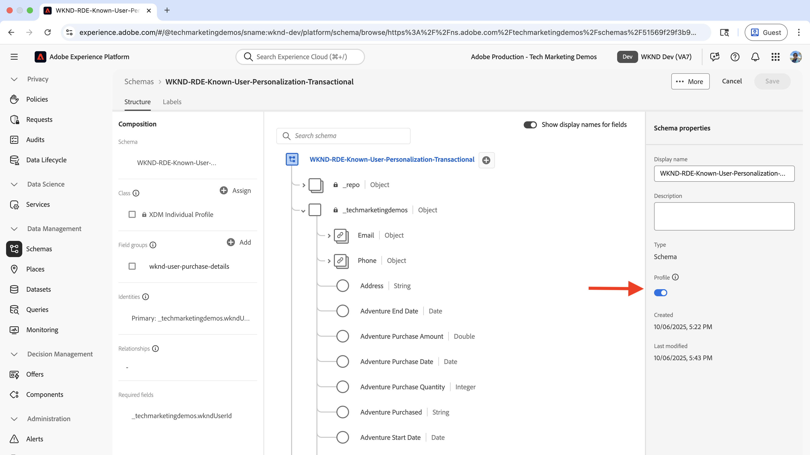
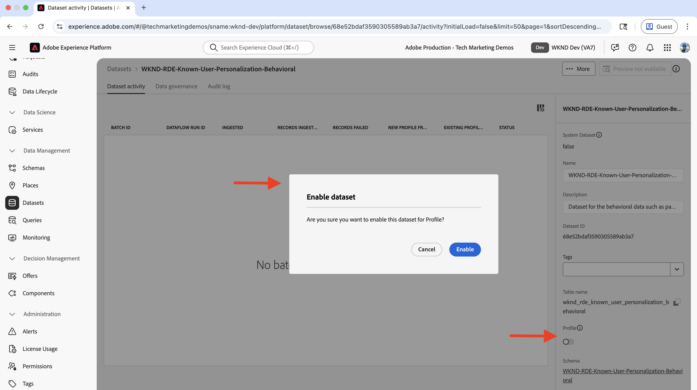
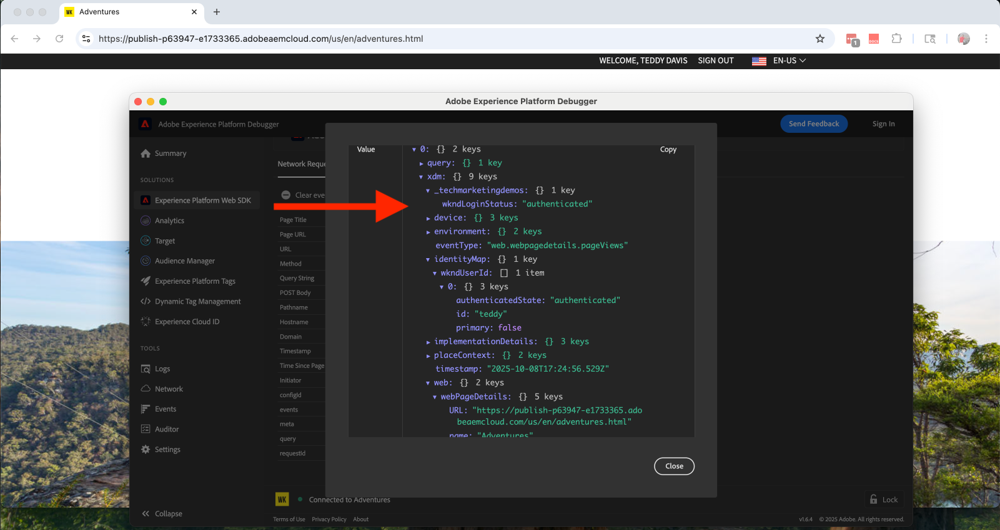
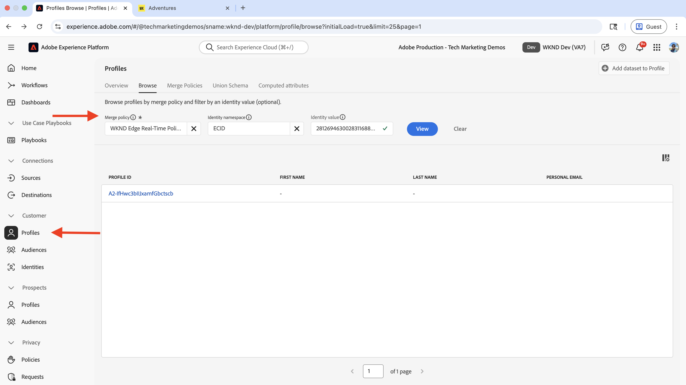

# Personalisierung für bekannte Benutzende

Erfahren Sie, wie Sie Inhalte basierend auf bekannten Benutzerdaten wie Kaufverlauf, CRM-Daten oder anderen Daten, die über den Benutzer erfasst werden, personalisieren können.

Mit der bekannten Benutzerpersonalisierung können Sie Benutzern personalisierte Erlebnisse bereitstellen, die auf Daten basieren, die Sie über sie erfasst haben. Die _Benutzerdaten konnten über verschiedene Systeme oder Kanäle_ Website, Mobile App, Callcenter usw. erfasst werden. Diese _Daten werden dann zusammengefügt, um ein vollständiges Benutzerprofil zu erstellen_ und zur Personalisierung der Erlebnisse verwendet.

Zu häufigen Szenarien gehören:

- **Inhaltspersonalisierung**: Zeigt personalisierte Erlebnisse basierend auf den Profildaten des Benutzers an. Zeigen Sie beispielsweise einen personalisierten Helden auf der Startseite an, basierend auf dem Kaufverlauf des Benutzers.
- **Upsell und Crosssell**: Anzeige personalisierter Upsell- und Crosssell-Empfehlungen basierend auf dem Kaufverlauf des Benutzers. Zeigen Sie beispielsweise eine personalisierte Upsell-Empfehlung für den Kaufverlauf des Benutzers an.
- **Treueprogramm**: Zeigt personalisierte Vorteile des Treueprogramms basierend auf dem Kaufverlauf des Benutzers an. Zeigen Sie beispielsweise einen personalisierten Treueprogramm-Vorteil für den Kaufverlauf des Benutzers an.

In Ihrer Organisation gibt es möglicherweise verschiedene Anwendungsfälle für die Personalisierung bekannter Benutzender. Die obigen sind nur einige Beispiele.

## Anwendungsbeispiel


In diesem Tutorial unter Verwendung der [Beispiel-WKND-Site](https://github.com/adobe/aem-guides-wknd) zeigt der Prozess, wie **angemeldete**, die ein **Ski**-Abenteuer erworben haben, einen personalisierten Helden auf der **WKND-Startseite**.

Das Hero-Erlebnis versucht _die_ Skiausrüstung an die Benutzer zu verkaufen, die ein **-Ski-** gekauft haben. Die Benutzer, die noch kein **Ski**-Abenteuer gekauft haben, sehen den standardmäßigen Hero-Inhalt. Daher wird das Hero-Erlebnis für die Benutzer basierend auf ihrem Kaufverlauf und Anmeldestatus personalisiert. Um diese Personalisierung zu ermöglichen, werden Daten aus verschiedenen Systemen zusammengeführt, sodass ein vollständiges Kundenprofil erstellt und für Personalisierungsaktivitäten verwendet werden kann.


### Benutzerdaten-Management in allen Systemen

Nehmen wir zu Demozwecken an, dass WKND-Benutzerdaten in den folgenden Systemen vorhanden sind. Jedes System speichert verschiedene Datentypen, die in zwei Kategorien unterteilt werden können:

- **Verhaltensdaten**: Erfasst Benutzerinteraktionen und -aktivitäten auf digitalen Kanälen (Seitenansichten, Klicks, Site-Navigation, Anmeldestatus, Browser-Muster)
- **Transaktionsdaten**: Erfasst abgeschlossene Geschäftstransaktionen und Kundenprofilinformationen (Bestellungen, Auftragsverlauf, Profildetails, Voreinstellungen)

| System | Zweck | Welche Daten werden gespeichert? | Datentyp |
|------|------|------|------|
| AEM | Content Management System (CMS), Adventure-Listen und -Buchungen sowie Anmeldefunktionen | Benutzerinteraktionen: Seitenansichten, Anmeldestatus, Site-Navigation. Minimale Benutzerkennung wie Benutzer-ID, Name, E-Mail. | Verhaltensdaten |
| Andere Systeme | Benutzerprofil- und Kauftransaktionsdatensätze als vollständiges Aufzeichnungssystem. | Vervollständigen Sie Kundenprofile: Benutzer-ID, Name, Adresse, Telefonnummer, Kaufverlauf, Bestelldetails, Voreinstellungen. | Transaktionsdaten |

Das andere System kann ein Order Management-System (OMS), ein CRM-System (Customer Relationship Management), ein MDM-System (Master Data Management) oder ein anderes System sein, das die Transaktionsdaten speichert.

Es wird außerdem davon ausgegangen, dass die WKND-Site über eine Benutzeroberfläche (User Interface, UI) verfügt, über die Benutzende die (Adventures **kaufen/** können. Der AEM ist in das andere System integriert, um die Daten des Adventure-Kaufs zu speichern. Außerdem hat der Benutzer vor oder während des Kaufs ein Konto auf der WKND-Site erstellt.

Das logische Diagramm zeigt die Benutzerinteraktion mit der WKND-Site und wie Verhaltens- und Transaktionsdaten erfasst und in die Experience Platform eingespeist werden.


Dies ist eine zu vereinfachte Version, um das Konzept der Personalisierung für bekannte Benutzende zu demonstrieren. In einem realen Szenario verfügen Sie möglicherweise über mehrere Systeme, in denen Verhaltens- und Transaktionsdaten erfasst und gespeichert werden.

### Haupterkenntnisse

- **Verteilte Datenspeicherung**: Benutzerdaten werden auf mehreren Systemen gespeichert - AEM speichert für die Anmeldefunktion nur minimale Benutzerdaten (Benutzer-ID, Name, E-Mail), während andere Systeme (OMS, CRM, MDM) vollständige Benutzerprofile und Transaktionsdaten wie den Kaufverlauf verwalten.
- **Identitätszusammenfügung**: Systeme werden mithilfe einer gemeinsamen Kennung (WKND-Benutzer-ID - `wkndUserId`) verknüpft, mit der Benutzende über verschiedene Plattformen und Kanäle hinweg eindeutig identifiziert werden.
- **Vollständige Profilerstellung**: Ziel ist es, Benutzerdaten aus diesen verteilten Systemen zusammenzufügen, um ein einheitliches Kundenprofil zu erstellen, das dann zur Bereitstellung personalisierter Erlebnisse verwendet wird.

Ihr Anwendungsfall kann unterschiedliche Systeme und Datenspeicher aufweisen. Entscheidend ist, eine gemeinsame Kennung zu identifizieren, mit der Benutzende über verschiedene Plattformen und Kanäle hinweg eindeutig identifiziert werden können.

## Voraussetzungen

Bevor Sie mit dem Anwendungsfall „Personalisierung für bekannte Benutzende“ fortfahren, stellen Sie sicher, dass Sie Folgendes abgeschlossen haben:

- [Adobe Target-Integration](../setup/integrate-adobe-target.md): Ermöglicht es Teams, personalisierte Inhalte zentral in AEM zu erstellen und zu verwalten und als Angebote in Adobe Target zu aktivieren.
- [Integration von Tags in Adobe Experience Platform](../setup/integrate-adobe-tags.md): Ermöglicht Teams die Verwaltung und Bereitstellung von JavaScript für die Personalisierung und Datenerfassung, ohne AEM-Code erneut bereitstellen zu müssen.

Machen Sie sich auch mit den Konzepten von [Adobe Experience Cloud Identity Service (ECID)](https://experienceleague.adobe.com/de/docs/id-service/using/home) und [Adobe Experience Platform](https://experienceleague.adobe.com/de/docs/experience-platform/landing/home) vertraut, z. B. Schema, Datensatz, Datenstrom, Zielgruppen, Identitäten und Profile.

In diesem Tutorial erfahren Sie mehr über das Zusammenfügen von Identitäten und das Erstellen eines Kundenprofils in Adobe Experience Platform. Daher werden die Verhaltensdaten mit den Transaktionsdaten kombiniert, um ein vollständiges Kundenprofil zu erstellen.

## Allgemeine Schritte

Der Einrichtungsprozess der bekannten Benutzerpersonalisierung umfasst Schritte in Adobe Experience Platform, AEM und Adobe Target.

1. **In Adobe Experience Platform:**
   1. Erstellen _Identity-Namespace_ für die WKND-Benutzer-ID (`wkndUserId`)
   1. Erstellen und konfigurieren Sie zwei XDM-Schemas (Experience-Datenmodell) - standardisierte Datenstrukturen, die definieren, wie Daten organisiert und validiert werden - eines für die Verhaltensdaten und eines für die Transaktionsdaten
   1. Erstellen und konfigurieren Sie zwei Datensätze, einen für die Verhaltensdaten und einen für die Transaktionsdaten
   1. Erstellen und Konfigurieren eines Datenstroms
   1. Erstellen und Konfigurieren einer Tag-Eigenschaft
   1. Konfigurieren der Zusammenführungsrichtlinie für das Profil
   1. Einrichten des Adobe Target-Ziels (V2)

2. **In AEM:**
   1. Erweitern Sie die Funktion WKND Site Login , um die Benutzer-ID im Sitzungsspeicher des Browsers zu speichern.
   1. Integrieren und Einfügen der Tags-Eigenschaft in AEM-Seiten
   1. Überprüfen der Datenerfassung auf AEM-Seiten
   1. Integrieren in Adobe Target
   1. Personalisierte Angebote erstellen

3. **In Adobe Experience Platform:**
   1. Überprüfen der Verhaltensdaten und Profilerstellung
   1. Transaktionsdaten aufnehmen
   1. Überprüfen der Zuordnung von Verhaltens- und Transaktionsdaten
   1. Erstellen und Konfigurieren einer Zielgruppe
   1. Zielgruppe für Adobe Target aktivieren

4. **In Adobe Target:**
   1. Überprüfen der Zielgruppen und Angebote
   1. Erstellen und Konfigurieren einer Aktivität

5. **Überprüfen Sie die Personalisierungsimplementierung für bekannte Benutzende auf Ihren AEM-Seiten**

Die verschiedenen Lösungen von Adobe Experience Platform (AEP) werden verwendet, um Benutzerdaten systemübergreifend zu erfassen, zu verwalten, zu identifizieren und zusammenzufügen. Mithilfe der zusammengefügten Benutzerdaten werden die Zielgruppen in Adobe Target erstellt und aktiviert. Mithilfe von Aktivitäten in Adobe Target werden personalisierte Erlebnisse für Benutzende bereitgestellt, die den Zielgruppenkriterien entsprechen.

## Adobe Experience Platform-Setup

Um ein vollständiges Kundenprofil zu erstellen, müssen sowohl Verhaltensdaten (Seitenansichtsdaten) als auch Transaktionsdaten (WKND-Adventure-Kaufdaten) erfasst und gespeichert werden. Die Verhaltensdaten werden mit der Tags-Eigenschaft erfasst, und die Transaktionsdaten werden mit dem WKND-Adventure-Kaufsystem erfasst.

Die Transaktionsdaten werden dann in die Experience Platform aufgenommen und mit den Verhaltensdaten verknüpft, um ein vollständiges Kundenprofil zu erstellen.

In diesem Beispiel werden zur Kategorisierung von Benutzenden, die ein **Ski**-Adventure gekauft haben, Seitenansichtsdaten zusammen mit ihren Adventure-Kaufdaten benötigt. Die Daten werden mithilfe der WKND-Benutzer-ID (`wkndUserId`) zusammengeführt, die systemübergreifend eine gemeinsame Kennung ist.

Melden Sie sich zunächst bei Adobe Experience Platform an, um die erforderlichen Komponenten zum Erfassen und Zusammenfügen der Daten einzurichten.

Melden Sie sich bei [Adobe Experience Cloud](https://experience.adobe.com/) an und navigieren Sie über **App Switcher oder den Abschnitt Schnellzugriff zu** Experience Platform.


### Identity-Namespace erstellen

Ein Identity-Namespace ist ein logischer Container, der Kontext für Identitäten bereitstellt und Experience Platform dabei hilft zu verstehen, welches ID-System verwendet wird (z. B. E-Mail, CRM-ID oder Treueprogramm-ID). Um zwei oder mehr einzelne Profildaten zu verknüpfen, wird ein Identity-Namespace verwendet. Wenn diese beiden separaten Profildaten denselben Wert für ein -Attribut aufweisen und denselben Namespace teilen, werden sie zusammengeführt. Um ein Attribut als Identitätszuordnungsattribut zu qualifizieren, müssen sie demselben Namespace angehören.

In diesem Beispiel ist die WKND-Benutzer-ID (`wkndUserId`) die allgemeine Kennung für Verhaltens- und Transaktionsdaten. Mit dieser allgemeinen Kennung werden die Daten zusammengefügt, um ein vollständiges Kundenprofil zu erstellen.

Erstellen wir einen Identity-Namespace für die WKND-Benutzer-ID (`wkndUserId`).

- Klicken Sie in **&#x200B;**&#x200B;Adobe Experience Platform **im** Navigationsbereich auf „Identitäten“. Klicken Sie dann oben **auf die Schaltfläche** Identity-Namespace erstellen“.

  

- Geben **im Dialogfeld** Identity-Namespace erstellen“ Folgendes ein:
   - **Anzeigename**: WKND-Benutzer-ID
   - **Beschreibung**: Benutzer-ID oder Benutzername des angemeldeten WKND-Benutzers
   - **Typ auswählen**: Individuelle geräteübergreifende ID

  Klicken Sie **Erstellen**, um den Identity-Namespace zu erstellen.

  

### Erstellen von Schemata

Ein Schema definiert die Struktur und das Format von Daten, die Sie in Adobe Experience Platform erfassen. Dies stellt die Datenkonsistenz sicher und ermöglicht es Ihnen, basierend auf standardisierten Datenfeldern aussagekräftige Zielgruppen zu erstellen. Für die Personalisierung bekannter Benutzender sind zwei Schemata erforderlich, eines für die Verhaltensdaten und eines für die Transaktionsdaten.

#### Schema für Verhaltensdaten

Erstellen Sie zunächst ein Schema zur Erfassung von Verhaltensdaten wie Seitenansichtsereignissen und Benutzerinteraktionen.

- Adobe Experience Platform Klicken Sie in **&#x200B;**&#x200B;im linken Navigationsbereich auf **Schemata** und dann oben rechts auf die Schaltfläche **Schema erstellen** . Wählen Sie dann die Option **Manuell** und klicken Sie auf die Schaltfläche **Auswählen**.

  

- Wählen Sie im **Schema erstellen**-Assistenten für **Schema-**) die Option **Erlebnisereignis** (für Zeitreihendaten wie Seitenansichten, Klicks und Benutzerinteraktionen) aus und klicken Sie auf **Weiter**.

  

- Geben Sie für den Schritt **Benennen und überprüfen** Folgendes ein:
   - **Anzeigename des Schemas**: WKND-RDE-known-user-Personalization-Behavioral
   - **Ausgewählte Klasse**: XDM ExperienceEvent

  

- Aktualisieren Sie das Schema wie folgt:
   - **Feldergruppen hinzufügen**: AEP Web SDK ExperienceEvent
   - **Profil**: Aktivieren

  Klicken Sie auf **Speichern**, um das Schema zu erstellen.

  

- Um festzustellen, ob der Benutzer angemeldet (authentifiziert) oder anonym ist, fügen Sie dem Schema ein benutzerdefiniertes Feld hinzu. In diesem Anwendungsbeispiel besteht das Ziel darin, den Inhalt für bekannte Benutzer zu personalisieren, die ein beliebiges „Ski **-Abenteuer** haben. Daher ist es wichtig zu ermitteln, ob der Benutzer angemeldet (authentifiziert) oder anonym ist.


   - Klicken Sie auf die Schaltfläche **+** neben dem Schemanamen.
   - Geben Sie **Abschnitt** Feldeigenschaften“ Folgendes ein:
      - **Feldname**: wkndLoginStatus
      - **Anzeigename**: WKND-Anmeldestatus
      - **Typ**: Zeichenfolge
      - **Zuweisen zu**: Feldergruppe > `wknd-user-details`

     Scrollen Sie nach unten und klicken Sie auf die Schaltfläche **Anwenden**.

     

- Das endgültige Schema für Verhaltensdaten sollte wie folgt aussehen:

  

#### Transaktionsdatenschema

Erstellen Sie als Nächstes ein Schema zur Erfassung der Transaktionsdaten wie WKND Adventure-Käufe.

- Wählen Sie im **Schema erstellen**-Assistenten für **Schema-**) die Option **Individuelles Profil** (für datensatzbasierte Daten wie Kundenattribute, Voreinstellungen und Kaufverlauf) und klicken Sie auf **Weiter**.

  

- Geben Sie für den Schritt **Benennen und überprüfen** Folgendes ein:
   - **Anzeigename des Schemas**: WKND-RDE-known-user-Personalization-transaction
   - **Klasse ausgewählt**: Individuelles XDM-Profil

  

- Um die WKND-Adventure-Kaufdetails eines Benutzers zu speichern, fügen wir zunächst ein benutzerdefiniertes Feld hinzu, das als Kennung für den Kauf dient. Denken Sie daran, dass die WKND-Benutzer-ID (`wkndUserId`) die allgemeine Kennung in allen Systemen ist.
   - Klicken Sie auf die Schaltfläche **+** neben dem Schemanamen.
   - Geben Sie **Abschnitt** Feldeigenschaften“ Folgendes ein:
      - **Feldname**: wkndUserId
      - **Anzeigename**: WKND-Benutzer-ID
      - **Typ**: Zeichenfolge
      - **Zuweisen zu**: Feldergruppe > `wknd-user-purchase-details`

  

   - Scrollen Sie nach unten, überprüfen Sie **Identität**, überprüfen Sie **die Primäre Identität** (die Hauptkennung, die zum Zusammenfügen von Daten aus verschiedenen Quellen zu einem einheitlichen Profil verwendet wird) und wählen Sie im Dropdown-**Identity-Namespace** die Option **WKND-Benutzer-ID** aus. Klicken Sie abschließend auf die Schaltfläche **Anwenden**.

  

- Nach dem Hinzufügen des benutzerdefinierten primären Identitätsfelds sollte das Schema wie folgt aussehen:

  

- Fügen Sie entsprechend die folgenden Felder hinzu, um zusätzliche Benutzer- und Adventure-Kaufdetails zu speichern:

  | Feldname | Anzeigename | Typ | Zuweisen zu |
  |----------|------------|----|---------|
  | AdventurePurchased | Erworbenes Adventure | Zeichenfolge | Feldergruppe > `wknd-user-purchase-details` |
  | adventurePurchaseAmount | Erlebniskaufbetrag | Double | Feldergruppe > `wknd-user-purchase-details` |
  | adventurePurchaseQuantity | Erlebniskaufmenge | Ganzzahl | Feldergruppe > `wknd-user-purchase-details` |
  | adventurePurchaseDate | Erlebniskaufdatum | Datum | Feldergruppe > `wknd-user-purchase-details` |
  | adventureStartDate | Startdatum des Adventures | Datum | Feldergruppe > `wknd-user-purchase-details` |
  | adventureEndDate | Enddatum des Adventures | Datum | Feldergruppe > `wknd-user-purchase-details` |
  | firstName | Vorname | Zeichenfolge | Feldergruppe > `wknd-user-purchase-details` |
  | lastName | Nachname | Zeichenfolge | Feldergruppe > `wknd-user-purchase-details` |
  | E-Mail | E-Mail | E-Mail-Adresse | Feldergruppe > `wknd-user-purchase-details` |
  | Telefon | Telefon | Objekt | Feldergruppe > `wknd-user-purchase-details` |
  | Geschlecht | Geschlecht | Zeichenfolge | Feldergruppe > `wknd-user-purchase-details` |
  | Alter | Alter | Ganzzahl | Feldergruppe > `wknd-user-purchase-details` |
  | Adresse | Adresse | Zeichenfolge | Feldergruppe > `wknd-user-purchase-details` |
  | city | Stadt | Zeichenfolge | Feldergruppe > `wknd-user-purchase-details` |
  | state | Status | Zeichenfolge | Feldergruppe > `wknd-user-purchase-details` |
  | Land | Land | Zeichenfolge | Feldergruppe > `wknd-user-purchase-details` |
  | Postleitzahl | Postleitzahl | Zeichenfolge | Feldergruppe > `wknd-user-purchase-details` |

  

- Aktivieren Sie das Profil für das Schema.

  

Sie haben jetzt beide Schemata für die Verhaltens- und Transaktionsdaten erstellt.

### Erstellen und Konfigurieren von Datensätzen

Ein Datensatz ist ein Container für Daten, die einem bestimmten Schema folgen. Erstellen Sie in diesem Beispiel zwei Datensätze, einen für die Verhaltensdaten und einen für die Transaktionsdaten.

#### Verhaltensdaten-Datensatz

- Adobe Experience Platform Klicken Sie in **&#x200B;**&#x200B;im linken Navigationsbereich auf **Datensätze** und dann oben rechts auf die Schaltfläche **Datensatz** erstellen). Wählen Sie dann die Option **Schemabasiert** und klicken Sie auf **Weiter**.

  

- Wählen **Schritt &quot;** auswählen“ das Schema **WKND-RDE-Known-User-Personalization-Behavioral** aus und klicken Sie auf **Weiter**.

  

- Geben Sie für den Schritt **Datensatz konfigurieren** Folgendes ein:
   - **Name**: WKND-RDE-known-user-Personalization-Behavioral
   - **Beschreibung**: Datensatz für die Verhaltensdaten wie Seitenansichten mit dem Anmeldestatus des Benutzers.

  

  Klicken Sie auf **Beenden**, um den Datensatz zu erstellen.

- Schalten Sie den **Profil** um, um den Datensatz für Profil zu aktivieren.

  

#### Transaktionsdatensatz

- Wiederholen Sie die gleichen Schritte für den Transaktionsdatensatz. Der einzige Unterschied ist der Schema- und Datensatzname.

   - **schema**: WKND-RDE-known-user-Personalization-transaction
   - **Datensatz**: WKND-RDE-known-user-Personalization-transaction
   - **Beschreibung**: Datensatz für die Transaktionsdaten wie WKND Adventure-Käufe.
   - **Profil**: Aktivieren

  Der endgültige Transaktionsdatensatz sollte wie folgt aussehen:

  

Nachdem beide Datensätze eingerichtet sind, können Sie jetzt einen Datenstrom erstellen, um den Datenfluss von Ihrer Website zu Experience Platform zu ermöglichen.

### Erstellen und Konfigurieren eines Datenstroms

Ein Datenstrom ist eine Konfiguration, die definiert, wie Daten von Ihrer Website über die Web-SDK an Adobe Experience Platform fließen. Sie dient als Bridge zwischen Ihrer Website und der -Plattform und stellt sicher, dass Daten ordnungsgemäß formatiert sind und an die richtigen Datensätze weitergeleitet werden. Aktivieren Sie für die Personalisierung bekannter Benutzender die -Services wie Edge-Segmentierung und Personalization-Ziele.

Erstellen wir einen Datenstrom, um die _Verhaltens-)_ (und nicht Transaktions-)Daten über die Web-SDK an Experience Platform zu senden.

- Klicken Sie in **Adobe Experience Platform** im linken Navigationsbereich auf **Datenströme** und dann auf **Datenstrom erstellen**.

  

- Geben Sie im Dialogfeld **Neuer Datenstrom** Folgendes ein:

   - **Name**: WKND-RDE-known-user-Personalization-Behavioral
   - **Beschreibung**: Datenstrom zum Senden von Verhaltensdaten an Experience Platform
   - **Zuordnungsschema**: WKND-RDE-known-user-Personalization-behavior

  

  Klicken Sie **Speichern**, um den Datenstrom zu erstellen.

- Nachdem der Datenstrom erstellt wurde, klicken Sie auf **Service hinzufügen**.

  

- Wählen Sie im Schritt **Service hinzufügen** aus dem Dropdown-Menü **Adobe Experience Platform** aus und geben Sie Folgendes ein. 
   - **Ereignisdatensatz**: WKND-RDE-known-user-Personalization-Behavioral
   - **Profildatensatz**: WKND-RDE-known-user-Personalization-Behavioral
   - **Offer Decisioning**: Aktivieren (ermöglicht es Adobe Target, personalisierte Angebote in Echtzeit anzufordern und bereitzustellen)
   - **Edge-**: Aktivieren (bewertet Zielgruppen in Echtzeit im Edge Network zur sofortigen Personalisierung)
   - **Personalization-Ziele**: Aktivieren (ermöglicht die Freigabe von Zielgruppen mit Personalisierungs-Tools wie Adobe Target)

  Klicken Sie auf **Speichern**, um den Service hinzuzufügen.

  

- Wählen Sie im Schritt **Service hinzufügen** aus dem Dropdown-Menü **Adobe Target** aus, und geben Sie die **Target-Umgebungs-ID** ein. Die Target-Umgebungs-ID finden Sie in Adobe Target unter **Administration** > **Umgebungen**. Klicken Sie auf **Speichern**, um den Service hinzuzufügen.
  

- Der endgültige Datenstrom sollte wie folgt aussehen:

  

Der Datenstrom ist jetzt so konfiguriert, dass Verhaltensdaten über die Web-SDK an Experience Platform gesendet werden.

Beachten Sie, dass _Transaktions_-Daten über die Batch-Aufnahme in Experience Platform aufgenommen werden (eine Methode zum Hochladen großer Datensätze in terminierten Intervallen statt in Echtzeit). Die WKND Adventure-Kaufdaten werden über die WKND-Site erfasst und in dem anderen System gespeichert (z. B. OMS oder CRM oder MDM). Die Daten werden dann mithilfe der Batch-Aufnahme in Experience Platform aufgenommen.

Es ist auch möglich, diese Daten direkt von der Website in Experience Platform aufzunehmen, was in diesem Tutorial nicht behandelt wird. Der Anwendungsfall möchte den Prozess der systemübergreifenden Zuordnung der Benutzerdaten und der Erstellung eines vollständigen Kundenprofils hervorheben.

## Erstellen und Konfigurieren einer Tag-Eigenschaft

Eine Tags-Eigenschaft ist ein Container für JavaScript-Code, der Daten von Ihrer Website erfasst und an Adobe Experience Platform sendet. Sie fungiert als Datenerfassungsschicht, die Benutzerinteraktionen und Seitenansichten erfasst. Bei der Personalisierung für bekannte Benutzende werden neben den Seitenansichtsdaten (z. B. Seitenname, URL, Site-Bereich und Host-Name) auch der Benutzeranmeldestatus und die WKND-Benutzer-ID erfasst. Die WKND-Benutzer-ID (`wkndUserId`) wird als Teil des Identity Map-Objekts gesendet.

Erstellen wir eine Tags-Eigenschaft, die die Seitenansichtsdaten sowie den Benutzeranmeldestatus + die Benutzer-ID (sofern angemeldet) erfasst, wenn Benutzer die WKND-Site besuchen.

Sie können die Tags-Eigenschaft aktualisieren, die Sie im Schritt [Integrieren von Adobe-Tags](../setup/integrate-adobe-tags.md) erstellt haben. Um die Einrichtung jedoch einfach zu halten, wird eine neue Tags-Eigenschaft erstellt.

### Erstellen einer Tags-Eigenschaft

- Klicken Sie in **Adobe Experience Platform** im linken Navigationsbereich auf **Tags** und dann auf die Schaltfläche **Neue Eigenschaft**.

  

- Geben Sie im Dialogfeld **Eigenschaft erstellen** Folgendes ein:
   - **Eigenschaftsname**: WKND-RDE-known-user-Personalization
   - **Eigenschaftstyp**: Wählen Sie **Web** aus.
   - **Domain**: die Domain, in der Sie die Eigenschaft bereitstellen (z. B. `adobeaemcloud.com`)

  Klicken Sie auf **Speichern**, um die Eigenschaft zu erstellen.

  

- Öffnen Sie die neue Eigenschaft, klicken Sie im linken Navigationsbereich auf **Erweiterungen** und klicken Sie auf die Registerkarte **Katalog**. Suchen Sie nach **Web SDK** und klicken Sie auf die Schaltfläche **Installieren**.
  

- Wählen Sie im Dialogfeld **Erweiterung installieren** den zuvor erstellten **Datenstrom**, und klicken Sie auf **Speichern**.
  

#### Hinzufügen von Datenelementen

Datenelemente sind Variablen, die bestimmte Datenpunkte auf Ihrer Website erfassen und sie für die Verwendung in Regeln und anderen Tags-Konfigurationen verfügbar machen. Sie dienen als Bausteine für die Datenerfassung und ermöglichen es Ihnen, aussagekräftige Informationen aus Benutzerinteraktionen und Seitenansichten zu extrahieren. Für die Personalisierung durch bekannte Benutzende müssen Seitendetails wie Hostname, Site-Bereich und Seitenname erfasst werden, um Zielgruppensegmente zu erstellen. Darüber hinaus müssen der Benutzeranmeldestatus und die WKND-Benutzer-ID (falls angemeldet) erfasst werden.

Erstellen Sie die folgenden Datenelemente, um die wichtigen Seitendetails zu erfassen.

- Klicken Sie im linken Navigationsbereich auf **Datenelemente** und dann auf die Schaltfläche **Neues Datenelement erstellen**.
  

- Geben Sie im Dialogfeld **Neues Datenelement erstellen** Folgendes ein:
   - **Name**: Host-Name
   - **Erweiterung**: Wählen Sie **Core** aus.
   - **Datenelementtyp**: Wählen Sie **Benutzerdefinierter Code**
   - Klicken Sie auf die Schaltfläche **Editor öffnen** und geben Sie das folgende Code-Fragment ein:

     ```javascript
     if(window && window.location && window.location.hostname) {
         return window.location.hostname;
     }        
     ```

  

- Erstellen Sie nach demselben Schema die folgenden Datenelemente:

   - **Name**: Site-Bereich
   - **Erweiterung**: Wählen Sie **Core** aus.
   - **Datenelementtyp**: Wählen Sie **Benutzerdefinierter Code**
   - Klicken Sie auf die Schaltfläche **Editor öffnen** und geben Sie das folgende Code-Fragment ein:

     ```javascript
     if(event && event.component && event.component.hasOwnProperty('repo:path')) {
         let pagePath = event.component['repo:path'];
     
         let siteSection = '';
     
         //Check of html String in URL.
         if (pagePath.indexOf('.html') > -1) { 
         siteSection = pagePath.substring(0, pagePath.lastIndexOf('.html'));
     
         //replace slash with colon
         siteSection = siteSection.replaceAll('/', ':');
     
         //remove `:content`
         siteSection = siteSection.replaceAll(':content:','');
         }
     
         return siteSection 
     }        
     ```

  

   - **Name**: Seitenname
   - **Erweiterung**: Wählen Sie **Core** aus.
   - **Datenelementtyp**: Wählen Sie **Benutzerdefinierter Code**
   - Klicken Sie auf die Schaltfläche **Editor öffnen** und geben Sie das folgende Code-Fragment ein:

     ```javascript
     if(event && event.component && event.component.hasOwnProperty('dc:title')) {
         // return value of 'dc:title' from the data layer Page object, which is propogated via 'cmp:show' event
         return event.component['dc:title'];
     }
     ```

  


   - **Name**: WKND-Benutzer-ID
   - **Erweiterung**: Wählen Sie **Core** aus.
   - **Datenelementtyp**: Wählen Sie **Benutzerdefinierter Code**
   - Klicken Sie auf die Schaltfläche **Editor öffnen** und geben Sie das folgende Code-Fragment ein:

     ```javascript
     // Data element for WKND User ID
     if(event && event.user && event.user.userId) {
         console.log('UserID:', event.user.userId);
         return event.user.userId;
     } else {
         console.log('UserID:');
         return "";
     }        
     ```

  


   - **name**: WKND-Benutzerstatus
   - **Erweiterung**: Wählen Sie **Core** aus.
   - **Datenelementtyp**: Wählen Sie **Benutzerdefinierter Code**
   - Klicken Sie auf die Schaltfläche **Editor öffnen** und geben Sie das folgende Code-Fragment ein:

     ```javascript
     // Data element for user login status
     if(event && event.user && event.user.status) {
         console.log('User status:', event.user.status);
         return event.user.status;
     } else {
         console.log('User status:anonymous');
         return 'anonymous';
     }        
     ```

  

- Erstellen Sie als Nächstes ein Datenelement vom Typ **Identitätszuordnung**. Identity Map ist eine standardmäßige XDM-Struktur, in der mehrere Benutzerkennung gespeichert und miteinander verknüpft werden. Dadurch wird eine systemübergreifende Identitätszuordnung ermöglicht. Dieses Datenelement wird verwendet, um die WKND-Benutzer-ID (falls angemeldet) als Teil des Identity Map-Objekts zu speichern.

   - **Name**: identityMap-WKND Benutzer-ID
   - **Erweiterung**: Wählen Sie **Adobe Experience Platform Web SDK** aus.
   - **Datenelementtyp**: Wählen Sie **Identitätszuordnung**

  Im rechten Panel:
   - **namespace**: Wählen Sie **wkndUserId**
   - **ID**: Wählen Sie **WKND User ID** Datenelement aus
   - **Authentifizierungsstatus**: Wählen Sie **Authentifiziert**
   - **Primär**: Wählen Sie **true**


  Klicken Sie auf **Speichern**, um das Datenelement zu erstellen.

  

- Erstellen Sie anschließend ein Datenelement vom Typ **Variable**. Dieses Datenelement wird mit den Seitendetails gefüllt, bevor es an Experience Platform gesendet wird.

   - **Name**: XDM-Variable-Seitenansicht
   - **Erweiterung**: Wählen Sie **Adobe Experience Platform Web SDK** aus.
   - **Datenelementtyp**: Wählen Sie **Variable**

  Im rechten Panel:
   - **Sandbox**: Wählen Sie Ihre Sandbox aus
   - **Schema**: Wählen Sie das Schema **WKND-RDE-Known-User-Personalization** aus

  Klicken Sie auf **Speichern**, um das Datenelement zu erstellen.

  

   - Die endgültigen Datenelemente sollten wie folgt aussehen:

     

#### Hinzufügen von Regeln

Regeln definieren, wann und wie Daten erfasst und an Adobe Experience Platform gesendet werden. Sie dienen als Logikschicht, die bestimmt, was passiert, wenn bestimmte Ereignisse auf Ihrer Website auftreten. Für die Personalisierung durch bekannte Benutzende erstellen Sie Regeln, um die Seitenansichtsdaten sowie den Benutzeranmeldestatus + die Benutzer-ID (falls angemeldet) zu erfassen, wenn Benutzende die WKND-Site besuchen.

Erstellen Sie eine Regel, um das Datenelement **XDM-Variable-Seitenansicht** mit den anderen Datenelementen zu füllen, bevor Sie es an Experience Platform senden. Die Regel wird ausgelöst, wenn eine Benutzerin oder ein Benutzer die WKND-Website durchsucht.

- Klicken Sie im linken Navigationsbereich auf **Regeln** und dann auf die Schaltfläche **Neue Regel erstellen**.
  

- Geben Sie im Dialogfeld **Neue Regel erstellen** Folgendes ein:
   - **Name**: alle Seiten - beim Laden - mit Benutzerdaten

   - Klicken Sie im Abschnitt **Ereignisse** auf **Hinzufügen**, um den Assistenten **Ereigniskonfiguration** zu öffnen.
      - **Erweiterung**: Wählen Sie **Core** aus.
      - **Ereignistyp**: Wählen Sie **Benutzerdefinierter Code**
      - Klicken Sie auf die Schaltfläche **Editor öffnen** und geben Sie das folgende Code-Fragment ein:

     ```javascript
     var pageShownEventHandler = function(evt) {
         // defensive coding to avoid a null pointer exception
         if(evt.hasOwnProperty("eventInfo") && evt.eventInfo.hasOwnProperty("path")) {
             //trigger Launch Rule and pass event
             console.debug("cmp:show event: " + evt.eventInfo.path);
     
             // Get user data from session storage
             var userData = getUserDataFromSession();
     
             var event = {
                 //include the path of the component that triggered the event
                 path: evt.eventInfo.path,
                 //get the state of the component that triggered the event
                 component: window.adobeDataLayer.getState(evt.eventInfo.path),
                 //include user data in the event
                 user: userData
             };
     
             //Trigger the Launch Rule, passing in the new 'event' object
             trigger(event);
         }
     }
     
     /**
      * Get user data from session storage
     */
     function getUserDataFromSession() {
         var userData = {
             userId: null,
             status: 'anonymous'
         };
     
         try {
             var cachedUserState = sessionStorage.getItem('wknd_user_state');
     
             if (cachedUserState) {
                 var userState = JSON.parse(cachedUserState);
                 var userInfo = userState.data;
     
                 // Validate user data structure before transformation
                 if (userInfo && typeof userInfo === 'object' && userInfo.hasOwnProperty('authorizableId')) {
                     // Transform AEM user data to minimal AEP format
                     userData = {
                         userId: userInfo.authorizableId !== 'anonymous' ? userInfo.authorizableId : null,
                         status: userInfo.authorizableId === 'anonymous' ? 'anonymous' : 'authenticated',
                     };
     
                     //console.log('User details from session storage:', userData.username || 'Anonymous');
                 } else {
                     console.warn('Invalid user data structure in session storage');
                     console.log('Using anonymous user data');
                 }
             } else {
                 console.log('No user data in session storage, using anonymous');
             }
         } catch (e) {
             console.warn('Failed to read user data from session storage:', e);
             console.log('Using anonymous user data');
         }
     
         return userData;
     }
     
     //set the namespace to avoid a potential race condition
     window.adobeDataLayer = window.adobeDataLayer || [];
     
     //push the event listener for cmp:show into the data layer
     window.adobeDataLayer.push(function (dl) {
         //add event listener for 'cmp:show' and callback to the 'pageShownEventHandler' function
         dl.addEventListener("cmp:show", pageShownEventHandler);
     });
     ```

     Beachten Sie, dass die Funktion `getUserDataFromSession` verwendet wird, um den Benutzeranmeldestatus und die WKND-Benutzer-ID (falls angemeldet) aus dem Sitzungsspeicher abzurufen. Der AEM-Code ist für das Ausfüllen des Sitzungsspeichers mit dem Benutzeranmeldestatus und der WKND-Benutzer-ID verantwortlich. Im AEM-spezifischen Schritt haben Sie die WKND Site Login-Funktion erweitert, um die Benutzer-ID im Sitzungsspeicher des Browsers zu speichern.

   - Klicken Sie im Abschnitt **Bedingungen** auf **Hinzufügen**, um den Assistenten **Bedingungskonfiguration** zu öffnen.
      - **Logiktyp**: Wählen Sie **Standard**
      - **Erweiterung**: Wählen Sie **Core** aus.
      - **Bedingungstyp**: Wählen Sie **Benutzerdefinierter Code**
      - Klicken Sie auf die Schaltfläche **Editor öffnen** und geben Sie das folgende Code-Fragment ein:

     ```javascript
     if(event && event.component && event.component.hasOwnProperty('@type') && event.component.hasOwnProperty('xdm:template')) {
         console.log('The cmp:show event is from PAGE HANDLE IT');
         return true;
     } else {
         console.log('The event is NOT from PAGE - IGNORE IT');
         return false;
     }
     ```

   - Klicken Sie anschließend im Abschnitt **Aktionen** auf **Hinzufügen**, um den Assistenten **Aktionskonfiguration** zu öffnen.
      - **Erweiterung**: Wählen Sie **Adobe Experience Platform Web SDK** aus.
      - **Aktionstyp**: Wählen Sie **Variable aktualisieren**

      - Ordnen Sie die XDM-Felder den Datenelementen zu:

        | XDM-Feld | Datenelement |
        |----------|------------|
        | web.webPageDetails.name | Seitenname |
        | web.webPageDetails.server | Host-Name |
        | web.webPageDetails.siteSection | Site-Bereich |
        | web.webPageDetails.value | 1 |
        | identityMap | IdentityMap-WKND Benutzer-ID |
        | _$IHR_NAMESPACE$.wkndLoginStatus | WKND-Benutzerstatus |

     

      - Klicken Sie auf **Änderungen beibehalten**, um die Aktionskonfiguration zu speichern.

   - Klicken Sie erneut auf Hinzufügen , um eine weitere Aktion hinzuzufügen und den Assistenten für die Aktionskonfiguration zu öffnen.

      - **Erweiterung**: Wählen Sie **Adobe Experience Platform Web SDK** aus.
      - **Aktionstyp**: Wählen Sie **Ereignis senden** aus
      - Ordnen Sie im Abschnitt **Daten** im rechten Panel das Datenelement **XDM-Variable-Seitenansicht** dem Seitentyp **WebPageDetails** zu.

     

   - Aktivieren Sie außerdem im Bereich **Personalization** des rechten Bedienfelds die Option **Visuelle Personalisierungsentscheidungen rendern**. Klicken Sie dann auf **Änderungen beibehalten**, um die Aktion zu speichern.

     

- Die Regel sollte wie folgt aussehen:

  

Die Regel ist jetzt konfiguriert, um Seitenansichtsdaten und Benutzeranmeldestatus + Benutzer-ID (sofern angemeldet) an Experience Platform zu senden.

Die oben genannten Regelerstellungsschritte enthalten eine beträchtliche Anzahl von Details, daher sollten Sie beim Erstellen der Regel vorsichtig sein. Es mag komplex klingen, aber denken Sie daran, dass diese Konfigurationsschritte Plug-and-Play ermöglichen, ohne den AEM-Code aktualisieren und die Anwendung erneut bereitstellen zu müssen.

#### Hinzufügen und Veröffentlichen der Tag-Bibliothek

Eine Bibliothek ist eine Sammlung aller Tags-Konfigurationen (Datenelemente, Regeln, Erweiterungen), die auf Ihrer Website erstellt und bereitgestellt werden. Dadurch wird alles zusammengefasst, sodass die Datenerfassung ordnungsgemäß funktioniert. Bei der Personalisierung für bekannte Benutzende wird die Bibliothek veröffentlicht, um die Datenerfassungsregeln auf Ihrer Website aktiv zu machen.

- Klicken Sie im linken Navigationsbereich auf **Veröffentlichungsfluss** und dann auf die Schaltfläche **Bibliothek hinzufügen**.
  

- Geben Sie im Dialogfeld **Bibliothek hinzufügen** Folgendes ein:
   - **Name**: 1.0
   - **Umgebung**: Wählen Sie **Entwicklung** aus.
   - Klicken Sie auf **Alle geänderten Ressourcen hinzufügen**, um alle Ressourcen auszuwählen.

  Klicken Sie auf **Speichern und in Entwicklung erstellen**, um die Bibliothek zu erstellen.

  

- Um die Bibliothek in der Produktion zu veröffentlichen, klicken Sie auf **Genehmigen und zur Produktion veröffentlichen**. Sobald die Veröffentlichung abgeschlossen ist, kann die Eigenschaft in AEM verwendet werden.
  

Die Bibliothek ist jetzt veröffentlicht und kann Daten von Ihren AEM-Seiten erfassen.

### Konfigurieren der Zusammenführungsrichtlinie für das Profil

Eine Zusammenführungsrichtlinie definiert, wie Kundendaten aus mehreren Quellen in einem einzigen Profil zusammengeführt werden. Es bestimmt, welche Daten bei Konflikten Vorrang haben, und stellt sicher, dass Sie eine vollständige und konsistente Ansicht jedes Kunden für eine bekannte Benutzerpersonalisierung haben.

- Klicken Sie in **Adobe Experience Platform** im linken Navigationsbereich auf **Profile** und dann auf die Registerkarte **Zusammenführungsrichtlinien**.

  

Für diesen Anwendungsfall wird eine Zusammenführungsrichtlinie erstellt. Sie können jedoch eine vorhandene Zusammenführungsrichtlinie verwenden, wenn Sie bereits über eine verfügen. Stellen Sie sicher, dass Sie sowohl **Standard-Zusammenführungsrichtlinie** als auch **Active-On-Edge-**) aktivieren (wodurch Profildaten im Edge Network für Entscheidungen zur Echtzeit-Personalisierung verfügbar sind).

Diese Einstellungen stellen sicher, dass Ihre Verhaltens- und Transaktionsdaten ordnungsgemäß vereinheitlicht werden und für die Echtzeit-Zielgruppenbewertung verfügbar sind.


### Einrichten des Adobe Target-Ziels (V2)

Mit dem Adobe Target-Ziel (V2) können Sie in Experience Platform erstellte Zielgruppen direkt in Adobe Target aktivieren. Mithilfe dieser Verbindung können Ihre Zielgruppen für Personalisierungsaktivitäten in Adobe Target verwendet werden.

- Adobe Experience Platform Klicken Sie in **&#x200B;**&#x200B;im linken Navigationsbereich auf **Ziele** und dann auf die Registerkarte **Katalog**. Suchen Sie nach **Personalization** und wählen Sie **(v2) Adobe Target**-Ziel aus.

  

- Geben Sie im Schritt **Ziele aktivieren** einen Namen für das Ziel ein und klicken Sie auf die Schaltfläche **Mit Ziel verbinden**.
  

- Geben Sie im Abschnitt **Zieldetails** Folgendes ein:
   - **Name**: WKND-RDE-known-user-Personalization-destination
   - **Beschreibung**: Ziel für die Personalisierung für bekannte Benutzende
   - **Datenstrom**: Wählen Sie den **Datenstrom** aus, den Sie zuvor erstellt haben
   - **Arbeitsbereich**: Wählen Sie Ihren Adobe Target-Arbeitsbereich aus

  

- Klicken Sie auf **Weiter** und schließen Sie die Zielkonfiguration ab.

  

Nach der Konfiguration können Sie mit diesem Ziel in Experience Platform erstellte Zielgruppen in Adobe Target aktivieren, um sie in Personalisierungsaktivitäten zu verwenden.

## AEM-Setup

In den folgenden Schritten erweitern Sie die Funktion „WKND Site Login“, um die Benutzer-ID im Sitzungsspeicher des Browsers zu speichern und die Tag-Eigenschaft in AEM-Seiten zu integrieren und einzufügen.

Die Tags-Eigenschaft wird in AEM-Seiten eingefügt, um die Seitenansichtsdaten sowie den Benutzeranmeldestatus und die Benutzer-ID (falls angemeldet) zu erfassen, wenn Benutzer die WKND-Site besuchen. Die Adobe Target-Integration ermöglicht den Export personalisierter Angebote nach Adobe Target.

### Erweitern der Anmeldefunktion der WKND-Site

Um die Funktionalität zur Anmeldung bei der WKND-Site zu erweitern, klonen Sie das [WKND-Site-Projekt](https://github.com/adobe/aem-guides-wknd) von GitHub, erstellen Sie eine neue Funktionsverzweigung und öffnen Sie sie in Ihrer bevorzugten IDE.

```shell
$ mkdir -p ~/Code
$ git clone git@github.com:adobe/aem-guides-wknd.git
$ cd aem-guides-wknd
$ git checkout -b feature/known-user-personalization
```

- Navigieren Sie zum `ui.frontend` und öffnen Sie die `ui.frontend/src/main/webpack/components/form/sign-in-buttons/sign-in-buttons.js`. Überprüfen Sie den Code, nachdem AJAX `currentuser.json` aufgerufen hat und je nach Anmeldestatus des Benutzers entweder die Schaltfläche Anmelden oder Abmelden angezeigt wird.

- Aktualisieren Sie den Code, um die Benutzer-ID im Sitzungsspeicher des Browsers zu speichern, und optimieren Sie den Code auch, um mehrere AJAX-Aufrufe an `currentuser.json` zu vermeiden.

  ```javascript
  import jQuery from "jquery";
  
  jQuery(function($) {
      "use strict";
  
      (function() {
          const currentUserUrl = $('.wknd-sign-in-buttons').data('current-user-url'),
              signIn = $('[href="#sign-in"]'),
              signOut = $('[href="#sign-out"]'),
              greetingLabel = $('#wkndGreetingLabel'),
              greetingText = greetingLabel.text(),
              body = $('body');
  
          // Cache configuration
          const CACHE_KEY = 'wknd_user_state';
          const CACHE_DURATION = 5 * 60 * 1000; // 5 minutes in milliseconds
  
          /**
           * Get cached user state from session storage
           */
          function getCachedUserState() {
              try {
                  const cached = sessionStorage.getItem(CACHE_KEY);
                  if (cached) {
                      const userState = JSON.parse(cached);
                      const now = Date.now();
  
                      // Check if cache is still valid
                      if (userState.timestamp && (now - userState.timestamp) < CACHE_DURATION) {
                          return userState.data;
                      } else {
                          // Cache expired, remove it
                          sessionStorage.removeItem(CACHE_KEY);
                      }
                  }
              } catch (e) {
                  console.warn('Failed to read cached user state:', e);
                  sessionStorage.removeItem(CACHE_KEY);
              }
              return null;
          }
  
          /**
           * Cache user state in session storage
           */
          function cacheUserState(userData) {
              try {
                  const userState = {
                      data: userData,
                      timestamp: Date.now()
                  };
                  sessionStorage.setItem(CACHE_KEY, JSON.stringify(userState));
              } catch (e) {
                  console.warn('Failed to cache user state:', e);
              }
          }
  
          /**
           * Clear cached user state
           */
          function clearCachedUserState() {
              try {
                  sessionStorage.removeItem(CACHE_KEY);
              } catch (e) {
                  console.warn('Failed to clear cached user state:', e);
              }
          }
  
          /**
           * Update UI based on user state
           */
          function updateUI(userData) {
              const isAnonymous = 'anonymous' === userData.authorizableId;
  
              if(isAnonymous) {
                  signIn.show();
                  signOut.hide();
                  greetingLabel.hide();
                  body.addClass('anonymous');
              } else {
                  signIn.hide();
                  signOut.show();
                  greetingLabel.text(greetingText + ", " + userData.name);
                  greetingLabel.show();
                  body.removeClass('anonymous');
              }
          }
  
          /**
           * Fetch user data from AEM endpoint
           */
          function fetchUserData() {
              return $.getJSON(currentUserUrl + "?nocache=" + new Date().getTime())
                  .fail(function(xhr, status, error) {
                      console.error('Failed to fetch user data:', error);
                      updateUI({ authorizableId: 'anonymous' });
                  });
          }
  
          /**
           * Initialize user state (check cache first, then fetch if needed)
           */
          function initializeUserState() {
              const cachedUserState = getCachedUserState();
  
              if (cachedUserState) {
                  updateUI(cachedUserState);
              } else {
                  fetchUserData().done(function(currentUser) {
                      updateUI(currentUser);
                      cacheUserState(currentUser);
                  });
              }
          }
  
          // Initialize user state
          initializeUserState();
  
          // Clear cache on sign-in/sign-out clicks
          $(document).on('click', '[href="#sign-in"], [href="#sign-out"]', function() {
              clearCachedUserState();
          });
  
          // Clear cache when modal is shown
          $('body').on('wknd-modal-show', function() {
              clearCachedUserState();
          });
  
          // Clear cache when on dedicated sign-in page
          if (window.location.pathname.includes('/sign-in') || window.location.pathname.includes('/errors/sign-in')) {
              clearCachedUserState();
          }
  
          // Clear cache when sign-in form is submitted
          $(document).on('submit', 'form[id*="sign-in"], form[action*="login"]', function() {
              clearCachedUserState();
          });
  
          // Clear cache on successful login redirect
          const urlParams = new URLSearchParams(window.location.search);
          if (urlParams.has('login') || urlParams.has('success') || window.location.hash === '#login-success') {
              clearCachedUserState();
          }
  
          // Debug function for testing
          window.debugUserState = function() {
              console.log('Cache:', sessionStorage.getItem('wknd_user_state'));
              clearCachedUserState();
              initializeUserState();
          };
  
      })();
  });
  ```

  Beachten Sie, dass die Regel für die Tag-Eigenschaft davon abhängt, dass die Benutzer-ID im Sitzungsspeicher des Browsers gespeichert wird. Der `wknd_user_state` ist ein gemeinsamer Vertrag zwischen dem AEM-Code und der Tags-Eigenschaftsregel zum Speichern und Abrufen der Benutzer-ID.

- Überprüfen Sie Änderungen lokal, indem Sie das Projekt erstellen und lokal ausführen.

  ```shell
  $ mvn clean install -PautoInstallSinglePackage
  ```

  Melden Sie sich mit `asmith/asmith` (oder anderen von Ihnen erstellten Benutzeranmeldeinformationen) an, [&#x200B; sie &#x200B;](https://github.com/adobe/aem-guides-wknd/blob/main/ui.content.sample/src/main/content/jcr_root/home/users/wknd/l28HasMYWAMHAaGkv-Lj/.content.xml) das `aem-guides-wknd`-Projekt aufgenommen werden.

  

  In meinem Fall habe ich einen neuen Benutzer mit der ID `teddy` zum Testen erstellt.

- Nachdem bestätigt wurde, dass die Benutzer-ID im Sitzungsspeicher des Browsers gespeichert ist (mithilfe der Entwickler-Tools des Browsers), übertragen Sie die Änderungen in das Remote-Repository von Adobe Cloud Manager.

  ```shell
  $ git add .
  $ git commit -m "Enhance the WKND site Login functionality to store the user ID in browser's session storage"
  $ git push adobe-origin feature/known-user-personalization
  ```

- Stellen Sie die Änderungen entweder mithilfe von Cloud Manager-Pipelines oder mithilfe des AEM-RDE-Befehls in der AEM as a Cloud Service-Umgebung bereit.

### Integrieren und Einfügen von Tags-Eigenschaften in AEM-Seiten

In diesem Schritt wird die zuvor erstellte Tags-Eigenschaft in Ihre AEM-Seiten integriert, was die Datenerfassung für die Personalisierung für bekannte Benutzende ermöglicht. Die Eigenschaft Tags erfasst automatisch Seitenansichtsdaten sowie den Benutzeranmeldestatus + die Benutzer-ID (sofern angemeldet), wenn Benutzer die WKND-Site besuchen.

Um die Tags-Eigenschaft in AEM-Seiten zu integrieren, führen Sie die Schritte unter [Integrieren von Tags in Adobe Experience Platform](../setup/integrate-adobe-tags.md) aus.

Stellen Sie sicher, dass Sie die **WKND-RDE-Known-User-Personalization**-Tags-Eigenschaft verwenden, die zuvor erstellt wurde, und keine andere Eigenschaft.


Nach der Integration beginnt die Tags-Eigenschaft mit der Erfassung von Personalisierungsdaten von bekannten Benutzenden aus Ihren AEM-Seiten und sendet sie zur Erstellung von Zielgruppen an Experience Platform.

### Überprüfen der Datenerfassung auf AEM-Seiten

Um die Datenerfassung auf AEM-Seiten zu überprüfen, können Sie die Entwickler-Tools des Browsers verwenden, um die Netzwerkanfragen zu überprüfen und die an Experience Platform gesendeten Daten anzuzeigen. Sie können die Datenerfassung auch mit dem [Experience Platform Debugger](https://chromewebstore.google.com/detail/adobe-experience-platform/bfnnokhpnncpkdmbokanobigaccjkpob) überprüfen.

- Navigieren Sie im -Browser zur WKND-Site, die in Ihrer AEM as a Cloud Service-Umgebung bereitgestellt wird. Da Sie anonym sind, sollten Sie ähnliche Datenerfassungsanfragen sehen.

  

- Melden Sie sich mit `asmith/asmith` Anmeldeinformationen an. Sie sollten ähnliche Datenerfassungsanfragen sehen.

  

Beachten Sie, dass die `identityMap`- und `_YOUR_NAMESPACE.wkndLoginStatus`-Variablen auf die Benutzer-ID bzw. den Anmeldestatus festgelegt sind.

### Integrieren in Adobe Target

Dieser Schritt integriert Adobe Target mit AEM und ermöglicht den Export personalisierter Inhalte (Experience Fragments) nach Adobe Target. Diese Verbindung ermöglicht es Adobe Target, den in AEM erstellten Inhalt für Personalisierungsaktivitäten mit den in Experience Platform erstellten bekannten Benutzerzielgruppen zu verwenden.

Um Adobe Target zu integrieren und die **WKND-RDE-Known-User-Personalization** Zielgruppenangebote nach Adobe Target zu exportieren, führen Sie die Schritte unter [Integrieren von Adobe Target in Adobe Experience Platform](../setup/integrate-adobe-target.md) aus.

Stellen Sie sicher, dass die Target-Konfiguration auf die Experience Fragments angewendet wird, damit sie zur Verwendung bei Personalisierungsaktivitäten in Adobe Target exportiert werden können.


Nach der Integration können Sie Experience Fragments aus AEM nach Adobe Target exportieren, wo sie als personalisierte Angebote für bekannte Zielgruppen verwendet werden.

### Personalisierte Angebote erstellen

Experience Fragments sind wiederverwendbare Inhaltskomponenten, die als personalisierte Angebote in Adobe Target exportiert werden können. Zur Personalisierung für bekannte Benutzende _wir die Skiausrüstung_, indem wir ein neues Experience Fragment erstellen.

- Klicken Sie in AEM auf **Experience Fragments** und navigieren Sie zum Ordner **WKND Site Fragments** . Erstellen Sie am gewünschten Speicherort ein neues Experience Fragment.

  

- Erstellen Sie das Experience Fragment, indem Sie eine Teaser -Komponente hinzufügen und passen Sie es mit Inhalten an, die für den Upsell der Skiausrüstung relevant sind.

  

- Exportieren Sie das Experience Fragment nach Adobe Target.

  

Ihr personalisiertes Angebot ist jetzt in Adobe Target für die Verwendung in -Aktivitäten verfügbar.

## Adobe Experience Platform-Setup

Besuchen Sie die Adobe Experience Platform erneut, um zu überprüfen, ob die Verhaltensdaten erfasst und zugehörige Profile erstellt werden. Nehmen Sie dann die Transaktionsdaten auf, überprüfen Sie die Zuordnung von Verhaltens- und Transaktionsdaten, erstellen und konfigurieren Sie eine Zielgruppe und aktivieren Sie die Zielgruppe für Adobe Target.

### Überprüfen von Verhaltensdaten und Profilerstellung

Überprüfen wir, ob die Verhaltensdaten erfasst und verwandte Profile erstellt werden.

- Klicken Sie in Adobe Experience Platform **Datensätze** und öffnen Sie den **WKND-RDE-Known-User-Personalization-Behavioral**-Datensatz. Stellen Sie sicher, dass die erfassten Daten-Statistiken gültig sind.

  

- Um zu überprüfen, ob die Profile erstellt wurden **klicken Sie im** Navigationsbereich auf „Profile“. Navigieren Sie dann zur Registerkarte **Durchsuchen** und filtern Sie mithilfe der folgenden Kriterien:
   - **Zusammenführungsrichtlinie**: $YOUR_MERGE_POLICY_NAME
   - **Identity-Namespace**: ECID (Experience Cloud-ID, eine eindeutige Kennung, die von Adobe automatisch dem Browser jedes Besuchers zugewiesen wird)
   - **Identitätswert**: Suchen Sie mithilfe der Entwickler-Tools des Browsers oder des Experience Platform-Debuggers. Es handelt sich um den AMCV_$NAMESPACE$ -Cookie-Wert ohne `MCMID|`.

  

- Klicken Sie auf **Schaltfläche**&#x200B;Anzeigen“.
  

- Klicken Sie auf das Profil. Sie sollten die Details des Profils sehen.
  

  In meinem Fall habe ich meine WKND-Site von zwei verschiedenen Browsern aus aufgerufen, sodass ich zwei ECIDs habe, die mit `teddy` verknüpft sind. Die Daten aus den beiden ECIDs werden zusammengeführt, um das Profil zu erstellen. Sie haben begonnen, die Leistungsfähigkeit der Identitätszuordnung zu erkennen und zu erkennen, wie sie zur Erstellung eines vollständigen Kundenprofils verwendet wird. Bald werden die Transaktionsdaten mit den Verhaltensdaten verknüpft, um ein vollständiges Kundenprofil zu erstellen.

- Klicken Sie auf die **Ereignisse**, um die mit dem Profil verbundenen Ereignisse anzuzeigen.
  

### Transaktionsdaten aufnehmen

Als Nächstes nehmen Sie die Platzhalter-Transaktionsdaten in Experience Platform auf. In diesem Beispiel werden die Transaktionsdaten im anderen System gespeichert (z. B. OMS oder CRM oder MDM) und über die Batch-Aufnahme in Experience Platform aufgenommen. Die Transaktionsdaten enthalten die WKND-Benutzer-ID, mit der die Verhaltens- und Transaktionsdaten zugeordnet werden.

- Klicken Sie in Adobe Experience Platform **Datensätze** und öffnen Sie den **WKND-RDE-Known-User-Personalization-Transactional** Datensatz.

  

- Suchen Sie im rechten Bedienfeld nach dem Abschnitt **DATEN HINZUFÜGEN** und ziehen Sie die Datei [-ski-adventure-purchase-data.](../assets/use-cases/known-user-personalization/ski-adventure-purchase-data.json) darauf. Diese Datei enthält die Platzhalter-Transaktionsdaten für die WKND Adventure-Käufe. In einem realen Szenario werden diese Daten aus dem anderen System (z. B. OMS oder CRM oder MDM) mithilfe der Batch- oder Streaming-Aufnahme aufgenommen.

  

- Warten Sie, bis die Datenverarbeitung abgeschlossen ist.

  

- Aktualisieren Sie nach Abschluss der Datenverarbeitung die Datensatzseite.

  

### Überprüfen der Zuordnung von Verhaltens- und Transaktionsdaten

Als Nächstes überprüfen Sie die Zuordnung von Verhaltens- und Transaktionsdaten, den wichtigsten Teil des Anwendungsfalls zur Personalisierung bekannter Benutzer. Denken Sie daran, dass die Benutzer-ID der WKND-Site die allgemeine Kennung in allen Systemen ist und zum Zusammenfügen der Daten verwendet wird. In diesem Beispiel wird die Benutzer-ID `teddy` zum Zusammenfügen der Daten verwendet.

- Klicken Sie **linken Navigationsbereich auf** Profile“. Navigieren Sie dann zur Registerkarte **Durchsuchen** und filtern Sie mithilfe der folgenden Kriterien:
   - **Zusammenführungsrichtlinie**: $YOUR_MERGE_POLICY_NAME
   - **Identity-Namespace**: ECID
   - **Identitätswert**: Verwenden Sie denselben ECID-Wert, den Sie zum Filtern der Verhaltensdaten und des zugehörigen Profils verwendet haben.

  

- Klicken Sie auf das Profil. Sie sollten die Details des Profils sehen. Die Transaktionsdaten werden mit den Verhaltensdaten verknüpft, um das vollständige Kundenprofil zu erstellen.

  

- Klicken Sie auf die **Attribute**, um die mit dem Profil verknüpften Details zu Transaktions- und Verhaltensdaten anzuzeigen.
  

- Klicken Sie auf den **Identitätsdiagramm anzeigen**, um das Identitätsdiagramm des Profils anzuzeigen.
  

Herzlichen Glückwunsch! Sie haben die Verhaltens- und Transaktionsdaten zugeordnet, um ein vollständiges Kundenprofil zu erstellen.

Identitätszuordnung ist eine leistungsstarke Funktion, mit der ein vollständiges Kundenprofil erstellt wird, indem Daten aus mehreren Systemen kombiniert werden. Zu Demozwecken werden nur zwei Systeme zum Zusammenfügen der Daten verwendet. In einem realen Szenario können mehrere Systeme wie Mobile App, Callcenter, Chatbot, Verkaufsstelle usw. vorhanden sein. die Daten erfassen und in ihren jeweiligen Systemen speichern. Mithilfe der allgemeinen Kennung werden die Daten zusammengefügt, um ein vollständiges Kundenprofil zu erstellen, und dann für Personalisierungsaktivitäten verwendet. Dieser Ansatz modernisiert das Kundenerlebnis, indem den Benutzenden personalisierte Erlebnisse bereitgestellt werden, wobei statische, universelle Inhalte durch maßgeschneiderte Erlebnisse ersetzt werden, die auf individuellen Kundenprofilen basieren.

#### Profilsuche mithilfe der WKND-Benutzer-ID

Es ist möglich, das Profil mit der WKND-Benutzer-ID (nicht der ECID) in Experience Platform nachzuschlagen.

- Klicken Sie **linken Navigationsbereich auf** Profile“. Navigieren Sie dann zur Registerkarte **Durchsuchen** und filtern Sie mithilfe der folgenden Kriterien:
   - **Zusammenführungsrichtlinie**: $YOUR_MERGE_POLICY_NAME
   - **Identity-Namespace**: WKND-Benutzer-ID
   - **Identitätswert**: `teddy` oder `asmith` oder eine andere von Ihnen verwendete Benutzer-ID.

  

- Wenn Sie auf das Profil klicken, sollten Sie dieselben Profildetails sehen wie im vorherigen Schritt.
  

### Erstellen und Konfigurieren einer Zielgruppe

Eine Zielgruppe definiert eine bestimmte Benutzergruppe basierend auf ihren Verhaltens- und Transaktionsdaten. In diesem Beispiel wird eine Zielgruppe erstellt, die Benutzer qualifiziert, die ein **Ski**-Abenteuer erworben haben und bei der WKND-Site angemeldet sind.

Führen Sie die folgenden Schritte aus, um eine Zielgruppe zu erstellen:

- Klicken Sie in Adobe Experience Platform **linken Navigationsbereich auf** Zielgruppen“ und dann auf die Schaltfläche **Zielgruppe erstellen**. Wählen Sie dann die **Regel erstellen** und klicken Sie auf die Schaltfläche **Erstellen**.
  

- Geben Sie im Schritt **Erstellen** Folgendes ein:
   - **Name**: UpSell-Ski-Equipment-to-Authenticated
   - **Beschreibung**: Benutzer, die angemeldet sind und ein Skiabenteuer gekauft haben
   - **Auswertungsmethode**: **Edge auswählen** (bewertet die Zielgruppenzugehörigkeit in Echtzeit, wenn Benutzer suchen, und ermöglicht so eine sofortige Personalisierung)

  

- Klicken Sie dann auf **Attribute** und navigieren Sie zur Feldergruppe **TechmarketingDemos** (oder Ihre $NAMESPACE$). Ziehen Sie das Feld **Adventure Purchased** in den Abschnitt **Mit der Erstellung beginnen**. Geben Sie die folgenden Details ein:

  **Abenteuer erworben**: Wählen Sie **Enthält** und geben Sie den Wert **ski** ein.

  

- Wechseln Sie dann zur Registerkarte **Ereignisse** und navigieren Sie zur Feldergruppe **techmarketingdemos** (oder Ihre $NAMESPACE$). Ziehen Sie das Feld **WKND-Anmeldestatus** in den Abschnitt **Ereignisse**. Geben Sie die folgenden Details ein:

  **WKND-Anmeldestatus**: Wählen Sie **Gleich** und geben Sie den Wert **Authentifiziert** ein.

  Wählen Sie außerdem die Option **Heute** aus.

  

- Überprüfen Sie die Zielgruppe und klicken Sie auf die Schaltfläche **Für Ziel aktivieren**.

  

- Wählen **im Dialogfeld „Für Ziel aktivieren** das zuvor erstellte Adobe Target-Ziel aus und führen Sie die Schritte zum Aktivieren der Zielgruppe aus. Klicken Sie auf **Weiter** und schließen Sie die Zielkonfiguration ab.

  

Herzlichen Glückwunsch! Sie haben die Zielgruppe erstellt und für das Adobe Target-Ziel aktiviert.

## Adobe Target-Setup

In Adobe Target wird überprüft, ob die in Experience Platform erstellte Zielgruppe und die aus AEM exportierten personalisierten Angebote ordnungsgemäß verfügbar sind. Anschließend wird eine Aktivität erstellt, die die Audience-Zielgruppenbestimmung mit den personalisierten Inhalten kombiniert, um das Personalisierungserlebnis für bekannte Benutzende bereitzustellen.

- Melden Sie sich bei Adobe Experience Cloud an und navigieren Sie über den App Switcher **den Abschnitt Schnellzugriff zu** Adobe Target.

  

### Überprüfen von Audiences und Angeboten

Überprüfen wir, ob die Zielgruppen und Angebote in Adobe Target ordnungsgemäß verfügbar sind.

- Klicken Sie in Adobe Target **Zielgruppen** und überprüfen Sie, ob die Zielgruppe **UpSell-Ski-Equipment-To-Authenticated** erstellt wurde.

  

- Durch Klicken auf die Zielgruppe können Sie die Details der Zielgruppe anzeigen und überprüfen, ob sie ordnungsgemäß konfiguriert ist.

  

- Klicken Sie auf **Angebote** und überprüfen Sie, ob das exportierte AEM-Angebot vorhanden ist. In meinem Fall heißt das Angebot (oder Experience Fragment) &quot;**Elemente für Ski haben**.

  

  Dadurch werden die Integrationsaktionen in Adobe Experience Platform, AEM und Adobe Target validiert.

### Erstellen und Konfigurieren einer Aktivität

Eine Aktivität in Adobe Target ist eine Personalisierungskampagne, die definiert, wann und wie personalisierte Inhalte für bestimmte Zielgruppen bereitgestellt werden. Zur Personalisierung für bekannte Benutzer wird eine Aktivität erstellt, die das Upsell-Angebot für Skiausrüstung für die Benutzer anzeigt, die angemeldet sind und ein Skiabenteuer gekauft haben.

- Klicken Sie in Adobe Target auf **Aktivitäten**, klicken Sie auf die Schaltfläche **Aktivität erstellen** und wählen Sie den Aktivitätstyp **Experience Targeting** aus.
  

- Wählen Sie im Dialogfeld **Experience Targeting-Aktivität erstellen** die Option **Web**-Typ und **Visual** Composer aus (ein WYSIWYG-Editor, mit dem Sie personalisierte Erlebnisse direkt auf Ihrer Website erstellen und testen können), und geben Sie die URL der WKND-Site-Startseite ein. Klicken Sie auf die Schaltfläche **Erstellen**, um die Aktivität zu erstellen.

  

- Wählen Sie im Editor die Zielgruppe **UpSell-Ski-Equipment-To-Authenticated** aus und fügen Sie das Angebot **Muss Elemente für Ski** anstelle des Top-Heldeninhalts hinzu. Verwenden Sie den folgenden Screenshot als Referenz.

  

- Klicken Sie auf **Weiter** und konfigurieren Sie den Abschnitt **Ziele und Einstellungen** mit den entsprechenden Zielen und Metriken. Aktivieren Sie ihn dann, um die Änderungen zu veröffentlichen.

  

Herzlichen Glückwunsch! Sie alle sind bereit, den Benutzern, die angemeldet sind und ein Ski-Adventure erworben haben, das Personalisierungserlebnis „Bekannter Benutzer“ zu bieten.

## Überprüfen der Personalisierungsimplementierung für bekannte Benutzende

Es ist an der Zeit, die Implementierung der Benutzerpersonalisierung auf Ihrer WKND-Site zu überprüfen.

- Besuchen Sie die WKND-Site-Startseite. Wenn Sie nicht angemeldet sind, sollten Sie den standardmäßigen Hero-Inhalt sehen.

  

- Melden Sie sich mit `teddy/teddy` (oder `asmith/asmith`) Anmeldedaten an. Sie sollten den personalisierten Hero-Inhalt sehen.

  

- Öffnen Sie die Entwickler-Tools Ihres Browsers, und wählen Sie die Registerkarte **Netzwerk** aus. Filtern Sie nach `interact`, um die Web SDK-Anfrage zu finden. Die Anfrage/Antwort sollte die Web-SDK-Ereignisse und Adobe Target-Entscheidungsdetails anzeigen.

  Die Anfrageausgabe sollte wie folgt aussehen:
  

  Die Antwortausgabe sollte wie folgt aussehen:

  

Herzlichen Glückwunsch! Sie sind ein Experte für die Bereitstellung des bekannten Benutzerpersonalisierungserlebnisses, indem Sie ein vollständiges Kundenprofil erstellen, das die zusammengefügten Daten systemübergreifend verwendet.

## Zusätzliche Ressourcen

- [Adobe Experience Platform Web SDK](https://experienceleague.adobe.com/de/docs/experience-platform/web-sdk/home)
- [Überblick über Datenströme](https://experienceleague.adobe.com/de/docs/experience-platform/datastreams/overview)
- [Visual Experience Composer (VEC)](https://experienceleague.adobe.com/de/docs/target/using/experiences/vec/visual-experience-composer)
- [Edge-Segmentierung](https://experienceleague.adobe.com/de/docs/experience-platform/segmentation/methods/edge-segmentation)
- [Zielgruppentypen](https://experienceleague.adobe.com/de/docs/experience-platform/segmentation/types/overview)
- [Verbindung mit Adobe Target](https://experienceleague.adobe.com/de/docs/experience-platform/destinations/catalog/personalization/adobe-target-connection)
