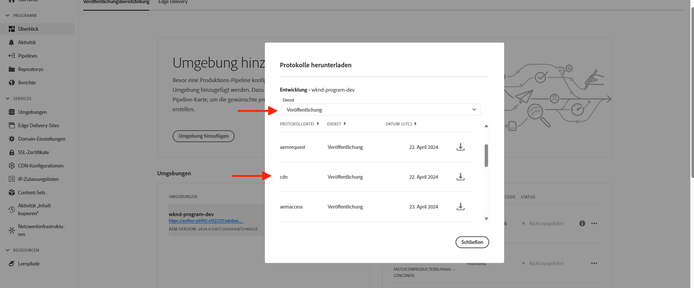

# Blockieren von DoS- und DDoS-Angriffen mithilfe von Traffic-Filterregeln

Erfahren Sie, wie Sie Denial of Service (DoS)- und Distributed Denial of Service (DDoS)-Angriffe mithilfe von **Ratenbegrenzungs-Traffic-Filterregeln** und anderen Strategien im von AEM as a Cloud Service (AEMCS) verwalteten CDN blockieren können. Diese Angriffe führen zu Traffic-Spitzen beim CDN und möglicherweise beim AEM-Publish-Service (auch bekannt als Ursprung) und können die Reaktionsfähigkeit und Verfügbarkeit der Website beeinträchtigen.

Dieses Tutorial dient als Anleitung _zur Analyse Ihres Traffic-Musters und zur Konfiguration von Ratenbegrenzungs-[Traffic-Filterregeln](https://experienceleague.adobe.com/de/docs/experience-manager-cloud-service/content/security/traffic-filter-rules-including-waf)_, um diese Angriffe zu entschärfen. In diesem Tutorial wird auch beschrieben, wie Sie [Warnhinweise konfigurieren](https://experienceleague.adobe.com/de/docs/experience-manager-cloud-service/content/security/traffic-filter-rules-including-waf#traffic-filter-rules-alerts) können, damit Sie benachrichtigt werden, wenn ein Verdacht auf einen Angriff besteht.

## Grundlegendes zum Schutz

Im Folgenden werden die standardmäßigen DDoS-Schutzmaßnahmen für Ihre AEM-Website beschrieben:

- **Caching:** Bei guten Caching-Richtlinien sind die Auswirkungen eines DDoS-Angriffs geringer, da das CDN die meisten Anfragen daran hindert, an den Ursprung zu gehen und die Leistung zu beeinträchtigen.
- **Automatische Skalierung:** Die Author- und Publish-Services von AEM verwenden die automatische Skalierung, um Traffic-Spitzen zu bewältigen, können aber immer noch durch einen plötzlichen, massiven Anstieg des Traffics beeinträchtigt werden.
- **Blockieren:** Das Adobe-CDN blockiert den Traffic zum Ursprung, wenn er eine von Adobe definierte Rate von einer bestimmten IP-Adresse pro CDN PoP (Point of Presence) überschreitet.
- **Warnhinweis:** Das Aktionszentrum sendet eine Benachrichtigung zu einer Traffic-Spitze, wenn der Traffic eine bestimmte Rate überschreitet. Dieser Alarm wird ausgelöst, wenn der Traffic zu einem bestimmten CDN PoP eine von _Adobe definierte_ Anfragerate pro IP-Adresse überschreitet. Weitere Informationen finden Sie unter [Warnhinweise zu Traffic-Filterregeln](https://experienceleague.adobe.com/de/docs/experience-manager-cloud-service/content/security/traffic-filter-rules-including-waf#traffic-filter-rules-alerts).

Diese integrierten Schutzmechanismen sollten als Grundlage für die Fähigkeit eines Unternehmens betrachtet werden, die Auswirkungen eines DDoS-Angriffs auf die Leistung zu minimieren. Da jede Website unterschiedliche Leistungsmerkmale aufweist und es zu einer Leistungsverschlechterung kommen kann, bevor die von Adobe definierte Ratenbegrenzung erreicht wird, wird empfohlen, die Standardschutzmaßnahmen über die _Kundenkonfiguration_ zu erweitern.

Sehen wir uns einige zusätzliche, empfohlene Maßnahmen an, die kundenseitig ergriffen werden können, um ihre Websites vor DDoS-Angriffen zu schützen:

- Deklarieren von **Ratenbegrenzungs-Traffic-Filterregeln**, um Traffic zu blockieren, der eine bestimmte Rate von einer einzelnen IP-Adresse pro PoP überschreitet. Dieser Schwellenwert liegt in der Regel unter dem von Adobe festgelegten Ratenlimit.
- Konfigurieren von **Warnhinweisen** für Ratenbegrenzungs-Traffic-Filterregeln durch eine „Warnhinweisaktion“, sodass bei Auslösung der Regel eine Benachrichtigung an das Aktionszentrum gesendet wird.
- Erhöhen der Cache-Abdeckung, indem Sie **Anfrageumwandlungen** so deklarieren, dass sie Abfrageparameter ignorieren.

>[!NOTE]
>
>Die [Warnhinweise zu Traffic-Filterregeln](https://experienceleague.adobe.com/de/docs/experience-manager-cloud-service/content/security/traffic-filter-rules-including-waf#traffic-filter-rules-alerts) wurden noch nicht veröffentlicht. Um über das Early-Adopter-Programm Zugriff zu erhalten, senden Sie eine E-Mail an **<aemcs-waf-adopter@adobe.com>**.

### Varianten von Ratenbegrenzungs-Traffic-Regeln {#rate-limit-variations}

Es gibt zwei Varianten von Traffic-Regeln für Ratenbegrenzungen:

1. Edge: blockiert Anfragen basierend auf der Rate des gesamten Traffics (einschließlich der Anfragen, die aus dem CDN-Cache bereitgestellt werden können) für eine bestimmte IP-Adresse pro PoP.
1. Herkunft: blockiert Anfragen basierend auf der Rate des für die Herkunft bestimmten Datenverkehrs für eine bestimmte IP pro PoP.

## Customer Journey

Die folgenden Schritte veranschaulichen den wahrscheinlichen Prozess, den Kundinnen und Kunden durchlaufen, um ihre Websites zu schützen.

1. Erkennen der Notwendigkeit einer Ratenbegrenzungs-Traffic-Filterregel. Dies kann das Ergebnis einer sofortigen Benachrichtigung durch Adobe über eine Traffic-Spitze sein oder eine proaktive Entscheidung, Vorsichtsmaßnahmen zu ergreifen, um das Risiko eines erfolgreichen DDoS-Angriffs zu verringern.
1. Analysieren des Traffic-Musters mithilfe eines Dashboards, wenn Ihre Site bereits live ist, um die optimalen Schwellenwerte für Ihre Ratenbegrenzungs-Traffic-Filterregeln zu ermitteln. Wenn Ihre Site noch nicht live ist, wählen Sie Werte basierend auf Ihren Traffic-Erwartungen aus.
1. Verwenden der Werte aus dem vorherigen Schritt, um die Ratenbegrenzungs-Traffic-Filterregeln zu konfigurieren. Stellen Sie sicher, dass Sie die entsprechenden Warnhinweise aktivieren, damit Sie benachrichtigt werden, wenn der Schwellenwert erreicht ist.
1. Lassen Sie sich Warnhinweise zu Traffic-Filterregeln zusenden, sobald es zu Traffic-Spitzen kommt. So erhalten Sie wertvolle Einblicke darüber, ob Ihr Unternehmen potenziell von böswilligen Personen ins Visier genommen wird.
1. Reagieren Sie auf den Warnhinweis, wenn nötig. Analysieren Sie den Datenverkehr, um festzustellen, ob es sich bei der Spitze um legitime Anfragen und nicht um einen Angriff handelt. Erhöhen Sie die Schwellenwerte, wenn der Verkehr legitim ist, oder senken Sie sie, wenn nicht.

Der Rest dieses Tutorials führt Sie durch diesen Prozess.

## Wie Sie erkennen, wann es notwendig ist, Regeln zu konfigurieren {#recognize-the-need}

Wie bereits erwähnt, blockiert das Adobe standardmäßig den Traffic beim CDN, der eine bestimmte Rate überschreitet. Allerdings können einige Websites schon unterhalb dieses Schwellenwerts eine verschlechterte Leistung aufweisen. Daher sollten Ratenbegrenzungs-Traffic-Filterregeln konfiguriert werden.

Idealerweise sollten Sie die Regeln konfigurieren, bevor Sie in die Produktion gehen. In der Praxis deklarieren viele Unternehmen erst dann reaktive Regeln, wenn sie auf eine Traffic-Spitze aufmerksam gemacht werden, die auf einen wahrscheinlichen Angriff hindeutet.

Adobe sendet eine Traffic-Spitzen-Warnung als [Aktionszentrums-Benachrichtigung](https://experienceleague.adobe.com/de/docs/experience-manager-cloud-service/content/operations/actions-center), wenn ein Standardschwellenwert für den Traffic von einer einzelnen IP-Adresse für einen bestimmten PoP überschritten wird. Wenn Sie einen solchen Warnhinweis erhalten haben, wird empfohlen, eine Ratenbegrenzungs-Traffic-Filterregel zu konfigurieren. Dieser Standardwarnhinweis unterscheidet sich von den Warnhinweisen, die auf Kundenseite bei der Definition von Traffic-Filterregeln explizit aktiviert werden müssen. Dies wird in einem späteren Abschnitt erläutert.


## Analysieren von Traffic-Mustern {#analyze-traffic}

Wenn Ihre Site bereits live ist, können Sie die Traffic-Muster anhand der CDN-Protokolle und der von Adobe bereitgestellten Dashboards analysieren.

- **CDN-Traffic-Dashboard**: Bietet Einblicke in den Traffic anhand von CDN- und Ursprungsanfragen, die Fehlerraten von 4xx und 5xx sowie nicht zwischengespeicherte Anfragen. Außerdem erhalten Sie maximal viele CND- und Ursprungsanfragen pro Sekunde pro Client-IP-Adresse und weitere Informationen zur Optimierung der CDN-Konfigurationen.

- **CDN-Cache-Trefferverhältnis**: Bietet Einblicke in die Gesamtanzahl der Cache-Treffer und die Gesamtanzahl der Anfragen nach HIT-, PASS- und MISS-Status. Enthält außerdem die Top-URLs für HIT, PASS und MISS.

Konfigurieren Sie die Dashboard-Tools mit _einer der folgenden Optionen_:

### ELK – Konfigurieren des Dashboard-Tools

Die Dashboard-Tools **Elasticsearch, Logstash und Kibana (ELK)** von Adobe können zur Analyse der CDN-Protokolle verwendet werden. Diese Tools enthalten ein Dashboard, das die Traffic-Muster visualisiert, sodass Sie die optimalen Schwellenwerte für Ihre Ratenbegrenzungs-Traffic-Filterregeln leichter bestimmen können.

- Klonen Sie das GitHub-Repository [AEMCS-CDN-Log-Analysis-Tooling](https://github.com/adobe/AEMCS-CDN-Log-Analysis-Tooling).
- Richten Sie das Tool ein, indem Sie die [Schritte zur Einrichtung des ELK-Docker-Containers](https://github.com/adobe/AEMCS-CDN-Log-Analysis-Tooling/blob/main/ELK/README.md#how-to-set-up-the-elk-docker-containerhow-to-setup-the-elk-docker-container) befolgen.
- Importieren Sie im Rahmen der Einrichtung die `traffic-filter-rules-analysis-dashboard.ndjson`-Datei, um die Daten zu visualisieren. Das Dashboard _CDN-Traffic_ enthält Visualisierungen, die die maximale Anzahl von Anfragen pro IP/POP am CDN-Edge und am CDN-Ursprung anzeigen.
- Laden Sie in [Cloud Manager](https://my.cloudmanager.adobe.com/) von der Karte _Umgebungen_ die CDN-Protokolle des AEMCS Publish-Services herunter.

  

  >[!TIP]
  >
  > Es kann bis zu 5 Minuten dauern, bis die neuen Anfragen in den CDN-Protokollen angezeigt werden.

### Splunk – Konfigurieren der Dashboard-Tools

Kundinnen und Kunden, die die [Splunk Log-Weiterleitung](https://experienceleague.adobe.com/de/docs/experience-manager-cloud-service/content/implementing/developing/logging#splunk-logs) aktiviert haben, können neue Dashboards erstellen, um Traffic-Muster zu analysieren. 

Um Dashboards in Splunk zu erstellen, folgen Sie den Schritten [Splunk-Dashboards für AEMCS CDN Log Analysis](https://github.com/adobe/AEMCS-CDN-Log-Analysis-Tooling/blob/main/Splunk/README.md#splunk-dashboards-for-aemcs-cdn-log-analysis).

### Blick auf die Daten

Die folgenden Visualisierungen sind in den ELK- und Splunk-Dashboards verfügbar:

- **Edge-RPS pro Client-IP und POP**: Diese Visualisierung zeigt die maximale Anzahl von Anfragen pro IP/POP **am CDN-Edge**. Der Spitzenwert in der Visualisierung gibt die maximale Anzahl der Anfragen an.

  **ELK-Dashboard**:
  

  **Splunk-Dashboard**:\
  

- **Ursprungs-RPS pro Client-IP und POP**: Diese Visualisierung zeigt die maximale Anzahl von Anfragen pro IP/POP **am Ursprung**. Der Spitzenwert in der Visualisierung gibt die maximale Anzahl der Anfragen an.

  **ELK-Dashboard**:
  

  **Splunk-Dashboard**:
  

## Auswählen von Schwellenwerten

Die Schwellenwerte für die Ratenbegrenzungs-Traffic-Filterregeln sollten auf der obigen Analyse basieren und sicherstellen, dass legitimer Traffic nicht blockiert wird. In der folgenden Tabelle finden Sie Anleitungen zur Auswahl der Schwellenwerte:

| Variante | Wert |
| :--------- | :------- |
| Ursprung | Nehmen Sie den höchsten Wert der maximalen Ursprungsanfragen pro IP/POP unter **normalen** Traffic-Bedingungen (d. h. nicht die Rate zum Zeitpunkt eines DDoS-Angriffs) und erhöhen Sie ihn um ein Vielfaches |
| Edge | Nehmen Sie den höchsten Wert der maximalen Edge-Anfragen pro IP/POP unter **normalen** Traffic-Bedingungen (d. h. nicht die Rate zum Zeitpunkt eines DDoS-Angriffs) und erhöhen Sie ihn um ein Vielfaches |

Der zu verwendende Multiplikator hängt von Ihren Erwartungen an normale Spitzen im Traffic ab, die durch organischen Traffic, Kampagnen und andere Ereignisse verursacht werden. Ein Multiplikator zwischen 5 und 10 kann angemessen sein.

Wenn Ihre Site noch nicht live ist, können keine Daten analysiert werden. Stellen Sie daher sicher, welche Werte für die Ratenbegrenzungs-Traffic-Filterregeln festgelegt werden sollten. Zum Beispiel:

| Variante | Wert |
|------------------------------ |:-----------:|
| Edge | 500 |
| Ursprung | 100 |

## Konfigurieren der Regeln {#configure-rules}

Konfigurieren Sie die **Ratenbegrenzungs-Traffic-Filterregeln** in der Datei `/config/cdn.yaml` Ihres AEM-Projekts mit Werten, die auf der obigen Diskussion basieren. Wenden Sie sich bei Bedarf an Ihr Web-Sicherheits-Team, um sicherzustellen, dass die Ratenbegrenzungswerte angemessen sind und nicht den legitimen Traffic blockieren.

Weitere Einzelheiten finden Sie unter [Erstellen von Regeln in Ihrem AEM-Projekt](https://experienceleague.adobe.com/de/docs/experience-manager-learn/cloud-service/security/traffic-filter-and-waf-rules/how-to-setup#create-rules-in-your-aem-project).

```yaml
kind: CDN
version: '1'
metadata:
  envTypes:
    - dev
    - stage
    - prod
data:
  trafficFilters:
    rules:
    ...
    #  Prevent attack at edge by blocking client for 5 minutes if they make more than 500 requests per second on average
      - name: prevent-dos-attacks-edge
        when:
          reqProperty: tier
          in: ["author","publish"]
        rateLimit:
          limit: 500 # replace with the appropriate value
          window: 10 # compute the average over 10s
          penalty: 300 # block IP for 5 minutes
          count: all # count all requests
          groupBy:
            - reqProperty: clientIp
        action: 
          type: log
          experimental_alert: true
    #  Prevent attack at origin by blocking client for 5 minutes if they make more than 100 requests per second on average            
      - name: prevent-dos-attacks-origin
        when:
          reqProperty: tier
          in: ["author","publish"]
        rateLimit:
          limit: 100 # replace with the appropriate value
          window: 10 # compute the average over 10s
          penalty: 300 # block IP for 5 minutes
          count: fetches # count only fetches
          groupBy:
            - reqProperty: clientIp
        action: 
          type: log
          experimental_alert: true   
          
```

Beachten Sie, dass sowohl Ursprungs- als auch Edge-Regeln deklariert sind und dass die Warnhinweis-Eigenschaft auf `true` festgelegt ist, sodass Sie Warnhinweise erhalten können, wenn der Schwellenwert erreicht wird, was wahrscheinlich auf einen Angriff hinweist.

>[!NOTE]
>
>Das Präfix _experimental_ vor experimental_alert wird entfernt, wenn die Warnhinweisfunktion veröffentlicht wird. Wenn Sie am Early-Adopter-Programm teilnehmen möchten, senden Sie eine E-Mail an **<aemcs-waf-adopter@adobe.com>**.

Es wird empfohlen, den Aktionstyp auf die anfängliche Protokollierung zu setzen, damit Sie den Traffic für einige Stunden oder Tage überwachen können, um sicherzustellen, dass der zulässige Traffic diese Raten nicht überschreitet. Wechseln Sie nach einigen Tagen in den Blockierungsmodus.

Führen Sie die folgenden Schritte aus, um die Änderungen in Ihrer AEMCS-Umgebung bereitzustellen:

- Übertragen und pushen Sie die oben genannten Änderungen in Ihr Cloud Manager-Git-Repository.
- Stellen Sie die Änderungen mithilfe der Konfigurations-Pipeline von Cloud Manager in der AEMCS-Umgebung bereit. Weitere Einzelheiten finden Sie unter [Bereitstellung von Regeln über Cloud Manager](https://experienceleague.adobe.com/de/docs/experience-manager-learn/cloud-service/security/traffic-filter-and-waf-rules/how-to-setup#deploy-rules-through-cloud-manager).
- Um zu überprüfen, ob die **Ratenbegrenzungs-Traffic-Filterregel** wie erwartet funktioniert, können Sie einen Angriff simulieren, wie im Abschnitt [Angriffssimulation](#attack-simulation) beschrieben. Begrenzen Sie die Anzahl der Anfragen auf einen Wert, der über dem in der Regel festgelegten Begrenzungslimit liegt.

### Konfigurieren von Anfrageumwandlungen {#configure-request-transform-rules}

Zusätzlich zur Ratenbegrenzungs-Traffic-Filterregel wird empfohlen, [Anfrageumwandlungen](https://experienceleague.adobe.com/de/docs/experience-manager-cloud-service/content/implementing/content-delivery/cdn-configuring-traffic#request-transformations) zu verwenden, um Abfrageparameter zu entfernen, die von der Anwendung nicht benötigt werden, wodurch die Möglichkeit minimiert wird, den Cache durch Cache-Busting-Techniken zu umgehen. Wenn Sie zum Beispiel nur die Abfrageparameter `search` und `campaignId` zulassen möchten, kann die folgende Regel deklariert werden:

```yaml
kind: "CDN"
version: "1"
metadata:
  envTypes: 
    - dev
    - stage
    - prod  
data:  
  experimental_requestTransformations:
    rules:            
      - name: unset-all-query-params-except-those-needed
        when:
          reqProperty: tier
          in: ["publish"]
        actions:
          - type: unset
            queryParamMatch: ^(?!search$|campaignId$).*$
```

## Empfang von Warnhinweisen zu Traffic-Filterregeln {#receiving-alerts}

Wenn die Traffic-Filterregel *experimental_alert: true* enthält, erhalten Sie einen Warnhinweis, wenn die Regel wie oben beschrieben zutrifft.

## Maßnahmen bei Warnhinweisen {#acting-on-alerts}

Manchmal ist der Warnhinweis nur informativ und gibt Ihnen einen Eindruck von der Häufigkeit der Angriffe. Es lohnt sich, Ihre CDN-Daten mithilfe des oben beschriebenen Dashboards zu analysieren und zu überprüfen, ob die Traffic-Spitze auf einen Angriff und nicht nur auf einen Anstieg des legitimen Traffic-Volumens zurückzuführen ist. Wenn dies der Fall ist, sollten Sie Ihren Schwellenwert erhöhen.

## Angriffssimulation{#attack-simulation}

In diesem Abschnitt werden Methoden zur Simulation eines DoS-Angriffs beschrieben, mit denen Sie Daten für die in diesem Tutorial verwendeten Dashboards generieren und überprüfen können, ob die konfigurierten Regeln Angriffe erfolgreich blockieren.

>[!CAUTION]
>
> Führen Sie diese Schritte nicht in einer Produktionsumgebung aus. Die folgenden Schritte dienen nur Simulationszwecken.
> 
>Wenn Sie einen Warnhinweis erhalten haben, der auf einen Anstieg des Traffics hinweist, fahren Sie mit dem Abschnitt [Analysieren von Traffic-Mustern](#analyzing-traffic-patterns) fort.

Um einen Angriff zu simulieren, können Tools wie [Apache Benchmark](https://httpd.apache.org/docs/2.4/programs/ab.html), [Apache JMeter](https://jmeter.apache.org/), [Vegeta](https://github.com/tsenart/vegeta) und andere verwendet werden.

### Edge-Anfragen

Mit dem folgenden [Vegeta](https://github.com/tsenart/vegeta)-Befehl können Sie viele Anfragen an Ihre Website stellen:

```shell
$ echo "GET https://<YOUR-WEBSITE-DOMAIN>" | vegeta attack -rate=120 -duration=5s | vegeta report
```

Der obige Befehl führt 120 Abfragen für 5 Sekunden durch und gibt einen Bericht aus. Sofern die Website keine Ratenbegrenzung hat, kann dies zu einem starken Anstieg des Traffics führen.

### Ursprungsanfragen

Um den CDN-Cache zu umgehen und Anfragen an den Ursprung (AEM-Publish-Service) zu stellen, können Sie der URL einen eindeutigen Abfrageparameter hinzufügen. Weitere Informationen finden Sie in dem Apache JMeter-Beispielskript unter [Simulieren eines DoS-Angriffs mithilfe des JMeter-Skripts](https://experienceleague.adobe.com/de/docs/experience-manager-learn/foundation/security/modsecurity-crs-dos-attack-protection#simulate-dos-attack-using-jmeter-script)

