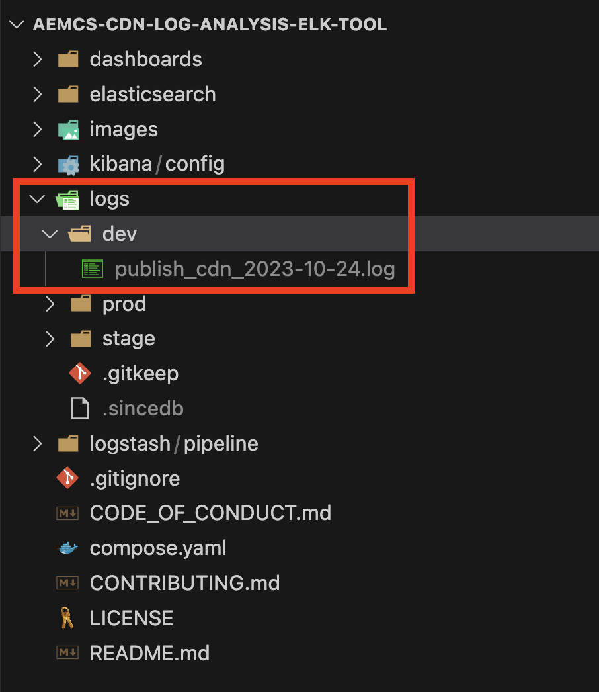

# Überwachen sensibler Anfragen

Erfahren Sie, wie Sie sensible Anfragen durch Protokollierung mit Traffic-Filterregeln in AEM as a Cloud Service überwachen.

Die Protokollierung ermöglicht die Beobachtung von Traffic-Mustern, ohne die Endbenutzenden oder Services zu beeinträchtigen, und ist ein wichtiger erster Schritt vor der Implementierung von Blockierungsregeln.

In diesem Tutorial wird gezeigt, wie Sie an den AEM Publish-Service gerichtete **Anfragen von WKND-Anmelde- und Abmeldepfaden protokollieren**.

## Gründe und Zeitpunkt für die Protokollierung von Anfragen

Die Protokollierung spezifischer Anfragen ist eine risikoarme, wertvolle Vorgehensweise, um zu verstehen, wie Benutzende – und potenziell böswillige Akteure – mit Ihrer AEM-Anwendung interagieren. Dies ist besonders vor der Durchsetzung von Blockierungsregeln nützlich, da Sie so die Möglichkeit haben, Ihren Sicherheitsstatus zu optimieren, ohne den legitimen Traffic zu beeinträchtigen.

Häufige Szenarien für die Protokollierung sind:

- Validieren der Auswirkungen und der Reichweite einer Regel, bevor sie in den `block`-Modus hochgestuft wird.
- Überwachen von Anmelde-/Abmeldepfaden und Authentifizierungsendpunkten auf ungewöhnliche Muster oder Brute-Force-Versuche.
- Tracking von hochfrequentem Zugriff auf API-Endpunkte auf potenziellen Missbrauch oder DoS-Aktivitäten.
- Festlegen von Grundstandards für das Verhalten von Bots vor der Anwendung strengerer Kontrollen.
- Bereitstellen forensischer Daten zur Analyse der Art des Angriffs und der betroffenen Ressourcen, falls es zu Sicherheitsvorfällen kommt.

## Voraussetzungen

Bevor Sie fortfahren, stellen Sie sicher, dass Sie die erforderliche Einrichtung wie im Tutorial [Einrichten von Traffic-Filter- und WAF-Regeln](../setup.md) beschrieben abgeschlossen haben. Außerdem müssen Sie das [AEM WKND Sites-Projekt](https://github.com/adobe/aem-guides-wknd) geklont und in Ihrer AEM-Umgebung bereitgestellt haben.

## Beispiel: Protokollieren von WKND-Anmelde- und Abmeldeanfragen

In diesem Beispiel erstellen Sie eine Traffic-Filterregel, um Anfragen zu protokollieren, die an die WKND-Anmelde- und -Abmeldepfade im Service „AEM-Veröffentlichung“ gestellt werden. Dadurch können Sie Authentifizierungsversuche überwachen und potenzielle Sicherheitsprobleme identifizieren.

- Fügen Sie die folgende Regel zur Datei `/config/cdn.yaml` des WKND-Projekts hinzu.

```yaml
kind: "CDN"
version: "1"
metadata:
  envTypes: ["dev", "stage", "prod"]
data:
  trafficFilters:
    rules:
    # On AEM Publish service log WKND Login and Logout requests
    - name: publish-auth-requests
      when:
        allOf:
          - reqProperty: tier
            matches: publish
          - reqProperty: path
            in:
              - /system/sling/login/j_security_check
              - /system/sling/logout
      action: log   
```

- Übernehmen Sie die Änderungen und pushen Sie sie in das Cloud Manager-Git-Repository.

- Implementieren Sie die Änderungen mit der [zuvor erstellten](../setup.md#deploy-rules-using-adobe-cloud-manager) Cloud Manager-Konfigurations-Pipeline in der AEM-Entwicklungsumgebung.

- Testen Sie die Regel, indem Sie sich bei der WKND-Site Ihrer Anwendung anmelden und wieder abmelden (z. B. `https://publish-pXXXX-eYYYY.adobeaemcloud.com/us/en.html`). Sie können `asmith/asmith` als Benutzernamen und Kennwort verwenden.

  

## Analysieren

Analysieren wir nun die Ergebnisse der Regel `publish-auth-requests`, indem wir die AEMCS CDN-Protokolle aus Cloud Manager herunterladen und die [AEMCS CDN-Protokollanalyse-Tools](../setup.md#setup-the-elastic-dashboard-tool) verwenden.

- Laden Sie auf der Karte **Umgebungen** von [Cloud Manager](https://my.cloudmanager.adobe.com/) die CDN-Protokolle des **Publish-Services** von AEMCS herunter.

  

  >[!TIP]
  >
  > Es kann bis zu 5 Minuten dauern, bis die neuen Anfragen in den CDN-Protokollen angezeigt werden.

- Kopieren Sie die heruntergeladene Protokolldatei (beispielsweise `publish_cdn_2023-10-24.log` im folgenden Screenshot) in den Ordner `logs/dev` des Elastic-Dashboard-Tool-Projekts.

  

- Aktualisieren Sie Seite des Elastic-Dashboard-Tools.
   - Bearbeiten Sie im Abschnitt **Globaler Filter** den Filter `aem_env_name.keyword` und wählen Sie den Wert der `dev`-Umgebung aus.

     

   - Um das Zeitintervall zu ändern, klicken Sie auf das Kalendersymbol oben rechts und wählen Sie das gewünschte Zeitintervall aus.

     

- Überprüfen Sie die Bedienfelder **Analysierte Anfragen**, **Gekennzeichnete Anfragen**, und **Gekennzeichnete Anfragen – Details** im aktualisierten Dashboard. Bei übereinstimmenden CDN-Protokolleinträgen sollten die Werte der Client-IP (cli_ip), des Hosts, der URL, der Aktion (waf_action) und des Regelnamens (waf_match) jedes Eintrags angezeigt werden.

  
