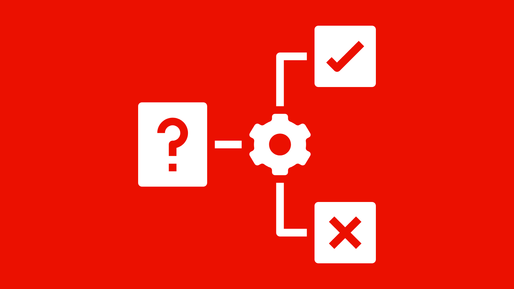

# Schützen von AEM-Websites – Überblick

Erfahren Sie, wie Sie Ihre AEM-Websites mit **Traffic-Filterregeln**, einschließlich deren Unterkategorie der **WAF**-Regeln (Web Application Firewall) in AEM as a Cloud Service vor Denial of Service(DoS)-, Distributed Denial of Service(DDoS)- und komplexen Angriffen sowie bösartigem Traffic schützen.

Außerdem erfahren Sie mehr über die Unterschiede zwischen Standard-Traffic-Filterregeln und WAF-Traffic-Filterregeln, wann sie verwendet werden und wie Sie mit den von Adobe empfohlenen Regeln beginnen.

>[!IMPORTANT]
>
> WAF-Traffic-Filterregeln erfordern eine zusätzliche Lizenz für **WAF-DDoS-Schutz** oder **Erweiterte Sicherheit**. Standard-Traffic-Filterregeln sind für Kundinnen und Kunden von Sites und Forms standardmäßig verfügbar.

>[!VIDEO](https://video.tv.adobe.com/v/3469394/?quality=12&learn=on)

## Einführung in Traffic-Sicherheit in AEM as a Cloud Service

AEM as a Cloud Service nutzt eine integrierte CDN-Ebene, um die Bereitstellung Ihrer Website zu schützen und zu optimieren. Eine der wichtigsten Komponenten der CDN-Ebene ist die Möglichkeit, Traffic-Regeln zu definieren und durchzusetzen. Diese Regeln dienen als Schutzschild, um Ihre Website vor Missbrauch, Zweckentfremdung und Angriffen zu schützen – ohne Leistungseinbußen.

Die Traffic-Sicherheit ist für die Aufrechterhaltung der Betriebszeit, den Schutz sensibler Daten und die Gewährleistung eines nahtlosen Erlebnisses für legitime Benutzende von entscheidender Bedeutung. AEM bietet zwei Kategorien von Sicherheitsregeln:

- **Standard-Traffic-Filterregeln**
- **Web Application Firewall(WAF)-Traffic-Filterregeln**

Die Regelsätze unterstützen Kundinnen und Kunden dabei, sich vor gängigen und komplexen Internet-Bedrohungen zu schützen, Störungen durch böswillige oder unangemessen agierende Clients zu reduzieren und die Beobachtbarkeit durch Anfrageprotokollierung, Blockierung und Mustererkennung zu verbessern.

## Unterschied zwischen Standard- und WAF-Traffic-Filterregeln

| Funktion | Standard-Traffic-Filterregeln | WAF-Traffic-Filterregeln |
|--------------------------|--------------------------------------------------|---------------------------------------------------------|
| Zweck | Verhindern von Missbrauch wie DoS, DDoS, Scraping oder Bot-Aktivität | Erkennen von ausgefeilten Angriffsmustern (z. B. OWASP Top 10) und Reaktion darauf bei gleichzeitigem Schutz vor Bots |
| Beispiele | Ratenbegrenzung, Geoblocking, User-Agent-Filterung | SQL-Injection, XSS, bekannte Angriff-IPs |
| Flexibilität | Hochgradig über YAML konfigurierbar | Hochgradig über YAML konfigurierbar, mit vordefinierten WAF-Markierungen |
| Empfohlener Modus | Mit `log` beginnen, anschließend in den `block`-Modus wechseln | Mit dem `block`-Modus für die WAF-Markierung `ATTACK-FROM-BAD-IP` und dem `log`-Modus für die WAF-Markierung `ATTACK` beginnen, anschließend für beide in den `block`-Modus wechseln |
| Bereitstellung | Wird in YAML definiert und über die Cloud Manager-Konfigurations-Pipeline bereitgestellt | Wird in YAML mit `wafFlags` definiert und über die Cloud Manager-Konfigurations-Pipeline bereitgestellt |
| Lizenzierung | In Sites- und Forms-Lizenzen enthalten | **Erfordert Lizenz für WAF-DDoS-Schutz oder Erweiterte Sicherheit** |

Die Standard-Traffic-Filterregeln sind nützlich, um unternehmensspezifische Richtlinien zu erzwingen, z. B. Ratenbegrenzungen oder die Blockierung bestimmter Regionen, sowie die Blockierung des Traffics basierend auf Anfrageeigenschaften und Headern wie IP-Adresse, Pfad oder Benutzeragent.
Die WAF-Traffic-Filterregeln bieten dagegen einen umfassenden proaktiven Schutz gegen bekannte Web-Exploits und Angriffsvektoren und verfügen über erweiterte Intelligenz, um falsch-positive Ergebnisse (Blockierung von legitimem Traffic) zu begrenzen.
Zur Definition beider Regeltypen verwenden Sie die YAML-Syntax. Weitere Informationen finden Sie unter [Syntax von Traffic-Filterregeln](https://experienceleague.adobe.com/de/docs/experience-manager-cloud-service/content/security/traffic-filter-rules-including-waf#rules-syntax).

## Zeitpunkt und Grund für die Verwendung

**Verwenden Sie Standard-Traffic-Filterregeln** in folgenden Situationen:

- Sie möchten organisationsspezifische Einschränkungen anwenden, z. B. die Begrenzung der IP-Rate.
- Sie kennen bestimmte Muster (z. B. bösartige IP-Adressen, Regionen, Header), die gefiltert werden müssen.

**Verwenden Sie WAF-Traffic-Filterregeln** in folgenden Situationen:

- Sie wünschen einen umfassenden **proaktiven Schutz** vor weit verbreiteten bekannten Angriffsmustern (z. B. Injection, Protokollmissbrauch) sowie bekannten böswilligen IPs, die in sachkundigen Datenquellen zusammengestellt wurden.
- Sie möchten böswillige Anfragen ablehnen und gleichzeitig das Risiko begrenzen, legitimen Traffic zu blockieren.
- Sie möchten den Aufwand zum Schutz vor häufigen und komplexen Bedrohungen durch einfache Konfigurationsregeln begrenzen.

Gemeinsam bieten diese Regeln eine umfassende Verteidigungsstrategie, die es Kundinnen und Kunden von AEM as a Cloud Service ermöglicht, sowohl proaktive als auch reaktive Maßnahmen zum Schutz ihrer digitalen Präsenzen zu ergreifen.

## Von Adobe empfohlene Regeln

Adobe stellt empfohlene Regeln für Standard-Traffic-Filter- und WAF-Traffic-Filterregeln bereit, mit denen Sie Ihre AEM-Sites schnell schützen können.

- **Standard-Traffic-Filterregeln** (standardmäßig verfügbar): Schützen vor gängigen Missbrauchsszenarien wie DoS-, DDoS- und Bot-Angriffen gegen **CDN-Edge**, den **Ursprung** oder Traffic aus sanktionierten Ländern.\
  Beispiele:
   - Ratenbegrenzung für IPs mit mehr als 500 Anfragen/Sekunde _am CDN-Edge_
   - Ratenbegrenzung von IPs mit mehr als 100 Anfragen/Sekunde _am Ursprung_
   - Blockieren von Traffic aus Ländern, die durch das Office of Foreign Assets Control (OFAC) gelistet sind

- **WAF-Traffic-Filterregeln** (Add-on-Lizenz erforderlich): Bieten zusätzlichen Schutz vor komplexen Bedrohungen, einschließlich [OWASP Top Ten](https://owasp.org/www-project-top-ten/)-Bedrohungen wie SQL-Injection, Cross-Site Scripting (XSS) und anderen Angriffen auf Web-Anwendungen.
Beispiele:
   - Blockieren von Anfragen durch bekannte schädliche IP-Adressen
   - Protokollieren oder Blockieren von verdächtigen Anfragen, die als Angriffe markiert sind

>[!TIP]
>
> Wenden Sie zunächst die von **Adobe empfohlenen Regeln** an, um vom Sicherheits-Know-how und den kontinuierlichen Updates von Adobe zu profitieren. Wenn in Ihrem Unternehmen bestimmte Risiken oder Sonderfälle gelten oder falsch-positive Ergebnisse festgestellt werden (Blockierung von legitimem Traffic), können Sie **benutzerdefinierte Regeln** definieren oder den Standardsatz entsprechend Ihren Anforderungen erweitern.

## Erste Schritte

Erfahren Sie anhand des Setup-Handbuchs und der folgenden Anwendungsfälle, wie Sie Traffic-Filterregeln, einschließlich WAF-Regeln, in AEM as a Cloud Service definieren, bereitstellen, testen und analysieren. Dadurch erhalten Sie Hintergrundwissen, damit Sie später die von Adobe empfohlenen Regeln sicher anwenden können.

<!-- CARDS
{target = _self}

* ./setup.md
  {title = How to set up traffic filter rules including WAF rules}
  {description = Learn how to set up to create, deploy, test, and analyze the results of traffic filter rules including WAF rules.}
  {image = ./assets/setup/rules-setup.png}
  {cta = Start Now}
-->
<!-- START CARDS HTML - DO NOT MODIFY BY HAND -->

    

        

            

                <figure class="image x-is-16by9">
                    
                </figure>
            

            

                

                    

                        <a href="./setup.md" target="_self" rel="referrer" title="Einrichten von Traffic-Filterregeln, einschließlich WAF-Regeln">Einrichten von Traffic-Filterregeln, einschließlich WAF-Regeln</a>
                    

                    
Erfahren Sie, wie Sie die Ergebnisse von Traffic-Filterregeln, einschließlich WAF-Regeln, erstellen, bereitstellen, testen und analysieren.

                

                <a href="./setup.md" target="_self" rel="referrer" class="spectrum-Button spectrum-Button--outline spectrum-Button--primary spectrum-Button--sizeM" style="align-self: flex-start; margin-top: 1rem;">
                    Jetzt starten
                </a>
            

        

    

<!-- END CARDS HTML - DO NOT MODIFY BY HAND -->

## Setup-Handbuch für von Adobe empfohlene Regeln

Dieses Handbuch enthält Schritt-für-Schritt-Anleitungen zum Einrichten und Bereitstellen der von Adobe empfohlenen Standard-Traffic-Filter- und WAF-Traffic-Filterregeln in Ihrer AEM as a Cloud Service-Umgebung.

<!-- CARDS
{target = _self}

* ./use-cases/using-traffic-filter-rules.md
  {title = Protecting AEM websites using standard traffic filter rules}
  {description = Learn how to protect AEM websites from DoS, DDoS and bot abuse using Adobe-recommended standard traffic filter rules in AEM as a Cloud Service.}
  {image = ./assets/use-cases/using-traffic-filter-rules.png}
  {cta = Apply Rules}

* ./use-cases/using-waf-rules.md
  {title = Protecting AEM websites using WAF rules}
  {description = Learn how to protect AEM websites from sophisticated threats including DoS, DDoS, and bot abuse using Adobe-recommended Web Application Firewall (WAF) traffic filter rules in AEM as a Cloud Service.}
  {image = ./assets/use-cases/using-waf-rules.png}
  {cta = Activate WAF}
-->
<!-- START CARDS HTML - DO NOT MODIFY BY HAND -->

    

        

            

                <figure class="image x-is-16by9">
                    
                </figure>
            

            

                

                    

                        <a href="./use-cases/using-traffic-filter-rules.md" target="_self" rel="referrer" title="Schützen von AEM-Websites mit Standard-Traffic-Filterregeln">Schützen von AEM-Websites mit Standard-Traffic-Filterregeln</a>
                    

                    
Erfahren Sie, wie Sie AEM-Websites mit von Adobe empfohlenen Standard-Traffic-Filterregeln in AEM as a Cloud Service vor DoS, DDoS und Bot-Missbrauch schützen.

                

                <a href="./use-cases/using-traffic-filter-rules.md" target="_self" rel="referrer" class="spectrum-Button spectrum-Button--outline spectrum-Button--primary spectrum-Button--sizeM" style="align-self: flex-start; margin-top: 1rem;">
                    Regeln anwenden
                </a>
            

        

    

    

        

            

                <figure class="image x-is-16by9">
                    
                </figure>
            

            

                

                    

                        <a href="./use-cases/using-waf-rules.md" target="_self" rel="referrer" title="Schützen von AEM-Websites mit WAF-Regeln">Schützen von AEM-Websites mit WAF-Regeln</a>
                    

                    
Erfahren Sie, wie Sie AEM-Websites mit den von Adobe empfohlenen Traffic-Filterregeln der Web Application Firewall (WAF) in AEM as a Cloud Service vor komplexen Bedrohungen wie DoS, DDoS und Bot-Missbrauch schützen.

                

                <a href="./use-cases/using-waf-rules.md" target="_self" rel="referrer" class="spectrum-Button spectrum-Button--outline spectrum-Button--primary spectrum-Button--sizeM" style="align-self: flex-start; margin-top: 1rem;">
                    WAF aktivieren
                </a>
            

        

    

<!-- END CARDS HTML - DO NOT MODIFY BY HAND -->

## Erweiterte Anwendungsfälle

Für komplexere Szenarien können Sie die folgenden Anwendungsfälle erkunden. Diese demonstrieren, wie Sie benutzerdefinierte Traffic-Filterregeln basierend auf bestimmten Unternehmensanforderungen implementieren:

<!-- CARDS
{target = _self}

* ./how-to/request-logging.md

* ./how-to/request-blocking.md

* ./how-to/request-transformation.md
-->
<!-- START CARDS HTML - DO NOT MODIFY BY HAND -->

    

        

            

                <figure class="image x-is-16by9">
                    
                </figure>
            

            

                

                    

                        <a href="./how-to/request-logging.md" target="_self" rel="referrer" title="Überwachen sensibler Anfragen">Überwachen sensibler Anfragen</a>
                    

                    
Erfahren Sie, wie Sie sensible Anfragen durch Protokollierung mit Traffic-Filterregeln in AEM as a Cloud Service überwachen.

                

                <a href="./how-to/request-logging.md" target="_self" rel="referrer" class="spectrum-Button spectrum-Button--outline spectrum-Button--primary spectrum-Button--sizeM" style="align-self: flex-start; margin-top: 1rem;">
                    Weitere Informationen
                </a>
            

        

    

    

        

            

                <figure class="image x-is-16by9">
                    
                </figure>
            

            

                

                    

                        <a href="./how-to/request-blocking.md" target="_self" rel="referrer" title="Einschränken des Zugriffs">Einschränken des Zugriffs</a>
                    

                    
Erfahren Sie, wie Sie den Zugriff durch Blockierung bestimmter Anfragen mit Traffic-Filterregeln in AEM as a Cloud Service einschränken.

                

                <a href="./how-to/request-blocking.md" target="_self" rel="referrer" class="spectrum-Button spectrum-Button--outline spectrum-Button--primary spectrum-Button--sizeM" style="align-self: flex-start; margin-top: 1rem;">
                    Weitere Informationen
                </a>
            

        

    

    

        

            

                <figure class="image x-is-16by9">
                    
                </figure>
            

            

                

                    

                        <a href="./how-to/request-transformation.md" target="_self" rel="referrer" title="Normalisieren von Anfragen">Normalisieren von Anfragen</a>
                    

                    
Erfahren Sie, wie Sie Anfragen durch Transformation mit Traffic-Filterregeln in AEM as a Cloud Service normalisieren.

                

                <a href="./how-to/request-transformation.md" target="_self" rel="referrer" class="spectrum-Button spectrum-Button--outline spectrum-Button--primary spectrum-Button--sizeM" style="align-self: flex-start; margin-top: 1rem;">
Mehr erfahren
</a>
            

        

    

<!-- END CARDS HTML - DO NOT MODIFY BY HAND -->

## Zusätzliche Ressourcen

- [Traffic-Filterregeln, einschließlich WAF-Regeln](https://experienceleague.adobe.com/de/docs/experience-manager-cloud-service/content/security/traffic-filter-rules-including-waf)
