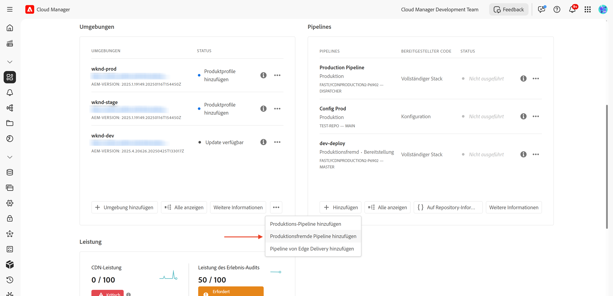
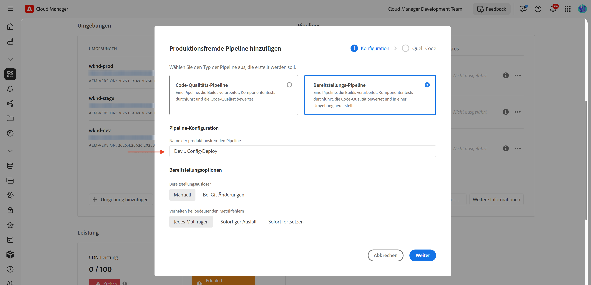
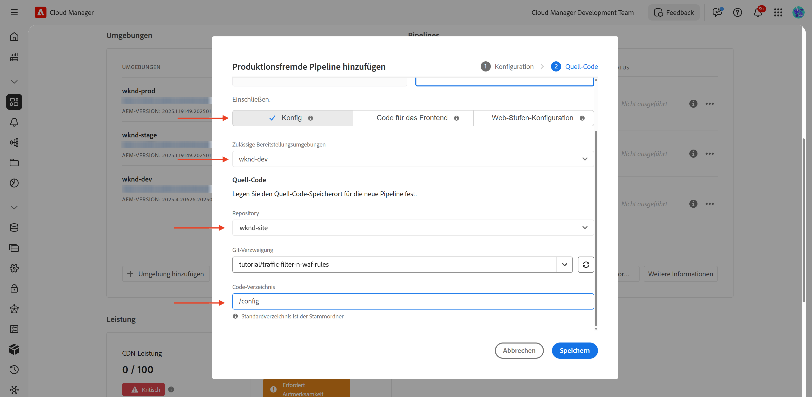
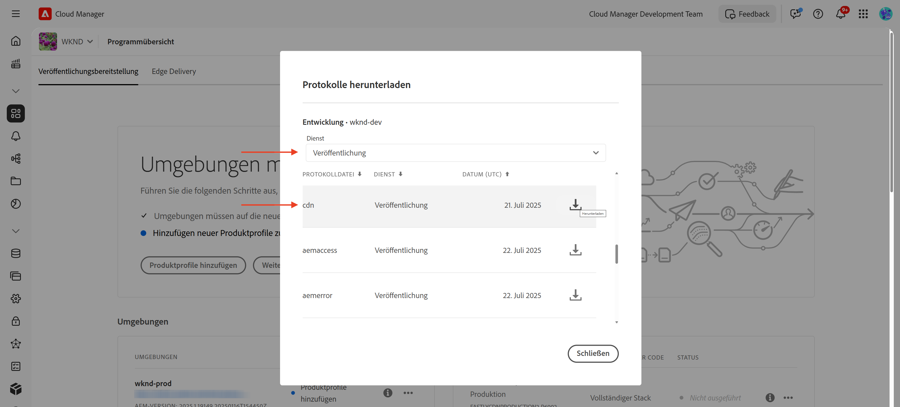
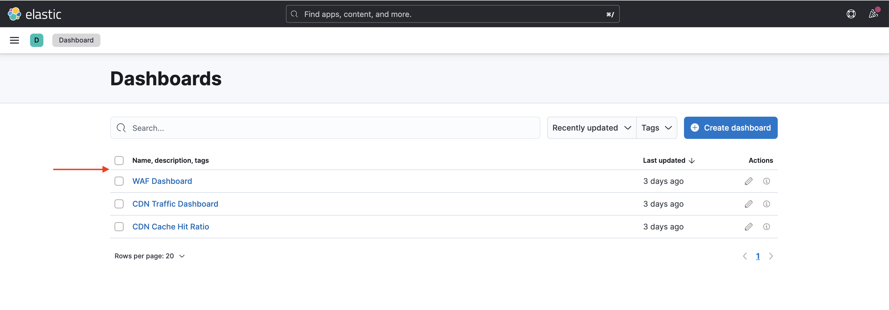

# Einrichten von Traffic-Filterregeln einschließlich WAF-Regeln

Erfahren Sie **wie Sie Traffic** Filterregeln einrichten, einschließlich Regeln für Web Application Firewall (WAF). In diesem Tutorial haben wir die Grundlagen für nachfolgende Tutorials geschaffen, in denen Sie Regeln konfigurieren und bereitstellen und anschließend die Ergebnisse testen und analysieren werden.

Um den Einrichtungsprozess zu demonstrieren, verwendet das Tutorial das [AEM WKND Sites-Projekt](https://github.com/adobe/aem-guides-wknd).

>[!VIDEO](https://video.tv.adobe.com/v/3469395/?quality=12&learn=on)

## Setup-Übersicht

Die Grundlagen für nachfolgende Tutorials umfassen die folgenden Schritte:

- _Erstellen von_ in Ihrem AEM-Projekt im `config`
- _Regeln bereitstellen_ mithilfe der Adobe Cloud Manager-Konfigurations-Pipeline.
- _Testregeln_ mit Tools wie Curl, Vegeta und Nikto
- _Analysieren von Ergebnissen_ mithilfe des AEMCS CDN Log Analysis Tools

## Erstellen von Regeln in Ihrem AEM-Projekt

Gehen Sie wie folgt vor, um **Traffic** Filterregeln für Standard“ und **WAF** in Ihrem AEM-Projekt zu definieren:

1. Erstellen Sie oben in Ihrem AEM-Projekt einen Ordner mit dem Namen `config`.

2. Erstellen Sie im `config` eine Datei mit dem Namen `cdn.yaml`.

3. Verwenden Sie die folgende Metadatenstruktur in `cdn.yaml`:

```yaml
kind: "CDN"
version: "1"
metadata:
  envTypes: ["dev", "stage", "prod"]
data:
  trafficFilters:
    rules:
```


Im [nächsten Tutorial](#next-steps) erfahren Sie, wie Sie den **empfohlenen Standard-Traffic-Filter und die WAF** Regeln von Adobe zur obigen Datei hinzufügen, um eine solide Grundlage für Ihre Implementierung zu schaffen.

## Bereitstellen von Regeln mit Adobe Cloud Manager

Führen Sie zur Vorbereitung der Bereitstellung der Regeln die folgenden Schritte aus:

1. Melden Sie sich bei [my.cloudmanager.adobe.com](https://my.cloudmanager.adobe.com/) an und wählen Sie Ihr Programm aus.

2. Gehen Sie von **Seite** Programmübersicht“ zur Karte **Pipelines** und klicken Sie auf **+Hinzufügen**, um eine neue Pipeline zu erstellen.

   

3. Im Pipeline-Assistenten:

   - **Typ**: Bereitstellungs-Pipeline
   - **Pipeline-Name**: Dev-Config

   

4. Source Code-Konfiguration:

   - **Bereitzustellender Code**: Zielgerichtete Bereitstellung
   - **Einschließen**: Config
   - **Bereitstellungsumgebung**: z. B. `wknd-program-dev`
   - **Repository**: Git-Repository (z. B. `wknd-site`)
   - **Git-Verzweigung**: Ihre Arbeitsverzweigung
   - **Code-Speicherort**: `/config`

   

5. Überprüfen Sie die Pipeline-Konfiguration und klicken Sie auf **Speichern**.

Im [nächsten Tutorial](#next-steps) erfahren Sie, wie Sie die Pipeline in Ihrer AEM-Umgebung bereitstellen.

## Testen von Regeln mithilfe von Tools

Um die Effektivität Ihrer standardmäßigen Traffic-Filter- und WAF-Regeln zu testen, können Sie verschiedene Tools verwenden, um Anfragen zu simulieren und zu analysieren, wie Ihre Regeln reagieren.

Stellen Sie sicher, dass die folgenden Tools auf Ihrem lokalen Computer installiert sind, oder befolgen Sie die Anweisungen zur Installation:

- [cURL](https://curl.se/): Anfrage-/Antwortfluss testen.
- [Vegeta](https://github.com/tsenart/vegeta): Simulieren einer hohen Anfragelast (DoS-Tests).
- [Nikto](https://github.com/sullo/nikto/wiki): Suche nach Sicherheitslücken.

Sie können die Installation mit den folgenden Befehlen überprüfen:

```shell
# Curl version check
$ curl --version

# Vegeta version check
$ vegeta -version

# Nikto version check
$ cd <PATH-OF-CLONED-REPO>/program
$ ./nikto.pl -Version
```

Im [nächsten Tutorial](#next-steps) erfahren Sie, wie Sie diese Tools verwenden können, um hohe Anforderungslasten und böswillige Anforderungen zu simulieren und so die Effektivität Ihrer Traffic-Filter und WAF-Regeln zu testen.

## Ergebnisse analysieren

Gehen Sie wie folgt vor, um sich auf die Analyse der Ergebnisse vorzubereiten:

1. Installieren Sie die **AEMCS CDN Log Analysis Tools**, um die Muster mithilfe vordefinierter Dashboards zu visualisieren und zu analysieren.

2. Führen Sie **CDN-Protokollaufnahme** durch Herunterladen von Protokollen von der Cloud Manager-Benutzeroberfläche durch. Alternativ können Sie Protokolle direkt an ein unterstütztes gehostetes Protokollierungsziel wie Splunk oder Elasticsearch weiterleiten.

### AEMCS CDN Log Analysis Tooling

Um die Ergebnisse Ihrer Traffic-Filter- und WAF-Regeln zu analysieren, können Sie das **AEMCS CDN Log Analysis Tooling** verwenden. Dieses Tool bietet vordefinierte Dashboards zur Visualisierung von CDN-Traffic und WAF-Aktivitäten mithilfe von Protokollen, die aus dem AEMCS-CDN erfasst wurden.

AEMCS CDN Log Analysis Tooling unterstützt zwei Beobachtbarkeitsplattformen, **ELK** (Elasticsearch, Logstash, Kibana) und **Splunk**.

Sie können die Protokollweiterleitungsfunktion verwenden, um Ihre Protokolle an einen gehosteten ELK- oder Splunk-Protokollierungs-Service zu streamen. Dort können Sie ein Dashboard installieren, um die standardmäßigen Traffic-Filter- und WAF-Traffic-Filterregeln zu visualisieren und zu analysieren. Für dieses Tutorial richten Sie das Dashboard jedoch auf einer lokalen ELK-Instanz ein, die auf Ihrem Computer installiert ist.

1. Klonen Sie das [AEMCS-CDN-Log-Analysis-Tooling](https://github.com/adobe/AEMCS-CDN-Log-Analysis-Tooling)-Repository.

2. Befolgen Sie die [ELK Docker Container Setup Guide](https://github.com/adobe/AEMCS-CDN-Log-Analysis-Tooling/blob/main/ELK/README.md), um den ELK-Stack lokal zu installieren und zu konfigurieren.

3. Mithilfe von ELK-Dashboards können Sie Metriken wie IP-Anfragen, blockierten Traffic, URI-Muster und Sicherheitswarnungen untersuchen.

   

>[!NOTE]
> 
> Wenn Protokolle noch nicht vom AEM CDN erfasst wurden, erscheinen die Dashboards leer.

### CDN-Protokollaufnahme

Gehen Sie wie folgt vor, um CDN-Protokolle in den ELK-Stack aufzunehmen:

- Laden Sie auf der Karte **Umgebungen** von [Cloud Manager](https://my.cloudmanager.adobe.com/) die CDN-Protokolle des **Publish-Services** von AEMCS herunter.

  

  >[!TIP]
  >
  > Es kann bis zu 5 Minuten dauern, bis die neuen Anfragen in den CDN-Protokollen angezeigt werden.

- Kopieren Sie die heruntergeladene Protokolldatei (beispielsweise `publish_cdn_2025-06-06.log` im folgenden Screenshot) in den Ordner `logs/dev` des Elastic-Dashboard-Tool-Projekts.

  {width="800" zoomable="yes"}

- Aktualisieren Sie Seite des Elastic-Dashboard-Tools.
   - Bearbeiten Sie im Abschnitt **Globaler Filter** den Filter `aem_env_name.keyword` und wählen Sie den Wert der `dev`-Umgebung aus.

     

   - Um das Zeitintervall zu ändern, klicken Sie auf das Kalendersymbol oben rechts und wählen Sie das gewünschte Zeitintervall aus.

- Im [nächsten Tutorial](#next-steps) erfahren Sie, wie Sie die Ergebnisse der standardmäßigen Traffic-Filter- und WAF-Traffic-Filterregeln mithilfe der vordefinierten Dashboards im ELK-Stack analysieren.

  

## Zusammenfassung

Sie haben die Grundlagen für die Implementierung von Traffic-Filterregeln, einschließlich WAF-Regeln in AEM as a Cloud Service, erfolgreich eingerichtet. Sie haben eine Konfigurationsdateistruktur, eine Pipeline für die Bereitstellung und vorbereitete Tools zum Testen und Analysieren der Ergebnisse erstellt.

## Nächste Schritte

In den folgenden Tutorials erfahren Sie, wie Sie die von Adobe empfohlenen Regeln implementieren:

<!-- CARDS
{target = _self}

* ./use-cases/using-traffic-filter-rules.md
  {title = Protecting AEM websites using standard traffic filter rules}
  {description = Learn how to protect AEM websites from DoS, DDoS and bot abuse using Adobe-recommended standard traffic filter rules in AEM as a Cloud Service.}
  {image = ./assets/use-cases/using-traffic-filter-rules.png}
  {cta = Apply Rules}

* ./use-cases/using-waf-rules.md
  {title = Protecting AEM websites using WAF traffic filter rules}
  {description = Learn how to protect AEM websites from sophisticated threats including DoS, DDoS, and bot abuse using Adobe-recommended Web Application Firewall (WAF) traffic filter rules in AEM as a Cloud Service.}
  {image = ./assets/use-cases/using-waf-rules.png}
  {cta = Activate WAF}
-->
<!-- START CARDS HTML - DO NOT MODIFY BY HAND -->
<div class="columns">
    <div class="column is-half-tablet is-half-desktop is-one-third-widescreen" aria-label="Protecting AEM websites using standard traffic filter rules">
        <div class="card" style="height: 100%; display: flex; flex-direction: column; height: 100%;">
            <div class="card-image">
                <figure class="image x-is-16by9">
                    <a href="./use-cases/using-traffic-filter-rules.md" title="Schützen von AEM-Websites mithilfe standardmäßiger Traffic-Filterregeln" target="_self" rel="referrer">
                        
                    </a>
                </figure>
            </div>
            <div class="card-content is-padded-small" style="display: flex; flex-direction: column; flex-grow: 1; justify-content: space-between;">
                <div class="top-card-content">
                    <p class="headline is-size-6 has-text-weight-bold">
                        <a href="./use-cases/using-traffic-filter-rules.md" target="_self" rel="referrer" title="Schützen von AEM-Websites mithilfe standardmäßiger Traffic-Filterregeln">Schutz von AEM-Websites mithilfe standardmäßiger Traffic-Filterregeln</a>
                    </p>
                    <p class="is-size-6">Erfahren Sie, wie Sie AEM-Websites mithilfe von Adobe-empfohlenen Standard-Traffic-Filterregeln in AEM as a Cloud Service vor DoS, DDoS und Bot-Missbrauch schützen können.</p>
                </div>
                <a href="./use-cases/using-traffic-filter-rules.md" target="_self" rel="referrer" class="spectrum-Button spectrum-Button--outline spectrum-Button--primary spectrum-Button--sizeM" style="align-self: flex-start; margin-top: 1rem;">
                    <span class="spectrum-Button-label has-no-wrap has-text-weight-bold">Regeln anwenden</span>
                </a>
            </div>
        </div>
    </div>
    <div class="column is-half-tablet is-half-desktop is-one-third-widescreen" aria-label="Protecting AEM websites using WAF traffic filter rules">
        <div class="card" style="height: 100%; display: flex; flex-direction: column; height: 100%;">
            <div class="card-image">
                <figure class="image x-is-16by9">
                    <a href="./use-cases/using-waf-rules.md" title="Schützen von AEM-Websites mithilfe von WAF-Traffic-Filterregeln" target="_self" rel="referrer">
                        
                    </a>
                </figure>
            </div>
            <div class="card-content is-padded-small" style="display: flex; flex-direction: column; flex-grow: 1; justify-content: space-between;">
                <div class="top-card-content">
                    <p class="headline is-size-6 has-text-weight-bold">
                        <a href="./use-cases/using-waf-rules.md" target="_self" rel="referrer" title="Schützen von AEM-Websites mithilfe von WAF-Traffic-Filterregeln">Schutz von AEM-Websites mithilfe von WAF-Traffic-Filterregeln</a>
                    </p>
                    <p class="is-size-6">Erfahren Sie, wie Sie AEM-Websites mithilfe der von Adobe empfohlenen Traffic-Filterregeln der Web Application Firewall (WAF) in AEM as a Cloud Service vor komplexen Bedrohungen wie DoS, DDoS und Bot-Missbrauch schützen.</p>
                </div>
                <a href="./use-cases/using-waf-rules.md" target="_self" rel="referrer" class="spectrum-Button spectrum-Button--outline spectrum-Button--primary spectrum-Button--sizeM" style="align-self: flex-start; margin-top: 1rem;">
                    <span class="spectrum-Button-label has-no-wrap has-text-weight-bold">WAF aktivieren</span>
                </a>
            </div>
        </div>
    </div>
</div>
<!-- END CARDS HTML - DO NOT MODIFY BY HAND -->

## Erweiterte Anwendungsfälle

Neben dem von Adobe empfohlenen Standard-Traffic-Filter und den WAF-Regeln können Sie erweiterte Szenarien implementieren, um bestimmte Geschäftsanforderungen zu erfüllen. Zu diesen Szenarien gehören:

<!-- CARDS
{target = _self}

* ./how-to/request-logging.md

* ./how-to/request-blocking.md

* ./how-to/request-transformation.md
-->
<!-- START CARDS HTML - DO NOT MODIFY BY HAND -->
<div class="columns">
    <div class="column is-half-tablet is-half-desktop is-one-third-widescreen" aria-label="Monitoring sensitive requests">
        <div class="card" style="height: 100%; display: flex; flex-direction: column; height: 100%;">
            <div class="card-image">
                <figure class="image x-is-16by9">
                    <a href="./how-to/request-logging.md" title="Überwachen sensibler Anfragen" target="_self" rel="referrer">
                        
                    </a>
                </figure>
            </div>
            <div class="card-content is-padded-small" style="display: flex; flex-direction: column; flex-grow: 1; justify-content: space-between;">
                <div class="top-card-content">
                    <p class="headline is-size-6 has-text-weight-bold">
                        <a href="./how-to/request-logging.md" target="_self" rel="referrer" title="Überwachen sensibler Anfragen">Überwachen sensibler Anfragen</a>
                    </p>
                    <p class="is-size-6">Erfahren Sie, wie Sie sensible Anfragen überwachen, indem Sie sie mithilfe von Traffic-Filterregeln in AEM as a Cloud Service protokollieren.</p>
                </div>
                <a href="./how-to/request-logging.md" target="_self" rel="referrer" class="spectrum-Button spectrum-Button--outline spectrum-Button--primary spectrum-Button--sizeM" style="align-self: flex-start; margin-top: 1rem;">
                    <span class="spectrum-Button-label has-no-wrap has-text-weight-bold">Mehr erfahren</span>
                </a>
            </div>
        </div>
    </div>
    <div class="column is-half-tablet is-half-desktop is-one-third-widescreen" aria-label="Restricting access">
        <div class="card" style="height: 100%; display: flex; flex-direction: column; height: 100%;">
            <div class="card-image">
                <figure class="image x-is-16by9">
                    <a href="./how-to/request-blocking.md" title="Einschränken des Zugriffs" target="_self" rel="referrer">
                        
                    </a>
                </figure>
            </div>
            <div class="card-content is-padded-small" style="display: flex; flex-direction: column; flex-grow: 1; justify-content: space-between;">
                <div class="top-card-content">
                    <p class="headline is-size-6 has-text-weight-bold">
                        <a href="./how-to/request-blocking.md" target="_self" rel="referrer" title="Einschränken des Zugriffs">Einschränken des Zugriffs</a>
                    </p>
                    <p class="is-size-6">Erfahren Sie, wie Sie den Zugriff einschränken, indem Sie bestimmte Anfragen mithilfe von Traffic-Filterregeln in AEM as a Cloud Service blockieren.</p>
                </div>
                <a href="./how-to/request-blocking.md" target="_self" rel="referrer" class="spectrum-Button spectrum-Button--outline spectrum-Button--primary spectrum-Button--sizeM" style="align-self: flex-start; margin-top: 1rem;">
                    <span class="spectrum-Button-label has-no-wrap has-text-weight-bold">Mehr erfahren</span>
                </a>
            </div>
        </div>
    </div>
    <div class="column is-half-tablet is-half-desktop is-one-third-widescreen" aria-label="Normalizing requests">
        <div class="card" style="height: 100%; display: flex; flex-direction: column; height: 100%;">
            <div class="card-image">
                <figure class="image x-is-16by9">
                    <a href="./how-to/request-transformation.md" title="Normalisieren von Anfragen" target="_self" rel="referrer">
                        
                    </a>
                </figure>
            </div>
            <div class="card-content is-padded-small" style="display: flex; flex-direction: column; flex-grow: 1; justify-content: space-between;">
                <div class="top-card-content">
                    <p class="headline is-size-6 has-text-weight-bold">
                        <a href="./how-to/request-transformation.md" target="_self" rel="referrer" title="Normalisieren von Anfragen">Normalisieren von Anfragen</a>
                    </p>
                    <p class="is-size-6">Erfahren Sie, wie Sie Anfragen normalisieren können, indem Sie sie mithilfe von Traffic-Filterregeln in AEM as a Cloud Service transformieren.</p>
                </div>
                <a href="./how-to/request-transformation.md" target="_self" rel="referrer" class="spectrum-Button spectrum-Button--outline spectrum-Button--primary spectrum-Button--sizeM" style="align-self: flex-start; margin-top: 1rem;">
<span class="spectrum-Button-label has-no-wrap has-text-weight-bold">Mehr erfahren</span>
</a>
            </div>
        </div>
    </div>
</div>
<!-- END CARDS HTML - DO NOT MODIFY BY HAND -->

## Zusätzliche Ressourcen

- [Traffic-Filterregeln einschließlich WAF-Regeln](https://experienceleague.adobe.com/de/docs/experience-manager-cloud-service/content/security/traffic-filter-rules-including-waf)
