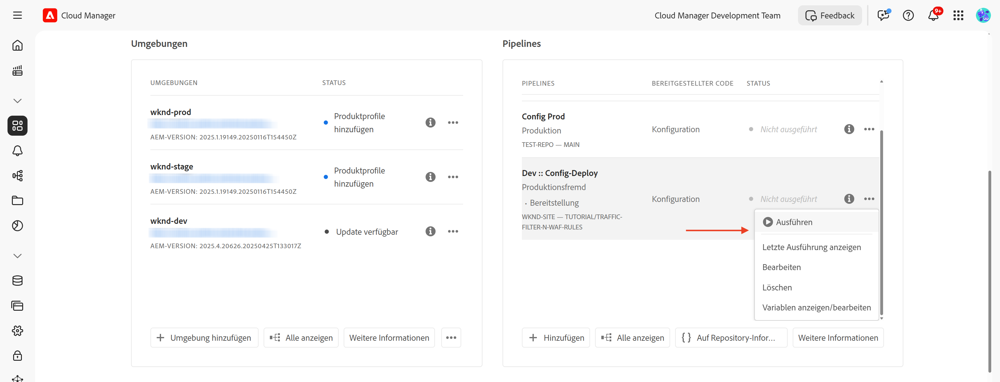

# Schützen von AEM-Websites mithilfe standardmäßiger Traffic-Filterregeln

Erfahren Sie, wie Sie AEM-Websites mithilfe von _von Adobe empfohlenen_ Standard-Traffic-Filterregeln **in AEM as a Cloud Service vor Denial of Service (DoS), Distributed Denial of Service (DDoS** und Bot-Missbrauch schützen können.


>[!VIDEO](https://video.tv.adobe.com/v/3469395/?quality=12&learn=on)

## Lernziele

- Überprüfen Sie die von Adobe empfohlenen Standard-Traffic-Filterregeln.
- Definieren, Bereitstellen, Testen und Analysieren der Ergebnisse der Regeln.
- Erfahren Sie, wann und wie Sie die Regeln auf der Grundlage von Traffic-Mustern einschränken.
- Erfahren Sie, wie Sie mit dem AEM-Aktionscenter von den Regeln generierte Warnhinweise überprüfen können.

### Implementierungsübersicht

Zu den Implementierungsschritten gehören:

- Hinzufügen der standardmäßigen Traffic-Filterregeln zur `/config/cdn.yaml` des AEM-WKND-Projekts.
- Übertragen und Übertragen der Änderungen in das Cloud Manager-Git-Repository.
- Bereitstellen der Änderungen in der AEM-Umgebung mithilfe der Cloud Manager-Konfigurations-Pipeline.
- Testen der Regeln durch Simulieren des DoS-Angriffs mit [Vegeta](https://github.com/tsenart/vegeta)
- Analyse der Ergebnisse mithilfe der AEMCS CDN-Protokolle und des ELK-Dashboard-Tools

## Voraussetzungen

Bevor Sie fortfahren, vergewissern Sie sich, dass Sie die erforderlichen Schritte ausgeführt haben, wie im Tutorial [Einrichten von Traffic-Filtern und WAF-Regeln](../setup.md) beschrieben. Außerdem haben Sie das [AEM WKND Sites-Projekt](https://github.com/adobe/aem-guides-wknd) geklont und in Ihrer AEM-Umgebung bereitgestellt.

## Wichtigste Aktionen der Regeln

Bevor wir in die Details der Standard-Traffic-Filterregeln eintauchen, lassen Sie uns die wichtigsten Aktionen verstehen, die diese Regeln durchführen. Das `action` Attribut in jeder Regel definiert, wie der Traffic-Filter reagieren soll, wenn die Bedingungen erfüllt sind. Zu den Maßnahmen gehören:

- **Log**: Die Regeln protokollieren die Ereignisse für die Überwachung und Analyse, sodass Sie Traffic-Muster überprüfen und Schwellenwerte nach Bedarf anpassen können. Sie wird durch das `type: log`-Attribut angegeben.

- **Warnhinweis**: Der Regel-Trigger warnt, wenn die Bedingungen erfüllt sind, und hilft Ihnen, potenzielle Probleme zu identifizieren. Sie wird durch das `alert: true`-Attribut angegeben.

- **Blockieren**: Die Regeln blockieren den Traffic, wenn die Bedingungen erfüllt sind, und verhindern den Zugriff auf Ihre AEM-Site. Sie wird durch das `action: block`-Attribut angegeben.

## Regeln überprüfen und definieren

Adobe-empfohlene Standard-Traffic-Filterregeln dienen als Grundlage für die Identifizierung potenziell schadhafter Traffic-Muster, indem Ereignisse wie IP-basierte Ratenbeschränkungen protokolliert und Traffic aus bestimmten Ländern blockiert werden. Diese Protokolle helfen Teams dabei, Schwellenwerte zu validieren und fundierte Entscheidungen für **Übergang zum Blockierungsmodus)** treffen, ohne den legitimen Traffic zu unterbrechen.

Sehen wir uns die drei standardmäßigen Traffic-Filterregeln an, die Sie der `/config/cdn.yaml`-Datei des AEM-WKND-Projekts hinzufügen sollten:

- **DoS am Edge verhindern**: Diese Regel erkennt potenzielle DoS-Angriffe (Denial of Service) am CDN-Edge, indem sie Anforderungen pro Sekunde (RPS) von Client-IPs überwacht.
- **DoS am Ursprung verhindern**: Diese Regel erkennt potenzielle DoS-Angriffe (Denial of Service) am Ursprung, indem sie Abrufanfragen von Client-IPs überwacht.
- **OFAC-Länder blockieren**: Diese Regel blockiert den Zugriff von bestimmten Ländern, die unter die Einschränkungen des OFAC (Office of Foreign Assets Control) fallen.

### &#x200B;1. Verhindern von DoS auf der Edge

Diese Regel **sendet einen Warnhinweis** wenn sie einen potenziellen DoS-Angriff (Denial of Service) im CDN erkennt. Das Kriterium zum Auslösen dieser Regel besteht darin, dass ein Client am Edge **500 Anfragen pro Sekunde** (gemittelt über 10 Sekunden) pro CDN-POP (Point of Presence) überschreitet.

Er zählt **alle** Anfragen und gruppiert sie nach Client-IP.

```yaml
kind: "CDN"
version: "1"
metadata:
  envTypes: ["dev", "stage", "prod"]
data:
  trafficFilters:
    rules:
    - name: prevent-dos-attacks-edge
      when:
        reqProperty: tier
        equals: 'publish'
      rateLimit:
        limit: 500
        window: 10
        penalty: 300
        count: all
        groupBy:
          - reqProperty: clientIp
      action:
        type: log
        alert: true
```

Trigger Das `action`-Attribut gibt an, dass die Regel die Ereignisse protokollieren und einen Warnhinweis ausgeben soll, wenn die Bedingungen erfüllt sind. Auf diese Weise können Sie potenzielle DoS-Angriffe überwachen, ohne den rechtmäßigen Traffic zu blockieren. Ihr Ziel ist es jedoch, diese Regel letztendlich in den Blockierungsmodus zu überführen, sobald Sie die Traffic-Muster validiert und die Schwellenwerte angepasst haben.

### &#x200B;2. DoS am Ursprung verhindern

Diese Regel **sendet einen Warnhinweis** wenn sie einen potenziellen DoS-Angriff (Denial of Service) am Ursprung erkennt. Das Kriterium zum Auslösen dieser Regel besteht darin, dass ein Client zu Beginn **100 Anfragen pro Sekunde** (gemittelt über 10 Sekunden) pro Client-IP überschreitet.

Er zählt **Abrufe** (Cache-Bypassing-Anfragen) und gruppiert sie nach Client-IP.

```yaml
...
    - name: prevent-dos-attacks-origin
      when:
        reqProperty: tier
        equals: 'publish'
      rateLimit:
        limit: 100
        window: 10
        penalty: 300
        count: fetches
        groupBy:
          - reqProperty: clientIp
      action:
        type: log
        alert: true
```

Trigger Das `action`-Attribut gibt an, dass die Regel die Ereignisse protokollieren und einen Warnhinweis ausgeben soll, wenn die Bedingungen erfüllt sind. Auf diese Weise können Sie potenzielle DoS-Angriffe überwachen, ohne den rechtmäßigen Traffic zu blockieren. Ihr Ziel ist es jedoch, diese Regel letztendlich in den Blockierungsmodus zu überführen, sobald Sie die Traffic-Muster validiert und die Schwellenwerte angepasst haben.

### &#x200B;3. Block OFAC-Länder

Diese Regel blockiert den Zugriff aus bestimmten Ländern, die unter [OFAC](https://ofac.treasury.gov/sanctions-programs-and-country-information)-Beschränkungen fallen.
Sie können die Länderliste nach Bedarf überprüfen und ändern.

```yaml
...
    - name: block-ofac-countries
      when:
        allOf:
          - { reqProperty: tier, in: ["author", "publish"] }
          - reqProperty: clientCountry
            in:
              - SY
              - BY
              - MM
              - KP
              - IQ
              - CD
              - SD
              - IR
              - LR
              - ZW
              - CU
              - CI
      action: block
```

Das Attribut `action` gibt an, dass die Regel den Zugriff für die angegebenen Länder blockieren soll. So verhindern Sie den Zugriff auf Ihre AEM-Site aus Regionen, die Sicherheitsrisiken darstellen können.

Die vollständige `cdn.yaml` mit den oben genannten Regeln sieht wie folgt aus:


## Regeln bereitstellen

Gehen Sie wie folgt vor, um die oben genannten Regeln bereitzustellen:

- Übertragen und pushen Sie die Änderungen in das Cloud Manager-Git-Repository.

- Stellen Sie die Änderungen mithilfe der Cloud Manager-Konfigurations-Pipeline ([ erstellt) in der AEM-](../setup.md#deploy-rules-using-adobe-cloud-manager) bereit.

  

## Testregeln

Um die Effektivität der Standard-Traffic-Filterregeln zu überprüfen, simulieren Sie sowohl **CDN Edge** als auch **Origin** hohen Anfrage-Traffic mit [Vegeta](https://github.com/tsenart/vegeta), einem vielseitigen HTTP-Lasttest-Tool.

- DoS-Regel am Edge testen (Limit von 500 U/s). Der folgende Befehl simuliert 200 Anfragen pro Sekunde für 15 Sekunden, was den Edge-Schwellenwert (500 rps) überschreitet.

  ```shell
  $echo "GET https://publish-p63947-e1249010.adobeaemcloud.com/us/en.html" | vegeta attack -rate=200 -duration=15s | vegeta report
  ```

  

  >[!IMPORTANT]
  >
  >  Beachten Sie die *100%* Erfolgs- und _200_ Status-Codes im obigen Bericht. Da Regeln auf `log` und `alert` festgelegt sind, werden die Anfragen _nicht blockiert_ aber zu Überwachungs-, Analyse- und Warnzwecken protokolliert.

- DoS-Regel am Ursprung testen (Grenzwert von 100 U/s). Der folgende Befehl simuliert 110 Abrufanforderungen pro Sekunde für 1 Sekunde, was den Ursprungsschwellenwert (100 rps) überschreitet. Um die Cache-Umgehung von Anfragen zu simulieren, wird die `targets.txt`-Datei mit eindeutigen Abfrageparametern erstellt, um sicherzustellen, dass jede Anfrage als Abrufanfrage behandelt wird.

  ```shell
  # Create targets.txt with unique query parameters
  $for i in {1..110}; do
    echo "GET https://publish-p63947-e1249010.adobeaemcloud.com/us/en.html?ts=$(date +%s)$i"
  done > targets.txt
  
  # Use the targets.txt file to simulate fetch requests
  $vegeta attack -rate=110 -duration=1s -targets=targets.txt | vegeta report
  ```

  

  >[!IMPORTANT]
  >
  >  Beachten Sie die *100%* Erfolgs- und _200_ Status-Codes im obigen Bericht. Da Regeln auf `log` und `alert` festgelegt sind, werden die Anfragen _nicht blockiert_ aber zu Überwachungs-, Analyse- und Warnzwecken protokolliert.

- Der Einfachheit halber wird die OFAC-Regel hier nicht getestet.

## Warnungen überprüfen

Warnhinweise werden generiert, wenn die Traffic-Filterregeln ausgelöst werden. Sie können diese Warnhinweise im [AEM-Aktionscenter](https://experience.adobe.com/aem/actions-center) überprüfen.


## Ergebnisse analysieren

Um die Ergebnisse der Traffic-Filterregeln zu analysieren, können Sie die AEMCS-CDN-Protokolle und das ELK-Dashboard-Tool verwenden. Befolgen Sie die Anweisungen im Abschnitt [CDN-Protokollaufnahme](../setup.md#ingest-cdn-logs) Einrichtung , um die CDN-Protokolle in den ELK-Stack aufzunehmen.

Im folgenden Screenshot sehen Sie die CDN-Protokolle der AEM-Entwicklungsumgebung, die in den ELK-Stack aufgenommen wurden.


Innerhalb des ELK-Programms sollte das **CDN Traffic Dashboard** die Spitze bei den **Edge** und **Origin** während der simulierten DoS-Angriffe anzeigen.

Die beiden Bedienfelder _Edge RPS pro Client-IP und POP_ und _Origin RPS pro Client-IP und POP_ zeigen die Anforderungen pro Sekunde (RPS) am Edge bzw. am Ursprung an, gruppiert nach Client-IP und Point of Presence (POP).


Sie können auch andere Bedienfelder im CDN-Traffic-Dashboard verwenden, um die Traffic-Muster zu analysieren, z _B. „Top-Client_, _Top-Länder_ und _Top-Benutzeragenten_. Diese Bedienfelder helfen Ihnen, potenzielle Bedrohungen zu identifizieren und Ihre Traffic-Filterregeln entsprechend anzupassen.

### Splunk-Integration

Kundinnen und Kunden, die die [Splunk Log-Weiterleitung](https://experienceleague.adobe.com/de/docs/experience-manager-cloud-service/content/implementing/developing/logging#splunk-logs) aktiviert haben, können neue Dashboards erstellen, um Traffic-Muster zu analysieren. 

Um Dashboards in Splunk zu erstellen, folgen Sie den Schritten [Splunk-Dashboards für AEMCS CDN Log Analysis](https://github.com/adobe/AEMCS-CDN-Log-Analysis-Tooling/blob/main/Splunk/README.md#splunk-dashboards-for-aemcs-cdn-log-analysis).

Der folgende Screenshot zeigt ein Beispiel für ein Splunk-Dashboard, das die maximalen Ursprungs- und Edge-Anforderungen pro IP anzeigt, damit Sie potenzielle DoS-Angriffe identifizieren können.


## Wann und wie Regeln verfeinert werden

Sie möchten verhindern, dass rechtmäßiger Traffic blockiert wird, und gleichzeitig Ihre AEM-Site vor potenziellen Bedrohungen schützen. Die standardmäßigen Traffic-Filterregeln sind so konzipiert, dass sie Bedrohungen warnen und protokollieren (und schließlich blockieren, wenn der Modus gewechselt wird), ohne den rechtmäßigen Traffic zu blockieren.

Gehen Sie wie folgt vor, um die Regeln zu verfeinern:

- **Traffic-Muster überwachen**: Verwenden Sie die CDN-Protokolle und das ELK-Dashboard, um Traffic-Muster zu überwachen und Anomalien oder Traffic-Spitzen zu identifizieren.
- **Anpassen von**: Passen Sie die Schwellenwerte (Erhöhen oder Verringern der Ratenbeschränkungen) in den Regeln basierend auf den Traffic-Mustern an, um sie besser an Ihre spezifischen Anforderungen anzupassen. Wenn Sie beispielsweise bemerken, dass rechtmäßiger Traffic die Warnhinweise ausgelöst hat, können Sie die Ratenbeschränkungen erhöhen oder die Gruppierungen anpassen.
Die folgende Tabelle enthält Anleitungen zur Auswahl der Schwellenwerte:

  | Variante | Wert |
  | :--------- | :------- |
  | Ursprung | Nehmen Sie den höchsten Wert der maximalen Ursprungsanfragen pro IP/POP unter **normalen** Traffic-Bedingungen (d. h. nicht die Rate zum Zeitpunkt eines DDoS-Angriffs) und erhöhen Sie ihn um ein Vielfaches |
  | Edge | Nehmen Sie den höchsten Wert der maximalen Edge-Anfragen pro IP/POP unter **normalen** Traffic-Bedingungen (d. h. nicht die Rate zum Zeitpunkt eines DDoS-Angriffs) und erhöhen Sie ihn um ein Vielfaches |

  Weitere Einzelheiten finden Sie [ Abschnitt „Auswählen ](../../blocking-dos-attack-using-traffic-filter-rules.md#choosing-threshold-values) Schwellenwerten“.

- **Wechseln zu Blockierungsregeln**: Nachdem Sie die Traffic-Muster validiert und die Schwellenwerte angepasst haben, sollten Sie die Regeln in den Blockierungsmodus wechseln.

## Zusammenfassung

In diesem Tutorial haben Sie gelernt, wie Sie AEM-Websites mithilfe von Adobe-empfohlenen Standard-Traffic-Filterregeln in AEM as a Cloud Service vor Denial of Service (DoS), Distributed Denial of Service (DDoS) und Bot-Missbrauch schützen können.

## Empfohlene WAF-Regeln

Erfahren Sie, wie Sie die von Adobe empfohlenen WAF-Regeln implementieren, um Ihre AEM-Websites vor komplexen Bedrohungen zu schützen, die herkömmliche Sicherheitsmaßnahmen durch fortschrittliche Verfahren umgehen.

<!-- CARDS
{target = _self}

* ./using-waf-rules.md
  {title = Protecting AEM websites using WAF traffic filter rules}
  {description = Learn how to protect AEM websites from sophisticated threats including DoS, DDoS, and bot abuse using Adobe-recommended Web Application Firewall (WAF) traffic filter rules in AEM as a Cloud Service.}
  {image = ../assets/use-cases/using-waf-rules.png}
  {cta = Activate WAF}
-->
<!-- START CARDS HTML - DO NOT MODIFY BY HAND -->
<div class="columns">
    <div class="column is-half-tablet is-half-desktop is-one-third-widescreen" aria-label="Protecting AEM websites using WAF traffic filter rules">
        <div class="card" style="height: 100%; display: flex; flex-direction: column; height: 100%;">
            <div class="card-image">
                <figure class="image x-is-16by9">
                    <a href="./using-waf-rules.md" title="Schützen von AEM-Websites mithilfe von WAF-Traffic-Filterregeln" target="_self" rel="referrer">
                        
                    </a>
                </figure>
            </div>
            <div class="card-content is-padded-small" style="display: flex; flex-direction: column; flex-grow: 1; justify-content: space-between;">
                <div class="top-card-content">
                    <p class="headline is-size-6 has-text-weight-bold">
                        <a href="./using-waf-rules.md" target="_self" rel="referrer" title="Schützen von AEM-Websites mithilfe von WAF-Traffic-Filterregeln">Schutz von AEM-Websites mithilfe von WAF-Traffic-Filterregeln</a>
                    </p>
                    <p class="is-size-6">Erfahren Sie, wie Sie AEM-Websites mithilfe der von Adobe empfohlenen Traffic-Filterregeln der Web Application Firewall (WAF) in AEM as a Cloud Service vor komplexen Bedrohungen wie DoS, DDoS und Bot-Missbrauch schützen.</p>
                </div>
                <a href="./using-waf-rules.md" target="_self" rel="referrer" class="spectrum-Button spectrum-Button--outline spectrum-Button--primary spectrum-Button--sizeM" style="align-self: flex-start; margin-top: 1rem;">
                    <span class="spectrum-Button-label has-no-wrap has-text-weight-bold">WAF aktivieren</span>
                </a>
            </div>
        </div>
    </div>
</div>
<!-- END CARDS HTML - DO NOT MODIFY BY HAND -->


## Anwendungsfälle - über Standardregeln hinaus

Bei komplexeren Szenarien können Sie die folgenden Anwendungsfälle untersuchen, die zeigen, wie Sie benutzerdefinierte Traffic-Filterregeln basierend auf bestimmten Geschäftsanforderungen implementieren:

<!-- CARDS
{target = _self}

* ../how-to/request-logging.md

* ../how-to/request-blocking.md

* ../how-to/request-transformation.md
-->
<!-- START CARDS HTML - DO NOT MODIFY BY HAND -->
<div class="columns">
    <div class="column is-half-tablet is-half-desktop is-one-third-widescreen" aria-label="Monitoring sensitive requests">
        <div class="card" style="height: 100%; display: flex; flex-direction: column; height: 100%;">
            <div class="card-image">
                <figure class="image x-is-16by9">
                    <a href="../how-to/request-logging.md" title="Überwachen sensibler Anfragen" target="_self" rel="referrer">
                        
                    </a>
                </figure>
            </div>
            <div class="card-content is-padded-small" style="display: flex; flex-direction: column; flex-grow: 1; justify-content: space-between;">
                <div class="top-card-content">
                    <p class="headline is-size-6 has-text-weight-bold">
                        <a href="../how-to/request-logging.md" target="_self" rel="referrer" title="Überwachen sensibler Anfragen">Überwachen sensibler Anfragen</a>
                    </p>
                    <p class="is-size-6">Erfahren Sie, wie Sie sensible Anfragen überwachen, indem Sie sie mithilfe von Traffic-Filterregeln in AEM as a Cloud Service protokollieren.</p>
                </div>
                <a href="../how-to/request-logging.md" target="_self" rel="referrer" class="spectrum-Button spectrum-Button--outline spectrum-Button--primary spectrum-Button--sizeM" style="align-self: flex-start; margin-top: 1rem;">
                    <span class="spectrum-Button-label has-no-wrap has-text-weight-bold">Mehr erfahren</span>
                </a>
            </div>
        </div>
    </div>
    <div class="column is-half-tablet is-half-desktop is-one-third-widescreen" aria-label="Restricting access">
        <div class="card" style="height: 100%; display: flex; flex-direction: column; height: 100%;">
            <div class="card-image">
                <figure class="image x-is-16by9">
                    <a href="../how-to/request-blocking.md" title="Einschränken des Zugriffs" target="_self" rel="referrer">
                        
                    </a>
                </figure>
            </div>
            <div class="card-content is-padded-small" style="display: flex; flex-direction: column; flex-grow: 1; justify-content: space-between;">
                <div class="top-card-content">
                    <p class="headline is-size-6 has-text-weight-bold">
                        <a href="../how-to/request-blocking.md" target="_self" rel="referrer" title="Einschränken des Zugriffs">Einschränken des Zugriffs</a>
                    </p>
                    <p class="is-size-6">Erfahren Sie, wie Sie den Zugriff einschränken, indem Sie bestimmte Anfragen mithilfe von Traffic-Filterregeln in AEM as a Cloud Service blockieren.</p>
                </div>
                <a href="../how-to/request-blocking.md" target="_self" rel="referrer" class="spectrum-Button spectrum-Button--outline spectrum-Button--primary spectrum-Button--sizeM" style="align-self: flex-start; margin-top: 1rem;">
                    <span class="spectrum-Button-label has-no-wrap has-text-weight-bold">Mehr erfahren</span>
                </a>
            </div>
        </div>
    </div>
    <div class="column is-half-tablet is-half-desktop is-one-third-widescreen" aria-label="Normalizing requests">
        <div class="card" style="height: 100%; display: flex; flex-direction: column; height: 100%;">
            <div class="card-image">
                <figure class="image x-is-16by9">
                    <a href="../how-to/request-transformation.md" title="Normalisieren von Anfragen" target="_self" rel="referrer">
                        
                    </a>
                </figure>
            </div>
            <div class="card-content is-padded-small" style="display: flex; flex-direction: column; flex-grow: 1; justify-content: space-between;">
                <div class="top-card-content">
                    <p class="headline is-size-6 has-text-weight-bold">
                        <a href="../how-to/request-transformation.md" target="_self" rel="referrer" title="Normalisieren von Anfragen">Normalisieren von Anfragen</a>
                    </p>
                    <p class="is-size-6">Erfahren Sie, wie Sie Anfragen normalisieren können, indem Sie sie mithilfe von Traffic-Filterregeln in AEM as a Cloud Service transformieren.</p>
                </div>
                <a href="../how-to/request-transformation.md" target="_self" rel="referrer" class="spectrum-Button spectrum-Button--outline spectrum-Button--primary spectrum-Button--sizeM" style="align-self: flex-start; margin-top: 1rem;">
<span class="spectrum-Button-label has-no-wrap has-text-weight-bold">Mehr erfahren</span>
</a>
            </div>
        </div>
    </div>
</div>
<!-- END CARDS HTML - DO NOT MODIFY BY HAND -->


## Zusätzliche Ressourcen

- [Empfohlene Starterregeln](https://experienceleague.adobe.com/de/docs/experience-manager-cloud-service/content/security/traffic-filter-rules-including-waf#recommended-starter-rules)
