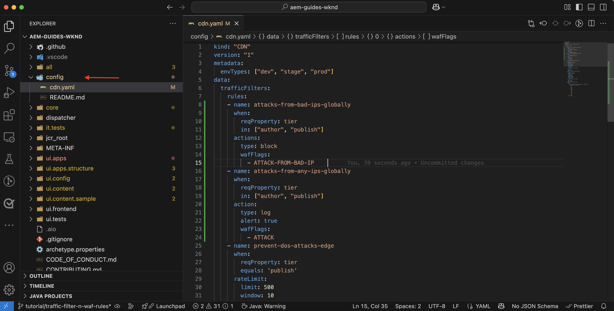
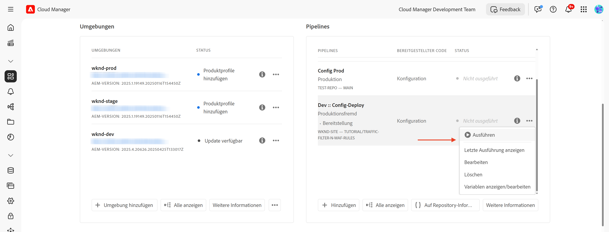
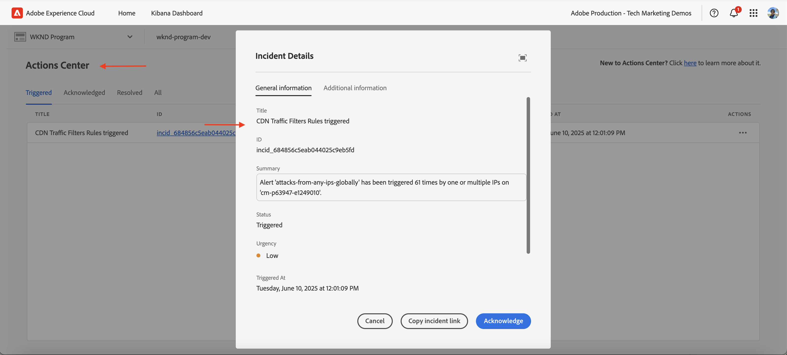
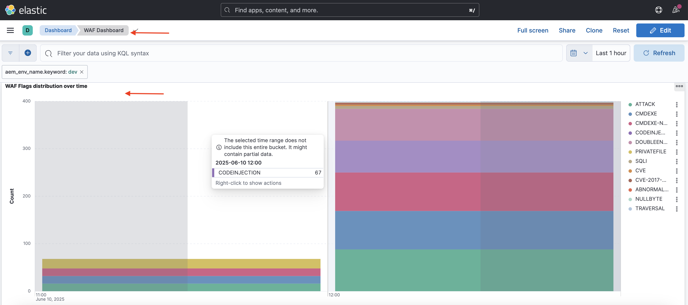
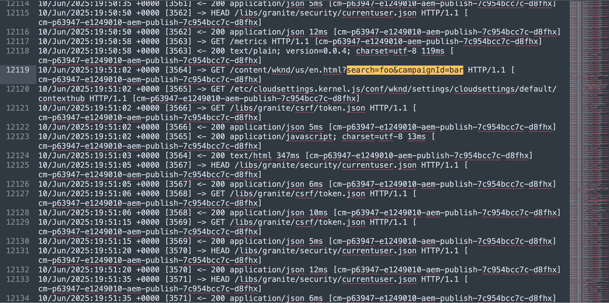

# Schützen von AEM-Websites mit WAF-Regeln

Erfahren Sie, wie Sie AEM-Websites mit _von Adobe empfohlenen_ **Regeln für die Web Application Firewall (WAF)** in AEM as a Cloud Service vor komplexen Bedrohungen wie DoS- und DDoS-Angriffen sowie Bot-Missbrauch schützen.

Komplexe Angriffe zeichnen sich durch hohe Anfrageraten, komplizierte Muster und den Einsatz fortschrittlicher Methoden zur Umgehung herkömmlicher Sicherheitsmaßnahmen aus.

>[!IMPORTANT]
>
> WAF-Traffic-Filterregeln erfordern eine zusätzliche Lizenz für **WAF-DDoS-Schutz** oder **Erweiterte Sicherheit**. Standard-Traffic-Filterregeln sind für Kundinnen und Kunden von Sites und Forms standardmäßig verfügbar.


>[!VIDEO](https://video.tv.adobe.com/v/3469397/?quality=12&learn=on)

## Lernziele

- Prüfen der von Adobe empfohlenen WAF-Regeln.
- Definieren, Implementieren und Testen der Regeln und Analysieren der Ergebnisse.
- Zeitpunkt und Methode zum Optimieren von Regeln basierend auf den Ergebnissen.
- Verwenden des AEM-Aktions-Centers zur Prüfung der von Regeln generierten Warnhinweise.

### Implementierung – Überblick

Zu den Implementierungsschritten gehören:

- Hinzufügen der WAF-Regeln zur Datei `/config/cdn.yaml` des AEM WKND-Projekts.
- Übertragen und Pushen der Änderungen in das Cloud Manager-Git-Repository.
- Bereitstellen der Änderungen in der AEM-Umgebung mit der Konfigurations-Pipeline von Cloud Manager. 
- Testen der Regeln durch Simulieren eines DDoS-Angriffs mit [Nikto](https://github.com/sullo/nikto/wiki).
- Analysieren der Ergebnisse mit den AEMCS CDN-Protokollen und den ELK-Dashboard-Tools.

## Voraussetzungen

Bevor Sie fortfahren, stellen Sie sicher, dass Sie die erforderliche Einrichtung wie im Tutorial [Einrichten von Traffic-Filter- und WAF-Regeln](../setup.md) beschrieben abgeschlossen haben. Außerdem müssen Sie das [AEM WKND Sites-Projekt](https://github.com/adobe/aem-guides-wknd) geklont und in Ihrer AEM-Umgebung bereitgestellt haben.

## Prüfen und Definieren von Regeln

Die von Adobe empfohlenen Regeln der Web Application Firewall (WAF) sind unverzichtbar, um AEM-Websites vor komplexen Bedrohungen wie DoS- und DDoS-Angriffen sowie Bot-Missbrauch zu schützen. Komplexe Angriffe zeichnen sich häufig durch hohe Anfrageraten, komplizierte Muster und den Einsatz fortschrittlicher Methoden (Protokoll- oder Payload-basierte Angriffe) zur Umgehung herkömmlicher Sicherheitsmaßnahmen aus.

Sehen wir uns drei empfohlene WAF-Regeln an, die zur Datei `cdn.yaml` im AEM WKND-Projekt hinzugefügt werden sollten:

### &#x200B;1. Angriffe von bekannten bösartigen IPs blockieren

Diese Regel **blockiert** Anfragen, die sowohl verdächtig aussehen *als auch* von IP-Adressen stammen, die als bösartig markiert sind. Da beide Kriterien erfüllt sind, können wir davon ausgehen, dass das Risiko falsch-positiver Ergebnisse (Blockierung von legitimem Traffic) sehr gering ist. Die bekannten schädlichen IPs werden auf Basis von Bedrohungsdaten-Feeds und anderen Quellen identifiziert.

Zur Identifikation dieser Anfragen wird die WAF-Markierung `ATTACK-FROM-BAD-IP` verwendet. Sie aggregiert mehrere der [hier aufgelisteten](https://experienceleague.adobe.com/de/docs/experience-manager-cloud-service/content/security/traffic-filter-rules-including-waf#waf-flags-list) WAF-Markierungen.

```yaml
kind: "CDN"
version: "1"
metadata:
  envTypes: ["dev", "stage", "prod"]
data:
  trafficFilters:
    rules:
    - name: attacks-from-bad-ips-globally
      when:
        reqProperty: tier
        in: ["author", "publish"]
      action:
        type: block
        wafFlags:
          - ATTACK-FROM-BAD-IP
```

### &#x200B;2. Angriffe von beliebigen IP-Adressen global protokollieren (und später blockieren)

Diese Regel **protokolliert** Anfragen, die als potenzielle Angriffe identifiziert werden, auch wenn die IP-Adressen nicht in den Feeds für Bedrohungsinformationen gefunden werden.

Zur Identifikation dieser Anfragen wird die WAF-Markierung `ATTACK` verwendet. Ähnlich wie bei `ATTACK-FROM-BAD-IP` aggregiert sie mehrere WAF-Markierungen.

Diese Anfragen sind wahrscheinlich bösartig, aber da die IP-Adressen in den Feeds für Bedrohungsinformationen nicht enthalten sind, kann es ratsam sein, im `log`-Modus statt im Blockmodus zu starten. Analysieren Sie die Protokolle auf falsch-positive Ergebnisse und **stellen Sie nach der Validierung sicher, dass die Regel in den `block`-Modus wechselt**.

```yaml
...
    - name: attacks-from-any-ips-globally
      when:
        reqProperty: tier
        in: ["author", "publish"]
      action:
        type: log
        alert: true
        wafFlags:
          - ATTACK
```

Alternativ können Sie den `block`-Modus sofort verwenden, wenn Sie aufgrund Ihrer Unternehmensanforderungen keinerlei Risiko eingehen möchten, dass bösartiger Traffic zugelassen wird.

Diese empfohlenen WAF-Regeln bieten eine zusätzliche Sicherheitsebene gegen bekannte und neue Bedrohungen.



## Migration zu den neuesten von Adobe empfohlenen WAF-Regeln

Vor der Einführung der WAF-Markierungen `ATTACK-FROM-BAD-IP` und `ATTACK` (im Juli 2025) wurden die folgenden WAF-Regeln empfohlen. Sie enthielten eine Liste spezifischer WAF-Markierungen zum Blockieren von Anfragen, die bestimmten Kriterien wie `SANS`, `TORNODE`, `NOUA` usw. entsprachen.

```yaml
...
data:
  trafficFilters:
    rules:
    ...
    # Enable WAF protections (only works if WAF is enabled for your environment)
      - name: block-waf-flags
        when:
          reqProperty: tier
          matches: "author|publish"
        action:
          type: block
          wafFlags:
            - SANS
            - TORNODE
            - NOUA
            - SCANNER
            - USERAGENT
            - PRIVATEFILE
            - ABNORMALPATH
            - TRAVERSAL
            - NULLBYTE
            - BACKDOOR
            - LOG4J-JNDI
            - SQLI
            - XSS
            - CODEINJECTION
            - CMDEXE
            - NO-CONTENT-TYPE
            - UTF8
...
```

Die oben gezeigte Regel ist nach wie vor gültig. Wir empfehlen jedoch die Migration zu den neuen Regeln mit den WAF-Markierungen `ATTACK-FROM-BAD-IP` und `ATTACK`, _sofern Sie die `wafFlags` noch nicht an Ihre Unternehmensanforderungen angepasst haben_.

Mit folgenden Schritten können Sie zu den neuen Regeln migrieren und dabei den Best Practices folgen:

- Prüfen Sie die vorhandenen WAF-Regeln in Ihrer Datei `cdn.yaml`, die dem obigen Beispiel ähneln können. Vergewissern Sie sich, dass keine auf Ihre Unternehmensanforderungen zugeschnittene Anpassung der `wafFlags` vorliegt.

- Ersetzen Sie Ihre bestehenden WAF-Regeln durch die neuen von Adobe empfohlenen WAF-Regeln, die die Markierungen `ATTACK-FROM-BAD-IP` und `ATTACK` verwenden. Stellen Sie sicher, dass sich alle Regeln im Blockmodus befinden.

Auch wenn Sie die `wafFlags` zuvor angepasst haben, können Sie zu diesen neuen Regeln migrieren. Gehen Sie dabei jedoch vorsichtig vor und stellen Sie sicher, dass alle Anpassungen in die überarbeiteten Regeln übernommen werden.

Durch die Migration können Sie Ihre WAF-Regeln vereinfachen und gleichzeitig zuverlässigen Schutz vor komplexen Bedrohungen gewährleisten. Die neuen Regeln zielen darauf ab, die Effektivität zu erhöhen und die Verwaltung zu vereinfachen.


## Bereitstellen der Regeln

Gehen Sie zur Bereitstellung der Regeln wie folgt vor:

- Übernehmen Sie die Änderungen und pushen Sie sie in das Cloud Manager-Git-Repository.

- Implementieren Sie die Änderungen mit der [zuvor erstellten](../setup.md#deploy-rules-using-adobe-cloud-manager) Cloud Manager-Konfigurations-Pipeline in der AEM-Entwicklungsumgebung.

  

## Testen der Regeln

Um die Effektivität der WAF-Regeln zu überprüfen, simulieren Sie einen Angriff mit [Nikto](https://github.com/sullo/nikto), einem Webserver-Scanner, der Sicherheitslücken und Fehlkonfigurationen erkennt. Mit dem folgenden Befehl werden SQL-Injection-Angriffe auf die AEM WKND-Website ausgelöst, die durch die WAF-Regeln geschützt ist.

```shell
$./nikto.pl -useragent "AttackSimulationAgent (Demo/1.0)" -D V -Tuning 9 -ssl -h https://publish-pXXXX-eYYYY.adobeaemcloud.com/us/en.html
```


Weitere Informationen zur Angriffssimulation finden Sie in der Dokumentation zu [Nikto – Scan-Optimierung](https://github.com/sullo/nikto/wiki/Scan-Tuning), in der Sie erfahren, wie Sie den Typ von Testangriffen angeben, die ein- oder ausgeschlossen werden sollen.

## Prüfen von Warnhinweisen

Warnhinweise werden generiert, wenn die Traffic-Filterregeln ausgelöst werden. Sie können diese Warnhinweise im [AEM-Aktionscenter](https://experience.adobe.com/aem/actions-center) prüfen.



## Analysieren der Ergebnisse

Um die Ergebnisse der Traffic-Filterregeln zu analysieren, können Sie die AEMCS CDN-Protokolle und das ELK-Dashboard-Tool verwenden. Befolgen Sie die Anweisungen im Einrichtungsabschnitt [CDN-Protokollaufnahme](../setup.md#ingest-cdn-logs), um die CDN-Protokolle in den ELK-Stack aufzunehmen.

Im folgenden Screenshot sehen Sie die CDN-Protokolle der AEM-Entwicklungsumgebung, die in den ELK-Stack aufgenommen wurden.


In der EKL-Anwendung sollte das **WAF-Dashboard** die entsprechenden Werte in den Spalten für Client-IP (cli_ip), Host, URL, Aktion (waf_action) und Regelname (waf_match) anzeigen.


Außerdem zeigen die Panels **WAF-Flags-Verteilung** und **Top-Angriffe** zusätzliche Details an.




### Splunk-Integration

Kundinnen und Kunden, die die [Splunk Log-Weiterleitung](https://experienceleague.adobe.com/de/docs/experience-manager-cloud-service/content/implementing/developing/logging#splunk-logs) aktiviert haben, können neue Dashboards erstellen, um Traffic-Muster zu analysieren. 

Um Dashboards in Splunk zu erstellen, folgen Sie den Schritten [Splunk-Dashboards für AEMCS CDN Log Analysis](https://github.com/adobe/AEMCS-CDN-Log-Analysis-Tooling/blob/main/Splunk/README.md#splunk-dashboards-for-aemcs-cdn-log-analysis).

## Zeitpunkt und Methode zum Optimieren von Regeln

Sie möchten verhindern, dass legitimer Traffic blockiert wird, und gleichzeitig Ihre AEM-Websites vor komplexen Bedrohungen schützen. Die empfohlenen WAF-Regeln sind als Ausgangspunkt für Ihre Sicherheitsstrategie konzipiert.

Gehen Sie wie folgt vor, um die Regeln zu optimieren:

- **Überwachen Sie Traffic-Muster**: Verwenden Sie die CDN-Protokolle und das ELK-Dashboard, um Traffic-Muster zu überwachen und Anomalien oder Traffic-Spitzen zu identifizieren. Achten Sie auf die Panels _WAF flags distribution_ und _Top attacks_ im ELK-Dashboard, um die Art der erkannten Angriffe zu verstehen.
- **Passen Sie „wafFlags“ an**: Wenn `ATTACK`-Markierungen zu häufig ausgelöst werden oder Sie den Angriffsvektor optimieren möchten, können Sie benutzerdefinierte Regeln mit bestimmten WAF-Markierungen erstellen. Eine vollständige Liste der [WAF-Markierungen](https://experienceleague.adobe.com/de/docs/experience-manager-cloud-service/content/security/traffic-filter-rules-including-waf#waf-flags-list) finden Sie der Dokumentation. Wir empfehlen, neue benutzerdefinierte Regeln zunächst im `log`-Modus auszuprobieren.
- **Wechseln Sie zu Blockierungsregeln**: Nachdem Sie die Traffic-Muster validiert und die WAF-Markierungen angepasst haben, können Sie zu Blockierungsregeln wechseln.

## Zusammenfassung

In diesem Tutorial haben Sie erfahren, wie Sie AEM-Websites mit den von Adobe empfohlenen Regeln für die Web Application Firewall (WAF) vor komplexen Bedrohungen wie DoS- und DDoS-Angriffen sowie Bot-Missbrauch schützen können.

## Anwendungsfälle – jenseits der Standardregeln

Für komplexere Szenarien können Sie die folgenden Anwendungsfälle erkunden. Diese demonstrieren, wie Sie benutzerdefinierte Traffic-Filterregeln basierend auf bestimmten Unternehmensanforderungen implementieren:

<!-- CARDS
{target = _self}

* ../how-to/request-logging.md

* ../how-to/request-blocking.md

* ../how-to/request-transformation.md
-->
<!-- START CARDS HTML - DO NOT MODIFY BY HAND -->
<div class="columns">
    <div class="column is-half-tablet is-half-desktop is-one-third-widescreen" aria-label="Monitoring sensitive requests">
        <div class="card" style="height: 100%; display: flex; flex-direction: column; height: 100%;">
            <div class="card-image">
                <figure class="image x-is-16by9">
                    <a href="../how-to/request-logging.md" title="Überwachen sensibler Anfragen" target="_self" rel="referrer">
                        
                    </a>
                </figure>
            </div>
            <div class="card-content is-padded-small" style="display: flex; flex-direction: column; flex-grow: 1; justify-content: space-between;">
                <div class="top-card-content">
                    <p class="headline is-size-6 has-text-weight-bold">
                        <a href="../how-to/request-logging.md" target="_self" rel="referrer" title="Überwachen sensibler Anfragen">Überwachen sensibler Anfragen</a>
                    </p>
                    <p class="is-size-6">Erfahren Sie, wie Sie sensible Anfragen überwachen, indem Sie sie mit Traffic-Filterregeln in AEM as a Cloud Service protokollieren.</p>
                </div>
                <a href="../how-to/request-logging.md" target="_self" rel="referrer" class="spectrum-Button spectrum-Button--outline spectrum-Button--primary spectrum-Button--sizeM" style="align-self: flex-start; margin-top: 1rem;">
                    <span class="spectrum-Button-label has-no-wrap has-text-weight-bold">Weitere Informationen</span>
                </a>
            </div>
        </div>
    </div>
    <div class="column is-half-tablet is-half-desktop is-one-third-widescreen" aria-label="Restricting access">
        <div class="card" style="height: 100%; display: flex; flex-direction: column; height: 100%;">
            <div class="card-image">
                <figure class="image x-is-16by9">
                    <a href="../how-to/request-blocking.md" title="Einschränken des Zugriffs" target="_self" rel="referrer">
                        
                    </a>
                </figure>
            </div>
            <div class="card-content is-padded-small" style="display: flex; flex-direction: column; flex-grow: 1; justify-content: space-between;">
                <div class="top-card-content">
                    <p class="headline is-size-6 has-text-weight-bold">
                        <a href="../how-to/request-blocking.md" target="_self" rel="referrer" title="Einschränken des Zugriffs">Einschränken des Zugriffs</a>
                    </p>
                    <p class="is-size-6">Erfahren Sie, wie Sie den Zugriff durch Blockierung bestimmter Anfragen mit Traffic-Filterregeln in AEM as a Cloud Service einschränken.</p>
                </div>
                <a href="../how-to/request-blocking.md" target="_self" rel="referrer" class="spectrum-Button spectrum-Button--outline spectrum-Button--primary spectrum-Button--sizeM" style="align-self: flex-start; margin-top: 1rem;">
                    <span class="spectrum-Button-label has-no-wrap has-text-weight-bold">Weitere Informationen</span>
                </a>
            </div>
        </div>
    </div>
    <div class="column is-half-tablet is-half-desktop is-one-third-widescreen" aria-label="Normalizing requests">
        <div class="card" style="height: 100%; display: flex; flex-direction: column; height: 100%;">
            <div class="card-image">
                <figure class="image x-is-16by9">
                    <a href="../how-to/request-transformation.md" title="Normalisieren von Anfragen" target="_self" rel="referrer">
                        
                    </a>
                </figure>
            </div>
            <div class="card-content is-padded-small" style="display: flex; flex-direction: column; flex-grow: 1; justify-content: space-between;">
                <div class="top-card-content">
                    <p class="headline is-size-6 has-text-weight-bold">
                        <a href="../how-to/request-transformation.md" target="_self" rel="referrer" title="Normalisieren von Anfragen">Normalisieren von Anfragen</a>
                    </p>
                    <p class="is-size-6">Erfahren Sie, wie Sie Anfragen durch Transformation mit Traffic-Filterregeln in AEM as a Cloud Service normalisieren.</p>
                </div>
                <a href="../how-to/request-transformation.md" target="_self" rel="referrer" class="spectrum-Button spectrum-Button--outline spectrum-Button--primary spectrum-Button--sizeM" style="align-self: flex-start; margin-top: 1rem;">
<span class="spectrum-Button-label has-no-wrap has-text-weight-bold">Mehr erfahren</span>
</a>
            </div>
        </div>
    </div>
</div>
<!-- END CARDS HTML - DO NOT MODIFY BY HAND -->

## Zusätzliche Ressourcen

- [Empfohlene Anfangsregeln](https://experienceleague.adobe.com/de/docs/experience-manager-cloud-service/content/security/traffic-filter-rules-including-waf#recommended-nonwaf-starter-rules)
- [Liste der WAF-Markierungen](https://experienceleague.adobe.com/de/docs/experience-manager-cloud-service/content/security/traffic-filter-rules-including-waf#waf-flags-list)
