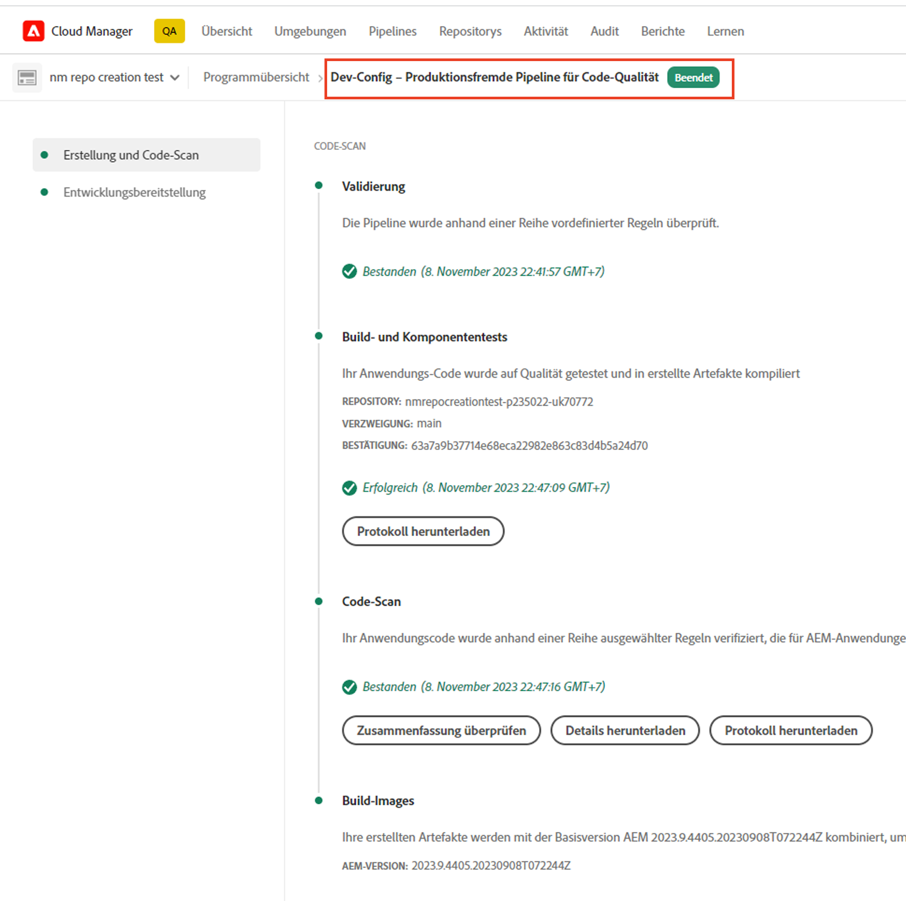
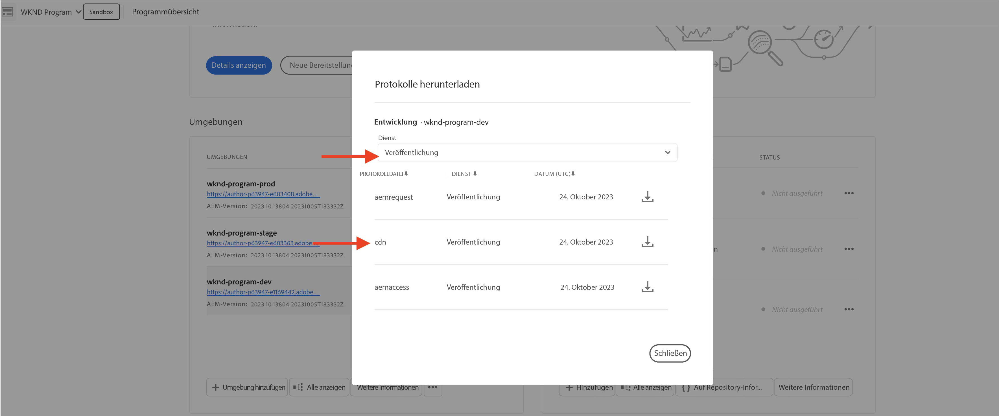
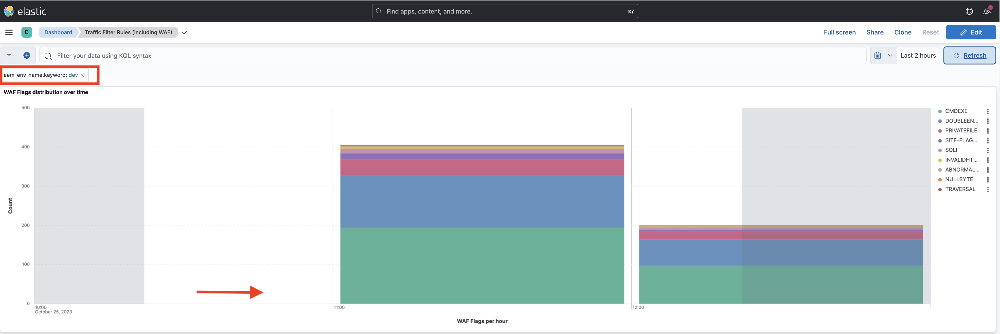

# Beispiele und Ergebnisanalyse von Traffic-Filter-Regeln, einschließlich WAF-Regeln

Erfahren Sie, wie Sie verschiedene Typen von Traffic-Filterregeln deklarieren und die Ergebnisse mithilfe von Adobe Experience Manager as a Cloud Service (AEMCS)-CDN-Protokollen und Dashboard-Tools analysieren.

In diesem Abschnitt werden praktische Beispiele für Traffic-Filter-Regeln, einschließlich WAF-Regeln, vorgestellt. Sie erfahren, wie Sie Anforderungen basierend auf URI (oder Pfad), IP-Adresse, Anzahl der Anforderungen und verschiedenen Anfallstypen protokollieren, zulassen und blockieren, indem Sie die Variable [AEM WKND Sites-Projekt](https://github.com/adobe/aem-guides-wknd#aem-wknd-sites-project).

Darüber hinaus erfahren Sie, wie Sie Dashboard-Tools verwenden, die AEMCS-CDN-Protokolle aufnehmen, um wichtige Metriken über die von Adobe bereitgestellten Beispiel-Dashboards zu visualisieren.

Um Ihre spezifischen Anforderungen zu erfüllen, können Sie benutzerdefinierte Dashboards erweitern und erstellen, um tiefere Einblicke zu erhalten und die Regelkonfigurationen für Ihre AEM Sites zu optimieren.

## Beispiele

Im Folgenden werden verschiedene Beispiele für Traffic-Filter-Regeln, einschließlich WAF-Regeln, vorgestellt. Vergewissern Sie sich, dass Sie den erforderlichen Einrichtungsprozess wie zuvor beschrieben abgeschlossen haben [Einrichtung](./how-to-setup.md) und Sie haben die [AEM WKND Sites-Projekt](https://github.com/adobe/aem-guides-wknd#aem-wknd-sites-project).

### Anforderungen protokollieren

Beginnen bei **Protokollierungsanfragen für WKND-Anmelde- und Abmeldepfade** beim AEM Publish-Dienst.

- Fügen Sie die folgende Regel zum WKND-Projekt hinzu: `/config/cdn.yaml` -Datei.

```yaml
kind: CDN
version: '1'
metadata:
  envTypes:
    - dev
    - stage
    - prod
data:
  trafficFilters:
    rules:
    # On AEM Publish service log WKND Login and Logout requests 
      - name: publish-auth-requests
        when:
          allOf:
            - reqProperty: tier
              matches: publish
            - reqProperty: path
              in:
                - /system/sling/login/j_security_check
                - /system/sling/logout
        action: log
```

- Übertragen Sie die Änderungen in das Cloud Manager-Git-Repository.

- Bereitstellen der Änderungen in AEM Entwicklungsumgebung mithilfe von Cloud Manager `Dev-Config` Konfigurationspipeline [früher erstellt](how-to-setup.md#deploy-rules-through-cloud-manager).

  

- Testen Sie die Regel, indem Sie sich bei der WKND-Site Ihres Programms im Veröffentlichungsdienst anmelden und abmelden (z. B. `https://publish-pXXXX-eYYYY.adobeaemcloud.com/us/en.html`). Sie können `asmith/asmith` als Benutzernamen und Kennwort.

  

#### Analyse{#analyzing}

Im Folgenden werden die Ergebnisse der `publish-auth-requests` -Regel verwenden, indem Sie die AEMCS-CDN-Protokolle aus Cloud Manager herunterladen und die [Dashboard-Tools](how-to-setup.md#analyze-results-using-elk-dashboard-tool), die Sie im vorherigen Kapitel eingerichtet haben.

- Von [Cloud Manager](https://my.cloudmanager.adobe.com/)s **Umgebungen** Karte, laden Sie die AEMCS herunter. **Veröffentlichen** CDN-Protokolle des Dienstes.

  

  >[!TIP]
  >
  >    Es kann bis zu 5 Minuten dauern, bis die neuen Anforderungen in den CDN-Protokollen angezeigt werden.

- Kopieren Sie die heruntergeladene Protokolldatei (beispielsweise `publish_cdn_2023-10-24.log` im folgenden Screenshot) in die `logs/dev` Ordner des Tools Elastic Dashboard .

  

- Aktualisieren Sie die Toolseite des Elastic Dashboard .
   - Oben **Globaler Filter** bearbeiten Sie die `aem_env_name.keyword` und wählen Sie die `dev` Umgebungswert.

     

   - Um das Zeitintervall zu ändern, klicken Sie auf das Kalendersymbol oben rechts und wählen Sie das gewünschte Zeitintervall aus.

     

- Überprüfen Sie die aktualisierten Dashboards.  **Analysierte Anforderungen**, **Gekennzeichnete Anforderungen**, und **Gekennzeichnete Anforderungsdetails** Bedienfelder. Bei übereinstimmenden CDN-Protokolleinträgen sollten die Werte der Client-IP (cli_ip), des Hosts, der URL, der Aktion (waf_action) und des Regelnamens (waf_match) jedes Eintrags angezeigt werden.

  


### Anforderungen blockieren

In diesem Beispiel fügen wir eine Seite in einem _intern_ Ordner unter `/content/wknd/internal` Pfad im bereitgestellten WKND-Projekt. Deklarieren Sie dann eine Traffic-Filterregel, die **blockiert Traffic** zu Unterseiten von einer beliebigen anderen als einer angegebenen IP-Adresse, die mit Ihrer Organisation übereinstimmt (z. B. einem Unternehmens-VPN).

Sie können eine eigene interne Seite erstellen (z. B. `demo-page.html`) oder verwenden Sie die [angehängtes Paket](./assets/demo-internal-pages-package.zip)

- Fügen Sie die folgende Regel im WKND-Projekt hinzu `/config/cdn.yaml` -Datei.

```yaml
kind: CDN
version: '1'
metadata:
  envTypes:
    - dev
    - stage
    - prod
data:
  trafficFilters:
    rules:
    ...

    # Block requests to (demo) internal only page/s from public IP address but allow from internal IP address.
    # Make sure to replace the IP address with your own IP address.
      - name: block-internal-paths
        when:
          allOf:
            - reqProperty: path
              matches: /content/wknd/internal
            - reqProperty: clientIp
              notIn: [192.150.10.0/24]
        action: block
```

- Übertragen Sie die Änderungen in das Cloud Manager-Git-Repository.

- Stellen Sie die Änderungen in der AEM Entwicklungsumgebung mithilfe der [früher erstellt](how-to-setup.md#deploy-rules-through-cloud-manager) `Dev-Config` Konfigurationspipeline in Cloud Manager.

- Testen Sie die Regel, indem Sie beispielsweise auf die interne Seite der WKND-Site zugreifen. `https://publish-pXXXX-eYYYY.adobeaemcloud.com/content/wknd/internal/demo-page.html` oder mithilfe des folgenden CURL-Befehls:

  ```bash
  $ curl -I https://publish-pXXXX-eYYYY.adobeaemcloud.com/content/wknd/internal/demo-page.html
  ```

- Wiederholen Sie den obigen Schritt sowohl von der in der Regel verwendeten IP-Adresse als auch von einer anderen IP-Adresse (z. B. über Ihr Mobiltelefon).

#### Analyse

So analysieren Sie die Ergebnisse der `block-internal-paths` führen Sie dieselben Schritte wie im Abschnitt [früheres Beispiel](#analyzing).

Diesmal sollten Sie jedoch die **Blockierte Anforderungen** und den entsprechenden Werten in den Spalten Client-IP (cli_ip), Host, URL, Aktion (waf_action) und Regelname (waf_match).


### Vermeiden von DoS-Angriffen

Lasst uns **Vermeiden von DoS-Angriffen** durch Blockieren von Anfragen von einer IP-Adresse, die 100 Anfragen pro Sekunde ausführen, wodurch sie fünf Minuten lang blockiert werden.

- Fügen Sie Folgendes hinzu: [Traffic-Filterregel zur Ratenbegrenzung](https://experienceleague.adobe.com/docs/experience-manager-cloud-service/content/security/traffic-filter-rules-including-waf.html#ratelimit-structure) im WKND-Projekt `/config/cdn.yaml` -Datei.

```yaml
kind: CDN
version: '1'
metadata:
  envTypes:
    - dev
    - stage
    - prod
data:
  trafficFilters:
    rules:
    ...
    #  Prevent DoS attacks by blocking client for 5 minutes if they make more than 100 requests in 1 second.
      - name: prevent-dos-attacks
        when:
          reqProperty: path
          like: '*'
        rateLimit:
          limit: 100
          window: 1
          penalty: 300
          groupBy:
            - reqProperty: clientIp
        action: block     
```

>[!WARNING]
>
>In Ihrer Produktionsumgebung können Sie mit Ihrem Web Security-Team zusammenarbeiten, um die entsprechenden Werte für `rateLimit`,

- Übertragen, Übertragen und Bereitstellen von Änderungen, wie im Abschnitt [frühere Beispiele](#logging-requests).

- Um den DoS-Angriff zu simulieren, verwenden Sie Folgendes [Vegeta](https://github.com/tsenart/vegeta) Befehl.

  ```shell
  $ echo "GET https://publish-pXXXX-eYYYY.adobeaemcloud.com/us/en.html" | vegeta attack -rate=120 -duration=5s | vegeta report
  ```

  Dieser Befehl sendet 120 Anfragen für 5 Sekunden und gibt einen Bericht aus. Wie Sie sehen können, beträgt die Erfolgsrate 32,5 %, und für den Rest wird ein 406-HTTP-Antwortcode empfangen, der zeigt, dass der Traffic blockiert wurde.

  

#### Analyse

So analysieren Sie die Ergebnisse der `prevent-dos-attacks` führen Sie dieselben Schritte wie im Abschnitt [früheres Beispiel](#analyzing).

Diesmal sollten Sie viele **Blockierte Anforderungen** und den entsprechenden Werten in den Spalten Client-IP (cli_ip), Host, URL, Aktion (waf_action) und Regelname (waf_match).


Außerdem wird die **Top 100-Angriffe nach Client-IP, Land und Benutzer-Agent** zeigt zusätzliche Details an, die zur weiteren Optimierung der Regelkonfiguration verwendet werden können.


### WAF-Regeln

Die Beispiele für Traffic-Filterregeln können bisher von allen Sites- und Forms-Kunden konfiguriert werden.

Als Nächstes sollten wir das Erlebnis eines Kunden untersuchen, der eine erweiterte Sicherheits- oder WAF-DDoS-Schutzlizenz erworben hat. Dadurch können Sie erweiterte Regeln konfigurieren, um Ihre AEM-Sites vor komplexeren Angriffen zu schützen.

Bevor Sie fortfahren, aktivieren Sie den WAF-DDoS-Schutz für Ihr Programm, wie in der Dokumentation zu Traffic-Filterregeln beschrieben. [Einrichtungsschritte](https://experienceleague.adobe.com/docs/experience-manager-cloud-service/content/security/traffic-filter-rules-including-waf.html?lang=en#setup).

#### Ohne WAFFlags

Lassen Sie uns zunächst das Erlebnis sehen, noch bevor WAF-Regeln deklariert werden. Wenn das WAF-DDoS in Ihrem Programm aktiviert ist, protokolliert Ihr CDN standardmäßig alle Übereinstimmungen mit bösartigem Traffic, sodass Sie über die richtigen Informationen verfügen, um geeignete Regeln zu finden.

Beginnen wir damit, die WKND-Site anzugreifen, ohne die WAF-Regel hinzuzufügen (oder die `wafFlags` -Eigenschaft) und analysieren Sie die Ergebnisse.

- Um einen Angriff zu simulieren, verwenden Sie die [Nikto](https://github.com/sullo/nikto) -Befehl unten, der in 6 Minuten ca. 700 böswillige Anfragen sendet.

  ```shell
  $ ./nikto.pl -useragent "AttackSimulationAgent (Demo/1.0)" -D V -Tuning 9 -ssl -h https://publish-pXXXX-eYYYY.adobeaemcloud.com/us/en.html
  ```

  

  Weitere Informationen zur Angriffssimulation finden Sie in der [Nikto - Scan Tuning](https://github.com/sullo/nikto/wiki/Scan-Tuning) -Dokumentation, in der Sie erfahren, wie Sie die Art der einzuschließenden oder auszuschließenden Testangriffe angeben.

##### Analyse

Um die Ergebnisse der Angriffsimulation zu analysieren, gehen Sie wie im Abschnitt [früheres Beispiel](#analyzing).

Diesmal sollten Sie jedoch die **Gekennzeichnete Anforderungen** und die entsprechenden Werte in den Spalten Client-IP (cli_ip), Host, URL, Aktion (waf_action) und Regelname (waf_match). Mithilfe dieser Informationen können Sie die Ergebnisse analysieren und die Regelkonfiguration optimieren.


Beachten Sie, dass **WAF Flags-Verteilung und Top-Angriffe** -Bedienfelder zeigen zusätzliche Details an, die zur weiteren Optimierung der Regelkonfiguration verwendet werden können.


#### Mit WAFFlags

Fügen wir nun eine WAF-Regel hinzu, die Folgendes enthält: `wafFlags` -Eigenschaft als Teil der `action` -Eigenschaft und **die simulierten Angriffsanfragen blockieren**.

Syntaxbetrachtet ähneln die WAF-Regeln den zuvor erkannten Regeln. Die `action` -Eigenschaft verweist auf eine oder mehrere `wafFlags` -Werte. Weitere Informationen zum `wafFlags`, überprüfen Sie die [WAF-Flags-Liste](https://experienceleague.adobe.com/docs/experience-manager-cloud-service/content/security/traffic-filter-rules-including-waf.html#waf-flags-list) Abschnitt.

- Fügen Sie die folgende Regel im WKND-Projekt hinzu `/config/cdn.yaml` -Datei. Beachten Sie, dass `block-waf-flags` -Regel enthält einige der wafFlags, die in den Dashboard-Tools angezeigt wurden, wenn sie mit simuliertem böswilligem Traffic angegriffen wurden. Tatsächlich ist es empfehlenswert, im Laufe der Zeit Protokolle zu analysieren, um zu bestimmen, welche neuen Regeln zu deklarieren sind, wenn sich die Bedrohungslandschaft entwickelt.

```yaml
kind: CDN
version: '1'
metadata:
  envTypes:
    - dev
    - stage
    - prod
data:
  trafficFilters:
    rules:
    ...     
    # Enable WAF protections (only works if WAF is enabled for your environment)
      - name: block-waf-flags
        when:
          reqProperty: tier
          matches: "author|publish"
        action:
          type: block
          wafFlags:
            - SANS
            - SIGSCI-IP
            - TORNODE
            - NOUA
            - SCANNER
            - USERAGENT
            - PRIVATEFILE
            - ABNORMALPATH
            - TRAVERSAL
            - NULLBYTE
            - BACKDOOR
            - LOG4J-JNDI
            - SQLI
            - XSS
            - CODEINJECTION
            - CMDEXE
            - NO-CONTENT-TYPE
            - UTF8        
```

- Übertragen, Übertragen und Bereitstellen von Änderungen, wie im Abschnitt [frühere Beispiele](#logging-requests).

- Um einen Angriff zu simulieren, verwenden Sie denselben [Nikto](https://github.com/sullo/nikto) -Befehl wie zuvor.

  ```shell
  $ ./nikto.pl -useragent "AttackSimulationAgent (Demo/1.0)" -D V -Tuning 9 -ssl -h https://publish-pXXXX-eYYYY.adobeaemcloud.com/us/en.html
  ```

##### Analyse

Wiederholen Sie die Schritte wie im Abschnitt [früheres Beispiel](#analyzing).

Dieses Mal sollten Einträge unter **Blockierte Anforderungen** und die entsprechenden Werte in den Spalten Client-IP (cli_ip), Host, URL, Aktion (waf_action) und Regelname (waf_match).


Außerdem wird die **WAF Flags-Verteilung und Top-Angriffe** -Bedienfelder zeigen zusätzliche Details an.




### Umfassende Analyse

Im obigen _Analyse_ -Abschnitte, haben Sie gelernt, wie Sie die Ergebnisse der **spezifische Regel** über das Dashboard-Tool. Sie können die Analyseergebnisse mithilfe anderer Dashboard-Bedienfelder weiter untersuchen, darunter:


- Analysierte, gekennzeichnete und blockierte Anforderungen
- Verteilung der WAF-Flags über einen bestimmten Zeitraum
- Ausgelöste Traffic-Filterregeln im Zeitverlauf
- Top-Angriffe nach WAF-Flag-ID
- Traffic-Filter mit der höchsten Auslösung
- Die 100 wichtigsten Angreifer nach Client-IP, Land und Benutzer-Agent


## Nächster Schritt

Machen Sie sich mit empfohlenen [Best Practices](./best-practices.md) Verringerung der Gefahr von Sicherheitsverletzungen.

## Zusätzliche Ressourcen

[Syntax für Traffic-Filterregeln](https://experienceleague.adobe.com/docs/experience-manager-cloud-service/content/security/traffic-filter-rules-including-waf.html#rules-syntax)

[CDN-Protokollformat](https://experienceleague.adobe.com/docs/experience-manager-cloud-service/content/security/traffic-filter-rules-including-waf.html#cdn-log-format)

