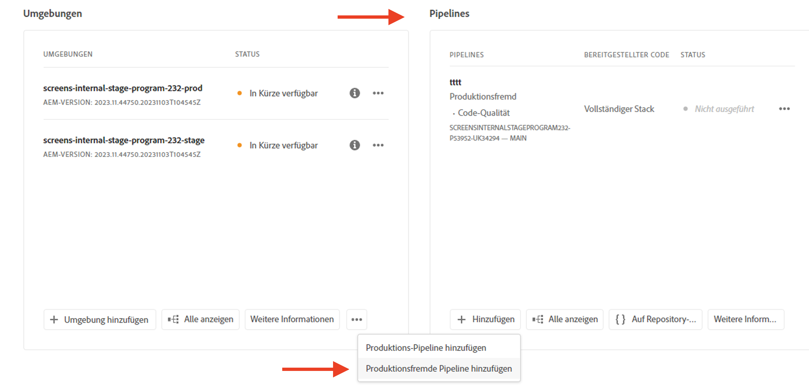
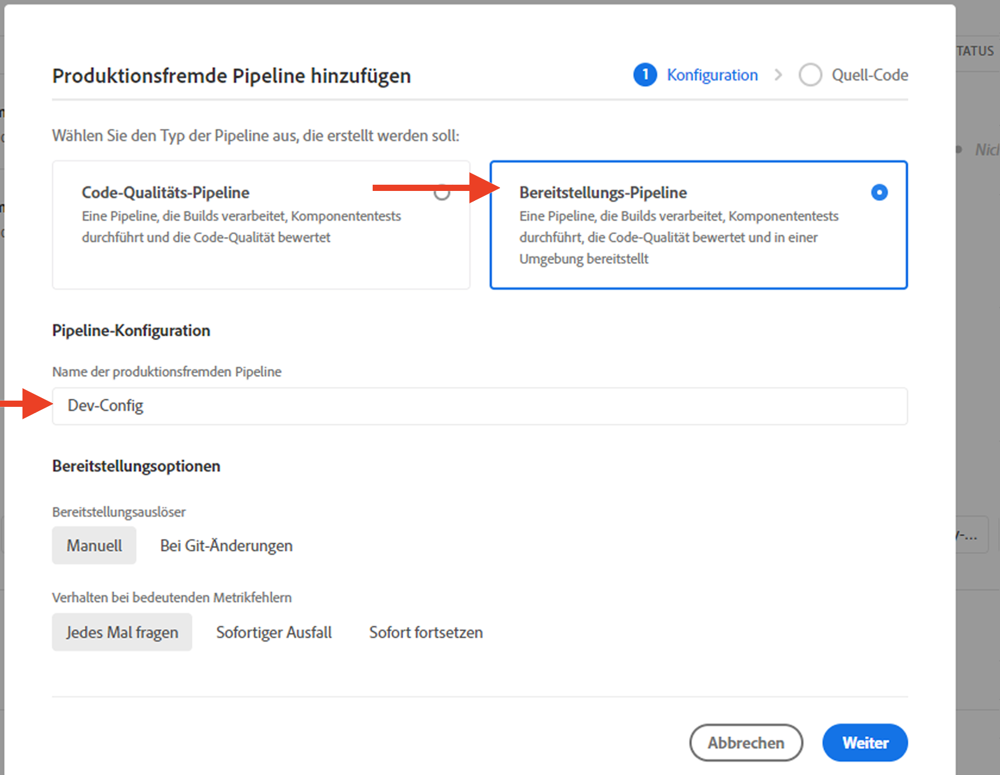
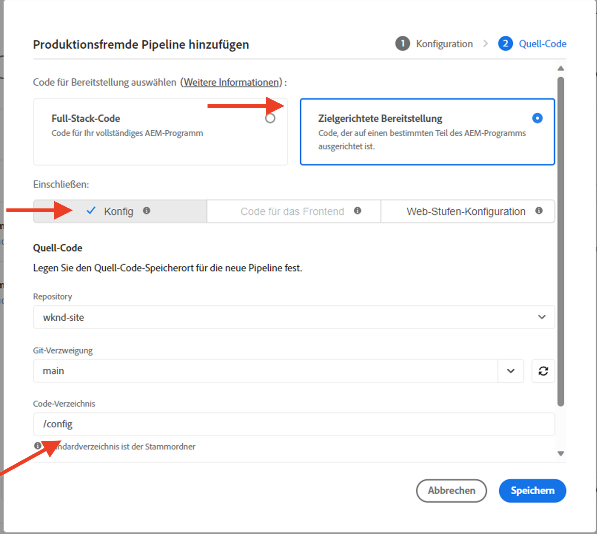

# Einrichten von Traffic-Filterregeln, einschließlich WAF-Regeln

Erfahren Sie, wie Sie Traffic-Filterregeln **einrichten**, einschließlich WAF-Regeln. Erfahren Sie mehr über das Erstellen, Bereitstellen, Testen und Analysieren von Ergebnissen.

>[!VIDEO](https://video.tv.adobe.com/v/3425407?quality=12&learn=on)

## Setup

Der Einrichtungsprozess umfasst Folgendes:

- _Erstellen von Regeln_ mit einer entsprechenden AEM-Projektstruktur und Konfigurationsdatei.
- _Bereitstellen von Regeln_ mit der Konfigurations-Pipeline von Adobe Cloud Manager.
- _Testen von Regeln_ mit verschiedenen Tools, um Traffic zu generieren.
- _Ergebnisanalyse_ mit AEMCS-CDN-Protokollen und Dashboard-Tools.

### Erstellen von Regeln in Ihrem AEM-Projekt

Gehen Sie wie folgt vor, um Regeln zu erstellen:

1. Erstellen Sie auf der obersten Ebene Ihres AEM-Projekts einen Ordner `config`.

1. Erstellen Sie im Ordner `config` eine neue Datei mit dem Namen `cdn.yaml`.

1. Fügen Sie der Datei `cdn.yaml` die folgenden Metadaten hinzu:

```yaml
kind: CDN
version: '1'
metadata:
  envTypes:
    - dev
    - stage
    - prod
data:
  trafficFilters:
    rules:
```

Ein Beispiel für die Datei `cdn.yaml` im WKND Sites-Projekt von AEM Guides:

{width="800" zoomable="yes"}

### Bereitstellen der Regeln über Cloud Manager {#deploy-rules-through-cloud-manager}

Gehen Sie zur Bereitstellung der Regeln wie folgt vor:

1. Melden Sie sich unter [my.cloudmanager.adobe.com](https://my.cloudmanager.adobe.com/) bei Cloud Manager an und wählen Sie die entsprechende Organisation und das entsprechende Programm aus.

1. Navigieren Sie von der Seite _Programmübersicht_ zur Karte _Pipelines_, klicken Sie auf **Hinzufügen** und wählen Sie den gewünschten Pipeline-Typ aus.

   

   Im obigen Beispiel wurde zu Demonstrationszwecken _Produktionsfremde Pipeline hinzufügen_ ausgewählt, da eine Entwicklungsumgebung verwendet wird.

1. Wählen Sie im Dialogfeld _Produktionsfremde Pipeline hinzufügen_ die folgenden Details ein oder wählen Sie sie aus:

   1. Konfigurationsschritt:

      - **Typ**: Bereitstellungs-Pipeline
      - **Pipeline-Name**: Dev-Config

      

   2. Quell-Code-Schritt:

      - **Bereitzustellender Code**: Zielgerichtete Bereitstellung
      - **Einschließen**: Config
      - **Bereitstellungsumgebung**: Name Ihrer Umgebung, z. B. wknd-program-dev.
      - **Repository**: Das Git-Repository, aus dem die Pipeline den Code abrufen soll, z. B. `wknd-site`.
      - **Git-Verzweigung**: Der Name der Git-Repository-Verzweigung.
      - **Code-Speicherort**: `/config`, was dem Konfigurationsordner der obersten Ebene entspricht, der im vorherigen Schritt erstellt wurde.

      

### Testen von Regeln durch Traffic-Generierung

Zum Testen von Regeln stehen verschiedene Tools von Drittanbietern zur Verfügung und unter Umständen hat Ihre Organisation ein bevorzugtes Tool. Für Demonstrationszwecke verwenden wir die folgenden Tools:

- [Curl](https://curl.se/) für grundlegende Tests wie das Aufrufen einer URL und das Überprüfen des Antwort-Codes.

- [Vegeta](https://github.com/tsenart/vegeta) zur Durchführung von Denial of Service (DOS). Befolgen Sie die Installationsanweisungen aus dem [Vegeta-GitHub](https://github.com/tsenart/vegeta#install).

- [Nikto](https://github.com/sullo/nikto/wiki), um potenzielle Probleme und Sicherheitslücken wie XSS, SQL-Injektion und mehr zu finden. Befolgen Sie die Installationsanweisungen aus dem [Nikto-GitHub](https://github.com/sullo/nikto).

- Stellen Sie sicher, dass die Tools in Ihrem Terminal installiert und verfügbar sind, indem Sie die folgenden Befehle ausführen:

  ```shell
  # Curl version check
  $ curl --version
  
  # Vegeta version check
  $ vegeta -version
  
  # Nikto version check
  $ cd <PATH-OF-CLONED-REPO>/program
  ./nikto.pl -Version
  ```

### Analyseren von Ergebnissen mithilfe der Dashboard-Tools

Nach dem Erstellen, Bereitstellen und Testen der Regeln können Sie die Ergebnisse analysieren mithilfe der Dashboard-Tools **Elasticsearch, Logstash und Kibana (ELK)**. Die AEMCS-CDN-Protokolle können analysiert werden, sodass Sie die Ergebnisse in Form verschiedener Diagramme und Grafiken visualisieren können.

Dashboard-Tools können direkt aus dem [GitHub-Repository „AEMCS-CDN-Log-Analysis-ELK-Tool“](https://github.com/adobe/AEMCS-CDN-Log-Analysis-ELK-Tool) geklont werden. Befolgen Sie die Schritte zum Installieren und Laden des Dashboards **Traffic-Filterregeln (einschließlich WAF)**.

- Nach dem Laden des Beispiel-Dashboards sollte Ihre Elastic-Dashboard-Tool-Seite wie folgt aussehen:

  

>[!NOTE]
>
>    Da noch keine AEMCS-CDN-Protokolle erfasst wurden, ist das Dashboard leer.


## Nächster Schritt

Erfahren Sie im Kapitel [Beispiele und Ergebnisanalyse](./examples-and-analysis.md) unter Verwendung des AEM-WKND-Sites-Projekts, wie Sie Traffic-Filterregeln einschließlich WAF-Regeln deklarieren.
