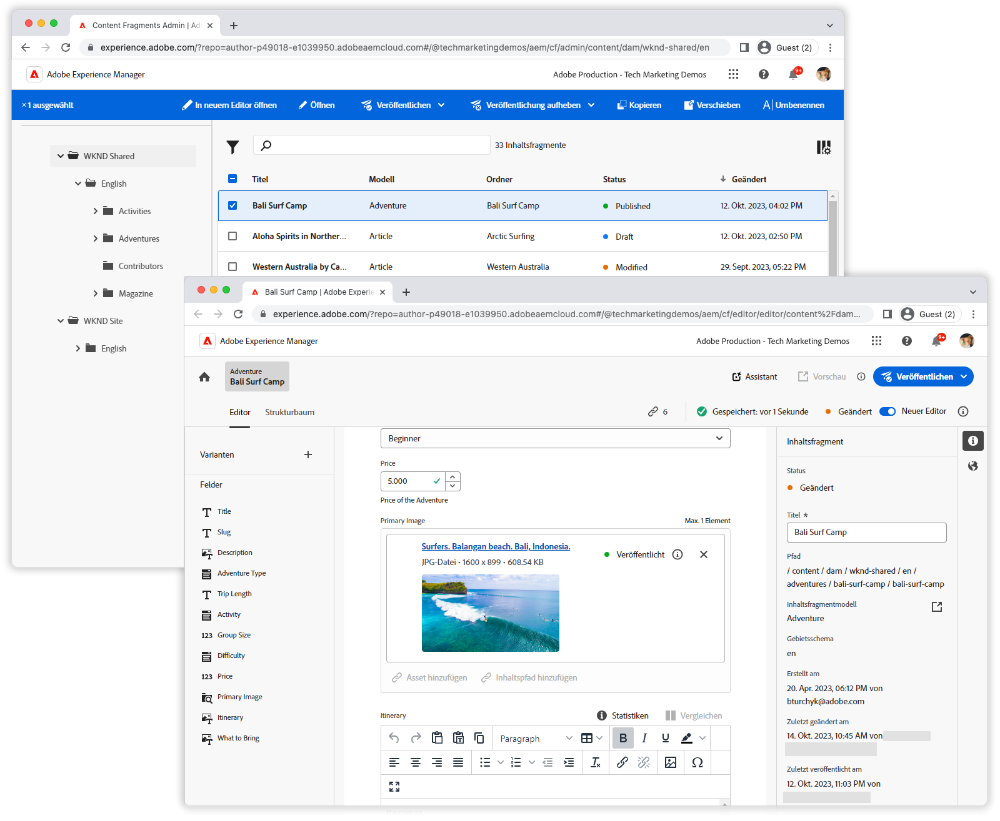

# Videos zur Inhaltsfragmentkonsole

Die Adobe Experience Manager Content Fragments Console erleichtert die Verwaltung und Bearbeitung von Inhaltsfragmenten! In diesen Videos erfahren Sie, wie Sie die Konsole &quot;Inhaltsfragmente&quot;optimal nutzen.

Überprüfen Sie die [Dokumentation](https://experienceleague.adobe.com/docs/experience-manager-cloud-service/content/sites/administering/content-fragments/content-fragments-console.html?lang=de)  für vollständige Informationen zur Inhaltsfragmentkonsole und ihren Funktionen.

## Videos

    <!-- Overview -->
    

      

        

          <figure class="image is-16by9">
            
          </figure>
        

        

          

            
5 Minuten

            

              <a href="./basics/content-fragments-console.md" title="Übersicht">Übersicht</a>
            

            
Eine kurze Übersicht über die Konsole "Inhaltsfragmente".

            <a href="./basics/content-fragments-console.md" class="spectrum-Button
              spectrum-Button--outline spectrum-Button--primary
              spectrum-Button--sizeM">
              Video ansehen
            </a>
          

        

      

    

    <!-- Fast filtering -->
    

      

        

          <figure class="image is-16by9">
            
          </figure>
        

        

          

            
1 Minute

            

              <a href="./search/fast-filtering.md" title="Schnelles Filtern">Schnelles Filtern</a>
            

            
Schnelles Auffinden von Inhaltsfragmenten mit Inline-Filterung.

            <a href="./search/fast-filtering.md" class="spectrum-Button
              spectrum-Button--outline spectrum-Button--primary
              spectrum-Button--sizeM">
              Video ansehen
            </a>
          

        

      

    

    <!-- New Editor toggle -->
    

      

        

          <figure class="image is-16by9">
            
          </figure>
        

        

          

            
1 Minute

            

              <a href="./editor/new-editor-toggle.md" title="Umschalter für neuen Editor">Umschalter für neuen Editor</a>
            

            
Nahtloser Übergang vom klassischen zum neuen Editor.

            <a href="./editor/new-editor-toggle.md" class="spectrum-Button
              spectrum-Button--outline spectrum-Button--primary
              spectrum-Button--sizeM">
              Video ansehen
            </a>
          

        

      

    

    <!-- Non-asset content references --->
    

      

        

          <figure class="image is-16by9">
            
          </figure>
        

        

          

            
1 Minute

            

              <a href="./editor/non-asset-content-references.md" title="Nicht-Asset-Inhaltsreferenzen">Nicht-Asset-Inhaltsreferenzen</a>
            

            
Integrieren Sie Experience Fragments und Seiten in Ihre Inhaltsfragmente.

            <a href="./editor/non-asset-content-references.md"
              class="spectrum-Button spectrum-Button--outline
              spectrum-Button--primary spectrum-Button--sizeM">
              Video ansehen
            </a>
          

        

      

    

    <!-- RTE variant compare -->
    

      

        

          <figure class="image is-16by9">
            
          </figure>
        

        

          

            
1 Minute

            

              <a href="./editor/rte-variant-compare.md" title="Vergleich der RTE-Variante">Vergleich der RTE-Variante</a>
            

            
Rich-Text-Inhalte können einfach kanalübergreifend ausgerichtet werden.

            <a href="./editor/rte-variant-compare.md" class="spectrum-Button
              spectrum-Button--outline spectrum-Button--primary
              spectrum-Button--sizeM">
              Video ansehen
            </a>
          

        

      

    

    <!-- Language copies -->
    

      

        

          <figure class="image is-16by9">
            
          </figure>
        

        

          

            
1 Minute

            

              <a href="./editor/language-copies.md" title="Sprachkopien">Sprachkopien</a>
            

            
Einfaches Verwalten der Sprachkopien von Inhaltsfragmenten

            <a href="./editor/language-copies.md" class="spectrum-Button
              spectrum-Button--outline spectrum-Button--primary
              spectrum-Button--sizeM">
              Video ansehen
            </a>
          

        

      

    

     <!-- References -->
    

      

        

          <figure class="image is-16by9">
            
          </figure>
        

        

          

            
2 Minuten

            

              <a href="./search/references.md" title="Verweise">Verweise</a>
            

            
Verstehen Sie Inhaltsfragmentverweise und -beziehungen.

            <a href="./search/references.md" class="spectrum-Button
              spectrum-Button--outline spectrum-Button--primary
              spectrum-Button--sizeM">
              Video ansehen
            </a>
          

        

      

    

  

