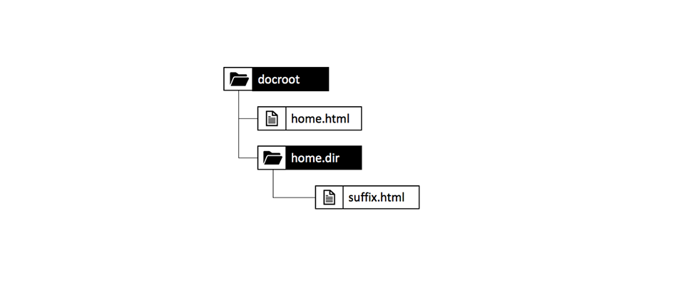

# Kapitel 1 - Konzepte, Muster und Muster des Dispatchers

## Übersicht

In diesem Kapitel erhalten Sie eine kurze Einführung in den Verlauf und die Mechanik des Dispatchers. Außerdem wird erläutert, wie sich dies auf die Gestaltung AEM Komponenten durch einen Entwickler auswirkt.

## Warum sich Entwickler um Infrastruktur kümmern sollten

Der Dispatcher ist ein wesentlicher Teil der meisten - wenn nicht gar aller AEM Installationen. Sie finden viele Online-Artikel, in denen die Konfiguration des Dispatchers sowie Tipps und Tricks beschrieben werden.

Diese Teile und Informationen beginnen jedoch immer auf einer sehr technischen Ebene - vorausgesetzt, Sie wissen bereits, was Sie tun wollen und geben so nur Details, wie Sie erreichen, was Sie wollen. Wir haben noch nie eine konzeptionelle Dokumentation gefunden, in der die _Was ist und warum&#39;s_ wenn es darum geht, was Sie mit dem Dispatcher tun können und was nicht.

### Antipattern: Dispatcher als Nachdenken

Dieser Mangel an grundlegenden Informationen führt zu einer Reihe von Anti-Pattern, die wir in einer Reihe von AEM Projekten gesehen haben:

1. Da der Dispatcher auf dem Apache-Webserver installiert ist, muss er von den &quot;Unix-Göttern&quot;im Projekt konfiguriert werden. Ein &quot;sterblicher Java-Entwickler&quot;muss sich nicht damit befassen.

2. Der Java-Entwickler muss sicherstellen, dass sein Code funktioniert ... der Dispatcher wird es später magisch machen. Der Dispatcher ist immer ein Nachdenken. Dies funktioniert jedoch nicht. Ein Entwickler muss seinen Code unter Berücksichtigung des Dispatchers entwerfen. Und er muss seine Grundkonzepte kennen, um das zu tun.

### &quot;Zuerst machen Sie es funktioniert - dann schnell machen&quot; Ist nicht immer richtig

Vielleicht haben Sie die Programmierempfehlungen gehört _&quot;Zuerst machen Sie es funktioniert - dann machen Sie es schnell.&quot;_. Es ist nicht ganz falsch. Ohne den richtigen Kontext wird sie jedoch in der Regel falsch interpretiert und nicht korrekt angewendet.

Der Rat sollte den Entwickler davon abhalten, Code vorzeitig zu optimieren, der möglicherweise nie ausgeführt wird - oder so selten ausgeführt wird, dass eine Optimierung keine ausreichende Wirkung hätte, um den Aufwand für die Optimierung zu rechtfertigen. Darüber hinaus könnte die Optimierung zu komplexerem Code führen und damit Fehler verursachen. Wenn Sie Entwickler sind, verbringen Sie also nicht zu viel Zeit damit, jede einzelne Codezeile zu mikrooptimieren. Stellen Sie einfach sicher, dass Sie die richtigen Datenstrukturen, Algorithmen und Bibliotheken auswählen und warten Sie, bis die Hotspot-Analyse eines Profilers zeigt, wo eine gründlichere Optimierung die Gesamtleistung steigern könnte.

### Architektonische Entscheidungen und Artefakte

Der Rat &quot;Erst machen es funktioniert - dann schnell machen&quot; ist jedoch völlig falsch, wenn es um &quot;architektonische&quot; Entscheidungen geht. Was sind architektonische Entscheidungen? Einfach gesagt, es sind die Entscheidungen, die teuer, schwierig und/oder unmöglich sind, sich danach zu ändern. Denken Sie daran, dass &quot;teuer&quot;manchmal genauso ist wie &quot;unmöglich&quot;.  Wenn Ihr Projekt beispielsweise nicht mehr über das Budget verfügt, können keine teuren Änderungen mehr implementiert werden. Infrastrukturveränderungen in sind die allerersten Veränderungen in dieser Kategorie, die den meisten Menschen in den Sinn kommen. Aber es gibt auch eine andere Art von &quot;architektonischen&quot;Artefakten, die sich sehr schlecht ändern können:

1. Codeabschnitte im &quot;Mittelpunkt&quot;einer Anwendung, auf die viele andere Teile angewiesen sind. Wenn Sie diese ändern, müssen alle Abhängigkeiten gleichzeitig geändert und neu getestet werden.

2. Artefakte, die in einem asynchronen, zeitabhängigen Szenario involviert sind, in dem die Eingabe - und damit das Verhalten des Systems sehr zufällig variieren kann. Änderungen können unvorhersehbare Auswirkungen haben und schwer zu testen sein.

3. Softwaremuster, die immer wieder verwendet und wiederverwendet werden, in allen Teilen des Systems. Wenn sich das Softwaremuster als suboptimal erweist, müssen alle Artefakte, die das Muster verwenden, neu kodiert werden.

Merken? Auf dieser Seite sagten wir, dass der Dispatcher ein wesentlicher Bestandteil einer AEM Anwendung ist. Der Zugriff auf eine Webanwendung ist sehr zufällig - Benutzer kommen und gehen zu unvorhersehbaren Zeiten. Am Ende werden alle Inhalte im Dispatcher zwischengespeichert (oder sollten). Wenn Sie also genau aufpassen, hätten Sie vielleicht gemerkt, dass das Caching als &quot;architektonisches&quot;Artefakt angesehen werden könnte und daher von allen Mitgliedern des Teams, Entwicklern und Administratoren gleichermaßen verstanden werden sollte.

Wir sagen nicht, dass ein Entwickler den Dispatcher tatsächlich konfigurieren sollte. Sie müssen die Konzepte - insbesondere die Grenzen - kennen, um sicherzustellen, dass ihr Code auch vom Dispatcher genutzt werden kann.

Der Dispatcher verbessert die Geschwindigkeit des Codes nicht auf magische Weise. Ein Entwickler muss seine Komponenten unter Berücksichtigung des Dispatchers erstellen. Daher muss er wissen, wie es funktioniert.

## Dispatcher-Caching - Grundprinzipien

### Dispatcher als Caching HTTP - Lastenausgleich

Was ist der Dispatcher und warum heißt er überhaupt &quot;Dispatcher&quot;?

Der Dispatcher ist

* Zuallererst einen Cache

* Reverse-Proxy

* Ein Modul für den Apache httpd-Webserver, das AEM verwandte Funktionen zur Vielseitigkeit des Apache hinzufügt und reibungslos mit allen anderen Apache-Modulen zusammenarbeitet (wie SSL oder SSI-Includes, wie wir später sehen werden).

Zu Beginn des Webs würden Sie mit einigen Hundert Besuchern rechnen. Ein Setup eines Dispatchers, der die Anforderungen an eine Reihe von AEM Veröffentlichungsservern &quot;gesendet&quot;oder ausgewogen verteilt hat und der normalerweise ausreicht, also der Name &quot;Dispatcher&quot;. Heutzutage wird dieses Setup jedoch nicht mehr sehr häufig verwendet.

Später in diesem Artikel werden wir verschiedene Möglichkeiten zum Einrichten von Dispatchern und Veröffentlichungssystemen sehen. Beginnen wir zunächst mit einigen Grundlagen der HTTP-Zwischenspeicherung.


*Grundlegende Funktionalität eines Dispatcher-Caches*

<br> 

Die Grundlagen des Dispatchers werden hier erläutert. Der Dispatcher ist ein einfacher Reverse-Proxy zum Zwischenspeichern mit der Möglichkeit, HTTP-Anfragen zu empfangen und zu erstellen. Ein normaler Anforderungs-/Antwortzyklus sieht wie folgt aus:

1. Ein Benutzer fordert eine Seite an
2. Der Dispatcher prüft, ob bereits eine gerenderte Version dieser Seite vorhanden ist. Angenommen, es handelt sich um die allererste Anforderung für diese Seite, und der Dispatcher kann keine lokale zwischengespeicherte Kopie finden.
3. Der Dispatcher fordert die Seite vom Veröffentlichungssystem an
4. Im Veröffentlichungssystem wird die Seite durch eine JSP- oder eine HTL-Vorlage gerendert
5. Die Seite wird an den Dispatcher zurückgegeben.
6. Der Dispatcher speichert die Seite zwischen
7. Der Dispatcher gibt die Seite an den Browser zurück
8. Wenn dieselbe Seite ein zweites Mal angefordert wird, kann sie direkt aus dem Dispatcher-Cache bereitgestellt werden, ohne dass sie erneut in der Veröffentlichungsinstanz gerendert werden muss. Dadurch sparen Sie Wartezeiten für Benutzer- und CPU-Zyklen auf der Veröffentlichungsinstanz.

Wir sprachen über &quot;Seiten&quot; im letzten Abschnitt. Dasselbe Schema gilt jedoch auch für andere Ressourcen wie Bilder, CSS-Dateien, PDF-Downloads usw.

#### Zwischenspeicherung von Daten

Das Dispatcher-Modul nutzt die Funktionen, die der Hosting-Apache-Server bereitstellt. Ressourcen wie HTML-Seiten, Downloads und Bilder werden als einfache Dateien im Apache-Dateisystem gespeichert. So einfach ist es.

Der Dateiname wird von der URL der angeforderten Ressource abgeleitet. Wenn Sie eine Datei anfordern `/foo/bar.html` es wird beispielsweise unter / gespeichert`var/cache/docroot/foo/bar.html`.

Grundsätzlich können Sie, wenn alle Dateien zwischengespeichert und daher statisch im Dispatcher gespeichert werden, das Plug-in des Veröffentlichungssystems abrufen und der Dispatcher als einfacher Webserver fungieren. Aber dies dient nur der Veranschaulichung des Prinzips. Das wahre Leben ist komplizierter. Sie können nicht alles zwischenspeichern, und der Cache ist nie vollständig &quot;voll&quot;, da die Anzahl der Ressourcen aufgrund der dynamischen Natur des Rendervorgangs unbegrenzt sein kann. Das Modell eines statischen Dateisystems hilft, ein grobes Bild der Funktionen des Dispatchers zu erzeugen. Und es hilft, die Einschränkungen des Dispatchers zu erklären.

#### Die AEM URL-Struktur und Dateisystemzuordnung

Um den Dispatcher genauer zu verstehen, sollten wir die Struktur einer einfachen Beispiel-URL erneut aufrufen.  Sehen wir uns das folgende Beispiel an:

`http://domain.com/path/to/resource/pagename.selectors.html/path/suffix.ext?parameter=value&amp;otherparameter=value#fragment`

* `http` bezeichnet das Protokoll

* `domain.com` ist der Domänenname

* `path/to/resource` ist der Pfad, unter dem die Ressource in CRX und anschließend im Dateisystem des Apache-Servers gespeichert wird.

Von hier unterscheiden sich die Dinge ein wenig zwischen dem AEM Dateisystem und dem Apache-Dateisystem.

In AEM,

* `pagename` ist der Titel der Ressourcen

* `selectors` steht für eine Reihe von Selektoren, die in Sling verwendet werden, um zu bestimmen, wie die Ressource gerendert wird. Eine URL kann eine beliebige Anzahl von Selektoren aufweisen. Sie werden durch einen Punkt getrennt. Ein Selektorabschnitt könnte z. B. &quot;fschlüssel.mobile.fancy&quot;sein. Selektoren dürfen nur Buchstaben, Ziffern und Gedankenstriche enthalten.

* `html` als letzter der &quot;Selektoren&quot;bezeichnet wird als Erweiterung. In AEM/Sling bestimmt es auch teilweise das Rendering-Skript.

* `path/suffix.ext` ist ein pfadähnlicher Ausdruck, der ein Suffix der URL sein kann.  Sie kann in AEM Skripten verwendet werden, um die Darstellung einer Ressource weiter zu steuern. Wir werden später einen ganzen Abschnitt über diesen Teil haben. Zunächst sollte es ausreichen zu wissen, dass Sie es als zusätzlichen Parameter verwenden können. Suffixe müssen über eine Erweiterung verfügen.

* `?parameter=value&otherparameter=value` ist der Abfrageabschnitt der URL. Sie wird verwendet, um beliebige Parameter an AEM zu übergeben. URLs mit Parametern können nicht zwischengespeichert werden. Daher sollten Parameter auf Fälle beschränkt werden, in denen sie absolut erforderlich sind.

* `#fragment`, wird der Fragmentteil einer URL nicht an übergeben, AEM er nur im Browser verwendet wird. entweder in JavaScript-Frameworks als &quot;Routing-Parameter&quot;oder um zu einem bestimmten Teil der Seite zu springen.

In Apache (*auf das folgende Diagramm verweisen*),

* `pagename.selectors.html` wird als Dateiname im Dateisystem des Caches verwendet.

Wenn die URL ein Suffix hat `path/suffix.ext` dann

* `pagename.selectors.html` wird als Ordner erstellt

* `path` einen Ordner im `pagename.selectors.html` Ordner

* `suffix.ext` ist eine Datei im `path` Ordner. Hinweis: Wenn das Suffix keine Erweiterung aufweist, wird die Datei nicht zwischengespeichert.


*Dateisystemlayout nach Abrufen von URLs vom Dispatcher*

<br> 

#### Grundlegende Einschränkungen

Die Zuordnung zwischen einer URL, der Ressource und dem Dateinamen ist ziemlich einfach.

Sie haben möglicherweise einige Fallen bemerkt,

1. URLs können sehr lang werden. Hinzufügen des &quot;Pfad&quot;-Teils eines `/docroot` auf dem lokalen Dateisystem können die Grenzen einiger Dateisysteme leicht überschreiten. Das Ausführen des Dispatchers in NTFS unter Windows kann eine Herausforderung sein. Sie sind jedoch bei Linux sicher.

2. URLs können Sonderzeichen und Umlaute enthalten. Dies ist normalerweise kein Problem für den Dispatcher. Beachten Sie jedoch, dass die URL an vielen Stellen Ihrer Anwendung interpretiert wird. In den meisten Fällen haben wir seltsames Verhalten einer Anwendung erlebt - nur um herauszufinden, dass ein selten verwendeter (benutzerdefinierter) Code nicht gründlich auf Sonderzeichen getestet wurde. Du solltest sie vermeiden, wenn du kannst. Und wenn nicht, planen Sie gründliche Tests.

3. In CRX verfügen Ressourcen über Unterressourcen. Eine Seite enthält beispielsweise eine Reihe von Unterseiten. Dies kann nicht in einem Dateisystem abgeglichen werden, da Dateisysteme entweder Dateien oder Ordner haben.

#### URLs ohne Erweiterung werden nicht zwischengespeichert

URLs müssen immer über eine Erweiterung verfügen. Sie können zwar URLs ohne Erweiterungen in AEM bereitstellen. Diese URLs werden nicht im Dispatcher zwischengespeichert.

**Beispiele**

`http://domain.com/home.html` is **zwischenspeicherbar**

`http://domain.com/home` is **nicht zwischenspeicherbar**

Dieselbe Regel gilt, wenn die URL ein Suffix enthält. Das Suffix muss über eine Erweiterung verfügen, um zwischenspeicherbar zu sein.

**Beispiele**

`http://domain.com/home.html/path/suffix.html` is **zwischenspeicherbar**

`http://domain.com/home.html/path/suffix` is **nicht zwischenspeicherbar**

Sie fragen sich vielleicht, was passiert, wenn der Teil der Ressource keine Erweiterung hat, aber das Suffix eine hat? Nun, in diesem Fall hat die URL überhaupt kein Suffix. Sehen Sie sich das nächste Beispiel an:

**Beispiel**

`http://domain.com/home/path/suffix.ext`

Die `/home/path/suffix` ist der Pfad zur Ressource ... sodass es kein Suffix in der URL gibt.

**Zusammenfassung**

Fügen Sie dem Pfad und dem Suffix immer Erweiterungen hinzu. SEO-bewusste Menschen argumentieren manchmal, dass dies Sie in den Suchergebnissen nach unten ordnet. Eine nicht zwischengespeicherte Seite wäre jedoch extrem langsam und würde sogar noch weiter nach unten geraten.

#### Konflikt bei Suffix-URLs

Angenommen, Sie haben zwei gültige URLs

`http://domain.com/home.html`

und

`http://domain.com/home.html/suffix.html`

Sie sind in AEM absolut gültig. Auf Ihrem lokalen Entwicklungscomputer würden Sie kein Problem sehen (ohne Dispatcher). Wahrscheinlich stoßen Sie auch bei UAT- oder Belastungstests nicht auf Probleme. Das Problem, vor dem wir stehen, ist so subtil, dass es die meisten Tests durchläuft.  Sie werden hart getroffen, wenn Sie sich zu Spitzenzeiten befinden, und Sie sind auf die Zeit beschränkt, um dieses Problem zu beheben. Wahrscheinlich haben Sie keinen Serverzugriff und keine Ressourcen, um es zu beheben. Wir waren dort...

Also... was ist das Problem?

`home.html` in einem Dateisystem kann entweder eine Datei oder ein Ordner sein. Nicht beides gleichzeitig mit AEM.

Bei Anforderung `home.html` Zunächst wird es als Datei erstellt.

Nachfolgende Anforderungen an `home.html/suffix.html` Gültige Ergebnisse zurückgeben, jedoch als Datei `home.html` &quot;blockiert&quot;die Position im Dateisystem,  `home.html` kann nicht ein zweites Mal als Ordner erstellt werden und `home.html/suffix.html` wird nicht zwischengespeichert.


*Dateiblockierposition im Dateisystem verhindert das Zwischenspeichern von Unterressourcen*

<br> 

Wenn Sie dies umgekehrt durchführen, müssen Sie zunächst `home.html/suffix.html` then `suffix.html` wird unter einem Ordner zwischengespeichert `/home.html` am Anfang. Dieser Ordner wird jedoch gelöscht und durch eine Datei ersetzt `home.html` bei der späteren Anforderung `home.html` als Ressource.


*Löschen einer Pfadstruktur beim Abrufen eines übergeordneten Elements als Ressource*

<br> 

Das Ergebnis der Zwischenspeicherung ist also völlig zufällig und hängt von der Reihenfolge der eingehenden Anfragen ab. Was die Sache noch schwieriger macht, ist die Tatsache, dass Sie normalerweise mehr als einen Dispatcher haben. Die Leistung, die Cache-Trefferrate und das Verhalten variieren von Dispatcher zu Dispatcher unterschiedlich. Wenn Sie herausfinden möchten, warum Ihre Website nicht reagiert, müssen Sie sicherstellen, dass Sie den richtigen Dispatcher mit der unglücklichen Caching-Reihenfolge betrachten. Wenn Sie sich den Dispatcher ansehen, der - mit Glück - ein günstigeres Anfragemuster aufweist, gehen Sie beim Versuch, das Problem zu finden, verloren.

#### Vermeiden von Konflikt-URLs

Sie können &quot;in Konflikt stehende URLs&quot;vermeiden, bei denen ein Ordnername und ein Dateiname im Dateisystem mit demselben Pfad konkurrieren, wenn Sie eine andere Erweiterung für die Ressource verwenden, wenn Sie ein Suffix haben.

**Beispiel**

* `http://domain.com/home.html`

* `http://domain.com/home.dir/suffix.html`

Beide sind perfekt zwischenspeicherbar.



Auswahl eines dedizierten Erweiterungs-&quot;dir&quot; für eine Ressource, wenn Sie ein Suffix anfordern oder wenn Sie die Verwendung des Suffixs ganz vermeiden. In seltenen Fällen sind sie nützlich. Und es ist einfach, diese Fälle korrekt zu implementieren.  Wie wir im nächsten Kapitel sehen werden, wenn wir über Cache-Invalidierung und Leerung sprechen.

#### Nicht zwischenspeicherbare Anforderungen

Sehen wir uns eine kurze Zusammenfassung des letzten Kapitels sowie weitere Ausnahmen an. Der Dispatcher kann eine URL zwischenspeichern, wenn sie als zwischenspeicherbar konfiguriert ist und es sich um eine GET-Anforderung handelt. Sie kann unter einer der folgenden Ausnahmen nicht zwischengespeichert werden.

**Zwischenspeicherbare Anforderungen**

* Anforderung ist so konfiguriert, dass sie in der Dispatcher-Konfiguration zwischenspeicherbar ist
* Anfrage ist eine einfache GET-Anfrage

**Nicht zwischenspeicherbare Anforderungen oder Antworten**

* Anforderung, die durch Konfiguration verweigert wird (Pfad, Muster, MIME-Typ)
* Antworten, die einen &quot;Dispatcher: no-cache&quot;-Kopfzeile
* Antwort, die eine &quot;Cache-Control&quot;zurückgibt: no-cache|private&quot; header
* Antwort, die eine &quot;Pragma: no-cache&quot;-Kopfzeile
* Anfrage mit Abfrageparametern
* URL ohne Erweiterung
* URL mit Suffix ohne Erweiterung
* Antwort, die einen anderen Status-Code als 200 zurückgibt
* POST-Anfrage

## Invalidierung und Leeren des Cache

### Übersicht

Das letzte Kapitel listete eine große Anzahl von Ausnahmen auf, wenn der Dispatcher eine Anforderung nicht zwischenspeichern kann. Es gibt jedoch noch weitere Aspekte: Nur weil der Dispatcher _can_ eine Anforderung zwischenspeichern, bedeutet dies nicht unbedingt, dass sie _sollte_.

Der Punkt ist: Normalerweise ist das Zwischenspeichern einfach. Der Dispatcher muss nur das Ergebnis einer Antwort speichern und es beim nächsten Eintreffen derselben Anforderung zurückgeben. Right? Falsch!

Die Schwierigkeit besteht darin, _Invalidierung_ oder _Flush_ des Cache. Der Dispatcher muss herausfinden, wann sich eine Ressource geändert hat - und erneut gerendert werden muss.

Das scheint auf den ersten Blick eine banale Aufgabe zu sein, aber das ist es nicht. Lesen Sie weiter, und Sie werden einige schwierige Unterschiede zwischen einzelnen und einfachen Ressourcen und Seiten herausfinden, die auf einer stark vernetzten Struktur mehrerer Ressourcen basieren.

### Einfache Ressourcen und Flushing

Wir haben unser AEM-System eingerichtet, um bei Bedarf eine Miniaturansicht für jedes Bild dynamisch mit einem speziellen &quot;Miniaturansichten&quot;-Selektor zu erstellen:

`/content/dam/path/to/image.thumb.png`

Und natürlich stellen wir eine URL bereit, um das Originalbild mit einer URL ohne Selektor bereitzustellen:

`/content/dam/path/to/image.png`

Wenn wir beides herunterladen, die Miniaturansicht und das Originalbild, erhalten wir so etwas wie:

```
/var/cache/dispatcher/docroot/content/dam/path/to/image.thumb.png

/var/cache/dispatcher/docroot/content/dam/path/to/image.png
```

im Dateisystem unseres Dispatchers.

Jetzt lädt der Benutzer eine neue Version dieser Datei hoch und aktiviert sie. Schließlich wird eine Invalidierungsanforderung von AEM an den Dispatcher gesendet.

```
GET /invalidate
invalidate-path:  /content/dam/path/to/image

<no body>
```

Die Invalidierung ist so einfach: Eine einfache GET-Anfrage an eine spezielle &quot;/invalidate&quot;-URL im Dispatcher. Ein HTTP-Body ist nicht erforderlich, die &quot;Payload&quot;ist nur der Header &quot;invalidate-path&quot;. Beachten Sie außerdem, dass der invalidierungspfad in der Kopfzeile die Ressource ist, die AEM weiß - und nicht die Datei(en), die der Dispatcher zwischengespeichert hat. AEM weiß nur über Ressourcen. Erweiterungen, Selektoren und Suffixe werden zur Laufzeit verwendet, wenn eine Ressource angefordert wird. AEM führt keine Buchführung darüber durch, welche Selektoren für eine Ressource verwendet wurden. Daher ist der Ressourcenpfad alles, was er bei der Aktivierung einer Ressource sicher weiß.

Das reicht in unserem Fall aus. Wenn sich eine Ressource geändert hat, können wir sicher davon ausgehen, dass sich auch alle Ausgabedarstellungen dieser Ressource geändert haben. In unserem Beispiel wird, wenn sich das Bild geändert hat, auch eine neue Miniatur gerendert.

Der Dispatcher kann die Ressource mit allen Ausgabedarstellungen, die sie zwischengespeichert hat, sicher löschen. Es wird so etwas wie:

`$ rm /content/dam/path/to/image.*`

Entfernen `image.png` und `image.thumb.png` und alle anderen Ausgabedarstellungen, die diesem Muster entsprechen.

Sehr einfach, aber.. solange Sie nur eine Ressource verwenden, um auf eine Anfrage zu antworten.

### Verweise und geteilte Inhalte

#### Das Problem mit verschachtelten Inhalten

Im Gegensatz zu Bildern oder anderen Binärdateien, die in AEM hochgeladen werden, sind HTML-Seiten keine Einzeltiere. Sie leben in Herden und sind durch Hyperlinks und Verweise stark miteinander verbunden. Der einfache Link ist harmlos, aber er wird schwierig, wenn wir über Inhaltsverweise sprechen. Die allgegenwärtige obere Navigation oder Teaser auf Seiten sind Inhaltsreferenzen.

#### Inhaltsverweise und Gründe für Probleme

Sehen wir uns ein einfaches Beispiel an. Ein Reisebüro hat eine Webseite, auf der eine Reise nach Kanada gefördert wird. Diese Promotion wird im Teaser-Abschnitt auf zwei weiteren Seiten, auf der &quot;Startseite&quot;und auf der Seite &quot;Winterspezials&quot;vorgestellt.

Da auf beiden Seiten derselbe Teaser angezeigt wird, wäre es nicht erforderlich, den Autor aufzufordern, den Teaser für jede Seite, auf der er angezeigt werden soll, mehrmals zu erstellen. Stattdessen reserviert die Zielseite &quot;Canada&quot;einen Abschnitt in den Seiteneigenschaften, um die Informationen für den Teaser bereitzustellen - oder besser, um eine URL bereitzustellen, die den Teaser insgesamt rendert:

`<sling:include resource="/content/home/destinations/canada" addSelectors="teaser" />`

oder

`<sling:include resource="/content/home/destinations/canada/jcr:content/teaser" />`


AEM funktioniert nur wie Charme, aber wenn Sie einen Dispatcher in der Veröffentlichungsinstanz verwenden, passiert etwas Seltsames.

Stellen Sie sich vor, Sie haben Ihre Website veröffentlicht. Der Titel auf Ihrer kanadischen Seite ist &quot;Canada&quot;. Wenn ein Besucher Ihre Homepage anfordert, die einen Teaser-Verweis auf diese Seite enthält, rendert die Komponente auf der Seite &quot;Kanada&quot;in etwa wie folgt:

```
<div class="teaser">
  <h3>Canada</h3>
  
</div>
```

*in* die Startseite. Die Startseite wird vom Dispatcher als statische HTML-Datei gespeichert, einschließlich des Teasers und dessen Überschrift in der Datei.

Jetzt hat der Marketingexperte erfahren, dass Teaser-Überschriften umsetzbar sein sollten. Er entscheidet also, den Titel von &quot;Canada&quot;in &quot;Visit Canada&quot;zu ändern und aktualisiert auch das Bild.

Er veröffentlicht die bearbeitete Seite &quot;Kanada&quot;und besucht die zuvor veröffentlichte Homepage erneut, um seine Änderungen zu sehen. Aber - dort hat sich nichts verändert. Es wird weiterhin der alte Teaser angezeigt. Er überprüft die &quot;WinterSpecial&quot;. Diese Seite wurde noch nie angefordert und wird daher nicht statisch im Dispatcher zwischengespeichert. Diese Seite wird daher neu von der Veröffentlichungsinstanz gerendert und enthält jetzt den neuen Teaser &quot;Visit Canada&quot;.


*Dispatcher speichert veralteten eingeschlossenen Inhalt auf der Startseite*

<br> 

Was ist passiert? Der Dispatcher speichert eine statische Version einer Seite, die alle Inhalte und Markups enthält, die beim Rendern aus anderen Ressourcen gezogen wurden.

Der Dispatcher, ein reiner, auf Dateisystemen basierender Webserver, ist schnell, aber auch relativ einfach. Wenn sich eine eingeschlossene Ressource ändert, wird dies nicht erkannt. Er hängt weiterhin an dem Inhalt, der zum Zeitpunkt der Wiedergabe der eingeschlossenen Seite vorhanden war.

Die Seite &quot;WinterSpecial&quot;wurde noch nicht gerendert, sodass keine statische Version auf dem Dispatcher vorhanden ist und daher mit dem neuen Teaser angezeigt wird, da sie auf Anfrage neu gerendert wird.

Sie können davon ausgehen, dass der Dispatcher beim Rendern und Leeren aller Seiten, die diese Ressource verwendet haben, jede Ressource verfolgt, die er berührt, wenn sich diese Ressource ändert. Der Dispatcher rendert die Seiten jedoch nicht. Das Rendering wird vom Veröffentlichungssystem durchgeführt. Der Dispatcher weiß nicht, welche Ressourcen in eine gerenderte HTML-Datei aufgenommen werden.

Noch nicht überzeugt? Vielleicht denken Sie *&quot;Es muss eine Möglichkeit geben, eine Art Abhängigkeitsverfolgung zu implementieren&quot;*. Nun, es gibt, oder genauer gesagt, dort *was*. Communiqué 3 Der Ururururgroßvater von AEM hatte einen Abhängigkeitstracker implementiert im _session_ wurde zum Rendern einer Seite verwendet.

Während einer Anfrage wurde jede Ressource, die über diese Sitzung erfasst wurde, als Abhängigkeit der URL verfolgt, die derzeit gerendert wurde.

Aber es stellte sich heraus, dass die Überwachung der Abhängigkeiten sehr teuer war. Die Leute entdeckten bald, dass die Website schneller ist, wenn sie die Funktion zum Abhängigkeitstracking komplett deaktiviert haben und darauf angewiesen waren, alle HTML-Seiten erneut zu rendern, nachdem eine HTML-Seite geändert wurde. Außerdem war diese Regelung auch nicht perfekt - es gab eine Reihe von Fallstricken und Ausnahmen. In einigen Fällen haben Sie nicht die Standardsitzung mit Anforderungen verwendet, um eine Ressource zu erhalten, sondern eine Admin-Sitzung, um einige Hilfsressourcen zum Rendern einer Anforderung zu erhalten. Diese Abhängigkeiten wurden in der Regel nicht verfolgt und führten zu Kopfschmerzen und Telefonanrufen an das Team der ops-Teams, die darum gebeten wurden, den Cache manuell zu leeren. Du hattest Glück, wenn sie dazu ein Standardverfahren hatten. Auf dem Weg gab es noch mehr Fallschirme, aber... hören wir auf, uns zu erinnern. Dies führt bis 2005 zurück. Letztlich wurde diese Funktion in Communiqué 4 standardmäßig deaktiviert und nicht wieder in den Nachfolger CQ5 aufgenommen, der dann AEM wurde.

### Automatische Invalidierung

#### Wenn Vollleerung günstiger ist als Abhängigkeitsverfolgung

Seit CQ5 verlassen wir uns vollständig auf die Invalidierung, mehr oder weniger, die gesamte Website, wenn nur eine der Seiten ändert. Diese Funktion wird als &quot;Automatische Invalidierung&quot;bezeichnet.

Wie kann es sein, dass es billiger ist, Hunderte von Seiten wegzuwerfen und neu zu rendern, als eine ordnungsgemäße Abhängigkeitsverfolgung und ein partielles Rendering durchzuführen?

Es gibt zwei Hauptgründe:

1. Auf einer durchschnittlichen Website wird nur eine kleine Teilmenge der Seiten häufig angefordert. Selbst wenn Sie also alle gerenderten Inhalte wegwerfen, werden nur ein paar Dutzend tatsächlich sofort danach angefordert. Die Wiedergabe des langen Seitenabschnitts kann über einen bestimmten Zeitraum verteilt werden, wenn sie tatsächlich angefordert wird. Tatsächlich ist die Belastung beim Rendern von Seiten nicht so hoch wie erwartet. Natürlich gibt es immer Ausnahmen... wir werden einige Tricks besprechen, wie man gleichmäßig verteilte Ladungen auf größeren Websites mit leeren Dispatcher-Caches verarbeitet, später.

2. Alle Seiten sind sowieso über die Hauptnavigation verbunden. Fast alle Seiten sind also letztlich voneinander abhängig. Das bedeutet, dass selbst der intelligenteste Abhängigkeitstracker herausfinden wird, was wir bereits wissen: Wenn sich eine der Seiten ändert, müssen Sie alle anderen invalidieren.

Glaubst du nicht? Lassen Sie uns den letzten Punkt veranschaulichen.

Wir verwenden dasselbe Argument wie im letzten Beispiel mit Teasern, die auf den Inhalt einer Remote-Seite verweisen. Erst jetzt verwenden wir ein extremeres Beispiel: Eine automatisch gerenderte Hauptnavigation. Wie beim Teaser wird der Navigationstitel von der verknüpften oder &quot;Remote&quot;-Seite als Inhaltsreferenz gezeichnet. Die Titel der Remote-Navigation werden nicht auf der derzeit gerenderten Seite gespeichert. Beachten Sie, dass die Navigation auf jeder Seite Ihrer Website gerendert wird. Der Titel einer Seite wird also immer wieder auf allen Seiten mit Hauptnavigation verwendet. Wenn Sie einen Navigationstitel ändern möchten, sollten Sie dies nur einmal auf der Remote-Seite tun - nicht auf jeder einzelnen Seite, die auf die Seite verweist.

In unserem Beispiel werden alle Seiten durch die Navigation miteinander verknüpft, indem der &quot;NavTitle&quot;der Zielseite zum Rendern eines Namens in der Navigation verwendet wird. Der Navigationstitel für &quot;Island&quot;wird von der Seite &quot;Island&quot;gezogen und auf jeder Seite mit Hauptnavigation dargestellt.


*Hauptnavigation versieht zwangsläufig alle Seiten mit Inhalten, indem sie ihre &quot;NavTitles&quot;abrufen*

<br> 

Wenn Sie den NavTitle auf der isländischen Seite von &quot;Island&quot; in &quot;Beautiful Island&quot; ändern, ändert sich dieser Titel sofort auf allen anderen Seiten Hauptmenü. Daher werden die Seiten, die vor dieser Änderung gerendert und zwischengespeichert wurden, alle veraltet und müssen ungültig gemacht werden.

#### Implementierung der automatischen Invalidierung: Die STAT-Datei

Wenn Sie nun eine große Site mit Tausenden von Seiten haben, würde es recht lange dauern, alle Seiten zu durchlaufen und sie physisch zu löschen. Während dieses Zeitraums konnte der Dispatcher unbeabsichtigt veraltete Inhalte bereitstellen. Schlimmer noch: Beim Zugriff auf die Cachedateien kann es zu Konflikten kommen. Möglicherweise wird eine Seite angefordert, während sie gerade gelöscht wird, oder eine Seite wird aufgrund einer zweiten Invalidierung, die nach einer sofortigen nachfolgenden Aktivierung stattgefunden hat, erneut gelöscht. Überlegen Sie, was für ein Chaos das wäre. Glücklicherweise passiert das nicht. Der Dispatcher verwendet einen cleveren Trick, um Folgendes zu vermeiden: Statt Hunderte und Tausende von Dateien zu löschen, wird eine einfache, leere Datei in das Stammverzeichnis Ihres Dateisystems eingefügt, wenn eine Datei veröffentlicht wird, sodass alle abhängigen Dateien als ungültig betrachtet werden. Diese Datei wird als &quot;Statfile&quot;bezeichnet. Die Statfile ist eine leere Datei - was bei der Statfile wichtig ist, ist nur das Erstellungsdatum.

Alle Dateien im Dispatcher, deren Erstellungsdatum älter als die Statfile ist, wurden vor der letzten Aktivierung (und Invalidierung) gerendert und werden daher als &quot;ungültig&quot;betrachtet. Sie sind weiterhin physisch im Dateisystem vorhanden, aber der Dispatcher ignoriert sie. Sie sind &quot;veraltet&quot;. Bei jeder Anforderung an eine veraltete Ressource fordert der Dispatcher das AEM auf, die Seite erneut zu rendern. Diese neu gerenderte Seite wird dann im Dateisystem gespeichert - jetzt mit einem neuen Erstellungsdatum und es ist wieder neu.


*Das Erstellungsdatum der STAT-Datei definiert, welcher Inhalt veraltet ist und welcher neu ist*

<br> 

Sie können fragen, warum es &quot;.stat&quot; heißt? Und nicht vielleicht &quot;.invalidiert&quot;? Nun, Sie können sich vorstellen, dass diese Datei in Ihrem Dateisystem dem Dispatcher hilft, zu bestimmen, welche Ressourcen verfügbar sein könnten *statisch* bereitgestellt werden - genau wie von einem statischen Webserver. Diese Dateien müssen nicht mehr dynamisch gerendert werden.

Der wahre Charakter des Namens ist jedoch weniger metaphorisch. Sie wird vom Unix-Systemaufruf abgeleitet. `stat()`, der die Änderungszeit einer Datei (unter anderem) zurückgibt.

#### Einfache und automatische Validierung mischen

Aber warten Sie... früher haben wir gesagt, dass einzelne Ressourcen physisch gelöscht werden. Jetzt sagen wir, dass eine neuere Statfile sie in den Augen des Dispatchers praktisch ungültig machen würde. Warum dann zuerst die physische Löschung?

Die Antwort ist einfach. Normalerweise verwenden Sie beide Strategien parallel - aber für verschiedene Arten von Ressourcen. Binäre Assets wie Bilder sind eigenständig. Sie sind nicht mit anderen Ressourcen verbunden, da sie ihre Informationen benötigen, um gerendert zu werden.

HTML-Seiten hingegen sind stark voneinander abhängig. Sie würden also die automatische Invalidierung auf diese anwenden. Dies ist die Standardeinstellung im Dispatcher. Alle Dateien, die zu einer invalidierten Ressource gehören, werden physisch gelöscht. Darüber hinaus werden Dateien, die mit &quot;.html&quot;enden, automatisch invalidiert.

Der Dispatcher entscheidet über die Dateierweiterung, ob das automatische Invalidierungsschema angewendet werden soll oder nicht.

Die Dateiendungen für die automatische Invalidierung können konfiguriert werden. Theoretisch könnten Sie alle Erweiterungen zur automatischen Invalidierung einbeziehen. Aber denken Sie daran, dass dies zu einem sehr hohen Preis kommt. Es werden keine veralteten Ressourcen unbeabsichtigt bereitgestellt, aber die Versandleistung verschlechtert sich stark aufgrund der übermäßigen Invalidierung.

Stellen Sie sich beispielsweise vor, Sie implementieren ein Schema, bei dem PNGs und JPG dynamisch gerendert werden und von anderen Ressourcen dazu abhängig sind. Möglicherweise möchten Sie die Skalierung von hochauflösenden Bildern auf eine kleinere, Web-kompatible Auflösung ändern. Während Sie dabei sind, ändern Sie auch die Komprimierungsrate. Auflösung und Komprimierungsrate in diesem Beispiel sind keine festen Konstanten, sondern konfigurierbare Parameter in der Komponente, die das Bild verwendet. Wenn dieser Parameter jetzt geändert wird, müssen Sie die Bilder ungültig machen.

Kein Problem - wir haben gerade erfahren, dass wir Bilder zur automatischen Invalidierung hinzufügen und Bilder immer neu gerendert haben, wenn sich etwas ändert.

#### Das Baby mit dem Bathwater auswerfen

Das ist richtig - und das ist ein riesiges Problem. Lesen Sie den letzten Absatz erneut. &quot;...Bilder, die frisch gerendert werden, wenn sich etwas ändert.&quot; Wie Sie wissen, wird eine gute Website ständig geändert. Fügen Sie hier neue Inhalte hinzu, korrigieren Sie dort einen Tippfehler, und fügen Sie einen Teaser irgendwo anders hinzu. Das bedeutet, dass alle Ihre Bilder ständig invalidiert werden und erneut gerendert werden müssen. Unterschätze das nicht! Die dynamische Wiedergabe und Übertragung von Bilddaten erfolgt in Millisekunden auf Ihrem lokalen Entwicklungscomputer. Ihre Produktionsumgebung muss dies hundertmal öfter tun - pro Sekunde.

Und lassen Sie uns hier klarstellen, dass Ihre JPGs erneut gerendert werden müssen, wenn sich eine HTML-Seite ändert und umgekehrt. Es gibt nur einen &quot;Bucket&quot;mit Dateien, die automatisch ungültig gemacht werden sollen. Es wird als Ganzes geleert. Ohne Mittel, um in detailliertere Strukturen aufzuschlüsseln.

Es gibt einen guten Grund, warum die automatische Invalidierung standardmäßig auf &quot;.html&quot;beibehalten wird. Das Ziel ist, diesen Eimer so klein wie möglich zu halten. Werfen Sie das Baby nicht mit dem Bade raus, indem Sie einfach alles invalidieren - nur um auf der sicheren Seite zu sein.

Auf dem Pfad dieser Ressource sollten eigenständige Ressourcen bereitgestellt werden. Das hilft sehr bei der Invalidierung. Halten Sie es einfach, erstellen Sie keine Zuordnungsschemas wie &quot;resource /a/b/c&quot;wird von &quot;/x/y/z&quot;bereitgestellt. Sorgen Sie dafür, dass Ihre Komponenten mit den standardmäßigen Einstellungen für die automatische Invalidierung des Dispatchers funktionieren. Versuchen Sie nicht, eine schlecht entworfene Komponente mit übermäßiger Invalidierung im Dispatcher zu reparieren.

##### Ausnahmen von der automatischen Invalidierung: ResourceOnly-Invalidierung

Die Invalidierungsanfrage für den Dispatcher wird normalerweise von einem Replikationsagenten aus dem/den Veröffentlichungssystem(en) ausgelöst.

Wenn Sie sich hinsichtlich Ihrer Abhängigkeiten überaus sicher fühlen, können Sie versuchen, einen eigenen Replikationsagenten für die Invalidierung zu erstellen.

Es wäre ein wenig weiter als dieser Leitfaden, auf die Details einzugehen, aber wir möchten Ihnen zumindest einige Hinweise geben.

1. Wissen Sie wirklich, was Sie tun. Es ist wirklich schwer, die Invalidierung richtig zu machen. Das ist ein Grund, warum die automatische Invalidierung so rigoros ist. um die Bereitstellung veralteter Inhalte zu vermeiden.

2. Wenn Ihr Agent einen HTTP-Header sendet `CQ-Action-Scope: ResourceOnly`bedeutet, dass diese Anfrage zur Invalidierung keine automatische Invalidierung Trigger. Dies ( [https://github.com/cqsupport/webinar-dispatchercache/tree/master/src/refetching-flush-agent/refetch-bundle](https://github.com/cqsupport/webinar-dispatchercache/tree/master/src/refetching-flush-agent/refetch-bundle)) könnte ein guter Ausgangspunkt für Ihren eigenen Replikationsagenten sein.

3. `ResourceOnly`, verhindert nur die automatische Invalidierung. Um die erforderlichen Abhängigkeiten aufzulösen und Invalidierungen durchzuführen, müssen Sie die Invalidierungsanforderungen selbst Trigger haben. Sie können die Dispatcher-Flush-Regeln für Pakete überprüfen ([https://adobe-consulting-services.github.io/acs-aem-commons/features/dispatcher-flush-rules/index.html](https://adobe-consulting-services.github.io/acs-aem-commons/features/dispatcher-flush-rules/index.html)) für Anregungen, wie das tatsächlich passieren könnte.

Es wird nicht empfohlen, ein Abhängigkeitsauflösungsschema zu erstellen. Es gibt einfach zu viel Mühe und wenig Gewinn - und wie bereits gesagt, es gibt zu viel, dass Sie sich irren werden.

Sie sollten stattdessen herausfinden, welche Ressourcen nicht von anderen Ressourcen abhängig sind und ohne automatische Invalidierung invalidiert werden können. Dafür müssen Sie jedoch keinen benutzerdefinierten Replikationsagenten verwenden. Erstellen Sie einfach eine benutzerdefinierte Regel in Ihrer Dispatcher-Konfiguration, die diese Ressourcen von der automatischen Invalidierung ausschließt.

Wir sagten, dass die Hauptnavigation oder Teaser eine Quelle für Abhängigkeiten sind. Nun, wenn Sie die Navigation und Teaser asynchron laden oder sie mit einem SSI-Skript in Apache einschließen, haben Sie diese Abhängigkeit nicht zu verfolgen. Später in diesem Dokument werden wir über das asynchrone Laden von Komponenten weiter gehen, wenn wir über &quot;Sling Dynamic Includes&quot;sprechen.

Dasselbe gilt für Pop-Up-Fenster oder Inhalte, die in eine Lightbox geladen werden. Diese Teile haben auch selten Navigationen (auch &quot;Abhängigkeiten&quot; genannt) und können als einzelne Ressource ungültig gemacht werden.

## Erstellen von Komponenten mit dem Dispatcher im Hinterkopf

### Anwenden des Dispatcher-Mechanismus in einem Real-World-Beispiel

Im letzten Kapitel haben wir erläutert, wie die grundlegende Mechanik des Dispatchers funktioniert, wie sie im Allgemeinen funktioniert und welche Einschränkungen bestehen.

Wir möchten diese Mechanik nun auf eine Art von Komponenten anwenden, die Sie wahrscheinlich in den Anforderungen Ihres Projekts finden werden. Wir wählen die Komponente bewusst aus, um Probleme zu demonstrieren, die auch früher oder später auftreten werden. Furcht nicht - nicht alle Komponenten brauchen diese Aufmerksamkeit, die wir uns vorstellen werden. Wenn Sie jedoch die Notwendigkeit sehen, eine solche Komponente zu erstellen, sind Sie sich der Folgen bewusst und wissen, wie sie zu bewältigen sind.

### Das Muster der Spooling-Komponente (Anti-Screen-Komponente)

#### Die Komponente &quot;Responsives Bild&quot;

Lassen Sie uns ein gemeinsames Muster (oder Anti-Muster) einer Komponente mit miteinander verbundenen Binärdateien veranschaulichen. Wir erstellen eine Komponente &quot;Antwort&quot;- für &quot;responsives Bild&quot;. Diese Komponente sollte in der Lage sein, das angezeigte Bild an das Gerät anzupassen, auf dem es angezeigt wird. Auf Desktops und Tablets zeigt es die vollständige Auflösung des Bildes, auf Smartphones eine kleinere Version mit schmalem Zuschnitt - oder vielleicht sogar ein völlig anderes Motiv (dies wird in der responsiven Welt als &quot;Kunstrichtung&quot;bezeichnet).

Die Assets werden nur in den DAM-Bereich von AEM hochgeladen _referenziert_ in der responsiven Bildkomponente.

Die respi-Komponente übernimmt sowohl das Rendering des Markups als auch die Bereitstellung der binären Bilddaten.

Die Art und Weise, wie wir sie hier implementieren, ist ein gängiges Muster, das wir in vielen Projekten gesehen haben, und selbst eine der AEM Kernkomponenten basiert auf diesem Muster. Daher ist es sehr wahrscheinlich, dass Sie als Entwickler dieses Muster anpassen. Die Kapselung hat ihre Vorteile, aber es erfordert viel Aufwand, um Dispatcher-fähig zu machen. Wir werden mehrere Möglichkeiten erörtern, wie das Problem später gelöst werden kann.

Wir nennen das hier verwendete Muster das &quot;Spooler Pattern&quot;, da das Problem in die frühen Tage von Communiqué 3 zurückreicht, wo es eine Methode &quot;spool&quot; gab, die auf eine Ressource aufgerufen werden konnte, um ihre binären Rohdaten in die Antwort zu streamen.

Der ursprüngliche Begriff &quot;Spooling&quot;bezieht sich eigentlich auf gemeinsam genutzte langsame Offline-Peripheriegeräte wie Drucker, weshalb er hier nicht richtig angewendet wird. Aber wir mögen den Begriff trotzdem, weil er in der Online-Welt selten vorkommt und daher unterscheidbar ist. Und jedes Muster sollte sowieso einen charakteristischen Namen haben, nicht wahr? Es liegt an Ihnen zu entscheiden, ob es ein Muster oder ein Anti-Muster ist.

#### Implementierung

So wird unsere responsive Bildkomponente implementiert:

Die Komponente besteht aus zwei Teilen. Der erste Teil rendert das HTML-Markup des Bildes, der zweite Teil &quot;spoolt&quot; die Binärdaten des referenzierten Bildes. Da es sich um eine moderne Website mit einem responsiven Design handelt, wird kein einfaches `` -Tag, aber eine Reihe von Bildern in `<picture/>` -Tag. Für jedes Gerät laden wir zwei verschiedene Bilder in das DAM hoch und referenzieren sie aus unserer Bildkomponente.

Die Komponente verfügt über drei Rendering-Skripte (implementiert in JSP, HTL oder als Servlet), die jeweils mit einem dedizierten Selektor adressiert sind:

1. `/respi.jsp` - ohne Selektor zum Rendern des HTML-Markups
2. `/respi.img.java` Rendern der Desktop-Version
3. `/respi.img.mobile.java` , um die mobile Version zu rendern.


Die Komponente wird im parsys der Homepage platziert. Die resultierende Struktur im CRX ist unten dargestellt.


*Ressourcenstruktur des responsiven Bildes in CRX*

<br> 

Das Komponenten-Markup wird wie folgt gerendert:

```plain
  #GET /content/home.html

  <html>

  …

  <div class="responsive-image>

  <picture>
    <source src="/content/home/jcr:content/par/respi.img.mobile.jpg" …/>
    <source src="/content/home/jcr:content/par/respi.img.jpg …/>

    …

  </picture>
  </div>
  …
```

und ... haben wir mit unserer schön verkapselten Komponente fertig gestellt.

#### Responsive Bildkomponente in Aktion

Jetzt fordert ein Benutzer die Seite - und die Assets über den Dispatcher an. Dies führt zu Dateien im Dispatcher-Dateisystem, wie unten dargestellt:


*Zwischengespeicherte Struktur der verkapselten responsiven Bildkomponente*

<br> 

Angenommen, ein Benutzer lädt eine neue Version der beiden Blumenbilder in das DAM hoch und aktiviert sie. AEM sendet die entsprechende Invalidierungsanfrage an

`/content/dam/flower.jpg`

und

`/content/dam/flower-mobile.jpg`

zum Dispatcher hinzugefügt. Diese Anfragen sind jedoch vergebens. Die Inhalte wurden als Dateien unterhalb der Unterstruktur der Komponente zwischengespeichert. Diese Dateien sind jetzt veraltet, werden aber weiterhin bei Anforderungen bereitgestellt.


*Inkongruenz der Struktur führt zu veraltetem Inhalt*

<br> 

Dieser Ansatz hat einen weiteren Vorbehalt. Beachten Sie, dass Sie dieselbe flower.jpg auf mehreren Seiten verwenden. Anschließend wird dasselbe Asset unter mehreren URLs oder Dateien zwischengespeichert.

```
/content/home/products/jcr:content/par/respi.img.jpg

/content/home/offers/jcr:content/par/respi.img.jpg

/content/home/specials/jcr:content/par/respi.img.jpg

…
```

Jedes Mal, wenn eine neue und nicht zwischengespeicherte Seite angefordert wird, werden die Assets von AEM unter verschiedenen URLs abgerufen. Keine Dispatcher-Zwischenspeicherung und keine Browser-Zwischenspeicherung können die Bereitstellung beschleunigen.

#### Wo das Spoolermuster schlingt

Es gibt eine natürliche Ausnahme, in der dieses Muster auch in seiner einfachen Form nützlich ist: Wenn die Binärdatei in der Komponente selbst gespeichert wird - und nicht im DAM. Dies ist jedoch nur für Bilder nützlich, die einmal auf der Website verwendet werden. Wenn Assets nicht im DAM gespeichert werden, ist die Verwaltung Ihrer Assets schwierig. Stellen Sie sich vor, dass Ihre Nutzungslizenz für ein bestimmtes Asset ausgeht. Wie können Sie herausfinden, welche Komponenten Sie das Asset verwendet haben?

Siehst du? Das &quot;M&quot;in DAM steht für &quot;Management&quot;- wie in Digital Asset Management. Du willst diese Funktion nicht weggeben.

#### Zusammenfassung

Aus der Sicht eines AEM Entwicklers sah das Muster überaus elegant aus. Wenn der Dispatcher jedoch in die Gleichung aufgenommen wird, können Sie damit einverstanden sein, dass der naive Ansatz möglicherweise nicht ausreicht.

Wir überlassen es Ihnen, zu entscheiden, ob es sich um ein Muster oder ein Gegenmuster handelt. Und vielleicht haben Sie bereits einige gute Ideen im Sinn, wie die oben erläuterten Probleme zu beheben? Gut. Dann werden Sie begierig sehen, wie andere Projekte diese Probleme gelöst haben.

### Beheben häufiger Dispatcher-Probleme

#### Übersicht

Sprechen wir darüber, wie das etwas Cache-freundlicher hätte implementiert werden können. Es gibt mehrere Möglichkeiten. Manchmal kann man nicht die beste Lösung auswählen. Vielleicht kommen Sie in ein bereits laufendes Projekt, und Sie haben ein begrenztes Budget, um einfach das &quot;Cache-Problem&quot;zu beheben, und nicht genug, um eine vollständige Refaktorierung durchzuführen. Oder Sie haben ein Problem, das komplexer ist als die Beispielbildkomponente.

In den folgenden Abschnitten werden die Grundsätze und Vorbehalte erläutert.

Auch dies basiert auf realen Erfahrungen. Wir haben alle diese Muster in der Wildnis schon gesehen, sodass es keine akademische Übung ist. Deshalb zeigen wir Ihnen einige Anti-Muster, sodass Sie die Möglichkeit haben, aus Fehlern zu lernen, die andere bereits gemacht haben.

#### Cache Killer

>[!WARNING]
>
>Das ist ein Anti-Muster. Nicht verwenden. Immer.

Haben Sie schon einmal Abfrageparameter gesehen wie `?ck=398547283745`? Sie werden als Cache-Killer (&quot;ck&quot;) bezeichnet. Wenn Sie Abfrageparameter hinzufügen, wird die Ressource nicht zwischengespeichert. Wenn Sie außerdem eine zufällige Nummer als Parameterwert hinzufügen (z. B. &quot;398547283745&quot;), wird die URL eindeutig und Sie stellen sicher, dass auch kein anderer Cache zwischen dem AEM und Ihrem Bildschirm zwischengespeichert werden kann. Normalerweise handelt es sich bei Zwischenverdächtigen um einen &quot;unangenehmen&quot;Cache vor dem Dispatcher, ein CDN oder sogar den Browser-Cache. Auch hier: Tu das nicht! Sie möchten, dass Ihre Ressourcen so oft und so lange wie möglich zwischengespeichert werden. Der Cache ist dein Freund. Töte keine Freunde.

#### Automatische Invalidierung

>[!WARNING]
>
>Das ist ein Anti-Muster. Vermeiden Sie die Verwendung für digitale Assets. Versuchen Sie, die Standardkonfiguration des Dispatchers beizubehalten, bei der > die automatische Invalidierung für &quot;.html&quot;-Dateien ist.

Kurzfristig können Sie der Konfiguration für die automatische Invalidierung im Dispatcher &quot;.jpg&quot;und &quot;.png&quot;hinzufügen. Das bedeutet, dass bei jeder Invalidierung alle &quot;.jpg&quot;, &quot;.png&quot;und &quot;.html&quot;erneut gerendert werden müssen.

Dieses Muster ist sehr einfach zu implementieren, wenn sich Geschäftsinhaber darüber beschweren, dass ihre Änderungen nicht schnell genug auf der Live-Site stattfinden. Aber das kann Ihnen nur etwas Zeit verschaffen, um eine komplexere Lösung zu finden.

Vergewissern Sie sich, dass Sie die enormen Auswirkungen auf die Leistung verstehen. Dies wird Ihre Website erheblich verlangsamen und könnte sogar die Stabilität beeinträchtigen - wenn Ihre Website eine Website mit hoher Auslastung und häufigen Änderungen ist - z. B. ein Nachrichtenportal.

#### URL-Fingerabdruck

Ein URL-Fingerabdruck sieht wie ein Cache-Killer aus. Aber das ist es nicht. Es handelt sich nicht um eine zufällige Zahl, sondern um einen Wert, der den Inhalt der Ressource charakterisiert. Dies kann ein Hash des Ressourceninhalts oder - noch einfacher - ein Zeitstempel beim Hochladen, Bearbeiten oder Aktualisieren der Ressource sein.

Ein Unix-Zeitstempel ist ausreichend für eine reale Implementierung. Für eine bessere Lesbarkeit verwenden wir in diesem Tutorial ein lesbareres Format: `2018 31.12 23:59 or fp-2018-31-12-23-59`.

Der Fingerabdruck darf nicht als Abfrageparameter verwendet werden, da URLs mit Abfrageparametern nicht zwischengespeichert werden können. Sie können einen Selektor oder das Suffix für den Fingerabdruck verwenden.

Nehmen wir einmal an, die Datei `/content/dam/flower.jpg` hat eine `jcr:lastModified` Datum: 31. Dezember 2018, 23:59 Uhr. Die URL mit dem Fingerabdruck lautet `/content/home/jcr:content/par/respi.fp-2018-31-12-23-59.jpg`.

Diese URL bleibt stabil, solange die referenzierte Ressource (`flower.jpg`) nicht geändert. Es kann also unbegrenzt lange zwischengespeichert werden und ist kein Cache-Killer.

Beachten Sie, dass diese URL von der responsiven Bildkomponente erstellt und bereitgestellt werden muss. Es handelt sich nicht um eine vordefinierte AEM.

Das ist das Grundkonzept. Es gibt jedoch einige Details, die leicht übersehen werden können.

In unserem Beispiel wurde die Komponente um 23:59 Uhr gerendert und zwischengespeichert. Jetzt wurde das Bild geändert, sagen wir um 00:00 Uhr.  Die Komponente _würde_ eine neue Fingerabdruck-URL im Markup zu generieren.

Vielleicht denken Sie es _sollte_... aber nicht. Da nur die Binärdatei des Bildes geändert wurde und die einschließende Seite nicht berührt wurde, ist kein erneutes Rendern des HTML-Markups erforderlich. Der Dispatcher stellt also die Seite mit dem alten Fingerabdruck und damit die alte Version des Bildes bereit.


*Bildkomponente, die aktueller ist als das referenzierte Bild, kein neuer Fingerabdruck wird gerendert.*

<br> 

Wenn Sie jetzt die Startseite (oder eine andere Seite dieser Site) erneut aktivieren, wird die Statfile aktualisiert. Der Dispatcher würde die Datei &quot;home.html&quot;als veraltet betrachten und sie mit einem neuen Fingerabdruck in der Bildkomponente erneut rendern.

Aber wir haben die Startseite nicht aktiviert, nicht wahr? Warum sollten wir eine Seite aktivieren, die wir ohnehin nicht berührt haben? Außerdem haben wir vielleicht nicht genügend Rechte, um Seiten zu aktivieren, oder der Genehmigungs-Workflow ist so lang und zeitaufwendig, dass wir das einfach nicht kurzfristig tun können. Also - was zu tun ist?

#### Das Tool des verzögerten Administrators - Verringern der Statfile-Ebenen

>[!WARNING]
>
>Das ist ein Anti-Muster. Verwenden Sie es nur kurzfristig, um etwas Zeit zu kaufen und eine ausgereiftere Lösung zu finden.

Der faule Administrator &quot;_setzt die automatische Invalidierung auf jpgs und die statfile-Ebene auf null - dies hilft immer beim Caching von Problemen aller Art_.&quot; Sie finden diese Ratschläge in technischen Foren, und sie helfen Ihnen bei Ihrem Invalidierungsproblem.

Bis jetzt haben wir nicht über die Statfile-Ebene diskutiert. Im Grunde funktioniert die automatische Invalidierung nur für Dateien in derselben Unterstruktur. Das Problem besteht jedoch darin, dass Seiten und Assets normalerweise nicht in derselben Unterstruktur vorhanden sind. Seiten befinden sich irgendwo darunter `/content/mysite` in Erwägung nachstehender Gründe: `/content/dam`.

Die &quot;statfile level&quot; definiert, wo sich die tiefen Stammknoten der Unterbäume befinden. Im obigen Beispiel wäre die Ebene &quot;2&quot;(1=/content, 2=/mysite,dam)

Die Idee, die Statfile-Ebene auf 0 zu reduzieren, besteht im Grunde darin, die gesamte /content-Struktur als die einzige Unterstruktur zu definieren, damit Seiten und Assets in derselben Domäne für die automatische Invalidierung live sind. Also hätten wir nur auf dem großen Baum auf Ebene (am Docroot &quot;/&quot;). Dadurch werden jedoch alle Sites auf dem Server automatisch invalidiert, sobald etwas veröffentlicht wird - auch auf vollständig nicht verwandten Sites. Vertrauen Sie uns: Dies ist langfristig eine schlechte Idee, da Sie Ihre gesamte Cache-Trefferrate stark beeinträchtigen werden. Sie können nur hoffen, dass Ihre AEM-Server über ausreichend Firepower verfügen, um ohne Cache ausgeführt zu werden.

Ein wenig später werden Sie die Vorteile tiefer gehender Statfile-Level verstehen.

#### Implementieren eines benutzerdefinierten Invalidierungs-Agenten

Jedenfalls müssen wir dem Dispatcher irgendwie mitteilen, dass die HTML-Seiten ungültig gemacht werden sollen, wenn ein &quot;.jpg&quot;oder &quot;.png&quot;geändert wurde, um das erneute Rendern mit einer neuen URL zu ermöglichen.

Was wir in Projekten gesehen haben, sind zum Beispiel spezielle Replikationsagenten im Veröffentlichungssystem, die Invalidierungsanfragen an eine Site senden, sobald ein Bild dieser Site veröffentlicht wird.

Hier ist es sehr hilfreich, den Pfad der Site durch Benennungskonvention vom Pfad des Assets abzuleiten.

Im Allgemeinen ist es empfehlenswert, die Sites und Asset-Pfade wie folgt abzugleichen:

**Beispiel**

```
/content/dam/site-a
/content/dam/site-b

/content/site-a
/content/site-b
```

Auf diese Weise kann Ihr benutzerdefinierter Dispatcher Flushing-Agent einfach eine Anfrage zur Invalidierung an /content/site-a senden, wenn eine Änderung am `/content/dam/site-a`.

Es spielt keine Rolle, welchen Pfad Sie dem Dispatcher zur Invalidierung vorschreiben - solange er sich auf derselben Site befindet, im selben &quot;Unterbaum&quot;. Sie müssen nicht einmal einen echten Ressourcenpfad verwenden. Sie kann auch &quot;virtuell&quot;sein:

```
GET /dispatcher-invalidate
Invalidate-path /content/mysite/dummy
```


1. Ein Listener im Veröffentlichungssystem wird ausgelöst, wenn sich eine Datei im DAM ändert

2. Der Listener sendet eine Invalidierungsanforderung an den Dispatcher. Aufgrund der automatischen Invalidierung spielt es keine Rolle, welchen Pfad wir bei der automatischen Invalidierung senden, es sei denn, er befindet sich auf der Homepage der Site - oder genauer auf der Sites-Statfile-Ebene.

3. Die Statfile wird aktualisiert.

4. Wenn die Homepage das nächste Mal angefordert wird, wird sie erneut gerendert. Das neue Fingerabdruck-/ Datum wird aus der lastModified-Eigenschaft des Bildes als zusätzliche Auswahl übernommen

5. Dadurch wird implizit ein Verweis auf ein neues Bild erstellt

6. Wenn das Bild tatsächlich angefordert wird, wird eine neue Ausgabedarstellung erstellt und im Dispatcher gespeichert


#### Die Notwendigkeit der Sanierung

Phew. Beendet. Hurra!

Nun... noch nicht ganz.

Der Pfad,

`/content/mysite/home/jcr:content/par/respi.img.fp-2018-31-12-23-59.jpg`

bezieht sich nicht auf die invalidierten Ressourcen. Merken? Wir haben nur eine Platzhalterressource ungültig gemacht und uns auf die automatische Invalidierung verlassen, um &quot;home&quot;als ungültig zu betrachten. Das Bild selbst könnte niemals _physisch_ gelöscht. Der Cache wächst also, wächst und wächst. Wenn Bilder geändert und aktiviert werden, erhalten sie neue Dateinamen im Dateisystem des Dispatchers.

Es gibt drei Probleme mit dem nicht physischen Löschen der zwischengespeicherten Dateien und deren unbegrenzte Beibehaltung:

1. Sie verschwenden Speicherkapazität - ganz offensichtlich. Zugegeben - Die Lagerung ist in den letzten Jahren billiger und billiger geworden. In den letzten Jahren sind aber auch Bildauflösungen und Dateigrößen gewachsen - mit der Einführung von Retina-ähnlichen Displays, die nach Kristallscharf sehnen.

2. Obwohl Festplatten billiger geworden sind, ist &quot;Speicher&quot;möglicherweise nicht billiger geworden. Wir haben eine Tendenz gesehen, nicht (billig) leere Metall HDD-Speicher zu haben, sondern mieten virtuellen Speicher auf einem NAS von Ihrem Rechenzentrumsanbieter. Diese Art von Speicher ist etwas zuverlässiger und skalierbarer, aber auch etwas teurer. Vielleicht sollten Sie es nicht verschwenden, indem Sie veralteten Müll speichern. Dies betrifft nicht nur den primären Speicher - denken Sie auch an Backups. Wenn Sie über eine native Sicherungslösung verfügen, können Sie die Cache-Verzeichnisse möglicherweise nicht ausschließen. Schließlich sichern Sie auch die Speicherdaten.

3. Noch schlimmer: Möglicherweise haben Sie nur für eine begrenzte Zeit Nutzungslizenzen für bestimmte Bilder erworben - solange Sie diese benötigen. Wenn Sie das Bild nach Ablauf einer Lizenz speichern, kann dies als Urheberrechtsverletzung betrachtet werden. Möglicherweise verwenden Sie das Bild nicht mehr auf Ihren Webseiten, aber Google wird es trotzdem finden.

Endlich werden Sie einen Hauswirtschaftskomplex finden, um alle Dateien zu reinigen, die älter sind als ... Nehmen wir eine Woche, um diese Art von Einstreu unter Kontrolle zu halten.

#### Missbrauch von URL-Fingerabdrücken für Denial of Service-Angriffe

Aber warten Sie, es gibt einen weiteren Fehler in dieser Lösung:

Wir missbrauchen einen Selektor als Parameter: fp-2018-31-12-23-59 wird dynamisch als eine Art &quot;Cache-Killer&quot;generiert. Aber vielleicht fängt ein langweiliges Kind (oder ein Suchmaschinen-Crawler, der weg ist) an, die Seiten anzufordern:

```
/content/mysite/home/jcr:content/par/img.fp-0000-00-00-00-00.jpg
/content/mysite/home/jcr:content/par/img.fp-0000-00-00-00-01.jpg
/content/mysite/home/jcr:content/par/img.fp-0000-00-00-00-02.jpg

…
```

Jede Anforderung umgeht den Dispatcher, was zu Ladevorgängen auf einer Veröffentlichungsinstanz führt. Und - noch schlimmer - erstellen Sie eine entsprechende -Datei im Dispatcher.

Anstatt also den Fingerabdruck einfach nur als Cache-Killer zu verwenden, müssten Sie das jcr:lastModified-Datum des Bildes überprüfen und einen 404-Wert zurückgeben, wenn dies nicht das erwartete Datum ist. Dies erfordert einige Zeit und CPU-Zyklen auf dem Veröffentlichungssystem... was Sie überhaupt verhindern wollten.

#### Einschränkungen von URL-Fingerabdrücken in Hochfrequenzversionen

Sie können das Fingerabdruckschema nicht nur für Assets verwenden, die aus dem DAM stammen, sondern auch für JS- und CSS-Dateien und zugehörige Ressourcen.

[Versionierte Clientlibs](https://adobe-consulting-services.github.io/acs-aem-commons/features/versioned-clientlibs/index.html) ist ein Modul, das diesen Ansatz verwendet.

Hier könnten Sie jedoch mit einem weiteren Nachteil konfrontiert sein, wenn URL-Fingerabdrücke vorhanden sind: Dadurch wird die URL mit dem Inhalt verknüpft. Sie können den Inhalt nicht ändern, ohne auch die URL zu ändern (auch: Ändern des Änderungsdatums). Dafür sind die Fingerabdrücke von vornherein bestimmt. Beachten Sie jedoch, dass Sie eine neue Version mit neuen CSS- und JS-Dateien und damit neuen URLs mit neuen Fingerabdrücken herausgeben. Alle Ihre HTML-Seiten haben immer noch Verweise auf die alten Fingerabdruck-URLs. Damit die neue Version konsistent funktioniert, müssen Sie alle HTML-Seiten gleichzeitig invalidieren, um eine erneute Wiedergabe mit Verweisen auf die neu abgerufenen Fingerabdruckdateien zu erzwingen. Wenn Sie mehrere Sites haben, die auf denselben Bibliotheken basieren, kann dies eine erhebliche Menge an Rendering sein - und hier können Sie die `statfiles`. Bereiten Sie sich also darauf vor, nach einem Rollout Ladespitzen auf Ihren Veröffentlichungssystemen zu sehen. Sie können eine Blau/Grün-Implementierung mit Cache-Erwärmung oder vielleicht einen TTL-basierten Cache vor Ihrem Dispatcher in Erwägung ziehen ... die Möglichkeiten sind endlos.

#### Eine kurze Pause

Wow - Das ist eine ganze Menge Details, die man beachten muss, oder? Und es weigert sich, einfach zu verstehen, zu testen und zu debuggen. Und alles für eine scheinbar elegante Lösung. Zugegeben, es ist elegant - aber nur aus einer AEM-Perspektive. Zusammen mit dem Dispatcher wird es unangenehm.

Und trotzdem - es löst keinen grundlegenden Vorbehalt, wenn ein Bild mehrmals auf verschiedenen Seiten verwendet wird, wird es unter diesen Seiten zwischengespeichert. Es gibt dort nicht viel Caching-Synergie.

Im Allgemeinen ist URL-Fingerabdrücke ein gutes Tool, um in Ihrem Toolkit zu haben, aber Sie müssen es mit Vorsicht anwenden, da es neue Probleme verursachen kann, während nur einige wenige vorhandene gelöst werden.

Das war ein langes Kapitel. Aber wir haben dieses Muster so oft gesehen, dass wir es für notwendig hielten, Ihnen das ganze Bild mit allen Vor- und Nachteile zu geben. Die URL-Fingerabdrücke lösen ein paar der inhärenten Probleme im Spooler-Muster, aber der Aufwand für die Implementierung ist recht hoch und Sie müssen auch andere - einfachere - Lösungen in Betracht ziehen. Wir empfehlen, immer zu überprüfen, ob Sie Ihre URLs auf den Pfaden für bereitgestellte Ressourcen basieren können und keine Zwischenkomponente haben. Wir kommen im nächsten Kapitel darauf zu.

##### Auflösung der Laufzeitabhängigkeit

Die Auflösung der Abhängigkeit von Runtime ist ein Konzept, das wir in einem Projekt in Erwägung gezogen haben. Aber es durchdacht zu haben, wurde ziemlich komplex, und wir beschlossen, es nicht umzusetzen.

Die Grundidee lautet:

Der Dispatcher weiß nicht über die Abhängigkeiten von Ressourcen. Es ist nur ein Haufen einzelner Dateien mit wenig Semantik.

AEM weiß auch wenig über Abhängigkeiten. Es fehlt eine korrekte Semantik oder ein &quot;Abhängigkeitstracker&quot;.

AEM kennt einige Verweise. Diese Kenntnisse werden verwendet, um Sie zu warnen, wenn Sie versuchen, eine referenzierte Seite oder ein referenziertes Asset zu löschen oder zu verschieben. Dies geschieht durch Abfrage der internen Suche beim Löschen eines Assets. Inhaltsreferenzen haben eine sehr spezifische Form. Hierbei handelt es sich um Pfadausdrücke, die mit &quot;/content&quot;beginnen. So können sie einfach im Volltext indiziert und bei Bedarf gesucht werden.

In unserem Fall benötigen wir einen benutzerdefinierten Replikationsagenten im Veröffentlichungssystem, der Triggern eine Suche nach einem bestimmten Pfad ermöglicht, wenn sich dieser Pfad geändert hat.

Sagen wir mal:

`/content/dam/flower.jpg`

Hat sich bei der Veröffentlichung geändert. Der Agent würde eine Suche nach &quot;/content/dam/flower.jpg&quot;auslösen und alle Seiten finden, die auf diese Bilder verweisen.

Anschließend kann eine Reihe von Invalidierungsanfragen an den Dispatcher gestellt werden. Eine für jede Seite, die das Asset enthält.

Theoretisch sollte das funktionieren. Aber nur für Abhängigkeiten der ersten Ebene. Sie sollten dieses Schema nicht auf Abhängigkeiten mit mehreren Ebenen anwenden, z. B. wenn Sie das Bild in einem Erlebnisfragment verwenden, das auf einer Seite verwendet wird. Tatsächlich glauben wir, dass der Ansatz zu komplex ist - und es könnte Laufzeitprobleme geben. Und im Allgemeinen ist der beste Ratschlag, keine teure Berechnung in Ereignishandlern durchzuführen. Besonders die Suche kann sehr teuer werden.

##### Zusammenfassung

Wir hoffen, dass wir das Spooler-Muster gründlich genug besprochen haben, um Ihnen bei der Entscheidung zu helfen, wann es in Ihrer Implementierung verwendet und nicht verwendet werden soll.

## Vermeiden von Dispatcher-Problemen

### Ressourcenbasierte URLs

Eine sehr viel elegantere Möglichkeit, das Abhängigkeitsproblem zu lösen, besteht darin, überhaupt keine Abhängigkeiten zu haben. Vermeiden Sie künstliche Abhängigkeiten, die auftreten, wenn eine Ressource verwendet wird, um einfach eine andere zu projizieren - wie wir es im letzten Beispiel getan haben. Versuchen Sie, Ressourcen so oft wie möglich als &quot;Einzelentitäten&quot;zu betrachten.

Unser Beispiel lässt sich leicht lösen:


*Selektieren des Bildes mit einem Servlet, das an das Bild gebunden ist, nicht mit der Komponente.*

<br> 

Wir verwenden die ursprünglichen Ressourcenpfade für Assets, um die Daten zu rendern. Wenn das Originalbild unverändert wiedergegeben werden muss, können wir einfach AEM Standard-Renderer für Assets verwenden.

Wenn wir eine spezielle Verarbeitung für eine bestimmte Komponente durchführen müssen, registrieren wir ein dediziertes Servlet für diesen Pfad und Selektor, um die Umwandlung im Namen der Komponente durchzuführen. Das haben wir hier mit der &quot;.respi&quot; vorbildlich gemacht. selector. Es ist ratsam, die Selektornamen zu verfolgen, die im globalen URL-Bereich verwendet werden (z. B. `/content/dam`) und verfügen über eine gute Namenskonvention, um Namenskonflikte zu vermeiden.

Übrigens - es gibt keine Probleme mit der Code-Kohärenz. Das Servlet kann im selben Java-Paket wie das Komponenten-Sling-Modell definiert werden.

Wir können sogar zusätzliche Selektoren im globalen Raum verwenden, z. B.

`/content/dam/flower.respi.thumbnail.jpg`

Einfach, nicht wahr? Warum kommen die Leute dann auf komplizierte Muster wie den Spooler?

Nun, wir könnten das Problem lösen, die interne Inhaltsreferenz zu vermeiden, weil die äußere Komponente wenig Wert oder Informationen zum Rendering der inneren Ressource hinzufügte, dass sie leicht in statischen Selektoren kodiert werden könnte, die die Darstellung einer einsamen Ressource steuern.

Es gibt jedoch eine Klasse von Fällen, die Sie nicht einfach mit einer ressourcenbasierten URL lösen können. Wir nennen diesen Falltyp &quot;Parameter Injection Components&quot; und besprechen ihn im nächsten Kapitel.

### Parameter Injection Components

#### Übersicht

Der Spooler im letzten Kapitel war nur ein dünner Wrapper um eine Ressource herum. Es verursachte mehr Schwierigkeiten, als bei der Lösung des Problems zu helfen.

Wir könnten dieses Wrapping einfach ersetzen, indem wir einen einfachen Selektor verwenden und ein entsprechendes Servlet hinzufügen, um solche Anfragen zu bedienen.

Was aber, wenn die &quot;respi&quot;-Komponente mehr ist als nur ein Proxy. Was passiert, wenn die Komponente tatsächlich zum Rendern der Komponente beiträgt?

Lassen Sie uns eine kleine Erweiterung unserer &quot;respi&quot;-Komponente einführen, die ein wenig Spielwechsel darstellt. Auch hier werden wir zunächst einige naive Lösungen einführen, um die neuen Herausforderungen zu bewältigen und zu zeigen, wo sie hinter den Erwartungen zurückbleiben.

#### Die Komponente &quot;Respi2&quot;

Die Komponente &quot;respi2&quot;ist eine Komponente, die ein responsives Bild anzeigt - ebenso wie die Antwortkomponente. Aber es hat einen leichten Zusatznutzen,


*CRX-Struktur: respi2-Komponente zum Hinzufügen einer Qualitätseigenschaft zum Versand*

<br> 

Die Bilder sind JPEGs, und JPEGs können komprimiert werden. Wenn Sie ein JPEG-Bild komprimieren, tauschen Sie die Qualität für die Dateigröße aus. Die Komprimierung wird als numerischer Qualitätsparameter im Bereich von &quot;1&quot;bis &quot;100&quot;definiert. &quot;1&quot; bedeutet &quot;kleine, aber schlechte Qualität&quot;, &quot;100&quot; steht für &quot;hervorragende Qualität, aber große Dateien&quot;. Welcher ist also der perfekte Wert?

Wie bei allen IT-Dingen lautet die Antwort: &quot;Es kommt darauf an.&quot;

Hier hängt es vom Motiv ab. Motive mit kontrastreichen Kanten wie Motive, darunter geschriebener Text, Fotos von Gebäuden, Illustrationen, Zeichnungen oder Fotos von Produktkisten (mit scharfen Konturen und Text darauf) fallen normalerweise in diese Kategorie. Motive mit weicheren Farb- und Kontrastübergängen wie Landschaften oder Porträts können etwas mehr komprimiert werden, ohne dass die Qualität verloren geht. Naturfotos fallen normalerweise in diese Kategorie.

Je nachdem, wo das Bild verwendet wird, können Sie auch einen anderen Parameter verwenden. Eine kleine Miniaturansicht in einem Teaser kann eine bessere Komprimierung ertragen als dasselbe Bild, das in einem Hero-Banner auf dem gesamten Bildschirm verwendet wird. Das bedeutet, dass der Qualitätsparameter nicht auf das Bild, sondern auf das Bild und den Kontext zurückzuführen ist. Und nach dem Geschmack des Autors.

Kurz gesagt: Für alle Bilder gibt es keinen perfekten Rahmen. Es gibt keine Einheitslösung. Am besten entscheidet der Autor. Er wird den Parameter &quot;Qualität&quot;als Eigenschaft in der Komponente anpassen, bis er mit der Qualität zufrieden ist und nicht weiter gehen wird, um die Bandbreite nicht zu opfern.

Wir haben jetzt eine Binärdatei im DAM und eine Komponente, die eine Quality-Eigenschaft bereitstellt. Wie sollte die URL aussehen? Welche Komponente ist für das Spooling verantwortlich?

#### Naive Ansatz 1: Übergeben von Eigenschaften als Abfrageparameter

>[!WARNING]
>
>Das ist ein Anti-Muster. Nicht verwenden.

Im letzten Kapitel sah die von der Komponente gerenderte Bild-URL wie folgt aus:

`/content/dam/flower.respi.jpg`

Alles, was fehlt, ist der Wert für die Qualität. Die Komponente weiß, welche Eigenschaft vom Autor eingegeben wird. Sie kann einfach als Abfrageparameter an das Bild-Rendering-Servlet übergeben werden, wenn das Markup gerendert wird, z. B. `flower.respi2.jpg?quality=60`:

```plain
  <div class="respi2">
  <picture>
    <source src="/content/dam/flower.respi2.jpg?quality=60" …/>
    …
  </picture>
  </div>
  …
```

Das ist eine schlechte Idee. Merken? Anforderungen mit Abfrageparametern können nicht zwischengespeichert werden.

#### Naive Ansatz 2: Zusätzliche Informationen als Selektor übergeben

>[!WARNING]
>
>Dies könnte zu einem Anti-Muster werden. Benutzen Sie es sorgfältig.


*Übergeben von Komponenteneigenschaften als Selektoren*

<br> 

Dies ist eine leichte Variation der letzten URL. Nur dieses Mal verwenden wir einen Selektor, um die Eigenschaft an das Servlet zu übergeben, damit das Ergebnis zwischenspeicherbar ist:

`/content/dam/flower.respi.q-60.jpg`

Das ist viel besser, aber denken Sie daran, dass ein böses Skript-Kind aus dem letzten Kapitel, das nach solchen Mustern sucht? Er würde sehen, wie weit er mit dem Schleifen von Werten kommen kann:

```plain
  /content/dam/flower.respi.q-60.jpg
  /content/dam/flower.respi.q-61.jpg
  /content/dam/flower.respi.q-62.jpg
  /content/dam/flower.respi.q-63.jpg
  …
```

Dadurch wird der Cache umgangen und das Veröffentlichungssystem wird geladen. Es könnte also eine schlechte Idee sein. Sie können dies umgehen, indem Sie nur eine kleine Untergruppe von Parametern filtern. Sie möchten nur zulassen, dass `q-20, q-40, q-60, q-80, q-100`.

#### Filtern ungültiger Anforderungen bei Verwendung von Selektoren

Die Verringerung der Anzahl der Selektoren war ein guter Anfang. Als Faustregel gilt, dass Sie die Anzahl der gültigen Parameter immer auf ein absolutes Minimum beschränken sollten. Wenn Sie dies klug tun, können Sie sogar eine Web-Anwendungs-Firewall außerhalb AEM verwenden, indem Sie einen statischen Satz von Filtern ohne tiefes Wissen über das zugrunde liegende AEM System verwenden, um Ihre Systeme zu schützen:

```
Allow: /content/dam/(-\_/a-z0-9)+/(-\_a-z0-9)+
       \.respi\.q-(20|40|60|80|100)\.jpg
```

Wenn Sie keine Webanwendungs-Firewall haben, müssen Sie im Dispatcher oder in AEM selbst filtern. Wenn Sie es in AEM tun, stellen Sie bitte sicher, dass

1. Der Filter wird überaus effizient implementiert, ohne dass der Zugriff auf CRX zu aufwändig ist und Speicher und Zeit verschwendet werden.

2. Der Filter antwortet auf die Fehlermeldung &quot;404 - Nicht gefunden&quot;

Lassen Sie uns noch einmal den letzten Punkt betonen. Die HTTP-Konversation würde wie folgt aussehen:

```plain
  GET /content/dam/flower.respi.q-41.jpg

  Response: 404 – Not found
  << empty response body >>
```

Wir haben auch Implementierungen gesehen, die ungültige Parameter gefiltert, aber ein gültiges Fallback-Rendering zurückgegeben haben, wenn ein ungültiger Parameter verwendet wird. Nehmen wir einmal an, wir erlauben nur Parameter von 20 bis 100. Die dazwischen liegenden Werte sind den gültigen Werten zugeordnet. Das bedeutet,

`q-41, q-42, q-43, …`

würde immer dasselbe Bild wie q-40 haben:

```plain
  GET /content/dam/flower.respi.q-41.jpg

  Response: 200 – OK
  << flower.jpg with quality = 40 >>
```

Dieser Ansatz hilft überhaupt nicht. Diese Anfragen sind tatsächlich gültige Anfragen.  Sie verbrauchen Verarbeitungsleistung und nehmen Speicherplatz im Cache-Verzeichnis auf dem Dispatcher auf.

Besser ist es, eine `301 – Moved permanently`:

```plain
  GET /content/dam/flower.respi.q-41.jpg

  Response: 301 – Moved permanently
  Location: /content/dam/flower.respi.q-40.jpg
```

Hier teilt AEM dem Browser mit. &quot;Ich habe keine `q-41`. Aber hey - Sie können mich fragen `q-40` &quot;.

Dies fügt eine zusätzliche Anfrage-Antwort-Schleife zur Konversation hinzu, was zwar einen gewissen Mehraufwand verursacht, aber billiger ist als die vollständige Verarbeitung `q-41`. Und Sie können die Datei nutzen, die bereits zwischengespeichert ist unter `q-40`. Sie müssen jedoch verstehen, dass 302 Antworten nicht im Dispatcher zwischengespeichert werden. Wir sprechen von Logik, die im AEM ausgeführt wird. Immer wieder. So machen Sie es besser schlank und schnell.

Wir persönlich mögen die 404 am meisten reagieren. Es macht es überaus deutlich, was passiert. Außerdem können Sie bei der Analyse von Protokolldateien Fehler auf Ihrer Website erkennen. 301s können bestimmt werden, wobei 404 immer analysiert und eliminiert werden sollte.

## Sicherheit - Ausflug

### Anforderungen filtern

#### Wo lässt sich am besten filtern?

Am Ende des letzten Kapitels haben wir darauf hingewiesen, dass der eingehende Traffic nach bekannten Selektoren gefiltert werden muss. Daraus ergibt sich die Frage: Wo soll ich die Anforderungen filtern?

Nun, es kommt darauf an. Je früher, desto besser.

#### Firewalls für Webanwendungen

Wenn Sie über eine Webanwendungs-Firewall-Einheit oder &quot;WAF&quot; verfügen, die für Websicherheit entwickelt wurde, sollten Sie diese Funktionen unbedingt nutzen. Sie können jedoch feststellen, dass die WAF von Personen betrieben wird, die nur über eingeschränkte Kenntnisse Ihrer Inhaltsanwendung verfügen und entweder gültige Anforderungen filtern oder zu viele schädliche Anforderungen übergeben. Vielleicht werden Sie feststellen, dass die Bediener der WAF einer anderen Abteilung mit unterschiedlichen Verschiebungen und Veröffentlichungszeitplänen zugewiesen sind, dass die Kommunikation nicht so eng ist wie mit Ihren direkten Teamkollegen, und dass Sie nicht immer die Änderungen rechtzeitig erhalten, was bedeutet, dass letztendlich Ihre Entwicklung und Content Velocity leiden.

Sie könnten am Ende ein paar allgemeine Regeln haben oder sogar eine Blockierungsliste, von der Ihr Bauchgefühl sagt, dass sie verschärft werden könnte.

#### Dispatcher- und Veröffentlichungsfilter

Der nächste Schritt besteht darin, URL-Filterregeln im Apache-Kern und/oder im Dispatcher hinzuzufügen.

Hier haben Sie nur Zugriff auf URLs. Sie sind auf musterbasierte Filter beschränkt. Wenn Sie eine inhaltsbasiertere Filterung einrichten müssen (z. B. nur Dateien mit einem korrekten Zeitstempel zulassen) oder wenn Sie möchten, dass einige der Filtervorgänge auf Ihrer Autoreninstanz gesteuert werden, schreiben Sie am Ende so etwas wie einen benutzerdefinierten Servlet-Filter.

#### Überwachung und Debugging

In der Praxis werden Sie etwas Sicherheit auf jeder Ebene haben. Stellen Sie jedoch sicher, dass Sie über Mittel verfügen, um herauszufinden, auf welcher Ebene eine Anforderung herausgefiltert wird. Stellen Sie sicher, dass Sie direkten Zugriff auf das Veröffentlichungssystem, den Dispatcher und die Protokolldateien auf der WAF haben, um herauszufinden, welcher Filter in der Kette Anfragen blockiert.

### Selektoren und Selektorverbreitung

Der Ansatz mit &quot;selector-parameters&quot;im letzten Kapitel ist schnell und einfach und kann die Entwicklungszeit neuer Komponenten beschleunigen, hat jedoch Einschränkungen.

Das Festlegen einer Eigenschaft &quot;quality&quot;ist nur ein einfaches Beispiel. Angenommen, das Servlet erwartet auch, dass Parameter für &quot;Breite&quot;vielseitiger sind.

Sie können die Anzahl der gültigen URLs verringern, indem Sie die Anzahl der möglichen Selektorwerte reduzieren. Sie können dies auch mit der Breite tun:

quality = q-20, q-40, q-60, q-80, q-100

width = w-100, w-200, w-400, w-800, w-1000, w-1200

Alle Kombinationen sind nun gültige URLs:

```
/content/dam/flower.respi.q-40.w-200.jpg
/content/dam/flower.respi.q-60.w-400.jpg
…
```

Jetzt haben wir bereits 5x6=30 gültige URLs für eine Ressource. Jede zusätzliche Eigenschaft erhöht die Komplexität. Und es kann Eigenschaften geben, die nicht auf eine vernünftige Anzahl von Werten reduziert werden können.

Dieser Ansatz hat also auch Grenzen.

#### versehentlich eine API verfügbar machen

Was passiert hier? Wenn wir genau hinschauen, sehen wir, dass wir allmählich von einer statisch gerenderten zu einer hochdynamischen Website wechseln. Und wir stellen versehentlich eine Image Rendering-API dem Browser des Kunden vor, die eigentlich nur von Autoren verwendet werden sollte.

Das Festlegen der Qualität und Größe eines Bildes sollte vom Autor vorgenommen werden, der die Seite bearbeitet. Die gleichen Funktionen, die von einem Servlet verfügbar gemacht werden, können als Funktion oder als Vektor für einen Denial-of-Service-Angriff angesehen werden. Was es tatsächlich ist, hängt vom Kontext ab. Wie geschäftskritisch ist die Website? Wie viel Last sind auf den Servern? Wie viel Kopfraum ist noch übrig? Wie viel Budget haben Sie für die Implementierung? Du musst diese Faktoren ausgleichen. Sie sollten die Vor- und Nachteile kennen.

## Das Muster des Sprechers - neu besucht und repariert

### So vermeidet der Spooler die Anzeige der API

Wir haben das Muster des Sprechers im letzten Kapitel irgendwie diskreditiert. Es ist Zeit, es zu rehabilitieren.


Das Spooler-Muster verhindert das Problem mit der Anzeige einer API, die wir im letzten Kapitel besprochen haben. Die Eigenschaften werden gespeichert und in der Komponente eingekapselt. Alles, was wir für den Zugriff auf diese Eigenschaften benötigen, ist der Pfad zur Komponente. Wir müssen die URL nicht als Vehikel verwenden, um die Parameter zwischen Markup und binärem Renderer zu übertragen:

1. Der Client rendert das HTML-Markup, wenn die Komponente in der primären Anforderungsschleife angefordert wird

2. Der Komponentenpfad dient als Rückverweis vom Markup zur Komponente

3. Der Browser verwendet diesen Rückverweis, um die Binärdatei anzufordern

4. Wenn die Anfrage auf die Komponente trifft, verfügen wir über alle Eigenschaften in unserer Hand, um die Binärdaten zu ändern, zu komprimieren und zu spoolen

5. Das Bild wird über die Komponente an den Client-Browser übertragen

Das Spoolermuster ist schließlich nicht so schlecht, deshalb ist es so beliebt. Wenn es nur dann umständlich ist, wenn es um die Cache-Invalidierung geht...

### Der invertierte Spooler - Beste aus beiden Welten?

Das bringt uns zur Frage. Warum können wir nicht einfach das Beste aus beiden Welten bekommen? Die gute Kapselung des Spooler-Musters und die schönen Zwischenspeichereigenschaften einer Resource-basierten URL?

Wir müssen zugeben, dass wir das nicht in einem echten Live-Projekt gesehen haben. Aber lassen Sie uns doch ein kleines Gedankenexperiment wagen - als Ausgangspunkt für Ihre eigene Lösung.

Wir nennen dieses Muster _Umgekehrter Spooler_. Der invertierte Spooler muss auf der Bildressource basieren, damit alle schönen Eigenschaften für die Cache-Invalidierung vorhanden sind.

Sie darf jedoch keine Parameter offenlegen. Alle Eigenschaften sollten in die Komponente eingeschlossen werden. Aber wir können den Komponentenpfad als undurchsichtigen Verweis auf die Eigenschaften verfügbar machen.

Dies führt zu einer URL im Formular:

`/content/dam/flower.respi3.content-mysite-home-jcrcontent-par-respi.jpg`

`/content/dam/flower` ist der Pfad zur Bildressource

`.respi3` ist ein Selektor zur Auswahl des richtigen Servlets zum Bereitstellen des Bildes

`.content-mysite-home-jcrcontent-par-respi` ist ein zusätzlicher Selektor. Sie kodiert den Pfad zu der Komponente, die die für die Bildumwandlung erforderliche Eigenschaft speichert. Selektoren sind auf einen kleineren Zeichenbereich als Pfade beschränkt. Das Codierungsschema hier ist nur beispielhaft. Er ersetzt &quot;/&quot;durch &quot;-&quot;. Es wird nicht berücksichtigt, dass der Pfad selbst auch &quot;-&quot;enthalten kann. Ein ausgefeilteres Kodierungsprogramm würde in einem realen Beispiel empfohlen. Base64 sollte in Ordnung sein. Das Debugging wird jedoch etwas schwieriger.

`.jpg` ist das Dateisuffix

### Zusammenfassung

Wow.. die Diskussion über den Spooler wurde länger und komplizierter als erwartet. Wir schulden dir eine Ausrede. Aber wir haben es für notwendig gehalten, Ihnen eine Vielzahl von Aspekten - gute und schlechte - zu präsentieren, damit Sie Intuition darüber entwickeln können, was in Dispatcher-Land gut funktioniert und was nicht.

## Statfile und Statfile-Level

### Grundlagen

#### Einführung

Wir haben die _statfile_ vor. Sie bezieht sich auf die automatische Invalidierung:

Alle Cachedateien im Dateisystem des Dispatchers, die für die automatische Invalidierung konfiguriert sind, werden als ungültig betrachtet, wenn ihr Datum der letzten Änderung älter als der `statfile's` Datum der letzten Änderung.

>[!NOTE]
>
>Das Datum der letzten Änderung, von der wir sprechen, ist die zwischengespeicherte Datei, das Datum, an dem die Datei vom Browser des Clients angefordert und schließlich im Dateisystem erstellt wurde. Es ist nicht die `jcr:lastModified` Datum der Ressource.

Das Datum der letzten Änderung der Statfile (`.stat`) ist das Datum, an dem die Invalidierungsanforderung von AEM beim Dispatcher eingegangen ist.

Wenn Sie mehr als einen Dispatcher haben, kann dies zu seltsamen Auswirkungen führen. Ihr Browser kann über eine neuere Version eines Dispatchers verfügen (wenn Sie mehr als einen Dispatcher haben). Oder ein Dispatcher könnte glauben, dass die vom anderen Dispatcher herausgegebene Version des Browsers veraltet ist und unnötigerweise eine neue Kopie sendet. Diese Effekte wirken sich nicht wesentlich auf die Leistung oder die Funktionsanforderungen aus. Und sie werden im Laufe der Zeit auslaufen, wenn der Browser die neueste Version hat. Es kann jedoch etwas verwirrend sein, wenn Sie das Cache-Verhalten des Browsers optimieren und debuggen. Seien Sie also gewarnt.

#### Einrichten von Invalidierungs-Domänen mit /statfileslevel

Als wir die automatische Invalidierung und die Statfile eingeführt haben, sagten wir, dass *all* -Dateien werden als ungültig betrachtet, wenn Änderungen vorgenommen werden und alle Dateien ohnehin voneinander abhängig sind.

Das ist nicht ganz präzise. Normalerweise sind alle Dateien, die einen gemeinsamen Hauptnavigationsstamm teilen, voneinander abhängig. Eine AEM-Instanz kann jedoch mehrere Websites hosten - *unabhängig* Websites. Keine gemeinsame Navigation - eigentlich gar nichts teilen.

Wäre es nicht eine Verschwendung, Site B für ungültig zu erklären, da es eine Änderung an Site A gibt? Ja, ist es. Und es muss nicht so sein.

Der Dispatcher bietet eine einfache Möglichkeit, die Sites voneinander zu trennen: Die `statfiles-level`.

Es ist eine Zahl, die definiert, von welcher Ebene im Dateisystem auf, zwei Unterbäume werden als &quot;unabhängig&quot; betrachtet.

Sehen wir uns den Standardfall an, in dem statfileslevel 0 ist.


`/statfileslevel "0":` Die `.stat` -Datei wird im Basisverzeichnis erstellt. Die Invalidierungsdomäne erstreckt sich über die gesamte Installation einschließlich aller Sites.

Die `.stat` -Datei ganz oben im Dispatcher-Basisverzeichnis wird immer aktualisiert. Wenn Sie also invalidieren `/content/site-b/home`, auch alle Dateien in `/content/site-a` auch invalidiert werden, da sie nun älter sind als die `.stat` -Datei im Basisverzeichnis. Klar nicht, was Sie benötigen, wenn Sie die Invalidierung vornehmen `site-b`.

In diesem Beispiel würden Sie die Variable `statfileslevel` nach `1`.

Wenn Sie jetzt veröffentlichen - und damit ungültig machen `/content/site-b/home` oder einer anderen Ressource unten `/content/site-b`, die `.stat` Datei erstellt unter `/content/site-b/`.

Inhalt unten `/content/site-a/` nicht betroffen ist. Dieser Inhalt würde mit einem `.stat` Datei unter `/content/site-a/`. Wir haben zwei separate Invalidierungsdomänen erstellt.


*Eine statfileslevel &quot;1&quot;erstellt unterschiedliche Invalidierungsdomänen*

<br> 

Große Installationen sind in der Regel etwas komplexer und tiefer strukturiert. Ein gemeinsames System besteht darin, Websites nach Marke, Land und Sprache zu strukturieren. In diesem Fall können Sie den Statfileslevel noch höher festlegen. _1_ die Invalidierungsdomänen pro Marke erstellen würde, _2_ nach Ländern und _3_ pro Sprache.

### Notwendigkeit einer homogenen Site-Struktur

Das statfileslevel wird gleichermaßen auf alle Sites in Ihrem Setup angewendet. Daher müssen alle Sites dieselbe Struktur aufweisen und auf derselben Ebene beginnen.

Nehmen wir an, Sie haben einige Marken in Ihrem Portfolio, die nur auf einigen kleinen Märkten verkauft werden, während andere weltweit verkauft werden. Die kleinen Märkte haben zufällig nur eine lokale Sprache, während es auf dem Weltmarkt Länder gibt, in denen mehr als eine Sprache gesprochen wird:

```plain
  /content/tiny-local-brand/finland/home
  /content/tiny-local-brand/finland/products
  /content/tiny-local-brand/finland/about
                              ^
                          /statfileslevel "2"
  …

  /content/tiny-local-brand/norway
  …

  /content/shiny-global-brand/canada/en
  /content/shiny-global-brand/canada/fr
  /content/shiny-global-brand/switzerland/fr
  /content/shiny-global-brand/switzerland/de
  /content/shiny-global-brand/switzerland/it
                                          ^
                                /statfileslevel "3"
  ..
```

Erstere würde eine `statfileslevel` von _2_, während letztere _3_.

Keine ideale Situation. Wenn Sie _3_, würde die automatische Invalidierung nicht innerhalb der kleineren Sites zwischen den Unterzweigen funktionieren. `/home`, `/products` und `/about`.

Festlegen von _2_ bedeutet, dass Sie in den größeren Sites `/canada/en` und `/canada/fr` abhängig, was sie möglicherweise nicht sind. Jede Invalidierung in `/en` auch ungültig machen `/fr`. Dies führt zu einer etwas geringeren Cache-Trefferrate, ist jedoch besser als die Bereitstellung veralteter zwischengespeicherter Inhalte.

Die beste Lösung besteht natürlich darin, die Wurzeln aller Sites gleich tief zu machen:

```
/content/tiny-local-brand/finland/fi/home
/content/tiny-local-brand/finland/fi/products
/content/tiny-local-brand/finland/fi/about
…
/content/tiny-local-brand/norway/no/home
                                 ^
                        /statfileslevel "3"
```

### Website-übergreifendes Verknüpfen

Welches ist nun die richtige Ebene? Dies hängt von der Anzahl der Abhängigkeiten ab, die Sie zwischen den Sites haben. Einschlüsse, die Sie zum Rendern einer Seite auflösen, werden als &quot;harte Abhängigkeiten&quot;betrachtet. Wir haben eine solche _Integration_ bei der Einführung der _Teaser_ -Komponente am Anfang dieses Handbuchs.

_Hyperlinks_ sind eine weichere Form von Abhängigkeiten. Es ist sehr wahrscheinlich, dass Sie Hyperlinks innerhalb einer Website... und nicht unwahrscheinlich, dass Sie Links zwischen Ihren Websites haben. Einfache Hyperlinks erzeugen normalerweise keine Abhängigkeiten zwischen Websites. Denken Sie nur an einen externen Link, den Sie von Ihrer Website zu facebook eingerichtet haben... Sie müssen Ihre Seite nicht rendern, wenn sich etwas in facebook ändert und umgekehrt, nicht wahr?

Eine Abhängigkeit tritt auf, wenn Sie Inhalte aus der verknüpften Ressource lesen (z. B. der Navigationstitel). Solche Abhängigkeiten können vermieden werden, wenn Sie sich nur auf lokal eingegebene Navigationstitel verlassen und sie nicht von der Zielseite (wie bei externen Links) beziehen.

#### Eine unerwartete Abhängigkeit

Es kann jedoch einen Teil Ihrer Einrichtung geben, in dem - angeblich unabhängige - Sites zusammenkommen. Schauen wir uns ein reales Szenario an, auf das wir in einem unserer Projekte gestoßen sind.

Der Kunde hatte eine Site-Struktur wie die im letzten Kapitel skizzierte:

```
/content/brand/country/language
```

Beispiel:

```
/content/shiny-brand/switzerland/fr
/content/shiny-brand/switzerland/de

/content/shiny-brand/france/fr

/content/shiny-brand/germany/de
```

Jedes Land hatte seine eigene Domain,

```
www.shiny-brand.ch

www.shiny-brand.fr

www.shiny-brand.de
```

Es gab keine navigierbaren Verknüpfungen zwischen den Sprachsites und keine sichtbaren Einschlüsse, daher setzten wir den statfileslevel auf 3.

Alle Sites haben im Grunde denselben Inhalt bereitgestellt. Der einzige große Unterschied war die Sprache.

Suchmaschinen wie Google betrachten den gleichen Inhalt auf verschiedenen URLs als &quot;trügerisch&quot;. Ein Benutzer möchte möglicherweise versuchen, eine höhere Rang- oder Auflistungsanzahl zu erhalten, indem er Farmen erstellt, die identische Inhalte bereitstellen. Suchmaschinen erkennen diese Versuche und ordnen Seiten niedriger an, als sie einfach Inhalte recyceln.

Sie können verhindern, dass Sie nach unten eingestuft werden, indem Sie transparent machen, dass Sie tatsächlich mehr als eine Seite mit demselben Inhalt haben und dass Sie nicht versuchen, das System zu &quot;spielen&quot;(siehe [&quot;Erfahren Sie Google über lokalisierte Versionen Ihrer Seite&quot;](https://support.google.com/webmasters/answer/189077?hl=en)) durch Festlegen von `<link rel="alternate">` Tags auf jeder zugehörigen Seite im Kopfzeilenabschnitt jeder Seite:

```
# URL: www.shiny-brand.fr/fr/home/produits.html

<head>

  <link rel="alternate" 
        hreflang="fr-ch" 
        href="http://www.shiny-brand.ch/fr/home/produits.html">
  <link rel="alternate" 
        hreflang="de-ch" 
        href="http://www.shiny-brand.ch/de/home/produkte.html">
  <link rel="alternate" 
        hreflang="de-de" 
        href="http://www.shiny-brand.de/de/home/produkte.html">

</head>

----

# URL www.shiny-brand.de/de/home/produkte.html

<head>

  <link rel="alternate" 
        hreflang="fr-fr" 
        href="http://www.shiny-brand.fr/fr/home/produits.html">
  <link rel="alternate" 
        hreflang="fr-ch" 
        href="http://www.shiny-brand.ch/fr/home/produits.html">
  <link rel="alternate" 
        hreflang="de-ch"
         href="http://www.shiny-brand.ch/de/home/produits.html">

</head>
```


*Verknüpfung aller*

<br> 

Einige SEO-Experten argumentieren sogar, dass dies die Reputation oder den &quot;Link-Saft&quot; von einer hochkarätigen Website in einer Sprache auf dieselbe Website in einer anderen Sprache übertragen könnte.

Diese Regelung führte nicht nur zu einer Reihe von Verbindungen, sondern auch zu Problemen. Die Anzahl der Links, die für _p_ in _n_ Sprachen ist _p x (n<sup>2</sup>-n)_: Jede Seite verlinkt zu einer anderen Seite (_n x n_) außer sich selbst (_-n_). Dieses Schema wird auf jede Seite angewendet. Wenn wir eine kleine Site in 4 Sprachen mit 20 Seiten haben, bedeutet dies jeweils _240_ Links.

Zuerst möchten Sie nicht, dass ein Editor diese Links manuell pflegen muss - sie müssen automatisch vom System generiert werden.

Zweitens sollten sie genau sein. Jedes Mal, wenn das System einen neuen &quot;relativen&quot;Inhalt erkennt, möchten Sie ihn von allen anderen Seiten mit demselben Inhalt verknüpfen (jedoch in unterschiedlichen Sprachen).

In unserem Projekt wurden häufig neue relative Seiten angezeigt. Aber sie wurden nicht als &quot;alternative&quot;Links sichtbar. Wenn beispielsweise die Variable `de-de/produkte` auf der deutschen Website veröffentlicht wurde, war sie nicht sofort auf den anderen Seiten sichtbar.

Der Grund dafür war, dass die Sites bei unserer Einrichtung unabhängig sein sollten. Eine Änderung auf der deutschen Website Trigger also keine Invalidierung auf der französischen Website.

Sie kennen bereits eine Lösung, wie Sie dieses Problem lösen können. Verringern Sie einfach das Statfileslevel auf 2, um die Invalidierungsdomäne zu erweitern. Dies verringert natürlich auch das Cache-Trefferverhältnis - insbesondere bei Veröffentlichungen - und führt daher häufiger zu Invalidierungen.

In unserem Fall war es noch komplizierter:

Obwohl wir denselben Inhalt hatten, waren die tatsächlichen nicht Markenbezeichnungen in jedem Land unterschiedlich.

`shiny-brand` aufgerufen wurde `marque-brillant` in Frankreich und `blitzmarke` in Deutschland:

```
/content/marque-brillant/france/fr
/content/shiny-brand/switzerland/fr
/content/shiny-brand/switzerland/de
/content/blitzmarke/germany/de
…
```

Das hätte bedeuten sollen, die `statfiles` -Level auf 1 - was zu einer zu riesigen Invalidierungsdomäne geführt hätte.

Eine Umstrukturierung der Site hätte dies behoben. Zusammenführen aller Marken unter einem gemeinsamen Stamm. Aber damals hatten wir nicht die Kapazität, und - das hätte uns nur Stufe 2 gegeben.

Wir beschlossen, bei Stufe 3 zu bleiben und zahlten den Preis dafür, nicht immer über aktuelle &quot;alternative&quot; Links zu verfügen. Um dies zu vermeiden, wurde auf dem Dispatcher ein &quot;reaper&quot;-Cron-Job ausgeführt, der ohnehin Dateien bereinigt, die älter als 1 Woche sind. Irgendwann wurden alle Seiten sowieso zu einem bestimmten Zeitpunkt erneut gerendert. Aber das ist ein Kompromiss, der in jedem Projekt einzeln entschieden werden muss.

## Zusammenfassung

Wir haben einige grundlegende Prinzipien behandelt, wie der Dispatcher im Allgemeinen funktioniert, und wir haben Ihnen einige Beispiele gegeben, in denen Sie möglicherweise etwas mehr Implementierungsanstrengungen unternehmen müssen, um ihn richtig zu machen, und wo Sie möglicherweise Kompromisse eingehen möchten.

Es wurden keine Details zur Konfiguration im Dispatcher erläutert. Wir wollten, dass Sie zuerst die grundlegenden Konzepte und Probleme verstehen, ohne Sie zu früh in die Konsole zu verlieren. Und - die eigentliche Konfigurationsarbeit ist gut dokumentiert - wenn Sie die grundlegenden Konzepte verstehen, sollten Sie wissen, wofür die verschiedenen Switches verwendet werden.

## Tipps und Tricks zum Dispatcher

Wir werden den ersten Teil dieses Buches mit einer zufälligen Sammlung von Hinweisen und Tricks abschließen, die in der einen oder anderen Situation nützlich sein könnten. Wie wir es bereits getan haben, präsentieren wir nicht die Lösung, sondern die Idee, damit Sie die Möglichkeit erhalten, die Idee und das Konzept zu verstehen und Links zu Artikeln zu erhalten, die die eigentliche Konfiguration detaillierter beschreiben.

### Korrekte Invalidierungs-Zeit

Wenn Sie eine AEM-Autoreninstanz und -Veröffentlichungsinstanz vorkonfiguriert installieren, ist die Topologie etwas seltsam. Der Autor sendet den Inhalt gleichzeitig an die Veröffentlichungssysteme und die Invalidierungsanforderung an die Dispatcher. Da sowohl die Veröffentlichungssysteme als auch der Dispatcher vom Autor durch Warteschlangen entkoppelt sind, kann das Timing ein wenig bedauerlich sein. Der Dispatcher kann die Invalidierungsanforderung vom Autor erhalten, bevor der Inhalt im Veröffentlichungssystem aktualisiert wird.

Wenn ein Client diesen Inhalt zwischenzeitlich anfordert, fordert der Dispatcher veraltete Inhalte an und speichert sie.

Eine sicherere Einrichtung ist das Senden der Invalidierungsanfrage von den Veröffentlichungssystemen _after_ sie den Inhalt erhalten haben. Der Artikel &quot;[Invalidierung des Dispatcher-Caches von einer Veröffentlichungsinstanz](https://helpx.adobe.com/experience-manager/dispatcher/using/page-invalidate.html#InvalidatingDispatcherCachefromaPublishingInstance)&quot; beschreibt die Details.

**Verweise**

[helpx.adobe.com - Invalidierung des Dispatcher-Caches von einer Veröffentlichungsinstanz](https://helpx.adobe.com/experience-manager/dispatcher/using/page-invalidate.html#InvalidatingDispatcherCachefromaPublishingInstance)

### Zwischenspeicherung von HTTP-Kopfzeilen und -Kopfzeilen

Früher hat der Dispatcher nur einfache Dateien im Dateisystem gespeichert. Wenn Sie HTTP-Header benötigen, um an den Kunden bereitgestellt zu werden, haben Sie dies getan, indem Sie Apache anhand der kleinen Informationen konfiguriert haben, die Sie aus der Datei oder dem Speicherort hatten. Dies war besonders ärgerlich, als Sie eine Webanwendung in AEM implementierten, die stark auf HTTP-Header angewiesen war. In der reinen AEM-Instanz funktionierte alles einwandfrei, jedoch nicht, wenn Sie einen Dispatcher verwendet haben.

Normalerweise haben Sie begonnen, die fehlenden Header erneut auf die Ressourcen im Apache-Server anzuwenden mit `mod_headers` durch Verwendung von Informationen, die Sie vom Ressourcenpfad und -suffix ableiten können. Aber das war nicht immer ausreichend.

Besonders ärgerlich war, dass selbst mit dem Dispatcher der erste _unZwischengespeichert_ Die Antwort auf den Browser stammte aus dem Veröffentlichungssystem mit einer vollständigen Reihe von Kopfzeilen, während die nachfolgenden Antworten vom Dispatcher mit einer begrenzten Anzahl von Kopfzeilen generiert wurden.

Ab Dispatcher 4.1.11 kann der Dispatcher von Veröffentlichungssystemen generierte Header speichern.

Dies entlastet Sie davon, die Header-Logik im Dispatcher zu duplizieren, und entlastet die volle ausdrucksstarke Leistung von HTTP und AEM.

**Verweise**

* [helpx.adobe.com - Zwischenspeichern von Antwortheadern](https://helpx.adobe.com/experience-manager/kb/dispatcher-cache-response-headers.html)

### Einzelne Caching-Ausnahmen

Sie möchten möglicherweise alle Seiten und Bilder im Allgemeinen zwischenspeichern, machen jedoch unter bestimmten Umständen Ausnahmen. Sie möchten beispielsweise PNG-Bilder zwischenspeichern, aber keine PNG-Bilder, die ein Captcha anzeigen (was bei jeder Anforderung geändert werden soll). Der Dispatcher erkennt ein Captcha möglicherweise nicht als Captcha ... aber AEM tut es auf jeden Fall. Sie kann den Dispatcher auffordern, diese Anfrage nicht zwischenzuspeichern, indem Sie einen entsprechenden Header mit der Antwort senden:

```plain
  response.setHeader("Dispatcher", "no-cache");

  response.setHeader("Cache-Control: no-cache");

  response.setHeader("Cache-Control: private");

  response.setHeader("Pragma: no-cache");
```

Cache-Control und Pragma sind offizielle HTTP-Header, die von oberen Zwischenspeicherungsschichten wie CDN übertragen und interpretiert werden. Die `Dispatcher` -Kopfzeile ist nur ein Hinweis für den Dispatcher, nicht zwischenzuspeichern. Sie kann verwendet werden, um den Dispatcher anzuweisen, keine Zwischenspeicherung vorzunehmen, während die oberen Zwischenspeicherungsschichten dies weiterhin tun können. Tatsächlich ist es schwierig, einen Fall zu finden, in dem das nützlich sein könnte. Aber wir sind sicher, dass es einige gibt, irgendwo.

**Verweise**

* [Dispatcher - Kein Cache](https://helpx.adobe.com/experience-manager/kb/DispatcherNoCache.html)

### Browser-Zwischenspeicherung

Die schnellste HTTP-Antwort ist die Antwort des Browsers selbst. Wenn die Anfrage und die Antwort nicht über ein Netzwerk zu einem Webserver unter hoher Belastung reisen müssen.

Sie können dem Browser bei der Entscheidung helfen, wann der Server nach einer neuen Version der Datei gefragt werden soll, indem Sie ein Ablaufdatum für eine Ressource festlegen.

Normalerweise tun Sie dies statisch, indem Sie die `mod_expires` oder indem Sie die Header Cache-Control und Expires speichern, die von AEM stammen, wenn Sie ein individuelleres Steuerelement benötigen.

Ein zwischengespeichertes Dokument im Browser kann drei Stufen der Aktualität aufweisen.

1. _Garantierter Fisch_ - Der Browser kann das zwischengespeicherte Dokument verwenden.

2. _Potenziell veraltet_ - Der Browser sollte den Server zuerst fragen, ob das zwischengespeicherte Dokument weiterhin aktuell ist.

3. _Statisch_ - Der Browser muss den Server nach einer neuen Version fragen.

Das erste wird durch das vom Server festgelegte Ablaufdatum garantiert. Wenn eine Ressource nicht abgelaufen ist, müssen Sie den Server nicht erneut fragen.

Wenn das Dokument das Ablaufdatum erreicht hat, kann es weiterhin neu sein. Das Ablaufdatum wird bei Bereitstellung des Dokuments festgelegt. Aber oft wissen Sie nicht im Voraus, wann neue Inhalte verfügbar sind - also ist dies nur eine konservative Schätzung.

Um festzustellen, ob das Dokument im Browser-Cache weiterhin mit dem Dokument übereinstimmt, das bei einer neuen Anfrage bereitgestellt wird, kann der Browser die `Last-Modified` Datum des Dokuments. Der Browser fragt den Server:

&quot;_Ich habe eine Version vom 10. Juni.. brauche ich ein Update?_&quot; Und der Server kann entweder mit

&quot;_304 - Ihre Version ist noch auf dem neuesten Stand_&quot;, ohne die Ressource erneut zu übertragen, oder der Server kann mit

&quot;_200 - hier ist eine neuere Version_&quot; im HTTP-Header und dem aktuelleren Inhalt im HTTP-Text.

Damit dieser zweite Teil funktioniert, müssen Sie die `Last-Modified` -Datum auf den Browser zu setzen, damit er über einen Referenzpunkt verfügt, um nach Aktualisierungen zu fragen.

Wir haben vorhin erklärt, dass, wenn die `Last-Modified` Das Datum wird vom Dispatcher generiert. Es kann von einem Anforderungen zum anderen variieren, da die zwischengespeicherte Datei - und ihr Datum - generiert wird, wenn die Datei vom Browser angefordert wird. Eine Alternative wäre die Verwendung von &quot;e-Tags&quot;. Dabei handelt es sich um Zahlen, die den tatsächlichen Inhalt identifizieren (z. B. durch Generieren eines Hash-Codes), anstatt eines Datums.

&quot;[ETag-Unterstützung](https://adobe-consulting-services.github.io/acs-aem-commons/features/etag/index.html)&quot; aus dem _ACS Commons-Paket_ verwendet diesen Ansatz. Dies ist jedoch mit einem Preis verbunden: Da das E-Tag als Kopfzeile gesendet werden muss, die Berechnung des Hash-Codes jedoch das vollständige Lesen der Antwort erfordert, muss die Antwort vollständig im Hauptspeicher gepuffert werden, bevor sie bereitgestellt werden kann. Dies kann sich negativ auf die Latenzzeit auswirken, wenn Ihre Website mit höherer Wahrscheinlichkeit über nicht zwischengespeicherte Ressourcen verfügt und Sie natürlich den Speicher, der von Ihrem AEM-System belegt wird, im Auge behalten müssen.

Wenn Sie URL-Fingerabdrücke verwenden, können Sie sehr lange Ablaufdaten festlegen. Sie können Fingerabdruckressourcen für immer im Browser zwischenspeichern. Eine neue Version wird mit einer neuen URL markiert und ältere Versionen müssen nie aktualisiert werden.

Wir haben URL-Fingerabdrücke verwendet, als wir das Spooler-Muster eingeführt haben. Statische Dateien aus dem `/etc/design` (CSS, JS) werden selten geändert, was sie auch zu guten Kandidaten macht, die als Fingerabdrücke verwendet werden.

Für reguläre Dateien richten wir normalerweise ein festes Schema ein, z. B. das HTML alle 30 Minuten erneut überprüfen, Bilder alle 4 Stunden usw.

Die Zwischenspeicherung im Browser ist im Autorensystem äußerst hilfreich. Sie möchten so viel Zwischenspeicher wie möglich im Browser zwischenspeichern, um die Bearbeitungserfahrung zu verbessern. Leider können die teuersten Assets, die HTML-Seiten nicht zwischengespeichert werden.. sie sollten sich häufig auf der Autoreninstanz ändern.

Die Granite-Bibliotheken, aus denen AEM Benutzeroberfläche besteht, können für eine gewisse Zeit zwischengespeichert werden. Sie können Ihre Sites auch als statische Dateien (Schriftarten, CSS und JavaScript) im Browser zwischenspeichern. Auch Bilder in `/content/dam` kann normalerweise für ca. 15 Minuten zwischengespeichert werden, da sie nicht so oft wie Text kopieren auf den Seiten geändert werden. Bilder werden in AEM nicht interaktiv bearbeitet. Sie werden zuerst bearbeitet und genehmigt, bevor sie in AEM hochgeladen werden. Sie können also davon ausgehen, dass sie sich nicht so häufig ändern wie Text.

Das Caching von Benutzeroberflächendateien, Bibliotheksdateien und Bildern Ihrer Sites kann das Neuladen von Seiten erheblich beschleunigen, wenn Sie sich im Bearbeitungsmodus befinden.


**Verweise**

*[developer.mozilla.org - Caching](https://developer.mozilla.org/en-US/docs/Web/HTTP/Caching)

* [apache.org - Mod Läuft ab](https://httpd.apache.org/docs/current/mod/mod_expires.html)

* [ACS Commons - eTag-Unterstützung](https://adobe-consulting-services.github.io/acs-aem-commons/features/etag/index.html)

### URLs abschneiden

Ihre Ressourcen werden unter

`/content/brand/country/language/…`

Dies ist jedoch nicht die URL, die Sie dem Kunden übergeben möchten. Aus Gründen der Ästhetik, Lesbarkeit und SEO möchten Sie möglicherweise den Teil abschneiden, der bereits im Domänennamen angezeigt wird.

Wenn Sie über eine Domäne verfügen

`www.shiny-brand.fi`

Normalerweise müssen Marke und Land nicht auf den Weg gebracht werden. Statt

`www.shiny-brand.fi/content/shiny-brand/finland/fi/home.html`

Sie möchten

`www.shiny-brand.fi/home.html`

Sie müssen diese Zuordnung auf AEM implementieren, da AEM wissen muss, wie Links entsprechend diesem abgeschnittenen Format gerendert werden.

Aber verlassen Sie sich nicht nur auf AEM. Wenn Sie dies tun, würden Sie Pfade wie `/home.html` im Stammverzeichnis Ihres Caches. Ist das das &quot;Zuhause&quot; für die finnische, deutsche oder kanadische Website? Und wenn eine Datei vorhanden ist `/home.html` Wie weiß der Dispatcher, dass dies bei einer Invalidierungsanfrage für ungültig gemacht werden muss? `/content/brand/fi/fi/home` kommt hinein.

Wir haben ein Projekt gesehen, das für jede Domäne separate Dokumente enthält. Es war ein Albtraum, zu debuggen und zu warten - und tatsächlich haben wir es nie fehlerfrei laufen sehen.

Wir könnten die Probleme lösen, indem wir den Cache neu strukturieren. Wir hatten ein einzelnes Basisverzeichnis für alle Domänen, und Invalidierungsanfragen konnten 1:1 verarbeitet werden, da alle Dateien auf dem Server mit `/content`.

Auch der abgeschnittene Teil war sehr einfach.  AEM generierte gekürzte Links aufgrund einer entsprechenden Konfiguration in `/etc/map`.

Jetzt, wenn eine Anforderung `/home.html` den Dispatcher trifft, wird zunächst eine Neuschreibungsregel angewendet, die den Pfad intern erweitert.

Diese Regel wurde in jeder Vhost-Konfiguration statisch eingerichtet. Einfach gesagt, die Regeln sahen so aus:

```plain
  # vhost www.shiny-brand.fi

  RewriteRule "^(.\*\.html)" "/content/shiny-brand/finland/fi/$1"
```

Im Dateisystem haben wir jetzt eine Ebene `/content`-basierte Pfade, die auch auf der Autoren- und Veröffentlichungsinstanz zu finden waren - was zum Debugging einer großen Menge beigetragen hat. Ganz zu schweigen von der korrekten Invalidierung - das war kein Problem mehr.

Beachten Sie, dass dies nur für &quot;sichtbare&quot;URLs, URLs, die im URL-Slot des Browsers angezeigt werden, der Fall war. URLs für Bilder waren beispielsweise weiterhin reine &quot;/content&quot;-URLs. Wir glauben, dass die Verschönerung der &quot;Haupt&quot;-URL im Hinblick auf die Suchmaschinenoptimierung ausreicht.

Ein gemeinsames Docroot hatte auch eine andere schöne Funktion. Wenn etwas im Dispatcher fehlschlug, konnten wir den gesamten Cache bereinigen, indem wir Folgendes ausführen:

`rm -rf /cache/dispatcher/*`

(etwas, das Sie bei hohen Ladespitzen möglicherweise nicht tun möchten).

**Verweise**

* [apache.org - Mod Rewrite](https://httpd.apache.org/docs/2.4/mod/mod_rewrite.html)

* [helpx.adobe.com - Ressourcenzuordnung](https://helpx.adobe.com/experience-manager/6-4/sites/deploying/using/resource-mapping.html)

### Fehlerverarbeitung

In AEM Klassen erfahren Sie, wie Sie einen Fehler-Handler in Sling programmieren. Dies unterscheidet sich nicht so sehr vom Schreiben einer üblichen Vorlage. Sie schreiben einfach eine Vorlage in JSP oder HTL, oder?

Ja - aber das ist nur der AEM Teil. Denken Sie daran - der Dispatcher speichert nicht `404 – not found` oder `500 – internal server error` Antworten.

Wenn Sie diese Seiten bei jeder (fehlgeschlagenen) Anforderung dynamisch rendern, ist die Belastung der Veröffentlichungssysteme unnötig hoch.

Wir fanden es nützlich, die vollständige Fehlerseite nicht zu rendern, wenn ein Fehler auftritt, sondern nur eine supervereinfachte und kleine - auch statische Version dieser Seite, ohne Verzierungen oder Logik.

Das ist natürlich nicht das, was der Kunde gesehen hat. Im Dispatcher haben wir uns registriert `ErrorDocuments` wie folgt:

```
ErrorDocument 404 "/content/shiny-brand/fi/fi/edocs/error-404.html"
ErrorDocument 500 "/content/shiny-brand/fi/fi/edocs/error-500.html"
```

Jetzt kann das AEM-System den Dispatcher einfach darüber informieren, dass etwas nicht stimmte, und der Dispatcher konnte eine glänzende und schöne Version des Fehlerdokuments bereitstellen.

Hier sind zwei Dinge zu beachten.

Zunächst wird die `error-404.html` immer dieselbe Seite ist. Es gibt also keine einzelne Meldung wie &quot;Ihre Suche nach &quot;._produkten_&quot;keinen Ergebniswert erzielt hat&quot;. Damit könnten wir einfach leben.

Zweitens... naja, wenn wir einen internen Server-Fehler sehen - oder schlimmer noch, wir sehen einen Ausfall des AEM-Systems, gibt es keine Möglichkeit, AEM zu bitten, eine Fehlerseite zu rendern, richtig? Die erforderliche nachfolgende Anforderung, wie im `ErrorDocument` würde auch scheitern. Wir haben dieses Problem umgangen, indem wir einen Cron-Auftrag ausgeführt haben, der die Fehlerseiten regelmäßig von ihren definierten Speicherorten abruft über `wget` und speichern Sie sie an statischen Dateispeicherorten, die in der `ErrorDocuments` Richtlinie.

**Verweise**

* [apache.org - Benutzerdefinierte Fehlerdokumente](https://httpd.apache.org/docs/2.4/custom-error.html)

### Zwischenspeichern geschützter Inhalte

Der Dispatcher überprüft keine Berechtigungen, wenn er standardmäßig eine Ressource bereitstellt. Es wird wie hier absichtlich implementiert - um Ihre öffentliche Website zu beschleunigen. Wenn Sie einige Ressourcen durch eine Anmeldung schützen möchten, haben Sie im Grunde drei Möglichkeiten:

1. Protect die Ressource, bevor die Anforderung den Cache erreicht, d. h. durch ein SSO-Gateway (Single Sign-On) vor dem Dispatcher oder als Modul im Apache-Server

2. Schließen Sie sensible Ressourcen aus der Zwischenspeicherung aus und bedienen Sie sie daher immer live vom Veröffentlichungssystem.

3. Verwenden der Zwischenspeicherung unter Berücksichtigung von Berechtigungen im Dispatcher

Und natürlich können Sie Ihre eigene Mischung aus allen drei Ansätzen anwenden.

**Option 1**. Ein &quot;SSO&quot;-Gateway kann von Ihrem Unternehmen ohnehin erzwungen werden. Wenn Ihr Zugriffsschema sehr grob abgestuft ist, benötigen Sie möglicherweise keine Informationen von AEM, um zu entscheiden, ob Sie den Zugriff auf eine Ressource gewähren oder verweigern.

>[!NOTE]
>
>Dieses Muster erfordert eine _Gateway_ dass _abfangen_ jede Anfrage und führt die tatsächlichen _Autorisierung_ - dem Dispatcher Anforderungen zu erteilen oder zu verweigern. Wenn Ihr SSO-System ein _authenticator_, der nur die Identität eines Benutzers festlegt, den Sie für die Implementierung von Option 3 benötigen. Wenn Sie Begriffe wie &quot;SAML&quot;oder &quot;OAauth&quot;im Handbuch Ihres SSO-Systems lesen, ist dies ein starker Indikator dafür, dass Sie Option 3 implementieren müssen.


**Option 2**. Im Allgemeinen ist &quot;Nicht zwischenspeichern&quot;eine schlechte Idee. Stellen Sie sicher, dass der Traffic und die Anzahl der ausgeschlossenen sensiblen Ressourcen gering sind. Oder stellen Sie sicher, dass Sie im Veröffentlichungssystem einen Arbeitsspeichercache installiert haben, damit die Veröffentlichungssysteme die resultierende Belastung bewältigen können - mehr dazu in Teil III dieser Serie.

**Option 3**. &quot;Berechtigungssensitive Zwischenspeicherung&quot;ist ein interessanter Ansatz. Der Dispatcher speichert eine Ressource zwischen. Vor der Bereitstellung fragt er jedoch das AEM System, ob dies möglich ist. Dadurch wird eine zusätzliche Anfrage vom Dispatcher an die Veröffentlichungsinstanz erstellt. In der Regel wird jedoch das Veröffentlichungssystem davon abgehalten, eine Seite erneut zu rendern, wenn sie bereits zwischengespeichert ist. Dieser Ansatz erfordert jedoch eine benutzerdefinierte Implementierung. Details finden Sie hier im Artikel [Zwischenspeicherung unter Berücksichtigung von Berechtigungen](https://helpx.adobe.com/experience-manager/dispatcher/using/permissions-cache.html).

**Verweise**

* [helpx.adobe.com - Zwischenspeicherung unter Berücksichtigung von Berechtigungen](https://helpx.adobe.com/experience-manager/dispatcher/using/permissions-cache.html)

### Festlegen der Übergangsphase

Wenn Sie häufig in kurzer Folge eine Invalidierung vornehmen - z. B. durch eine Strukturaktivierung oder aus der einfachen Notwendigkeit, Ihre Inhalte auf dem neuesten Stand zu halten -, kann es vorkommen, dass Sie den Cache ständig leeren und Ihre Besucher fast immer einen leeren Cache erreichen.

Das folgende Diagramm zeigt einen möglichen Zeitpunkt beim Zugriff auf eine einzelne Seite.  Das Problem verschlimmert sich natürlich, wenn die Anzahl der verschiedenen angeforderten Seiten größer wird.


*Häufige Aktivierungen, die den Großteil der Zeit zu ungültigem Cache führen*

<br> 

Um das Problem dieses &quot;Cache-Invalidierungs-Sturms&quot;, wie es manchmal genannt wird, zu beheben, können Sie weniger streng sein hinsichtlich der `statfile` Dolmetschen.

Sie können den Dispatcher so einstellen, dass er eine `grace period` für die automatische Invalidierung. Dies würde intern etwas mehr Zeit zum `statfiles` Änderungsdatum.

Nehmen wir einmal an, Ihre `statfile` hat eine Änderungszeit von heute 12:00 Uhr und Ihre `gracePeriod` auf 2 Minuten eingestellt ist. Dann werden alle automatisch invalidierten Dateien um 12:01 und 12:02 Uhr als gültig betrachtet. Sie werden nach 12:02 Uhr erneut gerendert.

Die Referenzkonfiguration schlägt eine `gracePeriod` aus gutem Grund zwei Minuten. Sie denken vielleicht &quot;Zwei Minuten? Das ist fast nichts. Ich kann einfach 10 Minuten warten, bis der Inhalt angezeigt wird...&quot;  Sie könnten also versucht sein, einen längeren Zeitraum festzulegen - sagen wir 10 Minuten, vorausgesetzt, dass Ihr Inhalt mindestens nach diesen 10 Minuten angezeigt wird.

>[!WARNING]
>
>So ist es nicht `gracePeriod` funktioniert. Die Übergangsphase beträgt _not_ der Zeitpunkt, nach dem garantiert wird, dass ein Dokument invalidiert wird, aber ein Zeitrahmen keine Invalidierung stattfindet. Jede nachfolgende Invalidierung, die in diesen Rahmen fällt _verlängert_ den Zeitrahmen - dieser kann unbegrenzt lang sein.

Lassen Sie uns veranschaulichen, wie `gracePeriod` arbeitet tatsächlich mit einem Beispiel:

Nehmen wir an, Sie betreiben eine Medien-Site und Ihre Bearbeitungs-Mitarbeiter stellen alle 5 Minuten regelmäßige Inhaltsaktualisierungen bereit. Beachten Sie, dass Sie die Übergangsphase auf 5 Minuten festlegen.

Wir beginnen um 12:00 Uhr mit einem kurzen Beispiel.

12:00 - Statfile ist auf 12:00 Uhr eingestellt. Alle zwischengespeicherten Dateien gelten bis 12:05 Uhr als gültig.

12:01 - Eine Invalidierung erfolgt. Dadurch wird die Stichtagszeit auf 12:06 Uhr verlängert

12:05 - Ein anderer Editor veröffentlicht seinen Artikel - Verlängerung der Übergangsphase um eine weitere gracePeriod auf 12:10.

Und so weiter... der Inhalt wird nie invalidiert. Jede Invalidierung *Innerhalb* Die Übergangsphase wird durch die Übergangsphase effektiv verlängert. Die `gracePeriod` ist so konzipiert, dass der Sturm der Invalidierung überwunden wird.. aber du musst irgendwann in den Regen gehen.. so, halte die `gracePeriod` erheblich kurz, um zu verhindern, dass sie sich für immer im Schutz verstecken.

#### Eine bestimmte Übergangsphase

Wir möchten eine andere Idee vorstellen, wie man einen Unwetter bei Invalidierung überstehen kann. Das ist nur eine Idee. Wir haben es nicht in der Produktion versucht, aber wir fanden das Konzept interessant genug, um die Idee mit Ihnen zu teilen.

Die `gracePeriod` kann unvorhersehbar lang werden, wenn Ihr reguläres Replikationsintervall kürzer ist als Ihre `gracePeriod`.

Die alternative Idee lautet: Wird nur in festen Zeitintervallen invalidiert. Die Zeit dazwischen bedeutet immer, veraltete Inhalte bereitzustellen. Die Invalidierung wird irgendwann stattfinden, aber eine Reihe von Invalidierungen werden für eine &quot;Bulk&quot;-Invalidierung erfasst, sodass der Dispatcher in der Zwischenzeit einige zwischengespeicherte Inhalte bereitstellen und dem Veröffentlichungssystem etwas Luft zum Atmen geben kann.

Die Implementierung würde wie folgt aussehen:

Sie verwenden ein &quot;benutzerdefiniertes Invalidierungsskript&quot;(siehe Referenz), das nach der Invalidierung ausgeführt wird. Dieses Skript liest die `statfile's` Datum der letzten Änderung und Rundung bis zum nächsten Intervallende. Unix-Shell-Befehl `touch --time`, also geben Sie einen Zeitpunkt an.

Wenn Sie beispielsweise die Übergangsphase auf 30 Sekunden festlegen, rundet der Dispatcher das Datum der letzten Änderung der Statfile auf die nächsten 30 Sekunden. Invalidierungsanfragen, die zwischen diesen auftreten, stellen Sie einfach die nächsten vollen 30 Sekunden ein.


*Wenn Sie die Invalidierung auf die nächste volle 30-Sekunden-Zeit verschieben, erhöht sich die Trefferrate.*

<br> 

Die Cache-Treffer, die zwischen der Invalidierungsanforderung und dem nächsten runden 30-Sekunden-Slot auftreten, werden dann als veraltet betrachtet. Es gab ein Update zur Veröffentlichung - der Dispatcher stellt jedoch weiterhin alte Inhalte bereit.

Dieser Ansatz könnte dazu beitragen, längere Übergangsphasen zu definieren, ohne befürchten zu müssen, dass nachfolgende Anfragen den Zeitraum unbestimmt verlängern. Wie wir bereits gesagt haben, ist es nur eine Idee, und wir hatten keine Chance, sie zu testen.

**Verweise**

[helpx.adobe.com - Dispatcher-Konfiguration](https://helpx.adobe.com/experience-manager/dispatcher/using/dispatcher-configuration.html)

### Automatisches erneutes Abrufen

Ihre Site hat ein sehr bestimmtes Zugriffsmuster. Der eingehende Traffic ist sehr hoch und der Großteil des Traffics wird auf einen kleinen Teil Ihrer Seiten konzentriert. 90 % des Traffics werden auf der Startseite, den Landingpages der Kampagne und den Detailseiten der am häufigsten vorgestellten Produkte erzielt. Oder wenn Sie eine neue Site betreiben, weisen die aktuelleren Artikel im Vergleich zu älteren eine höhere Traffic-Anzahl auf.

Jetzt werden diese Seiten sehr wahrscheinlich im Dispatcher zwischengespeichert, da sie so häufig angefordert werden.

Eine beliebige Invalidierungsanfrage wird an den Dispatcher gesendet, wodurch alle Seiten - einschließlich der bevorzugten einmal - ungültig gemacht werden.

Da diese Seiten so beliebt sind, gibt es neue eingehende Anfragen von verschiedenen Browsern. Nehmen wir als Beispiel die Homepage.

Da der Cache jetzt ungültig ist, werden alle gleichzeitig eingehenden Anfragen an die Startseite an das Publish-System weitergeleitet, was zu einer hohen Belastung führt.


*Parallele Anforderungen an dieselbe Ressource im leeren Cache: Anforderungen werden an die Veröffentlichungsinstanz weitergeleitet*

Mit automatischem Neuabruf können Sie dies bis zu einem gewissen Grad umgehen. Die meisten invalidierten Seiten werden nach der automatischen Invalidierung weiterhin physisch auf dem Dispatcher gespeichert. Sie sind nur _berücksichtigt_ veraltet. _Automatischer Neuabruf_ bedeutet, dass Sie diese veralteten Seiten noch einige Sekunden lang bedienen, während Sie _eine_ Anforderung an das Veröffentlichungssystem zum erneuten Abrufen des veralteten Inhalts:


*Bereitstellen von veraltetem Inhalt beim erneuten Abrufen im Hintergrund*

<br> 

Um den erneuten Abruf zu aktivieren, müssen Sie dem Dispatcher mitteilen, welche Ressourcen nach einer automatischen Invalidierung erneut abgerufen werden sollen. Denken Sie daran, dass jede aktivierte Seite auch automatisch alle anderen Seiten ungültig macht - auch Ihre bevorzugten.

Neuabruf bedeutet in der Tat, dass der Dispatcher in jedem (!) Anforderung der Invalidierung, dass Sie die beliebtesten erneut abrufen möchten - und die beliebtesten davon sind.

Dies wird erreicht, indem eine Liste von Ressourcen-URLs (tatsächliche URLs - nicht nur Pfade) in den Text der Invalidierungsanforderungen eingefügt wird:

```
POST /dispatcher/invalidate.cache HTTP/1.1

CQ-Action: Activate
CQ-Handle: /content/my-brand/home/path/to/some/resource
Content-Type: Text/Plain
Content-Length: 207

/content/my-brand/home.html
/content/my-brand/campaigns/landing-page-1.html
/content/my-brand/campaigns/landing-page-2.html
/content/my-brand/products/product-1.html
/content/my-brand/products/product-2.html
```

Wenn der Dispatcher eine solche Anforderung sieht, wird die automatische Invalidierung wie gewohnt Trigger und Anforderungen werden sofort in die Warteschlange gestellt, um neue Inhalte aus dem Veröffentlichungssystem erneut abzurufen.

Da wir jetzt einen Anfragetext verwenden, müssen wir auch den Inhaltstyp und die Inhaltslänge entsprechend dem HTTP-Standard festlegen.

Der Dispatcher markiert die entsprechenden URLs auch intern, sodass er weiß, dass er diese Ressourcen direkt bereitstellen kann, auch wenn sie durch die automatische Invalidierung als ungültig betrachtet werden.

Alle aufgelisteten URLs werden einzeln angefordert. Sie müssen sich also keine Gedanken darüber machen, eine zu hohe Belastung der Veröffentlichungssysteme zu erzeugen. Sie möchten jedoch auch nicht zu viele URLs in diese Liste aufnehmen. Schließlich muss die Warteschlange irgendwann in begrenzter Zeit verarbeitet werden, um veraltete Inhalte nicht zu lange bereitzustellen. Schließen Sie einfach Ihre 10 am häufigsten aufgerufenen Seiten ein.

Wenn Sie sich das Cache-Verzeichnis Ihres Dispatchers ansehen, sehen Sie temporäre Dateien, die mit Zeitstempeln markiert sind. Dies sind die Dateien, die derzeit im Hintergrund geladen werden.

**Verweise**

[helpx.adobe.com - Invalidierung zwischengespeicherter Seiten aus AEM](https://helpx.adobe.com/experience-manager/dispatcher/using/page-invalidate.html)

### Schutz des Veröffentlichungssystems

Der Dispatcher bietet ein wenig zusätzliche Sicherheit, indem er das Veröffentlichungssystem vor Anforderungen schützt, die nur für Wartungszwecke vorgesehen sind. Sie möchten Sie beispielsweise nicht `/crx/de` oder `/system/console` URLs zur Öffentlichkeit.

Es schadet nicht, eine Webanwendungs-Firewall (WAF) in Ihrem System installiert zu haben. Aber das erhöht Ihren Haushalt, und nicht alle Projekte befinden sich in einer Situation, in der sie sich leisten und - nicht zu vergessen - eine WAF betreiben und pflegen können.

Häufig sehen wir eine Reihe von Apache-Neuschreibungsregeln in der Dispatcher-Konfiguration, die den Zugriff auf die verwundbareren Ressourcen verhindern.

Sie können jedoch auch einen anderen Ansatz in Betracht ziehen:

Gemäß der Dispatcher-Konfiguration ist das Dispatcher-Modul an ein bestimmtes Verzeichnis gebunden:

```
<Directory />
  SetHandler dispatcher-handler
  …
</Directory>
```

Aber warum binden Sie den Handler an das gesamte Docroot, wenn Sie danach nach unten filtern müssen?

Sie können die Bindung des Handlers zunächst eingrenzen. `SetHandler` bindet einen Handler einfach an einen Ordner, können Sie den Handler an eine URL oder an ein URL-Muster binden:

```
<LocationMatch "^(/content|/etc/design|/dispatcher/invalidate.cache)/.\*">
  SetHandler dispatcher-handler
</LocationMatch>

<LocationMatch "^/dispatcher/invalidate.cache">
  SetHandler dispatcher-handler
</LocationMatch>

…
```

Vergessen Sie dabei nicht, immer den Dispatcher-Handler an die Invalidierungs-URL des Dispatchers zu binden. Andernfalls können Sie keine Invalidierungsanfragen von AEM an den Dispatcher senden.

Eine weitere Alternative zur Verwendung des Dispatchers als Filter besteht darin, Filterrichtlinien im `dispatcher.any`

```
/filter {
  /0001  { /glob "\*" /type "deny" }
  /0002  { /type "allow"  /url "/content\*"  }
```

Wir schreiben nicht die Anwendung einer Richtlinie vor der anderen, sondern wir empfehlen eine angemessene Mischung aller Richtlinien.

Wir schlagen jedoch vor, dass Sie in Erwägung ziehen, den URL-Bereich so früh wie möglich in der Kette einzuschränken, so viel Sie benötigen, und dies auf die einfachste Weise. Beachten Sie jedoch, dass diese Techniken kein Ersatz für eine WAF auf hochsensiblen Websites sind. Manche Leute nennen diese Techniken &quot;die Firewall des armen Mannes&quot; - aus einem Grund.

**Verweise**

[apache.org- Sethandler-Richtlinie](https://httpd.apache.org/docs/2.4/mod/core.html#sethandler)

[helpx.adobe.com - Konfigurieren des Zugriffs auf Inhaltsfilter](https://helpx.adobe.com/experience-manager/dispatcher/using/dispatcher-configuration.html#ConfiguringAccesstoContentfilter)

### Filtern mit regulären Ausdrücken und Globen

In den ersten Tagen konnten Sie nur &quot;globs&quot;- einfache Platzhalter verwenden, um Filter in der Dispatcher-Konfiguration zu definieren.

Glücklicherweise hat sich dies in den späteren Versionen des Dispatchers geändert. Jetzt können Sie auch reguläre POSIX-Ausdrücke verwenden und auf verschiedene Teile einer Anfrage zugreifen, um einen Filter zu definieren. Für jemanden, der gerade mit dem Dispatcher beginnt, der möglicherweise als selbstverständlich betrachtet wird. Aber wenn man es gewohnt ist, nur Globs zu haben, ist es irgendwie eine Überraschung und kann leicht übersehen werden. Neben der Syntax von globs und regexes ist einfach zu ähnlich. Vergleichen wir zwei Versionen, die dasselbe tun:

```
# Version A

/filter {
  /0001  { /glob "\*" /type "deny" }
  /0002  { /type "allow"  /url "/content\*"  }

# Version B

/filter {
  /0001  { /glob "\*" /type "deny" }
  /0002  { /type "allow"  /url '/content.\*'  }
```

Siehst du den Unterschied?

Version B verwendet einfache Anführungszeichen `'` zum Markieren einer _reguläres Ausdrucksmuster_. &quot;Beliebiges Zeichen&quot;wird durch `.*`.

_Globalisierungsmuster_, im Gegensatz dazu doppelte Anführungszeichen verwenden `"` und Sie können nur einfache Platzhalter wie `*`.

Wenn Sie diesen Unterschied kennen, ist er unerheblich - aber wenn nicht, können Sie einfach die Anführungszeichen vermischen und einen sonnigen Nachmittag damit verbringen, Ihre Konfiguration zu debuggen. Jetzt wirst du gewarnt.

&quot;Ich erkenne `'/url'` in der Konfiguration ... Aber was ist das? `'/glob'` in dem Filter, den Sie fragen dürfen?

Diese Anweisung stellt die gesamte Anforderungszeichenfolge dar, einschließlich der -Methode und des -Pfads. Es könnte für

`"GET /content/foo/bar.html HTTP/1.1"`

Dies ist die Zeichenfolge, mit der Ihr Muster verglichen wird. Anfänger neigen dazu, den ersten Teil zu vergessen, die `method` (GET, POST, ...). Ein Muster

`/0002  { /glob "/content/\*" /type "allow" }`

würde immer fehlschlagen, da &quot;/content&quot;nicht mit &quot;GET&quot;übereinstimmt. des Antrags.

Wenn Sie also Globen verwenden möchten,

`/0002  { /glob "GET /content/\*" /type "allow" }`

korrekt sein.

Für eine anfängliche Ablehnungsregel, z. B.

`/0001  { /glob "\*" /type "deny" }`

Das ist in Ordnung. Für die nachfolgenden Erlaubnisse ist es jedoch besser und klarer, aussagekräftiger und viel sicherer, die einzelnen Teile einer Anforderung zu verwenden:

```
/method
/url
/path
/selector
/extension
/suffix
```

So:

```
/005  {

  /type "allow"
  /method "GET"
  /extension '(css|gif|ico|js|png|swf|jpe?g)' }
```

Beachten Sie, dass Sie Regex- und glob-Ausdrücke in einer Regel mischen können.

Ein letztes Wort über die &quot;Zeilennummern&quot; wie `/005` vor jeder Definition,

Sie haben überhaupt keinen Sinn! Sie können beliebige Nenner für Regeln auswählen. Die Verwendung von Zahlen erfordert nicht viel Aufwand, um über ein Schema nachzudenken, aber beachten Sie, dass die Reihenfolge wichtig ist.

Wenn Sie Hunderte von Regeln wie diese haben:

```
/001
/002
/003
…
/100
…
```

und Sie möchten eine zwischen /001 und /002 einfügen, was mit den nachfolgenden Zahlen passiert? Erhöhen Sie ihre Zahlen? Setzen Sie Zwischennummern ein?

```
/001
/001a
/002
/003
…
/100
…
```

Oder was passiert, wenn Sie zu &quot;/003&quot;und &quot;/001&quot;wechseln, wenn Sie die Namen und deren Identitäten ändern oder Sie sind

```
/003
/002
/001
…
/100
…
```

Nummerierung, während eine einfache Auswahl an erster Stelle ihre Grenzen auf lange Sicht erreicht. Wir sollten ehrlich sein, die Auswahl von Zahlen als Kennungen ist ohnehin ein schlechter Programmierstil.

Wir möchten einen anderen Ansatz vorschlagen: Wahrscheinlich werden Sie nicht für jede einzelne Filterregel aussagekräftige Kennungen erstellen. Aber sie dienen wahrscheinlich einem größeren Zweck, sodass sie auf eine Weise nach diesem Zweck gruppiert werden können. Beispiel: &quot;Grundlegendes Setup&quot;, &quot;Anwendungsspezifische Ausnahmen&quot;, &quot;globale Ausnahmen&quot;und &quot;Sicherheit&quot;.

Sie können dann die Regeln entsprechend benennen und gruppieren und den Leser der Konfiguration (Ihr lieber Kollege), eine Ausrichtung in der Datei:

```plain
  # basic setup:

  /filter {

    # basic setup

    /basic_01  { /glob "\*"             /type "deny"  }
    /basic_02  { /glob "/content/\*"    /type "allow" }
    /basic_03  { /glob "/etc/design/\*" /type "allow" }

    /basic_04  { /extension '(json|xml)'  /type "deny"  }
    …


    # login

    /login_01 { /glob "/api/myapp/login/\*" /type "allow" }
    /login_02 { … }

    # global exceptions

    /global_01 { /method "POST" /url '.\*contact-form.html' }
```


Wahrscheinlich werden Sie einer der Gruppen eine neue Regel hinzufügen - oder vielleicht sogar eine neue Gruppe erstellen. In diesem Fall ist die Anzahl der Elemente, die umbenannt/umnummeriert werden sollen, auf diese Gruppe beschränkt.

>[!WARNING]
>
>In komplexeren Setups werden Filterregeln in mehrere Dateien aufgeteilt, die in der Hauptmenge enthalten sind `dispatcher.any` Konfigurationsdatei. Eine neue Datei führt jedoch keinen neuen Namespace ein. Wenn Sie also eine Regel &quot;001&quot; in einer Datei und &quot;001&quot; in einer anderen Datei haben, erhalten Sie einen Fehler. Noch mehr Grund, semantisch starke Namen zu finden.

**Verweise**

[helpx.adobe.com - Entwerfen von Mustern für glob-Eigenschaften](https://helpx.adobe.com/experience-manager/dispatcher/using/dispatcher-configuration.html#DesigningPatternsforglobProperties)

### Protokollspezifikation

Der letzte Tipp ist kein echter Tipp, aber wir fühlten, dass es sich lohnte, ihn trotzdem mit Ihnen zu teilen.

AEM und Dispatcher sind in den meisten Fällen vorkonfiguriert. Daher finden Sie keine umfassende Dispatcher-Protokollspezifikation zum Invalidierungsprotokoll, um oben Ihre eigene Anwendung zu erstellen. Die Informationen sind öffentlich, aber etwas verstreut über eine Reihe von Ressourcen.

Wir versuchen, die Lücke hier zu füllen. So sieht eine Invalidierungsanforderung aus:

```
POST /dispatcher/invalidate.cache HTTP/1.1
CQ-Action: <action>
CQ-Handle: <path-pattern>
[CQ-Action-Scope]
[Content-Type: Text/Plain]
[Content-Length: <bytes in request body>]

<newline>

<refetch-url-1>
<refetch-url-2>

…

<refetch-url-n>
```

`POST /dispatcher/invalidate.cache HTTP/1.1` - Die erste Zeile ist die URL des Dispatcher-Steuerelement-Endpunkts und Sie werden ihn wahrscheinlich nicht ändern.

`CQ-Action: <action>` - Was sollte geschehen? `<action>` ist entweder:

* `Activate:` löscht `/path-pattern.*`
* `Deactive:` delete `/path-pattern.*`
UND löschen `/path-pattern/*`
* `Delete:`   delete `/path-pattern.*`
UND löschen 
`/path-pattern/*`
* `Test:`   Rückgabe von &quot;ok&quot;, aber nichts tun

`CQ-Handle: <path-pattern>` - Der Pfad der Inhaltsressource, der ungültig gemacht werden soll. Hinweis: `<path-pattern>` ist eigentlich ein &quot;Pfad&quot;und kein &quot;Muster&quot;.

`CQ-Action-Scope: ResourceOnly` - Optional: Wenn diese Kopfzeile festgelegt ist, wird die `.stat` -Datei nicht berührt.

```
[Content-Type: Text/Plain]
[Content-Length: <bytes in request body>]
```

Legen Sie diese Kopfzeilen fest, wenn Sie eine Liste von URLs für die automatische Vervollständigung definieren. `<bytes in request body>` ist die Anzahl der Zeichen im HTTP-Textkörper

`<newline>` - Wenn Sie einen Anfragetext haben, muss dieser durch eine leere Zeile von der Kopfzeile getrennt werden.

```
<refetch-url-1>
<refetch-url-2>
…
<refetch-url-n>
```

Geben Sie die URLs an, die Sie nach der Invalidierung sofort erneut abrufen möchten.

## Zusätzliche Ressourcen

Eine gute Übersicht und Einführung in das Dispatcher-Caching: [https://helpx.adobe.com/experience-manager/dispatcher/using/dispatcher.html](https://helpx.adobe.com/experience-manager/dispatcher/using/dispatcher.html)

Die Dispatcher-Dokumentation mit allen Anweisungen wird erläutert: [https://helpx.adobe.com/experience-manager/dispatcher/using/dispatcher-configuration.html](https://helpx.adobe.com/experience-manager/dispatcher/using/dispatcher-configuration.html)

Einige häufig gestellte Fragen: [https://helpx.adobe.com/experience-manager/using/dispatcher-faq.html](https://helpx.adobe.com/experience-manager/using/dispatcher-faq.html)

Aufzeichnung eines Webinars zur Optimierung des Dispatchers - dringend empfohlen: [https://my.adobeconnect.com/p7th2gf8k43?proto=true](https://my.adobeconnect.com/p7th2gf8k43?proto=true)

Präsentation der Konferenz &quot;adaptTo()&quot;zur unterschätzten Macht der Invalidierung von Inhalten in Potsdam 2018 [https://adapt.to/2018/en/schedule/the-underappreciated-power-of-content-invalidation.html](https://adapt.to/2018/en/schedule/the-underappreciated-power-of-content-invalidation.html)

Invalidierung zwischengespeicherter Seiten aus AEM: [https://helpx.adobe.com/experience-manager/dispatcher/using/page-invalidate.html](https://helpx.adobe.com/experience-manager/dispatcher/using/page-invalidate.html)

## Nächster Schritt

* [2 - Infrastrukturmuster](chapter-2.md)
