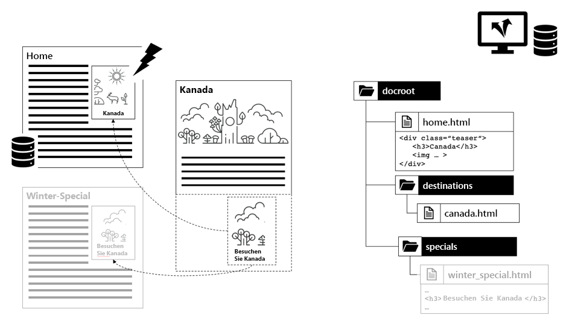

# Kapitel 1 - Dispatcher-Konzepte, -Muster und -Muster

## Überblick

Dieses Kapitel enthält eine kurze Einführung in die Geschichte und Mechanik des Dispatchers und beschreibt, wie sich dies auf die Gestaltung seiner Komponenten durch einen AEM-Entwickler auswirkt.

## Warum Entwickler sich um Infrastruktur kümmern sollten

Der Dispatcher ist ein wesentlicher Bestandteil der meisten - wenn nicht sogar aller AEM Installationen. Sie finden viele Online-Artikel, die die Konfiguration des Dispatchers sowie Tipps und Tricks beschreiben.

Diese Teile und Informationen jedoch immer Beginn auf einer sehr technischen Ebene - vorausgesetzt, Sie wissen bereits, was Sie tun wollen und damit nur Details darüber, wie Sie erreichen, was Sie wollen. Wir haben noch nie Konzeptdokumente gefunden, in denen die _Was ist und warum ist_ beschrieben werden, wenn es darum geht, was man mit dem Dispatcher tun kann und was nicht.

### Muster: Dispatcher als Nachdenken

Dieser Mangel an grundlegenden Informationen führt zu einer Reihe von Anti-Mustern, die wir in einer Reihe von AEM Projekten gesehen haben:

1. Da der Dispatcher auf dem Apache-Webserver installiert ist, ist es Aufgabe der &quot;Unix-Götter&quot; im Projekt, ihn zu konfigurieren. Ein &quot;sterblicher Java-Entwickler&quot;muss sich nicht damit beschäftigen.

2. Der Java-Entwickler muss sicherstellen, dass sein Code funktioniert... der Dispatcher wird es später magisch schnell machen. Der Dispatcher ist immer ein Nachdenken. Das funktioniert jedoch nicht. Ein Entwickler muss seinen Code unter Berücksichtigung des Dispatchers entwerfen. Und er muss seine grundlegenden Konzepte kennen, um das zu tun.

### &quot;Zuerst muss es funktionieren - dann schnell machen&quot; ist nicht immer richtig

Sie haben vielleicht die Programmieranleitung _&quot;Zuerst machen Sie es funktioniert - dann machen Sie es schnell.&quot;_. Das ist nicht völlig falsch. Ohne den richtigen Kontext wird sie jedoch in der Regel falsch interpretiert und nicht korrekt angewendet.

Die Empfehlung sollte den Entwickler davon abhalten, Code vorzeitig zu optimieren, der möglicherweise nie ausgeführt wird - oder so selten ausgeführt wird, dass eine Optimierung keine ausreichende Wirkung hätte, um den Aufwand für die Optimierung zu rechtfertigen. Darüber hinaus könnte die Optimierung zu komplexerem Code führen und damit Fehler hervorrufen. Wenn Sie also Entwickler sind, verbringen Sie nicht zu viel Zeit mit der Mikrooptimierung jeder einzelnen Codezeile. Stellen Sie sicher, dass Sie die richtigen Datenstrukturen, Algorithmen und Bibliotheken ausgewählt haben, und warten Sie auf die Hotspot-Analyse eines Profilers, um zu sehen, wo eine gründlichere Optimierung die Gesamtleistung steigern könnte.

### Architektonische Entscheidungen und Artefakte

Die Empfehlung &quot;zuerst machen es funktioniert - dann schnell machen&quot; ist jedoch völlig falsch, wenn es um &quot;architektonische&quot; Entscheidungen geht. Was sind architektonische Entscheidungen? Einfach gesagt, es sind die Entscheidungen, die teuer, schwierig und/oder unmöglich danach zu ändern sind. Denken Sie daran, dass &quot;teuer&quot;manchmal genauso ist wie &quot;unmöglich&quot;.  Wenn Ihr Projekt beispielsweise nicht mehr über das Budget verfügt, sind kostspielige Änderungen nicht mehr möglich. Infrastrukturveränderungen sind die allerersten Veränderungen in dieser Kategorie, die den meisten Menschen am Herzen liegen. Es gibt aber auch eine andere Art von &quot;architektonischen&quot;Artefakten, die sich sehr unangenehm ändern können:

1. Codeabschnitte im &quot;Zentrum&quot; einer Anwendung, auf die viele andere Teile angewiesen sind. Um diese zu ändern, müssen alle Abhängigkeiten gleichzeitig geändert und erneut getestet werden.

2. Artefakte, die in einem asynchronen, zeitabhängigen Szenario enthalten sind, in dem die Eingabe - und damit das Verhalten des Systems sehr zufällig variieren kann. Änderungen können unvorhersehbare Auswirkungen haben und schwer zu testen sein.

3. Softwaremuster, die immer wieder verwendet und wiederverwendet werden, in allen Teilen und Teilen des Systems. Wenn sich das Softwaremuster als suboptimal erweist, müssen alle Artefakte, die das Muster verwenden, neu kodiert werden.

Merken? Auf dieser Seite sagten wir, dass der Dispatcher ein wesentlicher Bestandteil einer AEM ist. Der Zugriff auf eine Web-Anwendung ist sehr zufällig - Benutzer kommen und gehen zu unvorhersehbaren Zeiten. Am Ende werden alle Inhalte im Dispatcher zwischengespeichert (oder sollten). Wenn Sie also genau aufpassen, haben Sie vielleicht erkannt, dass Zwischenspeicherung als &quot;architektonisches&quot; Artefakt angesehen werden kann und daher von allen Mitgliedern des Teams, Entwicklern und Administratoren gleichermaßen verstanden werden sollte.

Wir sagen nicht, dass ein Entwickler den Dispatcher tatsächlich konfigurieren sollte. Sie müssen die Konzepte - insbesondere die Grenzen - kennen, um sicherzustellen, dass ihr Code auch vom Dispatcher genutzt werden kann.

Der Dispatcher verbessert nicht auf magische Weise die Geschwindigkeit des Codes. Ein Entwickler muss seine Komponenten unter Berücksichtigung des Dispatchers erstellen. Deshalb muss er wissen, wie es funktioniert.

## Dispatcher-Zwischenspeicherung - Grundprinzipien

### Dispatcher als Zwischenspeicher-HTTP - Lastenausgleich

Was ist der Dispatcher und warum heißt er überhaupt &quot;Dispatcher&quot;?

Der Dispatcher ist

* Zuallererst ein Cache

* Ein Reverse-Proxy

* Ein Modul für den Apache httpd-Webserver, das AEM Funktionen zur Vielseitigkeit des Apache hinzufügt und reibungslos mit allen anderen Apache-Modulen zusammenarbeitet (wie z. B. SSL oder sogar SSI, wie wir später sehen werden)

Zu Beginn des Webauftritts erwarten Sie einige hundert Besucher zu einer Site. Ein Setup eines Dispatchers, &quot;Dispatcher&quot; oder ein Ausgleich der Last von Anfragen an eine Reihe von AEM Veröffentlichungsservern und das war normalerweise ausreichend - also der Name &quot;Dispatcher&quot;. Heutzutage wird dieses Setup jedoch nicht sehr häufig verwendet.

Später in diesem Artikel werden wir verschiedene Möglichkeiten zum Einrichten von Dispatchers und Veröffentlichungssystemen sehen. Lassen Sie uns zunächst Beginn mit einigen Grundlagen zur HTTP-Zwischenspeicherung machen.


*Grundlegende Funktionalität eines Dispatcher-Cache*

<br> 

Die Grundlagen des Dispatchers werden hier erläutert. Der Dispatcher ist ein einfacher Reverse-Proxy zum Zwischenspeichern, der HTTP-Anforderungen empfangen und erstellen kann. Ein normaler Anforderungs-/Antwortzyklus funktioniert wie folgt:

1. Ein Benutzer fordert eine Seite an
2. Der Dispatcher überprüft, ob bereits eine gerenderte Version dieser Seite vorhanden ist. Nehmen wir einmal an, es ist die erste Anfrage für diese Seite und der Dispatcher kann keine lokale Kopie im Cache finden.
3. Der Dispatcher fordert die Seite vom Veröffentlichungssystem an
4. Im Veröffentlichungssystem wird die Seite von einer JSP- oder einer HTML-Vorlage gerendert
5. Die Seite wird an den Dispatcher zurückgegeben
6. Der Dispatcher speichert die Seite zwischen
7. Der Dispatcher gibt die Seite an den Browser zurück
8. Wenn dieselbe Seite ein zweites Mal angefordert wird, kann sie direkt aus dem Dispatcher-Cache bereitgestellt werden, ohne dass sie erneut in der Veröffentlichungsinstanz gerendert werden muss. Dadurch wird die Wartezeit für Benutzer- und CPU-Zyklen in der Veröffentlichungsinstanz reduziert.

Wir sprachen über &quot;Seiten&quot; im letzten Abschnitt. Das gleiche Schema gilt jedoch auch für andere Ressourcen wie Bilder, CSS-Dateien, PDF-Downloads usw.

#### Zwischenspeicherung von Daten

Das Dispatcher-Modul nutzt die Funktionen, die der Host-Apache-Server bietet. Ressourcen wie HTML-Seiten, Downloads und Bilder werden als einfache Dateien im Apache-Dateisystem gespeichert. Das ist so einfach.

Der Dateiname wird von der URL der angeforderten Ressource abgeleitet. Wenn Sie eine Datei `/foo/bar.html` anfordern, wird sie beispielsweise unter /`var/cache/docroot/foo/bar.html` gespeichert.

Grundsätzlich können Sie, wenn alle Dateien zwischengespeichert und damit statisch im Dispatcher gespeichert werden, den Stecker des Publish-Systems ziehen und der Dispatcher als einfacher Webserver dienen. Aber das soll nur das Prinzip verdeutlichen. Das wahre Leben ist komplizierter. Sie können nicht alles zwischenspeichern, und der Cache ist nie vollständig &quot;voll&quot;, da die Anzahl der Ressourcen aufgrund der Dynamik des Renderprozesses unbegrenzt sein kann. Das Modell eines statischen Dateisystems hilft, ein grobes Bild der Fähigkeiten des Dispatchers zu generieren. Und es hilft, die Einschränkungen des Dispatchers zu erklären.

#### Die AEM URL-Struktur und Dateisystemzuordnung

Um den Dispatcher genauer zu verstehen, sollten wir die Struktur einer einfachen Beispiel-URL erneut aufrufen.  Schauen wir uns das folgende Beispiel an:

`http://domain.com/path/to/resource/pagename.selectors.html/path/suffix.ext?parameter=value&amp;otherparameter=value#fragment`

* `http` bezeichnet das Protokoll

* `domain.com` ist der Domänenname

* `path/to/resource` ist der Pfad, unter dem die Ressource in CRX und später im Dateisystem des Apache-Servers gespeichert wird.

Von hier unterscheiden sich die Dinge etwas zwischen dem AEM und dem Apache-Dateisystem.

In AEM,

* `pagename` ist die Ressourcenbeschriftung

* `selectors` steht für eine Reihe von Selektoren, die in Sling verwendet werden, um zu bestimmen, wie die Ressource wiedergegeben wird. Eine URL kann eine beliebige Anzahl von Selektoren haben. Sie werden durch einen Punkt getrennt. Ein Selektorabschnitt könnte z. B. &quot;fFranzösisch.mobile.fancy&quot;sein. Selektoren sollten nur Buchstaben, Ziffern und Bindestriche enthalten.

* `html` als der letzte der &quot;Selektoren&quot; wird eine Erweiterung genannt. In AEM/Sling bestimmt es auch teilweise das Renderskript.

* `path/suffix.ext` ist ein pfadähnlicher Ausdruck, der der URL als Suffix hinzugefügt werden kann.  Sie kann in AEM Skripten verwendet werden, um die Wiedergabe einer Ressource weiter zu steuern. Wir werden später einen ganzen Abschnitt über diesen Teil haben. Für den Moment sollte es ausreichen, um zu wissen, dass Sie es als zusätzlichen Parameter verwenden können. Suffixe müssen eine Erweiterung haben.

* `?parameter=value&otherparameter=value` ist der Abschnitt &quot;Abfrage&quot;der URL. Es wird verwendet, um beliebige Parameter an AEM zu übergeben. URLs mit Parametern können nicht zwischengespeichert werden. Daher sollten Parameter auf Fälle beschränkt werden, in denen sie absolut erforderlich sind.

* `#fragment`, wird der Fragmentteil einer URL nicht an AEM weitergegeben, sondern nur im Browser verwendet. entweder in JavaScript-Frameworks als &quot;Routing-Parameter&quot;oder um zu einem bestimmten Seitenabschnitt zu springen.

In Apache (*verweisen Sie auf das folgende Diagramm*),

* `pagename.selectors.html` wird als Dateiname im Dateisystem des Cache verwendet.

Wenn die URL ein Suffix `path/suffix.ext` hat, dann

* `pagename.selectors.html` wird als Ordner erstellt

* `path` einen Ordner im  `pagename.selectors.html` Ordner

* `suffix.ext` ist eine Datei im  `path` Ordner. Hinweis: Wenn das Suffix keine Erweiterung enthält, wird die Datei nicht zwischengespeichert.


*Dateisystem-Layout nach Abrufen von URLs aus dem Dispatcher*

<br> 

#### Grundlegende Einschränkungen

Die Zuordnung zwischen URL, Ressource und Dateiname ist ziemlich einfach.

Sie haben vielleicht einige Fallen bemerkt,

1. URLs können sehr lang werden. Das Hinzufügen des &quot;path&quot;-Teils eines `/docroot` auf dem lokalen Dateisystem könnte leicht die Grenzen einiger Dateisysteme überschreiten. Das Ausführen des Dispatchers in NTFS unter Windows kann eine Herausforderung sein. Sie sind jedoch bei Linux sicher.

2. URLs können Sonderzeichen und Umlaute enthalten. Das ist normalerweise kein Problem für den Dispatcher. Beachten Sie jedoch, dass die URL an vielen Stellen Ihrer Anwendung interpretiert wird. In der Regel haben wir seltsames Verhalten einer Anwendung gesehen - nur um herauszufinden, dass ein selten verwendeter (benutzerdefinierter) Code nicht gründlich auf Sonderzeichen getestet wurde. Du solltest sie vermeiden, wenn du kannst. Und wenn Sie das nicht können, planen Sie gründliche Tests.

3. In CRX verfügen Ressourcen über Unterressourcen. Eine Seite enthält beispielsweise eine Reihe von Unterseiten. Dies kann in einem Dateisystem nicht übereinstimmen, da Dateisysteme entweder Dateien oder Ordner haben.

#### URLs ohne Erweiterung werden nicht zwischengespeichert

URLs müssen immer eine Erweiterung haben. Obwohl Sie URLs ohne Erweiterungen in AEM bereitstellen können. Diese URLs werden im Dispatcher nicht zwischengespeichert.

**Beispiele**

`http://domain.com/home.html` ist  **zwischenspeicherbar**

`http://domain.com/home` ist  **nicht zwischenspeicherbar**

Dieselbe Regel gilt, wenn die URL ein Suffix enthält. Das Suffix muss über eine Erweiterung verfügen, um zwischengespeichert werden zu können.

**Beispiele**

`http://domain.com/home.html/path/suffix.html` ist  **zwischenspeicherbar**

`http://domain.com/home.html/path/suffix` ist  **nicht zwischenspeicherbar**

Sie fragen sich vielleicht, was passiert, wenn der Ressourcenteil keine Erweiterung hat, aber das Suffix eine hat? Nun, in diesem Fall hat die URL überhaupt kein Suffix. Sehen Sie sich das nächste Beispiel an:

**Beispiel**

`http://domain.com/home/path/suffix.ext`

Die `/home/path/suffix` ist der Pfad zur Ressource ... es gibt also kein Suffix in der URL.

**Zusammenfassung**

Fügen Sie dem Pfad und dem Suffix immer Erweiterungen hinzu. SEO-bewusste Menschen argumentieren manchmal, dass dies Sie in den Suchergebnissen nach unten sortiert. Aber eine nicht gespeicherte Seite wäre extrem langsam und würde sogar noch weiter nach unten geraten.

#### Konflikt bei Suffix-URLs

Angenommen, Sie haben zwei gültige URLs

`http://domain.com/home.html`

und

`http://domain.com/home.html/suffix.html`

Sie sind in AEM absolut gültig. Sie würden kein Problem auf Ihrer lokalen Entwicklungsmaschine sehen (ohne Dispatcher). Wahrscheinlich werden Sie auch bei UAT- oder Load-Tests keine Probleme haben. Das Problem, vor dem wir stehen, ist so subtil, dass es die meisten Tests durchläuft.  Es wird Sie hart treffen, wenn Sie sich in der Spitzenzeit befinden und Sie sind auf Zeit begrenzt, um es zu beheben, wahrscheinlich haben Sie keinen Serverzugriff und keine Ressourcen, um es zu beheben. Wir waren dort...

Also... Was ist das Problem?

`home.html` in einem Dateisystem kann entweder eine Datei oder ein Ordner sein. Nicht beide gleichzeitig mit AEM.

Wenn Sie zunächst `home.html` anfordern, wird dies als Datei erstellt.

Nachfolgende Anforderungen an `home.html/suffix.html` geben gültige Ergebnisse zurück. Da jedoch die Datei `home.html` &quot;die Position im Dateisystem blockiert&quot;, kann `home.html` nicht ein zweites Mal als Ordner erstellt werden und `home.html/suffix.html` wird daher nicht zwischengespeichert.


*Dateiblockierposition im Dateisystem verhindert, dass Unterressourcen zwischengespeichert werden*

<br> 

Wenn Sie dies andersherum tun, wird zunächst `home.html/suffix.html` angefordert, dann `suffix.html` zunächst unter einem Ordner `/home.html` zwischengespeichert. Dieser Ordner wird jedoch gelöscht und durch eine Datei `home.html` ersetzt, wenn Sie danach `home.html` als Ressource anfordern.


*Löschen einer Pfadstruktur, wenn eine übergeordnete Ressource als Ressource abgerufen wird*

<br> 

Das Ergebnis der Zwischenspeicherung ist also vollkommen zufällig und hängt von der Reihenfolge der eingehenden Anfragen ab. Was die Dinge noch schwieriger macht, ist die Tatsache, dass Sie normalerweise mehr als einen Dispatcher haben. Und die Leistung, die Cache-Trefferrate und das Verhalten können von Dispatcher zu Dispatcher unterschiedlich sein. Wenn Sie herausfinden möchten, warum Ihre Website nicht reagiert, müssen Sie sicherstellen, dass Sie den richtigen Dispatcher mit der unglücklichen Cache-Reihenfolge suchen. Wenn Sie sich den Dispatcher ansehen, der - mit Glück - ein günstigeres Anforderungsmuster hatte, gehen Sie beim Suchen des Problems verloren.

#### Vermeiden von Konflikt-URLs

Sie können &quot;in Konflikt stehende URLs&quot;vermeiden, bei denen ein Ordnername und ein Dateiname im Dateisystem um denselben Pfad konkurrieren, wenn Sie eine andere Erweiterung für die Ressource verwenden, wenn Sie ein Suffix haben.

**Beispiel**

* `http://domain.com/home.html`

* `http://domain.com/home.dir/suffix.html`

Beide sind perfekt zwischenspeicherbar,


Wählen Sie eine dedizierte Erweiterung &quot;dir&quot;für eine Ressource, wenn Sie ein Suffix anfordern oder wenn Sie die Verwendung des Suffixs ganz vermeiden. Es gibt seltene Fälle, in denen sie nützlich sind. Und es ist einfach, diese Fälle korrekt zu implementieren.  Wie wir im nächsten Kapitel sehen werden, wenn wir über Cache-Invalidierung und Flushing sprechen.

#### Nicht zwischengespeicherte Anforderungen

Lassen Sie uns eine kurze Zusammenfassung des letzten Kapitels sowie einige weitere Ausnahmen ansehen. Der Dispatcher kann eine URL zwischenspeichern, wenn sie als zwischenspeicherbar konfiguriert ist und es sich um eine GET-Anforderung handelt. Es kann nicht unter einer der folgenden Ausnahmen zwischengespeichert werden.

**Cacheanforderungen**

* Anforderung ist so konfiguriert, dass sie in der Dispatcher-Konfiguration zwischengespeichert werden kann
* Anfrage ist eine einfache GET

**Nicht speicherbare Anforderungen oder Antworten**

* Anforderung, bei der die Zwischenspeicherung nach Konfiguration verweigert wird (Pfad, Muster, MIME-Typ)
* Antworten, die einen &quot;Dispatcher: no-cache&quot; header
* Antwort, die eine &quot;Cache-Steuerung&quot;zurückgibt: no-cache|private&quot; header
* Antwort, die ein &quot;Pragma: no-cache&quot; header
* Anforderung mit Abfrage-Parametern
* URL ohne Erweiterung
* URL mit Suffix ohne Erweiterung
* Antwort, die einen Statuscode außer 200 zurückgibt
* POST

## Cache ungültig machen und leeren

### Überblick

Im letzten Kapitel wurden eine große Anzahl von Ausnahmen aufgelistet, wenn der Dispatcher eine Anforderung nicht zwischenspeichern kann. Aber es gibt noch mehr zu berücksichtigen: Nur weil der Dispatcher _eine Anforderung zwischenspeichern kann, bedeutet dies nicht unbedingt, dass__zwischengespeichert werden soll._

Der Punkt ist: Das Zwischenspeichern ist normalerweise einfach. Der Dispatcher muss nur das Ergebnis einer Antwort speichern und es beim nächsten Eingang derselben Anforderung zurückgeben. Right? Falsch!

Der schwierige Teil ist die _Ungültigmachung_ oder _Flushing_ des Cache. Der Dispatcher muss herausfinden, wenn sich eine Ressource geändert hat - und erneut gerendert werden muss.

Das scheint auf den ersten Blick eine triviale Aufgabe zu sein... aber das ist es nicht. Lesen Sie weiter, und Sie werden einige schwierige Unterschiede zwischen einzelnen und einfachen Ressourcen und Seiten herausfinden, die auf einer hochgradig vernetzten Struktur mehrerer Ressourcen basieren.

### Einfache Ressourcen und Flushing

Wir haben unser AEM-System eingerichtet, um bei Bedarf eine Miniaturansicht für jedes Bild dynamisch mit einer speziellen Miniaturansicht-Auswahl zu erstellen:

`/content/dam/path/to/image.thumb.png`

Und natürlich stellen wir eine URL bereit, um dem Originalbild eine URL ohne Selektor bereitzustellen:

`/content/dam/path/to/image.png`

Wenn wir sowohl die Miniaturansicht als auch das Originalbild herunterladen, erhalten wir am Ende ein Bild wie:

```
/var/cache/dispatcher/docroot/content/dam/path/to/image.thumb.png

/var/cache/dispatcher/docroot/content/dam/path/to/image.png
```

in unserem Dispatcher-Dateisystem.

Jetzt lädt der Benutzer eine neue Version dieser Datei hoch und aktiviert sie. Schließlich wird eine Ausschlussanforderung von AEM an den Dispatcher gesendet.

```
GET /invalidate
invalidate-path:  /content/dam/path/to/image

<no body>
```

Die Ungültigmachung ist so einfach: Eine einfache GET zu einer speziellen URL für &quot;ungültig&quot;im Dispatcher. Ein HTTP-Body ist nicht erforderlich, die &quot;Payload&quot;ist nur der &quot;invalidate-path&quot;-Header. Beachten Sie auch, dass der ungültige Pfad im Header die Ressource ist, die AEM kennt - und nicht die Datei oder Dateien, die der Dispatcher zwischengespeichert hat. AEM weiß nur über Ressourcen. Erweiterungen, Selektoren und Suffixe werden zur Laufzeit verwendet, wenn eine Ressource angefordert wird. AEM führt keine Buchführung darüber durch, welche Selektoren für eine Ressource verwendet wurden. Daher ist der Ressourcenpfad alles, was er bei der Aktivierung einer Ressource weiß.

Das reicht in unserem Fall aus. Wenn sich eine Ressource geändert hat, können wir sicher davon ausgehen, dass sich auch alle Darstellungen dieser Ressource geändert haben. In unserem Beispiel wird, wenn sich das Bild geändert hat, auch eine neue Miniaturansicht gerendert.

Der Dispatcher kann die Ressource mit allen im Cache gespeicherten Darstellungen problemlos löschen. Es wird so etwas wie:

`$ rm /content/dam/path/to/image.*`

Entfernen von `image.png` und `image.thumb.png` und allen anderen Darstellungen, die diesem Muster entsprechen.

Sehr einfach, solange Sie nur eine Ressource verwenden, um auf eine Anfrage zu antworten.

### Referenzen und geteilter Inhalt

#### Das Problem mit geteilten Inhalten

Im Gegensatz zu Bildern oder anderen Binärdateien, die in AEM hochgeladen werden, sind HTML-Seiten keine Einzeltiere. Sie leben in Herden und sind durch Hyperlinks und Referenzen stark miteinander verbunden. Der einfache Link ist harmlos, aber es wird schwierig, wenn wir über Inhaltsverweise sprechen. Die allgegenwärtige Top-Navigation oder Teaser auf Seiten sind Inhaltsreferenzen.

#### Inhaltsverweise und Gründe dafür

Sehen wir uns ein einfaches Beispiel an. Ein Reisebüro hat eine Webseite, auf der eine Reise nach Kanada angeboten wird. Diese Promotion wird im Teaser-Abschnitt auf zwei weiteren Seiten, auf der Homepage und auf der Seite &quot;Winterspezialisten&quot;vorgestellt.

Da beide Seiten denselben Teaser anzeigen, wäre es unnötig, den Autor zu bitten, den Teaser mehrmals für jede Seite zu erstellen, auf der er angezeigt werden soll. Stattdessen behält sich die Zielgruppe &quot;Kanada&quot;einen Abschnitt in den Seiteneigenschaften vor, um die Informationen für den Teaser bereitzustellen - oder besser, um eine URL bereitzustellen, die den Teaser vollständig wiedergibt:

`<sling:include resource="/content/home/destinations/canada" addSelectors="teaser" />`

 oder

`<sling:include resource="/content/home/destinations/canada/jcr:content/teaser" />`


AEM funktioniert nur wie Charme, aber wenn Sie einen Dispatcher für die Instanz im Veröffentlichungsmodus verwenden, passiert etwas Seltsames.

Stellen Sie sich vor, Sie haben Ihre Website veröffentlicht. Der Titel auf Ihrer Seite mit Kanada ist &quot;Canada&quot;. Wenn ein Besucher Ihre Startseite anfordert (die einen Teaser-Verweis auf diese Seite enthält), rendert die Komponente auf der Seite &quot;Kanada&quot;so etwas wie

```
<div class="teaser">
  <h3>Canada</h3>
  
</div>
```

*in* die Startseite. Die Startseite wird vom Dispatcher als statische HTML-Datei gespeichert, einschließlich des Teasers und der Überschrift in der Datei.

Jetzt hat der Vermarkter gelernt, dass Teaser-Schlagzeilen umsetzbar sein sollten. Er beschließt also, den Titel von &quot;Kanada&quot; in &quot;Kanada besuchen&quot; zu ändern und aktualisiert auch das Bild.

Er veröffentlicht die bearbeitete Seite &quot;Kanada&quot;und besucht die zuvor veröffentlichte Startseite erneut, um seine Änderungen zu sehen. Aber dort hat sich nichts geändert. Es zeigt immer noch den alten Teaser. Die Dublette schaut auf die &quot;Winteraktion&quot;. Diese Seite wurde zuvor noch nie angefordert und wird daher nicht statisch im Dispatcher zwischengespeichert. Diese Seite wird also frisch von Publish gerendert und diese Seite enthält jetzt den neuen Teaser &quot;Visit Canada&quot;.



*Dispatcher zum Speichern von statisch eingeschlossenen Inhalten in der Startseite*

<br> 

Was ist passiert? Der Dispatcher speichert eine statische Version einer Seite, die alle Inhalte und Markierungen enthält, die während der Wiedergabe aus anderen Ressourcen gezeichnet wurden.

Der Dispatcher, ein reiner, auf Dateisystemen basierender Webserver, ist schnell, aber auch relativ einfach. Wenn sich eine eingeschlossene Ressource ändert, wird dies nicht erkannt. Er klammert weiterhin an den Inhalt, der sich bei der Wiedergabe der Seite &quot;einschließlich&quot;befanden.

Die Seite &quot;Winter Special&quot;wurde noch nicht gerendert, daher gibt es keine statische Version auf dem Dispatcher und wird daher mit dem neuen Teaser angezeigt, da sie auf Anfrage frisch gerendert wird.

Sie könnten denken, dass der Dispatcher jede Ressource, die er berührt, beim Rendern und Löschen aller Seiten, die diese Ressource verwendet haben, verfolgen würde, wenn sich diese Ressource ändert. Der Dispatcher gibt die Seiten jedoch nicht wieder. Das Rendering wird vom Veröffentlichungssystem durchgeführt. Der Dispatcher weiß nicht, welche Ressourcen in eine gerenderte HTML-Datei fließen.

Noch nicht überzeugt? Sie können denken, dass *&quot;es eine Möglichkeit geben muss, eine Art Abhängigkeitsverfolgung zu implementieren&quot;*. Nun, es gibt, oder genauer gesagt, *war*. Communiqué 3, der Ururururgroßvater von AEM, hatte einen Abhängigkeitstracker implementiert in der _session_, die zum Rendern einer Seite verwendet wurde.

Während einer Anforderung wurde jede Ressource, die über diese Sitzung erfasst wurde, als Abhängigkeit von der URL verfolgt, die derzeit gerendert wurde.

Aber es stellte sich heraus, dass es sehr teuer war, die Abhängigkeiten im Auge zu behalten. Die Leute entdeckten bald, dass die Website schneller ist, wenn sie die Funktion zur Abhängigkeitsverfolgung komplett deaktiviert haben und sich darauf verlassen, dass alle HTML-Seiten erneut gerendert werden, nachdem eine HTML-Seite geändert wurde. Darüber hinaus war diese Regelung auch nicht perfekt - es gab eine Reihe von Fallstricken und Ausnahmen. In einigen Fällen haben Sie nicht die Standardsitzung für Anforderungen verwendet, um eine Ressource zu erhalten, sondern eine Admin-Sitzung, um einige Hilfsmittel zum Rendern einer Anforderung zu erhalten. Diese Abhängigkeiten wurden in der Regel nicht verfolgt und führten zu Kopfschmerzen und Telefonanrufen an das Hopfen-Team, die darum bitten, den Cache manuell zu leeren. Du hattest Glück, wenn sie dazu eine Standardmethode hatten. Es waren noch mehr Götter auf dem Weg, aber... lassen Sie uns aufhören zu erinnern. Dies führt bis ins Jahr 2005 zurück. Letztendlich wurde dieses Feature in Communiqué 4 standardmäßig deaktiviert und es wurde nicht wieder in den Nachfolger CQ5 zurückgeführt, der dann AEM wurde.

### Automatische Ungültigmachung

#### Wenn Full-Flushing günstiger ist als Abhängigkeitsverfolgung

Seit CQ5 setzen wir auf eine mehr oder weniger vollständige Ungültigmachung der gesamten Site, wenn nur eine der Seiten sich ändert. Diese Funktion heißt &quot;Automatische Ungültigmachung&quot;.

Aber wieder - wie kann es sein, dass das Zurückwerfen und erneute Rendern von Hunderten von Seiten billiger ist, als eine ordnungsgemäße Abhängigkeitsverfolgung und ein teilweises Rendering durchzuführen?

Es gibt zwei Hauptgründe:

1. Auf einer durchschnittlichen Website wird häufig nur eine kleine Teilmenge der Seiten angefordert. Selbst wenn Sie also alle gerenderten Inhalte wegwerfen, werden nur ein paar Dutzend direkt danach angefordert. Die Wiedergabe der langen Seitenlänge kann über einen bestimmten Zeitraum verteilt werden, wenn sie tatsächlich angefordert werden. Die Belastung der Renderseiten ist also nicht so hoch wie erwartet. Natürlich gibt es immer Ausnahmen... wir werden einige Tricks darüber diskutieren, wie man gleichmäßig verteilte Ladung auf größeren Websites mit leeren Dispatcher-Caches zu behandeln, später.

2. Alle Seiten sind sowieso durch die Hauptnavigation verbunden. Fast alle Seiten sind letztlich voneinander abhängig. Das bedeutet, dass selbst der intelligenteste Abhängigkeitstracker herausfinden wird, was wir bereits wissen: Wenn sich eine der Seiten ändert, müssen Sie alle anderen Seiten für ungültig erklären.

Glaubst du nicht? Lassen Sie uns den letzten Punkt illustrieren.

Wir verwenden dasselbe Argument wie im letzten Beispiel mit Teasern, die auf den Inhalt einer Remote-Seite verweisen. Erst jetzt verwenden wir ein extremeres Beispiel: Eine automatisch gerenderte Hauptnavigation. Wie beim Teaser wird der Navigationstitel von der verknüpften oder &quot;Remote&quot;-Seite als Inhaltsreferenz gezeichnet. Die Titel der Remote-Navigation werden nicht auf der aktuell gerenderten Seite gespeichert. Denken Sie daran, dass die Navigation auf jeder Seite Ihrer Website wiedergegeben wird. Der Titel einer Seite wird also immer wieder auf allen Seiten mit Hauptnavigation verwendet. Wenn Sie einen Navigationstitel ändern möchten, sollten Sie dies nur einmal auf der Remote-Seite tun, nicht auf jeder Seite, die auf die Seite verweist.

In unserem Beispiel werden alle Seiten durch die Navigation miteinander verbunden, indem der &quot;NavTitle&quot; der Zielgruppe verwendet wird, um einen Namen in der Navigation zu rendern. Der Navigationstitel für &quot;Island&quot;wird von der Seite &quot;Island&quot;gezeichnet und auf jeder Seite mit Hauptnavigation dargestellt.


*Die Hauptnavigation vermischt unweigerlich Inhalte aller Seiten durch Ziehen der &quot;NavTitles&quot;*

<br> 

Wenn Sie den NavTitle auf der Seite Island von &quot;Island&quot; in &quot;Beautiful Island&quot; ändern, ändert sich dieser Titel sofort auf allen anderen Seiten Hauptmenü. Die Seiten, die vor dieser Änderung gerendert und zwischengespeichert wurden, werden alle statisch und müssen ungültig werden.

#### Implementierung der automatischen Ungültigmachung: Die .stat-Datei

Wenn Sie jetzt eine große Site mit Tausenden von Seiten haben, würde es einige Zeit dauern, alle Seiten zu durchlaufen und sie physisch zu löschen. Während dieses Zeitraums konnte der Dispatcher unbeabsichtigt statische Inhalte bereitstellen. Schlimmer noch: Beim Zugriff auf die Cachedateien kann es zu Konflikten kommen. Möglicherweise wird eine Seite angefordert, während sie gerade gelöscht wird, oder eine Seite wird aufgrund einer zweiten Ungültigmachung, die nach einer unmittelbar nachfolgenden Aktivierung erfolgte, erneut gelöscht. Man bedenke, was für ein Chaos das wäre. Glücklicherweise geschieht das nicht. Der Dispatcher verwendet einen cleveren Trick, um Folgendes zu vermeiden: Statt hunderte und tausende von Dateien zu löschen, wird eine einfache, leere Datei in den Stammordner Ihres Dateisystems gesetzt, wenn eine Datei veröffentlicht wird und somit alle Abhängigkeitsdateien als ungültig betrachtet werden. Diese Datei wird als &quot;statfile&quot;bezeichnet. Die Statusdatei ist eine leere Datei - was an der Statusdatei wichtig ist, ist nur das Erstellungsdatum.

Alle Dateien im Dispatcher, deren Erstellungsdatum älter als die Statusdatei ist, wurden vor der letzten Aktivierung gerendert (und ungültig) und werden daher als &quot;ungültig&quot;betrachtet. Sie sind noch physisch im Dateisystem vorhanden, aber der Dispatcher ignoriert sie. Sie sind &quot;veraltet&quot;. Bei jeder Anforderung an eine statische Ressource fordert der Dispatcher das AEM System auf, die Seite erneut zu rendern. Diese neu gerenderte Seite wird dann im Dateisystem gespeichert - jetzt mit einem neuen Erstellungsdatum und es ist wieder neu.


*Das Erstellungsdatum der .stat-Datei definiert, welcher Inhalt veraltet ist und was frisch ist*

<br> 

Sie können fragen, warum es heißt &quot;.stat&quot;? Und nicht vielleicht &quot;.invalidiert&quot;? Nun, Sie können sich vorstellen, dass diese Datei in Ihrem Dateisystem dem Dispatcher hilft, festzustellen, welche Ressourcen statisch ** bereitgestellt werden können - genau wie von einem statischen Webserver. Diese Dateien müssen nicht mehr dynamisch gerendert werden.

Die wahre Natur des Namens ist jedoch weniger metaphorisch. Es wird vom Unix-Systemaufruf `stat()` abgeleitet, der die Änderungszeit einer Datei (unter anderem) zurückgibt.

#### Mischen einfacher und automatischer Validierung

Aber warte... vorhin sagten wir, dass einzelne Ressourcen physisch gelöscht werden. Nun sagen wir, dass eine neuere Statusdatei sie in den Augen des Dispatchers praktisch ungültig machen würde. Warum dann die physische Löschung, zuerst?

Die Antwort ist einfach. Normalerweise verwenden Sie beide Strategien parallel - aber für verschiedene Arten von Ressourcen. Binäre Assets, wie Bilder, sind eigenständig. Sie sind nicht mit anderen Ressourcen in dem Sinne verbunden, dass sie ihre Informationen wiedergeben müssen.

HTML-Seiten hingegen sind stark voneinander abhängig. Sie würden diese automatisch ungültig machen. Dies ist die Standardeinstellung im Dispatcher. Alle Dateien, die zu einer ungültigen Ressource gehören, werden physisch gelöscht. Darüber hinaus werden Dateien, die mit &quot;.html&quot;enden, automatisch ungültig gemacht.

Der Dispatcher entscheidet über die Dateierweiterung, ob ein System der automatischen Ungültigmachung angewendet werden soll oder nicht.

Die Dateiendungen für die automatische Ungültigmachung können konfiguriert werden. Theoretisch können Sie alle Erweiterungen zur automatischen Ungültigmachung einschließen. Aber denken Sie daran, dass dies zu einem sehr hohen Preis kommt. Die veralteten Ressourcen werden nicht unbeabsichtigt bereitgestellt, aber die Performance des Versands wird durch Überinvalidierung stark beeinträchtigt.

Stellen Sie sich beispielsweise vor, Sie implementieren ein Schema, bei dem PNGs und JPGs dynamisch gerendert werden und auf andere Ressourcen angewiesen sind, dies zu tun. Sie können Bilder mit hoher Auflösung auf eine kleinere, mit dem Web kompatible Auflösung skalieren. Während Sie dabei sind, ändern Sie auch die Komprimierungsrate. Auflösung und Komprimierungsrate in diesem Beispiel sind keine festen Konstanten, sondern konfigurierbare Parameter in der Komponente, die das Bild verwendet. Wenn dieser Parameter jetzt geändert wird, müssen Sie die Bilder ungültig machen.

Kein Problem - wir haben gerade gelernt, dass wir Bilder zur automatischen Ungültigmachung hinzufügen können und immer frisch gerenderte Bilder haben, wenn sich irgendetwas ändert.

#### Das Baby mit dem Bathwater auswerfen

Das ist richtig - und das ist ein riesiges Problem. Lesen Sie den letzten Absatz noch einmal. &quot;...frisch gerenderte Bilder, wenn sich etwas ändert.&quot; Wie Sie wissen, wird eine gute Website ständig geändert. hier neue Inhalte hinzufügen, dort einen Tippfehler korrigieren und an einer anderen Stelle einen Teaser bearbeiten. Das bedeutet, dass alle Bilder ständig ungültig gemacht werden und erneut gerendert werden müssen. Unterschätze das nicht! Die dynamische Wiedergabe und Übertragung von Bilddaten erfolgt in Millisekunden auf Ihrem lokalen Entwicklungscomputer. Ihre Umgebung muss das hundertmal öfter machen - pro Sekunde.

Und lassen Sie uns hier ganz klar sagen: Ihre JPGs müssen wiedergegeben werden, wenn sich eine HTML-Seite ändert und umgekehrt. Es gibt nur einen &quot;Bucket&quot;von Dateien, die automatisch ungültig gemacht werden. Es wird als Ganzes gerötet. Ohne Mittel, um in weitere detaillierte Strukturen aufzubrechen.

Es gibt einen guten Grund, warum die automatische Ungültigmachung standardmäßig auf &quot;.html&quot;beibehalten wird. Das Ziel ist es, diesen Eimer so klein wie möglich zu halten. Werfen Sie das Kind nicht mit dem Bade raus, indem Sie einfach alles für ungültig erklären - nur um auf der sicheren Seite zu sein.

Eigenständige Ressourcen sollten auf dem Pfad dieser Ressource bereitgestellt werden. Das hilft sehr, ungültig zu werden. Halten Sie es einfach, erstellen Sie keine Zuordnungsschemata wie &quot;Ressource /a/b/c&quot; wird von &quot;/x/y/z&quot; bereitgestellt. Stellen Sie sicher, dass Ihre Komponenten mit den standardmäßigen Einstellungen für die automatische Ungültigmachung des Dispatchers funktionieren. Versuchen Sie nicht, eine schlecht entworfene Komponente mit übermäßiger Ungültigkeit im Dispatcher zu reparieren.

##### Ausnahmen von der automatischen Ungültigmachung: ResourceOnly Ungültigmachung

Die Ungültigerklärung für den Dispatcher wird normalerweise von einem Replizierungsagenten aus dem (den) Veröffentlichungssystem(en) ausgelöst.

Wenn Sie mit Ihren Abhängigkeiten überaus vertraut sind, können Sie versuchen, einen eigenen Replizierungsagenten zu erstellen, der ungültig wird.

Es wäre ein wenig über diesen Leitfaden hinausgehend, um die Details, aber wir möchten Ihnen wenigstens einige Hinweise geben.

1. Wissen Sie wirklich, was Sie tun. Die Ungültigmachung richtig zu machen, ist wirklich schwer. Das ist ein Grund, warum die automatische Ungültigmachung so streng ist. um die Bereitstellung veralteter Inhalte zu vermeiden.

2. Wenn Ihr Agent einen HTTP-Header `CQ-Action-Scope: ResourceOnly` sendet, bedeutet das, dass diese einzelne Ungültigungsanforderung keine automatische Ungültigmachung auslöst. Dieser Code ( [https://github.com/cqsupport/webinar-dispatchercache/tree/master/src/refetching-flush-agent/refetch-bundle](https://github.com/cqsupport/webinar-dispatchercache/tree/master/src/refetching-flush-agent/refetch-bundle)) könnte ein guter Ausgangspunkt für Ihren eigenen Replizierungsagenten sein.

3. `ResourceOnly`, verhindert nur die automatische Ungültigmachung. Um die notwendige Abhängigkeitsauflösung und Ungültigmachung tatsächlich zu tun, müssen Sie die Ungültigkeitserfordernisse selbst auslösen. Möglicherweise möchten Sie sich die Dispatcher-Flush-Regeln ([https://adobe-consulting-services.github.io/acs-aem-commons/features/dispatcher-flush-rules/index.html](https://adobe-consulting-services.github.io/acs-aem-commons/features/dispatcher-flush-rules/index.html)) für das Paket ansehen, um zu erfahren, wie das tatsächlich passieren könnte.

Es wird nicht empfohlen, ein Abhängigkeitsauflösungssystem zu erstellen. Es gibt einfach zu viel Mühe und wenig Gewinn - und wie bereits gesagt, es gibt zu viel, dass Sie sich irren werden.

Vielmehr sollten Sie herausfinden, welche Ressourcen keine Abhängigkeiten von anderen Ressourcen haben und ohne automatische Ungültigmachung ungültig gemacht werden können. Dazu müssen Sie jedoch keinen benutzerdefinierten Replizierungsagenten verwenden. Erstellen Sie einfach eine benutzerspezifische Regel in Ihrer Dispatcher-Konfiguration, die diese Ressourcen von der automatischen Ungültigmachung ausschließt.

Wir sagten, dass die Hauptnavigation oder Teaser eine Quelle für Abhängigkeiten sind. Nun - wenn Sie die Navigation und Teaser asynchron laden oder sie mit einem SSI-Skript in Apache einschließen, haben Sie diese Abhängigkeit nicht zu verfolgen. Später in diesem Dokument werden wir über das asynchrone Laden von Komponenten beraten, wenn wir über &quot;Sling Dynamic Includes&quot; sprechen.

Dasselbe gilt für Popup-Fenster oder Inhalte, die in eine Lightbox geladen werden. Diese Teile haben auch selten Navigationen (auch &quot;Abhängigkeiten&quot; genannt) und können als einzelne Ressource ungültig gemacht werden.

## Erstellen von Komponenten mit dem Dispatcher im Kopf

### Anwenden des Dispatcher-Mechanismus in einem Real-World-Beispiel

Im letzten Kapitel haben wir erklärt, wie die grundlegende Mechanik des Dispatchers, wie es im Allgemeinen funktioniert und welche Einschränkungen es gibt.

Wir wollen diese Mechanik nun auf eine Art von Komponenten anwenden, die Sie wahrscheinlich in den Anforderungen Ihres Projekts finden werden. Wir wählen die Komponente bewusst aus, um Probleme zu zeigen, mit denen Sie auch früher oder später konfrontiert werden. Furcht nicht - nicht alle Komponenten brauchen diese Aufmerksamkeit, die wir vorlegen werden. Aber wenn Sie die Notwendigkeit sehen, eine solche Komponente zu bauen, sind Sie sich der Folgen bewusst und wissen, wie man damit umgeht.

### Das Muster für die Spooling-Komponente (Anti)

#### Die Komponente &quot;Responsive Image&quot;

Lassen Sie uns ein gemeinsames Muster (oder ein Anti-Muster) einer Komponente mit miteinander verbundenen Binärdateien illustrieren. Wir werden eine Komponente &quot;respi&quot; erstellen - für &quot;responsiv-image&quot;. Diese Komponente sollte das angezeigte Bild an das Gerät anpassen können, auf dem es angezeigt wird. Auf Desktops und Tablets zeigt es die volle Auflösung des Bildes, auf Smartphones eine kleinere Version mit schmalem Beschneiden - oder vielleicht sogar ein ganz anderes Motiv (dies wird in der reaktionsfähigen Welt als &quot;Kunstrichtung&quot;bezeichnet).

Die Assets werden in den DAM-Bereich von AEM hochgeladen und nur _referenziert_ in der Komponente mit responsiven Bildern.

Die respi-Komponente übernimmt sowohl das Rendering des Markups als auch die Bereitstellung der binären Bilddaten.

Die Art und Weise, wie wir es hier umsetzen, ist ein gängiges Muster, das wir in vielen Projekten gesehen haben, und sogar eine der AEM Kernkomponenten basiert auf diesem Muster. Daher ist es sehr wahrscheinlich, dass Sie als Entwickler dieses Muster anpassen können. Es hat seine Süßigkeiten in Bezug auf die Kapselung, aber es erfordert viel Mühe, es Dispatcher-bereit zu machen. Wir werden später mehrere Möglichkeiten erörtern, wie das Problem gemildert werden kann.

Wir nennen das hier verwendete Muster das &quot;Spooler-Muster&quot;, denn das Problem stammt aus den frühen Tagen des Kommuniqué 3, wo es eine Methode gab, &quot;spool&quot;, die man eine Ressource nennen könnte, um ihre binären Rohdaten in die Antwort zu streamen.

Der ursprüngliche Begriff &quot;Spooling&quot;bezieht sich eigentlich auf freigegebene langsame Offline-Peripheriegeräte, wie z. B. Drucker, sodass er hier nicht korrekt angewendet wird. Aber wir mögen den Begriff ohnehin, weil er in der Online-Welt selten ist und somit unterscheidbar. Und jedes Muster sollte einen eindeutigen Namen haben, nicht wahr? Es liegt an Ihnen zu entscheiden, ob es sich um ein Muster oder ein Anti-Muster handelt.

#### Implementierung

So wird unsere Komponente für interaktives Bild implementiert:

Die Komponente besteht aus zwei Teilen: Der erste Teil rendert das HTML-Markup des Bildes, der zweite Teil &quot;spools&quot; die Binärdaten des referenzierten Bildes. Da dies eine moderne Website mit einem reaktionsfähigen Design ist, wird kein einfaches ``-Tag gerendert, sondern eine Reihe von Bildern im `<picture/>`-Tag. Für jedes Gerät laden wir zwei verschiedene Bilder in den DAM hoch und verweisen auf sie aus unserer Bildkomponente.

Die Komponente verfügt über drei Renderskripte (implementiert in JSP, HTL oder als Servlet), die jeweils mit einem speziellen Selektor behandelt werden:

1. `/respi.jsp` - ohne Auswahl zum Rendern des HTML-Markups
2. `/respi.img.java` zum Rendern der Desktop-Version
3. `/respi.img.mobile.java` , um die mobile Version zu rendern.


Die Komponente wird in die Parsys der Homepage eingefügt. Die resultierende Struktur in der CRX ist unten dargestellt.


*Ressourcenstruktur des interaktiven Bildes in der CRX*

<br> 

Das Komponenten-Markup wird wie folgt dargestellt:

```plain
  #GET /content/home.html

  <html>

  …

  <div class="responsive-image>

  <picture>
    <source src="/content/home/jcr:content/par/respi.img.mobile.jpg" …/>
    <source src="/content/home/jcr:content/par/respi.img.jpg …/>

    …

  </picture>
  </div>
  …
```

und... wir haben mit unserer schön verkapselten Komponente fertig.

#### Komponente für interaktives Bild in Aktion

Jetzt fordert ein Benutzer die Seite - und die Assets über den Dispatcher an. Dies führt zu Dateien im Dispatcher-Dateisystem, wie unten dargestellt:


*Zwischengespeicherte Struktur der verkapselten Komponente für interaktives Bild*

<br> 

Angenommen, ein Benutzer lädt eine neue Version der beiden Blumenbilder in den DAM hoch und aktiviert sie. AEM schickt die entsprechende Ungültigerklärung

`/content/dam/flower.jpg`

und

`/content/dam/flower-mobile.jpg`

zum Dispatcher. Diese Forderungen sind jedoch vergeblich. Der Inhalt wurde als Dateien unterhalb der Unterstruktur der Komponente zwischengespeichert. Diese Dateien sind jetzt veraltet, werden aber nach Bedarf bearbeitet.


*Struktur-Inkongruenz führt zu veraltetem Inhalt*

<br> 

Dieser Ansatz ist ebenfalls unbedenklich. Beachten Sie, dass Sie dieselbe Datei &quot;flower.jpg&quot;auf mehreren Seiten verwenden. Anschließend wird dasselbe Asset unter mehreren URLs oder Dateien zwischengespeichert.

```
/content/home/products/jcr:content/par/respi.img.jpg

/content/home/offers/jcr:content/par/respi.img.jpg

/content/home/specials/jcr:content/par/respi.img.jpg

…
```

Jedes Mal, wenn eine neue und nicht zwischengespeicherte Seite angefordert wird, werden die Assets von AEM unter verschiedenen URLs abgerufen. Kein Dispatcher-Cache und kein Browser-Cache können den Versand beschleunigen.

#### Wo das Spoolermuster schleicht

Es gibt eine natürliche Ausnahme, in der dieses Muster selbst in seiner einfachen Form nützlich ist: Wenn die Binärdatei in der Komponente selbst gespeichert wird - und nicht im DAM. Dies ist jedoch nur bei Bildern nützlich, die einmal auf der Website verwendet werden. Wenn Assets nicht im DAM gespeichert werden, fällt es Ihnen schwer, Ihre Assets zu verwalten. Stellen Sie sich vor, dass Ihre Nutzungslizenz für ein bestimmtes Asset abgelaufen ist. Wie können Sie herausfinden, welche Komponenten Sie das Asset verwendet haben?

Siehst du? Das &quot;M&quot;in DAM steht für &quot;Management&quot; - wie in Digital Asset Management. Du willst diese Funktion nicht weggeben.

#### Zusammenfassung

Aus der Perspektive eines AEM Entwicklers sah das Muster sehr elegant aus. Aber wenn man den Dispatcher in die Gleichung einbezieht, könnte man damit einverstanden sein, dass der naive Ansatz möglicherweise nicht ausreicht.

Es bleibt Ihnen überlassen, ob es sich um ein Muster oder ein Gegenmuster handelt. Und vielleicht haben Sie bereits einige gute Ideen im Kopf, wie man die oben erklärten Probleme abzumildern? Gut. Dann werden Sie sehen, wie andere Projekte diese Probleme gelöst haben.

### Beheben häufiger Dispatcher-Probleme

#### Überblick

Sprechen wir darüber, wie das ein wenig Cache-freundlicher hätte implementiert werden können. Es gibt mehrere Optionen. Manchmal kann man nicht die beste Lösung wählen. Vielleicht kommen Sie in ein bereits laufendes Projekt und Sie haben ein begrenztes Budget, um einfach das &quot;Cache-Problem&quot; zu beheben und nicht genug, um eine vollwertige Refactoring. Oder Sie haben ein Problem, das komplexer ist als die Beispielbildkomponente.

Wir werden die Grundsätze und Vorbehalte in den folgenden Abschnitten darlegen.

Auch das basiert auf der Erfahrung im wahren Leben. Wir haben alle diese Muster bereits in der Wildnis gesehen, sodass es keine akademische Übung ist. Deshalb zeigen wir Ihnen einige Anti-Muster, sodass Sie die Chance haben, aus Fehlern zu lernen, die andere bereits gemacht haben.

#### Cache-Killer

>[!WARNING]
>
>Das ist ein Anti-Muster. Verwenden Sie es nicht. Immer.

Haben Sie schon einmal Abfragen wie `?ck=398547283745` gesehen? Sie werden als Cache-Killer (&quot;ck&quot;) bezeichnet. Wenn Sie einen Abfrage-Parameter hinzufügen, wird die Ressource nicht abgefangen. Wenn Sie eine Zufallszahl als Parameterwert hinzufügen (z. B. &quot;398547283745&quot;), wird die URL eindeutig und Sie stellen sicher, dass kein anderer Cache zwischen dem AEM und dem Bildschirm zwischengespeichert werden kann. Normalerweise sind Zwischenverdächtige ein &quot;Varnish&quot;-Cache vor dem Dispatcher, ein CDN oder sogar der Browser-Cache. Wieder: Tu das nicht! Sie möchten, dass Ihre Ressourcen so lange wie möglich zwischengespeichert werden. Der Cache ist dein Freund. Töte keine Freunde.

#### Automatische Ungültigmachung

>[!WARNING]
>
>Das ist ein Anti-Muster. Vermeiden Sie die Verwendung für digitale Assets. Versuchen Sie, die Standardkonfiguration des Dispatchers beizubehalten, bei der > für &quot;.html&quot;-Dateien automatisch ungültig ist, nur

Kurzfristig können Sie &quot;.jpg&quot;und &quot;.png&quot;zur Konfiguration für die automatische Ungültigmachung im Dispatcher hinzufügen. Das bedeutet, dass alle &quot;.jpg&quot;, &quot;.png&quot;und &quot;.html&quot;bei jeder Ungültigmachung erneut gerendert werden müssen.

Dieses Muster ist sehr einfach implementiert, wenn sich Geschäftsinhaber darüber beschweren, dass ihre Änderungen nicht schnell genug auf der Live-Site stattfinden. Aber das kann Ihnen nur etwas Zeit verschaffen, um eine raffiniertere Lösung zu finden.

Vergewissern Sie sich, dass Sie die enormen Auswirkungen auf die Leistung kennen. Dies verlangsamt Ihre Website erheblich und könnte sogar die Stabilität beeinträchtigen - wenn Ihre Website eine Website mit hoher Auslastung mit häufigen Änderungen ist - wie z.B. ein Nachrichtenportal.

#### URL-Fingerabdruck

Ein URL-Fingerabdruck sieht wie ein Cache-Killer aus. Aber das ist es nicht. Es ist keine Zufallszahl, sondern ein Wert, der den Inhalt der Ressource kennzeichnet. Dies kann ein Hash des Inhalts der Ressource oder - noch einfacher - ein Zeitstempel sein, wenn die Ressource hochgeladen, bearbeitet oder aktualisiert wurde.

Ein Unix-Zeitstempel ist gut genug für eine Implementierung in der realen Welt. Für eine bessere Lesbarkeit verwenden wir in diesem Lernprogramm ein besser lesbares Format: `2018 31.12 23:59 or fp-2018-31-12-23-59`.

Der Fingerabdruck darf nicht als Abfrage-Parameter verwendet werden, wie URLs mit Abfrage-Parametern   kann nicht zwischengespeichert werden. Sie können einen Selektor oder das Suffix für den Fingerabdruck verwenden.

Nehmen wir einmal an, die Datei `/content/dam/flower.jpg` hat ein `jcr:lastModified` Datum vom 31. Dezember 2018, 23:59. Die URL mit dem Fingerabdruck ist `/content/home/jcr:content/par/respi.fp-2018-31-12-23-59.jpg`.

Diese URL bleibt stabil, solange die referenzierte Ressourcendatei (`flower.jpg`) nicht geändert wird. Es kann also für unbestimmte Zeit zwischengespeichert werden und ist kein Cache-Killer.

Beachten Sie, dass diese URL von der Komponente für interaktive Bilder erstellt und bereitgestellt werden muss. Es handelt sich nicht um eine vordefinierte AEM.

Das ist das Grundkonzept. Es gibt jedoch einige Details, die leicht übersehen werden können.

In unserem Beispiel wurde die Komponente um 23:59 gerendert und zwischengespeichert. Jetzt wurde das Bild verändert, sagen wir um 00:00 Uhr.  Die Komponente _würde_ eine neue Fingerabdruck-URL in ihrem Markup generieren.

Sie können denken, dass _sollte_... aber es nicht. Da nur die Binärdatei des Bilds geändert wurde und die Seite einschließlich nicht berührt wurde, ist eine erneute Wiedergabe des HTML-Markups nicht erforderlich. Der Dispatcher gibt der Seite also den alten Fingerabdruck und damit die alte Version des Bildes.


*Die Bildkomponente ist aktueller als das referenzierte Bild. Es wird kein neuer Fingerabdruck gerendert.*

<br> 

Wenn Sie nun die Startseite (oder eine andere Seite der Site) erneut aktivieren, wird die Statusdatei aktualisiert. Der Dispatcher würde die Datei &quot;home.html&quot;dann als statisch betrachten und sie mit einem neuen Fingerabdruck in der Bildkomponente erneut rendern.

Aber wir haben die Startseite nicht aktiviert, oder? Und warum sollten wir eine Seite aktivieren, die wir ohnehin nicht angefasst haben? Darüber hinaus haben wir vielleicht nicht genügend Rechte, um Seiten zu aktivieren, oder der Genehmigungsvorgang ist so lang und zeitaufwendig, dass wir das einfach nicht kurzfristig tun können. Also - was zu tun?

#### Das Tool des verzögerten Administrators - Reduzieren der Statusdateiebenen

>[!WARNING]
>
>Das ist ein Anti-Muster. Verwenden Sie es nur kurzfristig, um etwas Zeit zu kaufen und eine raffiniertere Lösung zu finden.

Der verzögerte Administrator setzt in der Regel &quot;_die automatische Ungültigmachung auf jpgs und die statfile-Ebene auf null - dies hilft immer bei der Zwischenspeicherung von Problemen aller Art_&quot;. Sie finden diese Ratschläge in technischen Foren, und sie helfen Ihnen bei Ihrem Ungültigmachungsproblem.

Bisher haben wir noch nicht über die statfile-Ebene gesprochen. Die automatische Ungültigmachung funktioniert grundsätzlich nur bei Dateien in derselben Unterstruktur. Das Problem besteht jedoch darin, dass Seiten und Assets in der Regel nicht in derselben Unterstruktur leben. Seiten befinden sich irgendwo unterhalb von `/content/mysite`, während Assets unterhalb von `/content/dam` leben.

Die &quot;statfile-Ebene&quot; definiert, wo sich die Stamm-Nodes der Unterbäume befinden. Im Beispiel oben wäre die Ebene &quot;2&quot;(1=/content, 2=/mysite,dam)

Die Idee, die Statusdateiebene auf 0 zu verringern, besteht im Grunde darin, den gesamten /content-Baum als einen und den einzigen Unterbaum zu definieren, damit Seiten und Assets in der gleichen Domäne für die automatische Ungültigmachung leben. So hätten wir nur auf großen Baum auf Ebene (am Docroot &quot;/&quot;). Dadurch werden jedoch alle Websites auf dem Server automatisch ungültig, sobald etwas veröffentlicht wird - auch auf völlig unabhängigen Websites. Vertraue uns: Dies ist langfristig eine schlechte Idee, da Sie die Gesamtanzahl der Cache-Treffer stark reduzieren werden. Alles, was Sie tun können, ist zu hoffen, dass Ihre AEM-Server über ausreichend Firepower verfügen, um ohne Cache ausgeführt werden zu können.

Sie werden die Vorteile der tieferen Statusebenen ein wenig später verstehen.

#### Implementieren eines benutzerdefinierten Invaliditätsagenten

Wie auch immer - wir müssen dem Dispatcher irgendwie sagen, dass die HTML-Seiten ungültig gemacht werden, wenn &quot;.jpg&quot;oder &quot;.png&quot;geändert wurde, um eine erneute Wiedergabe mit einer neuen URL zu ermöglichen.

Was wir in Projekten gesehen haben, sind z.B. spezielle Replizierungsagenten im Veröffentlichungssystem, die Ungültigungsanfragen für eine Site senden, sobald ein Bild dieser Site veröffentlicht wird.

Hier ist es sehr hilfreich, wenn Sie den Pfad der Site vom Pfad des Assets durch Benennungsregel ableiten können.

Im Allgemeinen empfiehlt es sich, die Sites und die Asset-Pfade wie folgt abzugleichen:

**Beispiel**

```
/content/dam/site-a
/content/dam/site-b

/content/site-a
/content/site-b
```

Auf diese Weise kann Ihr benutzerdefinierter Dispatcher Flushing-Agent einfach eine Anforderung an /content/site-a senden und ungültig machen, wenn eine Änderung bei `/content/dam/site-a` eintritt.

Es spielt keine Rolle, welchen Pfad Sie dem Dispatcher zur Ungültigerklärung auffordern - solange er sich auf derselben Site befindet, im selben &quot;Unterbaum&quot;. Sie müssen nicht einmal einen echten Ressourcenpfad verwenden. Es kann auch &quot;virtuell&quot;sein:

`GET /dispatcher-invalidate
Invalidate-path /content/mysite/dummy`


1. Ein Listener im Veröffentlichungssystem wird ausgelöst, wenn sich eine Datei im DAM ändert

2. Der Listener sendet eine Ungültigungsanforderung an den Dispatcher. Aufgrund der automatischen Ungültigmachung spielt es keine Rolle, welchen Pfad wir in die automatische Ungültigmachung einschicken, es sei denn, er befindet sich auf der Homepage der Site - oder genauer auf der Sitestatfile-Ebene.

3. Die Statusdatei wird aktualisiert.

4. Wenn die Homepage das nächste Mal angefordert wird, wird sie erneut gerendert. Das neue Fingerabdruck/-Datum wird von der lastModified-Eigenschaft des Bildes als zusätzliche Auswahl genommen

5. Dadurch wird implizit ein Verweis auf ein neues Bild erstellt

6. Wenn das Bild tatsächlich angefordert wird, wird eine neue Darstellung erstellt und im Dispatcher gespeichert


#### Die Notwendigkeit der Bereinigung

Phew. Beendet. Hurra!

Nun... noch nicht ganz.

Der Pfad,

`/content/mysite/home/jcr:content/par/respi.img.fp-2018-31-12-23-59.jpg`

bezieht sich nicht auf die ungültigen Ressourcen. Merken? Wir haben nur eine &quot;Dummy&quot;-Ressource ungültig gemacht und uns auf die automatische Ungültigmachung verlassen, um &quot;Home&quot; als ungültig zu betrachten. Das Bild selbst ist möglicherweise nie _physisch_ gelöscht. Der Cache wird also wachsen und wachsen. Wenn Bilder geändert und aktiviert werden, erhalten sie neue Dateinamen im Dateisystem des Dispatchers.

Es gibt drei Probleme, bei denen die zwischengespeicherten Dateien nicht physisch gelöscht und dauerhaft gespeichert werden:

1. Sie verschwenden Datenspeicherung - ganz offensichtlich. Zugegeben - Datenspeicherung ist in den letzten Jahren billiger und billiger geworden. Aber auch Bildauflösungen und Dateigrößen sind in den letzten Jahren gewachsen - mit dem Aufkommen von Retina-ähnlichen Displays, die nach Kristallspitzen sehnen.

2. Auch wenn Festplatten billiger geworden sind, ist &quot;Datenspeicherung&quot;möglicherweise nicht billiger geworden. Wir haben eine Tendenz zu haben, nicht (billig) Bare Metal HDD Datenspeicherung, sondern Vermietung virtuelle Datenspeicherung auf einem NAS von Ihrem Rechenzentrumsanbieter. Diese Datenspeicherung ist etwas zuverlässiger und skalierbarer, aber auch etwas teurer. Sie möchten es vielleicht nicht verschwenden, indem Sie veralteten Müll lagern. Dies betrifft nicht nur die primäre Datenspeicherung - denken Sie auch an Backups. Wenn Sie über eine vordefinierte Sicherungslösung verfügen, können Sie die Cache-Ordner möglicherweise nicht ausschließen. Am Ende sichern Sie auch Mülldaten.

3. Schlimmer noch: Sie haben ggf. nur für begrenzte Zeit Nutzungslizenzen für bestimmte Bilder gekauft - solange Sie diese benötigen. Wenn Sie das Bild nach Ablauf einer Lizenz noch speichern, wird dies möglicherweise als Urheberrechtsverletzung betrachtet. Sie können das Bild nicht mehr in Ihren Webseiten verwenden - aber Google wird es trotzdem finden.

Zum Schluss werden Sie sich mit einem Cronjob beschäftigen, um alle Dateien zu reinigen, die älter sind als ... Nehmen wir einmal eine Woche, um diese Art von Einstreu unter Kontrolle zu halten.

#### Missbrauch von URL-Fingerabdrücken für DoS-Angriffe

Aber warten Sie, es gibt noch einen weiteren Fehler in dieser Lösung:

Wir missbrauchen einen Selektor als Parameter: fp-2018-31-12-23-59 wird dynamisch als eine Art &quot;Cache-Killer&quot; generiert. Aber vielleicht sind einige langweilige Beginn (oder ein Crawler, der wild geworden ist) auf der Suche nach den Seiten:

```
/content/mysite/home/jcr:content/par/img.fp-0000-00-00-00-00.jpg
/content/mysite/home/jcr:content/par/img.fp-0000-00-00-00-01.jpg
/content/mysite/home/jcr:content/par/img.fp-0000-00-00-00-02.jpg

…
```

Jede Anforderung umgeht den Dispatcher, wodurch eine Veröffentlichungsinstanz geladen wird. Und - noch schlimmer - erstellen Sie eine entsprechende Datei auf dem Dispatcher.

Anstatt den Fingerabdruck einfach als Cache-Killer zu verwenden, müssten Sie das jcr:lastModified-Datum des Bilds prüfen und einen 404 zurückgeben, wenn es nicht das erwartete Datum ist. Das dauert einige Zeit und CPU-Zyklen auf dem Publish-System ... was Sie eigentlich vermeiden wollten.

#### Häufung von URL-Fingerabdrücken in Hochfrequenzveröffentlichungen

Sie können das Fingerabdruck-Schema nicht nur für Assets verwenden, die aus dem DAM stammen, sondern auch für JS- und CSS-Dateien und zugehörige Ressourcen.

[Version ](https://adobe-consulting-services.github.io/acs-aem-commons/features/versioned-clientlibs/index.html) Clientlibsis ein Modul, das diesen Ansatz verwendet.

Aber hier könnten Sie mit einem weiteren Einschränkungen konfrontiert werden, wenn Sie URL-Fingerabdrücke haben: Die URL wird mit dem Inhalt verknüpft. Sie können den Inhalt nicht ohne Änderung der URL ändern (z. B. Ändern des Änderungsdatums). Dafür sind die Fingerabdrücke von vornherein konzipiert. Denken Sie aber daran, dass Sie eine neue Version herausbringen, mit neuen CSS- und JS-Dateien und damit neuen URLs mit neuen Fingerabdrücken. Alle HTML-Seiten haben immer noch Verweise auf die alten Fingerabdruck-URLs. Damit die neue Version konsistent funktioniert, müssen Sie alle HTML-Seiten auf einmal ungültig machen, um eine erneute Wiedergabe mit Verweisen auf die neu abgerufenen Dateien zu erzwingen. Wenn Sie mehrere Sites haben, die auf denselben Bibliotheken basieren, kann dies eine erhebliche Menge an Rendering sein - und hier können Sie die `statfiles` nicht nutzen. Seien Sie also darauf vorbereitet, nach einem Rollout die Ladespitzen auf Ihren Publish-Systemen zu sehen. Sie können eine blau-grüne Bereitstellung mit Cache-Erwärmung oder vielleicht einen TTL-basierten Cache vor Ihrem Dispatcher ... die Möglichkeiten sind endlos.

#### Eine kurze Pause

Wow - Das ist eine Menge Details, die man berücksichtigen muss, oder? Und es weigert sich, einfach zu verstehen, zu testen und zu debuggen. Und alles für eine scheinbar elegante Lösung. Zugegeben, es ist elegant - aber nur aus einer AEM-Perspektive. Zusammen mit dem Dispatcher wird es scheußlich.

Und dennoch - es löst keinen einfachen Vorbehalt, wenn ein Bild mehrmals auf verschiedenen Seiten verwendet wird, werden sie unter diesen Seiten zwischengespeichert. Es gibt dort nicht viel Synergie beim Zwischenspeichern.

Im Allgemeinen ist URL-Fingerabdruck ein gutes Werkzeug, das Sie in Ihrem Toolkit haben, aber Sie müssen es mit Sorgfalt anwenden, da es neue Probleme verursachen kann, während Sie nur einige wenige bestehende zu lösen.

Also... das war ein langes Kapitel. Aber wir haben dieses Muster so oft gesehen, dass wir es für notwendig hielten, Ihnen das ganze Bild mit allen Vor- und Nachteile zu geben. Die URL-Fingerabdrücke lösen einige der inhärenten Probleme im Spooler-Muster, aber die Bemühungen zur Implementierung sind recht hoch und Sie müssen auch andere - einfachere - Lösungen in Betracht ziehen. Wir empfehlen, stets zu prüfen, ob Sie Ihre URLs auf den bereitgestellten Ressourcenpfaden basieren können und keine Zwischenkomponente haben. Wir kommen im nächsten Kapitel darauf.

##### Auflösung der Laufzeitabhängigkeit

Runtime Dependency Resolution ist ein Konzept, das wir in einem Projekt in Erwägung gezogen haben. Aber es dadurch zu denken, wurde ziemlich komplex und wir beschlossen, es nicht umzusetzen.

Die Grundidee lautet:

Der Dispatcher weiß nicht über die Abhängigkeiten von Ressourcen. Es ist nur ein Haufen einzelner Dateien mit wenig Semantik.

AEM weiß auch wenig über Abhängigkeiten. Es fehlt an einer richtigen Semantik oder einem &quot;Abhängigkeitstracker&quot;.

AEM sind einige der Verweise bekannt. Es verwendet dieses Wissen, um Sie zu warnen, wenn Sie versuchen, eine referenzierte Seite oder ein Asset zu löschen oder zu verschieben. Dies erfolgt durch Abfrage der internen Suche beim Löschen eines Assets. Inhaltsreferenzen haben ein ganz bestimmtes Formular. Es handelt sich um Ausdruck, die mit &quot;/content&quot;beginnen. Sie können also problemlos im Volltext indiziert und bei Bedarf abgefragt werden.

In unserem Fall benötigen wir einen benutzerdefinierten Replizierungsagenten im Veröffentlichungssystem, der eine Suche nach einem bestimmten Pfad auslöst, wenn sich dieser Pfad geändert hat.

Sagen wir mal

`/content/dam/flower.jpg`

Hat sich bei der Veröffentlichung geändert. Der Agent löst eine Suche nach &quot;/content/dam/flower.jpg&quot;aus und findet alle Seiten, die auf diese Bilder verweisen.

Anschließend können dem Dispatcher eine Reihe von Ungültigkeitserklärungsanfragen gesendet werden. Eine für jede Seite, die das Asset enthält.

Theoretisch sollte das funktionieren. Aber nur für Abhängigkeiten erster Ebene. Sie möchten dieses Schema nicht auf Abhängigkeiten mit mehreren Ebenen anwenden, z. B. wenn Sie das Bild in einem Erlebnisfragment verwenden, das auf einer Seite verwendet wird. Tatsächlich glauben wir, dass der Ansatz zu komplex ist - und es könnte Laufzeitprobleme geben. Und im Allgemeinen ist der beste Ratschlag, keine teuren Rechenoperationen in Ereignis-Handlern durchzuführen. Und besonders die Suche kann ziemlich teuer werden.

##### Zusammenfassung

Wir hoffen, dass wir das Spooler-Muster gründlich genug besprochen haben, um Ihnen bei der Entscheidung zu helfen, wann Sie es verwenden und nicht in Ihrer Implementierung.

## Vermeiden von Dispatcher-Problemen

### Ressourcenbasierte URLs

Eine viel elegantere Methode, das Abhängigkeitsproblem zu lösen, besteht darin, keine Abhängigkeiten zu haben. Vermeiden Sie künstliche Abhängigkeiten, die auftreten, wenn eine Ressource verwendet wird, um eine andere zu repräsentieren - wie wir es im letzten Beispiel getan haben. Versuchen Sie, Ressourcen so oft wie möglich als &quot;einsame&quot;Entitäten zu betrachten.

Unser Beispiel lässt sich leicht lösen:


*Scrollen des Bildes mit einem Servlet, das an das Bild gebunden ist, nicht mit der Komponente.*

<br> 

Wir verwenden die ursprünglichen Ressourcenpfade der Assets, um die Daten wiederzugeben. Wenn Sie das Originalbild wie gewünscht wiedergeben möchten, können Sie AEM Standard-Renderer für Assets verwenden.

Wenn wir eine spezielle Verarbeitung für eine bestimmte Komponente durchführen müssen, registrieren wir ein dediziertes Servlet auf diesem Pfad und Selektor, um die Transformation für die Komponente durchzuführen. Das haben wir hier mit dem &quot;.respi&quot; vorbildlich gemacht. selector. Es ist ratsam, die Namen der Selektoren im globalen URL-Raum (z. B. `/content/dam`) zu verfolgen und eine gute Benennungskonvention zu haben, um Benennungskonflikte zu vermeiden.

Übrigens - wir sehen keine Probleme mit der Code-Kohärenz. Das Servlet kann im selben Java-Paket wie das Komponenten-Sling-Modell definiert werden.

Wir können sogar zusätzliche Selektoren im globalen Raum wie

`/content/dam/flower.respi.thumbnail.jpg`

Einfach, nicht wahr? Warum kommen die Leute dann auf komplizierte Muster wie den Spooler?

Nun, wir könnten das Problem lösen, indem wir den internen Content-Verweis vermeiden, weil die äußere Komponente wenig Wert oder Informationen zur Darstellung der inneren Ressource hinzugefügt, dass sie leicht in Satz von statischen Selektoren kodiert werden könnte, die die Darstellung einer einzelnen Ressource steuern.

Es gibt jedoch eine Klasse von Fällen, die Sie mit einer ressourcenbasierten URL nicht einfach lösen können. Wir nennen diese Art von Fall &quot;Parameter Injection Components&quot; und diskutieren sie im nächsten Kapitel.

### Parameter Injizieren von Komponenten

#### Überblick

Der Spooler im letzten Kapitel war nur ein dünner Wrapper um eine Ressource. Es verursachte mehr Ärger als Hilfe bei der Lösung des Problems.

Wir könnten diese Umbrüche einfach durch einen einfachen Selektor ersetzen und ein entsprechendes Servlet hinzufügen, um solche Anforderungen zu erfüllen.

Was aber, wenn die &quot;respi&quot;-Komponente mehr ist als nur ein Proxy. Was ist, wenn die Komponente wirklich zur Darstellung der Komponente beiträgt?

Lassen Sie uns eine kleine Erweiterung unserer &quot;respi&quot; Komponente einführen, das ist ein bisschen eine Änderung des Spiels. Auch hier werden wir zunächst einige naive Lösungen einführen, um die neuen Herausforderungen anzugehen und zu zeigen, wo sie hinter den Erwartungen zurückbleiben.

#### Die Komponente &quot;Respi2&quot;

Die Komponente respi2 ist eine Komponente, die ein interaktives Bild anzeigt - ebenso wie die Komponente respi. Aber sie hat einen kleinen Zusatznutzen,


*CRX-Struktur: respi2-Komponente zum Hinzufügen einer quality-Eigenschaft zum Versand*

<br> 

Die Bilder sind jpegs und jpegs können komprimiert werden. Beim Komprimieren eines JPEG-Bildes wird die Qualität an die Dateigröße angepasst. Die Komprimierung wird als numerischer &quot;quality&quot;-Parameter zwischen &quot;1&quot; und &quot;100&quot; definiert. &quot;1&quot; bedeutet &quot;kleine, aber schlechte Qualität&quot;, &quot;100&quot; steht für &quot;hervorragende Qualität, aber große Dateien&quot;. Welcher Wert ist also der perfekte?

Wie bei allen IT-Dingen lautet die Antwort: &quot;Es kommt darauf an.&quot;

Hier hängt es vom Motiv ab. Motive mit kontrastreichen Kanten wie Motiven, einschließlich schriftlicher Texte, Fotos von Gebäuden, Illustrationen, Skizzen oder Fotos von Produktkisten (mit scharfen Konturen und Text darauf geschrieben) fallen normalerweise in diese Kategorie. Motive mit weicheren Farb- und Kontrast-Transitionen wie Landschaften oder Porträts lassen sich ohne Qualitätsverlust etwas komprimieren. Naturfotos fallen normalerweise in diese Kategorie.

Je nachdem, wo das Bild verwendet wird, können Sie auch einen anderen Parameter verwenden. Eine kleine Miniaturansicht in einem Teaser kann eine bessere Komprimierung ertragen als dasselbe Bild, das in einem Hero-Banner auf dem gesamten Bildschirm verwendet wird. Das bedeutet, dass der Qualitätsparameter nicht auf das Bild, sondern auf das Bild und den Kontext zurückzuführen ist. Und nach dem Geschmack des Autors.

Kurz gesagt: Es gibt keinen perfekten Rahmen für alle Bilder. Es gibt keine Einheitslösung. Es ist das Beste, was der Autor entscheidet. Er wird den &quot;quality&quot; Parameter als Eigenschaft in der Komponente anpassen, bis er mit der Qualität zufrieden ist und nicht weiter gehen, um die Bandbreite nicht zu opfern.

Wir haben jetzt eine binäre Datei im DAM und eine Komponente, die eine quality-Eigenschaft bereitstellt. Wie sollte die URL aussehen? Welche Komponente ist für das Spooling verantwortlich?

#### Naiver Ansatz 1: Übergeben von Eigenschaften als Abfrage-Parameter

>[!WARNING]
>
>Das ist ein Anti-Muster. Verwenden Sie es nicht.

Im letzten Kapitel sah die von der Komponente gerenderte Bild-URL wie folgt aus:

`/content/dam/flower.respi.jpg`

Alles, was fehlt, ist der Wert für die Qualität. Die Komponente weiß, welche Eigenschaft vom Autor eingegeben wurde... Sie könnte leicht als Parameter für die Abfrage an das Image Rendering-Servlet übergeben werden, wenn das Markup gerendert wird, z. B. `flower.respi2.jpg?quality=60`:

```plain
  <div class="respi2">
  <picture>
    <source src="/content/dam/flower.respi2.jpg?quality=60" …/>
    …
  </picture>
  </div>
  …
```

Das ist eine schlechte Idee. Merken? Anforderungen mit Abfragen-Parametern können nicht zwischengespeichert werden.

#### Naiver Ansatz 2: Weitergeben zusätzlicher Informationen als Selektor

>[!WARNING]
>
>Das könnte zu einem Anti-Muster werden. Benutze es sorgfältig.


*Übergeben von Komponenteneigenschaften als Selektoren*

<br> 

Dies ist eine leichte Variation der letzten URL. Nur diesmal verwenden wir einen Selektor, um die Eigenschaft an das Servlet zu übergeben, damit das Ergebnis zwischengespeichert werden kann:

`/content/dam/flower.respi.q-60.jpg`

Das ist viel besser, aber erinnern Sie sich an das unheimliche Script-Kind aus dem letzten Kapitel, das nach solchen Mustern sucht? Er würde sehen, wie weit er mit der Suche nach Werten kommen kann:

```plain
  /content/dam/flower.respi.q-60.jpg
  /content/dam/flower.respi.q-61.jpg
  /content/dam/flower.respi.q-62.jpg
  /content/dam/flower.respi.q-63.jpg
  …
```

Dadurch wird wiederum der Cache umgangen und das Veröffentlichungssystem wird geladen. Es könnte also eine schlechte Idee sein. Sie können dies verringern, indem Sie nur eine kleine Untergruppe von Parametern filtern. Sie möchten nur `q-20, q-40, q-60, q-80, q-100` zulassen.

#### Filtern ungültiger Anforderungen bei Verwendung von Selektoren

Die Verringerung der Anzahl der Selektoren war ein guter Beginn. Als Faustregel sollten Sie die Anzahl der gültigen Parameter immer auf ein absolutes Minimum beschränken. Wenn Sie das geschickt tun, können Sie sogar eine Webanwendung Firewall außerhalb AEM nutzen, indem Sie eine statische Reihe von Filtern ohne tiefe Kenntnisse des zugrunde liegenden AEM zum Schutz Ihrer Systeme verwenden:

`Allow: /content/dam/(-\_/a-z0-9)+/(-\_a-z0-9)+
\.respi\.q-(20|40|60|80|100)\.jpg`

Wenn Sie keine Webanwendung Firewall haben, müssen Sie im Dispatcher oder in AEM selbst filtern. Wenn Sie es in AEM tun, stellen Sie bitte sicher, dass

1. Der Filter wird sehr effizient implementiert, ohne zu viel Zugriff auf die CRX und verschwenden Speicher und Zeit.

2. Der Filter reagiert auf eine Fehlermeldung &quot;404 - Nicht gefunden&quot;

Lassen Sie uns noch einmal den letzten Punkt betonen. Die HTTP-Konversation würde wie folgt aussehen:

```plain
  GET /content/dam/flower.respi.q-41.jpg

  Response: 404 – Not found
  << empty response body >>
```

Es wurden auch Implementierungen gesehen, die ungültige Parameter gefiltert, aber ein gültiges Ausweichrendering zurückgegeben haben, wenn ein ungültiger Parameter verwendet wird. Nehmen wir einmal an, wir lassen nur Parameter von 20 bis 100 zu. Die dazwischen liegenden Werte werden den gültigen Werten zugeordnet. Das bedeutet,

`q-41, q-42, q-43, …`

würde immer dasselbe Bild wie q-40 haben:

```plain
  GET /content/dam/flower.respi.q-41.jpg

  Response: 200 – OK
  << flower.jpg with quality = 40 >>
```

Dieser Ansatz hilft überhaupt nicht. Diese Anforderungen sind tatsächlich gültige Anforderungen.  Sie verbrauchen Verarbeitungsleistung und nehmen Speicherplatz im Cache-Ordner des Dispatchers ein.

Besser ist die Rückgabe eines `301 – Moved permanently`:

```plain
  GET /content/dam/flower.respi.q-41.jpg

  Response: 301 – Moved permanently
  Location: /content/dam/flower.respi.q-40.jpg
```

Hier sagt AEM dem Browser. &quot;Ich habe nicht `q-41`. Aber hey - Sie können mich über `q-40` &quot; fragen.

Dadurch wird der Konversation eine zusätzliche Anforderungs-Antwort-Schleife hinzugefügt, die zwar etwas teuer ist, aber kostengünstiger ist als die vollständige Verarbeitung bei `q-41`. Und Sie können die Datei nutzen, die bereits unter `q-40` zwischengespeichert ist. Man muss jedoch verstehen, dass 302 Antworten nicht im Dispatcher zwischengespeichert werden, wir sprechen über Logik, die im AEM ausgeführt wird. Immer wieder. Also macht man es besser schlank und schnell.

Wir persönlich mögen die 404 reagieren am meisten. Es macht es überdeutlich, was passiert. Und hilft bei der Erkennung von Fehlern auf Ihrer Website, wenn Sie Protokolldateien analysieren. 301s können bestimmt werden, wobei 404 immer analysiert und eliminiert werden sollten.

## Sicherheit - Ausflug

### Filtern von Anforderungen

#### Am besten filtern

Am Ende des letzten Kapitels haben wir darauf hingewiesen, dass der eingehende Traffic für bekannte Selektoren gefiltert werden muss. Daraus ergibt sich die Frage: Wo soll ich eigentlich Anforderungen filtern?

Nun, es kommt darauf an. Je eher, desto besser.

#### Webanwendung Firewalls

Wenn Sie eine Webanwendung Firewall-Einheit oder &quot;WAF&quot; haben, die für Web Security entwickelt wurde, sollten Sie diese Funktionen unbedingt nutzen. Sie können jedoch herausfinden, dass die WAF von Personen betrieben wird, die nur über eingeschränkte Kenntnisse Ihrer Content-Anwendung verfügen und entweder gültige Anforderungen filtern oder zu viele schädliche Anforderungen übergeben. Vielleicht werden Sie herausfinden, dass die Leute, die die WAF betreiben, einer anderen Abteilung mit unterschiedlichen Verschiebungen und Veröffentlichungszeitplänen zugewiesen sind, Kommunikation möglicherweise nicht so eng ist wie mit Ihren direkten Teammitgliedern und Sie bekommen nicht immer die Änderungen in der Zeit, was bedeutet, dass letztendlich Ihre Entwicklung und Inhaltsgeschwindigkeit leiden.

Man könnte mit ein paar allgemeinen Regeln oder sogar einer Blockierungsliste enden, wie Ihr Darmgefühl sagt, die man verschärfen könnte.

#### Dispatcher- und Publish-Filter

Im nächsten Schritt werden URL-Filterregeln im Apache-Core und/oder im Dispatcher hinzugefügt.

Hier haben Sie nur Zugriff auf URLs. Sie sind auf musterbasierte Filter beschränkt. Wenn Sie eine inhaltsbasierte Filterung einrichten müssen (z. B. nur Dateien mit einem korrekten Zeitstempel zulassen) oder wenn Sie die Filterung auf Ihrem Autor kontrollieren möchten, schreiben Sie am Ende so etwas wie einen benutzerdefinierten Servlet-Filter.

#### Überwachen und Debugging

In der Praxis werden Sie auf jeder Ebene etwas Sicherheit haben. Aber stellen Sie sicher, dass Sie über Mittel verfügen, um herauszufinden, auf welcher Ebene eine Anforderung herausgefiltert wird. Stellen Sie sicher, dass Sie direkten Zugriff auf das Veröffentlichungssystem, den Dispatcher und die Protokolldateien auf der WAF haben, um herauszufinden, welcher Filter in der Kette Anforderungen blockiert.

### Selektoren und Selektorenverbreitung

Der Ansatz mit &quot;selector-parameters&quot;im letzten Kapitel ist schnell und einfach und kann die Entwicklungszeit neuer Komponenten beschleunigen, hat aber Grenzen.

Das Festlegen einer Eigenschaft &quot;quality&quot;ist nur ein einfaches Beispiel. Aber sagen wir, das Servlet erwartet auch, dass Parameter für &quot;Breite&quot; vielseitiger sein.

Sie können die Anzahl der gültigen URLs verringern, indem Sie die Anzahl der möglichen Auswahlwerte verringern. Sie können dies auch mit der Breite tun:

quality = q-20, q-40, q-60, q-80, q-100

width = w-100, w-200, w-400, w-800, w-1000, w-1200

Alle Kombinationen sind nun gültige URLs:

```
/content/dam/flower.respi.q-40.w-200.jpg
/content/dam/flower.respi.q-60.w-400.jpg
…
```

Jetzt haben wir bereits 5x6=30 gültige URLs für eine Ressource. Jede zusätzliche Eigenschaft erhöht die Komplexität. Und es könnte Eigenschaften geben, die nicht auf eine angemessene Anzahl von Werten reduziert werden können.

Auch dieser Ansatz hat Grenzen.

#### versehentlich eine API bereitstellen

Was passiert hier? Wenn wir genau hinschauen, sehen wir, dass wir uns allmählich von einer statisch gerenderten zu einer hochdynamischen Website bewegen. Und wir stellen versehentlich eine Image Render-API an den Browser des Kunden, die eigentlich nur von Autoren verwendet werden sollte.

Das Einstellen der Qualität und Größe eines Bildes sollte vom Autor durchgeführt werden, der die Seite bearbeitet. Die gleichen Fähigkeiten, die von einem Servlet offen gelegt werden, könnten als Funktion oder als Vektor für einen Denial of Service-Angriff angesehen werden. Was es tatsächlich ist, hängt vom Kontext ab. Wie geschäftskritisch ist die Website? Wie hoch ist die Belastung der Server? Wie viel Raum bleibt? Wie viel Budget haben Sie für die Implementierung? Man muss diese Faktoren ausgleichen. Sie sollten sich der Vor- und Nachteile bewusst sein.

## Das Muster des Spoolers - Neu besucht und rehabilitiert

### Vermeidung der API durch den Spooler

Wir haben das Muster Spooler im letzten Kapitel in Misskredit gebracht. Es ist Zeit, es zu rehabilitieren.


Das Spooler-Muster verhindert das Problem bei der Anzeige einer API, die wir im letzten Kapitel besprochen haben. Die Eigenschaften werden gespeichert und in der Komponente eingekapselt. Alles, was wir brauchen, um auf diese Eigenschaften zuzugreifen, ist der Pfad zur Komponente. Wir müssen die URL nicht als Vehikel verwenden, um die Parameter zwischen Markup und binäres Rendering zu übertragen:

1. Der Client rendert das HTML-Markup, wenn die Komponente in der primären Anforderungsschleife angefordert wird

2. Der Komponentenpfad dient als Rückverweis vom Markup zur Komponente

3. Der Browser verwendet diesen Rückverweis, um die Binärdatei anzufordern

4. Während die Anforderung die Komponente trifft, haben wir alle Eigenschaften in unserer Hand, um die Größe, Komprimierung und Spool die Binärdaten zu ändern.

5. Das Bild wird durch die Komponente an den Client-Browser übertragen

Das Spooler-Muster ist schließlich nicht so schlecht, deshalb ist es so beliebt. Wenn es nur, wo nicht so schwerfällig, wenn es um Cache-Ungültigmachung...

### Der invertierte Spooler - Beste aus beiden Welten?

Das bringt uns zur Frage. Warum können wir nicht das Beste aus beiden Welten bekommen? Die gute Kapselung des Spooler-Musters und die schönen Cache-Eigenschaften einer Resource Based URL?

Wir müssen zugeben, dass wir das nicht in einem echten Live-Projekt gesehen haben. Aber lassen Sie uns doch ein kleines Gedankenexperiment wagen - als Ausgangspunkt für Ihre eigene Lösung.

Wir werden dieses Muster als _Inverted Spooler_ bezeichnen. Der umgekehrte Spooler muss auf der Bildressource basieren, damit alle schönen Cache-Ungültigkeitseigenschaften vorhanden sind.

Aber sie darf keine Parameter offen legen. Alle Eigenschaften sollten in der Komponente eingekapselt werden. Aber wir können den Komponentenpfad offen legen - als undurchsichtigen Verweis auf die Eigenschaften.

Dies führt zu einer URL im Formular:

`/content/dam/flower.respi3.content-mysite-home-jcrcontent-par-respi.jpg`

`/content/dam/flower` ist der Pfad zur Bildressource

`.respi3` ist ein Selektor, um das richtige Servlet für die Bereitstellung des Bildes auszuwählen.

`.content-mysite-home-jcrcontent-par-respi` ist ein zusätzlicher Selektor. Er kodiert den Pfad zur Komponente, in der die für die Bildtransformation erforderliche Eigenschaft gespeichert wird. Selektoren sind auf einen kleineren Zeichenbereich als Pfade beschränkt. Das Kodierungsschema hier ist nur beispielhaft. Es ersetzt &quot;/&quot;durch &quot;-&quot;. Es wird nicht berücksichtigt, dass der Pfad selbst auch &quot;-&quot;enthalten kann. Ein komplexeres Kodierungsschema würde in einem realen Beispiel empfohlen. Base64 sollte in Ordnung sein. Das Debugging wird jedoch etwas schwieriger.

`.jpg` ist das Dateisuffix

### Zusammenfassung

Wow... die Diskussion des Spoolers wurde immer komplizierter als erwartet. Wir schulden dir eine Entschuldigung. Aber wir hielten es für notwendig, Ihnen eine Vielzahl von Aspekten - gute und schlechte - vorzustellen, damit Sie eine Intuition darüber entwickeln können, was in Dispatcher-Land gut funktioniert und was nicht.

## Status- und Statusdateiebene

### Grundlagen

#### Einführung

Wir haben die _statfile_ bereits kurz zuvor erwähnt. Es bezieht sich auf die automatische Ungültigmachung:

Alle Cache-Dateien im Dateisystem des Dispatchers, die als automatisch ungültig konfiguriert wurden, gelten als ungültig, wenn ihr Datum der letzten Änderung älter als das Datum der letzten Änderung ist.`statfile's`

>[!NOTE]
>
>Das Datum der letzten Änderung, von dem wir sprechen, ist die zwischengespeicherte Datei ist das Datum, an dem die Datei vom Browser des Clients angefordert und letztendlich im Dateisystem erstellt wurde. Es ist nicht das `jcr:lastModified`-Datum der Ressource.

Das Datum der letzten Änderung der Statusdatei (`.stat`) ist das Datum, an dem die Ungültigungsanfrage von AEM beim Dispatcher eingegangen ist.

Wenn Sie mehr als einen Dispatcher haben, kann dies zu seltsamen Effekten führen. Ihr Browser kann über eine neuere Version eines Dispatchers verfügen (wenn Sie mehr als einen Dispatcher haben). Oder ein Dispatcher könnte denken, dass die vom anderen Dispatcher herausgegebene Version des Browsers veraltet ist und unnötigerweise eine neue Kopie sendet. Diese Effekte wirken sich nicht wesentlich auf die Leistung oder die Funktionsanforderungen aus. Und sie werden im Laufe der Zeit, wenn der Browser die neueste Version. Es kann jedoch etwas verwirrend sein, wenn Sie das Cache-Verhalten des Browsers optimieren und debuggen. Seien Sie also gewarnt.

#### Einrichten von Ungültigkeitsdomänen mit /statfileslevel

Als wir die automatische Ungültigmachung und die Statfile eingeführt haben, sagten wir, dass *alle* Dateien als ungültig angesehen werden, wenn Änderungen vorgenommen werden und dass alle Dateien ohnehin voneinander abhängig sind.

Das ist nicht ganz präzise. Normalerweise sind alle Dateien, die einen gemeinsamen Hauptnavigationsstamm haben, voneinander abhängig. Eine AEM Instanz kann jedoch mehrere Websites hosten - *unabhängige* Websites. Keine gemeinsame Navigation - in der Tat, nichts teilen.

Wäre es nicht eine Verschwendung, Site B für ungültig zu erklären, weil es eine Änderung an Site A gibt? Ja, das ist es. Und es muss nicht so sein.

Der Dispatcher bietet eine einfache Möglichkeit, die Sites voneinander zu trennen: Das `statfiles-level`.

Es ist eine Zahl, die definiert, von welcher Ebene im Dateisystem auf, zwei Unterbäume werden als &quot;unabhängig&quot;.

Schauen wir uns den Standardfall an, bei dem der Statuswert 0 beträgt.


`/statfileslevel "0":` Die  `.stat` Datei wird im Docroot erstellt. Die Ungültigkeitsdomäne erstreckt sich über die gesamte Installation einschließlich aller Sites.

Unabhängig davon, welche Datei ungültig ist, wird die `.stat`-Datei ganz oben im Dispatcher-Docroot immer aktualisiert. Wenn Sie `/content/site-b/home` für ungültig erklären, werden auch alle Dateien in `/content/site-a` ungültig, da sie jetzt älter sind als die `.stat`-Datei im Docroot. Klar nicht, was Sie brauchen, wenn Sie `site-b` ungültig machen.

In diesem Beispiel würden Sie die Variable `statfileslevel` lieber auf `1` setzen.

Wenn Sie jetzt veröffentlichen - und damit `/content/site-b/home` oder eine andere Ressource unter `/content/site-b` ungültig machen, wird die `.stat`-Datei unter `/content/site-b/` erstellt.

Inhalt unter `/content/site-a/` ist nicht betroffen. Dieser Inhalt wird mit einer `.stat`-Datei unter `/content/site-a/` verglichen. Wir haben zwei separate Nichtigkeitsdomänen erstellt.


*Bei einem StatusLevel &quot;1&quot;werden verschiedene Domänen mit ungültiger Gültigkeit erstellt*

<br> 

Große Anlagen sind in der Regel etwas komplexer und tiefer strukturiert. Ein gemeinsames Konzept besteht darin, die Websites nach Marke, Land und Sprache zu strukturieren. In diesem Fall können Sie die Statusebene noch höher einstellen. _1_ würde eine Ungültigerklärung der Domänen pro Marke,  _2_ pro Land und  _3_ pro Sprache schaffen.

### Notwendigkeit einer homogenen Site-Struktur

Die Statusebene wird gleichmäßig auf alle Sites in Ihrem Setup angewendet. Daher ist es notwendig, dass alle Sites dieselbe Struktur und denselben Beginn auf derselben Ebene haben.

Nehmen wir an, Sie haben einige Marken in Ihrem Portfolio, die nur auf einigen kleinen Märkten verkauft werden, während andere weltweit verkauft werden. Die kleinen Märkte haben zufällig nur eine lokale Sprache, während auf dem Weltmarkt Länder bestehen, in denen mehr als eine Sprache gesprochen wird:

```plain
  /content/tiny-local-brand/finland/home
  /content/tiny-local-brand/finland/products
  /content/tiny-local-brand/finland/about
                              ^
                          /statfileslevel "2"
  …

  /content/tiny-local-brand/norway
  …

  /content/shiny-global-brand/canada/en
  /content/shiny-global-brand/canada/fr
  /content/shiny-global-brand/switzerland/fr
  /content/shiny-global-brand/switzerland/de
  /content/shiny-global-brand/switzerland/it
                                          ^
                                /statfileslevel "3"
  ..
```

Ersterer erfordert einen `statfileslevel` von _2_, während letzterer _3_ benötigt.

Keine ideale Situation. Wenn Sie sie auf _3_ setzen, funktioniert die automatische Ungültigmachung nicht innerhalb der kleineren Sites zwischen den Unterverzweigungen `/home`, `/products` und `/about`.

Das Setzen auf _2_ bedeutet, dass Sie auf den größeren Sites `/canada/en` und `/canada/fr` als abhängig erklären, was möglicherweise nicht der Fall ist. Jede Ungültigmachung in `/en` würde daher auch `/fr` ungültig machen. Dies führt zu einer leicht verringerten Cache-Trefferrate, ist aber immer noch besser als die Bereitstellung von nicht gespeicherten Inhalten im Cache.

Die beste Lösung besteht natürlich darin, die Wurzeln aller Sites gleich tief zu verwurzeln:

```
/content/tiny-local-brand/finland/fi/home
/content/tiny-local-brand/finland/fi/products
/content/tiny-local-brand/finland/fi/about
…
/content/tiny-local-brand/norway/no/home
                                 ^
                        /statfileslevel "3"
```

### Verknüpfung zwischen Websites

Welches ist nun die richtige Ebene? Das hängt von der Anzahl der Abhängigkeiten ab, die Sie zwischen den Sites haben. Einschlüsse, die Sie für die Wiedergabe einer Seite auflösen, werden als &quot;feste Abhängigkeiten&quot;betrachtet. Wir haben eine solche _Inklusion_ demonstriert, als wir die _Teaser_-Komponente am Anfang dieses Handbuchs eingeführt haben.

__ Hyperlinks sind eine weichere Form der Abhängigkeiten. Es ist sehr wahrscheinlich, dass Sie Hyperlinks in einer Website... und es ist nicht unwahrscheinlich, dass Sie Links zwischen Ihren Websites haben. Einfache Hyperlinks schaffen in der Regel keine Abhängigkeiten zwischen Websites. Denken Sie nur an einen externen Link, den Sie von Ihrer Website zu Facebook gesetzt haben... Sie müssten Ihre Seite nicht rendern, wenn sich etwas auf Facebook ändert und umgekehrt, nicht wahr?

Eine Abhängigkeit tritt auf, wenn Sie Inhalte aus der verknüpften Ressource (z. B. der Navigationstitel) lesen. Solche Abhängigkeiten können vermieden werden, wenn Sie sich nur auf lokal eingegebene Navigationstitel verlassen und sie nicht von der Seite &quot;Zielgruppe&quot; ziehen (wie bei externen Links).

#### Eine unerwartete Abhängigkeit

Es könnte jedoch einen Teil Ihres Setups geben, bei dem - angeblich unabhängige - Websites zusammenkommen. Schauen wir uns ein echtes Szenario an, auf das wir in einem unserer Projekte gestoßen sind.

Der Kunde hatte eine Site-Struktur wie die im letzten Kapitel skizzierte:

```
/content/brand/country/language
```

Beispiel:

```
/content/shiny-brand/switzerland/fr
/content/shiny-brand/switzerland/de

/content/shiny-brand/france/fr

/content/shiny-brand/germany/de
```

Jedes Land hatte seine eigene Domäne,

```
www.shiny-brand.ch

www.shiny-brand.fr

www.shiny-brand.de
```

Es gab keine navigierbaren Links zwischen den Sprach-Sites und keine sichtbaren Einschlüsse, daher setzten wir die statfileslevel auf 3.

Alle Sites beliefen sich im Grunde auf denselben Inhalt. Der einzige große Unterschied war die Sprache.

Suchmaschinen wie Google erwägen, die gleichen Inhalte auf verschiedenen URLs &quot;betrügerisch&quot;. Ein Benutzer möchte möglicherweise versuchen, eine höhere Rangliste zu erhalten oder häufiger aufzulisten, indem er Bauernhöfe mit identischen Inhalten erstellt. Suchmaschinen erkennen diese Versuche und ordnen Seiten niedriger ein, die einfach Inhalte recyceln.

Sie können verhindern, dass Sie nach unten sortiert werden, indem Sie transparent machen, dass Sie tatsächlich über mehr als eine Seite mit demselben Inhalt verfügen und nicht versuchen, das System zu &quot;spielen&quot; (siehe [&quot;Erzählen Sie Google über lokalisierte Versionen Ihrer Seite&quot;](https://support.google.com/webmasters/answer/189077?hl=en)), indem Sie `<link rel="alternate">`-Tags auf jede zugehörige Seite im Kopfzeilenabschnitt jeder Seite einstellen:

```
# URL: www.shiny-brand.fr/fr/home/produits.html

<head>

  <link rel="alternate" 
        hreflang="fr-ch" 
        href="http://www.shiny-brand.ch/fr/home/produits.html">
  <link rel="alternate" 
        hreflang="de-ch" 
        href="http://www.shiny-brand.ch/de/home/produkte.html">
  <link rel="alternate" 
        hreflang="de-de" 
        href="http://www.shiny-brand.de/de/home/produkte.html">

</head>

----

# URL www.shiny-brand.de/de/home/produkte.html

<head>

  <link rel="alternate" 
        hreflang="fr-fr" 
        href="http://www.shiny-brand.fr/fr/home/produits.html">
  <link rel="alternate" 
        hreflang="fr-ch" 
        href="http://www.shiny-brand.ch/fr/home/produits.html">
  <link rel="alternate" 
        hreflang="de-ch"
         href="http://www.shiny-brand.ch/de/home/produits.html">

</head>
```


*Verknüpfung aller*

<br> 

Einige SEO-Experten argumentieren sogar, dass dies den Ruf oder &quot;Link-Saft&quot; von einer hochkarätigen Website in einer Sprache auf dieselbe Website in einer anderen Sprache übertragen könnte.

Dieses System hat nicht nur eine Reihe von Links, sondern auch einige Probleme geschaffen. Die Anzahl der Links, die für _p_ in _n_ Sprachen erforderlich sind, ist _p x (n<sup>2</sup>-n)_: Jede Seite ist mit einer anderen Seite (_n x n_) verknüpft, außer mit sich selbst (_-n_). Dieses Schema wird auf jede Seite angewendet. Wenn wir eine kleine Site in 4 Sprachen mit 20 Seiten haben, ergibt dies jeweils _240_ Links.

Zunächst möchten Sie nicht, dass ein Editor diese Links manuell pflegen muss - sie müssen automatisch vom System generiert werden.

Zweitens sollten sie genau sein. Wenn das System einen neuen &quot;relativen&quot;Inhalt erkennt, möchten Sie ihn von allen anderen Seiten mit demselben Inhalt (aber in einer anderen Sprache) verknüpfen.

In unserem Projekt wurden häufig neue relative Seiten angezeigt. Aber sie wurden nicht als &quot;alternative&quot; Links zustande gebracht. Wenn beispielsweise die `de-de/produkte`-Seite auf der deutschen Website veröffentlicht wurde, war sie nicht sofort auf den anderen Seiten sichtbar.

Der Grund dafür war, dass die Sites bei unserem Setup unabhängig sein sollten. Eine Änderung auf der deutschen Website löste also keine Ininvalidierung auf der französischen Website aus.

Sie kennen bereits eine Lösung, wie man dieses Problem löst. Verringern Sie einfach den Status-Level auf 2, um die Ungültigkeitsdomäne zu erweitern. Das verringert natürlich auch das Cache-Trefferverhältnis - insbesondere bei Veröffentlichungen - und führt daher häufiger zu Ungültigmachungen.

In unserem Fall war es noch komplizierter:

Obwohl wir denselben Inhalt hatten, waren die tatsächlichen nicht-Markennamen in jedem Land unterschiedlich.

`shiny-brand` wurde  `marque-brillant` in Frankreich und  `blitzmarke` Deutschland wie folgt benannt:

```
/content/marque-brillant/france/fr
/content/shiny-brand/switzerland/fr
/content/shiny-brand/switzerland/de
/content/blitzmarke/germany/de
…
```

Das hätte dazu gedacht, die `statfiles` Ebene auf 1 zu setzen - was zu einer zu großen Ungültigkeitsdomäne geführt hätte.

Eine Umstrukturierung der Site hätte dies behoben. Zusammenführen aller Marken unter einer gemeinsamen Wurzel Aber damals hatten wir nicht die Kapazität, und - das hätte uns nur eine Stufe 2 gegeben.

Wir haben beschlossen, bei Level 3 zu bleiben und zahlen den Preis dafür, nicht immer über aktuelle &quot;alternative&quot; Links zu verfügen. Um dies zu mindern, wurde auf dem Dispatcher ein &quot;reaper&quot;Cron-Job ausgeführt, der Dateien, die älter als 1 Woche waren, sowieso bereinigen würde. Schließlich wurden alle Seiten irgendwann wieder gerendert. Aber das ist ein Kompromiss, der in jedem Projekt einzeln entschieden werden muss.

## Zusammenfassung

Wir haben einige Grundprinzipien darüber besprochen, wie der Dispatcher im Allgemeinen funktioniert, und wir haben Ihnen einige Beispiele gegeben, in denen Sie möglicherweise etwas mehr Implementierungsanstrengungen unternehmen müssen, um es richtig zu machen, und wo Sie Kompromisse eingehen möchten.

Wir haben uns nicht näher damit befasst, wie das im Dispatcher konfiguriert ist. Wir wollten, dass Sie zuerst die grundlegenden Konzepte und Probleme verstehen, ohne Sie zu früh in die Konsole zu verlieren. Und - die eigentliche Konfigurationsarbeit ist gut dokumentiert - wenn Sie die grundlegenden Konzepte verstehen, sollten Sie wissen, wofür die verschiedenen Switches verwendet werden.

## Tipps und Tricks zum Dispatcher

Wir werden den ersten Teil dieses Buches mit einer zufälligen Sammlung von Hinweisen und Tricks abschließen, die in der einen oder anderen Situation nützlich sein könnten. Wie schon zuvor präsentieren wir nicht die Lösung, sondern die Idee, damit Sie die Möglichkeit erhalten, die Idee und das Konzept und Link zu Artikeln, die die tatsächliche Konfiguration detaillierter beschreiben.

### Korrigieren der Ungültigkeits-Zeit

Wenn Sie einen AEM-Autor installieren und Veröffentlichen standardmäßig ausführen, ist die Topologie etwas merkwürdig. Der Autor sendet den Inhalt gleichzeitig an die Veröffentlichungssysteme und die Ungültigerklärung an die Dispatcher. Da sowohl die Veröffentlichungssysteme als auch der Dispatcher vom Autor durch Warteschlangen abgekoppelt werden, kann das Timing ein wenig unglücklich sein. Der Dispatcher kann die Ungültigkeitserklärung vom Autor erhalten, bevor der Inhalt im Veröffentlichungssystem aktualisiert wird.

Wenn ein Client diese Inhalte zwischenzeitlich anfordert, fordert der Dispatcher statische Inhalte an und speichert sie.

Bei einem stabileren Setup wird die Ungültigmachungsanfrage von den Veröffentlichungssystemen _gesendet, nachdem sie den Inhalt erhalten haben._ Der Artikel &quot;[Ungültiges Dispatcher-Cache von einer Veröffentlichungsinstanz](https://helpx.adobe.com/experience-manager/dispatcher/using/page-invalidate.html#InvalidatingDispatcherCachefromaPublishingInstance)&quot;beschreibt die Details.

**Verweise**

[helpx.adobe.com - Dispatcher-Cache aus einer Veröffentlichungsinstanz ungültig machen](https://helpx.adobe.com/experience-manager/dispatcher/using/page-invalidate.html#InvalidatingDispatcherCachefromaPublishingInstance)

### Zwischenspeicherung von HTTP-Header und -Header

Früher hat der Dispatcher nur Dateien im Dateisystem gespeichert. Wenn Sie HTTP-Header benötigen, um an den Kunden geliefert zu werden, haben Sie dies getan, indem Sie Apache auf der Grundlage der kleinen Informationen konfiguriert haben, die Sie aus der Datei oder dem Speicherort hatten. Das war besonders ärgerlich, als Sie eine Webanwendung in AEM implementierten, die stark auf HTTP-Header angewiesen war. Alles funktionierte gut in der AEM-Instanz, aber nicht, wenn Sie einen Dispatcher verwendet haben.

Normalerweise haben Sie begonnen, die fehlenden Header erneut auf die Ressourcen im Apache-Server mit `mod_headers` anzuwenden, indem Sie Informationen verwenden, die Sie vom Ressourcenpfad und Suffix ableiten können. Aber das war nicht immer ausreichend.

Besonders ärgerlich war, dass selbst mit dem Dispatcher die erste _unached_ Antwort auf den Browser aus dem Veröffentlichungssystem mit einer vollständigen Auswahl an Headern kam, während die nachfolgenden Antworten vom Dispatcher mit einer begrenzten Anzahl von Headern generiert wurden.

Ab Dispatcher 4.1.11 kann der Dispatcher die von den Veröffentlichungssystemen generierten Header speichern.

Dies entlastet Sie von der Duplizierung der Header-Logik im Dispatcher und entfesselt die volle Ausdruckskraft von HTTP und AEM.

**Verweise**

* [helpx.adobe.com - Cache-Antwortheader](https://helpx.adobe.com/experience-manager/kb/dispatcher-cache-response-headers.html)

### Ausnahmen für die einzelne Zwischenspeicherung

Sie möchten möglicherweise alle Seiten und Bilder im Allgemeinen zwischenspeichern - allerdings können Sie unter bestimmten Umständen Ausnahmen machen. Sie möchten z. B. PNG-Bilder zwischenspeichern, jedoch keine PNG-Bilder mit einer Captcha-Datei (die bei jeder Anforderung geändert werden soll). Der Dispatcher erkennt ein Captcha vielleicht nicht als Captcha ... aber AEM tut es auch. Sie kann den Dispatcher bitten, diese Anforderung nicht im Cache zu speichern, indem Sie einen entsprechenden Header zusammen mit der Antwort senden:

```plain
  response.setHeader("Dispatcher", "no-cache");

  response.setHeader("Cache-Control: no-cache");

  response.setHeader("Cache-Control: private");

  response.setHeader("Pragma: no-cache");
```

Cache-Control und Pragma sind offizielle HTTP-Header, die auf die oberen Zwischenspeicherebenen wie CDN übertragen und interpretiert werden. Der `Dispatcher`-Header ist nur ein Hinweis, dass der Dispatcher nicht zwischenspeichert. Es kann verwendet werden, um dem Dispatcher mitzuteilen, dass er keinen Cache zwischenspeichert, während er es den oberen Zwischenspeicherebenen erlaubt. Tatsächlich ist es schwer, einen Fall zu finden, in dem das nützlich sein könnte. Aber wir sind sicher, dass es einige gibt, irgendwo.

**Verweise**

* [Dispatcher - Kein Cache](https://helpx.adobe.com/experience-manager/kb/DispatcherNoCache.html)

### Browser-Cache

Die schnellste HTTP-Antwort ist die Antwort des Browsers selbst. Wenn die Anforderung und die Antwort nicht über ein Netzwerk zu einem Webserver unter hoher Belastung reisen müssen.

Sie können dem Browser helfen, zu entscheiden, wann er den Server nach einer neuen Version der Datei fragen soll, indem Sie ein Ablaufdatum für eine Ressource festlegen.

Normalerweise tun Sie dies statisch mit dem Apache `mod_expires` oder indem Sie den Cache-Control- und Expires-Header speichern, der von AEM kommt, wenn Sie eine individuellere Steuerung benötigen.

Ein zwischengespeichertes Dokument im Browser kann drei Stufen der Aktualität aufweisen.

1. _Garantiert frisch_  - Der Browser kann das zwischengespeicherte Dokument verwenden.

2. _Potenziell statisch_ : Der Browser sollte den Server zuerst fragen, ob das zwischengespeicherte Dokument noch auf dem neuesten Stand ist.

3. _Statisch_  - Der Browser muss den Server um eine neue Version bitten.

Die erste wird durch das vom Server festgelegte Ablaufdatum garantiert. Wenn eine Ressource nicht abgelaufen ist, müssen Sie den Server nicht erneut fragen.

Wenn das Dokument das Ablaufdatum erreicht hat, kann es immer noch frisch sein. Das Ablaufdatum wird bei Auslieferung des Dokuments festgelegt. Aber oft wissen Sie nicht im Voraus, wann neue Inhalte verfügbar sind - also ist das nur eine konservative Einschätzung.

Um festzustellen, ob das Dokument im Browser-Cache immer noch mit dem bei einer neuen Anforderung bereitgestellten identisch ist, kann der Browser das `Last-Modified`-Datum des Dokuments verwenden. Der Browser fragt den Server:

&quot;_Ich habe eine Version vom 10. Juni... brauche ich ein Update?_&quot; Und der Server kann entweder mit

&quot;_304 - Ihre Version ist immer noch auf dem neuesten Stand_&quot;, ohne die Ressource erneut zu senden, oder der Server kann mit

&quot;_200 - hier ist eine neuere Version_&quot;im HTTP-Header und der aktuelle, aktuellere Inhalt im HTTP-Body.

Damit dieser zweite Teil funktioniert, müssen Sie das `Last-Modified`-Datum an den Browser übermitteln, damit ein Verweis vorhanden ist, um nach Updates zu fragen.

Wir haben vorhin erklärt, dass das `Last-Modified`-Datum, wenn vom Dispatcher generiert wird, von verschiedenen Anforderungen abweichen kann, da die zwischengespeicherte Datei - und das Datum - generiert wird, wenn die Datei vom Browser angefordert wird. Eine Alternative wäre die Verwendung von &quot;e-Tags&quot;, d. h. Zahlen, die den tatsächlichen Inhalt identifizieren (z. B. durch Generieren eines Hashcodes) und nicht das Datum.

&quot;[Etag Support](https://adobe-consulting-services.github.io/acs-aem-commons/features/etag/index.html)&quot;aus dem _ACS Commons Package_ verwendet diesen Ansatz. Dies ist jedoch mit einem Preis verbunden: Da das E-Tag als Header gesendet werden muss, die Berechnung des Hashcodes jedoch das Lesen der Antwort erfordert, muss die Antwort vollständig im Hauptspeicher gepuffert werden, bevor sie bereitgestellt werden kann. Dies kann sich negativ auf die Latenzzeit auswirken, wenn Ihre Website mit höherer Wahrscheinlichkeit über ungenutzte Ressourcen verfügt und Sie natürlich den von Ihrem AEM verwendeten Speicher im Auge behalten müssen.

Wenn Sie URL-Fingerabdrücke verwenden, können Sie sehr lange Ablaufdaten festlegen. Sie können Fingerabdrücke für immer im Browser zwischenspeichern. Eine neue Version ist mit einer neuen URL gekennzeichnet und ältere Versionen müssen nie aktualisiert werden.

Wir verwendeten URL-Fingerabdrücke, als wir das Muster für den Spooler einführten. Statische Dateien, die von den `/etc/design` (CSS, JS) kommen, werden selten geändert, sodass sie auch gute Kandidaten für die Verwendung als Fingerabdrücke.

Normalerweise richten wir für normale Dateien ein festes Schema ein, z. B. HTML alle 30 Minuten erneut überprüfen, Bilder alle 4 Stunden usw.

Die Zwischenspeicherung im Browser ist im Autorensystem äußerst hilfreich. Sie möchten so viel Zwischenspeicher wie möglich im Browser zwischenspeichern, um die Bearbeitung zu verbessern. Leider sind die teuersten Assets, die HTML-Seiten können nicht zwischengespeichert werden... sie sollen sich häufig auf dem Autor ändern.

Die Granitbibliotheken, aus denen AEM Benutzeroberfläche bestehen, können für eine gewisse Zeit zwischengespeichert werden. Sie können Ihre Sites auch als statische Dateien (Schriftarten, CSS und JavaScript) im Browser zwischenspeichern. Auch Bilder in `/content/dam` können normalerweise für ca. 15 Minuten zwischengespeichert werden, da sie nicht so oft wie Text auf den Seiten geändert werden. Bilder werden in AEM nicht interaktiv bearbeitet. Sie werden zuerst bearbeitet und genehmigt, bevor sie in AEM hochgeladen werden. Sie können also davon ausgehen, dass sie sich nicht so häufig ändern wie Text.

Zwischenspeichern von UI-Dateien, Ihre Sitebibliothek-Dateien und Bilder können das Neuladen von Seiten erheblich beschleunigen, wenn Sie sich im Bearbeitungsmodus befinden.


**Verweise**

*[developer.mozilla.org - Zwischenspeicherung](https://developer.mozilla.org/en-US/docs/Web/HTTP/Caching)

* [apache.org - Mod Läuft ab](https://httpd.apache.org/docs/current/mod/mod_expires.html)

* [ACS Commons - Unterstützung für Etag](https://adobe-consulting-services.github.io/acs-aem-commons/features/etag/index.html)

### Abschneiden von URLs

Ihre Ressourcen werden unter

`/content/brand/country/language/…`

Aber natürlich ist dies nicht die URL, die Sie dem Kunden übergeben möchten. Aus Gründen der Ästhetik, Lesbarkeit und SEO möchten Sie möglicherweise das Teil abschneiden, das bereits im Domänennamen dargestellt wird.

Wenn Sie eine Domäne haben

`www.shiny-brand.fi`

es gibt normalerweise keine Notwendigkeit, die Marke und das Land in den Weg zu bringen. Statt

`www.shiny-brand.fi/content/shiny-brand/finland/fi/home.html`

Sie möchten

`www.shiny-brand.fi/home.html`

Sie müssen diese Zuordnung auf AEM implementieren, da AEM wissen muss, wie Links in diesem abgeschnittenen Format dargestellt werden.

Aber verlassen Sie sich nicht nur auf AEM. In diesem Fall befinden sich Pfade wie `/home.html` im Stammordner des Cache. Ist das nun das &quot;Zuhause&quot; für die finnische oder deutsche oder die kanadische Website? Und wenn sich im Dispatcher eine Datei `/home.html` befindet, wie weiß der Dispatcher, dass dies ungültig gemacht werden muss, wenn eine Ungültigungsanforderung für `/content/brand/fi/fi/home` eingeht?

Wir haben ein Projekt gesehen, das separate Docroots für jede Domäne hatte. Es war ein Albtraum, zu debuggen und zu warten - und tatsächlich haben wir nie gesehen, wie es fehlerlos lief.

Wir könnten die Probleme lösen, indem wir den Cache neu strukturieren. Wir hatten einen einzelnen Docroot für alle Domänen, und Ungültigmachungsanfragen konnten 1:1 bearbeitet werden, da alle Dateien auf dem Server mit `/content` gestartet wurden.

Auch der abschneidende Teil war sehr einfach.  AEM generierte abgeschnittene Links aufgrund einer entsprechenden Konfiguration in `/etc/map`.

Wenn nun eine Anforderung `/home.html` auf den Dispatcher trifft, wird zuerst eine Umschreibungsregel angewendet, die den Pfad intern erweitert.

Diese Regel wurde in jeder vhost-Konfiguration statisch eingerichtet. Einfach ausgedrückt, die Regeln sahen so aus:

```plain
  # vhost www.shiny-brand.fi

  RewriteRule "^(.\*\.html)" "/content/shiny-brand/finland/fi/$1"
```

Im Dateisystem haben wir jetzt einfache `/content`-basierte Pfade, die auch auf dem Autor und Veröffentlichen zu finden sind - was sehr viel zu Debugging beigetragen hat. Ganz zu schweigen von der korrekten Ungültigmachung - das war kein Problem mehr.

Beachten Sie, dass dies nur für &quot;sichtbare&quot;URLs, URLs, die im URL-Slot des Browsers angezeigt werden, der Fall ist. URLs für Bilder waren beispielsweise weiterhin reine URLs mit &quot;/content&quot;. Wir glauben, dass die Verschönerung der &quot;Haupt&quot;-URL im Hinblick auf die Suchmaschinenoptimierung ausreichend ist.

Ein gewöhnlicher Docroot hatte auch eine andere schöne Funktion. Wenn im Dispatcher etwas schiefging, konnten wir den gesamten Cache bereinigen, indem wir

`rm -rf /cache/dispatcher/*`

(was Sie bei hohen Lasten möglicherweise nicht tun möchten).

**Verweise**

* [apache.org - Mod Rewrite](https://httpd.apache.org/docs/2.4/mod/mod_rewrite.html)

* [helpx.adobe.com - Ressourcenzuordnung](https://helpx.adobe.com/experience-manager/6-4/sites/deploying/using/resource-mapping.html)

### Fehlerverarbeitung

In AEM Klassen lernen Sie, wie Sie einen Fehler-Handler in Sling Programm. Das unterscheidet sich nicht so sehr vom Schreiben einer normalen Vorlage. Sie schreiben einfach eine Vorlage in JSP oder HTL, nicht wahr?

Ja - aber das ist nur der AEM Teil. Denken Sie daran: Der Dispatcher speichert keine Antworten zwischen `404 – not found` und `500 – internal server error`.

Wenn Sie diese Seiten bei jeder (fehlgeschlagenen) Anforderung dynamisch rendern, wird auf den Publish-Systemen eine unnötige hohe Belastung erzeugt.

Wir fanden es nützlich, die vollständige Fehlerseite nicht zu rendern, wenn ein Fehler auftritt, sondern nur eine super vereinfachte und kleine - auch statische Version dieser Seite, ohne Verzierungen oder Logik.

Das ist natürlich nicht das, was der Kunde gesehen hat. Im Dispatcher haben wir `ErrorDocuments` wie folgt registriert:

```
ErrorDocument 404 "/content/shiny-brand/fi/fi/edocs/error-404.html"
ErrorDocument 500 "/content/shiny-brand/fi/fi/edocs/error-500.html"
```

Das AEM System konnte den Dispatcher einfach darüber informieren, dass etwas nicht stimmt, und der Dispatcher konnte eine glänzende und schöne Version des Fehler-Dokuments liefern.

Hier sind zwei Dinge zu beachten.

Erstens ist `error-404.html` immer dieselbe Seite. Es gibt also keine individuelle Meldung wie &quot;Ihre Suche nach &quot;_produkten_&quot;hat kein Ergebnis erbracht&quot;. Damit könnten wir einfach leben.

Zweitens... nun, wenn wir einen internen Serverfehler sehen - oder schlimmer noch, wir sehen einen Ausfall des AEM-Systems, gibt es keine Möglichkeit, AEM zu bitten, eine Fehlerseite zu rendern, richtig? Die erforderliche nachfolgende Anforderung, wie in der `ErrorDocument`-Richtlinie definiert, würde auch fehlschlagen. Wir haben dieses Problem umgangen, indem wir einen Cron-Job ausgeführt haben, der die Fehlerseiten regelmäßig über `wget` von ihren definierten Positionen abruft und an den in der `ErrorDocuments`-Direktive definierten Speicherorten in statischen Dateien speichert.

**Verweise**

* [apache.org - Dokumente mit benutzerdefiniertem Fehler](https://httpd.apache.org/docs/2.4/custom-error.html)

### Zwischenspeichern geschützter Inhalte

Der Dispatcher überprüft keine Berechtigungen, wenn er eine Ressource standardmäßig bereitstellt. Es wird wie diese absichtlich implementiert - um Ihre öffentliche Website zu beschleunigen. Wenn Sie einige Ressourcen durch eine Anmeldung schützen möchten, haben Sie grundsätzlich drei Optionen:

1. Protect der Ressource, bevor die Anforderung den Cache erreicht - d. h. durch ein SSO-Gateway (Single Sign-On) vor dem Dispatcher oder als Modul im Apache-Server

2. Schließen Sie vertrauliche Ressourcen aus der Zwischenspeicherung aus und stellen Sie sie so immer live im Veröffentlichungssystem bereit.

3. Verwenden Sie die Zwischenspeicherung mit Berechtigungen im Dispatcher

Und natürlich können Sie Ihre eigene Mischung aus allen drei Ansätzen anwenden.

**Option 1**. Ein &quot;SSO&quot;-Gateway kann von Ihrer Organisation trotzdem erzwungen werden. Wenn Ihr Zugriffsschema sehr grob abgestuft ist, benötigen Sie möglicherweise keine Informationen von AEM, um zu entscheiden, ob Sie den Zugriff auf eine Ressource gewähren oder verweigern möchten.

>[!NOTE]
>
>Dieses Muster erfordert ein _Gateway_, das _abfangen_ jeder Anforderung und die eigentliche _Autorisierung_ ausführt - indem Anforderungen an den Dispatcher erteilt oder verweigert werden. Wenn Ihr SSO-System ein _Authentifizierer_ ist, wird nur die Identität eines Benutzers festgelegt, den Sie Option 3 implementieren müssen. Wenn Sie Begriffe wie &quot;SAML&quot;oder &quot;OAauth&quot;im Handbuch Ihres SSO-Systems lesen - das ist ein starker Indikator dafür, dass Sie Option 3 implementieren müssen.


**Option 2**. &quot;Nicht zwischenspeichern&quot;ist im Allgemeinen eine schlechte Idee. Wenn Sie so vorgehen, stellen Sie sicher, dass der Traffic und die Anzahl der ausgeschlossenen sensiblen Ressourcen gering sind. Oder stellen Sie sicher, dass im Veröffentlichungssystem ein Teil des Arbeitsspeichercache installiert ist, dass die Veröffentlichungssysteme die resultierende Belastung bewältigen können - mehr zu dem in Teil III dieser Serie.

**Option 3**. &quot;Berechtigungsempfindliches Zwischenspeichern&quot;ist ein interessanter Ansatz. Der Dispatcher speichert eine Ressource zwischen - aber bevor er sie bereitstellt, fragt er das AEM System, ob es dies tun kann. Dadurch wird eine zusätzliche Anforderung vom Dispatcher zum Veröffentlichen erstellt. Normalerweise wird jedoch das Veröffentlichungssystem davon abgehalten, eine Seite erneut zu rendern, wenn sie bereits zwischengespeichert ist. Dieser Ansatz erfordert jedoch einige benutzerdefinierte Implementierungen. Weitere Informationen finden Sie hier im Artikel [Berechtigungsvertrauliche Zwischenspeicherung](https://helpx.adobe.com/experience-manager/dispatcher/using/permissions-cache.html).

**Verweise**

* [helpx.adobe.com - Berechtigungsempfindliches Zwischenspeichern](https://helpx.adobe.com/experience-manager/dispatcher/using/permissions-cache.html)

### Einstellen der Übergangsphase

Wenn Sie häufig kurz hintereinander ungültig werden - z.B. durch eine Baum-Aktivierung oder einfach aus der Notwendigkeit, Ihre Inhalte auf dem neuesten Stand zu halten - kann es vorkommen, dass Sie den Cache ständig leeren und dass Ihre Besucher fast immer einen leeren Cache erreichen.

Das unten stehende Diagramm zeigt einen möglichen Zeitpunkt beim Zugriff auf eine einzelne Seite.  Das Problem verschlimmert sich natürlich, wenn die Anzahl der verschiedenen angeforderten Seiten größer wird.


*Häufige Aktivierungen, die zu einem ungültigen Cache führen*

<br> 

Um das Problem dieses &quot;Cache-Ungültigmachungs-Sturms&quot;, wie es manchmal genannt wird, abzumildern, können Sie weniger streng bezüglich der `statfile` Interpretation sein.

Sie können den Dispatcher so einstellen, dass er ein `grace period` für die automatische Ungültigmachung verwendet. Dadurch wird intern etwas mehr Zeit zum Änderungsdatum `statfiles` hinzugefügt.

Nehmen wir an, Ihre `statfile` hat eine Bearbeitungszeit von heute 12:00 und Ihre `gracePeriod` ist auf 2 Minuten eingestellt. Alle automatisch ungültigen Dateien gelten dann um 12:01 und 12:02 Uhr als gültig. Sie werden nach 12:02 wiedergegeben.

Die Referenzkonfiguration schlägt aus gutem Grund eine &lt; a0/> von zwei Minuten vor. `gracePeriod` Sie denken vielleicht &quot;Zwei Minuten? Das ist fast nichts. Ich kann einfach 10 Minuten warten, bis der Inhalt angezeigt wird...&quot;  So könnten Sie versucht sein, einen längeren Zeitraum festzulegen - sagen wir 10 Minuten, vorausgesetzt, dass Ihr Inhalt mindestens nach diesen 10 Minuten angezeigt wird.

>[!WARNING]
>
>So funktioniert `gracePeriod` nicht. Die Übergangsphase ist _nicht_ der Zeitraum, nach dem garantiert wird, dass ein Dokument ungültig wird, aber ein Zeitraum, in dem keine Ungültigmachung erfolgt. Jede nachfolgende Ungültigerklärung, die in diesen Frame _fällt, verlängert_ den Zeitraum - dies kann unbegrenzt lang sein.

Lassen Sie uns zeigen, wie `gracePeriod` tatsächlich mit einem Beispiel funktioniert:

Nehmen wir an, Sie betreiben eine Medien-Site, und Ihre Bearbeitungsmitarbeiter stellen alle 5 Minuten regelmäßige Inhaltsaktualisierungen bereit. Beachten Sie, dass Sie die Übergangsphase auf 5 Minuten setzen.

Wir werden um 12:00 Uhr mit einem kurzen Beginn beginnen.

12:00 - Statusdatei auf 12:00 Uhr eingestellt. Alle zwischengespeicherten Dateien gelten bis 12:05 Uhr als gültig.

12:01 - Eine Ungültigmachung tritt ein. Dadurch verlängert sich die Grünzeit auf 12:06

12:05 - Ein anderer Herausgeber veröffentlicht seinen Artikel - verlängert die Übergangsphase um weitere 12:10 Uhr.

Und so weiter... der Inhalt wird nie ungültig gemacht. Jede Ungültigmachung *innerhalb* der Übergangsphase verlängert die Übergangsphase effektiv. Das `gracePeriod` ist so konzipiert, dass es dem Unwettersturm trotzt... aber du musst irgendwann in den Regen gehen... also, halten Sie die `gracePeriod` deutlich kurz, um zu verhindern, dass sich der Schutz für immer versteckt.

#### Eine bestimmte Übergangsphase

Wir möchten Ihnen eine weitere Idee vorstellen, wie Sie einen Unwetter überstehen können. Das ist nur eine Idee. Wir haben es nicht in der Produktion versucht, aber wir fanden das Konzept interessant genug, um die Idee mit Ihnen zu teilen.

Das `gracePeriod` kann unvorhersehbar lang werden, wenn Ihr reguläres Replikationsintervall kürzer ist als das `gracePeriod`.

Die Alternative lautet: Wird nur in festen Zeitintervallen ungültig. Die Zeit dazwischen bedeutet immer, veralteten Inhalt bereitzustellen. Die Ungültigerklärung wird irgendwann stattfinden, aber eine Reihe von Ungültigmachungen werden bis zu einer &quot;Bulk&quot;-Ungültigmachung gesammelt, sodass der Dispatcher die Möglichkeit hat, zwischenzeitlich zwischengespeicherte Inhalte bereitzustellen und dem Veröffentlichungssystem etwas Luft zum Atmen zu verschaffen.

Die Implementierung sieht folgendermaßen aus:

Sie verwenden ein &quot;benutzerdefiniertes Invalidierungsskript&quot;(siehe Referenz), das nach der Ungültigmachung ausgeführt wird. Dieses Skript liest das letzte Änderungsdatum von `statfile's` und rundet es bis zum nächsten Intervallende. Der Unix-Shell-Befehl `touch --time`, lassen Sie uns eine Zeit angeben.

Wenn Sie beispielsweise die Übergangsphase auf 30 Sekunden festlegen, rundet der Dispatcher das zuletzt geänderte Datum der Statusdatei auf die nächsten 30 Sekunden. Ungültigmachungsanforderungen, die zwischen den beiden auftreten, stellen Sie einfach die gleiche volle 30 Sekunden ein.


*Wenn Sie die Ungültigmachung auf die nächste volle 30-Sekunden-Zeit verschieben, erhöht sich die Trefferrate.*

<br> 

Die Cache-Treffer, die zwischen der Ungültigungsanforderung und dem nächsten 30-Sekunden-Steckplatz auftreten, werden dann als &quot;statisch&quot;betrachtet. Es gab ein Update zur Veröffentlichung - aber der Dispatcher stellt weiterhin alte Inhalte bereit.

Dieser Ansatz könnte dazu beitragen, längere Übergangsphasen zu definieren, ohne zu befürchten, dass nachfolgende Anträge den Zeitraum unbestimmt verlängern. Wie wir bereits sagten, ist es nur eine Idee, und wir hatten keine Chance, sie zu testen.

**Verweise**

[helpx.adobe.com - Dispatcher-Konfiguration](https://helpx.adobe.com/experience-manager/dispatcher/using/dispatcher-configuration.html)

### Automatisches erneutes Abrufen

Ihre Site hat ein sehr spezifisches Zugriffsmuster. Sie haben eine hohe Traffic-Last und der Großteil des Traffics wird auf einen kleinen Teil Ihrer Seiten konzentriert. Die Startseite, Ihre Kampagne-Landingpages und Ihre Produktdetailseiten mit den meisten Merkmalen erhalten 90 % des Traffics. Oder wenn Sie eine neue Site betreiben, weisen die neuesten Artikel höhere Traffic-Zahlen auf als ältere.

Nun werden diese Seiten sehr wahrscheinlich im Dispatcher zwischengespeichert, da sie so häufig angefordert werden.

An den Dispatcher wird eine Anfrage zur willkürlichen Ungültigmachung gesendet, wodurch alle Seiten - einschließlich Ihrer bevorzugten Einmaligkeit - ungültig werden.

Da diese Seiten so beliebt sind, gibt es neue eingehende Anforderungen von verschiedenen Browsern. Nehmen wir die Startseite als Beispiel.

Da der Cache nun ungültig ist, werden alle gleichzeitig eingehenden Anforderungen an die Startseite an das Veröffentlichungssystem weitergeleitet, wodurch eine hohe Auslastung entsteht.


*Parallele Anforderungen an dieselbe Ressource im leeren Cache: Anforderungen werden an die Veröffentlichung weitergeleitet*

Mit der automatischen Neuladung können Sie das bis zu einem gewissen Grad mildern. Die meisten ungültigen Seiten werden nach der automatischen Ungültigmachung weiterhin physisch im Dispatcher gespeichert. Sie werden nur als _veraltet eingestuft._ _Die automatische_ Neuladung bedeutet, dass Sie diese veralteten Seiten einige Sekunden lang bereitstellen, während Sie  _eine_ einzige Anforderung an das Veröffentlichungssystem starten, um den veralteten Inhalt erneut abzurufen:


*Bereitstellen von statischem Inhalt beim erneuten Abrufen im Hintergrund*

<br> 

Um das erneute Abrufen zu aktivieren, müssen Sie dem Dispatcher mitteilen, welche Ressourcen nach einer automatischen Ungültigmachung erneut abgerufen werden sollen. Denken Sie daran, dass jede aktivierte Seite auch automatisch alle anderen Seiten ungültig macht - einschließlich der bevorzugten Seiten.

Neuabruf bedeutet in der Tat, den Dispatcher in jedem (!) Ungültigmachen-Anfrage, dass Sie die beliebtesten wieder abrufen möchten - und welche die beliebtesten sind.

Dies wird erreicht, indem eine Liste von Ressourcen-URLs (tatsächliche URLs - nicht nur Pfade) in den Text der Ungültigungsanforderungen eingefügt wird:

```
POST /dispatcher/invalidate.cache HTTP/1.1

CQ-Action: Activate
CQ-Handle: /content/my-brand/home/path/to/some/resource
Content-Type: Text/Plain
Content-Length: 207

/content/my-brand/home.html
/content/my-brand/campaigns/landing-page-1.html
/content/my-brand/campaigns/landing-page-2.html
/content/my-brand/products/product-1.html
/content/my-brand/products/product-2.html
```

Wenn eine solche Anforderung dem Dispatcher angezeigt wird, wird die automatische Ungültigmachung wie gewohnt ausgelöst und es werden sofort Anforderungen in die Warteschlange gestellt, um neue Inhalte aus dem Veröffentlichungssystem abzurufen.

Da wir jetzt einen Anforderungstext verwenden, müssen wir auch Content-Typ und Inhaltslänge entsprechend dem HTTP-Standard einstellen.

Der Dispatcher markiert die entsprechenden URLs auch intern, sodass er weiß, dass er diese Ressourcen direkt bereitstellen kann, auch wenn sie durch die automatische Ungültigmachung als ungültig betrachtet werden.

Alle aufgelisteten URLs werden einzeln angefordert. Sie müssen sich also keine Sorgen darüber machen, dass Sie eine zu hohe Belastung für die Veröffentlichungssysteme erzeugen. Aber Sie würden auch nicht zu viele URLs in diese Liste setzen wollen. Am Ende muss die Warteschlange in begrenzter Zeit verarbeitet werden, damit nicht zu lange statische Inhalte bereitgestellt werden. Schließen Sie einfach Ihre 10 am häufigsten aufgerufenen Seiten ein.

Wenn Sie sich den Cache-Ordner Ihres Dispatchers ansehen, werden temporäre Dateien mit Zeitstempeln markiert angezeigt. Dies sind die Dateien, die derzeit im Hintergrund geladen werden.

**Verweise**

[helpx.adobe.com - Cache-Seiten von AEM ungültig machen](https://helpx.adobe.com/experience-manager/dispatcher/using/page-invalidate.html)

### Schutz des Veröffentlichungssystems

Der Dispatcher bietet ein wenig mehr Sicherheit, da das Publish-System vor Anforderungen geschützt wird, die nur für Wartungszwecke vorgesehen sind. Sie möchten beispielsweise keine `/crx/de`- oder `/system/console`-URLs der Öffentlichkeit zugänglich machen.

Es schadet nicht, eine Web-Anwendung Firewall (WAF) in Ihrem System installiert zu haben. Aber das erhöht Ihr Budget um eine bedeutende Zahl, und nicht alle Projekte befinden sich in einer Situation, in der sie sich leisten können und - nicht zu vergessen - eine WAF betreiben und pflegen können.

Häufig sehen wir eine Reihe von Apache-Umformulierungsregeln in der Dispatcher-Konfiguration, die den Zugriff auf die verwundbareren Ressourcen verhindern.

Sie könnten aber auch einen anderen Ansatz in Betracht ziehen:

Gemäß der Dispatcher-Konfiguration ist das Dispatcher-Modul an einen bestimmten Ordner gebunden:

```
<Directory />
  SetHandler dispatcher-handler
  …
</Directory>
```

Aber warum binden Sie den Handler an das ganze Docroot, wenn Sie danach nach unten filtern müssen?

Sie können die Bindung des Handlers zunächst eingrenzen. `SetHandler` nur einen Handler an einen Ordner bindet, können Sie den Handler an eine URL oder ein URL-Muster binden:

```
<LocationMatch "^(/content|/etc/design|/dispatcher/invalidate.cache)/.\*">
  SetHandler dispatcher-handler
</LocationMatch>

<LocationMatch "^/dispatcher/invalidate.cache">
  SetHandler dispatcher-handler
</LocationMatch>

…
```

Wenn Sie dies tun, vergessen Sie nicht, den Dispatcher-Handler immer an die Ungültigungs-URL des Dispatchers zu binden. Andernfalls können Sie keine Ungültigungsanfragen von AEM an den Dispatcher senden.

Eine weitere Alternative zur Verwendung des Dispatchers als Filter ist das Einrichten von Filterrichtlinien in der`dispatcher.any`

```
/filter {
  /0001  { /glob "\*" /type "deny" }
  /0002  { /type "allow"  /url "/content\*"  }
```

Wir schreiben nicht die Anwendung einer Richtlinie vor der anderen, sondern wir empfehlen eine angemessene Mischung aller Richtlinien.

Wir schlagen jedoch vor, dass Sie in Erwägung ziehen, den URL-Raum so früh wie möglich in der Kette einzuschränken, so viel Sie müssen, und dies auf die einfachste Weise. Denken Sie immer noch daran, dass diese Techniken kein Ersatz für eine WAF auf hochsensiblen Websites sind. Manche Leute nennen diese Techniken &quot;Arme Mannschaft Firewall&quot; - aus einem Grund.

**Verweise**

[apache.org-sethandler-Richtlinie](https://httpd.apache.org/docs/2.4/mod/core.html#sethandler)

[helpx.adobe.com - Konfigurieren des Zugriffs auf den Inhaltsfilter](https://helpx.adobe.com/experience-manager/dispatcher/using/dispatcher-configuration.html#ConfiguringAccesstoContentfilter)

### Filtern mit regulären Ausdrücken und Globs

Schon früh konnten Sie mit &quot;globs&quot; - einfachen Platzhaltern Filter in der Dispatcher-Konfiguration definieren.

Zum Glück hat sich dies in den späteren Versionen des Dispatchers geändert. Jetzt können Sie auch POSIX reguläre Ausdruck verwenden und auf verschiedene Teile einer Anforderung zugreifen, um einen Filter zu definieren. Für jemanden, der gerade erst mit dem Dispatcher beginnt, der als selbstverständlich betrachtet werden könnte. Aber wenn man es gewohnt ist, nur Globs zu haben, ist es eine Überraschung und kann leicht übersehen werden. Neben der Syntax von Globs und Regexes ist einfach zu ähnlich. Vergleichen wir zwei Versionen, die dasselbe tun:

```
# Version A

/filter {
  /0001  { /glob "\*" /type "deny" }
  /0002  { /type "allow"  /url "/content\*"  }

# Version B

/filter {
  /0001  { /glob "\*" /type "deny" }
  /0002  { /type "allow"  /url '/content.\*'  }
```

Sehen Sie den Unterschied?

Version B verwendet einfache Anführungszeichen `'`, um ein _reguläres Ausdruck-Muster_ zu markieren. &quot;Beliebiges Zeichen&quot;wird durch `.*` ausgedrückt.

_Globbing-Muster_ verwenden hingegen Dublette-Anführungszeichen  `"` und Sie können nur einfache Platzhalter wie  `*`.

Wenn Sie diesen Unterschied kennen, ist er trivial - aber wenn nicht, können Sie einfach die Anführungszeichen mischen und einen sonnigen Nachmittag damit verbringen, Ihre Konfiguration zu debuggen. Jetzt wirst du gewarnt.

&quot;Ich erkenne `'/url'` in der Konfiguration ... Was ist das `'/glob'` in dem Filter, den Sie fragen können?

Diese Direktive stellt die gesamte Anforderungszeichenfolge einschließlich Methode und Pfad dar. Es könnte für

`"GET /content/foo/bar.html HTTP/1.1"`

dies ist die Zeichenfolge, mit der Ihr Muster verglichen werden soll. Anfänger neigen dazu, den ersten Teil zu vergessen, die `method` (GET, POST, ...). Ein Muster

`/0002  { /glob "/content/\*" /type "allow" }`

Wird immer fehlschlagen, da &quot;/content&quot;nicht mit &quot;GET&quot;übereinstimmt. des Antrags.

Wenn Sie also Globs verwenden möchten,

`/0002  { /glob "GET /content/\*" /type "allow" }`

korrekt sein.

Bei einer anfänglichen Ablehnungsregel wie

`/0001  { /glob "\*" /type "deny" }`

das ist in Ordnung. Für die anschließenden Erlaubnisse ist es jedoch besser und klarer aussagekräftiger und viel sicherer, die einzelnen Teile einer Anforderung zu verwenden:

```
/method
/url
/path
/selector
/extension
/suffix
```

So:

```
/005  {

  /type "allow"
  /method "GET"
  /extension '(css|gif|ico|js|png|swf|jpe?g)' }
```

Beachten Sie, dass Sie Regex- und Globus-Ausdruck in einer Regel kombinieren können.

Ein letztes Wort zu den &quot;Zeilennummern&quot; wie `/005` vor jeder Definition,

Sie haben überhaupt keinen Sinn! Sie können beliebige Nenner für Regeln auswählen. Die Verwendung von Zahlen erfordert nicht viel Aufwand, um über ein Schema nachzudenken, aber beachten Sie, dass die Reihenfolge wichtig ist.

Wenn Sie Hunderte Regeln wie diese haben:

```
/001
/002
/003
…
/100
…
```

und Sie möchten einen Wert zwischen /001 und /002 einfügen, was passiert mit den nachfolgenden Zahlen? Erhöhen Sie ihre Zahlen? Legen Sie zwischen Zahlen ein?

```
/001
/001a
/002
/003
…
/100
…
```

Oder was passiert, wenn Sie zu &quot;/003&quot;und &quot;/001&quot;wechseln, werden Sie die Namen und deren Identitäten ändern oder Sie

```
/003
/002
/001
…
/100
…
```

Die Nummerierung, während die einfache Auswahl zunächst einmal erscheint, erreicht ihre Grenzen auf lange Sicht. Seien wir ehrlich, die Auswahl von Zahlen als Bezeichner ist ohnehin ein schlechter Programmierstil.

Wir möchten einen anderen Ansatz vorschlagen: Wahrscheinlich werden Sie nicht für jede einzelne Filterregel aussagekräftige Bezeichner finden. Aber sie dienen wahrscheinlich einem größeren Zweck, sodass sie in gewisser Weise nach diesem Zweck gruppiert werden können. Beispielsweise &quot;Basic Setup&quot;, &quot;application specific exceptions&quot;, &quot;global exceptions&quot;und &quot;security&quot;.

Sie können dann die Regeln entsprechend benennen und gruppieren und den Leser der Konfiguration (Ihr lieber Kollege), eine Ausrichtung in der Datei bereitstellen:

```plain
  # basic setup:

  /filter {

    # basic setup

    /basic_01  { /glob "\*"             /type "deny"  }
    /basic_02  { /glob "/content/\*"    /type "allow" }
    /basic_03  { /glob "/etc/design/\*" /type "allow" }

    /basic_04  { /extension '(json|xml)'  /type "deny"  }
    …


    # login

    /login_01 { /glob "/api/myapp/login/\*" /type "allow" }
    /login_02 { … }

    # global exceptions

    /global_01 { /method "POST" /url '.\*contact-form.html' }
```


Wahrscheinlich werden Sie einer der Gruppen eine neue Regel hinzufügen - oder vielleicht sogar eine neue Gruppe erstellen. In diesem Fall ist die Anzahl der Elemente, die umbenannt/umnummeriert werden sollen, auf diese Gruppe beschränkt.

>[!WARNING]
>
>Mit komplexeren Setups werden Filterregeln in eine Reihe von Dateien aufgeteilt, die von der Hauptkonfigurationsdatei `dispatcher.any` enthalten sind. Eine neue Datei führt jedoch keinen neuen Namensraum ein. Wenn Sie also die Regel &quot;001&quot; in einer Datei und &quot;001&quot; in einer anderen Datei haben, erhalten Sie einen Fehler. Noch mehr Grund, semantisch starke Namen zu bekommen.

**Verweise**

[helpx.adobe.com - Entwerfen von Mustern für Globaleigenschaften](https://helpx.adobe.com/experience-manager/dispatcher/using/dispatcher-configuration.html#DesigningPatternsforglobProperties)

### Protokollspezifikation

Der letzte Tipp ist kein echter Tipp, aber wir fühlten, es lohnte sich, ihn trotzdem mit Ihnen zu teilen.

AEM und Dispatcher funktionieren in den meisten Fällen standardmäßig. Daher finden Sie keine umfassende Dispatcher-Protokollspezifikation über das Ungültigkeitsprotokoll, auf dem Sie Ihre eigene Anwendung aufbauen können. Die Informationen sind öffentlich, aber etwas verstreut über eine Reihe von Ressourcen.

Wir versuchen, die Lücke hier zu füllen. So sieht eine Ungültigungsanforderung aus:

```
POST /dispatcher/invalidate.cache HTTP/1.1
CQ-Action: <action>
CQ-Handle: <path-pattern>
[CQ-Action-Scope]
[Content-Type: Text/Plain]
[Content-Length: <bytes in request body>]

<newline>

<refetch-url-1>
<refetch-url-2>

…

<refetch-url-n>
```

`POST /dispatcher/invalidate.cache HTTP/1.1` - Die erste Zeile ist die URL des Dispatcher-Steuerelements-Endpunkts und Sie werden ihn wahrscheinlich nicht ändern.

`CQ-Action: <action>` - Was sollte geschehen? `<action>` ist entweder:

* `Activate:` löscht  `/path-pattern.*`
* `Deactive:` löschen  `/path-pattern.*`
UND löschen  `/path-pattern/*`
* `Delete:`   löschen  `/path-pattern.*`
UND löschen 
`/path-pattern/*`
* `Test:`   Rückgabe &quot;ok&quot;, aber nichts tun

`CQ-Handle: <path-pattern>` - Der Pfad der Inhaltsressource, der ungültig gemacht werden soll. Hinweis: `<path-pattern>` ist eigentlich ein &quot;Pfad&quot; und kein &quot;Muster&quot;.

`CQ-Action-Scope: ResourceOnly` - Optional: Wenn diese Kopfzeile festgelegt ist, wird die  `.stat` Datei nicht berührt.

```
[Content-Type: Text/Plain]
[Content-Length: <bytes in request body>]
```

Legen Sie diese Kopfzeilen fest, wenn Sie eine Liste von URLs für die automatische Suche definieren. `<bytes in request body>` die Anzahl der Zeichen im HTTP-Body

`<newline>` - Wenn Sie einen Anforderungstext haben, muss dieser durch eine leere Zeile vom Header getrennt werden.

```
<refetch-url-1>
<refetch-url-2>
…
<refetch-url-n>
```

Liste der URLs, die Sie nach der Ungültigmachung sofort erneut abrufen möchten.

## Zusätzliche Ressourcen

Eine gute Übersicht und Einführung in die Dispatcher-Zwischenspeicherung: [https://helpx.adobe.com/experience-manager/dispatcher/using/dispatcher.html](https://helpx.adobe.com/experience-manager/dispatcher/using/dispatcher.html)

Weitere Tipps und Tricks zur Optimierung: [https://helpx.adobe.com/experience-manager/kb/optimizing-the-dispatcher-cache.html#use-ttls](https://helpx.adobe.com/experience-manager/kb/optimizing-the-dispatcher-cache.html#use-ttls)

Dispatcher-Dokumentation mit allen Anweisungen: [https://helpx.adobe.com/experience-manager/dispatcher/using/dispatcher-configuration.html](https://helpx.adobe.com/experience-manager/dispatcher/using/dispatcher-configuration.html)

Häufig gestellte Fragen: [https://helpx.adobe.com/experience-manager/using/dispatcher-faq.html](https://helpx.adobe.com/experience-manager/using/dispatcher-faq.html)

Aufzeichnung eines Webinars zur Dispatcher-Optimierung - wird dringend empfohlen: [https://my.adobeconnect.com/p7th2gf8k43?proto=true](https://my.adobeconnect.com/p7th2gf8k43?proto=true)

Präsentation &quot;Die unterschätzte Macht der Ungültigmachung von Inhalten&quot;, Konferenz &quot;adaptTo()&quot; in Potsdam 2018 [https://adapt.to/2018/en/schedule/the-underappreciated-power-of-content-invalidation.html](https://adapt.to/2018/en/schedule/the-underappreciated-power-of-content-invalidation.html)

Ungültigmachen zwischengespeicherter Seiten von AEM: [https://helpx.adobe.com/experience-manager/dispatcher/using/page-invalidate.html](https://helpx.adobe.com/experience-manager/dispatcher/using/page-invalidate.html)

## Nächster Schritt

* [2 - Infrastrukturmuster](chapter-2.md)
