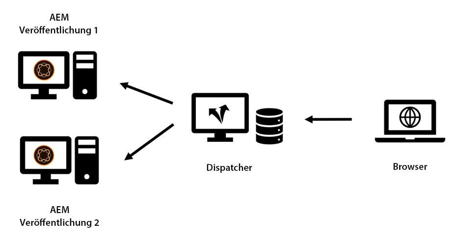
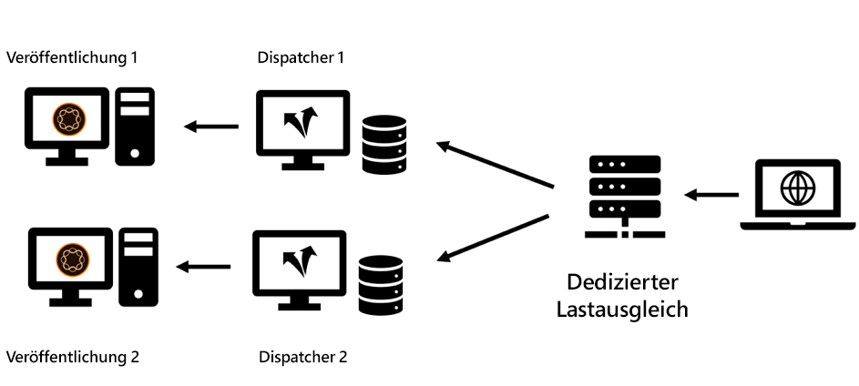
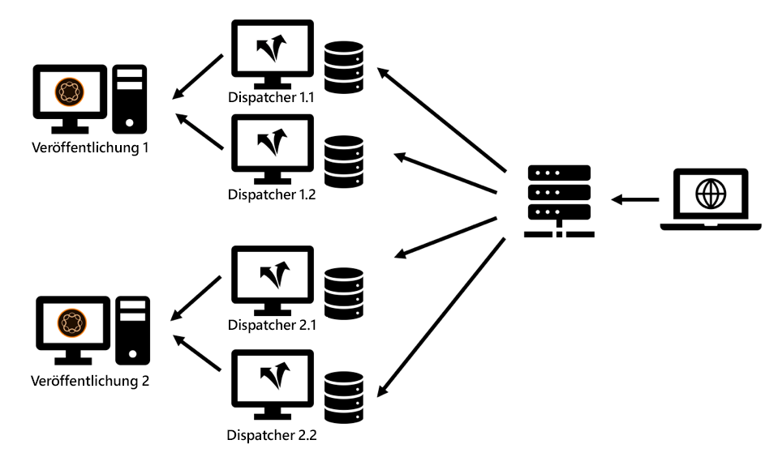
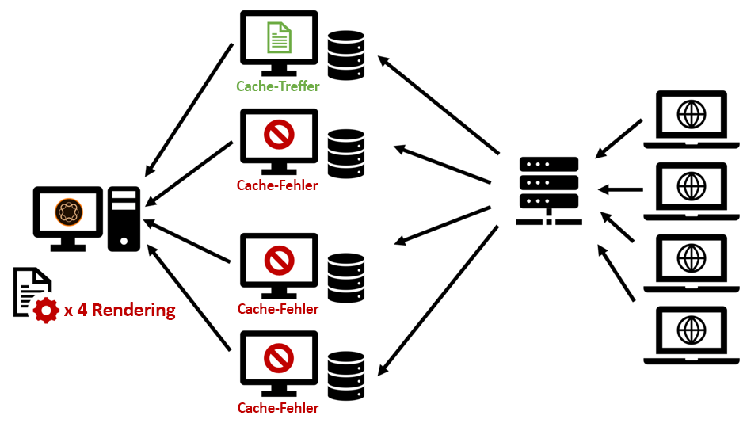
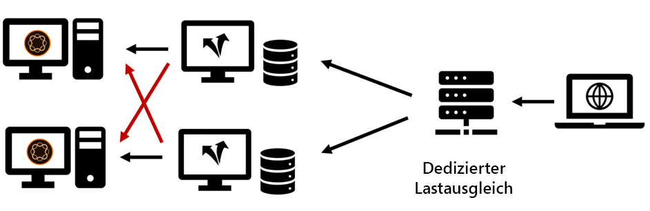

# Kapitel 2 - Infrastruktur

## Einrichten einer Cache-Infrastruktur

In Kapitel 1 dieser Serie haben wir die grundlegende Topologie eines Veröffentlichungssystems und eines Dispatchers eingeführt. Eine Reihe von Publish- und Dispatcher-Servern kann in vielen Varianten konfiguriert werden - je nach erwarteter Auslastung, der Topologie Ihres Rechenzentrums/Ihrer Rechenzentren und den gewünschten Failover-Eigenschaften.

Wir werden die gängigsten Topologien skizzieren und die Vorteile und den Ort beschreiben, an dem sie fehlen. Die Liste kann natürlich nie umfassend sein. Die einzige Grenze ist deine Fantasie.

### Die Einrichtung &quot;Veraltet&quot;

In den ersten Tagen war die Anzahl potenzieller Besucher gering, die Hardware war teuer, und Webserver wurden nicht so geschäftskritisch wie heute betrachtet. Eine häufige Einrichtung bestand darin, einen Dispatcher als Lastenausgleich und Cache vor zwei oder mehr Veröffentlichungssystemen zu verwenden. Der Apache-Server im Kern des Dispatchers war sehr stabil und - in den meisten Einstellungen - in der Lage, eine angemessene Menge an Anfragen zu bedienen.

*&quot;Legacy&quot;-Dispatcher-Setup - Nicht sehr häufig nach heutigen Standards*

  

Hier erhielt der Dispatcher seinen Namen von: Es war im Grunde, Anfragen zu senden. Dieses Setup ist nicht mehr alltäglich, da es nicht mehr den höheren Anforderungen an Leistung und Stabilität gerecht werden kann, die heute erforderlich sind.

### Mehrfache Einrichtung

Heutzutage ist eine etwas andere Topologie häufiger. Eine Multi-Leged-Topologie würde einen Dispatcher pro Veröffentlichungsserver haben. Ein spezialisierter (Hardware-) Lastenausgleich befindet sich vor der AEM Infrastruktur, die die Anforderungen an diese beiden (oder mehr) Beine sendet:

*Modernes &quot;Standard&quot;-Dispatcher-Setup - einfach zu handhaben und zu warten*

  

Die Gründe für diese Art der Einrichtung,

1. Websites dienen im Durchschnitt wesentlich mehr Traffic als bisher. Daher muss die &quot;Apache-Infrastruktur&quot;ausgebaut werden.

2. Das Setup &quot;Veraltet&quot;hat keine Redundanz auf Dispatcher-Ebene ergeben. Wenn der Apache-Server ausfällt, war die gesamte Website unerreichbar.

3. Apache-Server sind billig. Sie basieren auf Open Source und können, da Sie ein virtuelles Rechenzentrum haben, sehr schnell bereitgestellt werden.

4. Dieses Setup bietet eine einfache Möglichkeit für ein Aktualisierungsszenario mit &quot;Rollierend&quot;oder &quot;gestaffelt&quot;. Sie müssen Dispatcher 1 einfach herunterfahren, während Sie ein neues Softwarepaket auf Publish 1 installieren. Wenn die Installation abgeschlossen ist und Sie ausreichend getestet Publish 1 aus dem internen Netzwerk haben, reinigen Sie den Cache auf Dispatcher 1 und führen Sie einen neuen Beginn durch, während Sie Dispatcher 2 zur Wartung von Publish 2 herunterfahren.

5. Die Cache-Ungültigmachung wird in diesem Setup sehr einfach und deterministisch. Da nur ein Veröffentlichungssystem mit einem Dispatcher verbunden ist, kann nur ein Dispatcher ungültig gemacht werden. Reihenfolge und Zeitpunkt der Ungültigmachung sind trivial.

### Setup für &quot;Scale-Out&quot;

Apache-Server sind billig und leicht zu liefern, warum nicht ein wenig mehr auszubauen. Warum stehen nicht zwei oder mehr Dispatcher vor jedem Publish-Server?

*&quot;Scale-Out&quot;-Setup - Enthält einige Anwendungsbereiche, aber auch Einschränkungen und Einschränkungen*

  

Du kannst das unbedingt tun! Es gibt viele gültige Anwendungsszenarien für dieses Setup. Aber es gibt auch einige Einschränkungen und Komplexitäten, die Sie berücksichtigen sollten.

#### Ungültigerklärung

Jedes Veröffentlichungssystem ist mit einer Vielzahl von Dispatchern verbunden. Jedes dieser Systeme muss ungültig werden, wenn der Inhalt geändert wurde.

#### Wartung

Es versteht sich von selbst, dass die anfängliche Konfiguration der Dispatcher- und Publish-Systeme etwas komplexer ist. Denken Sie aber auch daran, dass der Aufwand einer &quot;rollierenden&quot; Version ebenfalls etwas höher ist. AEM Systeme können und müssen während der Ausführung aktualisiert werden. Aber es ist klug, dies nicht zu tun, während sie aktiv Anfragen stellen. Normalerweise möchten Sie nur einen Teil der Veröffentlichungssysteme aktualisieren - während die anderen weiterhin aktiv Traffic bereitstellen und dann - nach dem Testen - zum anderen Teil wechseln. Wenn Sie Glück haben und im Bereitstellungsprozess auf den Lastenausgleich zugreifen können, können Sie das Routing für die Server, die gewartet werden, hier deaktivieren. Wenn Sie sich auf einem freigegebenen Lastenausgleich ohne direkten Zugriff befinden, sollten Sie die Dispatcher der Veröffentlichung, die Sie aktualisieren möchten, lieber herunterfahren. Je mehr es gibt, desto mehr muss man schließen. Wenn es eine große Anzahl von Updates gibt und Sie häufige Aktualisierungen planen, wird eine gewisse Automatisierung empfohlen. Wenn Sie keine Automatisierungstools haben, ist das Ausgleichen ohnehin eine schlechte Idee.

In einem früheren Projekt haben wir einen anderen Trick verwendet, um ein Veröffentlichungssystem aus dem Lastenausgleich zu entfernen, ohne direkten Zugriff auf den Lastenausgleich selbst zu haben.

Der Lastenausgleich &quot;pings&quot;, eine bestimmte Seite, um zu sehen, ob der Server läuft. Eine triviale Wahl ist normalerweise, die Homepage zu pingen. Aber wenn Sie den Ping verwenden möchten, um den Lastenausgleich zu signalisieren, um Traffic nicht auszugleichen, würden Sie etwas Anderes wählen. Sie erstellen eine dedizierte Vorlage oder ein Servlet, das so konfiguriert werden kann, dass es mit `"up"` oder `"down"` (im Hauptteil oder als HTTP-Antwortcode) reagiert. Die Antwort auf diese Seite darf natürlich nicht im Dispatcher zwischengespeichert werden - daher wird sie immer frisch aus dem Veröffentlichungssystem abgerufen. Wenn Sie jetzt den Lastenausgleich konfigurieren, um diese Vorlage oder das Servlet zu überprüfen, können Sie einfach die Option Veröffentlichen &quot;so tun, als wäre sie ausfallen lassen. Es wäre nicht Teil des Lastenausgleichs und kann aktualisiert werden.

#### Weltweiter Vertrieb

&quot;Worldwide Distribution&quot;ist ein Setup, bei dem mehrere Dispatcher vor jedem Publishing-System stehen - jetzt weltweit verteilt, um näher an den Kunden heranzukommen und eine bessere Leistung zu erzielen. Natürlich haben Sie in diesem Szenario keinen zentralen Lastenausgleich, sondern ein DNS- und Geo-IP-basiertes Lastenausgleichsschema.

>[!NOTE]
>
>Eigentlich bauen Sie mit diesem Ansatz eine Art Content Distribution Network (CDN) auf - also sollten Sie eine standardmäßige CDN-Lösung kaufen, anstatt eine selbst zu bauen. Der Aufbau und die Pflege eines benutzerdefinierten CDN sind keine triviale Aufgabe.

#### Horizontale Skalierung

Sogar in einem lokalen Rechenzentrum gibt es eine Topologie zum Ausblenden, bei der mehrere Dispatcher vor jedem Publishing-System einige Vorteile haben. Wenn Sie Leistungsengpässe auf den Apache-Servern aufgrund von hohem Traffic (und einer guten Cache-Trefferrate) sehen und die Hardware nicht mehr skaliert werden kann (durch Hinzufügen von CPUs, RAM und schnelleren Festplatten), können Sie die Leistung steigern, indem Sie Dispatcher hinzufügen. Dies wird als &quot;horizontale Skalierung&quot;bezeichnet. Dies hat jedoch Einschränkungen - insbesondere wenn Sie häufig den Traffic ungültig machen. Wir werden den Effekt im nächsten Abschnitt beschreiben.

#### Beschränkungen der Scale Out-Topologie

Das Hinzufügen von Proxyservern sollte normalerweise die Leistung erhöhen. Es gibt jedoch Szenarien, in denen das Hinzufügen von Servern die Leistung tatsächlich verringern kann. Wie? Angenommen, Sie haben ein Nachrichtenportal, in dem Sie jede Minute neue Artikel und Seiten vorstellen. Ein Dispatcher ungültig macht durch &quot;automatische Ungültigmachung&quot;: Wenn eine Seite veröffentlicht wird, werden alle Seiten im Cache auf derselben Site ungültig gemacht. Dies ist eine nützliche Funktion - wir haben dies in [Kapitel 1](chapter-1.md) dieser Serie behandelt - aber es bedeutet auch, dass, wenn Sie häufige Änderungen auf Ihrer Website haben, Sie den Cache ziemlich oft ungültig machen. Wenn Sie nur einen Dispatcher pro Veröffentlichungsinstanz haben, wird beim ersten Besucher, der eine Seite anfordert, eine erneute Zwischenspeicherung dieser Seite Trigger. Der zweite Besucher erhält bereits die zwischengespeicherte Version.

Wenn Sie zwei Dispatcher haben, besteht beim zweiten Besucher eine Wahrscheinlichkeit von 50 %, dass die Seite nicht zwischengespeichert wird, und er würde dann eine größere Latenz erleben, wenn die Seite erneut gerendert wird. Noch mehr Dispatcher pro Veröffentlichung machen die Dinge noch schlimmer. Was passiert ist, dass der Publish-Server mehr geladen wird, weil er die Seite für jeden Dispatcher separat wiedergeben muss.

*Die Leistung wurde in einem Scale-out-Szenario mit häufigen Cache-Flush-Vorgängen verringert.*

  

#### Beheben von Problemen mit zu großer Skalierung

Sie könnten erwägen, eine zentrale freigegebene Datenspeicherung für alle Dispatcher zu verwenden oder die Dateisysteme der Apache-Server zu synchronisieren, um Probleme zu beheben. Wir können nur begrenzte Erfahrungen aus erster Hand bereitstellen, aber darauf vorbereitet sein, dass dies die Komplexität des Systems erhöht und eine neue Fehlerklasse einführen kann.

Wir haben einige Experimente mit NFS durchgeführt - aber NFS führt aufgrund der Inhaltssperrung enorme Leistungsprobleme ein. Dies hat die Gesamtleistung tatsächlich verringert.

**Schlussfolgerung** : Die Freigabe eines gemeinsamen Dateisystems für mehrere Dispatcher ist KEIN empfohlener Ansatz.

Wenn Sie Leistungsprobleme haben, sollten Sie Publish und Dispatcher gleichermaßen hochskalieren, um maximale Auslastung bei den Publisher-Instanzen zu vermeiden. Es gibt keine goldene Regel über das Verhältnis Publish / Dispatcher - es hängt in hohem Maße von der Verteilung der Anforderungen und der Häufigkeit von Veröffentlichungen und Cache-Ungültigkeiten ab.

Wenn Sie auch Bedenken hinsichtlich der Latenz haben, die ein Besucher aufweist, sollten Sie die Verwendung eines Content Versand-Netzwerks, eine erneute Zwischenspeicherung, eine präventive Cacheerwärmung und eine Übergangsphase wie in [Kapitel 1](chapter-1.md) dieser Serie beschrieben festlegen oder auf einige erweiterte Ideen von [Teil 3](chapter-3.md) verweisen.

### Einrichtung &quot;Cross Connected&quot;

Ein weiteres Setup, das wir jetzt und da gesehen haben, ist das &quot;vernetzte&quot; Setup: Die Veröffentlichungsinstanzen verfügen nicht über dedizierte Dispatcher, aber alle Dispatcher sind mit allen Veröffentlichungssystemen verbunden.

  

*Vernetzte Topologie: Erhöhte Redundanz und Komplexität.*

Auf den ersten Blick bietet dies etwas mehr Redundanz für einen relativ kleinen Haushalt. Wenn einer der Apache-Server ausfällt, können Sie weiterhin zwei Veröffentlichungssysteme verwenden, die die Wiedergabe durchführen. Wenn eines der Veröffentlichungssysteme abstürzt, haben Sie weiterhin zwei Dispatcher, die das zwischengespeicherte Laden bereitstellen.

Das ist jedoch mit einem Preis verbunden.

Erstens ist es ziemlich schwerfällig, ein Bein für die Instandhaltung zu nehmen. Genau dafür wurde diese Regelung konzipiert; mehr Widerstandskraft zu haben und mit allen Mitteln am Laufen zu bleiben. Wir haben komplizierte Instandhaltungspläne gesehen, wie wir damit umgehen. Konfigurieren Sie zunächst den Dispatcher 2 neu und entfernen Sie die Querverbindung. Neustart von Dispatcher 2. Herunterfahren von Dispatcher 1, Aktualisieren von Publish 1, ... usw. Du solltest sorgfältig überlegen, ob das auf mehr als zwei Beine skaliert wird. Sie werden zu dem Schluss kommen, dass es tatsächlich die Komplexität und die Kosten erhöht und eine gewaltige Quelle menschlichen Versagens darstellt. Es wäre am besten, dies zu automatisieren. Überprüfen Sie also besser, ob Sie tatsächlich über die nötigen Humanressourcen verfügen, um diese Automatisierungs-Aufgabe in Ihren Projektplan aufzunehmen. Dies spart Ihnen zwar einige Hardwarekosten, Sie können aber auch Dublette für IT-Mitarbeiter ausgeben.

Zweitens können Sie auf dem AEM einige Benutzeranwendungen ausführen, für die eine Anmeldung erforderlich ist. Sie verwenden fixierbare Sitzungen, um sicherzustellen, dass ein Benutzer immer von derselben AEM bereitgestellt wird, damit Sie den Sitzungsstatus in dieser Instanz beibehalten können. Wenn Sie diese vernetzte Einrichtung haben, müssen Sie sicherstellen, dass fixierbare Sitzungen auf dem Lastenausgleich und auf den Dispatchern ordnungsgemäß funktionieren. Nicht unmöglich - aber Sie müssen sich dessen bewusst sein und einige zusätzliche Konfigurations- und Testzeiten hinzufügen, die - wieder - die Einsparungen, die Sie geplant hatten, durch das Speichern der Hardware erhöhen könnten.

### Zusammenfassung

Wir raten nicht davon ab, dieses Cross-Connect-Schema als Standardoption zu verwenden. Wenn Sie sich jedoch entscheiden, es zu verwenden, sollten Sie Risiken und versteckte Kosten sorgfältig bewerten und planen, die Konfigurationsautomatisierung in Ihr Projekt einzubeziehen.

## Nächster Schritt

* [3 - Themen des erweiterten Zwischenspeichers](chapter-3.md)
