# Kapitel 3 - Themen der erweiterten Zwischenspeicherung

*&quot;In der Informatik gibt es nur zwei schwierige Dinge: Cache-Ungültigmachen und Benennen von Elementen.&quot;*

— PHIL KARLTON

## Überblick

Dies ist Teil 3 einer Dreierreihe zum Zwischenspeichern in AEM. Wo die ersten beiden Teile sich auf die einfache HTTP-Zwischenspeicherung im Dispatcher und welche Einschränkungen es gibt. In diesem Teil werden einige Ideen diskutiert, wie diese Einschränkungen überwunden werden können.

## Zwischenspeicherung im Allgemeinen

[Kapitel 1](chapter-1.md) und  [Kapitel 2](chapter-2.md) dieser Serie konzentrierten sich hauptsächlich auf den Dispatcher. Wir haben die Grundlagen, die Einschränkungen und die Bedingungen erläutert, in denen Sie bestimmte Kompromisse eingehen müssen.

Die Komplexität und Komplexität der Zwischenspeicherung sind keine Probleme, die sich nur auf den Dispatcher beziehen. Zwischenspeichern ist im Allgemeinen schwierig.

Der Dispatcher als einziges Werkzeug in Ihrer Toolbox zu haben, wäre tatsächlich eine echte Einschränkung.

In diesem Kapitel wollen wir unsere Ansicht zum Zwischenspeichern weiter ausbauen und einige Ideen entwickeln, wie man einige der Mängel des Dispatchers überwinden kann. Es gibt keine Silberkugel - Sie müssen Kompromisse in Ihrem Projekt machen. Denken Sie daran, dass mit der Genauigkeit von Zwischenspeicherung und Ungültigmachung immer Komplexität kommt, und mit der Komplexität kommt die Möglichkeit von Fehlern.

Sie müssen in diesen Bereichen Kompromisse eingehen,

* Leistung und Latenz
* Ressourcenverbrauch/CPU-Auslastung/Festplattenauslastung
* Genauigkeit/Währung/Stille/Sicherheit
* Einfachheit/Komplexität/Kosten/Betreubarkeit/Fehleraussagekraft

Diese Dimensionen sind in einem ziemlich komplexen System miteinander verknüpft. Es gibt kein einfaches if-this-then-that. Ein System zu vereinfachen kann es schneller oder langsamer machen. Es kann Ihre Entwicklungskosten senken, aber die Kosten am Helpdesk erhöhen, z.B. wenn Kunden veraltete Inhalte sehen oder sich über eine langsame Website beschweren. All diese Faktoren müssen berücksichtigt und gegeneinander abgewogen werden. Aber jetzt sollten Sie schon eine gute Idee haben, dass es keine Wunderwaffe oder eine einzige &quot;Best Practice&quot; gibt - nur eine Menge schlechter Praktiken und einige gute.

## Verkettete Zwischenspeicherung

### Überblick

#### Datenfluss

Die Bereitstellung einer Seite von einem Server zum Browser eines Clients erfolgt über eine Vielzahl von Systemen und Teilsystemen. Wenn Sie genau hinschauen, müssen einige Hopfendaten von der Quelle bis zum Abfluss mitgenommen werden, wobei jeder ein potenzieller Zwischenspeicherungskandidat ist.

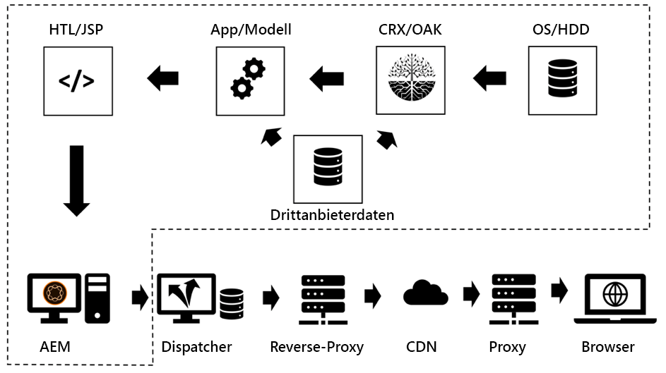

*Datenfluss einer typischen CMS-Anwendung*

<br> 

Lassen Sie uns unsere Journey mit einem Datenelement auf einer Festplatte Beginn machen, das in einem Browser angezeigt werden muss.

#### Hardware und Betriebssystem

Erstens hat das Festplattenlaufwerk (HDD) selbst einen eingebauten Cache in der Hardware. Zweitens verwendet das Betriebssystem, das die Festplatte einbindet, freien Speicher, um häufig aufgerufene Blöcke im Cache zu speichern, um den Zugriff zu beschleunigen.

#### Content-Repository

Die nächste Ebene ist die CRX oder Oak - die von AEM verwendete Dokument-Datenbank. CRX und Oak unterteilen die Daten in Segmente, die im Arbeitsspeicher zwischengespeichert werden können, und vermeiden einen langsameren Zugriff auf die Festplatte.

#### Drittanbieter-Daten

Bei den meisten größeren Webinstallationen stehen auch Daten von Drittanbietern zur Verfügung. Daten aus einem Produktinformationssystem, einem Kundenbeziehungsmanagementsystem, einer Legacy-Datenbank oder einem anderen beliebigen Webdienst. Diese Daten müssen nicht bei Bedarf aus der Quelle entnommen werden - insbesondere nicht, wenn eine Änderung nicht allzu häufig erfolgt. Es kann also zwischengespeichert werden, wenn es nicht in der CRX-Datenbank synchronisiert wird.

#### Business Layer - App/Modell

Normalerweise rendern Ihre Vorlagenskripte nicht den Rohinhalt, der von CRX stammt, über die JCR-API. Wahrscheinlich haben Sie eine Geschäftsebene dazwischen, die Daten in einem Geschäftsdomänenobjekt zusammenführt, berechnet und/oder transformiert. Ratet mal, was - wenn diese Vorgänge teuer sind, sollten Sie sie zwischenspeichern.

#### Markierungsfragmente

Das Modell ist jetzt die Grundlage für das Rendering des Markups für eine Komponente. Warum sollte das gerenderte Modell nicht auch zwischengespeichert werden?

#### Dispatcher, CDN und andere Proxys

Aus wird die gerenderte HTML-Seite an den Dispatcher gesendet. Wir haben bereits diskutiert, dass der Hauptzweck des Dispatcher ist, HTML-Seiten und andere Web-Ressourcen (trotz seines Namens) zwischenspeichern. Bevor die Ressourcen den Browser erreichen, wird möglicherweise ein Reverse-Proxy übergeben, der zwischengespeichert werden kann und einen CDN enthält, der auch für die Zwischenspeicherung verwendet wird. Der Client kann in einem Büro sitzen, das nur über einen Proxy Web-Zugriff gewährt - und dieser Proxy beschließt möglicherweise, auch den Datenverkehr zu speichern.

#### Browser-Cache

Nicht zuletzt - auch der Browser zwischenspeichert. Dies ist ein leicht zu übersehener Vermögenswert. Aber es ist der nächste und schnellste Cache, den Sie in der Cache-Kette haben. Leider - es wird nicht zwischen Benutzern geteilt - aber immer noch zwischen verschiedenen Anforderungen eines Benutzers.

### Zwischenspeichern und Warum

Das ist eine lange Kette potenzieller Zwischenspeicher. Und wir alle haben es mit Problemen zu tun, bei denen wir veraltete Inhalte gesehen haben. Aber wenn man berücksichtigt, wie viele Etappen es gibt, ist es ein Wunder, dass es meistens überhaupt funktioniert.

Aber wo in dieser Kette macht es Sinn, Cache zu machen? Am Anfang? Am Ende? Überall? Es kommt darauf an... und es hängt von einer Vielzahl von Faktoren ab. Selbst zwei Ressourcen auf der gleichen Website könnten eine andere Antwort auf diese Frage wünschen.

Um Ihnen eine grobe Vorstellung davon zu geben, welche Faktoren Sie berücksichtigen könnten,

**Zeit zum Leben** : Wenn Objekte eine kurze inhärente Live-Zeit haben (Traffic-Daten können kürzer sein als Wetterdaten), lohnt es sich möglicherweise nicht, zwischengespeichert zu werden.

**Produktionskosten -** Wie teuer ist (im Hinblick auf CPU-Zyklen und I/O) die Reproduktion und der Versand eines Objekts. Wenn es billige Zwischenspeicherung ist, ist möglicherweise nicht nötig.

**Größe** : Große Objekte benötigen mehr Ressourcen zum Zwischenspeichern. Das könnte ein begrenzender Faktor sein und muss gegen den Nutzen abgewogen werden.

**Zugriffshäufigkeit** : Wenn selten auf Objekte zugegriffen wird, ist die Zwischenspeicherung möglicherweise nicht wirksam. Sie würden einfach statisch oder ungültig werden, bevor sie zum zweiten Mal aus dem Cache abgerufen werden. Solche Elemente würden lediglich Speicherressourcen blockieren.

**Freigegebener Zugriff** : Daten, die von mehr als einer Entität verwendet werden, sollten weiter oben in der Kette zwischengespeichert werden. Tatsächlich ist die Cachekette keine Kette, sondern ein Baum. Ein Datenelement im Repository kann von mehr als einem Modell verwendet werden. Diese Modelle können wiederum von mehr als einem Render-Skript verwendet werden, um HTML-Fragmente zu generieren. Diese Fragmente sind auf mehreren Seiten enthalten, die mit ihren privaten Caches im Browser an mehrere Benutzer verteilt werden. &quot;Teilen&quot; bedeutet also nicht, dass man nur zwischen Leuten und nicht zwischen Softwareteilen teilt. Wenn Sie einen potenziellen &quot;gemeinsamen&quot; Cache finden möchten, verfolgen Sie einfach den Baum zum Stamm zurück und finden Sie einen gemeinsamen Vorfahren - dort sollten Sie zwischenspeichern.

**Geodatenverteilung** : Wenn Ihre Benutzer über die ganze Welt verteilt sind, kann die Verwendung eines verteilten Cache-Netzwerks dazu beitragen, Latenzzeiten zu reduzieren.

**Netzwerkbandbreite und -Latenz**  - Vorstellung von Latenzzeit, wer sind Ihre Kunden und welche Art von Netzwerk verwenden sie? Vielleicht sind Ihre Kunden mobile Kunden in einem unterentwickelten Land, das 3G-Verbindungen von Smartphones der älteren Generation verwendet? Erwägen Sie, kleinere Objekte zu erstellen und sie im Browser-Cache zu zwischenspeichern.

Diese Liste ist bei weitem nicht umfassend, aber wir glauben, dass Sie jetzt die Idee bekommen.

### Grundlegende Regeln für das Verketten von Zwischenspeichern

Wieder - Zwischenspeicherung ist schwierig. Lassen Sie uns einige Grundregeln teilen, die wir aus früheren Projekten extrahiert haben, die Ihnen helfen können, Probleme in Ihrem Projekt zu vermeiden.

#### Vermeiden von Dublette-Caching

Jede im letzten Kapitel eingeführte Ebene bietet einen Wert in der Cache-Kette. Entweder durch Einsparen von Rechenzyklen oder durch Annäherung der Daten an den Verbraucher. Es ist nicht falsch, ein Datenelement in mehreren Stufen der Kette zu zwischenspeichern, aber man sollte immer bedenken, was der Nutzen und die Kosten der nächsten Phase sind. Das Zwischenspeichern einer vollständigen Seite im Veröffentlichungssystem bietet in der Regel keinen Vorteil - wie dies bereits im Dispatcher geschieht.

#### Mischen von Invalidierungsstrategien

Es gibt drei grundlegende Invalidierungsstrategien:

* **TTL, Time to Live:** Ein Objekt läuft nach einem bestimmten Zeitraum ab (z. B. &quot;2 Stunden von jetzt&quot;)
* **Ablaufdatum:** Das Objekt läuft zu einem festgelegten Zeitpunkt in der Zukunft ab (z. B. &quot;10. Juni 2019, 17.00 Uhr&quot;)
* **Ereignis:** Das Objekt wird explizit durch ein Ereignis ungültig gemacht, das auf der Plattform aufgetreten ist (z. B. wenn eine Seite geändert und aktiviert wurde)

Jetzt können Sie verschiedene Strategien auf verschiedenen Cache-Ebenen verwenden, aber es gibt einige &quot;giftige&quot;.

#### Ereignis-basierte Ungültigerklärung

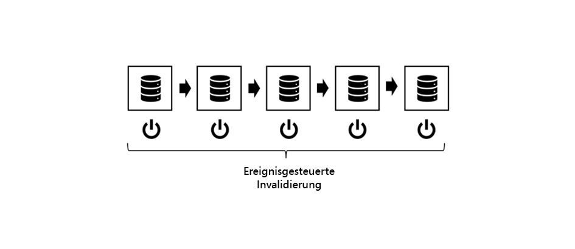

*Ereignis-basierte Ungültigmachung: Ungültig vom inneren Cache zur äußeren Ebene*

<br> 

Eine reine Ereignis-basierte Ungültigmachung ist die einfachste zu verstehen, am einfachsten, theoretisch richtig und am genauesten zu bekommen.

Einfach ausgedrückt werden die Zwischenspeicher nach der Objektänderung für ungültig erklärt.

Sie müssen nur eine Regel beachten:

Immer von innen bis außen ungültig machen. Wenn Sie zuerst einen äußeren Cache ungültig gemacht haben, wird möglicherweise statischer Inhalt von einem inneren erneut zwischengespeichert. Machen Sie keine Annahmen, wann ein Cache wieder neu ist - stellen Sie sicher. Am besten durch Auslösen der Ungültigmachung des äußeren Cache _nach der Ungültigmachung des inneren Cache_.

Das ist die Theorie. Aber in der Praxis gibt es eine Reihe von Problemen. Die Ereignis müssen verteilt werden - potenziell über ein Netzwerk. In der Praxis ist es daher am schwierigsten, das System der Ungültigmachung anzuwenden.

#### Auto - Reparatur

Bei Ereignis-basierter Ungültigmachung sollten Sie einen Notfallplan haben. Was geschieht, wenn ein Ereignis zur Ungültigmachung verpasst wird? Eine einfache Strategie könnte darin bestehen, nach einer bestimmten Zeit ungültig zu machen oder zu bereinigen. Also - Sie haben vielleicht dieses Ereignis verpasst und jetzt veralteten Inhalt servieren. Aber Ihre Objekte haben auch eine implizite TTL von mehreren Stunden (Tage) nur. Schließlich heilt sich das System selbst.

#### Reine TTL-basierte Ungültigmachung

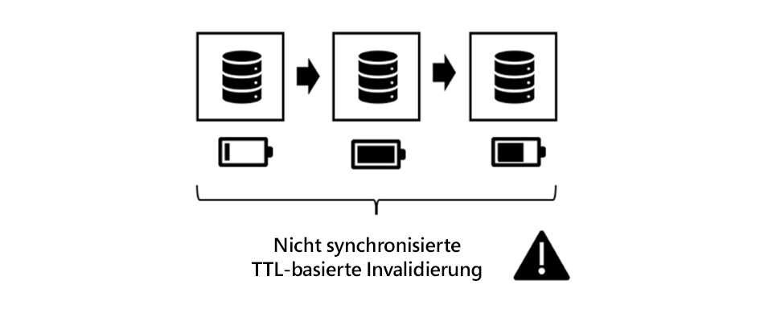

*Nicht synchronisierte TTL-basierte Ungültigmachung*

<br> 

Das ist auch ein ganz gewöhnliches System. Sie stapeln mehrere Ebenen mit Zwischenspeichern, von denen jede für einen bestimmten Zeitraum für ein Objekt zuständig ist.

Es ist leicht zu implementieren. Leider ist es schwer, die effektive Lebensdauer eines Datenmaterials vorherzusagen.

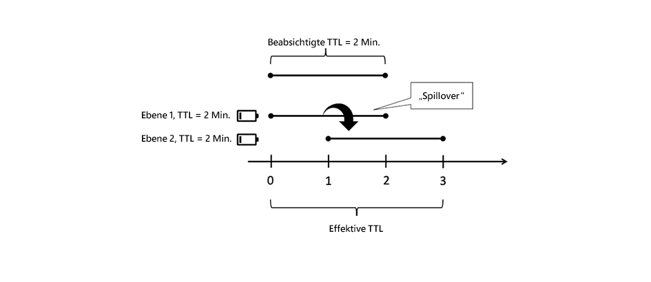

*Externer Cache verlängert die Lebensdauer eines inneren Objekts*

<br> 

Betrachten Sie die Abbildung oben. Jede Zwischenspeicherebene führt eine TTL von 2 Min. ein. Nun - die gesamte TTL muss auch 2 Min. Nicht ganz. Wenn die äußere Ebene das Objekt kurz vor dem Anhalten abruft, verlängert die äußere Schicht die effektive Livedauer des Objekts. Die effektive Live-Zeit kann in diesem Fall zwischen 2 und 4 Minuten betragen. Nehmen wir an, Sie haben mit Ihrer Geschäftsabteilung abgestimmt, eines Tages ist tolerierbar - und Sie haben vier Schichten von Caches. Die eigentliche TTL auf jeder Ebene darf nicht länger als sechs Stunden sein... die Cache-Abwesenheitsrate erhöhen...

Wir sagen nicht, dass es ein schlechtes Schema ist. Du solltest nur seine Grenzen kennen. Und es ist eine nette und einfache Strategie, mit der man Beginn machen kann. Nur wenn der Traffic Ihrer Site zunimmt, sollten Sie eine genauere Strategie in Betracht ziehen.

*Synchronisieren der Ungültigkeitszeit durch Festlegen eines bestimmten Datums*

#### Ungültigerklärung aufgrund des Ablaufdatums

Sie erhalten eine besser vorhersehbare effektive Lebensdauer, wenn Sie ein bestimmtes Datum für das innere Objekt festlegen und es an die äußeren Zwischenspeicher übertragen.

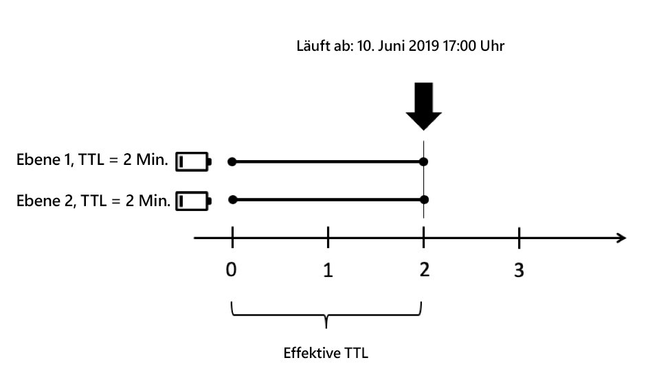

*Synchronisieren der Ablaufdaten*

<br> 

Es sind jedoch nicht alle Zwischenspeicher in der Lage, die Daten zu übertragen. Und es kann schlimm werden, wenn der äußere Cache zwei innere Objekte mit unterschiedlichen Ablaufdaten Aggregat.

#### Mischen der Ereignis- und TTL-basierten Ungültigmachung

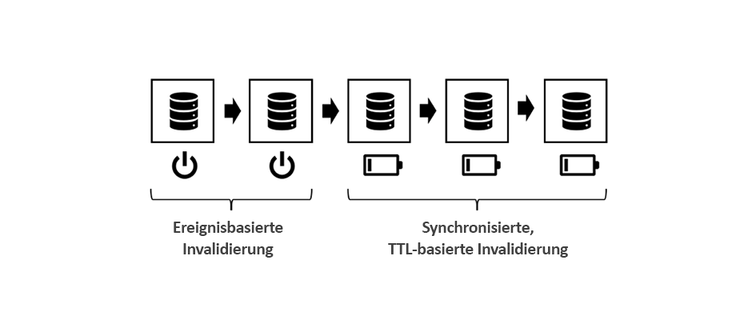

*Mischen von Ereignis- und TTL-basierten Strategien*

<br> 

Ein gemeinsames Schema in der AEM ist die Verwendung von Ereignis-basierter Ungültigmachung bei inneren Zwischenspeichern (z. B. im Speicher befindliche Zwischenspeicher, in denen Ereignis in Echtzeit verarbeitet werden können) und TTL-basierten Zwischenspeichern auf der Außenseite - wo Sie vielleicht keinen Zugriff auf explizite Ungültigmachung haben.

In der AEM Welt würden Sie über einen Arbeitsspeichercache für Geschäftsobjekte und HTML-Fragmente in den Veröffentlichungssystemen verfügen, der ungültig ist, wenn sich die zugrunde liegenden Ressourcen ändern und Sie dieses Ereignis an den Dispatcher weiterleiten, der auch Ereignis-basiert funktioniert. Davor hätten Sie zum Beispiel eine TTL-basierte CDN.

Eine Ebene mit (kurzen) TTL-basierter Zwischenspeicherung vor einem Dispatcher könnte eine Spitze, die normalerweise nach einer automatischen Ungültigmachung auftreten würde, effektiv dämpfen.

#### Mischen der TTL - und Ereignis-basierten Ungültigmachung

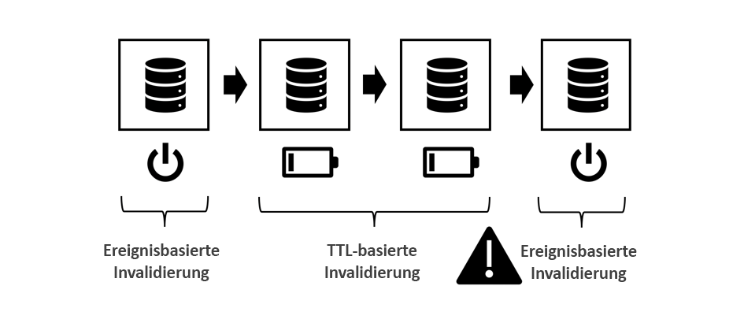

*Toxisch: Mischen von TTL - und Ereignis-basierter Invalidierung*

<br> 

Diese Kombination ist toxisch. Platzieren und Ereignis-basierter Cache nie nach einer TTL- oder Ablaufbasierten Zwischenspeicherung. Erinnern Sie sich an den Spill-Over-Effekt, den wir in der &quot;pure-TTL&quot; Strategie hatten? Dieselbe Wirkung kann hier beobachtet werden. Nur dass das Ungültigmachen-Ereignis des äußeren Cache bereits passiert ist, könnte nicht wieder passieren - jemals kann dies die Lebensdauer Ihres zwischengespeicherten Objekts auf unendlich erweitern.

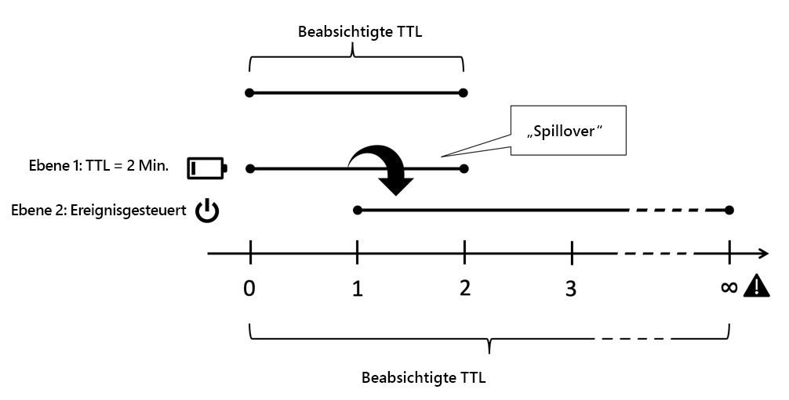

*Kombination aus TTL und Ereignis: Spillover bis unendlich*

<br> 

## Partielles Zwischenspeichern und Zwischenspeichern im Arbeitsspeicher

Sie können mit der Phase des Rendervorgangs verbinden, um Zwischenspeicherebenen hinzuzufügen. Vom Abrufen von Remotedatenübertragungsobjekten oder Erstellen lokaler Geschäftsobjekte bis zum Zwischenspeichern des gerenderten Markups einer einzelnen Komponente. Wir werden konkrete Implementierungen einem späteren Tutorial überlassen. Aber vielleicht haben Sie bereits einige dieser Zwischenspeicherebenen selbst implementiert. Das Mindeste, was wir hier tun können, ist die Einführung der Grundprinzipien - und Gottes.

### Warnwörter

#### Zugriffskontrolle respektieren

Die hier beschriebenen Techniken sind recht leistungsstark und ein _must-have_ in jeder AEM Developer&#39;s Toolbox. Aber seien Sie nicht zu aufgeregt, benutzen Sie sie weise. Wenn Sie ein Objekt in einem Cache speichern und es in Folgeanforderungen an andere Benutzer freigeben, bedeutet dies in der Tat, die Zugriffskontrolle zu umgehen. Dies ist normalerweise kein Problem auf öffentlich zugänglichen Websites, kann aber sein, wenn sich ein Benutzer anmelden muss, bevor er Zugriff erhält.

Beachten Sie, dass Sie das HTML-Markup eines Site-Hauptmenüs in einem Arbeitsspeichercache speichern, um es zwischen verschiedenen Seiten freizugeben. Das ist eigentlich ein perfektes Beispiel für die Speicherung von teilweise gerendertem HTML, da die Erstellung einer Navigation normalerweise teuer ist, da sie viele Seiten durchlaufen muss.

Sie haben nicht dieselbe Menüstruktur für alle Seiten, sondern auch für alle Benutzer freigegeben, wodurch diese noch effizienter wird. Aber warten Sie... aber es gibt einige Elemente im Menü, die nur für eine bestimmte Benutzergruppe reserviert sind. In diesem Fall kann die Zwischenspeicherung etwas komplexer werden.

#### Nur benutzerdefinierte Geschäftsobjekte zwischenspeichern

Wenn überhaupt - das ist die wichtigste Beratung, können wir Ihnen Folgendes geben:

>[!WARNING]
>
>Nur Cache-Objekte, die Ihnen gehören, die unveränderlich sind, die Sie selbst erstellt haben, die flach sind und keine ausgehende Referenz haben.

Was bedeutet das?

1. Man weiß nicht, welchen Lebenszyklus andere Objekte haben sollen. Bedenken Sie, dass Sie einen Verweis auf ein Anforderungsobjekt verweigern und es zwischenspeichern möchten. Jetzt ist die Anforderung beendet und der Servlet-Container möchte dieses Objekt für die nächste eingehende Anforderung wiederverwenden. In diesem Fall ändert jemand anderes den Inhalt, von dem Sie dachten, dass Sie exklusive Kontrolle über ihn hätten. Entlassen Sie das nicht - So etwas haben wir in einem Projekt gesehen. Der Kunde sah anstelle seiner eigenen Daten andere Kundendaten.

2. Solange ein Objekt von einer Kette anderer Verweise referenziert wird, kann es nicht aus dem Heap entfernt werden. Wenn Sie ein angeblich kleines Objekt in Ihrem Cache behalten, das referenziert, sagen wir eine 4 MB Darstellung eines Bildes, haben Sie eine gute Chance, Probleme mit undichtem Speicher zu bekommen. Caches sollten auf schwachen Referenzen basieren. Aber - schwache Referenzen funktionieren nicht wie erwartet. Das ist die absolut beste Methode, einen Speicherleck zu erzeugen und in einem Fehler zu enden, der nicht genügend Arbeitsspeicher hat. Und - Sie wissen nicht, wie groß die Größe der Erinnerung an fremde Objekte ist, richtig?

3. Vor allem in Sling können Sie (fast) jedes Objekt einander anpassen. Nehmen Sie an, Sie legen eine Ressource in den Cache. Die nächste Anforderung (mit unterschiedlichen Zugriffsrechten) ruft diese Ressource ab und passt sie in einen resourceResolver- oder eine Sitzung an, um auf andere Ressourcen zuzugreifen, auf die er keinen Zugriff hätte.

4. Auch wenn Sie einen dünnen &quot;Wrapper&quot;um eine Ressource aus AEM erstellen, dürfen Sie dies nicht zwischenspeichern - auch wenn es sich um Ihre eigene und unveränderliche. Das umschlossene Objekt wäre ein Verweis (den wir vorher verbieten), und wenn wir scharf aussehen, schafft das im Grunde dieselben Probleme wie im letzten Artikel beschrieben.

5. Wenn Sie zwischenspeichern möchten, erstellen Sie Ihre eigenen Objekte, indem Sie Grunddaten in Ihre eigenen shallo-Objekte kopieren. Möglicherweise möchten Sie eine Verknüpfung zwischen Ihren eigenen Objekten anhand von Verweisen herstellen, z. B. eine Struktur von Objekten zwischenspeichern. Das ist in Ordnung - aber nur Cache-Objekte, die Sie gerade in der gleichen Anforderung erstellt haben - und keine Objekte, die von einem anderen angefordert wurden (auch wenn es sich um den Namensraum Ihres Objekts handelt). _Das Kopieren von_ Objekten ist der Schlüssel. Achten Sie darauf, die gesamte Struktur der verknüpften Objekte auf einmal zu bereinigen und eingehende und ausgehende Verweise auf Ihre Struktur zu vermeiden.

6. Ja - und behalten Sie Ihre Objekte unverändert bei. Private Eigenschaften, nur und keine Setter.

Das sind viele Regeln, aber es lohnt sich, ihnen zu folgen. Auch wenn Sie erfahren und super intelligent sind und alles unter Kontrolle haben. Der junge Kollege in Ihrem Projekt hat gerade seinen Universitätsabschluss gemacht. Er kennt nicht alle diese Fallstricke. Wenn es keine Fallstricke gibt, gibt es nichts zu vermeiden. Halten Sie es einfach und verständlich.

### Werkzeuge und Bibliotheken

In dieser Reihe geht es darum, Konzepte zu verstehen und Sie zu befähigen, eine Architektur zu entwickeln, die am besten zu Ihrem Anwendungsfall passt.

Insbesondere fördern wir kein Instrument. Aber geben Sie Ihnen Hinweise, wie Sie sie bewerten können. Beispielsweise verfügt AEM seit Version 6.0 über einen einfachen integrierten Cache mit einer festen TTL. Sollen Sie es benutzen? Wahrscheinlich nicht bei der Veröffentlichung, wenn ein Ereignis-basierter Cache in der Kette folgt (Hinweis: Dispatcher). Aber es könnte eine anständige Wahl für einen Autor sein. Es gibt auch einen HTTP-Cache nach Adobe-ACS-Commons, der es wert sein könnte, beachtet zu werden.

Oder Sie erstellen Ihre eigene, basierend auf einem ausgereiften Cache-Framework wie [Ehcache](https://www.ehcache.org). Auf diese Weise können Java-Objekte und gerenderte Markup-Objekte (`String`-Objekte) zwischengespeichert werden.

In einigen einfachen Fällen können Sie auch mit der Verwendung von gleichzeitigen Hash-Karten auskommen - hier werden Sie schnell Grenzen sehen - entweder im Tool oder in Ihren Fähigkeiten. Die Gleichzeitigkeit ist so schwer Übergeordnet wie Benennung und Zwischenspeicherung.

#### Verweise

* [ACS Commons http Cache  ](https://adobe-consulting-services.github.io/acs-aem-commons/features/http-cache/index.html)
* [Cache-Cache-Framework](https://www.ehcache.org)

### Grundlegende Begriffe

Wir werden hier nicht zu tief in die Zwischenspeicherungstheorie gehen, aber wir fühlen uns verpflichtet, ein paar Schlagwörter bereitzustellen, damit Sie einen guten Sprung Beginn haben.

#### Cache-Bereitstellung

Wir haben viel über Invalidierung und Säuberung gesprochen. _Cache-_ Entfernung bezieht sich auf folgende Begriffe: Nach einem Eintrag wird er entfernt, ist er nicht mehr verfügbar. Eine Entfernung erfolgt jedoch nicht, wenn ein Eintrag veraltet ist, sondern wenn der Cache voll ist. Neuere oder &quot;wichtigere&quot;Elemente führen ältere oder weniger wichtige Elemente aus dem Cache. Welche Einträge Sie opfern müssen, ist eine Einzelfallentscheidung. Vielleicht möchten Sie die ältesten oder diejenigen, die sehr selten oder zuletzt aufgerufen wurden, vertreiben.

#### Preemptive Caching

Preemptive Caching bedeutet, den Eintrag mit frischem Inhalt neu zu erstellen, sobald er ungültig oder veraltet ist. Natürlich - Sie würden das nur mit wenigen Ressourcen tun, die Sie sicher sind, häufig und sofort aufgerufen werden. Andernfalls verschwenden Sie Ressourcen beim Erstellen von Cache-Einträgen, die möglicherweise nie angefordert werden. Wenn Sie Cacheeinträge vorausschauend erstellen, können Sie die Latenz der ersten Anforderung nach dem Ungültigmachen des Cache auf eine Ressource reduzieren.

#### Cache-Erwärmung

Die Cache-Erwärmung steht in engem Zusammenhang mit der präventiven Zwischenspeicherung. Obwohl man diesen Begriff nicht für ein Live-System verwenden würde. Und sie ist weniger zeitgebunden als Erstere. Die Zwischenspeicherung erfolgt nicht unmittelbar nach der Ungültigmachung, sondern nach und nach, wenn die Zeit dies zulässt.

Beispielsweise nehmen Sie eine Seite &quot;Veröffentlichen/Dispatcher&quot;aus dem Lastenausgleich heraus, um sie zu aktualisieren. Bevor Sie sie erneut integrieren, durchsuchen Sie automatisch die am häufigsten aufgerufenen Seiten, um sie erneut in den Cache zu laden. Wenn der Cache &quot;warm&quot; ist - ausreichend gefüllt, integrieren Sie das Bein wieder in den Lastenausgleich.

Oder vielleicht integrieren Sie das Bein auf einmal, aber Sie drosseln den Verkehr zu diesem Bein, sodass es die Chance hat, die Zwischenräume regelmäßig zu erwärmen.

Oder Sie möchten auch einige weniger häufig aufgerufene Seiten zwischenspeichern, wenn Ihr System untätig ist, um die Latenz zu verringern, wenn sie tatsächlich von echten Anforderungen aufgerufen werden.

#### Cache-Objekt-Identität, Nutzlast, Ungültigkeits-Abhängigkeit und TTL

Im Allgemeinen hat ein zwischengespeichertes Objekt oder &quot;Eintrag&quot;fünf Haupteigenschaften,

#### Schlüssel

Diese Identität ist die Eigenschaft, mit der Sie identifizieren und Objekte erstellen. Entweder um seine Nutzlast abzurufen oder um sie aus dem Cache zu leeren. Der Dispatcher verwendet beispielsweise die URL einer Seite als Schlüssel. Beachten Sie, dass der Dispatcher die Pfade der Seiten nicht verwendet. Dies reicht nicht aus, um unterschiedliche Renderings voneinander zu unterscheiden. Andere Caches verwenden möglicherweise unterschiedliche Schlüssel. Wir werden später einige Beispiele sehen.

#### Wert/Nutzlast

Das ist die Schatztruhe des Objekts, die Daten, die Sie abrufen möchten. Im Falle des Dispatchers ist es der Dateiinhalt. Es kann aber auch eine Java-Objektstruktur sein.

#### TTL

Wir haben die TTL bereits abgedeckt. Der Zeitraum, nach dem eine Einsendung als veraltet gilt und nicht länger geliefert werden sollte.

#### Abhängigkeit

Dies bezieht sich auf eine Ereignis-basierte Ungültigmachung. Welche Originaldaten sind von diesem Objekt abhängig? In Teil I haben wir bereits gesagt, dass eine echte und genaue Abhängigkeitsverfolgung zu komplex ist. Aber mit unserem Wissen über das System können Sie die Abhängigkeiten mit einem einfacheren Modell annähern. Wir machen genügend Objekte ungültig, um statische Inhalte zu löschen... und vielleicht versehentlich mehr, als nötig wäre. Aber dennoch versuchen wir, unter &quot;alles bereinigen&quot; zu bleiben.

Welche Objekte hängen davon ab, was andere in jeder einzelnen Anwendung echt sind. Wir werden Ihnen später einige Beispiele zur Umsetzung einer Abhängigkeitsstrategie geben.

### HTML-Fragmentzwischenspeicherung

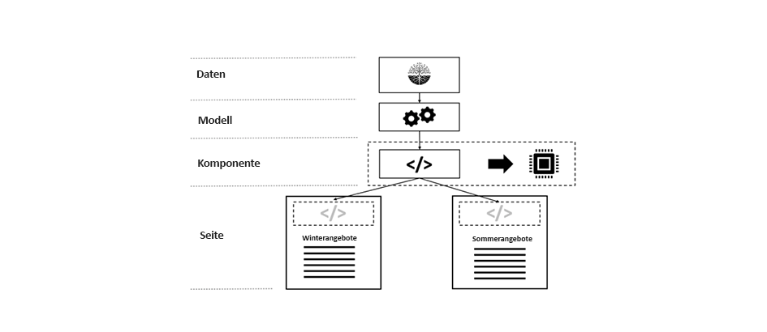

*Wiederverwenden eines gerenderten Fragments auf verschiedenen Seiten*

<br> 

Die HTML-Fragmentzwischenspeicherung ist ein mächtiges Werkzeug. Die Idee besteht darin, das HTML-Markup, das von einer Komponente in einem Arbeitsspeichercache generiert wurde, im Cache zu speichern. Du darfst fragen, warum sollte ich das tun? Ich zwischenspeichere sowieso das Markup der gesamten Seite im Dispatcher - einschließlich des Markups dieser Komponente. Wir stimmen zu. Sie tun dies - aber einmal pro Seite. Sie teilen dieses Markup nicht zwischen den Seiten.

Stellen Sie sich vor, Sie rendern eine Navigation auf jeder Seite. Das Markup sieht auf jeder Seite gleich aus. Aber Sie rendern es immer wieder für jede Seite, das heißt nicht im Dispatcher. Und denken Sie daran: Nach der automatischen Validierung müssen alle Seiten erneut gerendert werden. Im Grunde laufen Sie also den gleichen Code mit den gleichen Ergebnissen hunderte Mal.

Aus unserer Erfahrung heraus ist die Wiedergabe einer verschachtelten Top-Navigation eine sehr teure Aufgabe. Normalerweise durchlaufen Sie einen guten Teil des Dokuments, um die Navigationselemente zu generieren. Auch wenn Sie nur den Navigationstitel und die URL benötigen, müssen die Seiten in den Speicher geladen werden. Und hier verstopfen sie wertvolle Ressourcen. Immer wieder.

Die Komponente wird jedoch auf vielen Seiten verwendet. Und die Freigabe von etwas ist ein Hinweis auf die Verwendung eines Cache. Sie sollten also überprüfen, ob die Navigationskomponente bereits gerendert und zwischengespeichert wurde, und nicht nur den Wert &quot;caches&quot;erneut rendern.

Es gibt zwei wunderbare Schönheiten dieses Systems, die leicht zu verpassen sind:

1. Sie speichern eine Java-Zeichenfolge im Cache. Eine Zeichenfolge enthält keine ausgehenden Verweise und ist unveränderlich. Wenn man also die oben genannten Warnungen berücksichtigt - das ist supersicher.

2. Die Invalidierung ist auch sehr einfach. Wenn sich Ihre Website ändert, sollten Sie diesen Cache-Eintrag für ungültig erklären. Die Neuerstellung ist relativ billig, da sie nur einmal durchgeführt werden muss und dann von allen Hunderten von Seiten wiederverwendet wird.

Dies stellt eine große Erleichterung für Ihre Publish-Server dar.

### Implementierung von Fragment-Caches

#### Benutzerdefinierte Tags

Früher, als Sie JSP als Vorlagentool verwendet haben, wurde häufig ein benutzerdefinierter JSP-Tag verwendet, der den Komponenten-Rendercode umhüllt.

```
<!-- Pseudo Code -->

<myapp:cache
  key=' ${info.homePagePath} + ${component.path}'
  cache='main-navigation'
  dependency='${info.homePagePath}'>

… original components code ..

</myapp:cache>
```

Das benutzerdefinierte Tag, als würde seinen Körper erfassen und in den Cache schreiben oder die Ausführung seines Körpers verhindern und stattdessen die Nutzlast des Cache-Eintrags ausgeben.

Der Schlüssel ist der Komponentenpfad, den er auf der Homepage haben würde. Wir verwenden nicht den Pfad der Komponente auf der aktuellen Seite, da dies einen Cache-Eintrag pro Seite schaffen würde - das würde unserer Absicht widersprechen, diese Komponente freizugeben. Wir verwenden nicht nur den Komponenten-relativen Pfad (`jcr:conten/mainnavigation`), da dies uns daran hindern würde, verschiedene Navigationskomponenten auf verschiedenen Sites zu verwenden.

&quot;Cache&quot;ist ein Indikator, an dem der Eintrag gespeichert werden soll. Normalerweise verfügen Sie über mehr als einen Cache, in dem Sie Elemente speichern. Jeder von ihnen könnte sich etwas anders verhalten. Es ist also gut zu unterscheiden, was gespeichert wird - auch wenn es am Ende nur Zeichenfolgen sind.

&quot;Abhängigkeiten&quot;, von der der Cache-Eintrag abhängt. Der &quot;Hauptnavigations&quot;-Cache könnte eine Regel enthalten, wonach bei einer Änderung unterhalb des Knotens &quot;dependency&quot; der entsprechende Eintrag bereinigt werden muss. Daher muss sich Ihre Cache-Implementierung als Ereignis-Listener im Repository registrieren, um sich über Änderungen zu informieren, und dann die Cache-spezifischen Regeln anwenden, um herauszufinden, was ungültig werden muss.

Die oben genannten Beispiele waren nur ein Beispiel. Sie können sich auch einen Baum von Caches auswählen. Wenn die erste Ebene verwendet wird, um Sites (oder Mieter) und die zweite Ebene dann verzweigt in Inhaltstypen (z.B. &quot;Hauptnavigation&quot;) - das könnte Sie ersparen, den Pfad der Startseiten hinzuzufügen, wie im Beispiel oben.

Übrigens - Sie können diesen Ansatz auch mit moderneren HTL-basierten Komponenten verwenden. Anschließend haben Sie einen JSP-Wrapper um Ihr HTML-Skript herum.

#### Komponenten-Filter

Bei einem reinen HTML-Ansatz würden Sie den Fragmentcache jedoch lieber mit einem Sling-Komponentenfilter erstellen. Wir haben das noch nicht in freier Wildbahn gesehen, aber das ist der Ansatz, den wir in dieser Frage einschlagen würden.

#### Sling Dynamic Include

Der Fragmentcache wird verwendet, wenn Sie im Kontext einer sich ändernden Umgebung (verschiedene Seiten) eine Konstante (die Navigation) haben.

Sie haben aber auch das Gegenteil, einen relativ konstanten Kontext (eine Seite, die sich selten ändert) und einige sich ständig verändernde Fragmente auf dieser Seite (z.B. einen Live-Ticker).

In diesem Fall könnten Sie [Sling Dynamic Includes](https://sling.apache.org/documentation/bundles/dynamic-includes.html) eine Chance geben. Im Wesentlichen handelt es sich hierbei um einen Komponentenfilter, der die dynamische Komponente umschließt und nicht nur die Komponente in die Seite rendert, sondern einen Verweis erstellt. Dieser Verweis kann ein Ajax-Aufruf sein, sodass die Komponente vom Browser eingeschlossen wird und die umliegende Seite statisch zwischengespeichert werden kann. Oder - alternativ - Sling Dynamic Include kann eine SSI-Direktive generieren (Server Side Include). Diese Direktive wird auf dem Apache-Server ausgeführt. Sie können sogar ESI - Edge Side Include-Anweisungen verwenden, wenn Sie Varnish oder ein CDN verwenden, das ESI-Skripte unterstützt.

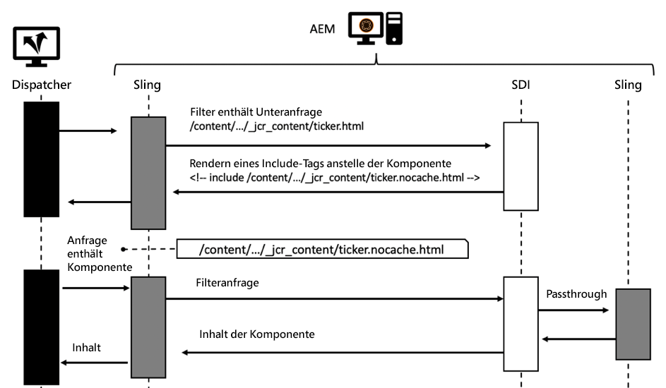

*Sequenzdiagramm einer Anforderung mit Sling Dynamic Include*

<br> 

In der SDI-Dokumentation heißt es, dass Sie die Zwischenspeicherung für URLs deaktivieren sollten, die auf &quot;*.nocache.html&quot;enden. Dies ist sinnvoll - da Sie es mit dynamischen Komponenten zu tun haben.

Möglicherweise sehen Sie eine andere Option zur Verwendung von SDI: Wenn Sie _den Dispatcher-Cache für die Includes nicht deaktivieren, fungiert der Dispatcher wie ein Fragment-Cache ähnlich dem, den wir im letzten Kapitel beschrieben haben: Seiten und Komponentenfragmente werden gleichmäßig und unabhängig im Dispatcher zwischengespeichert und vom SSI-Skript im Apache-Server zusammengeführt, wenn die Seite angefordert wird._ Auf diese Weise können Sie freigegebene Komponenten wie die Hauptnavigation implementieren (vorausgesetzt, Sie verwenden immer dieselbe Komponenten-URL).

Das sollte funktionieren - theoretisch. Aber...

Wir empfehlen, dies nicht zu tun: Sie würden die Fähigkeit verlieren, den Cache für die echten dynamischen Komponenten zu umgehen. SDI wird global konfiguriert, und die Änderungen, die Sie für Ihren &quot;arm-mans-fragment-cache&quot;vornehmen würden, würden auch für die dynamischen Komponenten gelten.

Wir empfehlen Ihnen, die SDI-Dokumentation sorgfältig zu prüfen. Es gibt noch einige weitere Einschränkungen, aber SDI ist in einigen Fällen ein wertvolles Werkzeug.

#### Verweise

* [docs.oracle.com - Erstellen benutzerdefinierter JSP-Tags](https://docs.oracle.com/cd/E11035_01/wls100/taglib/quickstart.html)
* [Dominik Süß - Erstellen und Verwenden von Komponenten-Filtern](https://www.slideshare.net/connectwebex/prsentation-dominik-suess)
* [sling.apache.org - Sling Dynamic Includes](https://sling.apache.org/documentation/bundles/dynamic-includes.html)
* [helpx.adobe.com - Einrichten von Sling Dynamic Includes in AEM](https://helpx.adobe.com/experience-manager/kt/platform-repository/using/sling-dynamic-include-technical-video-setup.html)


#### Modell-Zwischenspeicherung

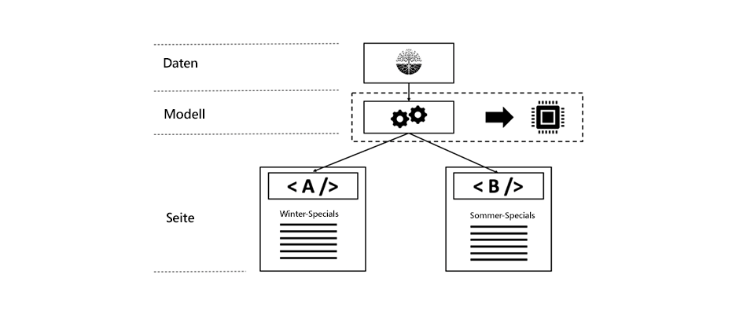

*Modellbasierte Zwischenspeicherung: Ein Geschäftsobjekt mit zwei verschiedenen Darstellungen*

<br> 

Lassen Sie uns den Fall erneut mit der Navigation betrachten. Wir gingen davon aus, dass jede Seite dasselbe Markup der Navigation erfordert.

Aber vielleicht ist das nicht der Fall. Möglicherweise möchten Sie ein anderes Markup für das Element in der Navigation rendern, das die _aktuelle Seite_ darstellt.

```
Travel Destinations

<ul class="maninnav">
  <li class="currentPage">Travel Destinations
    <ul>
      <li>Finland
      <li>Canada
      <li>Norway
    </ul>
  <li>News
  <li>About us
<ul>
```

```
News

<ul class="maninnav">
  <li>Travel Destinations
  <li class="currentPage">News
    <ul>
      <li>Winter is coming>
      <li>Calm down in the wild
    </ul>
  <li>About us
<is
```

Das sind zwei völlig unterschiedliche Darstellungen. Dennoch ist das _Business-Objekt_ - die vollständige Navigationsstruktur - identisch.  Das _Geschäftsobjekt_ hier ist ein Objektdiagramm, das die Knoten in der Struktur darstellt. Dieses Diagramm kann problemlos in einem Arbeitsspeichercache gespeichert werden. Beachten Sie jedoch, dass dieses Diagramm kein Objekt enthalten darf und kein Objekt referenzieren darf, das Sie selbst nicht erstellt haben - insbesondere jetzt JCR-Knoten.

#### Zwischenspeicherung im Browser

Wir haben die Wichtigkeit der Zwischenspeicherung im Browser bereits angesprochen, und es gibt viele gute Tutorials da draußen. Am Ende - für den Browser - ist der Dispatcher nur ein Webserver, der dem HTTP-Protokoll folgt.

Doch trotz der Theorie haben wir einige Wissenslücken gesammelt, die wir nirgendwo sonst gefunden haben und die wir teilen wollen.

Im Wesentlichen kann die Browserzwischenspeicherung auf zwei verschiedene Arten genutzt werden:

1. Der Browser verfügt über eine Zwischenspeicherung der Ressource, von der er das genaue Ablaufdatum kennt. In diesem Fall wird die Ressource nicht erneut angefordert.

2. Der Browser verfügt über eine Ressource, aber er ist nicht sicher, ob sie noch gültig ist. In diesem Fall würde es den Webserver (den Dispatcher in unserem Fall) fragen. Bitte geben Sie mir die Ressource, wenn sie seit der letzten Auslieferung geändert wurde. Hat sich der Server nicht geändert, wird &quot;304 - nicht geändert&quot;beantwortet, und es wurden nur die Metadaten übertragen.

#### Debugging

Wenn Sie Ihre Dispatcher-Einstellungen für die Browserzwischenspeicherung optimieren, ist es äußerst nützlich, einen Desktop-Proxy-Server zwischen Ihrem Browser und dem Webserver zu verwenden. Wir bevorzugen &quot;Charles Web Debugging Proxy&quot; von Karl von Randow.

Mithilfe von Charles können Sie die Anforderungen und Antworten lesen, die an den und vom Server übertragen werden. Und - Sie können viel über das HTTP-Protokoll lernen. Moderne Browser haben auch einige Debugging-Funktionen Angebot, aber die Funktionen eines Desktop-Proxys sind noch nie da gewesene. Sie können die übertragenen Daten manipulieren, die Übertragung drosseln, einzelne Anforderungen wiederholen und vieles mehr. Die Benutzeroberfläche ist übersichtlich und sehr umfangreich.

Der einfachste Test besteht darin, die Website als normalen Benutzer zu verwenden - wobei der Proxy dazwischen liegt - und den Proxy einzuchecken, wenn die Anzahl der statischen Anforderungen (nach /etc/...) im Laufe der Zeit kleiner wird - da diese im Cache liegen sollten und nicht mehr angefordert werden sollten.

Es wurde festgestellt, dass ein Proxy einen klareren Überblick geben könnte, da eine zwischengespeicherte Anforderung nicht im Protokoll angezeigt wird, während einige in den Browsern integrierte Debugger diese Anforderungen immer noch mit &quot;0 ms&quot;oder &quot;from disk&quot;zeigen. Das ist richtig und präzise, könnte aber Ihre Ansicht etwas bedecken.

Sie können dann einen Drilldown durchführen und die Header der übertragenen Dateien überprüfen, um z. B. zu sehen, ob die HTTP-Header &quot;Läuft ab&quot;korrekt sind. Sie können Anforderungen mit Überschriften, die geändert wurden, erneut abspielen, um zu sehen, ob der Server mit einem 304- oder 200-Antwortcode richtig reagiert. Sie können den Zeitpunkt asynchroner Aufrufe beobachten und auch Ihre Sicherheitsannahmen in einem gewissen Maße testen. Denken Sie daran, dass wir Ihnen gesagt haben, nicht alle Selektoren zu akzeptieren, die nicht explizit erwartet werden? Hier können Sie mit der URL und den Parametern spielen und sehen, ob sich Ihre Anwendung gut verhält.

Es gibt nur eine Sache, die Sie nicht tun sollten, wenn Sie Ihren Cache debuggen:

Laden Sie keine Seiten im Browser neu!

Eine &quot;Browser-Neuladung&quot;, ein _simple-reload_ sowie ein _erzwungenes Neuladen_ (&quot;_shift-reload_&quot;) sind nicht mit einer normalen Seitenanforderung identisch. Eine einfache Neuladungsanforderung setzt einen Header

```
Cache-Control: max-age=0
```

Bei einem Umschalt-Reload (bei gedrückter Umschalttaste auf die Schaltfläche &quot;Neu laden&quot; klicken) wird in der Regel ein Anforderungsheader festgelegt

```
Cache-Control: no-cache
```

Beide Header haben ähnliche, aber leicht unterschiedliche Effekte - vor allem unterscheiden sie sich jedoch vollständig von einer normalen Anforderung, wenn Sie eine URL aus dem URL-Slot oder durch Links auf der Site öffnen. Beim normalen Browsen werden keine Cache-Control-Header eingestellt, sondern wahrscheinlich ein if-modify-since-Header.

Wenn Sie also das normale Browsing-Verhalten debuggen möchten, sollten Sie genau das tun: _Durchsuchen Sie normal_. Die Schaltfläche &quot;Neu laden&quot;Ihres Browsers ist die beste Möglichkeit, keine Cache-Konfigurationsfehler in Ihrer Konfiguration zu sehen.

Benutze deinen Charles Proxy, um zu sehen, wovon wir sprechen. Ja - und während Sie es geöffnet haben - können Sie die Anfragen hier erneut abspielen. Es ist nicht erforderlich, dass Sie den Browser neu laden.

## Leistungstests

Wenn Sie einen Proxy verwenden, erhalten Sie einen Eindruck vom Timing-Verhalten Ihrer Seiten. Natürlich ist das bei weitem kein Leistungstest.  Für einen Leistungstest benötigen mehrere Kunden, die Ihre Seiten parallel anfordern.

Ein häufiger Fehler, den wir zu oft gesehen haben, ist, dass der Leistungstest nur eine sehr geringe Anzahl von Seiten umfasst und diese Seiten nur aus dem Dispatcher-Cache bereitgestellt werden.

Wenn Sie Ihre Anwendung auf das Live-System fördern, unterscheidet sich die Belastung von der, die Sie getestet haben.

Auf dem Live-System ist das Zugriffsmuster nicht die geringe Anzahl von gleichermaßen verteilten Seiten, die Sie in Tests haben (Startseite und wenige Inhaltsseiten). Die Anzahl der Seiten ist viel größer und die Anforderungen sind sehr ungleichmäßig verteilt. Und - natürlich - Live-Seiten können nicht zu 100% aus dem Cache bedient werden: Es gibt vom Veröffentlichungssystem stammende Ungültigkeits-Anfragen, die einen Großteil Ihrer wertvollen Ressourcen automatisch ungültig machen.

Ah ja - und wenn Sie Ihren Dispatcher-Cache neu erstellen, werden Sie feststellen, dass sich das Veröffentlichungssystem auch ganz anders verhält, je nachdem, ob Sie nur eine Handvoll Seiten oder eine größere Anzahl anfordern. Auch wenn alle Seiten ähnlich komplex sind, spielt ihre Anzahl eine Rolle. Erinnern Sie sich daran, was wir über das gekettete Zwischenspeichern gesagt haben? Wenn Sie immer die gleiche kleine Anzahl von Seiten anfordern, besteht die Wahrscheinlichkeit, dass die entsprechenden Blöcke mit den Rohdaten im Cache der Festplatten sind oder die Blöcke vom Betriebssystem zwischengespeichert werden. Außerdem besteht eine gute Chance, dass das Repository das entsprechende Segment im Hauptspeicher zwischengespeichert hat. Das erneute Rendern ist also wesentlich schneller als wenn andere Seiten jetzt und dann aus verschiedenen Caches entfernt werden.

Das Zwischenspeichern ist schwierig, und das gilt auch für das Testen eines Systems, das auf dem Zwischenspeichern basiert. Was können Sie also tun, um ein genaueres Szenario im realen Leben zu haben?

Wir glauben, dass Sie mehr als einen Test durchführen müssen, und Sie müssten mehr als einen Leistungsindex als Maßstab für die Qualität Ihrer Lösung bereitstellen.

Wenn Sie bereits über eine bestehende Website verfügen, messen Sie die Anzahl der Anforderungen und deren Verteilung. Versuchen Sie, einen Test zu modellieren, der eine ähnliche Verteilung der Anforderungen verwendet. Zufälligkeit hinzuzufügen konnte nicht schaden. Sie müssen keinen Browser simulieren, der statische Ressourcen wie JS und CSS laden würde - das ist eigentlich egal. Sie werden letztendlich im Browser oder im Dispatcher zwischengespeichert, und sie werden nicht signifikant geladen. Aber referenzierte Bilder sind wichtig. Finden Sie die Distribution auch in alten Protokolldateien und erstellen Sie ein ähnliches Anforderungsmuster.

Führen Sie nun einen Test durch, wenn Ihr Dispatcher überhaupt nicht zwischenspeichert. Das ist Ihr schlimmstes Szenario. Finden Sie heraus, wie hoch die Auslastung Ihres Systems unter diesen ungünstigsten Bedingungen ist. Sie können es auch noch verschlimmern, indem Sie ein paar Dispatcher/Veröffentlichungsbeine herausnehmen, wenn Sie möchten.

Als Nächstes führen Sie denselben Test mit allen erforderlichen Cache-Einstellungen durch, um &quot;on&quot;zu aktivieren. Richten Sie Ihre parallelen Anforderungen langsam ein, um den Cache zu warnen und zu sehen, wie viel Ihr System unter diesen optimalen Bedingungen einnehmen kann.

Ein durchschnittliches Fallszenario wäre die Ausführung des Tests mit aktiviertem Dispatcher, aber auch bei einigen ungültigen Eingriffen. Sie können dies simulieren, indem Sie die Statusdateien durch einen Cronjob berühren oder die Ungültigkeitserfordernisse in unregelmäßigen Abständen an den Dispatcher senden. Vergessen Sie nicht, auch gelegentlich einige der nicht automatisch ungültigen Ressourcen zu bereinigen.

Sie können das letzte Szenario ändern, indem Sie die Ungültigungsanforderungen erhöhen und die Belastung erhöhen.

Das ist etwas komplexer als ein linearer Belastungstest - aber es gibt viel mehr Selbstbewusstsein in Ihrer Lösung.

Du könntest dich von der Anstrengung abschrecken. Aber bei der Vermietung führen Sie einen Worst-Case-Test auf dem Publish-System mit einer größeren Anzahl von Seiten (gleichmäßig verteilt), um die Grenzen des Systems zu sehen. Stellen Sie sicher, dass Sie die Anzahl der Best-Case-Szenarios richtig interpretieren und genügend Platz für Ihre Systeme bereitstellen.