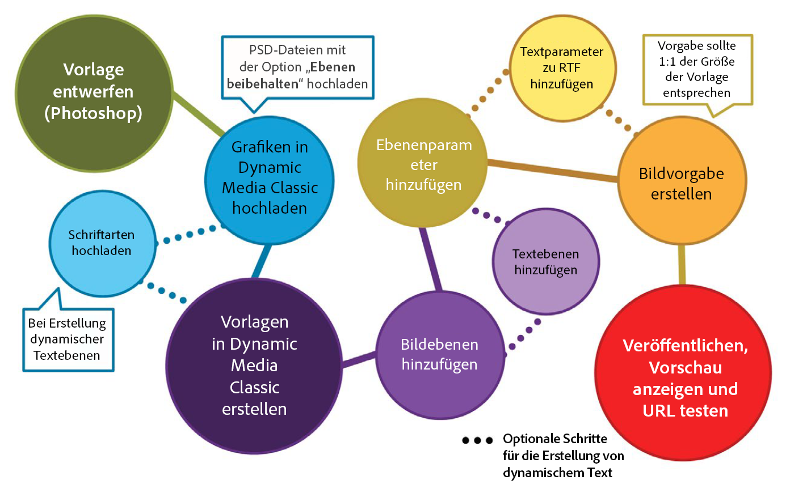
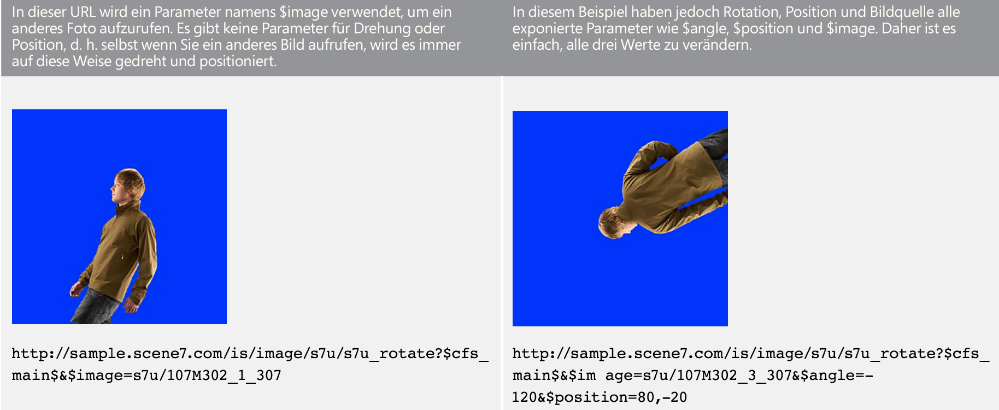
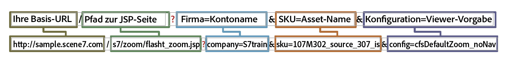
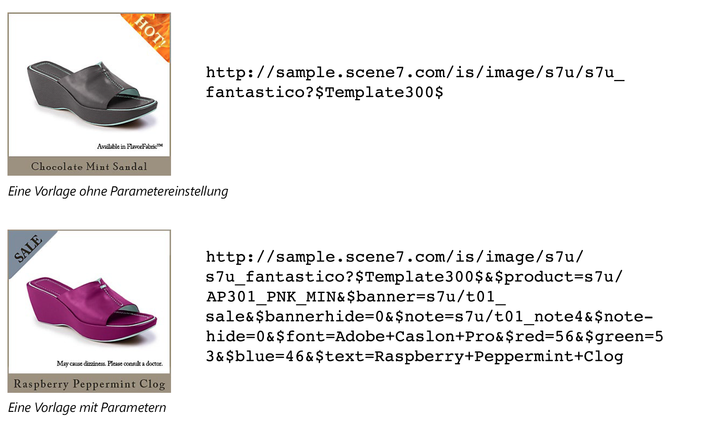

# Einführung in einfache Vorlagen {#basic-templates}

In Dynamic Media Classic-Begriffen ist eine Vorlage ein Dokument, das nach der Veröffentlichung der Vorlage dynamisch über die URL geändert werden kann. Dynamic Media Classic Angebots Grundlegende Vorlagen, bildbasierte Vorlagen, die vom Image-Server aufgerufen werden und aus Bildern und gerendertem Text bestehen.

Einer der leistungsfähigsten Aspekte von Vorlagen ist, dass sie direkte Integrationspunkte haben, mit denen Sie sie an Ihre Datenbank binden können. So können Sie nicht nur ein Bild aufstellen und seine Größe ändern, Sie können Ihre Abfrage, um neue oder verkaufte Artikel zu finden und es als Überlagerung auf dem Bild erscheinen. Sie können nach einer Beschreibung des Elements fragen und diese als Beschriftung in einer von Ihnen gewählten Schriftart und einem Layout anzeigen lassen. Die Möglichkeiten sind grenzenlos.

Grundlegende Vorlagen können auf verschiedene Arten implementiert werden, von einfach bis komplex. Beispiel:

- Grundlegende Merchandising. Verwendet Etiketten wie &quot;kostenloser Versand&quot;, wenn dieses Produkt kostenlosen Versand hat. Diese Beschriftungen werden vom Merchandise-Team in Photoshop eingerichtet, und das Web verwendet Logik, um zu wissen, wann sie auf das Bild angewendet werden.
- Erweitertes Merchandising. Jede Vorlage enthält mehrere Variablen und kann mehrere Optionen gleichzeitig anzeigen. Verwendet eine Datenbank, Bestands- und Geschäftsregeln, um zu bestimmen, wann ein Produkt als &quot;Just In&quot;, &quot;Clearance&quot;oder &quot;Sold Out&quot;angezeigt werden soll. Außerdem kann Transparenz hinter dem Produkt verwendet werden, um es in verschiedenen Hintergründen anzuzeigen, z. B. in verschiedenen Räumen. Dieselben Vorlagen und/oder Assets können auf der Produktdetailseite umgewidmet werden, um eine größere oder zoombare Version desselben Produkts mit unterschiedlichen Hintergründen anzuzeigen.

Es ist wichtig zu verstehen, dass Dynamic Media Classic nur den visuellen Teil dieser auf Vorlagen basierenden Anwendungen bereitstellt. Dynamic Media Classic-Firmen oder ihre Integrationspartner müssen die Geschäftsregeln, die Datenbank und die Entwicklungskenntnisse bereitstellen, um die Anwendungen zu erstellen. Es gibt keine integrierte Vorlagenanwendung. Designer richten die Vorlage in Dynamic Media Classic ein und Entwickler verwenden URL-Aufrufe, um die Variablen in der Vorlage zu ändern.

Am Ende dieses Abschnitts des Tutorials erfahren Sie, wie:

- Laden Sie eine Photoshop PSD auf Dynamic Media Classic hoch, um sie als Grundlage für eine Vorlage zu verwenden.
- Erstellen Sie eine einfache Merchandising-Grundvorlage, die aus Bildebenen besteht.
- hinzufügen Textebenen und machen sie mithilfe von Parametern variabel.
- Erstellen Sie eine Vorlagen-URL und bearbeiten Sie das Bild dynamisch über den Webbrowser.

>[!NOTE]
>
>Alle URLs in diesem Kapitel dienen nur zu Veranschaulichungszwecken; es handelt sich nicht um Live-Links.

## Übersicht über einfache Vorlagen

Die Definition einer einfachen Vorlage (oder kurz &quot;Vorlage&quot;) ist ein URL-adressierbares Bild mit Ebenen. Das Endergebnis ist ein Bild, das jedoch durch die URL geändert werden kann. Sie kann aus Fotos, Text oder Grafiken bestehen — alle Kombinationen von P-TIFF-Assets in Dynamic Media Classic.

Vorlagen ähneln am ehesten den Photoshop PSD-Dateien, da sie einen ähnlichen Arbeitsablauf und ähnliche Funktionen aufweisen.

- Beide bestehen aus Schichten, die wie Platten gestapelter Azetate sind. Sie können teilweise transparente Bilder zusammensetzen und durch die transparenten Bereiche einer Ebene zu den darunter liegenden Ebenen sehen.
- Die Ebenen können verschoben und gedreht werden, um den Inhalt neu zu positionieren, und die Deckkraft- und Füllmethoden können geändert werden, um den Inhalt teilweise transparent zu machen.
- Sie können textbasierte Ebenen erstellen. Die Qualität kann sehr hoch sein, da der Image-Server die gleiche Text-Engine wie Photoshop und Illustrator verwendet.
- Auf jede Ebene können einfache Ebenenstile angewendet werden, um spezielle Effekte wie Schlagschatten oder Schein zu erzeugen.

Im Gegensatz zu Photoshop PSDs können Ebenen jedoch vollständig dynamisch sein und über eine URL auf dem Image-Server gesteuert werden.

- Sie können Variablen zu allen Vorlageneigenschaften hinzufügen, sodass Sie die Komposition schnell ändern können.
- Variablen, die als Parameter bezeichnet werden, ermöglichen es Ihnen, nur den Teil der Vorlage bereitzustellen, den Sie ändern möchten.

Sie müssen nur einen Platzhalter für jede Ebene hinzufügen, die variiert, anstatt alle Ebenen wie in Photoshop in eine Datei zu setzen und sie ein- und auszublenden (auch wenn Sie dies gerne tun).

Mithilfe eines Platzhalters können Sie den Inhalt einer Ebene dynamisch mit einem anderen veröffentlichten Asset austauschen. Es werden automatisch dieselben Eigenschaften (wie Größe und Drehung) der ersetzten Ebene verwendet.

Da Grundlagenvorlagen in der Regel in Photoshop entworfen, aber über eine URL bereitgestellt werden, erfordert ein Vorlagenprojekt eine Mischung aus Design- und technischen Fertigkeiten. Wir gehen im Allgemeinen davon aus, dass die Person, die die kreative Vorlage arbeitet, ein Photoshop-Designer ist und die Person, die die Vorlage implementiert, ein Webentwickler ist. Die Kreativ- und Entwicklungsteams müssen eng zusammenarbeiten, damit die Vorlage erfolgreich sein kann.

Vorlagenprojekte können relativ einfach oder extrem komplex sein, je nach Geschäftsregeln und Anforderungen der Anwendung. Grundlegende Vorlagen werden vom Image-Server aufgerufen. Aufgrund der Flexibilität der Dynamic Media Classic-Umgebung können Sie jedoch auch Vorlagen in anderen Vorlagen verschachteln, sodass Sie relativ komplexe Bilder erstellen können, die mit häufig benannten Variablen verknüpft werden können.

- Erfahren Sie mehr über [Vorlagen aus Grundelementen](https://docs.adobe.com/content/help/en/dynamic-media-classic/using/template-basics/quick-start-template-basics.html).
- Erfahren Sie, wie Sie eine [einfache Vorlage](https://docs.adobe.com/content/help/en/dynamic-media-classic/using/template-basics/creating-template.html#creating_a_template) erstellen.

## Erstellen einer einfachen Vorlage

Beim Arbeiten mit einer einfachen Vorlage befolgen Sie in der Regel die Schritte zum Workflow im unten stehenden Diagramm. Schritte, die mit gepunkteten Linien markiert sind, sind optional, wenn Sie dynamische Textebenen verwenden, und werden in den Anweisungen unten als &quot;Text-Workflow&quot;angezeigt. Wenn Sie keinen Text verwenden, folgen Sie nur dem Hauptpfad.

_Der Arbeitsablauf für einfache Vorlagen._

1. Entwerfen und erstellen Sie Ihre Assets. Die meisten Benutzer tun dies in Adobe Photoshop. Entwerfen von Assets in der gewünschten Größe — Wenn es sich um ein 200-Pixel-Bild für eine Miniaturseite handelt, erstellen Sie es mit 200 Pixeln. Wenn Sie darauf zoomen müssen, entwerfen Sie es mit einer Größe von etwa 2000 Pixel. Verwenden Sie Photoshop (und/oder Illustrator als Bitmap gespeichert), um die Assets zu erstellen, und verwenden Sie Dynamic Media Classic, um die Teile zusammenzuführen, die Ebenen zu verwalten und Variablen hinzuzufügen.
2. Laden Sie nach dem Entwerfen von grafischen Assets diese in Dynamic Media Classic hoch. Anstatt einzelne Assets aus der PSD-Datei hochzuladen, sollten Sie die gesamte PSD-Datei mit Ebenen hochladen und von Dynamic Media Classic eine Datei pro Ebene erstellen lassen, indem Sie beim Hochladen die Option **Ebenen beibehalten** verwenden (weitere Informationen finden Sie unten). _Textarbeitsablauf: Wenn Sie dynamischen Text erstellen, laden Sie auch Ihre Schriftarten hoch. Dynamischer Text ist variabel und wird über die URL gesteuert. Wenn Ihr Text statisch ist oder nur wenige kurze Ausdrücke enthält, die sich nicht ändern — — z. B. Tags mit &quot;Neu&quot;oder &quot;Ausverkauf&quot;anstelle von &quot;X% Aus&quot;, wobei das X eine variable Zahl ist — Wir empfehlen, den Text in Photoshop vorab zu rendern und als gerasterte Ebenen als Bilder hochzuladen. Es wird einfacher und Sie können den Text genau nach Ihren Wünschen gestalten._
3. Erstellen Sie die Vorlage in Dynamic Media Classic mit dem Editor &quot;Vorlagen aus Grundelementen&quot;im Menü &quot;Erstellen&quot;und fügen Sie Bildebenen hinzu. Textarbeitsablauf: Erstellen Sie Textebenen im gleichen Editor. Dieser Schritt ist erforderlich, wenn Sie eine Vorlage in Dynamic Media Classic manuell erstellen. Wählen Sie eine Arbeitsflächengröße, die Ihrem Design entspricht, ziehen Sie Bilder per Drag &amp; Drop auf die Arbeitsfläche und legen Sie die Ebeneneigenschaften (Größe, Drehung, Deckkraft usw.) fest. Sie legen nicht jede mögliche Ebene auf Ihre Vorlage, sondern nur einen Platzhalter pro Bildebene. _Textarbeitsablauf: Textebenen werden mit dem Textwerkzeug erstellt, ähnlich wie beim Erstellen von Textebenen in Photoshop. Sie können eine Schriftart auswählen und sie mit den gleichen Optionen wie mit dem Photoshop-Textwerkzeug formatieren._ Ein anderer Arbeitsablauf besteht darin, eine PSD hochzuladen und von Dynamic Media Classic eine &quot;kostenlose&quot;Vorlage zu erstellen und sogar Textebenen neu zu erstellen. Hierauf gehen wir später noch genauer ein.
4. Nachdem die Ebenen erstellt wurden, fügen Sie Parameter (Variablen) zu jeder Eigenschaft einer Ebene hinzu, die Sie über die URL steuern möchten, einschließlich der Quelle der Ebene (das Bild selbst). _Textarbeitsablauf: Sie können auch Parameter zu Textebenen hinzufügen, um sowohl den Inhalt und die Größe und Position der Ebene selbst zu steuern, als auch alle Formatierungsoptionen wie Schriftfarbe, Schriftgröße, horizontale Verfolgung usw._
5. Erstellen Sie eine Bildvorgabe, die der Größe der Vorlage entspricht. Dies wird empfohlen, damit die Vorlage immer im Format 1:1 aufgerufen wird. Außerdem sollten große Bildebenen, deren Größe an die Vorlage angepasst wird, scharfgezeichnet werden. Wenn Sie eine Vorlage erstellen, die vergrößert werden soll, ist dieser Schritt unnötig.
6. Veröffentlichen, kopieren Sie die URL aus der Dynamic Media Classic-Vorschau und testen Sie sie in einem Browser.

## Vorbereiten und Hochladen von Vorlagenelementen in Dynamic Media Classic

Bevor Sie Ihre Vorlagenelemente in Dynamic Media Classic hochladen, müssen Sie einige vorbereitende Schritte durchführen.

### Vorbereiten der PSD für das Hochladen

Bevor Sie Ihre Photoshop-Datei nach Dynamic Media Classic hochladen, vereinfachen Sie die Ebenen in Photoshop, um die Arbeit mit dem Image-Server zu erleichtern und die größtmögliche Kompatibilität mit diesem zu gewährleisten. Ihre PSD-Datei besteht oft aus vielen Elementen, die von Dynamic Media Classic nicht erkannt werden, und Sie können auch mit vielen kleinen Elementen enden, die schwer zu verwalten sind. Wenn Sie das Original später bearbeiten müssen, sollten Sie unbedingt eine Sicherungskopie Ihrer Übergeordnet PSD-Datei speichern. Sie werden die vereinfachte Kopie hochladen, nicht die Übergeordnet.

1. Vereinfachen Sie die Ebenenstruktur, indem Sie zusammengehörige Ebenen, die zusammen ein-/ausgeschaltet werden müssen, zu einer einzigen Ebene zusammenführen/reduzieren. Beispielsweise werden die Beschriftung &quot;NEU&quot;und das blaue Banner in einer einzigen Ebene zusammengeführt, sodass Sie sie mit einem Klick ein- oder ausblenden können.
   
2. Einige Ebenentypen und Ebeneneffekte werden von Dynamic Media Classic oder dem Image-Server nicht unterstützt und müssen vor dem Hochladen gerastert werden. Andernfalls können die Effekte ignoriert oder die Ebenen verworfen werden. Das Rastern einer Ebene bedeutet, dass eine Ebene konvertiert werden muss, wenn sie bearbeitet werden kann und nicht bearbeitet werden kann. Um Ebeneneffekte oder Textebenen zu rastern, erstellen Sie eine leere Ebene, wählen Sie beide Ebenen aus und führen Sie sie mit **Ebenen > Ebenen zusammenführen** oder STRG + E/CMD + E zusammen.

   - Dynamic Media Classic kann Ebenen nicht gruppieren oder verknüpfen. Alle Ebenen in einer Gruppe oder einem verknüpften Satz werden in separate Ebenen konvertiert, die nicht mehr gruppiert/verknüpft sind.
   - Ebenenmasken werden beim Hochladen in Transparenz umgewandelt.
   - Einstellungsebenen werden nicht unterstützt und verworfen.
   - Füllschichten wie Einfarbige Ebenen werden gerastert.
   - Smartobjekt-Ebenen und Vektorebenen werden beim Hochladen in normale Bilder gerastert und Smart-Filter werden angewendet und gerastert.
   - Textebenen werden auch gerastert, es sei denn, Sie verwenden die Option &quot;Text extrahieren&quot;. Weitere Informationen finden Sie unten.
   - Die meisten Ebeneneffekte werden ignoriert und nur wenige Übergangsmodi werden unterstützt. Fügen Sie im Zweifelsfall einfache Effekte in Dynamic Media Classic hinzu (z. B. Innen- oder Schlagschatten, Innen- oder Außenschein) oder verwenden Sie eine leere Ebene, um den Effekt in Photoshop zusammenzuführen und zu rastern.

### Arbeiten mit Schriftarten

Sie können Ihre Schriftarten auch hochladen und veröffentlichen, wenn Sie dynamischen Text generieren müssen. Die einzige in Dynamic Media Classic enthaltene Schriftart ist Arial.

Jede Firma ist dafür verantwortlich, eine Lizenz zur Verwendung einer Schrift im Internet zu erhalten — Wenn Sie eine Schriftart einfach auf Ihrem Computer installiert haben, haben Sie nicht das Recht, sie kommerziell im Internet zu verwenden, und Ihre Firma könnte ohne Erlaubnis vor Gericht gestellt werden. Darüber hinaus gelten unterschiedliche Lizenzbedingungen — Sie benötigen z. B. separate Lizenzen für Druck- und Bildschirmdarstellung.

Dynamic Media Classic unterstützt die Standardschriftarten OpenType (OTF), TrueType (TTF) und Type 1 Postscript. Schreibgeschützte Kofferschriftarten, Typkollektionsdateien, Windows-Systemschriftarten und proprietäre Maschinenschriftarten (wie Schriftarten, die von Gravierungs- oder Stickereimaschinen verwendet werden) werden nicht unterstützt — Sie müssen sie in eines der Standardschriftformate konvertieren oder eine ähnliche Schriftart ersetzen, die in Dynamic Media Classic und auf dem Image-Server verwendet werden soll.

Nachdem Schriftarten wie andere Assets nach Dynamic Media Classic hochgeladen wurden, müssen sie auch auf dem Image-Server veröffentlicht werden. Ein sehr häufiger Vorlagenfehler besteht darin, die Veröffentlichung der Schriftarten zu vergessen, was zu einem Bildfehler führt — der Image-Server ersetzt keine andere Schrift an ihrer Stelle. Wenn Sie beim Hochladen die Option **Text extrahieren** verwenden möchten, müssen Sie Ihre Schriftartdateien hochladen, bevor Sie die PSD-Datei hochladen, die diese Schriftarten verwendet. Die Funktion **Text extrahieren** versucht, Ihren Text als bearbeitbare Textebene neu zu erstellen und ihn in einer Dynamic Media Classic-Vorlage zu platzieren. Dies wird im nächsten Thema, PSD-Optionen, erläutert.

Beachten Sie, dass Schriftarten mehrere interne Namen haben, die sich oft von ihrem externen Dateinamen unterscheiden. Auf der Seite &quot;Details&quot;für dieses Asset in Dynamic Media Classic werden alle zugehörigen Namen angezeigt. Im Folgenden finden Sie die Namen der Schrift Adobe Caslon Pro Semibold, die auf der Registerkarte &quot;Metadaten&quot;in Dynamic Media Classic aufgeführt wird:

_Registerkarte &quot;Metadaten&quot;auf der Seite &quot;Details&quot;für eine Schriftart in Dynamic Media Classic._

Dynamic Media Classic verwendet den Dateinamen dieser Schriftart (ACaslonPro-Semibold) als Asset-ID, jedoch nicht den von der Vorlage verwendeten Namen. Die Vorlage verwendet den RTF-Namen (Rich Text Format), der unten aufgeführt ist. RTF ist die native &quot;Sprache&quot;der Image Server-Textmaschine.

Wenn Sie Schriftarten über die URL ändern müssen, müssen Sie den RTF-Namen der Schriftart aufrufen (nicht die Asset-ID), andernfalls wird ein Fehler ausgegeben. In diesem Fall wäre der richtige Name für diese Schrift &quot;Adobe Caslon Pro&quot;. Weitere Informationen zu Schriftarten und RTF finden Sie unten im Thema RTF und Textparameter.

Die gängigsten Schriftartdateiformate auf Windows- und Mac-Systemen sind OpenType und TrueType. OpenType hat die Erweiterung .OTF, während TrueType .TTF ist. Beide Formate funktionieren in Dynamic Media Classic gleichermaßen gut.

### Optionen beim Hochladen der PSD-Datei auswählen

Sie müssen keine Photoshop-Datei (PSD) hochladen, um eine Vorlage zu erstellen. Eine Vorlage kann aus allen Bild-Assets in Dynamic Media Classic erstellt werden. Das Hochladen einer PSD-Datei kann das Authoring jedoch vereinfachen, da sich diese Elemente in der Regel bereits in einer PSD-Datei mit Ebenen befinden. Darüber hinaus erstellt Dynamic Media Classic beim Hochladen einer PSD-Datei mit Ebenen automatisch eine Vorlage.

- **Ebenen beibehalten.** Dies ist die wichtigste Option. Dadurch wird Dynamic Media Classic angewiesen, pro Photoshop-Ebene ein Bild-Asset zu erstellen. Wenn diese Option deaktiviert ist, werden alle anderen Optionen deaktiviert und die PSD-Datei in ein einzelnes Bild reduziert.
- **** **CreateTemplate.** Diese Option nimmt die verschiedenen erstellten Ebenen und erstellt automatisch eine Vorlage, indem sie sie wieder zusammenführt. Ein Nachteil bei der Verwendung der automatisch erstellten Vorlage besteht darin, dass Dynamic Media Classic alle Ebenen in einer Datei platziert, während wir nur einen einzigen Platzhalter pro Ebene benötigen. Es ist einfach genug, die zusätzlichen Ebenen zu löschen, aber wenn Sie viele Ebenen haben, ist es schneller, sie neu zu erstellen. Achten Sie darauf, die neue Vorlage umzubenennen. Wenn Sie dies nicht tun, wird es beim nächsten Hochladen der gleichen PSD-Datei überschrieben.
- **Text extrahieren.** Dadurch werden Textebenen in der PSD als Textebenen in der Vorlage mit der von Ihnen hochgeladenen Schrift neu erstellt. Dieser Schritt ist erforderlich, wenn sich Ihr Text auf einem Pfad in Photoshop befindet und Sie diesen Pfad in der Vorlage beibehalten möchten. Für diese Funktion müssen Sie die Option **Vorlage erstellen** verwenden, da der extrahierte Text nur mit einer Vorlage erstellt werden kann, die beim Hochladen generiert wird.
- **Ebenen auf Hintergrundgröße ausdehnen** Diese Einstellung macht jede Ebene gleich groß wie die gesamte PSD-Arbeitsfläche. Dies ist sehr nützlich für Ebenen, die immer an der Position fixiert bleiben: Andernfalls müssen Sie die Bilder beim Austausch in dieselbe Ebene neu positionieren.
- **Ebenenbenennung.** Dadurch wird Dynamic Media Classic erläutert, wie die einzelnen Assets, die pro Ebene generiert wurden, benannt werden. Wir empfehlen entweder **Photoshop** **und Layer** **Name** oder Photoshop und **Layer** **Number**. Beide Optionen verwenden den PSD-Namen als ersten Teil des Namens und fügen am Ende entweder den Ebenennamen oder die Nummer hinzu. Wenn Sie z. B. eine PSD mit dem Namen &quot;shirt.psd&quot;und Ebenen mit den Namen &quot;front&quot;, &quot;sleeves&quot;und &quot;kragen&quot;haben, wenn Sie die Option **Photoshop und** Layer **Name** hochladen, generiert Dynamic Media Classic die Asset-IDs &quot;shirt_front&quot;, &quot;shirt_sleeves&quot;und &quot;shirt_shirt_sleves&quot;. Kragen.&quot; Die Verwendung einer dieser Optionen hilft sicherzustellen, dass der Name in Dynamic Media Classic eindeutig ist.

## Erstellen einer Vorlage mit Bildebenen

Obwohl Dynamic Media Classic eine Vorlage automatisch aus einer PSD-Datei mit Ebenen erstellen kann, sollten Sie wissen, wie die Vorlage manuell erstellt werden kann. Wie oben erläutert, kann es vorkommen, dass Sie die von Dynamic Media Classic erstellte Vorlage nicht verwenden möchten.

### Die Benutzeroberfläche &quot;Vorlagen aus Grundelementen&quot;

Lassen Sie uns zuerst mit der Bearbeitungsoberfläche vertraut sein.

In der linken Mitte befindet sich Ihr Arbeitsbereich mit einer Vorschau Ihrer endgültigen Vorlage. Auf der rechten Seite befinden sich die Bedienfelder &quot;Ebenen&quot;und &quot;Ebeneneigenschaften&quot;. In diesen Bereichen werden Sie am meisten arbeiten.

_Seite &quot;Vorlagen aus Grundelementen erstellen&quot;._

- **Vorschau/Arbeitsbereich.** Dies ist das Hauptfenster. Hier können Sie Ebenen mit Ihrer Maus verschieben, verkleinern und drehen. Ebenenumrisse werden als gestrichelte Linien angezeigt.
- **Ebenen.** Dies ähnelt dem Ebenenbedienfeld von Photoshop. Wenn Sie Ihrer Vorlage Ebenen hinzufügen, werden diese hier angezeigt. Ebenen werden von oben nach unten gestapelt — Die oberste Ebene im Ebenenbedienfeld wird über den anderen darunter liegenden Ebenen in der Liste angezeigt.
- **Ebeneneigenschaften.** Hier können Sie alle Eigenschaften einer Ebene mit numerischen Steuerelementen anpassen. Wählen Sie zuerst eine Ebene aus und passen Sie dann deren Eigenschaften an.
- **Composite-** **URL.** Am unteren Rand der Benutzeroberfläche befindet sich der Bereich &quot;Composite-URL&quot;. Dies wird in diesem Abschnitt des Tutorials nicht besprochen. Hier wird Ihre Vorlage jedoch als eine Reihe von Image Serving-URL-Modifikatoren dekonstruiert. Dieser Bereich ist bearbeitbar — Wenn Sie mit den Image-Server-Befehlen vertraut sind, können Sie die Vorlage hier manuell bearbeiten. Sie können es aber auch brechen. Wie Photoshop, Beginn für die Seitennummerierung bei 0. Die Arbeitsfläche ist Ebene 0, und die erste Ebene, die Sie selbst hinzufügen, ist Ebene 1. Die Füllmethoden bestimmen, wie die Pixel einer Ebene mit den Pixeln darunter übergehen. Mithilfe von Füllmethoden können Sie eine Vielzahl von Spezialeffekten erstellen.

#### Verwenden des Vorlagen-Grundlageneditors

Im Folgenden finden Sie die Workflow-Schritte zum Beginn Ihrer einfachen Vorlage:

1. Gehen Sie in Dynamic Media Classic zu **Erstellen > Vorlagen aus Grundelementen**. Sie können entweder nichts auswählen oder Beginn auswählen, indem Sie ein Bild auswählen, das die erste Ebene Ihrer Vorlage wird.
2. Wählen Sie eine Größe und drücken Sie **OK**. Diese Größe sollte der Größe entsprechen, die Sie in Photoshop entworfen haben. Der Vorlageneditor wird geladen.
3. Wenn Sie in Schritt 1 kein Bild ausgewählt haben, suchen Sie im Bedienfeld &quot;Asset&quot;auf der linken Seite nach einem Bild oder navigieren Sie zu einem Bild und ziehen Sie es in den Arbeitsbereich.

   - Die Größe des Bildes wird automatisch an die Größe der Arbeitsfläche angepasst. Wenn Sie planen, Ihre hochauflösenden Bilder auszutauschen, würden Sie normalerweise eines Ihrer großen (2000 px) P-TIFF-Bilder einbringen und als Platzhalter verwenden.
   - Dies sollte die unterste Ebene Ihrer Vorlage sein, Sie können die Ebenen jedoch später neu anordnen.

4. Ändern Sie die Größe oder Position der Ebene direkt im Arbeitsbereich oder durch Anpassen der Einstellungen im Ebeneneigenschaften-Bedienfeld.
5. Ziehen Sie nach Bedarf weitere Bildebenen hinzu. hinzufügen Ebeneneffekte, wenn Sie möchten. Siehe das Thema _Hinzufügen von Ebeneneffekten_ weiter unten.
6. Klicken Sie auf **Speichern**, wählen Sie einen Speicherort und geben Sie der Vorlage einen Namen. Sie können eine Vorschau vornehmen, aber an diesem Punkt wird Ihre Vorlage genau wie ein reduziertes Photoshop-Bild aussehen — Es ist noch nicht veränderbar.

### Hinzufügen von Ebeneneffekten

Der Image-Server unterstützt einige programmgesteuerte Ebeneneffekte — Spezialeffekte, die das Erscheinungsbild des Ebeneninhalts ändern. Sie funktionieren ähnlich wie Ebeneneffekte in Photoshop. Sie sind an einer Ebene befestigt, werden aber unabhängig von der Ebene gesteuert. Sie können sie anpassen oder entfernen, ohne eine dauerhafte Änderung an der Ebene selbst vorzunehmen.

- **Schlagschatten**. Wendet einen Schatten außerhalb der Grenzen der Ebene an, der durch einen x- und y-Pixel-Offset positioniert wird.
- **Schatten nach innen**. Wendet einen Schatten innerhalb der Grenzen der Ebene an, der durch einen x- und y-Pixel-Offset positioniert wird.
- **Schein nach außen**. Wendet einen Schein-Effekt gleichmäßig auf alle Kanten der Ebene an.
- **Schein nach innen**. Wendet einen Schein-Effekt gleichmäßig an allen Kanten der Ebene an.

_Eine Ebene mit und ohne Schlagschatten_

Um einen Effekt hinzuzufügen, klicken Sie auf **Hinzufügen Effekt** und wählen Sie einen Effekt aus dem Menü. Wie bei normalen Ebenen können Sie auch im Ebenenbedienfeld einen Effekt auswählen und dessen Einstellungen mithilfe des Ebeneneigenschaften-Bedienfelds anpassen.

Schatteneffekte werden horizontal oder vertikal von der Ebene entfernt versetzt, während Schein-Effekte gleichmäßig in alle Richtungen angewendet werden. Innere Effekte wirken sich auf die undurchsichtigen Teile der Ebene aus, während äußere Effekte nur die transparenten Bereiche betreffen.

Erfahren Sie mehr über[Hinzufügen von Ebeneneffekten](https://docs.adobe.com/content/help/en/dynamic-media-classic/using/template-basics/creating-template.html#using-shadow-and-glow-effects-on-layers).

### Hinzufügen von Parametern

Wenn Sie nur Ebenen kombinieren und speichern, unterscheidet sich das Nettoergebnis nicht von einem reduzierten Photoshop-Bild. Besonders hervorzuheben ist die Möglichkeit, den Eigenschaften jeder Ebene Parameter hinzuzufügen, damit sie dynamisch über die URL geändert werden können.

In Dynamic Media Classic-Begriffen ist ein Parameter eine Variable, die mit einer Vorlageneigenschaft verknüpft werden kann, damit sie über eine URL manipuliert werden kann. Wenn Sie einen Parameter zu einer Ebene hinzufügen, stellt Dynamic Media Classic diese Eigenschaft in der URL bereit, indem Sie dem Parameternamen ein Dollarzeichen ($) — vorangestellen. Wenn Sie beispielsweise einen Parameter namens &quot;size&quot;erstellen, um die Größe einer Ebene zu ändern, benennt Dynamic Media Classic Ihren Parameter $size um.

Wenn Sie keinen Parameter für eine Eigenschaft hinzufügen, bleibt diese Eigenschaft in der Dynamic Media Classic-Datenbank verborgen und wird nicht in der URL angezeigt.

Ohne Parameter wären Ihre URLs in der Regel viel länger, insbesondere wenn Sie auch dynamischen Text verwenden. Text fügt jeder URL mehrere Dutzend zusätzliche Zeichen hinzu.

Schließlich werden Ihre anfänglichen Parameter zu den Standardwerten der Eigenschaften in der Vorlage. Wenn Sie Ihre Vorlage erstellen, Parameter hinzufügen und dann die URL ohne ihre Parameter aufrufen, erstellt der Image-Server das Bild mit allen in der Vorlage gespeicherten Standardeinstellungen. Parameter werden nur benötigt, wenn Sie eine Eigenschaft ändern möchten. Wenn eine Eigenschaft nicht geändert werden muss, müssen Sie keinen Parameter festlegen.

#### Erstellen von Parametern

Dies ist der Arbeitsablauf zum Erstellen von Parametern:

1. Klicken Sie auf die Schaltfläche **Parameter** neben dem Namen der Ebene, für die Sie Parameter erstellen möchten. Der Anzeigebereich &quot;Parameter&quot;wird geöffnet. Es werden alle Eigenschaften auf der Ebene und deren Wert Liste.
1. Wählen Sie die Option **Ein** neben dem Namen jeder Eigenschaft, die Sie in einen Parameter umwandeln möchten. Daraufhin wird ein standardmäßiger Parametername angezeigt. Sie können nur Parameter zu Eigenschaften hinzufügen, die vom Standardstatus abweichen.

   - Wenn Sie z. B. eine Ebene hinzufügen und sie an ihrer standardmäßigen xen Position 0,0 belassen, stellt Dynamic Media Classic keine **Position**-Eigenschaft bereit. Um die Ebene zu beheben, verschieben Sie sie um mindestens ein Pixel. Jetzt stellt Dynamic Media Classic **Position** als Eigenschaft zur Verfügung, die parametrisiert werden kann.
   - Um der Eigenschaft &quot;Anzeigen/Ausblenden&quot;(die die Ebene ein- und ausschaltet) einen Parameter hinzuzufügen, klicken Sie auf das Symbol **Ebene einblenden** oder **Ebene ausblenden**, um die Ebene zu deaktivieren (Sie können die Ebene nach Bedarf wieder aktivieren). Dynamic Media Classic stellt jetzt eine **Eigenschaft** ausblenden bereit, die parametrisiert werden kann.

1. Benennen Sie die Standardparameternamen in einen Parameter um, der in der URL leichter zu identifizieren ist. Wenn Sie beispielsweise einen Parameter hinzufügen möchten, um die Bannerebene über einem Bild zu ändern, ändern Sie den Standardnamen &quot;layer_2_src&quot;in &quot;banner&quot;.
1. Drücken Sie **Schließen**, um den Bildschirm &quot;Parameter&quot;zu verlassen.
1. Wiederholen Sie diesen Vorgang für andere Ebenen, indem Sie auf die Schaltfläche **Parameter** klicken und Parameter hinzufügen und umbenennen.
1. Speichern Sie Ihre Änderungen nach Abschluss der Bearbeitung.

>[!TIP]
>
>Benennen Sie Ihre Parameter in aussagekräftige Namen um und entwickeln Sie eine Benennungskonvention, um diese Namen zu standardisieren. Vergewissern Sie sich, dass die Benennungskonvention vorab von den Design- und Entwicklungsteams vereinbart wurde.
>
>Kann kein Parameter hinzugefügt werden, da die Eigenschaft nicht angezeigt wird? Ändern Sie einfach die Eigenschaft der Ebene von der Standardeinstellung (durch Verschieben, Ändern der Größe, Ausblenden usw.). Diese Eigenschaft sollte nun sichtbar sein.

Erfahren Sie mehr über [Vorlagenparameter](https://docs.adobe.com/content/help/en/dynamic-media-classic/using/template-basics/creating-template-parameters.html).

## Erstellen einer Vorlage mit Textebenen

Jetzt erfahren Sie, wie Sie eine einfache Vorlage mit Textebenen erstellen.

### Dynamischer Text

Sie können jetzt eine einfache Vorlage mit Bildebenen erstellen. Für viele Anwendungen ist das alles, was Sie brauchen. Wie Sie in der vorherigen Übung gesehen haben, können Ebenen mit einfachem Text (z. B. &quot;Ausverkauf&quot;und &quot;Neu&quot;) gerastert und als Bilder behandelt werden, da ihr Text nicht geändert werden muss.

Was ist jedoch zu tun, wenn Sie:

- hinzufügen einer Beschriftung mit &quot;25 % Rabatt&quot;, wobei der Wert von 25 % variabel ist
- hinzufügen einer Textbeschriftung mit dem Produktnamen auf dem Bild
- Lokalisieren Sie Ihre Ebenen in verschiedenen Sprachen, je nachdem, in welchem Land Ihre Vorlage angezeigt wird

In diesem Fall sollten Sie einige dynamische Textebenen mit Parametern hinzufügen, um den Text und/oder die Formatierung zu steuern.

Um Text zu erstellen, müssen Sie einige Schriftarten hochladen — Andernfalls wird Dynamic Media Classic standardmäßig auf Arial eingestellt. Die Schriftarten müssen auch auf dem Image-Server veröffentlicht werden, oder es wird ein Fehler ausgegeben, sobald versucht wird, Text zu rendern, der diese Schriftart verwendet.

### RTF- und Textparameter

Um mit dem Werkzeug &quot;Vorlagen aus Grundelementen&quot;Variablen zu Text hinzuzufügen, sollten Sie wissen, wie Text wiedergegeben wird. Der Image-Server erzeugt Text mit der Adobe Text Engine, der von Photoshop und Illustrator verwendeten Engine, und verbindet ihn als Ebene im fertigen Bild. Zur Kommunikation mit der Engine verwendet der Image-Server Rich Text Format oder RTF.

RTF ist eine Dateiformatspezifikation, die von Microsoft zur Formatierung von Dokumenten entwickelt wurde. Es handelt sich um eine standardmäßige Markup-Sprache, die von den meisten Textverarbeitungs- und E-Mail-Software verwendet wird. Wenn Sie in eine URL &amp;text=\b1 Hello geschrieben haben, generiert der Image-Server ein Bild mit dem fett gedruckten Wort &quot;Hello&quot;, da \b1 der RTF-Befehl ist, um den Text fett zu machen.

Die gute Nachricht ist, dass Dynamic Media Classic die RTF für Sie generiert. Wenn Sie Text in eine Vorlage eingeben und Formatierungen hinzufügen, schreibt Dynamic Media Classic den RTF-Code leise automatisch in die Vorlage. Der Grund, warum wir es erwähnen, ist, weil Sie Parameter direkt zu der RTF selbst hinzufügen, daher ist es wichtig, dass Sie ein wenig damit vertraut sind.

#### Erstellen von Textebenen

Sie können Textebenen in einer Vorlage in Dynamic Media Classic auf zwei Arten erstellen:

1. Textwerkzeug in Dynamic Media Classic. Wir werden diese Methode unten besprechen. Der Editor &quot;Vorlagen aus Grundelementen&quot;verfügt über ein Werkzeug, mit dem Sie ein Textfeld erstellen, Text eingeben und den Text formatieren können. Dynamic Media Classic generiert die RTF nach Bedarf und legt sie in einer separaten Ebene ab.
2. Text extrahieren (beim Hochladen). Die andere Methode besteht darin, die Textebene in Photoshop zu erstellen und sie als normale Textebene im PSD zu speichern (anstatt sie als Bildebene zu rastern). Laden Sie die Datei dann in Dynamic Media Classic hoch und verwenden Sie die Option **Text extrahieren**. Dynamic Media Classic konvertiert jede Photoshop-Textebene mithilfe von RTF-Befehlen in eine Image Serving-Textebene. Wenn Sie diese Methode verwenden, stellen Sie sicher, dass Sie Ihre Schriftarten zuerst nach Dynamic Media Classic hochladen. Andernfalls ersetzt Dynamic Media Classic beim Hochladen eine Standardschriftart und es ist nicht einfach, die richtige Schriftart erneut zu ersetzen.

### Texteditor

Sie geben Text mit dem Texteditor ein. Der Texteditor ist eine WYSIWYG-Schnittstelle, mit der Sie Ihren Text mit Formatierungssteuerelementen wie denen in Photoshop oder Illustrator eingeben und formatieren können.

_Vorlagen aus Grundelementen, Texteditor._

Die meisten Arbeiten werden Sie auf der Registerkarte **Vorschau** durchführen, auf der Sie Text eingeben und so anzeigen können, wie er in der Vorlage aussieht. Es gibt auch eine Registerkarte **Quelle**, die verwendet wird, um die RTF, falls erforderlich, manuell zu bearbeiten.

Der allgemeine Arbeitsablauf besteht darin, mithilfe der Registerkarte **Vorschau** Text einzugeben.

Wählen Sie dann den Text aus und wählen Sie mit den Steuerelementen oben Formatierungen wie Schriftfarbe, Schriftgröße oder Ausrichtung aus. Nachdem der Text wie gewünscht formatiert wurde, klicken Sie auf **Apply**, um die Aktualisierung in der Vorschau des Arbeitsbereichs anzuzeigen. Schließen Sie dann den Texteditor, um zum Hauptfenster &quot;Vorlagen aus Grundelementen&quot;zurückzukehren.

#### Verwenden des Texteditors

Im Folgenden finden Sie die Workflow-Schritte zum Hinzufügen von Text auf der Seite &quot;Vorlagen aus Grundelementen&quot;:

1. Klicken Sie auf die Schaltfläche **Text** oben auf der Erstellungsseite.
2. Ziehen Sie ein Textfeld an die Stelle, an der Text angezeigt werden soll. Das Fenster Texteditor wird in einem modalen Fenster geöffnet. Im Hintergrund wird die Vorlage angezeigt. Sie kann jedoch erst bearbeitet werden, nachdem Sie den Text bearbeitet haben.
3. Geben Sie den Beispieltext ein, der beim ersten Laden der Vorlage angezeigt werden soll. Wenn Sie z. B. ein Textfeld für ein personalisiertes E-Mail-Bild erstellen, lautet Ihr Text möglicherweise &quot;Hi Name&quot;. Jetzt ist die Zeit zu sparen!&quot; Später würden Sie einen Textparameter hinzufügen, um den Namen durch einen Wert zu ersetzen, den Sie in der URL senden. Ihr Text wird erst dann in der Vorlage unter dem Fenster angezeigt, wenn Sie auf **Apply** klicken.
4. Um den Text zu formatieren, wählen Sie ihn durch Ziehen mit der Maus aus und wählen Sie ein Formatierungssteuerelement in der Benutzeroberfläche aus.

   - Es gibt viele Formatierungsoptionen. Am häufigsten werden Schriftart (Gesicht), Schriftgröße und Schriftfarbe sowie linke/mittlere/rechte Ausrichtung verwendet.
   - Vergessen Sie nicht, den Text zuerst auszuwählen. Andernfalls können Sie keine Formatierung anwenden.
   - Um eine andere Schrift auszuwählen, müssen Sie den Text auswählen und das Menü &quot;Schrift&quot;öffnen. Der Editor zeigt eine Liste aller Schriftarten, die in Dynamic Media Classic hochgeladen wurden. Wenn eine Schriftart auch auf Ihrem Computer installiert ist, wird sie schwarz angezeigt. Wenn es nicht auf Ihrem Computer installiert ist, wird es rot angezeigt. Sie wird jedoch weiterhin im Fenster &quot;Vorschau&quot;dargestellt, wenn Sie auf **Apply** klicken. Sie müssen nur Schriftarten in Dynamic Media Classic hochladen, damit sie für alle Benutzer von Dynamic Media Classic verfügbar sind. Nach der Veröffentlichung verwendet der Image-Server diese Schriftarten, um den Text zu generieren — Ihre Benutzer müssen keine Schriftarten installieren, um den von Ihnen erstellten Text anzuzeigen, da er Teil eines Bildes ist.
   - Im Gegensatz zu Photoshop und Illustrator kann der Image-Server den Text im Textfeld vertikal ausrichten. Die Standardeinstellung ist die Ausrichtung oben. Um dies zu ändern, wählen Sie Ihren Text aus und wählen Sie **Middle** oder **Bottom** aus dem Menü **Vertikale Ausrichtung**.
   - Wenn Sie den Text zu groß für das Feld machen (oder Ihr Textfeld zu klein ist), wird er ganz oder teilweise abgeschnitten und ausgeblendet. Verringern Sie die Schriftgröße oder vergrößern Sie das Feld.

5. Klicken Sie auf **Übernehmen**, um zu sehen, dass Ihre Änderungen im Arbeitsbereichfenster wirksam werden. Sie müssen auf **Übernehmen** klicken, sonst verlieren Sie Ihre Änderungen.
6. Wenn Sie fertig sind, klicken Sie auf **Schließen**. Wenn Sie zum Bearbeitungsmodus zurückkehren möchten, klicken Sie bei gedrückter Dublette auf die Textebene, um den Texteditor erneut zu öffnen.

Der Texteditor Vorschau genau, wie groß die Schrift sein soll, wenn die Schrift lokal auf Ihrem System installiert ist.

### Grundlagen zum Hinzufügen von Parametern zu Textebenen

Wir führen nun einen ähnlichen Prozess zum Hinzufügen von Textparametern durch wie bei Ebenenparametern. Textebenen können auch Ebenenparameter für Größe, Position usw. annehmen; Sie können jedoch zusätzliche Parameter verwenden, mit denen Sie jeden Aspekt der RTF steuern können.

Im Gegensatz zu Ebenenparametern wählen Sie nur den zu ändernden Wert aus und fügen einen Parameter hinzu, anstatt der gesamten Eigenschaft einen Parameter hinzuzufügen.

Beispiel RTF:

Wenn Sie die RTF-Datei untersuchen, müssen Sie herausfinden, wo die einzelnen Einstellungen geändert werden sollen. In der oben stehenden RTF kann es sinnvoll sein, einige davon zu sehen, woher die Formatierung kommt.

Sie können die Phrase Chocolate Mint Sandal sehen — das ist der Text selbst.

- Es gibt einen Verweis auf die Schrift Poor Richard — hier werden Schriftarten ausgewählt.
- Ein RGB-Wert wird angezeigt: \red56\green53\blue4 — dies ist die Textfarbe.
- Obwohl die Schriftgröße 20 ist, wird die Zahl 20 nicht angezeigt. Es wird jedoch ein Befehl \fs40 — aus seltsamen Gründen misst RTF Schriftarten als halbe Punkte. So ist \fs40 die Schriftgröße!

Sie haben genügend Informationen, um Ihre Parameter zu erstellen, es gibt jedoch einen vollständigen Verweis auf alle RTF-Befehle in der Image Serving-Dokumentation. Besuchen Sie die [Image Serving-Dokumentation](https://docs.adobe.com/content/help/en/dynamic-media-developer-resources/image-serving-api/image-serving-api/http-protocol-reference/text-formatting/c-text-formatting.html#concept-0d3136db7f6f49668274541cd4b6364c).

#### Hinzufügen von Parametern zu Textebenen

Im Folgenden werden die Schritte zum Hinzufügen von Parametern zu Textebenen beschrieben.

1. Klicken Sie auf die Schaltfläche **Parameter** (ein &quot;P&quot;) neben dem Namen der Textebene, für die Sie Parameter erstellen möchten. Der Anzeigebereich &quot;Parameter&quot;wird geöffnet. Auf der Registerkarte **Allgemein** werden alle Eigenschaften auf der Ebene und deren Wert Liste. Hier können Sie reguläre Ebenenparameter hinzufügen.
1. Klicken Sie auf die Registerkarte **Text**. Hier sehen Sie die RTF oben. die Parameter, die Sie hinzufügen, darunter liegen.
1. Um einen Parameter hinzuzufügen, markieren Sie zunächst den zu ändernden Wert und klicken Sie auf die Schaltfläche **Hinzufügen Parameter**. Stellen Sie sicher, dass Sie nur die Werte für Befehle und nicht den gesamten Befehl selbst auswählen. Um beispielsweise einen Parameter für den Schriftartnamen im obigen Beispiel RTF festzulegen, würde ich nur &quot;Armer Richard&quot;hervorheben und einen Parameter hinzufügen, aber nicht auch &quot;\f0&quot;. Wenn Sie auf **Hinzufügen Parameter** klicken, wird er in der unten stehenden Liste angezeigt und der Parameterwert wird in der RTF-Datei rot angezeigt, während er noch ausgewählt ist. Wenn Sie einen Parameter entfernen müssen, klicken Sie auf das Kontrollkästchen neben **Ein**, um diesen Parameter zu deaktivieren. Er wird dann ausgeblendet.
1. Klicken Sie auf , um den Parameter in einen aussagekräftigeren Namen umzubenennen.
1. Wenn Sie fertig sind, wird Ihr RTF grün hervorgehoben, wo Parameter vorhanden sind, und Ihre Parameternamen und Werte werden unten aufgeführt.
1. Klicken Sie auf **Schließen**, um den Bildschirm &quot;Parameter&quot;zu verlassen. Drücken Sie dann **Speichern**, um die Vorlage zu speichern. Wenn Sie die Bearbeitung abgeschlossen haben, drücken Sie **Schließen**, um die Seite &quot;Vorlagen aus Grundelementen&quot;zu verlassen.
1. Klicken Sie auf **Vorschau**, um Ihre Vorlage in Dynamic Media Classic zu testen. Geben Sie zum Testen Ihrer Textparameter im Fenster &quot;Vorschau&quot;einen neuen Text oder neue Werte ein. Um die Schriftart zu ändern, müssen Sie den genauen RTF-Namen der Schriftart eingeben.

>[!TIP]
>
>Um Parameter zur Textfarbe hinzuzufügen, fügen Sie Parameter für Rot, Grün und Blau separat hinzu. Wenn die RTF beispielsweise `\red56\green53\blue46` ist, würden Sie separate Parameter für Rot, Grün und Blau für die Werte 56, 53 und 46 hinzufügen. In der URL ändern Sie die Farbe, indem Sie alle drei aufrufen: `&$red=56&$green=53&$blue=46`.

Erfahren Sie, wie Sie [dynamische Textparameter erstellen](https://docs.adobe.com/content/help/en/dynamic-media-classic/using/template-basics/creating-template-parameters.html#creating-dynamic-text-parameters).

## Veröffentlichen und Erstellen von Vorlagen-URLs

### Erstellen einer Bildvorgabe

Das Erstellen einer Vorgabe für Ihre Vorlage ist kein erforderlicher Schritt. Es empfiehlt sich daher, die Vorlage immer im Format 1:1 aufzurufen und auch größere Bildebenen, deren Größe an die Vorlage angepasst wird, mit Scharfzeichnen zu versehen. Wenn Sie ein Bild ohne Vorgabe aufrufen, wird die Größe des Bildes vom Image-Server ggf. beliebig auf die Standardgröße (etwa 400 Pixel) angepasst und es wird keine standardmäßige Scharfzeichnung angewendet.

Eine Bildvorgabe für eine Vorlage hat nichts Besonderes. Wenn Sie bereits eine Vorgabe für ein statisches Bild in derselben Größe haben, können Sie sie stattdessen verwenden.

### Veröffentlichung

Sie müssen eine Veröffentlichung ausführen, um zu sehen, wie die Änderungen live auf dem Image-Server veröffentlicht werden. Denken Sie daran, was veröffentlicht werden muss: die verschiedenen Bildelementebenen, die Schriftarten für dynamischen Text und die Vorlage selbst. Ähnlich wie bei anderen Rich-Media-Assets von Dynamic Media Classic wie Bildsätze und Rotationssets ist eine einfache Vorlage eine künstliche Konstruktion — Es ist ein Zeilenelement in der Datenbank, das mithilfe einer Reihe von Image Serving-Befehlen auf die Bilder und Schriftarten verweist. Wenn Sie also die Vorlage veröffentlichen, aktualisieren Sie nur Daten auf dem Image-Server.

Erfahren Sie mehr über [Veröffentlichen Ihrer Vorlage](https://docs.adobe.com/content/help/en/dynamic-media-classic/using/template-basics/publishing-templates.html).

### Vorlagen-URL-Konstruktion

Eine einfache Vorlage hat dieselbe wesentliche URL-Syntax wie ein normaler Bildaufruf, wie oben beschrieben. Eine Vorlage hat normalerweise mehr Modifikatoren — durch ein kaufmännisches Und (&amp;) getrennte Befehle zum Beispiel Parameter mit Werten. Der Hauptunterschied besteht jedoch darin, dass Sie die Vorlage als Hauptbild aufrufen, anstatt ein statisches Bild aufzurufen.

Im Gegensatz zu Bildvorgaben, die auf jeder Seite des Vorgabennamens ein Dollarzeichen ($) aufweisen, haben Parameter am Anfang ein Dollarzeichen. Die Platzierung dieser Dollarzeichen ist wichtig.

**Richtig:**

`$text=46-inch LCD HDTV`

**Falsch:**

`$text$=46-inch LCD HDTV`

`$text=46-inch LCD HDTV$`

`text=46-inch LCD HDTV`

Wie bereits erwähnt, werden Parameter zum Ändern der Vorlage verwendet. Wenn Sie die Vorlage ohne Parameter aufrufen, werden die Standardeinstellungen wie im Authoring-Tool &quot;Vorlagen aus Grundelementen&quot;beschrieben zurückgesetzt. Wenn eine Eigenschaft nicht geändert werden muss, müssen Sie keinen Parameter festlegen.

_imageBeispiele für eine Vorlage ohne Parameter (oben) und mit Parametern (unten)._
