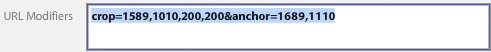

# Zuschneiden, angepasste Bilder und Zoomziele {#crop-adjusted-zoom-targets}

Eine der Hauptvorteile des Übergeordneten Bildkonzepts von Dynamic Media Classic besteht darin, dass Sie das Bild-Asset für viele Zwecke wiederverwenden können. Traditionell müssten Sie separate, zugeschnittene Versionen jedes Bildes erstellen, um Details oder Muster anzuzeigen. Bei der Verwendung von Dynamic Media Classic können Sie dieselben Aufgaben für Ihren einzelnen Übergeordnete ausführen und diese zugeschnittenen Versionen entweder als neue physische Dateien oder als virtuelle Ableitungen speichern, die keinen Speicherplatz belegen.

Am Ende dieses Abschnitts des Tutorials erfahren Sie, wie Sie:

- Beschneiden Sie Bilder in Dynamic Media Classic und speichern Sie sie als neue Übergeordnete Dateien oder als virtuelle Bilder. [Weitere Informationen](https://experienceleague.adobe.com/docs/dynamic-media-classic/using/master-files/cropping-image.html)
- Speichern Sie virtuelle angepasste Bilder und verwenden Sie sie anstelle von Übergeordneten Assets. [Weitere Informationen](https://experienceleague.adobe.com/docs/dynamic-media-classic/using/master-files/adjusting-image.html)
- Erstellen Sie Zoomziele für Ihre Bilder, um ihre Highlights anzuzeigen. [Weitere Informationen](https://experienceleague.adobe.com/docs/dynamic-media-classic/using/zoom/creating-zoom-targets-guided-zoom.html)

## Beschneiden

Dynamic Media Classic verfügt über einige Bildbearbeitungswerkzeuge, die in der Benutzeroberfläche bequem verfügbar sind, einschließlich des Zuschnitt-Tools. Sie können aus verschiedenen Gründen Ihr Übergeordnetes Bild in Dynamic Media Classic beschneiden. Beispiel:

- Sie haben keinen Zugriff auf die Originaldatei. Sie möchten das Bild mit einem anderen Zuschnitt- oder Seitenverhältnis anzeigen, aber die Originaldatei ist nicht auf Ihrem Computer vorhanden oder arbeitet von zu Hause aus. In diesem Fall können Sie Dynamic Media Classic aufrufen, das Bild suchen, beschneiden und speichern oder es als neue Version speichern.
- So entfernen Sie überschüssigen Leerraum. Das Bild wurde mit zu viel Leerraum fotografiert, wodurch das Produkt klein aussieht. Sie möchten, dass Ihre Miniaturansichten die Arbeitsfläche so weit wie möglich füllen.
- Um angepasste Bilder zu erstellen, werden virtuelle Kopien von Bildern erstellt, die keinen Speicherplatz belegen. Einige Unternehmen verfügen über Geschäftsregeln, nach denen sie separate Kopien desselben Bildes, jedoch mit einem anderen Namen, aufbewahren müssen. Oder vielleicht möchten Sie eine zugeschnittene und nicht zugeschnittene Version desselben Bildes.
- So erstellen Sie neue Bilder aus einem Quellbild. Sie können beispielsweise Farbmuster oder ein Detail des Hauptbilds erstellen. Sie können dies in Adobe Photoshop tun und separat hochladen oder das Zuschnittwerkzeug in Dynamic Media Classic verwenden.

>[!NOTE]
>
>Alle URLs in den folgenden Diskussionen zum Zuschneiden dienen nur Veranschaulichungszwecken. es sich nicht um Live-Links handelt.

### Verwenden des Zuschnittwerkzeugs

Sie können auf das Zuschnittwerkzeug in Dynamic Media Classic über die Detailseite für ein Asset oder durch Klicken auf die Schaltfläche **Bearbeiten** zugreifen. Sie können das Tool auf zwei Arten verwenden, um zuzuschneiden:

- Der standardmäßige Zuschneidemodus, in den Sie die Griffe des Zuschnittfensters ziehen oder Werte in das Feld &quot;Größe&quot;eingeben. Erfahren Sie, wie Sie [Manuelles Zuschneiden](https://experienceleague.adobe.com/docs/dynamic-media-classic/using/master-files/cropping-image.html#select-an-area-to-crop) durchführen.
- Zuschneiden. Verwenden Sie dies, um zusätzliche Leerzeichen um Ihr Bild zu entfernen, indem Sie die Anzahl der Pixel berechnen, die nicht mit Ihrem Bild übereinstimmen. Erfahren Sie, wie Sie [Zuschneiden durch Zuschneiden](https://experienceleague.adobe.com/docs/dynamic-media-classic/using/master-files/cropping-image.html#crop-to-remove-white-space-around-an-image).

### _Manuelles Zuschneiden_

Wenn Sie eine manuell zugeschnittene Version speichern, wird das Bild dauerhaft zugeschnitten. Dynamic Media Classic blendet die Pixel tatsächlich aus, indem ein interner URL-Modifikator hinzugefügt wird, um das Bild zuzuschneiden. Beim Veröffentlichen erscheint jedem, dass das Bild beschnitten wird. Sie können jedoch zum Beschneidungs-Editor zurückkehren und den Zuschnitt zu einem späteren Zeitpunkt entfernen.

Sie können dann auswählen, ob Sie als neues Übergeordnetes Bild oder als zusätzliche Ansicht des Übergeordneten speichern möchten. Ein neuer Übergeordnete ist eine neue physische Datei (wie TIFF oder JPEG), die Speicherplatz belegt. Eine zusätzliche Ansicht ist ein virtuelles Bild, das keinen Serverspeicherplatz beansprucht. Es wird nicht empfohlen, die Option Original ersetzen zu wählen, da dadurch Ihr Übergeordnete überschrieben wird und die Zuschnittfunktion dauerhaft ist. Wenn Sie als neuen Übergeordnete oder als zusätzliche Ansicht speichern, müssen Sie eine neue Asset-ID auswählen. Wie andere Asset-IDs muss es sich um einen eindeutigen Namen in Dynamic Media Classic handeln.

### _Zuschneiden_

Wenn Sie ein Bild mit zu viel Leerzeichen (zusätzliche Arbeitsfläche) um das Hauptsubjekt des Bildes hochladen, wird es im Web viel kleiner aussehen, wenn die Größe geändert wird. Dies gilt insbesondere für Miniaturansichten mit einer Größe von 150 Pixel oder kleiner. Das Thema des Fotos kann sich in dem zusätzlichen Platz um es herum verlieren.

Vergleichen Sie diese beiden Versionen desselben Bildes.

Das Bild auf der rechten Seite wird deutlich hervorgehoben, indem der zusätzliche Platz um das Produkt herum entfernt wird. Das Zuschneiden kann jeweils nur ein Bild mit dem Zuschnitt-Tool erfolgen oder beim Hochladen als Batch-Prozess ausgeführt werden. Wir empfehlen die Ausführung als Batch-Prozess, wenn Sie möchten, dass alle Bilder konsistent an die Grenzen des Hauptbetreffs zugeschnitten werden. Zuschneiden schneidet zu dem Begrenzungsrahmen zu - dem Rechteck, das das Bild umgibt.

>[!NOTE]
>
>Der Schnitt erzeugt keine Transparenz um das Bild. Dazu müssen Sie einen Beschneidungspfad in das Bild einbetten und die Upload-Option **Maske aus Beschneidungspfad erstellen** verwenden.
>
>Um ein Bild nach dem Zuschneiden wieder in den Originalzustand zu versetzen, nachdem Sie es bei Verwendung der Option **Speichern** verwendet haben, zeigen Sie das Bild im Bildschirm &quot;Zuschnitt-Editor&quot;an und wählen Sie die Schaltfläche **Zurücksetzen** aus.

### _Beschneiden beim Hochladen_

Wie bereits erwähnt, können Sie die Bilder auch beim Hochladen zuschneiden. Um beim Hochladen das Zuschneiden zu verwenden, klicken Sie auf die Schaltfläche **Auftragsoptionen** und wählen Sie unter &quot;Zuschnittsoptionen&quot;**Zuschneiden**.

Dynamic Media Classic speichert diese Option für den nächsten Upload. Möglicherweise möchten Sie, dass Bilder für diesen Upload beschnitten werden, Sie möchten jedoch möglicherweise nicht, dass sie bei jedem Upload zugeschnitten werden. Eine weitere Option wäre, einen speziellen geplanten FTP-Upload-Auftrag festzulegen und die Zuschnittoptionen dorthin zu verschieben. Auf diese Weise würden Sie den Auftrag nur ausführen, wenn Sie Ihre Bilder beschneiden müssen.

>[!IMPORTANT]
>
>Wenn Sie einen Zuschnitt für Ihren Upload festlegen, setzt Dynamic Media Classic ein Cookie, um sich diese Einstellung zum nächsten Mal zu merken. Es hat sich bewährt, vor dem nächsten Upload auf die Schaltfläche **Zurücksetzen auf Unternehmensstandardwerte** zu klicken, um die vom letzten Upload verbleibenden Zuschnittoptionen zu löschen. Andernfalls können Sie versehentlich den nächsten Stapel von Bildern beschneiden.

### Zuschneiden nach URL

Obwohl dies in Dynamic Media Classic nicht offensichtlich ist, können Sie auch nur über die URL zuschneiden (oder einer Bildvorgabe Zuschnitte hinzufügen).

Bei jeder Verwendung des Zuschnitt-Tools werden im Feld unten URL-Werte angezeigt. Sie können diese Werte aufnehmen und sie direkt als URL-Modifikator auf ein Bild anwenden.

_Befehl-Modifikatoren imageCrop am unteren Rand des Beschneidungs-Editors_

Da die Größe pro Bild berechnet werden muss, wenn Sie Zuschnitte durch Zuschneiden verwenden, kann sie nicht über die URL automatisiert werden. Das Zuschneiden kann nur beim Hochladen oder durch gleichzeitiges Anwenden eines Bildes ausgeführt werden.

### _Zuschneiden in der Bildvorgabe_

Bildvorgaben verfügen über ein Feld, in dem Sie zusätzliche Image Serving-Befehle hinzufügen können. Um Ihrer Bildvorgabe denselben Zuschnitt wie oben hinzuzufügen, bearbeiten Sie die Vorgabe, fügen Sie die Werte in das Feld URL-Modifikatoren ein oder geben Sie sie ein und speichern und veröffentlichen Sie sie.

_imageFügen Sie den URL-Modifikatoren der Bildvorgabe Zuschnittbefehle (oder einen beliebigen Befehl) hinzu._

Der Zuschnitt ist jetzt Teil dieser Bildvorgabe und wird bei jeder Verwendung automatisch angewendet. Diese Methode hängt natürlich von allen Bildern ab, die denselben Zuschnittwert benötigen. Wenn nicht alle Bilder auf die gleiche Weise aufgenommen werden, würde diese Methode nicht für Sie funktionieren.

## Angepasste Bilder

Wenn Sie das Zuschnittwerkzeug verwenden, haben Sie die Möglichkeit, **Als zusätzliche Ansicht von Übergeordnet** zu speichern. Beim Speichern wird dadurch eine neue Art von Dynamic Media Classic-Asset erstellt - ein angepasstes Bild. Ein angepasstes Bild, auch als Derivat bezeichnet, ist ein virtuelles Bild. Es ist eigentlich gar kein Bild. Es handelt sich um einen Datenbankverweis (wie einen Alias oder eine Verknüpfung) zum physischen Übergeordneten Bild.

### Wird das reale Bild bitte aufstehen`?`

Können Sie feststellen, welches das Übergeordnete und welches das angepasste Bild ist?

Sie sollten dies nicht erkennen können, ohne in Dynamic Media Classic zu suchen und den Asset-Typ &quot;Angepasstes Bild&quot;für SBR_MAIN2 anzuzeigen.

Ein angepasstes Bild belegt keinen Speicherplatz, da es nur als Zeileneintrag in der Datenbank vorhanden ist. Es ist auch dauerhaft mit dem ursprünglichen Asset verknüpft. Wenn das Original gelöscht wird, wird auch das angepasste Bild gelöscht. Sie kann aus einem ganzen, nicht zugeschnittenen Bild oder nur einem Teil eines Bildes (einem Zuschnitt) bestehen.

Normalerweise erstellen Sie angepasste Bilder mit dem Zuschnittwerkzeug. Sie können jedoch auch mit anderen Bildeditoren erstellt werden, den Tools Anpassen und Scharfzeichnen.

Für angepasste Bilder ist eine eindeutige Asset-ID erforderlich. Nach der Veröffentlichung (Sie müssen sie wie jedes andere Asset veröffentlichen) agieren sie wie jedes andere Bild und werden anhand ihrer Asset-ID für eine URL aufgerufen. Auf der Detailseite können Sie die mit einem Übergeordneten Bild verknüpften angepassten Bilder auf der Registerkarte **Built &amp; Derivatives** anzeigen.

_imageAdjusted Views for Übergeordnet image ASIAN_BR_MAIN_

## Zoomziele

Zoomziele befinden sich auch auf der Seite **Bearbeiten** und **Details** eines Bildes. Sie ermöglichen es Ihnen, &quot;Hotspots&quot;festzulegen, um bestimmte Merchandising-Funktionen eines Zoombilds hervorzuheben. Anstatt separate Bilder durch Zuschneiden eines großen Übergeordneten zu erstellen, kann der Zoom-Viewer die Details über dem Bild zusammen mit einer kurzen Beschriftung, die Sie erstellen, bereitstellen.

Da Zoom-Ziele im Wesentlichen eine Merchandising-Funktion sind und Kenntnisse über die Verkaufspunkte eines Produkts erfordern, werden sie normalerweise von einer Person im Merchandising- oder Produktteam eines Unternehmens erstellt.

Der Prozess ist sehr einfach - klicken Sie auf die Funktion, geben Sie ihr einen beschreibenden Namen und speichern Sie. Ziele können von einem Bild in ein anderes kopiert werden, wenn sie ähnlich sind. Der Prozess ist jedoch manuell. In Dynamic Media Classic gibt es keine Möglichkeit, die Erstellung von Zoomzielen zu automatisieren, da jedes Bild unterschiedlich ist und unterschiedliche Funktionen aufweist.

Ein weiterer Faktor bei der Entscheidung, ob Sie Zoomziele verwenden möchten, ist Ihre Auswahl an Viewern. Nicht alle Viewer-Typen können Zoom-Ziele anzeigen (z. B. unterstützt der Fly-out-Viewer sie nicht).

Erfahren Sie, wie Sie [Zoomziele erstellen](https://experienceleague.adobe.com/docs/dynamic-media-classic/using/zoom/creating-zoom-targets-guided-zoom.html#creating-and-editing-zoom-targets).

### Verwenden des Zoomziel-Tools

Im Folgenden finden Sie den Workflow zum Erstellen von Zielen in Dynamic Media Classic.

1. Navigieren Sie zu Ihrem Bild, klicken Sie auf die Schaltfläche **Bearbeiten** und wählen Sie **Zoomziele**.
2. Der Zoomziel-Editor wird geladen. Sie sehen Ihr Bild in der Mitte, einige Schaltflächen oben und ein leeres Zielfeld auf der rechten Seite. Unten links sehen Sie eine ausgewählte Viewer-Vorgabe. Der Standardwert ist &quot;Zoom1-Guided&quot;.
3. Bewegen Sie den roten Kasten mit der Maus und klicken Sie auf , um ein neues Ziel zu erstellen.

   - Der rote Kasten ist der Zielbereich. Wenn ein Benutzer auf dieses Ziel klickt, zoomt er in den Bereich innerhalb des Felds.
   - Die Zielgröße wird durch die Ansichtsgröße innerhalb der Viewer-Vorgabe bestimmt. Dadurch wird die Größe des Haupt-Zoombilds bestimmt. Siehe _Einstellen der Anzeigegröße_ unten.

4. Das soeben erstellte Ziel wird blau angezeigt und rechts sehen Sie eine Miniaturansicht der Zielgruppe sowie den Standardnamen &quot;target-0&quot;.
5. Um Ihre Zielgruppe umzubenennen, klicken Sie auf ihre Miniaturansicht, geben Sie einen neuen **Namen** ein und klicken Sie auf **Enter** oder **Tab**. Wenn Sie einfach auf &quot;Abbrechen&quot;klicken, wird Ihr Name nicht gespeichert.
6. Während die Zielgruppe ausgewählt ist, enthält das Feld grüne gestrichelte Linien, um die Sie die Größe ändern und verschieben können. Ziehen Sie die Ecken, um die Größe zu ändern, oder ziehen Sie das Zielfeld, um es zu verschieben.

   - Dadurch wird das Bild im standardmäßigen benutzerdefinierten Zoom-Viewer geladen. Stellen Sie sicher, dass die Viewer-Vorgabe Zoomziele unterstützt - im Allgemeinen wurden alle Standardvorgaben mit dem Wort &quot;-Guided&quot;für die Verwendung mit Zoomzielen entwickelt. Um die Ziele zu verwenden, bewegen Sie den Mauszeiger über die Miniaturansicht der Zielgruppe (oder das Hotspot-Symbol), um die Bezeichnung anzuzeigen, und klicken Sie darauf, um den Viewer auf diese Funktion zu zoomen.
   - Wie alle anderen Arbeiten, die Sie in Dynamic Media Classic durchführen, müssen Sie veröffentlichen, damit Ihre Zoomziele im Internet verfügbar sind. Wenn Sie bereits einen Viewer verwenden, der Ziele unterstützt, werden diese sofort angezeigt (sobald der Cache geleert wurde). Wenn Sie jedoch keinen für Zoom-Target aktivierten Viewer verwenden, bleiben diese ausgeblendet.

      

7. Wenn Sie ein Ziel entfernen müssen, wählen Sie es aus, indem Sie auf die Miniaturansicht klicken, und drücken Sie die Schaltfläche **Target löschen** oder drücken Sie die DELETE-Taste auf Ihrer Tastatur.
8. Klicken Sie nach dem Hinzufügen weiterhin auf , um neue Ziele hinzuzufügen, umzubenennen und/oder die Größe zu ändern.
9. Wenn Sie fertig sind, klicken Sie auf die Schaltfläche **Speichern** und dann auf **Vorschau**.

### Festlegen der Anzeigegröße in der Zoom-Viewer-Vorgabe

Sprechen wir einen Moment darüber, woher die Größe der Zoomziele stammt. Innerhalb der Viewer-Vorgabe für Ihren Zoom-Viewer befindet sich eine Einstellung namens &quot;Anzeigegröße&quot;. Die Anzeigegröße entspricht der Größe des Zoombilds im Viewer. Sie unterscheidet sich von der Anzeigegröße, d. h. der Gesamtgröße Ihres Viewers, einschließlich der Benutzeroberflächen-Komponenten und der Grafik.

Wenn Sie ein neues Ziel erstellen, leitet es dessen Größe und Seitenverhältnis von der Ansichtsgröße ab. Wenn Ihre Anzeigegröße beispielsweise 200 x 200 beträgt, können Sie nur quadratische Ziele mit einem maximalen Zoombereich von 200 Pixel erstellen. Ihre Ziele können größer als 200 Pixel sein, jedoch immer quadratisch sein. Das bedeutet aber auch, dass das Bild in Ihrem Zoom-Viewer nur 200 Pixel hat - die Größe des Zoomziels hat einen direkten Bezug zur Größe Ihres Viewers. Sie würden also zunächst über Ihr Viewer-Design entscheiden, bevor Sie Ziele festlegen.

Standardmäßig ist die Anzeigegröße jedoch leer (auf 0 x 0 eingestellt), da die Größe des Hauptansichtsbilds dynamisch ist und automatisch entsprechend der Größe der Bühne abgeleitet wird. Das Problem besteht darin, dass das Zoomziel-Tool nicht weiß, welche Größe die Ziele haben sollen, wenn Sie in Ihrer Vorgabe keine explizite Anzeigegröße festlegen.

Wenn Sie das Zoomziel-Tool laden, wird die Anzeigegröße neben dem Namen der Vorgabe angezeigt. Vergleichen Sie die Anzeigegröße zwischen der integrierten Zoom1-Guided-Vorgabe und der benutzerdefinierten ZT_AUTHORING-Vorgabe.

Sie können sehen, dass die integrierte Vorgabe eine Größe von 900 x 550 hat, was bedeutet, dass das Ziel nie kleiner werden kann als diese eher große. Das ist wahrscheinlich zu groß. Wenn Sie ein 2000-Pixel-Bild haben, können Sie nur eine Funktion aufrufen, die mindestens 900 Pixel breit ist. Der Benutzer kann manuell weiter zoomen, aber Sie können ihn nicht näher führen. Wenn Sie die Anzeigegröße auf 350 x 350 festlegen, können Ziele ziemlich nah heranzoomen oder die Größe vergrößern. Wenn Sie jedoch ein größeres Zoombild in Ihrem Viewer wünschen, müssen Sie eine neue Vorgabe erstellen, da Ihre mit 350 Pixel gesperrt ist.

### Erstellen oder Bearbeiten einer Viewer-Vorgabe, die Zoomziele unterstützt

Um die Anzeigegröße festzulegen, erstellen oder bearbeiten Sie eine Viewer-Vorgabe, die Zoomziele unterstützt.

1. Wechseln Sie in der Viewer-Vorgabe zur Option **Zoom-Einstellungen** .
2. Legen Sie eine Breite und Höhe fest.
3. Speichern Sie die Vorgabe und schließen Sie sie. Wenn Sie diese Vorgabe auf Ihrer Live-Site verwenden möchten, müssen Sie später auch veröffentlichen.
4. Wählen Sie im Zoomziel-Tool unten links die bearbeitete Vorgabe aus. Sie sehen sofort die neue Ansichtsgröße, die in Ihren Zielen angezeigt wird.
