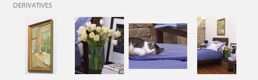

# Beschneiden, Anpassen von Zielgruppen und Zoomen {#crop-adjusted-zoom-targets}

Eine der Hauptvorteile des Dynamic Media Classic Übergeordnet Image-Konzepts besteht darin, dass Sie das Bild-Asset für viele Zwecke wiederverwenden können. Traditionell müssen Sie separate, zugeschnittene Versionen jedes Bildes erstellen, um Details oder Muster anzuzeigen. Bei Verwendung von Dynamic Media Classic können Sie die gleichen Aufgaben auf Ihrem einzigen Übergeordnete ausführen und diese zugeschnittenen Versionen entweder als neue physische Dateien oder als virtuelle Ableitungen speichern, die keinen Platz für die Datenspeicherung benötigen.

Am Ende dieses Abschnitts des Tutorials erfahren Sie, wie:

- Beschneiden Sie Bilder in Dynamic Media Classic und speichern Sie sie als neue Übergeordnet- oder als virtuelle Bilder. [Weitere Informationen](https://docs.adobe.com/help/en/dynamic-media-classic/using/master-files/cropping-image.html)
- Speichern Sie virtuelle Angepasste Bilder und verwenden Sie sie anstelle von Übergeordnet-Assets. [Weitere Informationen](https://docs.adobe.com/content/help/en/dynamic-media-classic/using/master-files/adjusting-image.html)
- Erstellen Sie Zoom-Zielgruppen auf Ihren Bildern, um deren Highlights anzuzeigen. [Weitere Informationen](https://docs.adobe.com/content/help/en/dynamic-media-classic/using/zoom/creating-zoom-targets-guided-zoom.html)

## Beschneiden

Dynamic Media Classic verfügt über einige Bildbearbeitungswerkzeuge, die in der Benutzeroberfläche bequem verfügbar sind, einschließlich des Beschneidungswerkzeugs. Aus verschiedenen Gründen möchten Sie möglicherweise Ihr Übergeordnet-Image in Dynamic Media Classic beschneiden. Beispiel:

- Sie haben keinen Zugriff auf die Originaldatei. Sie möchten das Bild mit einem anderen Zuschnitt- oder Seitenverhältnis anzeigen, haben aber nicht die Originaldatei auf Ihrem Computer oder arbeiten von zu Hause aus. In diesem Fall können Sie zu Dynamic Media Classic gehen, das Bild suchen, es beschneiden und speichern oder es als neue Version speichern.
- So entfernen Sie überschüssigen Leerraum. Das Bild wurde mit zu viel weißem Raum fotografiert, wodurch das Produkt klein aussieht. Sie möchten, dass Ihre Miniaturbilder die Arbeitsfläche so gut wie möglich ausfüllen.
- Um angepasste Bilder zu erstellen, verwenden Sie virtuelle Kopien von Bildern, die keinen Speicherplatz benötigen. Einige Firmen verfügen über Geschäftsregeln, nach denen sie separate Kopien desselben Bildes mit einem anderen Namen aufbewahren müssen. Oder Sie möchten vielleicht eine beschnittene und unbeschnittene Version desselben Bildes.
- So erstellen Sie neue Bilder aus einem Quellbild. Sie können beispielsweise Farbfelder oder Details des Hauptbilds erstellen. Sie können dies in Adobe Photoshop tun und separat hochladen oder das Werkzeug &quot;Beschneiden&quot;in Dynamic Media Classic verwenden.

>[!NOTE]
>
>Sämtliche URLs in den folgenden Diskussionen über das Beschneiden dienen nur zu Veranschaulichungszwecken; es handelt sich nicht um Live-Links.

### Verwenden des Beschneidungswerkzeugs

Sie können auf das Beschneidungswerkzeug in Dynamic Media Classic von der Seite &quot;Details&quot;für ein Asset oder über die Schaltfläche **Bearbeiten** zugreifen. Sie können das Werkzeug auf zwei Arten beschneiden:

- Der Standard-Beschneidungsmodus, in dem Sie die Griffe des Beschneidungsfensters oder die Typwerte im Feld &quot;Größe&quot;ziehen. Erfahren Sie, wie Sie [Manuelles Zuschneiden](https://docs.adobe.com/content/help/en/dynamic-media-classic/using/master-files/cropping-image.html#select-an-area-to-crop) durchführen.
- Beschneiden. Verwenden Sie diese Option, um zusätzliche Leerzeichen um Ihr Bild zu entfernen, indem Sie die Anzahl der Pixel berechnen, die nicht mit Ihrem Bild übereinstimmen. Erfahren Sie, wie Sie [Beschneiden nach Beschneiden](https://docs.adobe.com/content/help/en/dynamic-media-classic/using/master-files/cropping-image.html#crop-to-remove-white-space-around-an-image).

### _Manuelles Beschneiden_

Wenn Sie eine manuell zugeschnittene Version speichern, wird das Bild dauerhaft abgeschnitten. Dynamic Media Classic blendet die Pixel aus, indem ein interner URL-Modifikator zum Beschneiden des Bilds hinzugefügt wird. Wenn Sie veröffentlichen, wird jedem angezeigt, dass das Bild beschnitten wird. Sie können jedoch zum Beschneidungseditor zurückkehren und die Beschneidung zu einem späteren Zeitpunkt entfernen.

Sie können dann auswählen, ob Sie das Bild als neues Übergeordnet oder als zusätzliche Ansicht des Übergeordneten speichern möchten. Ein neuer Übergeordnete ist eine neue physische Datei (wie TIFF oder JPEG), die Platz für die Datenspeicherung benötigt. Eine zusätzliche Ansicht ist ein virtuelles Bild, das keinen Serverraum belegt. Es wird nicht empfohlen, die Option &quot;Original ersetzen&quot;zu wählen, da dadurch Ihr Übergeordnete überschrieben wird und die Ernte dauerhaft ist. Wenn Sie als neuer Übergeordnete oder als zusätzliche Ansicht speichern, müssen Sie eine neue Asset-ID wählen. Wie andere Asset-IDs muss dies ein eindeutiger Name in Dynamic Media Classic sein.

### _Beschneiden_

Wenn Sie ein Bild mit zu viel Whitespace (zusätzliche Arbeitsfläche) um das Hauptfach des Bilds hochladen, wird es im Web bei der Größenanpassung viel kleiner aussehen. Dies gilt insbesondere für Miniaturbilder mit einer Größe von 150 Pixel oder weniger — Das Thema des Fotos kann sich in dem zusätzlichen Platz um es herum verlieren.

Vergleichen Sie diese beiden Versionen desselben Bildes.

Das Bild auf der rechten Seite wird deutlich hervorgehoben, indem der zusätzliche Platz um das Produkt herum entfernt wird. Das Beschneiden kann mit dem Beschneidungswerkzeug einzeln oder als Batch-Vorgang beim Hochladen durchgeführt werden. Es wird empfohlen, als Batch-Prozess auszuführen, wenn alle Bilder konsistent an die Grenzen des Hauptfachs abgeschnitten werden sollen. Beschneiden bis zum Begrenzungsrahmen — das Rechteck, das das Bild umgibt.

>[!NOTE]
>
>&quot;Beschneiden&quot;schafft keine Transparenz um das Bild. Dazu müssen Sie einen Beschneidungspfad in das Bild einbetten und die Upload-Option **Maske aus Clip-Pfad erstellen** verwenden.
>
>Um ein Bild nach dem Beschneiden wieder in seinen ursprünglichen Zustand zu versetzen, nachdem Sie die Option **Speichern** verwendet haben, zeigen Sie das Bild im Anzeigebereich &quot;Beschneidungseditor&quot;an und klicken Sie auf die Schaltfläche **Zurücksetzen**.

### _Beschneiden beim Hochladen_

Wie bereits erwähnt, können Sie die Bilder beim Hochladen auch beschneiden. Um beim Hochladen den Zuschnitt zu verwenden, klicken Sie auf die Schaltfläche **Auftragsoptionen** und wählen Sie unter &quot;Zuschnittoptionen&quot;die Option **Zuschneiden**.

Diese Option wird beim nächsten Hochladen von Dynamic Media Classic gespeichert. Möglicherweise möchten Sie, dass Bilder für diesen Upload beschnitten werden, jedoch nicht bei jedem Upload zugeschnitten werden. Eine andere Möglichkeit wäre, einen speziellen geplanten FTP-Upload-Auftrag festzulegen und die Optionen für das Beschneiden dorthin zu verschieben. Auf diese Weise würden Sie den Auftrag nur ausführen, wenn Sie Ihre Bilder beschneiden müssten.

>[!IMPORTANT]
>
>Wenn Sie eine Beschneidung für Ihren Upload festlegen, setzt Dynamic Media Classic ein Cookie, um sich diese Einstellung zum nächsten Mal zu merken. Als Best Practice sollten Sie vor dem nächsten Hochladen auf die Schaltfläche **Zurücksetzen auf Firmen-Standardwerte** klicken, um alle beim letzten Hochladen verbleibenden Beschneidungsoptionen zu löschen. Andernfalls können Sie versehentlich den nächsten Bildstapel beschneiden.

### Beschneiden nach URL

Auch wenn dies in Dynamic Media Classic nicht offensichtlich ist, können Sie auch nur über die URL zuschneiden (oder einer Bildvorgabe sogar zuschneiden).

Wenn Sie das Werkzeug &quot;Beschneiden&quot;verwenden, werden im Feld unten URL-Werte angezeigt. Sie können diese Werte als URL-Modifikatoren direkt auf ein Bild anwenden.

_den Befehl &quot;imageCrop&quot;am unteren Rand des Beschneidungseditors_

Da die Größe beim Zuschneiden per Bild berechnet werden muss, kann sie nicht über die URL automatisiert werden. Beschneiden kann nur beim Hochladen oder durch einmaliges Anwenden ausgeführt werden.

### _Beschneiden in der Bildvorgabe_

Bildvorgaben verfügen über ein Feld, in dem Sie zusätzliche Image-Server-Befehle hinzufügen können. Um der Bildvorgabe die gleiche Beschneidung wie oben hinzuzufügen, bearbeiten Sie die Vorgabe und fügen Sie die Werte in das Feld &quot;URL-Modifikatoren&quot;ein und speichern und veröffentlichen Sie sie.

_den URL-Modifikatoren der Bildvorgabe Zuschneidebefehle (oder einen beliebigen Befehl) hinzu._

Die Beschneidung ist nun Teil dieser Bildvorgabe und wird bei jeder Verwendung automatisch angewendet. Diese Methode hängt natürlich von allen Bildern ab, die denselben Beschneidungsbetrag benötigen. Wenn Ihre Bilder nicht alle auf dieselbe Weise aufgenommen werden, funktioniert diese Methode nicht für Sie.

## Angepasste Bilder

Wenn Sie das Werkzeug &quot;Beschneiden&quot;verwenden, haben Sie die Option **Als zusätzliche Ansicht von Übergeordnet** speichern. Beim Speichern wird dadurch eine neue Art von Dynamisches Media Classic-Asset erstellt — ein angepasstes Bild. Ein angepasstes Bild, auch als Derivat bezeichnet, ist ein virtuelles Bild. Es ist eigentlich gar kein Bild; Es handelt sich um einen Datenbankverweis (wie ein Alias oder eine Verknüpfung) auf das physische Übergeordnet-Bild.

### Wird das tatsächliche Bild bitte stehen`?`

Können Sie feststellen, welches das angepasste Bild ist und welches das Übergeordnete ist?

Sie sollten dies nicht erkennen können, ohne in Dynamic Media Classic zu sehen und den Asset-Typ &quot;Angepasstes Bild&quot;für SBR_MAIN2 anzuzeigen.

Ein angepasstes Bild verwendet keinen Speicherplatz, da es nur als Zeilenelement in der Datenbank vorhanden ist. Er ist auch dauerhaft an den ursprünglichen Vermögenswert gebunden. Wenn das Original gelöscht wird, wird auch das angepasste Bild gelöscht. Es kann aus einem ganzen, unbeschnittenen Bild oder nur einem Teil eines Bilds (einer Beschneidung) bestehen.

In der Regel erstellen Sie angepasste Bilder mit dem Werkzeug &quot;Beschneiden&quot;. sie können jedoch auch mit anderen Bildeditoren erstellt werden — die Werkzeuge &quot;Anpassen&quot;und &quot;Scharfzeichnen&quot;.

Für angepasste Bilder ist eine eindeutige Asset-ID erforderlich. Nach der Veröffentlichung (Sie müssen sie wie jedes andere Asset veröffentlichen) fungieren sie als jedes andere Bild und werden anhand ihrer Asset-ID für eine URL aufgerufen. Auf der Seite &quot;Details&quot;können Sie unter der Registerkarte **Aufbau und Ableitungen** die mit einem Übergeordnet verknüpften Ansichten anpassen.

_für Übergeordnet-Image ASIAN_BR_MAIN_

## Zoom-Zielgruppen

Zoom-Zielgruppen befinden sich auch auf der Seite **Bearbeiten** und **Details** eines Bildes. Damit können Sie Hotspots festlegen, um bestimmte Merchandising-Funktionen eines Zoombilds hervorzuheben. Statt separate Bilder zu erstellen, indem ein großer Übergeordnete beschnitten wird, kann der Zoom-Viewer die Details auf dem Bild zusammen mit einer kurzen Beschriftung, die Sie erstellen, auffüllen.

Da Zoom-Zielgruppen im Wesentlichen eine Merchandising-Funktion sind und Kenntnisse über die Verkaufspunkte eines Produkts erfordern, würden sie normalerweise von einer Person im Merchandising- oder Produktteam zu einer Firma erstellt.

Der Prozess ist sehr einfach — Klicken Sie auf die Funktion, geben Sie ihr einen beschreibenden Namen und speichern Sie sie. Zielgruppen können von einem Bild in ein anderes kopiert werden, wenn sie ähnlich sind. Es handelt sich dabei jedoch um eine manuelle Kopie. In Dynamic Media Classic gibt es keine Möglichkeit, die Erstellung von Zoom-Zielgruppen zu automatisieren, da jedes Bild unterschiedlich ist und unterschiedliche Funktionen aufweist.

Ein weiterer Faktor bei der Entscheidung, ob Sie Zoom-Zielgruppen verwenden möchten, ist Ihre Auswahl an Viewern. Nicht alle Viewer-Typen können Zoom-Zielgruppen anzeigen (z. B. unterstützt der Flyout-Viewer sie nicht).

Erfahren Sie, wie Sie [Zoom-Zielgruppen ](https://docs.adobe.com/content/help/en/dynamic-media-classic/using/zoom/creating-zoom-targets-guided-zoom.html#creating-and-editing-zoom-targets) erstellen.

### Verwenden der Zoom-Zielgruppe

Im Folgenden finden Sie den Arbeitsablauf zum Erstellen von Zielgruppen in Dynamic Media Classic.

1. Navigieren Sie zu Ihrem Bild, klicken Sie auf die Schaltfläche **Bearbeiten** und wählen Sie **Zoom-Zielgruppen**.
2. Der Zoom-Zielgruppe-Editor wird geladen. Sie sehen Ihr Bild in der Mitte, einige Schaltflächen oben und ein leeres Zielgruppe-Bedienfeld rechts. In der linken unteren Ecke sehen Sie eine ausgewählte Viewer-Vorgabe. Die Standardeinstellung ist &quot;Zoom1-Guided&quot;.
3. Bewegen Sie den roten Kasten mit der Maus und klicken Sie auf , um eine neue Zielgruppe zu erstellen.

   - Der rote Kasten ist der Bereich der Zielgruppe. Wenn ein Benutzer auf diese Zielgruppe klickt, wird er auf den Bereich innerhalb des Felds heranzoomen.
   - Die Größe der Zielgruppe wird durch die Größe der Ansicht in der Viewer-Vorgabe bestimmt. Dadurch wird die Größe des Hauptzoombilds bestimmt. Siehe _Einstellen der Ansicht_, unten.

4. Sie sehen die soeben erstellte Zielgruppe blau, und rechts sehen Sie eine Miniaturansicht der Zielgruppe sowie den Standardnamen &quot;Zielgruppe-0&quot;.
5. Um Ihre Zielgruppe umzubenennen, klicken Sie auf ihre Miniaturansicht, geben Sie einen neuen **Name** ein und klicken Sie auf **Geben Sie** oder **Registerkarte** — Wenn Sie einfach auf &quot;Weiter&quot; klicken, wird Ihr Name nicht gespeichert.
6. Während die Zielgruppe ausgewählt ist, werden an dem Feld grüne gestrichelte Linien angezeigt. Sie können die Größe ändern und verschieben. Ziehen Sie die Ecken, um die Größe zu ändern, oder ziehen Sie das Feld &quot;Zielgruppe&quot;, um es zu verschieben.

   - Dadurch wird das Bild im standardmäßigen benutzerdefinierten Zoom-Viewer geladen. Vergewissern Sie sich, dass die Viewer-Vorgabe Zoom-Zielgruppen unterstützt — Im Allgemeinen wurden alle Standardvorgaben mit dem Wort &quot;-Guided&quot;für die Verwendung mit Zoom-Zielgruppen entwickelt. Um die Zielgruppen zu verwenden, halten Sie den Mauszeiger über die Miniaturansicht der Zielgruppe (oder das Hotspot-Symbol), um die Beschriftung anzuzeigen, und klicken Sie darauf, um den Viewer auf diese Funktion heranzoomen.
   - Wie alle anderen Arbeiten, die Sie in Dynamic Media Classic ausführen, müssen Sie auch diese veröffentlichen, damit die Zoom-Zielgruppen im Web live geschaltet werden können. Wenn Sie bereits einen Viewer verwenden, der Zielgruppen unterstützt, werden diese sofort angezeigt (nachdem der Cache geleert wurde). Wenn Sie jedoch keinen Viewer mit aktivierter Zoom-Zielgruppe verwenden, bleiben diese ausgeblendet.

      

7. Wenn Sie eine Zielgruppe entfernen müssen, wählen Sie sie aus, indem Sie auf die Miniaturansicht klicken und dann die Taste **Zielgruppe löschen** drücken oder die Taste DELETE drücken.
8. Klicken Sie nach dem Hinzufügen auf , um neue Zielgruppen hinzuzufügen, umzubenennen und/oder die Größe zu ändern.
9. Klicken Sie abschließend auf die Schaltfläche **Speichern** und dann auf **Vorschau**.

### Einstellen der Größe der Ansicht in der Zoom-Viewer-Vorgabe

Sprechen wir einen Moment darüber, woher die Größe der Zoom-Zielgruppen kommt. Innerhalb der Viewer-Vorgabe für Ihren Zoom-Viewer befindet sich eine Einstellung namens &quot;Größe der Ansicht&quot;. Die Größe der Ansicht entspricht der Größe des Zoombilds im Viewer. Es unterscheidet sich von der Anzeigegröße, d. h. der Gesamtgröße des Viewers, einschließlich der Komponenten der Benutzeroberfläche und der Grafik.

Wenn Sie eine neue Zielgruppe erstellen, wird deren Größe und Seitenverhältnis von der Größe der Ansicht abgeleitet. Wenn die Ansicht beispielsweise 200 x 200 groß ist, können Sie nur quadratische Zielgruppen mit einem maximalen Zoombereich von 200 Pixel erstellen. Ihre Zielgruppen können größer als 200 Pixel sein, jedoch immer quadratisch. Das bedeutet aber auch, dass das Bild im Zoom-Viewer nur 200 Pixel groß ist — Die Größe der Zoom-Zielgruppe steht in direktem Zusammenhang mit der Größe des Viewers. Sie entscheiden also zuerst über Ihr Viewer-Design, bevor Sie Zielgruppen festlegen.

Standardmäßig ist die Ansicht jedoch leer (auf 0 x 0 eingestellt), da die Größe des Hauptbilds dynamisch ist und automatisch entsprechend der Größe der Ansicht abgeleitet wird. Wenn Sie in der Vorgabe nicht explizit die Größe der Ansicht festlegen, weiß das Werkzeug für die Zoomgröße nicht, in welcher Zielgruppe die Zielgruppen vorgenommen werden sollen.

Wenn Sie das Werkzeug &quot;Zoom-Zielgruppe&quot;laden, wird die Größe der Ansicht neben dem Namen der Vorgabe angezeigt. Vergleichen Sie die Größe der Ansicht zwischen der integrierten Zoom1-Guided-Vorgabe und der benutzerdefinierten ZT_AUTHORING-Vorgabe.

Sie können sehen, dass die integrierte Vorgabe eine Größe von 900 x 550 hat, was bedeutet, dass die Zielgruppe nie kleiner werden kann als diese ziemlich große. Das ist wahrscheinlich zu groß — Wenn Sie ein 2000-Pixel-Bild haben, können Sie nur eine Funktion aufrufen, die mindestens 900 Pixel breit ist. Der Benutzer kann manuell weiter zoomen, aber Sie können sie nicht näher heranführen. Wenn Sie die Ansicht auf 350 x 350 einstellen, können Zielgruppen ziemlich genau heranzoomen oder die Größe vergrößern. Wenn Sie jedoch ein größeres Zoombild in Ihrem Viewer wünschen, müssen Sie eine neue Vorgabe erstellen, da Ihre mit 350 Pixeln gesperrt ist.

### Erstellen oder Bearbeiten einer Viewer-Vorgabe, die Zoom-Zielgruppen unterstützt

Um die Größe der Ansicht festzulegen, erstellen oder bearbeiten Sie eine Viewer-Vorgabe, die Zoom-Zielgruppen unterstützt.

1. Wechseln Sie in der Viewer-Vorgabe zur Option **Zoomeinstellungen**.
2. Legen Sie Breite und Höhe fest.
3. Speichern Sie die Vorgabe und schließen Sie sie. Wenn Sie diese Vorgabe auf Ihrer Live-Site verwenden möchten, müssen Sie später auch veröffentlichen.
4. Gehen Sie zum Zoom-Zielgruppe-Werkzeug und wählen Sie unten links die bearbeitete Vorgabe aus. Die neue Ansicht wird sofort in Ihren Zielgruppen angezeigt.
