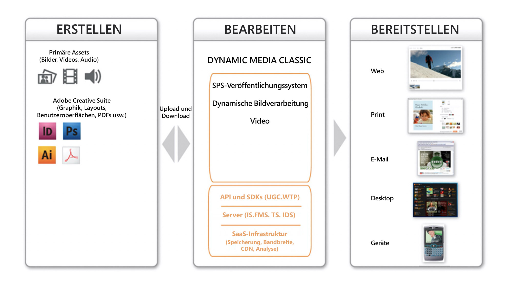
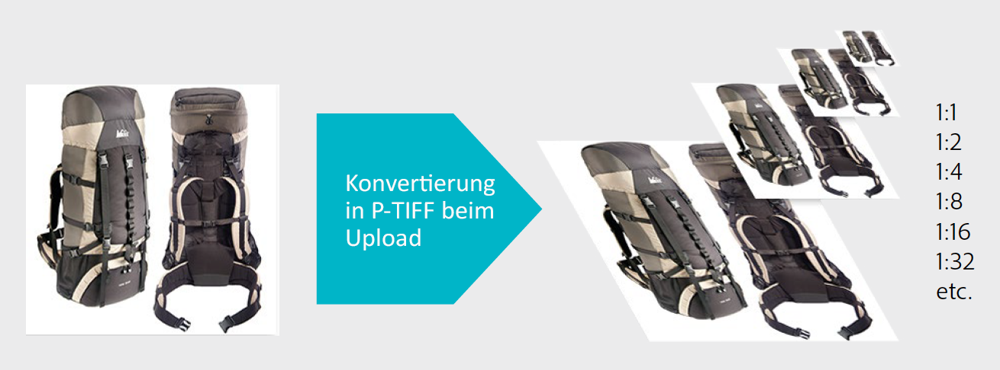
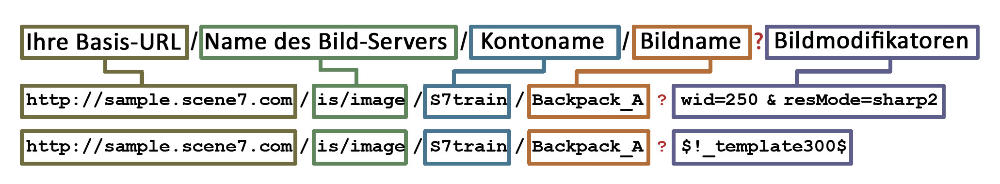

# Dynamic Media Classic Hauptarbeitsablauf und Anzeigen einer Asset-Vorschau {#main-workflow}

Dynamic Media unterstützt Arbeitsabläufe zum Erstellen (und Hochladen), Verfassen (und Veröffentlichen) und Bereitstellen. Beginn werden durch Hochladen von Assets und anschließende Bearbeitung dieser Assets erstellt, z. B. durch Erstellen eines Bildsatzes und schließlich durch Veröffentlichen, um sie zu aktivieren. Der Schritt &quot;Erstellen&quot;ist für einige Workflows optional. Wenn Ihr Ziel beispielsweise darin besteht, nur Bilder dynamisch zu vergrößern oder Videos für das Streaming zu konvertieren und zu veröffentlichen, gibt es keine erforderlichen Erstellungsschritte.

Der Arbeitsablauf in Dynamic Media Classic-Lösungen umfasst drei Hauptschritte:

1. SourceContent erstellen (und hochladen)
2. Assets erstellen (und veröffentlichen)
3. Bereitstellen von Assets

## Schritt 1: Erstellen (und Hochladen)

Dies ist der Anfang des Workflows. In diesem Schritt erfassen oder erstellen Sie den Quellinhalt, der in den verwendeten Workflow passt, und laden ihn in Dynamic Media Classic hoch. Das System unterstützt mehrere Dateitypen für Bilder, Videos und Schriftarten, aber auch für PDF, Adobe Illustrator und Adobe InDesign.

Siehe die vollständige Liste von [Unterstützte Dateitypen](https://docs.adobe.com/content/help/en/dynamic-media-classic/using/upload-publish/uploading-files.html#supported-asset-file-formats).

Sie können Quellinhalte auf verschiedene Arten hochladen:

- Direkt vom Desktop oder lokalen Netzwerk aus. [Erfahren Sie, wie](https://docs.adobe.com/content/help/en/dynamic-media-classic/using/upload-publish/uploading-files.html#upload-files-using-sps-desktop-application).
- Von einem Dynamic Media Classic FTP-Server. [Erfahren Sie, wie](https://docs.adobe.com/content/help/en/dynamic-media-classic/using/upload-publish/uploading-files.html#upload-files-using-via-ftp).

Der Standardmodus ist &quot;Von Desktop&quot;, in dem Sie nach Dateien im lokalen Netzwerk suchen und den Upload-Beginn ausführen.

>[!TIP]
>
>Fügen Sie Ihre Ordner nicht manuell hinzu. Führen Sie stattdessen einen Upload über FTP aus und verwenden Sie die Option **Unterordner** einschließen, um Ihre Ordnerstruktur in Dynamic Media Classic neu zu erstellen.

Die beiden wichtigsten Upload-Optionen sind standardmäßig aktiviert — **Zur Veröffentlichung markieren**, was wir bereits besprochen haben, und **Überschreiben**. Überschreiben bedeutet, dass die neue Datei die vorhandene Version ersetzt, wenn die hochgeladene Datei denselben Namen wie eine bereits im System vorhandene Datei hat. Wenn Sie diese Option deaktivieren, wird die Datei möglicherweise nicht hochgeladen.

### Optionen beim Hochladen von Bildern überschreiben

Es gibt vier Varianten der Option &quot;Bild überschreiben&quot;, die für die gesamte Firma festgelegt werden können, und diese werden häufig missverstanden. Kurz gesagt: Sie legen die Regeln so fest, dass Assets mit demselben Namen häufiger überschrieben werden sollen, oder Sie möchten, dass Überschreibungen seltener auftreten (in diesem Fall wird das neue Bild mit der Erweiterung &quot;-1&quot;oder &quot;-2&quot;umbenannt).

- **Im aktuellen Ordner überschreiben, Name/Erweiterung** des Basisbilds. Diese Option ist die strengste Ersatzregel. Das Ersatzbild muss in den Ordner des Originalbilds hochgeladen werden und dieselbe Dateierweiterung haben wie das Originalbild. Wenn diese Voraussetzungen nicht erfüllt sind, wird ein Duplikat erstellt.

- **Im aktuellen Ordner den gleichen Asset-Namen unabhängig von der Erweiterung** überschreiben.
Erfordert, dass Sie das Ersatzbild in denselben Ordner wie das Original hochladen, die Dateinamenerweiterung kann jedoch vom Original abweichen. Beispielsweise ersetzt &quot;Sessel.tif&quot;die Datei &quot;Sessel.jpg&quot;.

- **Überschreiben Sie in einem beliebigen Ordner denselben Asset-Namen/dieselbe Erweiterung**. Erfordert, dass das Ersatzbild dieselbe Dateinamenerweiterung wie das Originalbild hat (z. B. muss &quot;Sessel.jpg&quot;die Datei &quot;Sessel.jpg&quot;ersetzen, nicht &quot;Sessel.tif&quot;). Sie können das Ersatzbild jedoch in einen anderen Ordner hochladen als den, in dem sich das Original befindet. Das hochgeladene Bild bleibt dann im neuen Ordner; die Datei befindet sich also nicht mehr am ursprünglichen Speicherort..

- **Überschreiben Sie in jedem Ordner denselben Asset-Namen, unabhängig von der Erweiterung**. Diese Option ist die am meisten einschließende Ersatzregel. Sie können ein Ersatzbild in einen anderen Ordner hochladen als den, in dem sich das Originalbild befindet, und eine Datei mit einer anderen Dateierweiterung verwenden, um die Originaldatei zu ersetzen. Wenn sich die Originaldatei in einem anderen Ordner befindet, bleibt das Ersatzbild in dem neuen Ordner, in den es hochgeladen wurde.

Erfahren Sie mehr über die Option [Bilder überschreiben](https://docs.adobe.com/content/help/en/dynamic-media-classic/using/setup/application-setup.html#using-the-overwrite-images-option).

Obwohl dies nicht erforderlich ist, können Sie beim Hochladen mit einer der beiden oben genannten Methoden Auftragsoptionen für den jeweiligen Upload angeben — — Um beispielsweise einen wiederkehrenden Upload zu planen, legen Sie beim Hochladen Optionen für das Beschneiden fest und viele andere Optionen. Diese können für einige Workflows nützlich sein, daher lohnt es sich zu überlegen, ob sie für Sie sein können.

Erfahren Sie mehr über [Auftragsoptionen](https://docs.adobe.com/content/help/en/dynamic-media-classic/using/upload-publish/uploading-files.html#upload-options).

Das Hochladen ist der erste notwendige Schritt in einem Workflow, da Dynamic Media Classic nicht mit Inhalten arbeiten kann, die sich noch nicht im System befinden. Hinter den Kulissen beim Hochladen registriert das System jedes hochgeladene Asset mit der zentralen Dynamic Media Classic-Datenbank, weist eine ID zu und kopiert es in die Datenspeicherung. Darüber hinaus konvertiert das System Bilddateien in ein Format, das eine dynamische Größenanpassung und Zoom ermöglicht, und konvertiert Videodateien in das webfreundliche Format MP4.

### Konzept: Folgendes passiert mit Bildern, wenn Sie sie in Dynamic Media Classic hochladen

Wenn Sie ein Bild eines beliebigen Typs in Dynamic Media Classic hochladen, wird es in das Übergeordnet-Bildformat Pyramid TIFF oder P-TIFF konvertiert. Ein P-TIFF ähnelt dem Format eines TIFF-Bitmapbilds mit Ebenen, allerdings enthält die Datei anstelle verschiedener Ebenen mehrere Größen (Auflösungen) desselben Bildes.

Während der Bildkonvertierung erstellt Dynamic Media Classic einen &quot;Schnappschuss&quot;der Bildgröße, skaliert ihn um die Hälfte und speichert ihn, skaliert ihn erneut um die Hälfte und speichert ihn usw., bis er mit mehreren Originalgrößen gefüllt ist. Ein P-TIFF mit 2000 Pixel hat beispielsweise die Größen 1000, 500, 250 und 125 Pixel (und kleiner) in derselben Datei. Die P-TIFF-Datei ist das Format des so genannten &quot;Übergeordnet image&quot;in Dynamic Media Classic.

Wenn Sie ein Bild in einer bestimmten Größe anfordern, kann der Image-Server für Dynamic Media Classic beim Erstellen des P-TIFF schnell die nächste größere Größe finden und herunterskalieren. Wenn Sie beispielsweise ein 2000-Pixel-Bild hochladen und ein 100-Pixel-Bild anfordern, findet Dynamic Media Classic die 125-Pixel-Version und skaliert sie auf 100 Pixel, anstatt von 2000 auf 100 Pixel zu skalieren. Das macht die Operation sehr schnell. Wenn ein Bild gezoomt wird, kann der Zoom-Viewer darüber hinaus nur eine Kachel des gezoomten Bilds anfordern und nicht das gesamte Bild mit voller Auflösung. So unterstützt das Übergeordnet-Bildformat, die P-TIFF-Datei, sowohl dynamische Größen- als auch Zoomfunktionen.

Ebenso können Sie Ihr Übergeordnet-Quellvideo in Dynamic Media Classic hochladen und Dynamic Media Classic kann es beim Hochladen automatisch anpassen und in das webfreundliche MP4-Format konvertieren.

### Regeln für die Bestimmung der optimalen Größe für die hochgeladenen Bilder

**Hochladen von Bildern in der benötigten Größe**

- Wenn Sie zoomen müssen, laden Sie ein hochauflösendes Bild mit einer maximalen Auflösung von 1500 bis 2500 Pixel hoch. Berücksichtigen Sie, wie viele Details Sie angeben möchten, die Qualität der Quellbilder und die Größe des angezeigten Produkts. Laden Sie beispielsweise ein Bild mit 1000 Pixel für einen kleinen Ring hoch, jedoch ein Bild mit 3000 Pixel für eine ganze Raumzelle.
- Wenn Sie nicht zoomen müssen, laden Sie es in der exakten Größe hoch, die angezeigt wird. Wenn Sie z. B. Logos oder Begrüßungs-/Bannerbilder auf Ihren Seiten platzieren möchten, laden Sie diese exakt in der Größe 1:1 hoch und rufen Sie sie genau in dieser Größe auf.

**Laden Sie Ihre Bilder niemals hoch oder blasen Sie sie auf, bevor Sie sie in Dynamic Media Classic hochladen.** Nehmen Sie beispielsweise keine Neuberechnung eines kleineren Bildes vor, um daraus ein Bild mit 2000 Pixel zu machen. Es wird nicht gut aussehen. Machen Sie Ihre Bilder vor dem Hochladen möglichst perfekt.

**Es gibt keine Mindestgröße für Zoom, aber die Viewer werden standardmäßig nicht größer als 100 % zoomen.** Wenn Ihr Bild zu klein ist, wird es überhaupt nicht vergrößert oder nur eine winzige Menge gezoomt, um zu verhindern, dass es schlecht aussieht.

**Es gibt zwar kein Minimum für die Bildgröße, es wird jedoch empfohlen, riesige Bilder hochzuladen.** Ein riesiges Bild kann als über 4000 Pixel angesehen werden. Beim Hochladen von Bildern dieser Größe können potenzielle Fehler wie Staubkörner oder Haarspüle im Bild auftreten. Solche Bilder nehmen auch mehr Platz auf dem Dynamic Media Classic-Server in Anspruch, was dazu führen kann, dass Sie Ihre vertraglich festgelegten Datenspeicherung übertreffen.

Erfahren Sie mehr über [Hochladen von Dateien](https://docs.adobe.com/content/help/en/dynamic-media-classic/using/upload-publish/uploading-files.html#uploading-your-files).

## Schritt 2: Autor (und Veröffentlichen)

Nach dem Erstellen und Hochladen Ihrer Inhalte erstellen Sie neue Rich-Media-Assets aus Ihren hochgeladenen Assets, indem Sie eine oder mehrere Workflows ausführen. Dies umfasst alle verschiedenen Arten von Set-Sammlungen — Bild-, Muster-, Rotationsset- und gemischte Mediensets sowie Vorlagen. Es enthält auch Videos. Später werden wir noch viel detaillierter über die einzelnen Arten von Bildkollektionssets und Video-Rich-Media-Daten sprechen. In fast allen Fällen können Sie jedoch einen Beginn ausführen, indem Sie ein oder mehrere Assets auswählen (oder keine Assets ausgewählt haben) und den Asset-Typ auswählen, den Sie erstellen möchten. Sie können beispielsweise ein Hauptbild und einige Ansichten dieses Bildes auswählen und einen Bildsatz, eine Sammlung alternativer Ansichten desselben Produkts, erstellen.

>[!IMPORTANT]
>
>Vergewissern Sie sich, dass alle Assets zur Veröffentlichung markiert sind. Während standardmäßig alle Assets beim Hochladen automatisch zur Veröffentlichung markiert werden, müssen neu erstellte Assets aus Ihren hochgeladenen Inhalten ebenfalls zur Veröffentlichung markiert werden.

Nachdem Sie Ihr neues Asset erstellt haben, führen Sie einen Veröffentlichungsauftrag aus. Sie können dies manuell oder einen Veröffentlichungsauftrag planen, der automatisch ausgeführt wird. Beim Veröffentlichen werden alle Inhalte aus dem privaten, Dynamic Media Classic-Bereich in den öffentlichen Veröffentlichungsserver kopiert. Bei einem Dynamic Media Publish-Auftrag handelt es sich um eine eindeutige URL für jedes veröffentlichte Asset.

Der Server, auf dem Sie veröffentlichen, hängt vom Typ des Inhalts und des Workflows ab. Beispielsweise werden alle Bilder an den Image-Server gesendet und Video an den FMS-Server gesendet. Aus praktischen Gründen sprechen wir von einem &quot;Veröffentlichen&quot; als ein einzelnes Ereignis auf einem einzelnen Server.

Beim Veröffentlichen werden alle zur Veröffentlichung markierten Inhalte veröffentlicht — nicht nur Ihren Inhalt. Ein einzelner Administrator veröffentlicht in der Regel für alle Benutzer und nicht für einzelne Benutzer, die eine Veröffentlichung ausführen. Der Administrator kann nach Bedarf veröffentlichen oder einen wiederkehrenden täglichen, wöchentlichen oder sogar alle 10 Minuten erscheinenden Auftrag einrichten, der automatisch veröffentlicht wird. Veröffentlichen Sie Ihre Inhalte nach einem für Ihr Unternehmen sinnvollen Zeitplan.

>[!TIP]
>
>Automatisieren Sie Ihre Veröffentlichungsaufträge und planen Sie die Ausführung einer Vollversion für jeden Tag um 12.00 Uhr oder zu einem beliebigen späteren Zeitpunkt am Abend.

### Konzept: Die Dynamic Media Classic-URL

Das Endprodukt eines Dynamic Media Classic-Workflows ist eine URL, die auf das Asset verweist (unabhängig davon, ob es sich um ein Bildset oder ein adaptives Videoset handelt). Diese URLs sind sehr vorhersagbar und folgen demselben Muster. Bei Bildern wird jedes Bild aus dem P-TIFF-Übergeordnet-Bild generiert.

Die folgende Syntax für die URL eines Bildes enthält einige Beispiele:

In der URL ist alles links neben dem Fragezeichen der virtuelle Pfad zu einem bestimmten Bild. Alles rechts neben dem Fragezeichen befindet sich ein Image-Server-Modifikator, eine Anleitung zum Verarbeiten des Bildes. Wenn Sie mehrere Modifikatoren haben, werden diese durch ein kaufmännisches Und getrennt.

Im ersten Beispiel lautet der virtuelle Pfad zum Bild &quot;Backpack_A&quot;`http://sample.scene7.com/is/image/s7train/BackpackA`. Die Image-Server-Modifikatoren ändern die Größe des Bildes auf eine Breite von 250 Pixel (von wid=250) und berechnen das Bild mit dem Lanczos-Interpolationsalgorithmus, der beim Ändern der Größe scharfgezeichnet wird (von resMode=sharp2).

Das zweite Beispiel wendet das so genannte &quot;Bild-Vorgabe&quot;auf dasselbe Backpack_A-Bild an, wie es in $!_template300$. Die $-Symbole auf beiden Seiten des Ausdrucks weisen darauf hin, dass eine Bildvorgabe, ein zusammengesetzter Satz von Bildmodifikatoren, auf das Bild angewendet wird.

Sobald Sie wissen, wie Dynamic Media Classic-URLs zusammengestellt werden, verstehen Sie, wie Sie sie programmgesteuert ändern und wie Sie sie tiefer in Ihre Site- und Backend-Systeme integrieren können.

### Konzept: Die Cache-Verzögerung

Neu hochgeladene und veröffentlichte Assets werden sofort angezeigt, während für aktualisierte Assets die Cache-Verzögerung von 10 Stunden anfällt. Standardmäßig haben alle veröffentlichten Assets mindestens 10 Stunden vor Ablauf. Wir sagen Minimum, weil jedes Mal, wenn das Bild angezeigt wird, es eine Uhr, die nicht ablaufen wird, bis 10 Stunden abgelaufen sind, in denen niemand gesehen hat, das Bild. Dieser 10-Stunden-Zeitraum ist die &quot;Live-Zeit&quot;für ein Asset. Sobald der Cache für dieses Asset abläuft, kann die aktualisierte Version bereitgestellt werden.

Dies ist in der Regel kein Problem, es sei denn, es ist ein Fehler aufgetreten. Das Bild/Asset hat denselben Namen wie die zuvor veröffentlichte Version, es liegt jedoch ein Problem mit dem Bild vor. Sie haben beispielsweise versehentlich eine Version mit niedriger Auflösung hochgeladen oder Ihr Artdirektor hat das Bild nicht genehmigt. In diesem Fall sollten Sie das Originalbild zurückrufen und es mit derselben Asset-ID durch eine neue Version ersetzen.

Erfahren Sie, wie Sie den Cache für die URLs, die aktualisiert werden müssen, manuell löschen.

>[!TIP]
>
>Um Probleme mit der Cache-Verzögerung zu vermeiden, sollten Sie immer vorgehen — einen Abend, einen Tag, zwei Wochen usw. Richten Sie rechtzeitig ein, um die Qualitätssicherung/Akzeptanz für interne Parteien sicherzustellen, damit diese Ihre Arbeit vor der Veröffentlichung Testversand haben. Selbst wenn Sie einen Abend vorher arbeiten, können Sie an diesem Abend Änderungen vornehmen und erneut veröffentlichen. Am Morgen sind die 10 Stunden vergangen und der Cache wird mit dem richtigen Bild aktualisiert.

- Erfahren Sie mehr über [Erstellen eines Veröffentlichungsauftrags](https://docs.adobe.com/content/help/en/dynamic-media-classic/using/upload-publish/publishing-files.html#creating-a-publish-job).
- Erfahren Sie mehr über [Veröffentlichung](https://docs.adobe.com/content/help/en/dynamic-media-classic/using/upload-publish/publishing-files.html).

## Schritt 3: Bereitstellung

Denken Sie daran, dass das Endprodukt eines Dynamic Media Classic-Workflows eine URL ist, die auf das Asset verweist. Die URL kann auf ein einzelnes Bild, einen Bildsatz, ein Rotationsset oder eine andere Bildsatzsammlung oder ein Video verweisen. Sie müssen diese URL verwenden und etwas damit anfangen, z. B. Ihren HTML-Code so bearbeiten, dass die ``-Tags auf das Dynamic Media Classic-Bild verweisen, anstatt auf ein Bild zu verweisen, das von Ihrer aktuellen Site stammt.

Im Bereitstellungsschritt müssen Sie diese URLs in Ihre Website, mobile App, E-Mail-Kampagne oder einen anderen digitalen Berührungspunkt integrieren, an dem Sie das Asset anzeigen möchten.

Beispiel für die Integration der Dynamic Media Classic-URL für ein Bild in eine Website:

Die URL in Rot ist das einzige für Dynamic Media Classic spezifische Element.

Ihr IT-Team oder Integrationspartner kann die Führung beim Schreiben und Ändern von Code übernehmen, um Dynamic Media Classic-URLs in Ihre Site zu integrieren. Adobe verfügt über ein Beratungsteam, das Ihnen dabei helfen kann, entweder durch technische, kreative oder allgemeine Beratung.

Bei komplexeren Lösungen wie Zoom-Viewern oder Viewern, die Zoom mit alternativen Ansichten kombinieren, verweist die URL normalerweise auf einen Viewer, der von Dynamic Media Classic gehostet wird, und auch innerhalb dieser URL ist ein Verweis auf eine Asset-ID.

Beispiel eines Links (in rot), über den ein Bildsatz in einem Viewer in einem neuen Popup-Fenster geöffnet wird:

>[!IMPORTANT]
>
>Sie müssen die Dynamic Media Classic-URLs in Ihre Website, mobile App, E-Mail und andere digitale Touchpoints integrieren — Dynamic Media Classic kann das nicht für Sie tun!

## Anzeigen von Assets in einer Vorschau

Wahrscheinlich möchten Sie die hochgeladenen Assets oder die Assets, die Sie hochgeladen haben, erstellen oder bearbeiten, um sicherzustellen, dass sie bei der Ansicht durch Ihre Kunden wie gewünscht angezeigt werden. Sie können auf das Fenster &quot;Vorschau&quot;zugreifen, indem Sie auf die Schaltfläche **Vorschau** klicken, entweder auf der Miniaturansicht des Assets, oben im Fenster **Durchsuchen/Erstellen** oder unter **Datei > Vorschau**. In einem Browserfenster wird jedes Asset, das sich derzeit im Bedienfeld befindet, Vorschau, unabhängig davon, ob es sich um ein Bild, ein Video oder ein erstelltes Asset wie ein Bildsatz handelt.

### Vorschau der dynamischen Größe (Bildvorgaben)

Sie können Ihre Bilder mit der Vorschau **Größen** in mehreren Größen Vorschau haben. Dadurch wird eine Liste der verfügbaren Bildvorgaben geladen. Wir werden später über Bildvorgaben diskutieren, aber denken Sie an &quot;Rezepte&quot; für das Laden Ihres Bildes in einer bestimmten Größe mit bestimmten Mengen an Scharfzeichnung und Bildqualität.

### Zoom-Vorschau

Sie können auch die Option **Zoom** verwenden, um Ihr Bild in einer von vielen vordefinierten Zoomvorgaben, die auf unterschiedlichen eingeschlossenen Zoom-Viewern basieren, Vorschau.

Erfahren Sie mehr über [Anzeigen einer Asset-Vorschau](https://docs.adobe.com/content/help/en/dynamic-media-classic/using/managing-assets/previewing-asset.html).
