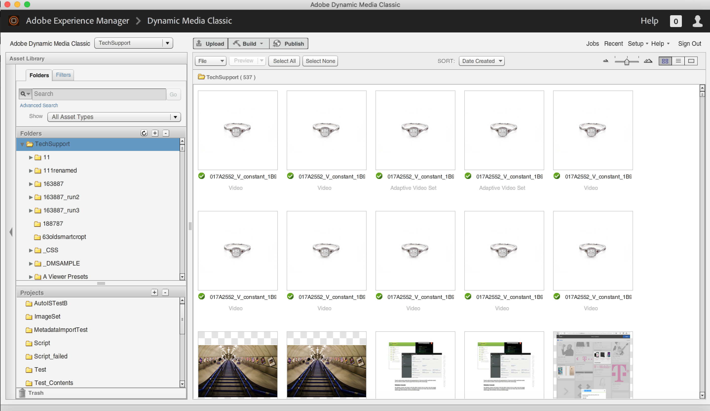

# Tutorial zu Best Practices für Dynamic Media Classic

Dieses Handbuch soll aktuellen und neuen Anwendern von Dynamic Media Classic dabei helfen, besser zu verstehen, was sie mit ihrer leistungsstarken Rich-Media-Lösung aus Adobe tun können. Wir tun dies durch:

- Einführung in Dynamic Media Classic, Beschreibung dessen, was es ist, und Überblick über seine Kernfunktionen und Benutzeroberfläche.
- Erläuterung des allgemeinen Workflows Erstellen, Verfassen und Bereitstellen , den Sie beim Arbeiten mit Assets in der Lösung befolgen werden.
- Erörterung wichtiger Elemente, die vor dem Einstieg und der Verwendung der Lösung eingerichtet werden müssen.
- Machen Sie sich mit der Verwendung verschiedener Kernfunktionen der Lösung vertraut.

Im gesamten Handbuch werden wir Beispiele, Tipps und Best Practices bereitstellen. Wir werden auch wichtige Begriffe und Konzepte erläutern, mit denen Sie bei der Arbeit mit Dynamic Media Classic vertraut sein sollten. Wenn Sie für ein bestimmtes Thema verfügbar sind, werden wir Sie auf relevante Webinare, Blog-Beiträge und Online-Dokumentation verweisen.

Wir hoffen, dass Ihnen dieser Leitfaden die Informationen zur Verfügung stellt, die Sie benötigen, um Ihre Dynamic Media Classic-Lösung von großem Nutzen zu nutzen. Um die Navigation in den Kapiteln dieses Handbuchs zu vereinfachen, klicken Sie auf das Lesezeichen-Symbol auf der linken Seite des Handbuchs, um dessen Inhalt anzuzeigen.

## Überblick über Dynamic Media Classic

Dynamic Media Classic ist der zentrale Ort, an dem Kunden Rich-Media-Inhalte erstellen, erstellen und bereitstellen. Dynamic Media Classic ist eine integrierte Rich-Media-Management-, Publishing- und Serving-Umgebung. Rich-Media können für alle Marketing- und Verkaufskanäle bereitgestellt werden, einschließlich Web, Druckmaterial, E-Mail-Kampagnen, Webanwendungen, Desktops und Geräten.

Die Bildbereitstellung ist möglicherweise die am häufigsten verwendete Funktion von Dynamic Media Classic. Tatsächlich verwenden die meisten Kunden Dynamic Media Classic, um alle Bilder auf ihren Websites bereitzustellen, darunter auch Bilder für Zoom oder Rich Media. Es kann jedoch auch für viele andere Zwecke verwendet werden, einschließlich der Bereitstellung von Videos und der Verwendung von AI zur Optimierung der bereitgestellten Bilder.

## Hauptfunktionen von Dynamic Media Classic

In diesem Handbuch werden wir die folgenden Kernfunktionen von Dynamic Media Classic besprechen.

- **Dynamic Imaging.** Der Dachbegriff für Echtzeitbearbeitung, Formatierung und Größenanpassung sowie interaktives Zoomen und Schwenken; Farb- und Texturbeobachtung; 360-Grad-Rotation; Bildvorlagen; und Multimedia-Viewern.
- **Video.** Laden Sie endgültige Videos hoch, veröffentlichen Sie sie und laden Sie sie schrittweise in konfigurierbare Video-Viewer herunter.
- **Intelligente Bildbearbeitung.** Technologie, die die AI-Funktionen von Adobe Sensei nutzt und mit vorhandenen &quot;Bildvorgaben&quot;zusammenarbeitet, um die Leistung bei der Bildbereitstellung zu verbessern, indem Bildformat, -größe und -qualität basierend auf den Funktionen des Client-Browsers automatisch optimiert werden.

Weitere Informationen zu den zusätzlichen Funktionen der Lösung finden Sie unter [Dokumentation für Dynamic Media Classic](https://experienceleague.adobe.com/docs/dynamic-media-classic/using/intro/introduction.html).

## Die Dynamic Media Classic-Benutzeroberfläche

Die Hauptbenutzeroberfläche von Dynamic Media Classic besteht aus drei Hauptbereichen: die globale Navigationsleiste, die Asset-Bibliothek und das Durchsuchenbedienfeld/Build-Bedienfeld.

_Dynamic Media Classic-Benutzeroberfläche_

**Globale Navigationsleiste.** Am oberen Bildschirmrand können Sie über die Schaltflächen auf dieser Leiste auf die wichtigsten Bereiche und Funktionen der Lösung zugreifen. Sie können damit beispielsweise auf Upload-Funktionen zugreifen, verschiedene Asset-Baubereiche (Bildset, Rotationsset usw.) öffnen, wichtige Aufgaben wie das Einrichten von Bildvorgaben und Viewer-Vorgaben durchführen und Assets veröffentlichen. Von hier aus können Sie auch Ihre Aufträge überwachen, aktuelle Aktivitäten anzeigen und aus verschiedenen Hilfeoptionen auswählen.

**Asset-Bibliothek.** Auf der linken Seite des Bildschirms befindet sich die Asset-Bibliothek, ein Bedienfeld, mit dem Sie Ihre Assets in von Ihnen erstellten Ordnern und Unterordnern organisieren. Am oberen Rand des Bedienfelds finden Sie Such- und Filter, die Ihnen beim Suchen nach Assets helfen. Mit der erweiterten Suche können Sie suchen, indem Sie mehrere Optionen als Kriterien für Ihre Suche angeben, einschließlich ausgeblendeter Metadatenfelder, die an dieses Asset angehängt sind. Unten im Bedienfeld können Sie gelöschte Elemente sehen, indem Sie auf das Papierkorbsymbol klicken. Zunächst beginnen Sie nicht mit Ordnern, mit Ausnahme des Ordners der obersten Ebene, der denselben Namen wie Ihr Kontoname hat.

>[!NOTE]
>
>Assets im Papierkorb werden sieben Tage nach dem Einfügen automatisch dauerhaft gelöscht, es sei denn, Sie stellen sie wieder her.

**Bedienfeld &quot;Durchsuchen/Erstellen&quot;.** Dies ist der Mittelpunkt der Benutzeroberfläche, in der Sie entweder Assets im Durchsuchen-Modus durchsuchen oder im Build-Modus als Arbeitsfläche zum Erstellen von Assets im Rahmen eines Workflows verwenden. Wenn Sie sich zum ersten Mal anmelden, wird das Bedienfeld &quot;Durchsuchen&quot;angezeigt. In der Mitte des Bildschirms befinden sich Miniaturansichten Ihrer Bilder in einer Rasteransicht. Sie können zu einer Listenansicht wechseln oder ein Asset auswählen und mithilfe der Detailansicht Details dazu anzeigen.

>[!IMPORTANT]
>
>Neben jeder Asset-ID ist die **Zur Veröffentlichung markieren** umschalten. Wenn der Umschalter aktiviert ist (grün), zeigt dies an, dass das Asset zur Veröffentlichung markiert ist.

>[!TIP]
>
>Wählen Sie die **Nach dem Hochladen veröffentlichen** im Dialogfeld &quot;Hochladen&quot;das Kontrollkästchen zum automatischen Veröffentlichen von Assets beim Hochladen.

Weitere Informationen [Navigieren in der Benutzeroberfläche von Dynamic Media Classic](https://experienceleague.adobe.com/docs/dynamic-media-classic/using/getting-started/navigation-basics.html).
