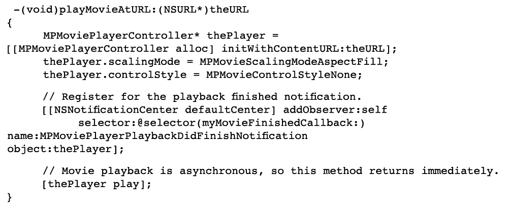

# Videoüberblick {#video-overview}

Im Lieferumfang von Dynamic Media Classic sind automatische Konvertierungen von Videos beim Hochladen, Video-Streaming auf Desktop- und Mobilgeräte sowie adaptive Videosets enthalten, die für die Wiedergabe je nach Gerät und Bandbreite optimiert sind. Eines der wichtigsten Dinge an Videos ist, dass der Workflow einfach ist — — Es wurde so konzipiert, dass jeder es verwenden kann, selbst wenn er mit Videotechnologie nicht sehr vertraut ist.

Am Ende dieses Abschnitts des Tutorials erfahren Sie, wie:

- Hochladen und Kodieren (Transkodieren) von Videos in verschiedenen Größen und Formaten
- Wählen Sie aus den verfügbaren Video-Vorgaben für das Hochladen
- hinzufügen oder Bearbeiten einer Videokodierungsvorgabe
- Vorschau von Videos in einem Video-Viewer
- Bereitstellen von Videos auf Websites und mobilen Sites
- hinzufügen und Kapitelmarken in Videos
- Anpassen und Veröffentlichen von Video-Viewern für Desktop- und Mobilbenutzer

>[!NOTE]
>
>Alle URLs in diesem Kapitel dienen nur zu Veranschaulichungszwecken; es handelt sich nicht um Live-Links.

## Überblick über Dynamic Media Classic Video

Lassen Sie uns zunächst ein besseres Bild von den Möglichkeiten für Videos mit Dynamic Media Classic machen.

### Funktionen

Die Dynamic Media Classic-Videoplattform Angebot alle Teile der Videolösung — Hochladen, Konvertieren und Verwalten von Videos; die Möglichkeit, einem Video Untertitel und Kapitelmarken hinzuzufügen; und die Möglichkeit, Vorgaben für eine einfache Wiedergabe zu verwenden.

Damit ist es ganz einfach, hochwertige adaptive Videos für das Streaming über mehrere Bildschirme zu veröffentlichen, einschließlich Desktop-, iOS-, Android-, Blackberry- und Windows-Mobilgeräten. Es umfasst Versionen desselben Videos, die mit unterschiedlichen Bitraten und Formaten kodiert wurden, wie 400 kBit/s, 800 kBit/s und 1000 kBit/s. Der Desktop-Computer oder das Mobilgerät erkennt die verfügbare Bandbreite.

Darüber hinaus wird die Videoqualität automatisch eingestellt, wenn sich die Netzwerkbedingungen auf dem Desktop oder auf dem Mobilgerät ändern. Wenn ein Kunde auf einem Desktop in den Vollbildmodus wechselt, reagiert das adaptive Video-Set mit einer besseren Auflösung und verbessert so die Sichtbarkeit des Kunden. Mit adaptiven Video-Sets erhalten Sie die bestmögliche Wiedergabe von Dynamic Media Classic-Videos auf mehreren Bildschirmen und Geräten.

### Videomanagement

Das Arbeiten mit Videos kann komplexer sein als das Arbeiten mit digitalen Standbildern. Mit Videos haben Sie es mit zahlreichen Formaten und Standards zu tun und die Unsicherheit, ob Ihre Audience Ihre Clips wiedergeben kann. Mit Dynamic Media Classic ist es einfach, mit Videos zu arbeiten, da es viele leistungsstarke Tools &quot;unter der Haube&quot;bietet, die aber die Komplexität der Arbeit mit ihnen beseitigt.

Dynamic Media Classic erkennt und kann mit vielen verschiedenen verfügbaren Quellformaten arbeiten. Das Lesen des Videos ist jedoch nur ein Teil der Anstrengung — Sie müssen das Video auch in ein webfreundliches Format konvertieren. Dynamic Media Classic sorgt dafür, dass Sie Videos in H.264-Videos konvertieren können.

Das Konvertieren des Videos selbst kann mit den vielen professionellen und begeisterten Werkzeugen sehr kompliziert werden. Dynamic Media Classic bietet einfache Vorgaben, die für unterschiedliche Qualitätseinstellungen optimiert sind. Wenn Sie jedoch etwas benutzerspezifischeres wünschen, können Sie auch eigene Vorgaben erstellen.

Wenn Sie viele Videos haben, werden Sie die Möglichkeit schätzen, alle Ihre Assets zusammen mit Ihren Bildern und anderen Medien in Dynamic Media Classic zu verwalten. Sie können Ihre Assets, einschließlich Video-Assets, organisieren, katalogisieren und durchsuchen, indem Sie leistungsstarke XMP Metadaten unterstützen.

### Videowiedergabe

Ähnlich wie beim Konvertieren von Videos, um sie webfreundlich und barrierefrei zu gestalten, besteht auch das Problem bei der Implementierung und Bereitstellung von Videos auf Ihrer Site. Die Entscheidung, ob Sie einen Spieler kaufen oder einen eigenen bauen, ihn für verschiedene Geräte und Bildschirme kompatibel machen und dann Ihre Spieler zu pflegen, kann eine Vollzeit-Besetzung sein.

Auch hier können Sie mit Dynamic Media Classic die Vorgabe und den Viewer auswählen, die Ihren Anforderungen entsprechen. Sie haben viele verschiedene Viewer-Optionen und eine Bibliothek mit zahlreichen Vorgaben zur Verfügung.

Sie können Videos auf einfache Weise für das Web und mobile Geräte bereitstellen, da Dynamic Media Classic HTML5-Videos unterstützt. Dadurch können Sie Zielgruppen für Benutzer mit verschiedenen Browsern sowie für Android- und iOS-Plattformbenutzer erstellen. Streaming-Video ermöglicht eine reibungslose Wiedergabe von längeren oder hochauflösenden Inhalten, während progressive HTML5-Videos Vorgaben enthalten, die für den kleinen Bildschirm optimiert sind.

Viewer-Vorgaben für Videos sind je nach Viewer-Typ teilweise konfigurierbar.

Wie alle Viewer erfolgt die Integration über eine einzige Dynamic Media Classic-URL pro Viewer oder Video.

>[!NOTE]
>
>Als Best Practice sollten Sie die HTML5-Video-Viewer von Dynamic Media Classic verwenden. Die in HTML5-Video-Viewern verwendeten Vorgaben sind robuste Video-Player. Durch die Kombination der Möglichkeit, die Wiedergabekomponenten mit HTML5 und CSS zu gestalten, die eingebettete Wiedergabe zu nutzen und je nach Browserfunktionalität adaptives und progressives Streaming zu verwenden, erweitern Sie die Reichweite Ihrer Rich-Media-Inhalte auf Desktop-, Tablet- und Mobilbenutzer und stellen eine optimierte Videoerfahrung sicher.

Ein letzter Hinweis zu Dynamic Media Classic-Videos, die für einige Kunden gelten können: Es ist nicht möglich, dass für alle Firmen die automatische Konvertierung, das Streaming oder Video-Vorgaben aktiviert sind. Wenn Sie aus irgendeinem Grund nicht auf die URLs für das Streaming von Videos zugreifen können, kann dies der Grund sein. Sie können weiterhin progressiv heruntergeladene Videos hochladen und veröffentlichen und haben Zugriff auf alle Video-Viewer. Um jedoch die gesamten Videofunktionen von Dynamic Media Classic nutzen zu können, sollten Sie sich an Ihren Kundenbetreuer oder Vertriebsmanager wenden, um diese Funktionen zu aktivieren.

Erfahren Sie mehr über [Video in Dynamic Media Classic](https://docs.adobe.com/content/help/en/dynamic-media-classic/using/video/quick-start-video.html).

## Video 101

### Grundlegende Videokonzepte und Terminologie

Bevor wir beginnen, sollten wir einige Begriffe besprechen, mit denen Sie vertraut sein sollten, um mit Videos zu arbeiten. Diese Konzepte sind nicht spezifisch für Dynamic Media Classic, und wenn Sie Videos für eine professionelle Website verwalten wollen, sollten Sie gut daran gehen, eine weitere Ausbildung zu diesem Thema zu erhalten. Am Ende dieses Abschnitts werden wir einige Ressourcen empfehlen.

- **Kodieren/Transkodieren.** Bei der Kodierung wird die Videokomprimierung angewendet, um unkomprimierte Rohvideodaten in ein Format zu konvertieren, das die Arbeit erleichtert. Die Transkodierung bezieht sich, obwohl ähnlich, auf die Konvertierung von einer Kodierungsmethode in eine andere.

   - Übergeordnet mit Videobearbeitungssoftware erstellte Videodateien sind häufig zu groß und nicht im richtigen Format, um Versand zu Online-Zielen zu führen. Sie werden in der Regel für die schnelle Wiedergabe auf dem Desktop und für die Bearbeitung kodiert, nicht jedoch für den Versand über das Internet.
   - Um Digitalvideos in das richtige Format und die entsprechenden Spezifikationen für die Wiedergabe auf verschiedenen Bildschirmen zu konvertieren, werden Videodateien in eine kleinere, effiziente Dateigröße transkodiert, die für den Versand zum Web und zu Mobilgeräten optimal ist.

- **Videokomprimierung.** Die Reduzierung der Datenmenge, die zur Darstellung digitaler Videobilder verwendet wird, ist eine Kombination aus räumlicher Bildkomprimierung und zeitlicher Bewegungskompensation.

   - Die meisten Komprimierungstechniken sind verlustbehaftet, d. h., sie werden Daten ausgegeben, um eine kleinere Größe zu erreichen.
   - DV-Videos werden beispielsweise relativ wenig komprimiert und ermöglichen eine einfache Bearbeitung des Quellmaterials, allerdings ist es viel zu groß, um es über das Web zu verwenden oder sogar auf eine DVD zu setzen.

- **Dateiformate.** Das Format ist ein Container, ähnlich einer ZIP-Datei, der bestimmt, wie die Dateien in der Videodatei organisiert werden, in der Regel jedoch nicht, wie sie kodiert werden.

   - Zu den gebräuchlichen Dateiformaten für Quellvideos zählen unter anderem Windows Media (WMV), QuickTime (MOV), Microsoft AVI und MPEG. Von Dynamic Media Classic veröffentlichte Formate sind MP4.
   - Eine Videodatei enthält normalerweise mehrere Spuren — eine Videospur (ohne Audio) und eine oder mehrere Audiospuren (ohne Video) — die miteinander verknüpft und synchronisiert sind.
   - Das Videodateiformat bestimmt, wie diese verschiedenen Datenspuren und Metadaten organisiert werden.

- **Codec.** Ein Video-Codec beschreibt den Algorithmus, mit dem ein Video mithilfe der Komprimierung kodiert wird. Audio wird auch über einen Audio-Codec kodiert.

   - Codecs minimieren die für die Videowiedergabe erforderlichen Informationen. Statt Informationen zu jedem einzelnen Frame werden nur Informationen zu den Unterschieden zwischen einem Frame und dem nächsten gespeichert.
   - Da die meisten Videos kaum von einem Frame zum nächsten wechseln, lassen Codecs hohe Komprimierungsraten zu, was zu kleineren Dateigrößen führt.
   - Ein Videoplayer dekodiert das Video entsprechend seinem Codec und zeigt dann eine Reihe von Bildern oder Frames auf dem Bildschirm an.
   - Zu den gängigen Video-Codecs gehören H.264, On2 VP6 und H.263.

- **Auflösung.** Höhe und Breite des Videos in Pixel.

   - Die Größe des Quellvideos wird von der Kamera und der Ausgabe aus der Bearbeitungssoftware bestimmt. Eine HD-Kamera erstellt in der Regel Videos mit einer Auflösung von 1920 x 1080. Um eine gleichmäßige Wiedergabe im Web zu gewährleisten, sollten Sie die Auflösung jedoch auf eine kleinere Auflösung (z. B. 1280 x 720, 640 x 480 oder kleiner) herabsetzen (anpassen).
   - Die Auflösung wirkt sich direkt auf die Dateigröße und die Bandbreite aus, die für die Wiedergabe des Videos erforderlich ist.

- **Seitenverhältnis anzeigen.** Verhältnis der Breite eines Videos zur Höhe eines Videos. Wenn das Seitenverhältnis des Videos nicht mit dem des Players übereinstimmt, werden möglicherweise &quot;schwarze Balken&quot;oder ein leerer Bereich angezeigt. Für die Anzeige von Videos werden zwei häufig verwendete Seitenverhältnisse verwendet:

   - 4:3 (1.33:1). Wird für nahezu alle TV-Übertragungen mit Standardauflösung verwendet.
   - 16:9 (1,78:1). Wird für nahezu alle HDTV-Inhalte und Filme im Breitbild-Format (High Definition TV) verwendet.

- **Bitrate/Datenrate.** Die Menge der kodierten Daten, die für eine Sekunde Videowiedergabe verwendet werden (in Kilobit pro Sekunde).

   - Im Allgemeinen gilt, je niedriger die Bitrate, desto wünschenswerter ist es für das Web, weil es schneller heruntergeladen werden kann. Es kann aber auch bedeuten, dass die Qualität ist gering wegen der Komprimierung Verlust.
   - Ein guter Codec sollte eine niedrige Bitrate bei guter Qualität ausgleichen.

- **Framerate (Einzelbilder pro Sekunde oder FPS).** Die Anzahl der Frames oder Standbilder pro Sekunde des Videos. Normalerweise wird Nordamerikanisches Fernsehen (NTSC) mit 29,97 FPS ausgestrahlt. Das europäische und asiatische Fernsehen (PAL) wird in 25 FPS ausgestrahlt. und Film (analog und digital) sind in der Regel in 24 (23,976) FPS.

   - Um die Dinge verwirrender zu machen, gibt es auch progressive und interlaced Rahmen. Jeder progressive Rahmen enthält einen gesamten Bildrahmen, während Interlaced-Rahmen jede zweite Pixelzeile in einem Bildrahmen enthalten. Die Frames werden dann sehr schnell wiedergegeben und scheinen miteinander zu verschmelzen. Film verwendet eine progressive Scan-Methode, während digitale Videos in der Regel interlaced sind.
   - Im Allgemeinen spielt es keine Rolle, ob Ihr Quellmaterial interlaced ist oder nicht — — Dynamic Media Classic behält die Scanmethode im konvertierten Video bei.
   - Streaming/Progressiver Versand. Beim Video-Streaming handelt es sich um das Senden von Medien in einem kontinuierlichen Stream, der beim Eintreffen wiedergegeben werden kann, während progressiv heruntergeladene Videos wie jede andere Datei von einem Server heruntergeladen und lokal im Browser zwischengespeichert werden.

Hoffentlich hilft Ihnen dieser Leitfaden, die verschiedenen Optionen, die mit der Verwendung von Dynamic Media Classic Video.

## Videoarbeitsablauf

Beim Arbeiten mit Videos in Dynamic Media Classic folgen Sie einem grundlegenden Arbeitsablauf, der dem Arbeiten mit Bildern ähnelt.

1. Beginn durch Hochladen von Videodateien in Dynamic Media Classic. Öffnen Sie dazu das Menü **Tools** unten im Dynamic Media Classic Extension-Bedienfeld und wählen Sie **In Dynamic Media Classic hochladen > Dateien in Ordnername** oder **In Dynamic Media Classic hochladen > Ordner in Ordnername**. &quot;Ordnername&quot;ist der Ordner, den Sie derzeit mit der Erweiterung durchsuchen. Videodateien können groß sein. Daher empfehlen wir, große Dateien mit FTP hochzuladen. Wählen Sie beim Hochladen eine oder mehrere Video-Vorgaben zum Kodieren Ihrer Videos aus. Videos können beim Hochladen in MP4-Videos transkodiert werden. Weitere Informationen zur Verwendung und Erstellung von Kodierungsvorgaben finden Sie im Thema Video-Vorgaben unten. Erfahren Sie mehr über [Hochladen und Kodieren von Videos](https://docs.adobe.com/content/help/en/dynamic-media-classic/using/video/uploading-encoding-videos.html).
2. Wählen oder wählen Sie eine Video-Viewer-Vorgabe aus und ändern Sie sie und erstellen Sie eine Vorschau. Sie können entweder eine vordefinierte Viewer-Vorgabe auswählen oder Ihre eigene anpassen. Wenn Sie auf mobile Benutzer abzielen, müssen Sie hier nichts tun, da mobile Plattformen keinen Viewer oder keine Vorgabe benötigen. Erfahren Sie mehr über [Anzeigen einer Vorschau von Videos in einem Video-Viewer](https://docs.adobe.com/content/help/en/dynamic-media-classic/using/video/previewing-videos-video-viewer.html) und [Hinzufügen oder Bearbeiten einer Video-Viewer-Vorgabe](https://docs.adobe.com/content/help/en/dynamic-media-classic/using/video/previewing-videos-video-viewer.html#adding-or-editing-a-video-viewer-preset).
3. Führen Sie eine Videoveröffentlichung aus, rufen Sie die URL ab und integrieren Sie sie. Der Hauptunterschied zwischen diesem Schritt für den Video-Workflow und dem Bild-Workflow besteht darin, dass Sie anstelle der standardmäßigen Image Serving-Veröffentlichung eine spezielle Videoveröffentlichung ausführen. Die Integration des Video-Viewers auf dem Desktop funktioniert genau wie die Integration des BildViewers, bei mobilen Geräten ist die Integration jedoch noch einfacher. — benötigen Sie lediglich die URL zum Video selbst.

### Grundlagen zur Transkodierung

Transkodierung wurde früher definiert als der Prozess der Konvertierung von einer Kodierungsmethode in eine andere. Bei Dynamic Media Classic wird das Quellvideo aus dem aktuellen Format in das MP4-Format konvertiert. Dies ist erforderlich, bevor Ihr Video im Desktop-Browser oder auf einem Mobilgerät angezeigt wird.

Dynamic Media Classic kann die Transkodierung für Sie durchführen - ein großer Vorteil. Sie können das Video selbst transkodieren und die Dateien hochladen, die bereits in MP4 konvertiert wurden. Dies kann jedoch ein komplexer Prozess sein, der hoch entwickelte Software erfordert. Wenn Sie nicht wissen, was Sie tun, erhalten Sie normalerweise keine guten Ergebnisse bei Ihrem ersten Versuch.

Dynamic Media Classic konvertiert die Dateien nicht nur für Sie, sondern macht sie auch einfach, indem es einfach zu bedienende Vorgaben bereitstellt. Sie müssen wirklich nicht viel über die technische Seite dieses Prozesses wissen — — Sie sollten nur wissen, ob es sich um die endgültige(n) Größe(en) handelt, die Sie aus dem System herausbekommen möchten, und wie viel Bandbreite Ihre Endbenutzer haben.

Die vordefinierten Vorgaben sind zwar praktisch und decken die meisten Anforderungen ab, aber manchmal möchten Sie etwas benutzerspezifischeres. In diesem Fall können Sie eine eigene Kodierungsvorgabe erstellen. In Dynamic Media Classic wird eine Kodierungsvorgabe als Video-Vorgabe bezeichnet. Dies wird weiter unten in diesem Kapitel erklärt.

### Info zu Streaming

Eine weitere wichtige Funktion ist das Video-Streaming, eine Standardfunktion der Dynamic Media Classic Videoplattform. Streaming-Medien werden während der Auslieferung ständig von einem Endbenutzer empfangen und ihm präsentiert. Dies ist aus einer Reihe von Gründen wichtig und wünschenswert.

Streaming erfordert in der Regel weniger Bandbreite als progressives Herunterladen, da nur der Teil des Videos, der angesehen wird, tatsächlich bereitgestellt wird. Der Dynamic Media Classic Video-Streaming-Server und die Viewer verwenden die automatische Bandbreitenerkennung, um den bestmöglichen Stream für die Internetverbindung des Benutzers bereitzustellen.

Beim Streaming werden die Beginn früher abgespielt, als andere Methoden. Außerdem werden Netzwerkressourcen effizienter genutzt, da nur die Teile des Videos, die angezeigt werden, an den Client gesendet werden.

Die andere Versand-Methode ist progressives Herunterladen. Im Vergleich zum Streaming-Video gibt es nur einen einzigen konsistenten Vorteil für den progressiven Download — — Sie benötigen keinen Streaming-Server, um das Video bereitzustellen. Und hier kommt natürlich Dynamic Media Classic ins Spiel — Dynamic Media Classic verfügt über einen Streaming-Server, der in die Plattform integriert ist. Daher benötigen Sie weder die Mühe noch zusätzliche Kosten für die Wartung dieser dedizierten Hardware.

Progressives Download-Video kann von jedem normalen Webserver bereitgestellt werden. Dies kann praktisch und potenziell kosteneffizient sein, aber beachten Sie, dass progressive Downloads nur über eingeschränkte Such- und Navigationsfunktionen verfügen und Benutzer auf Ihre Inhalte zugreifen und sie erneut verwenden können. In einigen Fällen, wie z. B. bei der Wiedergabe hinter sehr strikten Netzwerk-Firewalls, kann Streaming-Versand blockiert werden. In diesen Fällen kann eine Rückführung auf den progressiven Versand wünschenswert sein.

Progressives Herunterladen ist eine gute Wahl für Hobbyisten oder Websites mit geringen Traffic-Anforderungen. wenn es ihnen nichts ausmacht, ob ihr Inhalt auf dem Computer eines Benutzers zwischengespeichert wird; wenn Videos mit kürzerer Länge (unter 10 Minuten) bereitgestellt werden müssen; oder wenn ihre Besucher aus irgendeinem Grund kein Streaming-Video empfangen können.

Sie müssen Ihr Video streamen, wenn Sie erweiterte Funktionen und die Steuerung des Video-Versands benötigen und/oder wenn Sie Videos in größeren Audiencen (z. B. mehreren hundert gleichzeitigen Viewern) anzeigen, die Nutzung verfolgen und Berichte erstellen oder Statistiken anzeigen möchten oder wenn Sie Ihren Viewern das beste interaktive Wiedergabeerlebnis bieten möchten.

Wenn Sie sich schließlich Sorgen machen, Ihre Medien für Fragen des geistigen Eigentums oder der Rechteverwaltung zu sichern, bietet Streaming einen sichereren Versand von Videos, da die Medien beim Streaming nicht im Cache des Kunden gespeichert werden.

## Videovorgaben

Beim Hochladen des Videos wählen Sie eine oder mehrere Vorgaben, die die Einstellungen für die Konvertierung des Videos in ein webfreundliches Format durch Kodierung enthalten. Video-Vorgaben sind in zwei Varianten verfügbar: &quot;Adaptive Video-Vorgaben&quot;und &quot;Einzelne Kodierungsvorgaben&quot;.

Siehe [Verfügbare Video-Vorgaben](https://docs.adobe.com/content/help/en/dynamic-media-classic/using/setup/application-setup.html#video-presets-for-encoding-video-files).

Adaptive Video-Vorgaben sind standardmäßig aktiviert, d. h. sie sind für die Kodierung verfügbar. Wenn Sie eine einzelne Kodierungsvorgabe verwenden möchten, muss der Administrator sie aktivieren, damit sie in der Liste der Video-Vorgaben angezeigt wird.

Erfahren Sie, wie Sie [Video-Vorgaben aktivieren oder deaktivieren](https://docs.adobe.com/content/help/en/dynamic-media-classic/using/video/uploading-encoding-videos.html#activating-or-deactivating-video-encoding-presets).

Sie können eine von vielen vordefinierten Vorgaben auswählen, die im Lieferumfang von Dynamic Media Classic enthalten sind, oder Sie können eigene Vorgaben erstellen. Standardmäßig werden jedoch keine Vorgaben für das Hochladen ausgewählt. Anders ausgedrückt: **Wenn Sie beim Hochladen keine Video-Vorgabe auswählen, wird Ihr Video nicht konvertiert und kann möglicherweise nicht veröffentlicht werden.** Sie können das Video jedoch auch offline konvertieren und hochladen und veröffentlichen. Video-Vorgaben sind nur erforderlich, wenn die Konvertierung von Dynamic Media Classic für Sie durchgeführt werden soll.

Beim Hochladen wählen Sie eine Video-Vorgabe aus, indem Sie im Bedienfeld &quot;Auftragsoptionen&quot;die Option **Videooptionen** wählen. Wählen Sie dann aus, ob Sie die Kodierung für Computer, Mobil oder Tablet vornehmen möchten.

- Computer ist für den Desktop bestimmt. Hier finden Sie in der Regel größere Vorgaben (wie HD), die mehr Bandbreite verbrauchen.
- Mobil und Tablet erstellen MP4-Videos für Geräte wie iPhones und Android-Smartphones. Der einzige Unterschied zwischen Mobile und Tablet besteht darin, dass die Tablet-Vorgaben in der Regel eine höhere Bandbreite haben, da sie auf der Nutzung von WiFi basieren. Mobile Vorgaben sind für eine langsamere 3G-Nutzung optimiert.

### Fragen, die Sie sich vor Auswahl einer Vorgabe stellen müssen

Bei der Auswahl einer Vorgabe sollten Sie sowohl Ihre Audience als auch Ihr Quellmaterial kennen. Was wissen Sie über Ihren Kunden? Wie sehen sie das Video an? mit einem Computermonitor oder einem Mobilgerät?

Welche Auflösung haben Sie? Wenn Sie eine Vorgabe auswählen, die größer als das Original ist, erhalten Sie möglicherweise ein verschwommenes/pixeliges Video. Es ist in Ordnung, wenn Ihr Video größer als die Vorgabe ist, aber wählen Sie keine Vorgabe, die größer als Ihr Quellvideo ist.

Wie hoch ist das Seitenverhältnis? Wenn Sie um das konvertierte Video schwarze Balken sehen, wählen Sie das falsche Seitenverhältnis. Dynamic Media Classic kann diese Einstellungen nicht automatisch erkennen, da die Datei zunächst vor dem Hochladen überprüft werden muss.

### Aufschlüsselung der Videooptionen

Video-Vorgaben bestimmen, wie Ihr Video kodiert werden soll, indem Sie diese Einstellungen festlegen. Wenn Sie mit diesen Begriffen nicht vertraut sind, lesen Sie bitte das Thema Grundlegende Videokonzepte und Terminologie weiter oben.

- **Seitenverhältnis.** Normalerweise Standard 4:3 oder Breitbild 16:9.
- **Größe.** Dies ist die gleiche Auflösung wie die Anzeige und wird in Pixel gemessen. Dies hängt mit dem Seitenverhältnis zusammen. Bei einem Verhältnis von 16:9 beträgt das Video 432 x 240 Pixel, bei einem Verhältnis von 4:3 3 320 x 240 Pixel.
- **FPS.** Die standardmäßigen Bildraten betragen 30, 25 oder 24 Frames pro Sekunde (fps), je nach Videostandard — NTSC, PAL oder Film. Diese Einstellung spielt keine Rolle, da Dynamic Media Classic immer dieselbe Bildrate wie das Quellvideo verwendet.
- **Format.** Das ist MP4.
- **Bandbreite.** Dies ist die gewünschte Verbindungsgeschwindigkeit des Zielbenutzers. Haben sie eine schnelle oder eine langsame Internetverbindung? Verwenden sie in der Regel Desktop-Computer oder Mobilgeräte? Dies hängt auch mit der Auflösung (Größe) zusammen, da je größer das Video ist, desto mehr Bandbreite benötigt wird.

### Bestimmen der Datenrate oder &quot;Bitrate&quot; für Ihr Video

Die Berechnung der Bitrate für Ihr Video ist einer der am wenigsten verstandenen Faktoren für die Bereitstellung von Videos im Internet, möglicherweise jedoch der wichtigste, da es sich direkt auf die Benutzererfahrung auswirkt. Wenn Sie die Bitrate zu hoch einstellen, haben Sie eine hohe Videoqualität, aber eine schlechte Leistung. Benutzer mit langsameren Internetverbindungen werden gezwungen zu warten, während das Video während der Wiedergabe andauernd angehalten wird. Wenn Sie es jedoch zu niedrig einstellen, leidet die Qualität. Innerhalb der Video-Vorgabe schlägt Dynamic Media Classic eine Reihe von Daten vor, die von der Bandbreite Ihrer Zielgruppe abhängen. Das ist ein guter Ort zum Beginn.

Wenn Sie es jedoch selbst herausfinden möchten, benötigen Sie einen Bitratenrechner. Dieses Tool wird von Videoprofis und -fans häufig verwendet, um zu schätzen, wie viele Daten in einen bestimmten Stream oder ein bestimmtes Medienelement (z. B. eine DVD) passen.

## Erstellen einer benutzerdefinierten Video-Vorgabe

Manchmal benötigen Sie eine spezielle Video-Vorgabe, die nicht mit den Einstellungen der integrierten Kodierungsvorgaben übereinstimmt. Dies kann vorkommen, wenn Sie ein benutzerdefiniertes Video einer bestimmten Größe haben, z. B. ein Video, das mit 3D-Animationssoftware erstellt wurde, oder ein Video, das von der Originalgröße abgeschnitten wurde. Vielleicht möchten Sie mit verschiedenen Bandbreiteneinstellungen experimentieren, um Videos mit höherer oder niedriger Qualität zu versorgen. In jedem Fall müssen Sie eine benutzerdefinierte Video-Vorgabe für die Einzelkodierung erstellen.

### Videovorgabe-Workflow

1. Video-Vorgaben befinden sich unter **Einstellungen > Anwendungseinstellungen > Video-Vorgaben**. Hier finden Sie eine Liste aller Kodierungsvorgaben, die Ihrer Firma zur Verfügung stehen.

   - Jedes Streaming-Video-Konto verfügt über Dutzende von Vorgaben, und wenn Sie eigene benutzerdefinierte Vorgaben erstellen, werden Sie diese auch hier sehen.
   - Sie können über das Dropdown-Menü nach Typ filtern. Die Vorgaben sind in Computer, Mobil und Tablet unterteilt.
      

2. In der Spalte &quot;Aktiv&quot;können Sie auswählen, ob beim Hochladen alle oder nur die ausgewählten Vorgaben angezeigt werden sollen. Wenn Sie sich in den USA befinden, sollten Sie die Prüfung der europäischen PAL-Vorgaben aufheben und in Großbritannien/EMEA die NTSC-Vorgaben deaktivieren.
3. Klicken Sie auf die Schaltfläche **Hinzufügen**, um eine benutzerdefinierte Vorgabe zu erstellen. Dadurch wird das Bedienfeld &quot;Hinzufügen Video-Vorgaben&quot;geöffnet. Der Vorgang hier ähnelt dem Erstellen einer Bildvorgabe.
4. Geben Sie zunächst ein **Vorgabenname** ein, um in der Liste der Vorgaben angezeigt zu werden. Im obigen Beispiel ist diese Vorgabe für Video-Lernprogramme zur Bildschirmerfassung vorgesehen.
5. Die Option **Beschreibung** ist optional, gibt Ihren Benutzern jedoch eine QuickInfo, in der der Zweck dieser Vorgabe beschrieben wird.
6. Das **Encode File Suffix** wird an das Ende des Namens des Videos angehängt, das Sie hier erstellen. Denken Sie daran, dass Sie sowohl über ein Übergeordnet-Video als auch über dieses kodierte Video verfügen, das vom Übergeordnete abgeleitet ist, und dass nicht zwei Assets in Dynamic Media Classic dieselbe Asset-ID haben können.
7. **Wiedergabe-** Geräte, auf denen Sie das gewünschte Videodateiformat auswählen (Computer, Mobil oder Tablet). Denken Sie daran, dass Mobile und Tablet dasselbe MP4-Format erzeugen. Dynamic Media Classic muss nur wissen, in welcher Kategorie die Vorgabe platziert werden soll. Der theoretische Unterschied ist jedoch, dass Tablet-Vorgaben in der Regel für eine schnellere Internetverbindung geeignet sind, da alle WiFi unterstützen.
8. **Zielgruppe Data** Rateis ist etwas, das Sie selbst herausfinden müssen, aber Sie können einen vorgeschlagenen Bereich auf dem Bild unten sehen. Sie können alternativ den Schieberegler auf die ungefähre Bandbreite der Zielgruppe ziehen. Für eine genauere Abbildung verwenden Sie einen Bitratenrechner. Es geht um eine gewisse Testphase und einen Fehler.

   

9. Legen Sie das **Seitenverhältnis der Quelldatei** fest. Diese Einstellung ist direkt an die Größe unten gebunden. Wenn Sie _Benutzerdefiniert_ wählen, müssen Sie sowohl Breite als auch Höhe manuell eingeben.
10. Wenn Sie ein Seitenverhältnis auswählen, legen Sie einen Wert für **Auflösung** fest, und der andere Wert wird automatisch von Dynamic Media Classic ausgefüllt. Geben Sie für ein benutzerdefiniertes Seitenverhältnis jedoch beide Werte ein. Ihre Größe sollte mit Ihrer Datenrate übereinstimmen. Wenn Sie eine sehr niedrige Datenrate und eine große Größe festlegen, würden Sie davon ausgehen, dass die Qualität schlecht ist.
11. Klicken Sie auf **Speichern**, um Ihre Vorgabe zu speichern. Im Gegensatz zu jeder anderen Vorgabe müssen Sie zu diesem Zeitpunkt keine Veröffentlichungen vornehmen, da die Vorgaben nur zum Hochladen von Dateien verwendet werden. Später müssen Sie die kodierten Videos veröffentlichen, aber die Vorgaben dienen nur der internen Dynamic Media Classic-Nutzung.
12. Um zu überprüfen, ob sich Ihre Videovorgabe auf der Upload-Liste befindet, gehen Sie zu **Hochladen**.Wählen Sie **Auftragsoptionen** und erweitern Sie **Videooptionen**. Ihre Vorgabe wird in der Kategorie des ausgewählten Wiedergabegeräts (Computer, Mobil oder Tablet) aufgeführt.

Erfahren Sie mehr über [Hinzufügen oder Bearbeiten einer Video-Vorgabe](https://docs.adobe.com/content/help/en/dynamic-media-classic/using/video/uploading-encoding-videos.html#adding-or-editing-a-video-encoding-preset).

## hinzufügen Bildunterschriften in Ihrem Video

In einigen Fällen kann es nützlich sein, Ihrem Video Untertitel hinzuzufügen — — Beispiel: Sie müssen das Video für mehrere Sprachen bereitstellen, möchten das Audio jedoch nicht in einer anderen Sprache abspielen oder das Video erneut in separaten Sprachen aufzeichnen. Darüber hinaus bietet das Hinzufügen von Untertiteln eine bessere Zugänglichkeit für Personen, die hörgeschädigt sind und Untertitel verwenden. Mit Dynamic Media Classic können Sie Ihren Videos ganz einfach Bildunterschriften hinzufügen.

Erfahren Sie, wie Sie [Beschriftungen in Video](https://docs.adobe.com/content/help/en/dynamic-media-classic/using/video/adding-captions-video.html) Hinzufügen.

## hinzufügen Kapitelmarkierungen für Ihr Video

Bei langen Videos werden Ihre Betrachter die Möglichkeiten und den Komfort schätzen, die Ihnen durch die Navigation mit Kapitelmarken in Ihrem Video geboten werden. Mit Dynamic Media Classic können Sie ganz einfach Kapitelmarken zu Ihrem Video hinzufügen.

Erfahren Sie, wie Sie [Hinzufügen Kapitelmarkierungen in Video](https://docs.adobe.com/content/help/en/dynamic-media-classic/using/video/adding-chapter-markers-video.html) übernehmen.

## Themen zur Videoimplementierung

### URL veröffentlichen und kopieren

Der letzte Schritt im Arbeitsablauf von Dynamic Media Classic besteht darin, Ihre Videoinhalte zu veröffentlichen. Videos haben jedoch einen eigenen Veröffentlichungsauftrag, der als Video-Server-Veröffentlichung bezeichnet wird und unter &quot;Erweitert&quot;gefunden wird.

Erfahren Sie, wie Sie Ihr Video [veröffentlichen.](https://docs.adobe.com/content/help/en/dynamic-media-classic/using/video/deploying-video-websites-mobile-sites.html#publishing-video)

Nachdem Sie eine Videoveröffentlichung ausgeführt haben, können Sie eine URL abrufen, um auf Ihre Videos und alle standardmäßigen Dynamic Media Classic Viewer-Vorgaben in einem Webbrowser zuzugreifen. Wenn Sie jedoch Ihre eigene Video-Viewer-Vorgabe anpassen oder erstellen, müssen Sie weiterhin eine separate Veröffentlichung für den Image-Server ausführen.

- Erfahren Sie, wie Sie eine URL mit einer mobilen Site oder einer Website](https://docs.adobe.com/content/help/en/dynamic-media-classic/using/video/deploying-video-websites-mobile-sites.html#linking-a-video-url-to-a-mobile-site-or-a-website) verknüpfen.[
- Erfahren Sie, wie Sie den Video-Viewer auf einer Webseite](https://docs.adobe.com/content/help/en/dynamic-media-classic/using/video/deploying-video-websites-mobile-sites.html#embedding-the-video-viewer-on-a-web-page) einbetten.[

Sie können Ihr Video auch mit einem Drittanbieter- oder benutzerdefinierten Video-Player bereitstellen.

Erfahren Sie, wie Sie Videos mit dem Video-Player eines Drittanbieters [bereitstellen.](https://docs.adobe.com/content/help/en/dynamic-media-classic/using/video/deploying-video-websites-mobile-sites.html#deploying-video-using-a-third-party-video-player)

Wenn Sie außerdem die Videominiaturen verwenden möchten — das aus dem Video extrahierte Bild — Sie müssen außerdem eine Veröffentlichung zum Image-Server ausführen. Das liegt daran, dass sich das Miniaturbild des Videos auf dem Image-Server befindet, während sich das Video selbst auf dem Video-Server befindet. Video-Miniaturansichten können in Videosuchergebnissen und Video-Playlists verwendet werden und können als erstes Standbild verwendet werden, das im Video-Viewer vor der Wiedergabe des Videos angezeigt wird.

Erfahren Sie mehr über [Arbeiten mit Videominiaturen](https://docs.adobe.com/content/help/en/dynamic-media-classic/using/video/deploying-video-websites-mobile-sites.html#working-with-video-thumbnails).

### Auswählen und Anpassen einer Viewer-Vorgabe

Der Prozess zum Auswählen und Anpassen einer Viewer-Vorgabe ist mit dem für Bilder identisch. Sie können entweder eine neue Vorgabe erstellen oder eine vorhandene Vorgabe ändern und unter einem neuen Namen speichern, Änderungen vornehmen und eine Image Serving-Veröffentlichung ausführen. Alle Viewer-Vorgaben werden auf dem Image-Server veröffentlicht, nicht nur Vorgaben für Bilder. Daher müssen Sie eine Bildveröffentlichung ausführen, um Ihre neuen oder geänderten Vorgaben anzuzeigen.

>[!TIP]
>
>Führen Sie nach der Veröffentlichung des Video-Servers eine Image-Server-Veröffentlichung aus, um alle mit Ihren Videos verknüpften Miniaturbilder zu veröffentlichen.

## Optimierung der Video-Suchmaschine

Die Suchmaschinenoptimierung (SEO) ist der Prozess zur Verbesserung der Sichtbarkeit einer Website oder Webseite in Suchmaschinen. Während Suchmaschinen beim Sammeln von Informationen zu textbasierten Inhalten hervorragende Leistungen erbringen, können sie keine Informationen über Videos adäquat erfassen, es sei denn, diese Informationen werden ihnen bereitgestellt. Mit Dynamic Media Classic Video SEO können Sie mithilfe von Metadaten Suchmaschinen Beschreibungen Ihrer Videos bereitstellen. Mit der Video SEO-Funktion können Sie Video-Sitemaps und Media RSS (mRSS)-Feeds erstellen.

- **Video-Sitemap**. Informiert Google genau darüber, wo und was der Videoinhalt auf einer Site ist. Videos können demnach in Google vollständig durchsucht werden. Eine Video-Sitemap kann beispielsweise die Laufzeit und die Kategorien von Videos angeben.
- **mRSS-Feed**. Wird von Content-Herausgebern verwendet, um Mediendateien in Yahoo! Videosuche. Google unterstützt sowohl das Video-Sitemap- als auch das Media RSS (mRSS)-Feed-Protokoll zum Senden von Informationen an Suchmaschinen.

Wenn Sie Video-Sitemaps und mRSS-Feeds erstellen, entscheiden Sie, welche Metadatenfelder aus Videodateien einbezogen werden sollen. Auf diese Weise beschreiben Sie Ihre Videos für Suchmaschinen, damit Suchmaschinen den Traffic zu Videos auf Ihrer Website genauer leiten können.

Nachdem die Sitemap oder der Feed erstellt wurde, können Sie sie von Dynamic Media Classic automatisch veröffentlichen, manuell veröffentlichen oder einfach eine Datei erstellen lassen, die Sie später bearbeiten können. Zusätzlich kann Dynamic Media Classic diese Datei jeden Tag automatisch erstellen und veröffentlichen.

Am Ende des Prozesses senden Sie die Datei oder URL an Ihre Suchmaschine. Diese Aufgabe findet außerhalb von Dynamic Media Classic statt. aber wir werden es unten kurz besprechen.

### Anforderungen für Sitemap-/mRSS-Dateien

Damit Google und andere Suchmaschinen Ihre Dateien nicht zurückweisen können, müssen sie im richtigen Format vorliegen und bestimmte Informationen enthalten. Dynamic Media Classic erstellt eine ordnungsgemäß formatierte Datei. Wenn die Informationen jedoch für einige Ihrer Videos nicht verfügbar sind, werden sie nicht in die Datei aufgenommen.

Die erforderlichen Felder sind Landingpage (URL der Seite, die das Video bereitstellt, nicht die URL des Videos selbst), Titel und Beschreibung. Jedes Video muss einen Eintrag für diese Elemente enthalten, oder es wird nicht in die generierte Datei aufgenommen. Optionale Felder sind Tags und Kategorie.

Es gibt zwei weitere erforderliche Felder — Inhalts-URL, URL zum Videoasset selbst und Miniaturansicht, URL zum Miniaturbild des Videos — Dynamic Media Classic füllt diese Werte automatisch für Sie aus.

Der empfohlene Arbeitsablauf besteht darin, diese Daten vor dem Hochladen mit XMP Metadaten in Ihre Videos einzubetten, und Dynamic Media Classic extrahiert sie beim Hochladen. Sie würden eine Anwendung wie Adobe Bridge — die in allen Adobe Creative Cloud-Anwendungen enthalten sind — , um die Daten in Standard-Metadatenfelder zu füllen.

Bei Verwendung dieser Methode müssen Sie diese Daten nicht manuell mit Dynamic Media Classic eingeben. Sie können jedoch auch Metadaten-Vorgaben in Dynamic Media Classic verwenden, um die Daten jedes Mal schnell einzugeben.

Weitere Informationen zu diesem Thema finden Sie unter [Anzeigen, Hinzufügen und Exportieren von Metadaten](https://docs.adobe.com/content/help/en/dynamic-media-classic/using/managing-assets/viewing-adding-exporting-metadata.html).

Nachdem die Metadaten ausgefüllt wurden, können Sie sie in der Ansicht &quot;Details&quot;für das Video-Asset anzeigen. Suchbegriffe können auch vorhanden sein, sie befinden sich jedoch auf der Registerkarte &quot;Suchbegriffe&quot;.

- Erfahren Sie mehr über [Hinzufügen von Suchbegriffen](https://docs.adobe.com/content/help/en/dynamic-media-classic/using/managing-assets/viewing-adding-exporting-metadata.html#add-or-edit-keywords).
- Erfahren Sie mehr über [Video SEO](https://docs.adobe.com/content/help/en/dynamic-media-classic/using/setup/video-seo-search-engine-optimization.html).
- Erfahren Sie mehr über [Einstellungen für Video SEO](https://docs.adobe.com/content/help/en/dynamic-media-classic/using/setup/video-seo-search-engine-optimization.html#choosing-video-seo-settings).

#### Einrichten von Video SEO

Einrichten von Video SEO-Beginn mit der Auswahl des gewünschten Formats, der Generierungsmethode und der Metadatenfelder, die in die Datei aufgenommen werden sollen.

1. Gehen Sie zu **Einstellungen > Anwendungseinstellungen > Video SEO > Einstellungen**.
2. Wählen Sie im Menü **Erstellungsmodus** ein Dateiformat. Die Standardeinstellung ist &quot;Aus&quot;. Wählen Sie zur Aktivierung entweder &quot;Video-Sitemap&quot;, &quot;mRSS&quot;oder &quot;Beide&quot;.
3. Wählen Sie, ob die Generierung automatisch oder manuell erfolgen soll. Aus Gründen der Einfachheit empfehlen wir Ihnen, **Automatischer Modus** festzulegen. Wenn Sie &quot;Automatisch&quot;wählen, stellen Sie auch die Option **Zur Veröffentlichung markieren** ein, andernfalls werden die Dateien nicht live geschaltet. Die Sitemap- und RSS-Dateien sind Typen eines XML-Dokuments und müssen wie jedes andere Asset veröffentlicht werden. Verwenden Sie einen der manuellen Modi, wenn nicht alle Informationen vorliegen oder Sie nur eine einmalige Generierung durchführen möchten.
4. Füllen Sie die Metadaten-Tags, die in den Dateien verwendet werden. Dieser Schritt ist nicht optional. Sie müssen mindestens die drei Felder mit einem Sternchen (\*) ausfüllen: **Landingpage** , **title** und **description**. Um Ihre Metadaten für diese Aufgaben zu verwenden, ziehen Sie die Felder aus dem Metadatenbedienfeld auf der rechten Seite in ein entsprechendes Formularfeld. Dynamic Media Classic füllt das Platzhalterfeld automatisch mit den tatsächlichen Daten aus jedem Video. Sie müssen keine Metadatenfelder verwenden. Sie können hier stattdessen statischen Text eingeben, der jedoch für jedes Video angezeigt wird.
5. Nachdem Sie Informationen in die drei erforderlichen Felder eingegeben haben, aktiviert Dynamic Media Classic die Schaltflächen **Speichern** und **Speichern &amp; Generieren**. Klicken Sie auf eine, um Ihre Einstellungen zu speichern. Verwenden Sie **Save**, wenn Sie sich im automatischen Modus befinden und die Dateien später von Dynamic Media Classic generieren möchten. Verwenden Sie **Speichern und Generieren**, um die Datei sofort zu erstellen.

### Testen und Veröffentlichen der Video-Sitemap, des mRSS-Feeds oder beider Dateien

Generierte Dateien werden im Stammverzeichnis (Basisordner) Ihres Kontos angezeigt.

Diese Dateien müssen veröffentlicht werden, da das Video SEO-Tool eine Veröffentlichung nicht selbst ausführen kann. Solange sie zur Veröffentlichung markiert sind, werden sie beim nächsten Ausführen einer Veröffentlichung an die Veröffentlichungsserver gesendet.

Nach der Veröffentlichung sind Ihre Dateien mit diesem URL-Format verfügbar.

Beispiel:

### An Suchmaschinen übermitteln

Der letzte Schritt des Prozesses besteht darin, Ihre Dateien und/oder URLs an Suchmaschinen zu senden. Dynamic Media Classic kann diesen Schritt nicht für Sie ausführen. Wenn Sie jedoch die URL und nicht die XML-Datei selbst senden, sollte Ihr Feed aktualisiert werden, wenn Ihre Datei das nächste Mal generiert und eine Veröffentlichung erfolgt.

Die Methode zum Übermitteln an Ihre Suchmaschine wird unterschiedlich sein, für Google verwenden Sie jedoch Google Webmaster Tools. Wechseln Sie dann zu **Site-Konfiguration > Sitemaps** und klicken Sie auf die Schaltfläche **Eine Sitemap** senden. Hier können Sie die Dynamic Media Classic URL in Ihre SEO-Datei(en) einfügen.

### Video SEO-Bericht

Dynamic Media Classic stellt einen Bericht bereit, der Ihnen zeigt, wie viele Videos erfolgreich in die Dateien aufgenommen wurden, und was noch wichtiger ist, welche aufgrund von Fehlern nicht eingeschlossen wurden. Um auf den Bericht zuzugreifen, gehen Sie zu **Einstellungen > Anwendungseinstellungen > Video SEO > Bericht**.

## Mobile-Implementierung für MP4-Video

Dynamic Media Classic enthält keine Viewer-Vorgaben für Mobilgeräte, da Viewer zur Wiedergabe von Videos auf unterstützten Mobilgeräten nicht erforderlich sind. Solange Sie das Format H.264 MP4 kodieren — entweder durch Konvertierung beim Hochladen oder durch Vorkodierung auf dem Desktop — unterstützte Tablets und Smartphones können Ihre Videos abspielen, ohne dass ein Viewer erforderlich ist. Dies wird auf Android- und iOS-Geräten (iPhone und iPad) unterstützt.

Der Grund dafür, dass kein Viewer erforderlich ist, ist, dass beide Plattformen native H.264-Unterstützung haben. Sie können das Video entweder in eine HTML5-Webseite einbetten oder das Video in die Anwendung selbst einbetten. Die Betriebssysteme Android und iOS bieten einen Controller, mit dem das Video wiedergegeben werden kann.

Aus diesem Grund gibt Dynamic Media Classic keine URL für einen Viewer für Mobilgeräte, sondern eine URL direkt für das Video. Im Fenster &quot;Vorschau&quot;für ein MP4-Video werden Links für Desktop und Mobil angezeigt. Die Mobil-URL verweist auf das veröffentlichte Video.

Bei veröffentlichten Videos ist zu beachten, dass die URL den vollständigen Pfad zum Video Liste, nicht nur die Asset-ID. Beim Umgang mit Bildern rufen Sie das Bild unabhängig von der Ordnerstruktur anhand der Asset-ID auf. Für Videos müssen Sie jedoch auch die Ordnerstruktur angeben. In den oben stehenden URLs wird das Video im Pfad gespeichert:

Dies kann auch als Videoname/Firma-Pfad/Videoname angegeben werden.

### Methode Nr. 1: Browser-Wiedergabe — HTML5-Code

Verwenden Sie zum Einbetten Ihres MP4-Videos in eine Webseite das HTML5-Video-Tag.

Diese Methode funktioniert auch für Desktop-Web, allerdings kann es bei der Browserunterstützung zu Problemen kommen — Nicht alle Desktop-Webbrowser unterstützen nativ H.264-Videos, einschließlich Firefox.

### Methode Nr. 2: App-Wiedergabe unter iOS — Media Player Framework

Alternativ dazu können Sie das Video &quot;Dynamic Media Classic MP4&quot;in den Code Ihrer mobilen Anwendung einbetten. Im Folgenden finden Sie ein allgemeines Beispiel für iOS mit dem Media Player-Framework, das nur zu Veranschaulichungszwecken angegeben wird:

## Zusätzliche Ressourcen

Sehen Sie sich den [Dynamic Media Skill Builder an: Video im Dynamic Media Classic](https://seminars.adobeconnect.com/p2ueiaswkuze)-On-Demand-Webinar, um zu erfahren, wie die Videofunktionen in Dynamic Media Classic verwendet werden.
