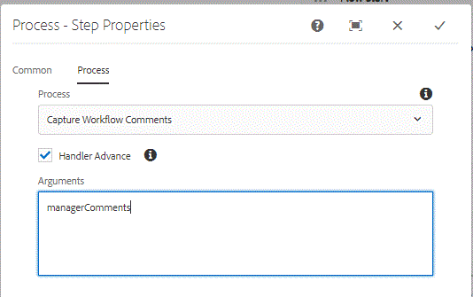

# Erfassen von Workflow-Kommentaren im adaptiven Forms Workflow{#capturing-workflow-comments-in-adaptive-forms-workflow}

>[Gilt nur für AEM Forms 6.4. In AEM Forms 6.5 verwenden Sie bitte die Variablenfunktion, um diesen Verwendungsfall zu erreichen.]

Eine häufige Anforderung besteht darin, dass die vom Aufgaben-Reviewer eingegebenen Kommentare in eine E-Mail eingefügt werden können. In AEM Forms 6.4 gibt es keine standardmäßige Methode, um die vom Benutzer eingegebenen Kommentare zu erfassen und diese in E-Mails einzuschließen.

Um diese Anforderung zu erfüllen, wird ein OSGi-Beispielpaket bereitgestellt, das zum Erfassen von Kommentaren und zum Speichern dieser Kommentare als Workflow-Metadateneigenschaft verwendet werden kann.

Der folgende Screenshot zeigt Ihnen, wie Sie mithilfe des Prozessschritts in [AEM Workflow](http://localhost:4502/editor.html/conf/global/settings/workflow/models/CaptureComments.html) Kommentare erfassen und als Metadateneigenschaft speichern können. &quot;Workflow-Kommentare erfassen&quot;ist der Name der Java-Klasse, die im Prozessschritt verwendet werden muss. Sie müssen den Namen der Metadateneigenschaft übergeben, der die Kommentare enthalten soll. Im folgenden Screenshot ist managerComments die Metadateneigenschaft, in der die Kommentare gespeichert werden.

Gehen Sie wie folgt vor, um diese Funktion auf Ihrem System zu testen:
* [Stellen Sie sicher, dass der Prozessschritt im Workflow so konfiguriert ist, dass die &quot;Workflow-Kommentare erfassen&quot;verwendet werden](http://localhost:4502/editor.html/conf/global/settings/workflow/models/CaptureComments.html)

* [Developing with serviceUser-Bundle bereitstellen](/help/forms/assets/common-osgi-bundles/DevelopingWithServiceUser.jar)

* [Stellen Sie das SetValue-Bundle](/help/forms/assets/common-osgi-bundles/SetValueApp.core-1.0-SNAPSHOT.jar) bereit. Dieses Bundle enthält den Beispielcode zum Erfassen der Kommentare und zum Speichern als Metadateneigenschaft

* [Laden Sie die Assets, die sich auf diesen Artikel beziehen, herunter und dekomprimieren Sie sie in Ihr Dateisystem. Die Assets enthalten ](assets/capturecomments.zip) das Workflow-Modell und das adaptive Musterformular.

* Importieren Sie die 2 ZIP-Dateien mit dem Package Manager in AEM

* [Vorschau des Formulars unter dieser URL](http://localhost:4502/content/dam/formsanddocuments/capturecomments/jcr:content?wcmmode=disabled)

* Füllen Sie die Formularfelder aus und senden Sie das Formular

* [AEM](http://localhost:4502/aem/inbox)

* Öffnen Sie die Aufgabe aus dem Posteingang und senden Sie das Formular. Geben Sie bei Aufforderung einige Kommentare ein.

Die Kommentare werden in der Metadateneigenschaft managerComments in crx gespeichert. Um nach Kommentaren zu suchen, melden Sie sich bei crx als admin an. Die Workflow-Instanzen werden im folgenden Pfad gespeichert

/var/workflow/instances/server0

Wählen Sie die entsprechende Workflow-Instanz aus und suchen Sie im Metadaten-Knoten nach der Eigenschaft managerComments.

