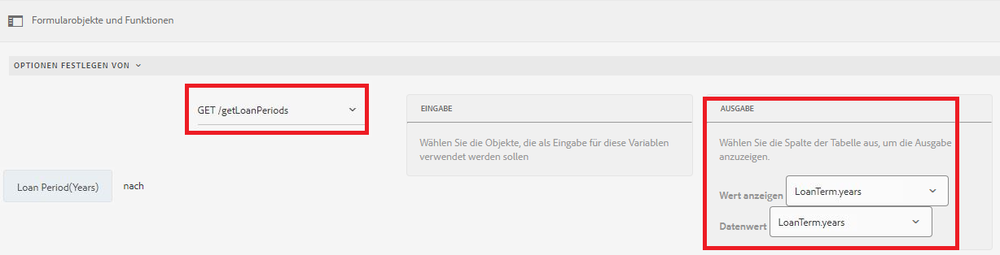

# Dynamisches Hinzufügen von Elementen zur Auswahlgruppenkomponente

AEM Forms 6.5 bietet die Möglichkeit, Elemente dynamisch zu einer Auswahlgruppe für adaptive Forms hinzuzufügen, z. B. Kontrollkästchen, Optionsfelder und Bild-Listen.

[Diese Funktion ist live auf dem Samples Server](https://forms.enablementadobe.com/content/samples/samples.html?query=0) verfügbar. Suchen Sie nach einer Karte mit dynamischen Kontrollkästchen und klicken Sie auf &quot;Testen&quot;.


Sie können Elemente je nach Anwendungsfall im Visual Editor sowie im Code-Editor hinzufügen.

**Verwenden des Visual Editor:** Sie können die Elemente der Auswahlgruppe aus den Ergebnissen eines Funktionsaufrufs oder Dienstaufrufs füllen. Sie können beispielsweise die Elemente der Auswahlgruppe festlegen, indem Sie die Antwort eines REST-API-Aufrufs verwenden.

Im folgenden Screenshot stellen wir die Optionen der Kreditlaufzeit(n) auf die Ergebnisse eines Dienstaufrufs namens getLoanPeriods ein.



**Verwenden des Code-Editors**: Wenn Sie die Elemente in der Auswahlgruppe basierend auf den im Formular eingegebenen Werten dynamisch festlegen möchten. Im folgenden Codefragment werden die Elemente des Kontrollkästchens beispielsweise auf die Werte gesetzt, die in die Felder &quot;Name des Antragstellers&quot;und &quot;Ehegatte&quot;des adaptiven Formulars eingegeben wurden.

Im Codefragment legen wir die Elemente von WorkingMembers fest, die eine Kontrollkästchenkomponente sind. Das Array für die Elemente wird dynamisch erstellt, indem die Werte der Textfelder &quot;applicatorName&quot;und &quot;Ehegatte&quot;der adaptiven Formulare abgerufen werden

```javascript
 
 if(MaritalStatus.value=="Married")
  {
WorkingMembers.items =["spouse="+spouse.value,"applicant="+applicantName.value];
  }
else
  {
    WorkingMembers.items =["applicant="+applicantName.value];
  }
```

Die übermittelten Daten lauten wie folgt:

```xml
<afUnboundData>

<data>

<applicantName>John Jacobs</applicantName>

<MaritalStatus>Married</MaritalStatus>

<spouse>Gloria Rios</spouse>

<WorkingMembers>spouse,applicant</WorkingMembers>

</data>

</afUnboundData>
```

**Hinzufügen von Elementen mit dem Regeleditor**

>[!VIDEO](https://video.tv.adobe.com/v/26847?quality=12&learn=on)

**Hinzufügen von Elementen mit dem Code-Editor**

>[!VIDEO](https://video.tv.adobe.com/v/26848?quality=12&learn=on)

So versuchen Sie es auf Ihrem System:

**Hinzufügen von Elementen mit dem Code-Editor**

* [Herunterladen der Assets](assets/usingthecodeeditor.zip)
* [Offenes Forms und Dokumente](http://localhost:4502/aem/forms.html/content/dam/formsanddocuments)
* Klicken Sie auf &quot;Erstellen | Datei-Upload&quot;und laden Sie die Datei hoch, die Sie im vorherigen Schritt heruntergeladen haben.
* [Vorschau der Formulare](http://localhost:4502/content/dam/formsanddocuments/simpleform/jcr:content?wcmmode=disabled)
* Geben Sie den Namen des Antragstellers ein und wählen Sie den Familienstand für die Verheiratete aus.
* Name des Ehegatten eingeben
* Klicken Sie auf Weiter
* Das Kontrollkästchen mit dem Namen des Antragstellers und dem Namen des Ehegatten sollte angezeigt werden, wenn der Familistatus verheiratet ist

**Hinzufügen von Elementen mit dem Visual Editor**

* [Herunterladen der Assets](assets/usingthevisualeditor.zip)
* Installieren Sie Tomcat, wenn Sie es nicht bereits haben. [Anweisungen zur Installation von Tomcat finden Sie hier](https://docs.adobe.com/content/help/en/experience-manager-learn/forms/ic-print-channel-tutorial/introduction.html)
* [SampleRest.war-Datei in Tomcat bereitstellen](https://forms.enablementadobe.com/content/DemoServerBundles/SampleRest.war)
* [Offenes Forms und Dokumente](http://localhost:4502/aem/forms.html/content/dam/formsanddocuments)
* Klicken Sie auf &quot;Erstellen | Datei-Upload&quot;und laden Sie die Datei hoch, die Sie im vorherigen Schritt heruntergeladen haben.
* [Vorschau der Formulare](http://localhost:4502/content/dam/formsanddocuments/amortizationschedule/jcr:content?wcmmode=disabled)
* Geben Sie den Kreditbetrag und die Registerkarte aus dem Feld ein. Dies Trigger die Regel, die das Feld für die Kreditlaufzeit anzeigt.
* Wählen Sie den entsprechenden Kreditzeitraum aus (Die Elemente für den Kreditzeitraum werden aus dem Rest-Aufruf ausgefüllt)
* Wählen Sie den Zinssatz aus und klicken Sie auf &quot;Amortisierungszeitplan abrufen&quot;
* Die Abschreibungstabelle sollte ausgefüllt werden. Der Tilgungsplan wird mithilfe eines REST-Aufrufs abgerufen.

>[!NOTE]
> Es wird angenommen, dass tomcat auf Port 8080 und AEM auf Port 4502 ausgeführt wird
