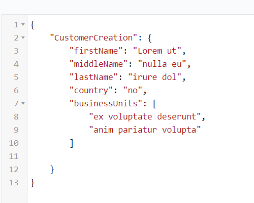

# Konvertieren einer kommagetrennten Zeichenfolge in ein Zeichenfolgen-Array {#setting-value-of-json-data-element-in-aem-forms-workflow}

Wenn Ihr Formular auf einem Formulardatenmodell basiert, das ein Zeichenfolgen-Array als Eingabeparameter aufweist, müssen Sie die übermittelten adaptiven Formulardaten bearbeiten, um ein Zeichenfolgen-Array einzufügen. Wenn Sie beispielsweise ein Kontrollkästchen-Feld an ein Formulardatenmodellelement des Typs Zeichenfolgen-Array gebunden haben, werden die Daten aus dem Kontrollkästchen in einem kommagetrennten Zeichenfolgenformat dargestellt. Der unten aufgeführte Beispiel-Code zeigt, wie Sie die kommagetrennte Zeichenfolge durch ein Zeichenfolgen-Array ersetzen.

## Erstellen eines Prozessschritts

Ein Prozessschritt wird in einem AEM-Workflow verwendet, wenn unser Workflow eine bestimmte Logik ausführen soll. Der Prozessschritt kann mit einem ECMA-Skript oder einem OSGi-Dienst verknüpft werden. Unser benutzerdefinierter Prozessschritt führt den OSGi-Dienst aus.

Die übermittelten Daten haben das folgende Format. Der Wert des Elements „businessUnits“ ist eine kommagetrennte Zeichenfolge, die in ein Zeichenfolgen-Array konvertiert werden muss.


Die Eingabedaten für den Rest-Endpunkt, der mit dem Formulardatenmodell verknüpft ist, erwarten ein Zeichenfolgen-Array, wie in diesem Screenshot gezeigt. Der benutzerdefinierte Code im Prozessschritt konvertiert die gesendeten Daten in das richtige Format.



Wir übergeben den JSON-Objektpfad und den Elementnamen an den Prozessschritt. Der Code im Prozessschritt ersetzt die kommagetrennten Werte des Elements in ein Zeichenfolgen-Array.


>[!NOTE]
>
>Stellen Sie sicher, dass der Datendateipfad in den Sendeoptionen des adaptiven Formulars auf „Data.xml“ festgelegt ist. Der Code im Prozessschritt sucht nämlich nach der Datei „Data.xml“ im Payload-Ordner.

## Code des Prozessschritts

```java
import java.io.BufferedReader;
import java.io.ByteArrayInputStream;
import java.io.InputStream;
import java.io.InputStreamReader;

import javax.jcr.Binary;
import javax.jcr.Node;
import javax.jcr.Session;

import org.osgi.framework.Constants;
import org.osgi.service.component.annotations.Component;
import org.slf4j.Logger;
import org.slf4j.LoggerFactory;

import com.adobe.granite.workflow.WorkflowException;
import com.adobe.granite.workflow.WorkflowSession;
import com.adobe.granite.workflow.exec.WorkItem;
import com.adobe.granite.workflow.exec.WorkflowProcess;
import com.adobe.granite.workflow.metadata.MetaDataMap;
import com.google.gson.JsonArray;
import com.google.gson.JsonObject;
import com.google.gson.JsonParser;

@Component(property = {
    Constants.SERVICE_DESCRIPTION + "=Create String Array",
    Constants.SERVICE_VENDOR + "=Adobe Systems",
    "process.label" + "=Replace comma seperated string with string array"
})

public class CreateStringArray implements WorkflowProcess {
    private static final Logger log = LoggerFactory.getLogger(CreateStringArray.class);
    @Override
    public void execute(WorkItem workItem, WorkflowSession workflowSession, MetaDataMap arg2) throws WorkflowException {
        log.debug("The string I got was ..." + arg2.get("PROCESS_ARGS", "string").toString());
        String[] arguments = arg2.get("PROCESS_ARGS", "string").toString().split(",");
        String objectName = arguments[0];
        String propertyName = arguments[1];

        String objects[] = objectName.split("\\.");
        System.out.println("The params is " + propertyName);
        log.debug("The params string is " + objectName);
        String payloadPath = workItem.getWorkflowData().getPayload().toString();
        log.debug("The payload  in set Elmement Value in Json is  " + workItem.getWorkflowData().getPayload().toString());
        String dataFilePath = payloadPath + "/Data.xml/jcr:content";
        Session session = workflowSession.adaptTo(Session.class);
        Node submittedDataNode = null;
        try {
            submittedDataNode = session.getNode(dataFilePath);

            InputStream submittedDataStream = submittedDataNode.getProperty("jcr:data").getBinary().getStream();
            BufferedReader streamReader = new BufferedReader(new InputStreamReader(submittedDataStream, "UTF-8"));
            StringBuilder stringBuilder = new StringBuilder();

            String inputStr;
            while ((inputStr = streamReader.readLine()) != null)
                stringBuilder.append(inputStr);
            JsonParser jsonParser = new JsonParser();
            JsonObject jsonObject = jsonParser.parse(stringBuilder.toString()).getAsJsonObject();
            System.out.println("The json object that I got was " + jsonObject);
            JsonObject targetObject = null;

            for (int i = 0; i < objects.length - 1; i++) {
                System.out.println("The object name is " + objects[i]);
                if (i == 0) {
                    targetObject = jsonObject.get(objects[i]).getAsJsonObject();
                } else {
                    targetObject = targetObject.get(objects[i]).getAsJsonObject();

                }

            }

            System.out.println("The final object is " + targetObject.toString());
            String businessUnits = targetObject.get(propertyName).getAsString();
            System.out.println("The values of " + propertyName + " are " + businessUnits);

            JsonArray jsonArray = new JsonArray();

            String[] businessUnitsArray = businessUnits.split(",");
            for (String name: businessUnitsArray) {
                jsonArray.add(name);
            }

            targetObject.add(propertyName, jsonArray);
            System.out.println(" After updating the property " + targetObject.toString());
            InputStream is = new ByteArrayInputStream(jsonObject.toString().getBytes());
            System.out.println("The changed json data  is " + jsonObject.toString());
            Binary binary = session.getValueFactory().createBinary(is);
            submittedDataNode.setProperty("jcr:data", binary);
            session.save();

        } catch (Exception e) {
            System.out.println(e.getMessage());
        }

    }
}
```

Das Beispiel-Bundle kann [hier heruntergeladen werden](assets/CreateStringArray.CreateStringArray.core-1.0-SNAPSHOT.jar)
