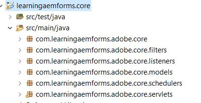

# Erstellen des ersten OSGi-Bundles

Ein OSGi-Bundle ist eine Java™-Archivdatei, die Java-Code, Ressourcen und ein Manifest enthält, das das Bundle und seine Abhängigkeiten beschreibt. Das Bundle ist die Einheit für die Bereitstellung einer Anwendung. Dieser Artikel ist für Entwickler gedacht, die einen OSGi-Dienst oder ein Servlet mit AEM Forms 6.4 oder 6.5 erstellen möchten. Gehen Sie wie folgt vor, um das erste OSGi-Bundle zu erstellen:


## JDK installieren

Installieren Sie die unterstützte Version von JDK. Ich habe JDK1.8 verwendet. Vergewissern Sie sich, dass Sie **JAVA_HOME** in Ihre Umgebung-Variablen eingefügt haben und auf den Stammordner Ihrer JDK-Installation verweisen.
hinzufügen Sie den Pfad &quot;%JAVA_HOME%/bin&quot;an


>[!NOTE]
> Verwenden Sie JDK 15 nicht. Es wird nicht von AEM unterstützt.

### JDK-Version testen

Öffnen Sie ein neues Eingabeaufforderungsfenster und geben Sie Folgendes ein: `java -version`. Sie sollten die JDK-Version zurückerhalten, die durch die Variable `JAVA_HOME` identifiziert wurde


## Maven installieren

Maven ist ein Werkzeug zur Automatisierung von Builds, das hauptsächlich für Java-Projekte verwendet wird. Führen Sie die folgenden Schritte aus, um Maven auf Ihrem lokalen System zu installieren.

* Erstellen Sie einen Ordner mit dem Namen `maven` im C-Laufwerk
* Laden Sie das [binäre ZIP-Archiv](http://maven.apache.org/download.cgi) herunter
* Extrahieren Sie den Inhalt des ZIP-Archivs in `c:\maven`
* Erstellen Sie eine Variable der Umgebung mit dem Namen `M2_HOME` mit dem Wert `C:\maven\apache-maven-3.6.0`. In meinem Fall ist die Version **mvn** 3.6.0. Zum Zeitpunkt der Erstellung dieses Artikels ist die neueste Maven Version 3.6.3
* hinzufügen Sie `%M2_HOME%\bin` auf Ihren Pfad
* Speichern Sie Ihre Änderungen
* Öffnen Sie eine neue Eingabeaufforderung und geben Sie `mvn -version` ein. Die **mvn**-Version sollte wie im Screenshot unten dargestellt aufgelistet sein.


## Settings.xml

Eine Maven `settings.xml`-Datei definiert Werte, die die Maven-Ausführung auf verschiedene Weise konfigurieren. In der Regel werden damit ein lokaler Repository-Speicherort, alternative Remote-Repository-Server und Authentifizierungsinformationen für private Repositorys definiert.

Navigieren Sie zu `C:\Users\<username>\.m2 folder`
Extrahieren Sie den Inhalt der Datei [settings.zip](assets/settings.zip) und platzieren Sie sie im Ordner `.m2`.

## Installieren von Eclipse

Installieren Sie die neueste Version von [eclipse](https://www.eclipse.org/downloads/)

## Erstes Projekt erstellen

Archetype ist ein Maven-Projektvorlagen-Toolkit. Ein Archetyp ist definiert als ein Originalmuster oder -modell, aus dem alle anderen Dinge der gleichen Art gemacht werden. Der Name passt zu dem, was wir versuchen, ein System bereitzustellen, das ein konsistentes Mittel zur Generierung von Maven-Projekten bietet. Archetype hilft Autoren beim Erstellen von Maven-Projektvorlagen für Benutzer und bietet Benutzern die Möglichkeit, parametrisierte Versionen dieser Projektvorlagen zu generieren.
Gehen Sie wie folgt vor, um Ihr erstes Maven-Projekt zu erstellen:

* Erstellen Sie einen neuen Ordner mit dem Namen `aemformsbundles` im C-Laufwerk
* Öffnen Sie eine Eingabeaufforderung und navigieren Sie zu `c:\aemformsbundles`
* Führen Sie den folgenden Befehl an der Eingabeaufforderung aus
* `mvn archetype:generate  -DarchetypeGroupId=com.adobe.granite.archetypes  -DarchetypeArtifactId=aem-project-archetype -DarchetypeVersion=19`

Das Maven-Projekt wird interaktiv generiert und Sie werden aufgefordert, Werte für eine Reihe von Eigenschaften bereitzustellen, z. B.

| Eigenschaftsname | Bedeutung | Wert |
------------------------|---------------------------------------|---------------------
| groupId | groupId identifiziert Ihr Projekt eindeutig in allen Projekten | com.learningaemforms.adobe |
| appsFolderName | Name des Ordners, der Ihre Projektstruktur enthalten soll | learningAEMforms |
| artifactId | artifactId ist der Name der jar ohne Version. Wenn Sie es erstellt haben, können Sie mit Kleinbuchstaben und ohne merkwürdige Symbole einen beliebigen Namen wählen. | learningAEMforms |
| Version | Wenn Sie sie verteilen, können Sie eine beliebige typische Version mit Zahlen und Punkten (1.0, 1.1, 1.0.1, ...) wählen. | 1.0 |

Übernehmen Sie die Standardwerte für die anderen Eigenschaften, indem Sie auf die Eingabetaste klicken.
Wenn alles gut läuft, sollten Sie in Ihrem Befehlsfenster eine Erfolgsmeldung zum Aufbau sehen

## Erstellen eines Eclipse-Projekts aus Ihrem Maven-Projekt

Ändern Sie den Arbeitsordner in `learningaemforms`.
Ausführen von `mvn eclipse:eclipse` über die Befehlszeile
Mit dem obigen Befehl wird Ihre Pom-Datei gelesen und Eclipse-Projekte mit korrekten Metadaten erstellt, sodass Eclipse die Projektarten, Beziehungen, Klassenpfad usw. versteht.

## Projekt in Eclipse importieren

Starten Sie **Eclipse**

Gehen Sie zu **Datei -> Importieren** und wählen Sie **Vorhandene Maven-Projekte** wie hier gezeigt.


Klicken Sie auf Weiter

Wählen Sie die `c:\aemformsbundles\learningaemform`s aus, indem Sie auf die Schaltfläche **Durchsuchen** klicken


>[!NOTE]
>Sie können die entsprechenden Module je nach Bedarf importieren. Wählen Sie das Kernmodul nur aus und importieren Sie es, wenn Sie nur Java-Code in Ihrem Projekt erstellen möchten.

Klicken Sie auf **Fertigstellen**, um den Importvorgang Beginn.

Das Projekt wird in Eclipse importiert und Sie sehen eine Reihe `learningaemforms.xxxx` Ordner

Erweitern Sie den Ordner `src/main/java` unter dem Ordner `learningaemforms.core`. Dies ist der Ordner, in dem Sie den Großteil Ihres Codes schreiben werden.



## Projekt erstellen

Nachdem Sie den OSGi-Dienst oder das Servlet geschrieben haben, müssen Sie Ihr Projekt erstellen, um das OSGi-Bundle zu generieren, das mithilfe der Felix-Webkonsole bereitgestellt werden kann. Bitte verweisen Sie auf [AEMFD Client SDK](https://repo.adobe.com/nexus/content/repositories/public/com/adobe/aemfd/aemfd-client-sdk/), um das entsprechende Client-SDK in Ihr Maven-Projekt aufzunehmen. Sie müssen das AEM FD Client SDK wie unten gezeigt in den Abhängigkeitsabschnitt von `pom.xml` des Kernprojekts einbeziehen.

```xml
<dependency>
    <groupId>com.adobe.aemfd</groupId>
    <artifactId>aemfd-client-sdk</artifactId>
    <version>6.0.122</version>
</dependency>
```

Führen Sie zum Erstellen Ihres Projekts die folgenden Schritte aus:

* Öffnen Sie das Fenster **an der Eingabeaufforderung**
* Navigieren Sie zu `c:\aemformsbundles\learningaemforms\core`
* Befehl `mvn clean install` ausführen
Wenn alles gut läuft, sollte das Bundle am folgenden Ort `C:\AEMFormsBundles\learningaemforms\core\target` angezeigt werden. Dieses Bundle kann jetzt über die Felix-Webkonsole in AEM bereitgestellt werden.
