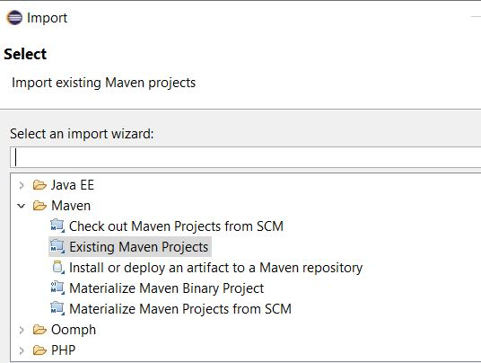

# Erstellen des ersten OSGi-Bundles

Ein OSGi-Bundle ist eine Java™-Archivdatei, die Java-Code, Ressourcen und ein Manifest enthält, das das Bundle und seine Abhängigkeiten beschreibt. Das Bundle ist die Einheit der Bereitstellung für eine Anwendung. Dieser Artikel richtet sich an Entwickler, die einen OSGi-Dienst oder ein Servlet mit AEM Forms 6.4 oder 6.5 erstellen möchten. Um Ihr erstes OSGi-Bundle zu erstellen, gehen Sie wie folgt vor:


## JDK installieren

Installieren Sie die unterstützte Version von JDK. Ich habe JDK1.8 verwendet. Stellen Sie sicher, dass Sie hinzugefügt haben. **JAVA_HOME** in Ihren Umgebungsvariablen und verweist auf den Stammordner Ihrer JDK-Installation.
Fügen Sie den Pfad %JAVA_HOME%/bin hinzu


>[!NOTE]
> Verwenden Sie JDK 15 nicht. Sie wird von AEM nicht unterstützt.

### JDK-Version testen

Öffnen Sie ein neues Eingabeaufforderungsfenster und geben Sie Folgendes ein: `java -version`. Sie sollten die JDK-Version wiederherstellen, die durch die `JAVA_HOME` Variable


## Maven installieren

Maven ist ein Tool zur Automatisierung von Builds, das hauptsächlich für Java-Projekte verwendet wird. Führen Sie die folgenden Schritte aus, um Maven auf Ihrem lokalen System zu installieren.

* Erstellen Sie einen Ordner mit dem Namen `maven` im C-Laufwerk
* Laden Sie die [binäres ZIP-Archiv](http://maven.apache.org/download.cgi)
* Extrahieren Sie den Inhalt des ZIP-Archivs in `c:\maven`
* Umgebungsvariable mit dem Namen `M2_HOME` mit dem Wert `C:\maven\apache-maven-3.6.0`. In meinem Fall wird die **mvn** -Version ist 3.6.0. Zum Zeitpunkt der Erstellung dieses Artikels ist die neueste Maven-Version 3.6.3
* Fügen Sie die `%M2_HOME%\bin` zu Ihrem Pfad
* Speichern Sie Ihre Änderungen
* Öffnen Sie eine neue Eingabeaufforderung und geben Sie ein in `mvn -version`. Sie sollten die **mvn** -Version aufgeführt, wie im Screenshot unten dargestellt


## Settings.xml

Ein Maven `settings.xml` definiert Werte, die die Ausführung von Maven auf verschiedene Arten konfigurieren. In der Regel wird sie verwendet, um einen lokalen Repository-Speicherort, alternative Remote-Repository-Server und Authentifizierungsinformationen für private Repositorys zu definieren.

Navigieren Sie zu `C:\Users\<username>\.m2 folder`
Extrahieren Sie den Inhalt von [settings.zip](assets/settings.zip) -Datei und platzieren Sie sie im `.m2` Ordner.

## Installieren von Eclipse

Installieren Sie die neueste Version von [Eclipse](https://www.eclipse.org/downloads/)

## Erstellen des ersten Projekts

Archetyp ist ein Maven-Projektvorlagen-Toolkit. Ein Archetyp ist definiert als ein ursprüngliches Muster oder Modell, aus dem alle anderen Elemente derselben Art hergestellt werden. Der Name passt zu dem, was wir versuchen, ein System bereitzustellen, das eine konsistente Möglichkeit zur Generierung von Maven-Projekten bietet. Archetyp unterstützt Autoren beim Erstellen von Maven-Projektvorlagen für Benutzer und bietet Benutzern die Möglichkeit, parametrierte Versionen dieser Projektvorlagen zu generieren.
Gehen Sie wie folgt vor, um Ihr erstes Maven-Projekt zu erstellen:

* Erstellen Sie einen neuen Ordner mit dem Namen `aemformsbundles` im C-Laufwerk
* Öffnen Sie eine Eingabeaufforderung und navigieren Sie zu `c:\aemformsbundles`
* Führen Sie in der Eingabeaufforderung den folgenden Befehl aus
* `mvn archetype:generate  -DarchetypeGroupId=com.adobe.granite.archetypes  -DarchetypeArtifactId=aem-project-archetype -DarchetypeVersion=19`

Das Maven-Projekt wird interaktiv generiert und Sie werden aufgefordert, Werte für eine Reihe von Eigenschaften bereitzustellen, z. B.

| Eigenschaftsname | Signifikanz | Wert |
|------------------------|---------------------------------------|---------------------|
| groupId | groupId identifiziert Ihr Projekt in allen Projekten eindeutig | com.learningaemforms.adobe |
| appsFolderName | Name des Ordners, der Ihre Projektstruktur enthält | learningaemforms |
| artifactId | artifactId ist der Name der JAR-Datei ohne Version. Wenn Sie es erstellt haben, können Sie wählen, welchen Namen Sie mit Kleinbuchstaben und ohne seltsame Symbole wünschen. | learningaemforms |
| Version | Wenn Sie sie verteilen, können Sie eine beliebige typische Version mit Zahlen und Punkten auswählen (1.0, 1.1, 1.0.1, ...). | 1.0 |

Akzeptieren Sie die Standardwerte für die anderen Eigenschaften, indem Sie die Eingabetaste drücken.
Wenn alles gut läuft, sollten Sie in Ihrem Befehlsfenster eine Build-Erfolgsmeldung sehen

## Erstellen eines Eclipse-Projekts aus Ihrem Maven-Projekt

Ändern Sie das Arbeitsverzeichnis in `learningaemforms`.
Wird ausgeführt `mvn eclipse:eclipse` über die Befehlszeile Der obige Befehl liest Ihre Pom-Datei und erstellt Eclipse-Projekte mit korrekten Metadaten, sodass Eclipse die Projektarten, Beziehungen, Klassenpfad usw. versteht.

## Importieren des Projekts in Eclipse

Launch **Eclipse**

Navigieren Sie zu **Datei -> Importieren** und wählen Sie **Bestehende Maven-Projekte** wie hier gezeigt



Klicken Sie auf Weiter

Wählen Sie die `c:\aemformsbundles\learningaemform`durch Klicken auf **Durchsuchen** button


>[!NOTE]
>Sie können je nach Bedarf die gewünschten Module importieren. Wählen Sie nur das Kernmodul aus und importieren Sie es, wenn Sie nur Java-Code in Ihrem Projekt erstellen möchten.

Klicken **Beenden** um den Importvorgang zu starten

Das Projekt wird in Eclipse importiert und Sie sehen eine Reihe von `learningaemforms.xxxx` Ordner

Erweitern Sie die `src/main/java` unter `learningaemforms.core` Ordner. Dies ist der Ordner, in den Sie den Großteil Ihres Codes schreiben.


## Projekt erstellen

Nachdem Sie Ihren OSGi-Dienst oder Servlet geschrieben haben, müssen Sie Ihr Projekt erstellen, um das OSGi-Bundle zu generieren, das mithilfe der Felix-Webkonsole bereitgestellt werden kann. Siehe [AEMFD Client SDK](https://repo.adobe.com/nexus/content/repositories/public/com/adobe/aemfd/aemfd-client-sdk/) , um das entsprechende Client-SDK in Ihr Maven-Projekt aufzunehmen. Sie müssen das AEM FD Client SDK im Abschnitt &quot;Abhängigkeiten&quot;von `pom.xml` des Kernprojekts, wie unten dargestellt.

```xml
<dependency>
    <groupId>com.adobe.aemfd</groupId>
    <artifactId>aemfd-client-sdk</artifactId>
    <version>6.0.122</version>
</dependency>
```

Gehen Sie wie folgt vor, um Ihr Projekt zu erstellen:

* Öffnen **Eingabeaufforderungsfenster**
* Navigieren Sie zu `c:\aemformsbundles\learningaemforms\core`
* Ausführen des Befehls `mvn clean install`
Wenn alles gut läuft, sollten Sie das Bundle am folgenden Speicherort sehen `C:\AEMFormsBundles\learningaemforms\core\target`. Dieses Bundle kann jetzt mithilfe der Felix-Webkonsole in AEM bereitgestellt werden.
