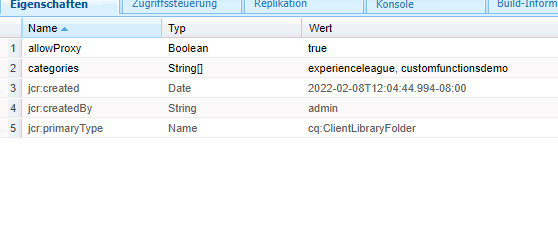

# Benutzerdefinierte Funktionen

AEM Forms 6.5 bietet nun die Möglichkeit, JavaScript-Funktionen zu definieren, mit denen komplexe Geschäftsregeln mithilfe des Regeleditors definiert werden können.
AEM Forms bietet eine Reihe solcher benutzerdefinierter Funktionen vorkonfiguriert. Sie müssen jedoch eigene benutzerdefinierte Funktionen definieren und sie über mehrere Formulare hinweg verwenden.

Gehen Sie wie folgt vor, um Ihre erste benutzerdefinierte Funktion zu definieren:
* [Anmelden bei crx](http://localhost:4502/crx/de/index.jsp#/apps/experience-league/clientlibs)
* Erstellen Sie unter Apps einen neuen Ordner mit der Bezeichnung &quot;experience-league&quot;(Dieser Ordnername kann ein Name Ihrer Wahl sein).
* Speichern Sie Ihre Änderungen.
* Erstellen Sie unter dem Ordner &quot;experience-league&quot;einen neuen Knoten des Typs cq:ClientLibraryFolder mit dem Namen clientlibs.
* Wählen Sie den neu erstellten Ordner clientlibs aus, fügen Sie die Eigenschaften allowProxy und categories wie im Screenshot gezeigt hinzu und speichern Sie Ihre Änderungen.


* Erstellen Sie einen Ordner mit dem Namen **js** unter **clientlibs** Ordner
* Erstellen Sie eine Datei mit dem Namen **function.js** unter **js** Ordner
* Erstellen Sie eine Datei mit dem Namen **js.txt** unter **clientlibs** Ordner. Speichern Sie Ihre Änderungen.
* Ihre Ordnerstruktur sollte wie im folgenden Screenshot aussehen.


* Doppelklicken Sie auf features.js , um den Editor zu öffnen.
Kopieren Sie den folgenden Code in die Datei &quot;features.js&quot;und speichern Sie Ihre Änderungen.

```javascript
/**
* Get List of County names
* @name getCountyNamesList Get list of county names
* @return {OPTIONS} drop down options 
 */
function getCountyNamesList()
{
    var countyNames= [];
    countyNames[0] = "Santa Clara";
    countyNames[1] = "Alameda";
    countyNames[2] = "Buxor";
    countyNames[3] = "Contra Costa";
    countyNames[4] = "Merced";

    return countyNames;

}
/**
* Covert UTC to Local Time
* @name convertUTC Convert UTC Time to Local Time
* @param {string} strUTCString in Stringformat
* @return {string}
*/
function convertUTC(strUTCString)
{
    var dt = new Date(strUTCString);
    console.log(dt.toLocaleString());
    return dt.toLocaleString();
}
```

Bitte [verweisen auf jsdoc ](https://jsdoc.app/index.html)für weitere Informationen zum Kommentieren von JavaScript-Funktionen.
Der obige Code hat zwei Funktionen:
**getCountyNamesList** - gibt ein Array von Zeichenfolge zurück
**convertUTC** - Konvertiert den UTC-Zeitstempel in die lokale Zeitzone

Öffnen Sie die js.txt, fügen Sie den folgenden Code ein und speichern Sie Ihre Änderungen.

```javascript
#base=js
functions.js
```

Die Zeile #base=js gibt an, in welchem Verzeichnis sich die JavaScript-Dateien befinden.
Die folgenden Zeilen geben den Speicherort der JavaScript-Datei relativ zum Basisspeicherort an.

Wenn Sie Probleme beim Erstellen der benutzerdefinierten Funktionen haben, können Sie [dieses Paket herunterladen und installieren](assets/custom-functions.zip) in Ihrer AEM Instanz.

## Benutzerdefinierte Funktionen verwenden

Das folgende Video führt Sie durch die Schritte, die bei der Verwendung der benutzerdefinierten Funktion im Regeleditor eines adaptiven Formulars erforderlich sind
>[!VIDEO](https://video.tv.adobe.com/v/340305?quality=12&learn=on)
