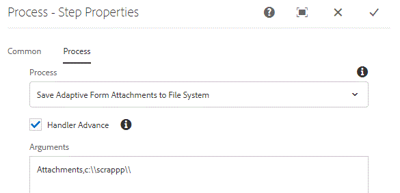

# Benutzerdefinierter Prozessschritt

Dieses Lernprogramm richtet sich an AEM Forms-Kunden, die einen benutzerdefinierten Prozessschritt implementieren müssen. Ein Prozessschritt kann ein ECMA-Skript ausführen oder benutzerdefinierten Java-Code aufrufen, um Vorgänge auszuführen. In diesem Lernprogramm werden die Schritte erläutert, die zur Implementierung von WorkflowProcess, der durch den Prozessschritt ausgeführt wird, erforderlich sind.

Der Hauptgrund für die Implementierung des benutzerdefinierten Prozessschritts ist die Erweiterung des AEM Arbeitsablaufs. Wenn Sie beispielsweise AEM Forms-Komponenten in Ihrem Workflow-Modell verwenden, sollten Sie die folgenden Vorgänge durchführen

* Adaptive Formularanlagen im Dateisystem speichern
* Bearbeiten der gesendeten Daten

Um den oben genannten Verwendungsfall zu erreichen, schreiben Sie normalerweise einen OSGi-Dienst, der vom Prozessschritt ausgeführt wird.

## Maven-Projekt erstellen

Der erste Schritt besteht darin, ein Maven-Projekt mit der entsprechenden Adobe Maven Archetype zu erstellen. Die detaillierten Schritte sind in diesem [Artikel](https://helpx.adobe.com/experience-manager/using/maven_arch13.html) aufgeführt. Nachdem Sie Ihr Maven-Projekt in Eclipse importiert haben, können Sie Ihre erste OSGi-Komponente, die in Ihrem Prozessschritt verwendet werden kann, zum Beginn schreiben.


### Klasse erstellen, die WorkflowProcess implementiert

Öffnen Sie das Maven-Projekt in Ihrer Eclipse-IDE. Erweitern Sie den Ordner **Projektname** > **core**. Erweitern Sie den Ordner src/main/java. Sie sollten ein Paket sehen, das mit &quot;core&quot;endet. Erstellen Sie eine Java-Klasse, die WorkflowProcess in diesem Paket implementiert. Sie müssen die Ausführungsmethode überschreiben. Die Signatur der execute-Methode lautet wie folgt
public void execute(WorkItem workItem, WorkflowSession workflowSession, MetaDataMap processArguments)throws WorkflowException
Die execute-Methode gibt Zugriff auf die folgenden 3 Variablen

**WorkItem**: Die Variable &quot;workItem&quot;gibt Zugriff auf Daten im Zusammenhang mit dem Workflow. Die öffentliche API-Dokumentation ist [hier verfügbar.](https://helpx.adobe.com/experience-manager/6-3/sites/developing/using/reference-materials/diff-previous/changes/com.adobe.granite.workflow.WorkflowSession.html)

**WorkflowSession**: Diese Variable &quot;workflowSession&quot;gibt Ihnen die Möglichkeit, den Workflow zu steuern. Die öffentliche API-Dokumentation ist [hier ](https://helpx.adobe.com/experience-manager/6-3/sites/developing/using/reference-materials/diff-previous/changes/com.adobe.granite.workflow.WorkflowSession.html) verfügbar

**MetaDataMap**: Alle mit dem Workflow verknüpften Metadaten. Alle Prozessargumente, die an den Prozessschritt übergeben werden, stehen mit dem MetaDataMap-Objekt zur Verfügung.[API-Dokumentation](https://helpx.adobe.com/experience-manager/6-5/sites/developing/using/reference-materials/javadoc/com/adobe/granite/workflow/metadata/MetaDataMap.html)

In diesem Lernprogramm schreiben wir die Anlagen, die dem adaptiven Formular im Rahmen des AEM Arbeitsablaufs hinzugefügt wurden.

Um diesen Verwendungsfall zu ermöglichen, wurde die folgende Java-Klasse geschrieben

Sehen wir uns diesen Code an

```
@Component(property = { Constants.SERVICE_DESCRIPTION + "=Write Adaptive Form Attachments to File System",
        Constants.SERVICE_VENDOR + "=Adobe Systems",
        "process.label" + "=Save Adaptive Form Attachments to File System" })
public class WriteFormAttachmentsToFileSystem implements WorkflowProcess {
     private static final Logger log = LoggerFactory.getLogger(WriteFormAttachmentsToFileSystem.class);
     @Override
    public void execute(WorkItem workItem, WorkflowSession workflowSession, MetaDataMap processArguments)
            throws WorkflowException {
        // TODO Auto-generated method stub
        log.debug("The string I got was ..." + processArguments.get("PROCESS_ARGS", "string").toString());
        String[] params = processArguments.get("PROCESS_ARGS", "string").toString().split(",");
        String attachmentsPath = params[0];
        String saveToLocation = params[1];
        log.debug("The seperator is" + File.separator);
        String payloadPath = workItem.getWorkflowData().getPayload().toString();
 
        String attachmentsFilePath = payloadPath + "/" + attachmentsPath + "/attachments";
        log.debug("The data file path is " + attachmentsFilePath);
 
        ResourceResolver resourceResolver = workflowSession.adaptTo(ResourceResolver.class);
 
        Resource attachmentsNode = resourceResolver.getResource(attachmentsFilePath);
        Iterator<Resource> attachments = attachmentsNode.listChildren();
        while (attachments.hasNext()) {
            Resource attachment = attachments.next();
            String attachmentPath = attachment.getPath();
            String attachmentName = attachment.getName();
 
            log.debug("The attachmentPath is " + attachmentPath + " and the attachmentname is " + attachmentName);
            com.adobe.aemfd.docmanager.Document attachmentDoc = new com.adobe.aemfd.docmanager.Document(attachmentPath,
                    attachment.getResourceResolver());
            try {
                File file = new File(saveToLocation + File.separator + workItem.getId());
                if (!file.exists()) {
                    file.mkdirs();
                }
 
                attachmentDoc.copyToFile(new File(file + File.separator + attachmentName));
 
                log.debug("Saved attachment" + attachmentName);
                attachmentDoc.close();
 
            } catch (IOException e) {
                // TODO Auto-generated catch block
                e.printStackTrace();
            }
 
        }
 
    }
```

Zeile 1 - definiert die Eigenschaften für unsere Komponente. Die Eigenschaft process.label wird beim Verknüpfen der OSGi-Komponente mit dem Prozessschritt angezeigt, wie in einem der folgenden Screenshots dargestellt.

Zeilen 13-15 - Die an diese OSGi-Komponente übergebenen Prozessargumente werden mithilfe des Trennzeichens &quot;,&quot;aufgeteilt. Die Werte für &quot;attachmentPath&quot;und &quot;saveToLocation&quot;werden dann aus dem Zeichenfolgenarray extrahiert.

* attachmentPath - Dies ist der gleiche Speicherort, den Sie im adaptiven Formular angegeben haben, wenn Sie die Übermittlungsaktion des adaptiven Formulars zum Aufrufen AEM Workflows konfiguriert haben. Dies ist ein Name des Ordners, in dem die Anlagen im AEM relativ zur Nutzlast des Workflows gespeichert werden sollen.

* saveToLocation - Dies ist der Speicherort, an dem die Anlagen im Dateisystem des AEM-Servers gespeichert werden sollen.

Diese beiden Werte werden als Prozessargumente übergeben, wie im Screenshot unten dargestellt.




Zeile 19: Anschließend erstellen wir &quot;attachmentFilePath&quot;. Der Pfad der Anlagendatei ist wie folgt:

    /var/fd/Dashboard/payload/server0/2018-11-19/3EF6ENASOQTHCPLNDYVNAM7OKA_7/Attachments/attachments

* Die &quot;Anlagen&quot;ist der Name des Ordners relativ zur Payload des Workflows, die bei der Konfiguration der Sendeoption des adaptiven Formulars angegeben wurde.

   

Zeilen 24-26 - Get ResourceResolver und dann die Ressource, die auf attachmentFilePath zeigt.

Der Rest des Codes erstellt Dokument-Objekte, indem das untergeordnete Objekt der Ressource, das auf attachmentFilePath zeigt, mithilfe der API durchlaufen wird. Dieses Dokument-Objekt ist spezifisch für AEM Forms. Anschließend verwenden wir die copyToFile-Methode des Dokument-Objekts, um das Dokument-Objekt zu speichern.

>[!NOTE]
>
>Da wir ein für AEM Forms spezifisches Dokument-Objekt verwenden, müssen Sie die aemfd-client-sdk-Abhängigkeit in Ihr Maven-Projekt einbeziehen. Die Gruppen-ID lautet com.adobe.aemfd und die Artefakt-ID aemfd-client-sdk.

#### Erstellen und Bereitstellen

[Erstellen Sie das Bundle wie ](https://helpx.adobe.com/experience-manager/using/maven_arch13.html#BuildtheOSGibundleusingMaven)
[hier beschriebenStellen Sie sicher, dass das Bundle bereitgestellt ist und sich im aktiven Status befindet.](http://localhost:4502/system/console/bundles)

Workflow-Modell erstellen. Ziehen Sie den Prozessschritt per Drag &amp; Drop in das Workflow-Modell. Verknüpfen Sie den Prozessschritt mit &quot;Adaptive Formularanlagen im Dateisystem speichern&quot;.

Geben Sie die erforderlichen Prozessargumente getrennt durch ein Komma ein. Beispiel: Anlagen, c:\\scrappp\\. Das erste Argument ist der Ordner, in dem die Anlagen des adaptiven Formulars relativ zur Workflow-Nutzlast gespeichert werden. Dieser Wert muss mit dem Wert übereinstimmen, den Sie beim Konfigurieren der Sendeaktion des adaptiven Formulars angegeben haben. Das zweite Argument ist der Speicherort, an dem die Anlagen gespeichert werden sollen.

Erstellen Sie ein adaptives Formular. Ziehen Sie die Komponente &quot;Dateianlagen&quot;per Drag &amp; Drop in das Formular. Konfigurieren Sie die Übermittlungsaktion des Formulars, um den in den vorherigen Schritten erstellten Workflow aufzurufen. Geben Sie den entsprechenden Pfad für die Anlage an.

Speichern Sie die Einstellungen.

Vorschau des Formulars. hinzufügen ein paar Anlagen und senden Sie das Formular. Die Anlagen sollten im Dateisystem an dem von Ihnen im Workflow angegebenen Speicherort gespeichert werden.

