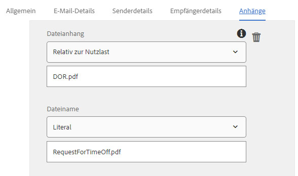

# Verwenden des E-Mail-Schritts des Forms Workflows {#using-send-email-step-of-forms-workflow}

Send Email step wurde in AEM Forms 6.4 eingeführt. Mithilfe dieses Schritts können wir Geschäftsprozesse oder Arbeitsabläufe erstellen, mit denen Sie E-Mails mit oder ohne Anlagen senden können. Im folgenden Video werden die Schritte zum Konfigurieren der Komponente &quot;E-Mail senden&quot;erläutert.

>[!VIDEO](https://video.tv.adobe.com/v/21499/?quality=9&learn=on)

Als Teil dieses Artikels führen wir Sie durch den folgenden Verwendungsfall:

1. Ein Benutzer füllt das Anforderungsformular für die Zeitüberschreitung aus
1. Beim Senden des Formulars wird AEM Workflow ausgelöst
1. Der AEM Workflow verwendet die Komponente E-Mail senden, um eine E-Mail mit dem DoR als Anlage zu senden

Bevor Sie den Schritt E-Mail senden verwenden, stellen Sie sicher, dass Sie den Day CQ Mail Service unter [configMgr](http://localhost:4502/system/console/configMgr) konfigurieren. Geben Sie die für Ihre Umgebung spezifischen Werte an

Als Teil der mit diesem Artikel verknüpften Assets erhalten Sie Folgendes

1. Adaptives Formular, das den Arbeitsablauf beim Senden Trigger
1. Beispielarbeitsablauf, der eine E-Mail mit DOR als Anlage sendet
1. OSGi-Bundle, das die Metadateneigenschaften erstellt

Um das Beispiel auf Ihrem System ausführen zu lassen, führen Sie die folgenden Schritte aus:

1. [Developing with serviceUser-Bundle bereitstellen](/help/forms/assets/common-osgi-bundles/DevelopingWithServiceUser.jar)

1. [Herunterladen und Installieren von setValue ](/help/forms/assets/common-osgi-bundles/SetValueApp.core-1.0-SNAPSHOT.jar)bundleDieses Bundle enthält den Code zum Erstellen der Metadateneigenschaften als Teil des Prozessschritts des Workflows.
1. [Konfigurieren des Day CQ Mail Service](https://helpx.adobe.com/experience-manager/6-5/sites/administering/using/notification.html)
1. [Importieren und installieren Sie die mit diesem Artikel verknüpften Assets mithilfe des Paketmanagers in CRX](assets/emaildoraemformskt.zip)
1. Starten Sie das adaptive Formular . Füllen Sie die erforderlichen Felder aus und senden Sie sie ab.
1. Sie sollten eine E-Mail mit DocumentOfRecord als Anlage erhalten

[Workflow-Modell](http://localhost:4502/editor.html/conf/global/settings/workflow/models/emaildor.html)

Sehen Sie sich den Prozessschritt des Workflows an. Der mit dem Prozessschritt verknüpfte benutzerspezifische Code erstellt die Namen der Metadateneigenschaft und legt deren Werte aus den gesendeten Daten fest. Diese Werte werden dann von der Komponente &quot;E-Mail senden&quot;verwendet.

>[!NOTE]
>
>In AEM Forms 6.5 und höher benötigen Sie diesen benutzerdefinierten Code nicht, um Metadateneigenschaften zu erstellen. Bitte verwenden Sie die Variablenfunktion in AEM Workflow

Stellen Sie sicher, dass die Registerkarte &quot;Anlagen&quot;der Komponente &quot;E-Mail senden&quot;gemäß dem Screenshot unten konfiguriert ist.
Der Wert &quot;DOR.pdf&quot; muss mit dem Wert übereinstimmen, der im Dokument des Datensatzpfads angegeben ist, der in den Sendeoptionen Ihres adaptiven Formulars angegeben wurde.

