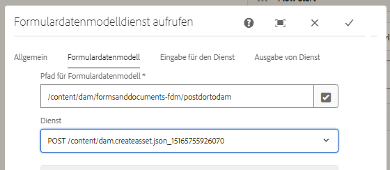
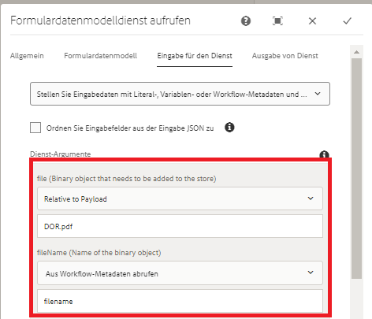

# Verwenden des Formulardatenmodells zum Posten binärer Daten{#using-form-data-model-to-post-binary-data}

Ab AEM Forms 6.4 können wir jetzt den Formulardatenmodelldienst als Schritt in AEM Arbeitsablauf aufrufen. In diesem Artikel werden Sie durch einen Beispielverwendungsfall für die Veröffentlichung von Dokument aus Datensatz mithilfe des Formulardatenmodelldienstes geführt.

Der Verwendungsfall lautet wie folgt:

1. Ein Benutzer füllt das adaptive Formular aus und sendet es.
1. Das adaptive Formular ist so konfiguriert, dass es ein Dokument aus Datensatz generiert.
1. Bei Übermittlung dieser adaptiven Formulare wird AEM Workflow ausgelöst, der den Formulardatenmodelldienst aufruft, um das Dokument aus Datensatz an AEM DAM POST.

Registerkarte &quot;Formulardatenmodell&quot;- Eigenschaften

Auf der Registerkarte &quot;Diensteingabe&quot;ordnen wir Folgendes zu:

* file(Das Binärobjekt, das gespeichert werden muss) mit der DOR.pdf-Eigenschaft relativ zur Payload. Das bedeutet, dass beim Senden des adaptiven Formulars das generierte Dokument aus Datensatz in einer Datei namens DOR.pdf relativ zur Workflow-Nutzlast gespeichert wird.**Stellen Sie sicher, dass diese DOR.pdf-Datei mit der beim Konfigurieren der Sendungseigenschaft des adaptiven Formulars identisch ist.**

* fileName - Dies ist der Name, unter dem das binäre Objekt in DAM gespeichert wird. Sie möchten also, dass diese Eigenschaft dynamisch generiert wird, sodass jeder fileName pro Übermittlung eindeutig ist. Zu diesem Zweck haben wir den Prozessschritt im Workflow verwendet, um die Metadateneigenschaft &quot;filename&quot;zu erstellen und ihren Wert auf eine Kombination aus Member Name und Account Number der Person festzulegen, die das Formular sendet. Wenn der Name des Mitglieds beispielsweise John Jacobs lautet und seine Kontonummer 9846, lautet der Dateiname John Jacobs_9846.pdf

Service Input

>[!NOTE]
>
>Tipps zur Fehlerbehebung - Wenn die DOR.pdf aus irgendeinem Grund nicht in DAM erstellt wurde, setzen Sie die Authentifizierungseinstellungen der Datenquelle zurück, indem Sie [hier](http://localhost:4502/mnt/overlay/fd/fdm/gui/components/admin/fdmcloudservice/properties.html?item=%2Fconf%2Fglobal%2Fsettings%2Fcloudconfigs%2Ffdm%2Fpostdortodam) klicken. Dies sind die AEM Authentifizierungseinstellungen, die standardmäßig &quot;admin/admin&quot;lauten.

Gehen Sie wie folgt vor, um diese Funktion auf Ihrem Server zu testen:

1.[Bereitstellen des Developing with serviceUser-Bundles](/help/forms/assets/common-osgi-bundles/DevelopingWithServiceUser.jar)

1. [Laden Sie das SetValue Bundle](/help/forms/assets/common-osgi-bundles/SetValueApp.core-1.0-SNAPSHOT.jar) herunter und stellen Sie es bereit. Mit diesem benutzerdefinierten OSGI-Bundle wird die Metadateneigenschaft erstellt und der Wert aus den gesendeten Formulardaten festgelegt.

1. [Importieren Sie die mit diesem Artikel ](assets/postdortodam.zip) verknüpften Assets mithilfe des Package Manager in AEM. Sie erhalten Folgendes

   1. Workflow-Modell
   1. Adaptives Formular für die Übermittlung an den AEM Workflow konfiguriert
   1. Datenquelle, die für die Verwendung der Datei PostToDam.JSON konfiguriert ist
   1. Formulardatenmodell, das die Datenquelle verwendet

1. Verweisen Sie auf Ihren [Browser, um das adaptive Formular](http://localhost:4502/content/dam/formsanddocuments/helpx/timeoffrequestform/jcr:content?wcmmode=disabled) zu öffnen.
1. Füllen Sie das Formular aus und senden Sie es ab.
1. Überprüfen Sie die Assets-Anwendung, ob das Dokument aus Datensatz erstellt und gespeichert wurde.

[Swagger-](http://localhost:4502/conf/global/settings/cloudconfigs/fdm/postdortodam/jcr:content/swaggerFile) Datei, die zum Erstellen der Datenquelle verwendet wird, steht als Referenz zur Verfügung
