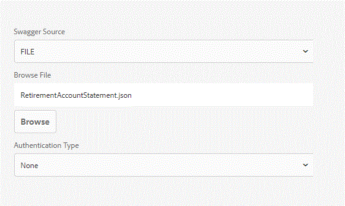

# Möglichkeit zum Ändern der Datenquellenkonfigurationseinstellungen{#ability-to-modify-data-source-configuration-settings}

Bis zur Version AEM Forms 6.4 konnten Sie nach der Konfiguration einer Datenquelle das Schema Host und Base Path für RESTful-Dienst nicht ändern. Dies war problematisch, wenn Sie Ihre Datenquellen mit verschiedenen Umgebung testen wollten.

Mit der Veröffentlichung von AEM Forms 6.5 können Sie die oben genannten Eigenschaften nun problemlos ändern. Mit dieser neuen Funktion können Sie jetzt Formulardatenmodelle für Entwicklungs-Umgebung erstellen. Sobald Sie mit den Ergebnissen zufrieden sind, können Sie die Eigenschaften so ändern, dass sie auf eine andere Umgebung verweisen.

Die folgenden Screenshots zeigen die Einstellungen der Datenquellenkonfiguration in AEM Forms 6.4 und Forms 6.5

**Datenquellenkonfiguration in AEM 6.4**

**KonfigurationBearbeitbare Datenquellenkonfiguration in AEM 6.5 und höher**

