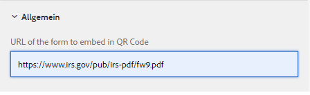

# Beispiel einer QR-Code-Komponente

Die Einbettung von QR-Code in ein adaptives Formular kann die Benutzerfreundlichkeit und Effizienz beim Zugriff auf zusätzliche Informationen im Zusammenhang mit dem Formular erheblich verbessern.

Die Beispielkomponente verwendet [QRCode.js](https://davidshimjs.github.io/qrcodejs/).

QRCode.js ist eine JavaScript-Bibliothek zum Erstellen von QRCode. Sie bietet Browser-übergreifend Unterstützung mit HTML5-Arbeitsfläche und Tabellen-Tag in DOM.

Die Komponente generiert den QR-Code je nach dem Wert, der in der Konfigurationseigenschaft der Komponente angegeben ist.


Der folgende Code wurde in „body.jsp“ der Komponente „qr-code-generator“ verwendet.

Die „url“ ist die URL, die in den QR-Code eingebettet werden muss. Diese URL wird in den Konfigurationseigenschaften der QR-Code-Komponente angegeben.

```java
<%@include file="/libs/foundation/global.jsp"%>
<body>
    <h2>Scan the QR Code for more information related to this form</h2>
    <div data-url="<%=properties.get("url")%>">
    </div>
    <div id="qrcode">
    </div>
</body>
```


Der folgende Code verwendet die makeCode-Methode der Bibliothek „QRCode.js“ in der Client-Bibliothek der qr-code-generator-Komponente. Der generierte QR-Code wird an das „div“ angehängt, das durch die ID **&quot;qrcode&quot;** angegeben wird.

```javascript
$(document).ready(function()
  {
      var qrcode = new QRCode("qrcode");
      qrcode.makeCode(document.querySelector("[data-url]").getAttribute("data-url"));
      
 });
```

## Bereitstellen der Assets auf Ihrem lokalen Server

* [Herunterladen und Installieren der QR-Code-Komponente mithilfe von Package Manager](assets/qrcode.zip)
* [Herunterladen und Installieren des adaptiven Beispiel-Formulars mithilfe von Package Manager](assets/form-with-qr-code.zip)
* [Zeigen Sie das Formular in einer Vorschau an](http://localhost:4502/content/dam/formsanddocuments/qrcode/w9form/jcr:content?wcmmode=disabled). Der Hilfeabschnitt des Formulars enthält den QR-Code.
