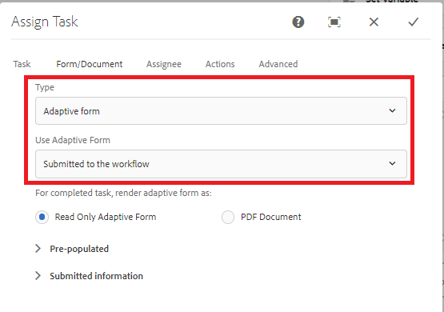

# Wiederverwendbare AEM Forms-Workflow-Modelle erstellen{#create-re-usable-aem-forms-workflow-models}

Ab AEM Forms 6.5 können wir nun Workflow-Modelle erstellen, die nicht an ein bestimmtes adaptives Formular gebunden sind. Mit dieser Funktion können Sie jetzt ein Workflow-Modell erstellen, das bei verschiedenen Übermittlungen adaptiver Formulare aufgerufen werden kann. Mit dieser Funktion können Sie über einen generischen Arbeitsablauf verfügen, um alle Übermittlungen adaptiver Formulare zur Überprüfung und Genehmigung zu bearbeiten.

Führen Sie zum Entwerfen eines solchen Workflows die folgenden Schritte aus

1. Bei AEM anmelden
1. Verweisen Sie Ihren Browser auf das [Workflow-Modell](http://localhost:4502/libs/cq/workflow/admin/console/content/models.html)
1. Klicken Sie auf Erstellen | Erstellen eines Modells für Hinzufügen Workflow-Modell
1. Geben Sie dem Workflow-Modell den entsprechenden Namen und Titel an und klicken Sie auf Fertig.
1. Öffnen Sie das neu erstellte Modell im Bearbeitungsmodus
1. Ziehen Sie die Komponente &quot;Aufgabe zuweisen&quot;auf Ihr Workflow-Modell und legen Sie sie dort ab
1. Öffnen Sie die Konfigurationseigenschaften der Komponente &quot;Aufgabe zuweisen&quot;
1. Registerkarte &quot;Forms und Dokumente&quot;
1. Wählen Sie &quot;Typ - Adaptives Formular&quot;oder &quot;Schreibgeschütztes adaptives Formular&quot;.

Es gibt drei Möglichkeiten, den Formularpfad anzugeben

1. Verfügbar unter einem absoluten Pfad - Dies bedeutet, dass der Workflow eng mit dem adaptiven Formular verknüpft wird. Das wollen wir hier nicht
1. **An den Workflow**  gesendet. Das bedeutet, dass das Workflow-Engine beim Senden des adaptiven Formulars den Formularnamen aus den gesendeten Daten extrahiert. Diese Option muss ausgewählt werden
1. Verfügbar an einem Pfad in einer Variablen - Das bedeutet, dass das adaptive Formular aus der Workflow-Variablen abgerufen wird
Der folgende Screenshot zeigt die richtige Option, die Sie für die Entkopplung des Workflows vom adaptiven Formular wählen müssen

