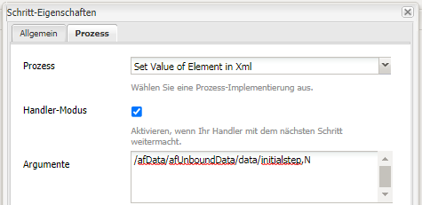

# Verwenden von setValue im AEM Forms-Arbeitsablauf

Legen Sie den Wert eines XML-Elements in adaptiven Forms-gesendeten Daten im AEM Forms OSGI-Arbeitsablauf fest.

LiveCycle hatte früher eine Komponente mit einem bestimmten Wert, mit der Sie den Wert eines XML-Elements festlegen können.

Auf der Grundlage dieses Wertes können Sie beim Ausfüllen des Formulars mit der XML bestimmte Felder oder Bereiche des Formulars ausblenden/deaktivieren.

In AEM Forms OSGI - müssen wir ein benutzerdefiniertes OSGi-Bundle schreiben, um den Wert in der XML festzulegen. Das Bundle wird im Rahmen dieses Tutorials bereitgestellt.
Wir verwenden Process Step im AEM Workflow. Wir verbinden das OSGi-Bundle &quot;Set Value of Element in XML&quot; mit diesem Prozessschritt.
Wir müssen dem Set Value Bundle zwei Argumente übergeben. Das erste Argument ist der XPath des XML-Elements, dessen Wert festgelegt werden muss. Das zweite Argument ist der festzulegende Wert.
Im obigen Screenshot setzen wir beispielsweise den Wert des Elements intialstep auf &quot;N&quot;.
Auf der Grundlage dieses Wertes werden bestimmte Bedienfelder im adaptiven Forms ausgeblendet oder angezeigt.
In unserem Beispiel haben wir ein einfaches Antragsformular &quot;Time Off&quot;. Der Initiator dieses Formulars gibt seinen Namen und die Uhrzeit der Antragstellung ein. Beim Senden wird dieses Formular zur Überprüfung an &quot;admin&quot;gesendet. Wenn der Administrator das Formular öffnet, sind die Felder im ersten Bereich deaktiviert. Dies liegt daran, dass der Wert des ersten step-Elements in der XML auf &quot;N&quot;gesetzt wurde.

Basierend auf dem Wert für die ersten Schritte wird der zweite Bereich angezeigt, in dem der &quot;Administrator&quot;die Anforderung genehmigen oder ablehnen kann

Sehen Sie sich die Regeln an, die mit dem Regeleditor für das Feld &quot;Zeit ab angefordert von&quot;festgelegt wurden.

Gehen Sie wie folgt vor, um die Assets auf Ihrem lokalen System bereitzustellen:

* [Developing with serviceUser-Bundle bereitstellen](/help/forms/assets/common-osgi-bundles/DevelopingWithServiceUser.jar)

* [Stellen Sie das Beispielpaket](/help/forms/assets/common-osgi-bundles/SetValueApp.core-1.0-SNAPSHOT.jar) bereit. Dies ist das benutzerdefinierte OSGI-Bundle, mit dem Sie die Werte eines Elements in den gesendeten XML-Daten festlegen können.

* [Herunterladen und Extrahieren des Inhalts der ZIP-Datei](assets/setvalueassets.zip)
* Verweisen Sie Ihren Browser auf [Package Manager](http://localhost:4502/crx/packmgr/index.jsp)
* Importieren und installieren Sie die Datei setValueWorkflow.zip. Dies hat das Beispiel-Workflow-Modell.
* Verweisen Sie Ihren Browser auf [Forms und Dokumente](http://localhost:4502/aem/forms.html/content/dam/formsanddocuments)
* Klicken Sie auf Erstellen | Datei-Upload
* TimeOfRequestForm.zip hochladen
* Öffnen Sie das [TimeOffRequestform](http://localhost:4502/content/dam/formsanddocuments/timeoffapplication/jcr:content?wcmmode=disabled)
* Füllen Sie die drei erforderlichen Felder aus und senden Sie
* Melden Sie sich als &quot;Admin&quot;bei AEM an (falls noch nicht geschehen)
* Gehen Sie zu [&quot;AEM Posteingang&quot;](http://localhost:4502/aem/inbox)
* Öffnen Sie das Formular &quot;Anfrage zur Überprüfungszeit&quot;
* Beachten Sie, dass die Felder im ersten Bereich deaktiviert sind. Dies liegt daran, dass das Formular vom Prüfer geöffnet wird. Beachten Sie außerdem, dass das Fenster zum Genehmigen oder Ablehnen der Anforderung jetzt sichtbar ist

>[!NOTE]
>
>Sie können die Debug-Protokollierung aktivieren, indem Sie die Protokollfunktion für
>com.aemforms.setvalue.core.SetValueinXml
>durch Verweis auf Ihren Browser auf http://localhost:4502/system/console/slinglog

>[!NOTE]
>
>Stellen Sie sicher, dass der Pfad der Datendatei in den Übermittlungsoptionen des adaptiven Formulars auf &quot;Data.xml&quot;eingestellt ist. Dies liegt daran, dass der Prozessschritt nach einer Datei namens &quot;Data.xml&quot;im Ordner &quot;Payload&quot;sucht
