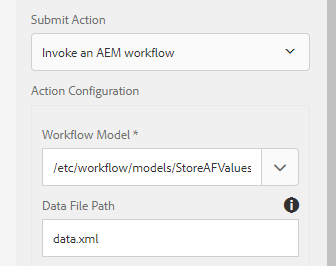

# Speichern von Übermittlungen adaptiver Formulare in der Datenbank

Es gibt mehrere Möglichkeiten, die gesendeten Formulardaten in der Datenbank Ihrer Wahl zu speichern. Eine JDBC-Datenquelle kann verwendet werden, um die Daten direkt in der Datenbank zu speichern. Ein benutzerdefiniertes OSGI-Bundle kann geschrieben werden, um die Daten in der Datenbank zu speichern. In diesem Artikel werden die Daten mithilfe eines benutzerdefinierten Prozessschritts im Arbeitsablauf gespeichert, der AEM Arbeitsablauf.
Der Anwendungsfall besteht darin, einen AEM Arbeitsablauf bei einer Übermittlung des adaptiven Formulars Trigger und die gesendeten Daten in der Datenbank zu speichern.

**Gehen Sie wie folgt vor, um dieses Programm auf Ihrem System zu verwenden**

* [Laden Sie die ZIP-Datei herunter und extrahieren Sie den Inhalt auf Ihre Festplatte](assets/storeafdataindb.zip)

   * Importieren Sie die Datei &quot;StoreAFInDBWorkflow.zip&quot;mit dem Package Manager in AEM. Das Paket verfügt über einen Beispielarbeitsablauf, in dem die AF-Daten in DB gespeichert werden. Öffnen Sie das Workflow-Modell. Der Workflow umfasst nur einen Schritt. Dieser Schritt ruft den im Bundle geschriebenen Code auf, um die AF-Daten in der Datenbank zu speichern. Ich übergebe ein einziges Argument an den Prozess. Dies ist der Name des adaptiven Formulars, dessen Daten gespeichert werden.
   * Stellen Sie mithilfe der Felix-Webkonsole die Datei &quot;insertData.core-0.0.1-SNAPSHOT.jar&quot;bereit. Dieses Bundle enthält den Code zum Schreiben der gesendeten Formulardaten in die Datenbank

* Gehen Sie zu [ConfigMgr](http://localhost:4502/system/console/configMgr)

   * Suchen Sie nach &quot;JDBC Connection Pool&quot;. Erstellen Sie einen neuen Day Commons JDBC Connection Pool. Geben Sie die Einstellungen für Ihre Datenbank an.

   * 
   * Suchen Sie nach &quot;**Formulardaten in DB**&quot;
   * Geben Sie die für Ihre Datenbank spezifischen Eigenschaften an.
      * DataSourceName:Name der Datenquelle, die Sie zuvor konfiguriert haben.
      * TableName - Name der Tabelle, in der Sie die AF-Daten speichern möchten
      * FormName - Spaltenname für den Namen des Formulars
      * ColumnName - Spaltenname für die AF-Daten

   

* Erstellen Sie ein adaptives Formular.

* Verknüpfen Sie das adaptive Formular mit AEM Workflow(StoreAFValuesinDB), wie im Screenshot unten dargestellt.

* Vergewissern Sie sich, dass Sie &quot;data.xml&quot;im Datendateipfad angeben, wie im Screenshot unten gezeigt.

   

* Vorschau des Formulars und Senden

* Wenn alles gut funktioniert hat, sollten Sie sehen, wie die Formulardaten in der von Ihnen angegebenen Tabelle und Spalte gespeichert werden

