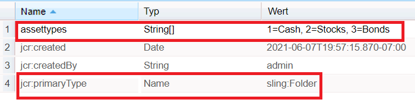

# Element-Ladeeigenschaft in AEM Forms

Konfigurieren und füllen Sie eine Dropdown-Liste mit der Eigenschaft „Element-Ladepfad“.
Das Feld „Element-Ladepfad“ ermöglicht es einer Autorin oder einem Autor, eine URL bereitzustellen, aus der die in einer Dropdown-Liste verfügbaren Optionen geladen werden.
Gehen Sie wie folgt vor, um einen solchen Knoten in crx zu erstellen:
* Melden Sie sich bei crx an.
* Erstellen Sie einen Knoten mit dem Namen „assets“ (Sie können diesen Knoten gemäß Ihren Anforderungen benennen) und geben Sie „sling:folder“ unter „content“ ein.
* Speichern Sie.
* Klicken Sie auf den neu erstellten Asset-Knoten und legen Sie seine Eigenschaften fest, wie unten dargestellt.
* Sie müssen eine Eigenschaft vom Typ „Zeichenfolge“ mit dem Namen „assettypes“ erstellen (Sie können diesen gemäß Ihren Anforderungen wählen). Stellen Sie sicher, dass die Eigenschaft mehrwertig ist. Geben Sie die gewünschten Werte an und speichern Sie diese.
  

Um diese Werte in Ihre Dropdown-Liste zu laden, geben Sie den folgenden Pfad in der Eigenschaft „Element-Ladepfad“: **/content/assets/assettypes** an.

Das Beispielpaket kann [hier heruntergeladen werden](assets/item-load-path-package.zip).
