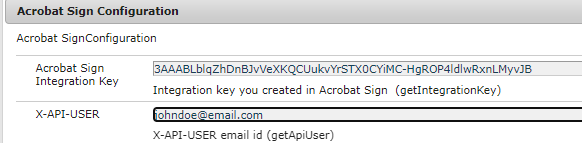

# Verwenden von Adobe Sign-Hilfsmethoden

In bestimmten Anwendungsfällen ist es u. U. erforderlich, ein Dokument zur Signatur zu senden, ohne einen AEM Workflow zu verwenden. In solchen Fällen ist es sehr praktisch, die Wrapper-Methoden zu verwenden, die vom in diesem Artikel bereitgestellten Beispielpaket verfügbar gemacht werden.

## Bereitstellen des OSGi-Beispielpakets

[Bereitstellen des OSGi-Bundles](assets/AdobeSignHelperMethods.core-1.0.0-SNAPSHOT.jar) über die AEM OSGi Web Console. Geben Sie den API-Integrationsschlüssel und den API-Benutzer mithilfe der OSGi-Konfiguration wie unten gezeigt über den Configuration Manager der AEM OSGi-Web-Konsole an.

 Beachten Sie, dass die Variable `AdobeSignHelperMethods` OSGi-Bundle wird nicht als Adobe Experience Manager-Produktcode (AEM) erkannt und wird daher vom Adobe-Support nicht unterstützt.



## API-Dokumentation

Die folgenden sind über die `AcrobatSignHelperMethods` OSGi-Dienst, der im OSGi-Paket bereitgestellt wird.

### getTransientDocumentID

`String getTransientDocumentID(Document documentForSigning) throws IOException`


Das Dokument, mit dem eine Vereinbarung oder ein Webformular erstellt wird. Das Dokument wird zuerst vom Absender in Acrobat Sign hochgeladen. Dies wird als _transient_ da sie nur 7 Tage nach dem Hochladen verwendet werden kann. Diese Methoden akzeptieren `com.adobe.aemfd.docmanager.Document` und gibt die vorübergehende Dokument-ID zurück.

### getAgreementID

`String getAgreementId(String transientDocumentID, String email) throws ClientProtocolException, IOException`

Senden Sie das Dokument zum Signieren mit der vorübergehenden Dokument-ID zum Signieren an den durch den E-Mail-Parameter identifizierten Benutzer.

### getWidgetID

`String getWidgetID(String transientDocumentID)`

Ein Widget ist wie eine wiederverwendbare Vorlage, die Benutzern mehrmals präsentiert und mehrmals signiert werden kann. Verwenden Sie diese Methode, um die Widget-ID mit der vorübergehenden Dokument-ID abzurufen.

### getWidgetURL

`String getWidgetURL(String widgetId) throws ClientProtocolException, IOException`

Widget-URL für eine bestimmte Widget-ID abrufen. Diese Widget-URL kann dann den Benutzern zum Signieren des Dokuments angezeigt werden.

## API verwenden

Die `AcrobatSignHelperMethods` ist ein OSGi-Dienst, daher muss er mit der @Reference-Anmerkung in Ihrem Java-Code kommentiert werden.

```java
...
// Import the AcrobatSignHelperMethods from the provided bundle
import com.acrobatsign.core.AcrobatSignHelperMethods;
...

@Component(service = { Example.class })
public class ExampleImpl implements Example {

 // Gain a reference to the provided AcrobatSignHelperMethods OSGi service
 @Reference
 com.acrobatsign.core.AcrobatSignHelperMethods acrobatSignHelperMethods;

 function void example() { 
    ...
    // Use the AcrobatSignHelperMethods API methods in your code
    String transientDocumentId = acrobatSignHelperMethods.getTransientDocumentID(documentForSigning);

    String agreementId = acrobatSignHelperMethods.getAgreementId(transientDocumentID, "johndoe@example.com");
    ...
 }
}
```
