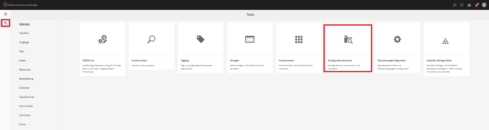
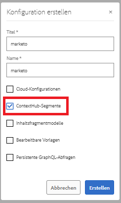
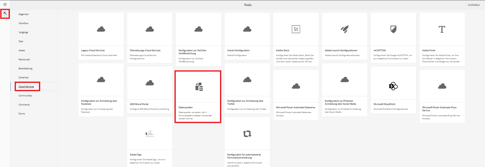
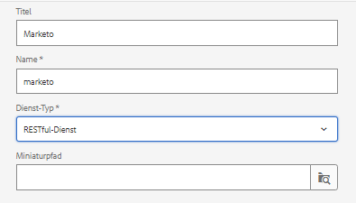
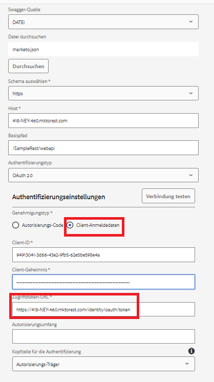

# Erstellen einer Datenquelle

Marketos REST-APIs sind mit 2-Legierungen OAuth 2.0 authentifiziert. Wir können einfach eine Datenquelle mithilfe der Swagger-Datei erstellen, die im vorherigen Schritt heruntergeladen wurde.

## Konfigurationscontainer erstellen

* Melden Sie sich bei AEM an.
* Klicken Sie auf das Menü &quot;Tools&quot;und dann auf **Konfigurations-Browser** , wie unten dargestellt

* 

* Klicken Sie auf **Erstellen** und geben Sie einen aussagekräftigen Namen ein, wie unten dargestellt. Stellen Sie sicher, dass Sie die Option Cloud-Konfigurationen wie unten gezeigt auswählen

* 

## Erstellen von Cloud-Services

* Navigieren Sie zum Menü &quot;Tools&quot;und klicken Sie dann auf Cloud Services > Data Sources .

* 

* Wählen Sie den Konfigurationscontainer aus, der im vorherigen Schritt erstellt wurde, und klicken Sie auf **Erstellen** , um eine neue Datenquelle zu erstellen. Geben Sie einen aussagekräftigen Namen ein, wählen Sie den RESTful-Dienst aus der Dropdown-Liste Diensttyp aus und klicken Sie auf **Weiter**
* 

* Laden Sie die Swagger-Datei hoch und geben Sie den Grant-Typ, die Client-ID, das Client-Geheimnis und die Zugriffstoken-URL für Ihre Marketo-Instanz an, wie im Screenshot unten dargestellt.

* Testen Sie die Verbindung. Wenn die Verbindung erfolgreich hergestellt wurde, klicken Sie auf die blaue Schaltfläche **Erstellen** , um die Erstellung der Datenquelle abzuschließen.

* 

## Nächste Schritte

[Erstellen einer RESTful-Dienst-basierten Datenquelle](./part3.md)
