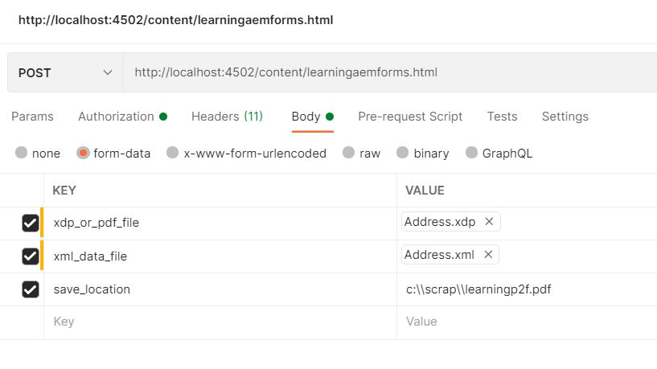

# OSGi-Dienst

Ein OSGi-Dienst ist eine Java-Klasse- oder Service-Schnittstelle zusammen mit einer Reihe von Diensteigenschaften als Name/Wert-Paare. Die Diensteigenschaften unterscheiden sich zwischen verschiedenen Dienstleistern, die Dienste mit derselben Dienstschnittstelle bereitstellen.

Ein OSGi-Dienst wird semantisch durch seine Dienstschnittstelle definiert und als Dienstobjekt implementiert. Die Funktionalität eines Dienstes wird durch die Schnittstellen definiert, die er implementiert. Dadurch können unterschiedliche Anwendungen denselben Dienst implementieren. Service-Schnittstellen ermöglichen Bundles die Interaktion über Bindungsschnittstellen, nicht über Implementierungen. Eine Service-Schnittstelle sollte mit so wenigen Implementierungsdetails wie möglich angegeben werden.

## Benutzeroberfläche definieren

Eine einfache Schnittstelle mit einer Methode zum Zusammenführen von Daten mit der <span class="x x-first x-last">XDP</span> Vorlage.

```java
package com.mysite.samples;

import com.adobe.aemfd.docmanager.Document;

public interface MyfirstInterface
{
    public Document mergeDataWithXDPTemplate(Document xdpTemplate, Document xmlDocument);
}
 
```

## Implementieren der Oberfläche

Erstellen Sie ein neues Paket mit dem Namen `com.mysite.samples.impl` , um die Implementierung der Schnittstelle zu speichern.

```java
package com.mysite.samples.impl;
import org.osgi.service.component.annotations.Component;
import org.osgi.service.component.annotations.Reference;
import org.slf4j.Logger;
import org.slf4j.LoggerFactory;
import com.adobe.aemfd.docmanager.Document;
import com.adobe.fd.output.api.OutputService;
import com.adobe.fd.output.api.OutputServiceException;
import com.mysite.samples.MyfirstInterface;
@Component(service = MyfirstInterface.class)
public class MyfirstInterfaceImpl implements MyfirstInterface {
  @Reference
  OutputService outputService;

  private static final Logger log = LoggerFactory.getLogger(MyfirstInterfaceImpl.class);

  @Override
  public Document mergeDataWithXDPTemplate(Document xdpTemplate, Document xmlDocument) {
    com.adobe.fd.output.api.PDFOutputOptions pdfOptions = new com.adobe.fd.output.api.PDFOutputOptions();
    pdfOptions.setAcrobatVersion(com.adobe.fd.output.api.AcrobatVersion.Acrobat_11);
    try {
      return outputService.generatePDFOutput(xdpTemplate, xmlDocument, pdfOptions);

    } catch (OutputServiceException e) {

      log.error("Failed to merge data with XDP Template", e);

    }

    return null;
  }

}
```

Die Anmerkung `@Component(...)` In Zeile 10 markiert diese Java-Klasse als OSGi-Komponente und registriert sie als OSGi-Dienst.

Die `@Reference` -Anmerkung ist Teil der deklarativen OSGi-Dienste und wird verwendet, um einen Verweis auf die [OutputService](https://helpx.adobe.com/experience-manager/6-5/forms/javadocs/index.html?com/adobe/fd/output/api/OutputService.html) in die -Variable `outputService`.


## Erstellen und Bereitstellen des Bundles

* Öffnen **Eingabeaufforderungsfenster**
* Navigieren Sie zu `c:\aemformsbundles\mysite\core`
* Ausführen des Befehls `mvn clean install -PautoInstallBundle`
* Mit dem obigen Befehl wird das Bundle automatisch erstellt und für Ihre AEM-Instanz bereitgestellt, die auf localhost:4502 ausgeführt wird.

Das Bundle ist auch am folgenden Speicherort verfügbar: `C:\AEMFormsBundles\mysite\core\target`. Das Bundle kann auch in AEM mit der [Felix Web-Konsole.](http://localhost:4502/system/console/bundles)

## Verwendung des Dienstes

Sie können den Dienst jetzt auf Ihrer JSP-Seite verwenden. Das folgende Codefragment zeigt, wie Sie Zugriff auf Ihren Dienst erhalten und die vom Dienst implementierten Methoden verwenden

```java
MyFirstAEMFormsService myFirstAEMFormsService = sling.getService(com.mysite.samples.MyFirstAEMFormsService.class);
com.adobe.aemfd.docmanager.Document generatedDocument = myFirstAEMFormsService.mergeDataWithXDPTemplate(xdp_or_pdf_template,xmlDocument);
```

Das Beispielpaket, das die JSP-Seite enthält, kann [heruntergeladen von hier](assets/learning_aem_forms.zip)

[Das vollständige Bundle kann heruntergeladen werden](assets/mysite.core-1.0.0-SNAPSHOT.jar)

## Testen des Pakets

Importieren und installieren Sie das Paket in AEM mithilfe des [Package Manager](http://localhost:4502/crx/packmgr/index.jsp)

Verwenden Sie Postman, um einen POST-Aufruf durchzuführen und die Eingabeparameter anzugeben, wie im Screenshot unten dargestellt

