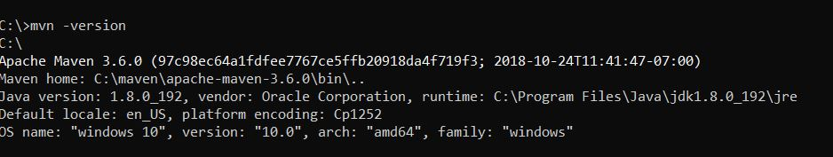
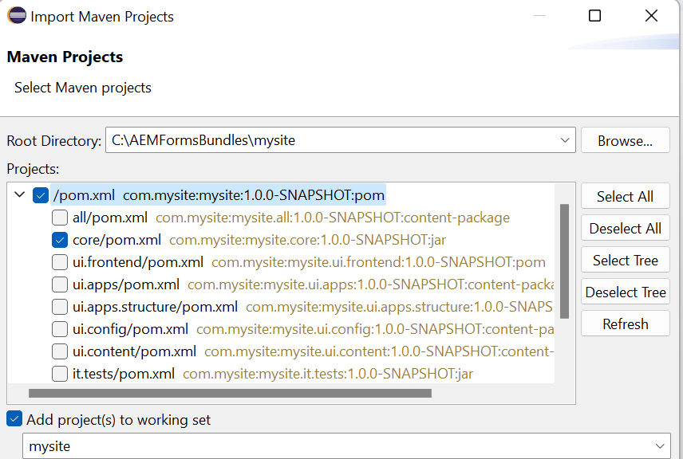

# Erstellen Ihres ersten OSGi-Bundles

Ein OSGi-Bundle ist eine Java™-Archivdatei, die Java-Code, Ressourcen und ein Manifest enthält, das das Paket und seine Abhängigkeiten beschreibt. Bei diesem Bundle handelt es sich um die Bereitstellungseinheit für eine Anwendung. Dieser Artikel richtet sich an Entwicklerinnen und Entwickler, die einen OSGi-Dienst oder ein Servlet mit AEM Forms 6.4 oder 6.5 erstellen möchten. Gehen Sie wie folgt vor, um Ihr erstes OSGi-Bundle zu erstellen:


## Installieren des JDK 

Installieren Sie die unterstützte JDK-Version. Für dieses Beispiel wurde JDK 1.8 verwendet. Stellen Sie sicher, dass Sie **JAVA_HOME** in Ihren Umgebungsvariablen hinzugefügt haben und diese Variable auf den Stammordner Ihrer JDK-Installation verweist.
Fügen Sie %JAVA_HOME%/bin zum Pfad hinzu.


>[!NOTE]
> Verwenden Sie nicht JDK 15. Diese Version wird von AEM nicht unterstützt.

### Testen Ihrer JDK-Version

Öffnen Sie ein neues Eingabeaufforderungsfenster und geben Sie Folgendes ein: `java -version`. Es sollte die durch die Variable `JAVA_HOME` identifizierte JDK-Version zurückgegeben werden.


## Installieren von Maven

Maven ist ein Tool zur Build-Automatisierung, das hauptsächlich für Java-Projekte verwendet wird. Gehen Sie wie folgt vor, um Maven auf Ihrem lokalen System zu installieren.

* Erstellen Sie einen Ordner mit dem Namen `maven` auf dem Laufwerk „C:“.
* Laden Sie das [binäre ZIP-Archiv](https://maven.apache.org/download.cgi) herunter.
* Extrahieren Sie den Inhalt des ZIP-Archivs unter `c:\maven`.
* Erstellen Sie eine Umgebungsvariable namens `M2_HOME` mit dem Wert `C:\maven\apache-maven-3.6.0`. Im Beispiel hier wird die **mvn**-Version 3.6.0 verwendet. Zum Zeitpunkt der Erstellung dieses Artikels ist die neueste Maven-Version 3.6.3
* Fügen Sie `%M2_HOME%\bin` zu Ihrem Pfad hinzu.
* Speichern Sie Ihre Änderungen.
* Öffnen Sie eine neue Eingabeaufforderung und geben Sie `mvn -version` ein. Die **mvn**-Version sollte so wie im Screenshot aufgelistet werden.




## Installieren von Eclipse

Installieren der neuesten Version von [Eclipse](https://www.eclipse.org/downloads/)

## Erstellen Ihres ersten Projekts

Archetype ist ein Maven-Projektvorlagen-Toolkit. Ein Archetyp (so der deutsche Begriff) ist definiert als ein ursprüngliches Muster oder Modell, aus dem alle anderen Elemente derselben Art bestehen. Der Name passt also. Denn wir möchten ein System bereitstellen, das eine konsistente Möglichkeit zur Erstellung von Maven-Projekten bietet. Archetype unterstützt Autorinnen und Autoren beim Erstellen von Maven-Projektvorlagen für Benutzende und bietet ihnen die Möglichkeit, parametrierte Versionen dieser Projektvorlagen zu generieren.
Gehen Sie wie folgt vor, um Ihr erstes Maven-Projekt zu erstellen:

* Erstellen Sie einen neuen Ordner mit dem Namen `aemformsbundles` auf dem Laufwerk „C:“.
* Öffnen Sie eine Eingabeaufforderung und navigieren Sie zu `c:\aemformsbundles`.
* Führen Sie in der Eingabeaufforderung den folgenden Befehl aus:

```java
mvn -B org.apache.maven.plugins:maven-archetype-plugin:3.2.1:generate -D archetypeGroupId=com.adobe.aem -D archetypeArtifactId=aem-project-archetype -D archetypeVersion=36 -D appTitle="My Site" -D appId="mysite" -D groupId="com.mysite" -D aemVersion=6.5.13
```

Nach erfolgreichem Abschluss sollte in Ihrem Befehlsfenster eine Meldung zur erfolgreichen Erstellung angezeigt werden

## Erstellen eines Eclipse-Projekts aus Ihrem Maven-Projekt

* Ändern Sie das Arbeitsverzeichnis zu `mysite`.
* Führen Sie `mvn eclipse:eclipse` über die Befehlszeile aus. Der Befehl liest Ihre POM-Datei und erstellt Eclipse-Projekte mit korrekten Metadaten, sodass Eclipse die Projektarten, die Beziehungen, den Klassenpfad usw. versteht.

## Importieren des Projekts in Eclipse

Starten Sie **Eclipse**.

Navigieren Sie zu **Datei > Importieren** und wählen Sie **Bestehende Maven-Projekte** aus, wie hier gezeigt.


Klicken Sie auf „Weiter“.

Wählen Sie „c:\aemformsbundles\mysite“ aus, indem Sie auf die Schaltfläche **Durchsuchen** klicken.



>[!NOTE]
>Sie können je nach Bedarf die gewünschten Module importieren. Wählen und importieren Sie nur das Kernmodul, wenn Sie ausschließlich Java-Code in Ihrem Projekt erstellen möchten.

Klicken Sie auf **Beenden**, um den Importvorgang zu starten.

Das Projekt wird in Eclipse importiert und es sind verschiedene `mysite.xxxx`-Ordner zu sehen.

Erweitern Sie `src/main/java` unter dem Ordner `mysite.core`. Dies ist der Ordner, in den Sie den Großteil Ihres Codes schreiben.


## Einschließen des AEMFD Client SDK

Sie müssen das AEMFD Client SDK in Ihr Projekt einschließen, um die verschiedenen mit AEM Forms bereitgestellten Dienste nutzen zu können. Siehe [AEMFD Client SDK](https://mvnrepository.com/artifact/com.adobe.aemfd/aemfd-client-sdk), um das entsprechende Client-SDK in Ihr Maven-Projekt einzuschließen. Sie müssen das AEMFD Client SDK in den Abschnitt „dependency“ von `pom.xml` des Kernprojekts einschließen, wie unten dargestellt.

```xml
<dependency>
    <groupId>com.adobe.aemfd</groupId>
    <artifactId>aemfd-client-sdk</artifactId>
    <version>6.0.122</version>
</dependency>
```

Gehen Sie wie folgt vor, um Ihr Projekt zu erstellen:

* Öffnen Sie ein **Eingabeaufforderungsfenster**.
* Navigieren Sie zu `c:\aemformsbundles\mysite\core`
* Führen Sie den Befehl `mvn clean install -PautoInstallBundle` aus.
Dieser Befehl erstellt und installiert das Bundle auf dem AEM-Server unter `http://localhost:4502`. Das Bundle ist auch auf dem Dateisystem unter folgendem Pfad verfügbar:
  `C:\AEMFormsBundles\mysite\core\target`. Es kann mithilfe der [Felix-Web-Konsole](http://localhost:4502/system/console/bundles) bereitgestellt werden.

## Nächste Schritte

[Erstellen eines OSGi-Dienstes](./create-osgi-service.md)

