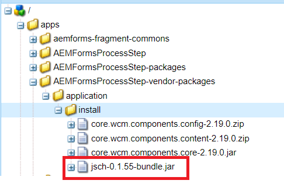

# Einbinden von Drittanbieter-Bundles in Ihr AEM-Projekt

In diesem Artikel werden wir die Schritte durchgehen, die erforderlich sind, um das OSGi-Bundle von Drittanbietern in Ihr AEM Projekt aufzunehmen. Für die Zwecke dieses Artikels werden wir die [jsch-0.1.55.jar](https://repo1.maven.org/maven2/com/jcraft/jsch/0.1.55/jsch-0.1.55.jar) in unserem AEM Projekt.  Wenn das OSGi im Maven-Repository verfügbar ist, fügen Sie die Abhängigkeit des Bundles in die POM.xml-Datei des Projekts ein.

>[!NOTE]
> Es wird davon ausgegangen, dass die JAR-Datei eines Drittanbieters ein OSGi-Bundle ist

```java
<!-- https://mvnrepository.com/artifact/com.jcraft/jsch -->
<dependency>
    <groupId>com.jcraft</groupId>
    <artifactId>jsch</artifactId>
    <version>0.1.55</version>
</dependency>
```

Wenn sich Ihr OSGi-Bundle auf Ihrem Dateisystem befindet, sieht die Abhängigkeit etwa so aus

```java
<dependency>
    <groupId>jsch</groupId>
    <artifactId>jsch</artifactId>
    <version>1.0</version>
    <scope>system</scope>
    <systemPath>${project.basedir}/localjar/jsch-0.1.55-bundle.jar</systemPath>
</dependency>
```

## Ordnerstruktur erstellen

Wir fügen dieses Bundle zu unserem AEM-Projekt hinzu. **AEMFormsProcessStep** die sich im **c:\aemformsbundles** Ordner

* Öffnen Sie die **filter.xml** von der Seite C:\aemformsbundles\AEMFormsProcessStep\all\src\main\content\META-INF\vault folder of your project Make a note of the root attribute of the filter element.

* Erstellen Sie die folgende Ordnerstruktur C:\aemformsbundles\AEMFormsProcessStep\all\src\main\content\jcr_root\apps\AEMFormsProcessStep-vendor-packages\application\install
* Die **apps/AEMFormsProcessStep-vendor-packages** ist der Stammattributwert in filter.xml
* Aktualisieren Sie den Abschnitt &quot;Abhängigkeiten&quot;der POM.xml des Projekts.
* Öffnen Sie das Befehlszeilenfenster. Navigieren Sie in meinem Fall zum Ordner Ihres Projekts (c:\aemformsbundles\AEMFormsProcessStep). Führen Sie den folgenden Befehl aus

```java
mvn clean install -pAutoInstallSinglePackage
```

Wenn alles gut geht, wird das Paket zusammen mit dem Drittanbieter-Bundle in Ihre AEM-Instanz installiert. Sie können mithilfe von [Felix-Webkonsole](http://localhost:4502/system/console/bundles). Das Drittanbieter-Bundle ist im Ordner /apps der `crx` Repository wie unten dargestellt



