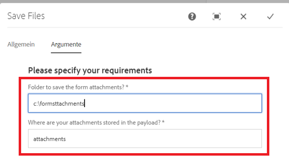

# Benutzerdefinierter Prozessschritt

Dieses Tutorial richtet sich an Kundinnen und Kunden von AEM Forms, die eine benutzerdefinierte Workflow-Komponente implementieren müssen. Der erste Schritt beim Erstellen der Workflow-Komponente besteht darin, Ihren Java-Code zu schreiben, der mit der Workflow-Komponente verknüpft wird. Im Rahmen dieses Tutorials schreiben wir eine einfache Java-Klasse zum Speichern der adaptiven Formularanlagen im Dateisystem. Dieser Java-Code liest die in der Workflow-Komponente angegebenen Argumente.

Die folgenden Schritte sind erforderlich, um die Java-Klasse zu schreiben und die Klasse als OSGi-Bundle bereitzustellen

## Erstellen eines Maven-Projekts

Der erste Schritt besteht darin, ein Maven-Projekt mit dem entsprechenden Adobe-Maven-Archetyp zu erstellen. Die detaillierten Schritte finden Sie in diesem [Artikel](https://experienceleague.adobe.com/docs/experience-manager-learn/forms/creating-your-first-osgi-bundle/create-your-first-osgi-bundle.html?lang=de). Sobald Sie Ihr Maven-Projekt in Eclipse importiert haben, können Sie mit dem Schreiben Ihrer ersten OSGi-Komponente beginnen, die in Ihrem Prozessschritt verwendet werden kann.


### Erstellen einer Klasse, die WorkflowProcess implementiert

Öffnen Sie das Maven-Projekt in Ihrer Eclipse-IDE. Erweitern Sie den Ordner **Projektname** > **core**.  Erweitern Sie den Ordner „src/main/java“. Sie sollten ein Paket sehen, das mit „core“ endet. Erstellen Sie eine Java-Klasse, die WorkflowProcess in diesem Paket implementiert. Sie müssen die Ausführungsmethode überschreiben. Die Signatur der Ausführungsmethode lautet wie folgt: 
public void execute(WorkItem workItem, WorkflowSession workflowSession, MetaDataMap processArguments)throws WorkflowException

In diesem Tutorial werden wir die Anlagen schreiben, die dem adaptiven Formular als Teil des AEM-Workflows zum Dateisystem hinzugefügt wurden.

Um diesen Anwendungsfall durchzuführen, wurde die folgende Java-Klasse geschrieben:

Sehen wir uns diesen Code an

```java
package com.mysite.core;
import java.io.File;
import java.io.InputStream;
import java.util.HashMap;
import java.util.Map;
import javax.jcr.Node;
import javax.jcr.Session;
import org.osgi.framework.Constants;
import org.osgi.service.component.annotations.Component;
import org.osgi.service.component.annotations.Reference;
import org.slf4j.Logger;
import org.slf4j.LoggerFactory;
import com.adobe.aemfd.docmanager.Document;
import com.adobe.granite.workflow.WorkflowException;
import com.adobe.granite.workflow.WorkflowSession;
import com.adobe.granite.workflow.exec.WorkItem;
import com.adobe.granite.workflow.exec.WorkflowProcess;
import com.adobe.granite.workflow.metadata.MetaDataMap;
import com.day.cq.search.PredicateGroup;
import com.day.cq.search.Query;
import com.day.cq.search.QueryBuilder;
import com.day.cq.search.result.Hit;
import com.day.cq.search.result.SearchResult;
@Component(property = {
  Constants.SERVICE_DESCRIPTION + "=Custom component to wrtie form attachments to file system",
  Constants.SERVICE_VENDOR + "=Adobe Systems",
  "process.label" + "=Custom component to wrtie form attachments to file system"
})
public class WriteFormAttachmentsToFileSystem implements WorkflowProcess {

  private static final Logger log = LoggerFactory.getLogger(WriteFormAttachmentsToFileSystem.class);
  @Reference
  QueryBuilder queryBuilder;

  @Override
  public void execute(WorkItem workItem, WorkflowSession workflowSession, MetaDataMap metaDataMap)
  throws WorkflowException {

    String attachmentsPath = metaDataMap.get("attachmentsPath", String.class);

    log.debug("Got attachments path: " + attachmentsPath);
    String saveToLocation = metaDataMap.get("SaveToLocation", String.class);
    log.debug("Got save location: " + saveToLocation);

    log.debug("The seperator is" + File.separator);
    String payloadPath = workItem.getWorkflowData().getPayload().toString();
    Map < String, String > map = new HashMap < String, String > ();
    map.put("path", payloadPath + "/" + attachmentsPath);
    File saveLocationFolder = new File(saveToLocation);
    if (!saveLocationFolder.exists()) {
      saveLocationFolder.mkdirs();
    }

    map.put("type", "nt:file");
    Query query = queryBuilder.createQuery(PredicateGroup.create(map), workflowSession.adaptTo(Session.class));
    query.setStart(0);
    query.setHitsPerPage(20);

    SearchResult result = query.getResult();
    log.debug("Got  " + result.getHits().size() + " attachments ");
    Node attachmentNode = null;
    for (Hit hit: result.getHits()) {
      try {
        String path = hit.getPath();
        log.debug("The attachment title is  " + hit.getTitle() + " and the attachment path is  " + path);
        attachmentNode = workflowSession.adaptTo(Session.class).getNode(path + "/jcr:content");
        InputStream documentStream = attachmentNode.getProperty("jcr:data").getBinary().getStream();
        Document attachmentDoc = new Document(documentStream);
        attachmentDoc.copyToFile(new File(saveLocationFolder + File.separator + hit.getTitle()));
        attachmentDoc.close();
      } catch (Exception e) {
        log.error("Error saving file " + e.getMessage());
      }
    }
  }
}
```


* attachmentsPath: Dies ist der gleiche Speicherort, den Sie beim Konfigurieren der Sendeaktion des adaptiven Formulars zum Aufrufen des AEM-Workflows im adaptiven Formular angegeben haben. Dies ist der Name des Ordners, in dem die Anhänge in AEM gespeichert werden sollen, bezogen auf die Payload des Workflows.

* saveToLocation: Dies ist der Speicherort, an dem die Anhänge im Dateisystem Ihres AEM-Servers gespeichert werden sollen.

Diese beiden Werte werden mithilfe des Dialogfelds der Workflow-Komponente als Prozessargumente übergeben



Der QueryBuilder-Dienst wird zum Abfragen von Knoten des Typs „nt:file“ im Ordner „attachmentsPath“ verwendet. Der Rest des Codes durchläuft die Suchergebnisse, um das Dokumentobjekt zu erstellen und im Dateisystem zu speichern


>[!NOTE]
>
>Da wir ein AEM Forms-spezifisches Dokumentobjekt verwenden, müssen Sie die Abhängigkeit von „aemfd-client-sdk“ in Ihr Maven-Projekt einbeziehen.

```xml
<dependency>
    <groupId>com.adobe.aemfd</groupId>
    <artifactId>aemfd-client-sdk</artifactId>
    <version>6.0.772</version>
</dependency>
```

#### Erstellen und Bereitstellen

[Erstellen Sie das Bundle wie hier beschrieben.](https://experienceleague.adobe.com/docs/experience-manager-learn/forms/creating-your-first-osgi-bundle/create-your-first-osgi-bundle.html?lang=de)
[Stellen Sie sicher, dass das Bundle bereitgestellt ist und sich in einem aktiven Status befindet.](http://localhost:4502/system/console/bundles)

## Nächste Schritte

Erstellen Sie Ihre [benutzerdefinierte Workflow-Komponente](./custom-workflow-component.md)

