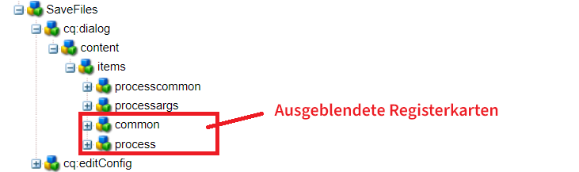
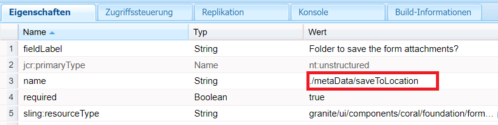
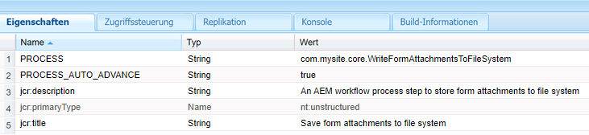

# Benutzerdefinierte Workflow-Komponente

Dieses Tutorial richtet sich an AEM Forms-Kundinnen und -Kunden, die eine benutzerdefinierte Workflow-Komponente erstellen müssen. Die Workflow-Komponente wird so konfiguriert, dass der im vorherigen Schritt geschriebene Code ausgeführt wird. Die Workflow-Komponente kann Prozessargumente für den Code angeben. In diesem Artikel werden wir die mit dem Code verknüpfte Workflow-Komponente untersuchen.

[Laden Sie die benutzerdefinierte Workflow-Komponente herunter.](assets/saveFiles.zip)
Importieren Sie die Workflow-Komponente mit [Package Manager](http://localhost:4502/crx/packmgr/index.jsp).

Die benutzerdefinierte Workflow-Komponente befindet sich unter „/apps/AEMFormsDemoListings/workflowcomponent/SaveFiles“.

Wählen Sie den Knoten „SaveFiles“ aus und überprüfen Sie seine Eigenschaften.

Der Wert der Eigenschaft **componentGroup** bestimmt die Kategorie der Workflow-Komponente.

**jcr:Title** ist der Titel der Workflow-Komponente.

Der Wert der Eigenschaft **sling:resourceSuperType** bestimmt die Vererbung dieser Komponente. In diesem Fall erfolgt die Vererbung von der Prozesskomponente.

## cq:dialog

Dialogfelder werden verwendet, um Autorinnen und Autoren die Interaktion mit der Komponente zu ermöglichen. „cq:dialog“ befindet sich unter dem Knoten „SaveFiles“.

Die Knoten unter dem Elementknoten stehen für die Registerkarten der Komponente, durch die Autorinnen und Autoren mit der Komponente interagieren. Die Registerkarten „Allgemein“ und „Prozess“ sind ausgeblendet. Die Registerkarten „Allgemein“ und „Argumente“ werden angezeigt.

Die Prozessargumente für den Prozess befinden sich unter dem Knoten „processargs“.

Die Autorin oder der Autor gibt die Argumente an, wie im Screenshot unten dargestellt.

Die Werte werden als Eigenschaften des Metadatenknotens gespeichert. Beispielsweise wird der Wert **c:\formsattachments** in der Eigenschaft „saveToLocation“ des Metadatenknotens gespeichert.

## cq:editConfig

„cq:EditConfig“ ist einfach ein Knoten mit dem primären Typ „cq:EditConfig“ und dem Namen „cq:editConfig“ unter dem Komponentenstamm.
Das Bearbeitungsverhalten einer Komponente wird konfiguriert, indem ein cq:editConfig-Knoten vom Typ „cq:EditConfig“ unter dem Komponentenknoten (vom Typ „cq:Component“) hinzugefügt wird.

„cq:formParameters (Knotentyp „nt:unstructured“) definiert zusätzliche Parameter, die zum Dialogfeldformular hinzugefügt werden.

Beachten Sie die Eigenschaften des Knotens „cq:formParameters“.

Der Wert der Eigenschaft PROCESS gibt den Java-Code an, der mit der Workflow-Komponente verknüpft wird.
