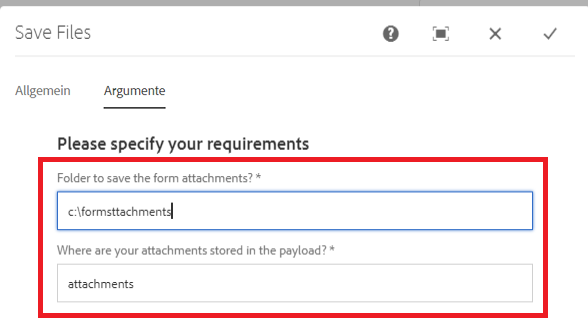

# Benutzerdefinierte Workflow-Komponente

Dieses Tutorial richtet sich an AEM Forms-Kunden, die eine benutzerdefinierte Workflow-Komponente erstellen müssen. Die Workflow-Komponente wird so konfiguriert, dass der im vorherigen Schritt geschriebene Code ausgeführt wird. Die Workflow-Komponente kann Prozessargumente für den Code angeben. In diesem Artikel werden wir die mit dem Code verknüpfte Workflow-Komponente untersuchen.

[Herunterladen der benutzerdefinierten Workflow-Komponente](assets/saveFiles.zip)
Importieren der Workflow-Komponente [Package Manager verwenden](http://localhost:4502/crx/packmgr/index.jsp)

Die benutzerdefinierte Workflow-Komponente befindet sich unter /apps/AEMFormsDemoListings/workflowcomponent/SaveFiles

Wählen Sie den Knoten SaveFiles aus und überprüfen Sie seine Eigenschaften.

**componentGroup** - Der Wert dieser Eigenschaft bestimmt die Kategorie der Workflow-Komponente.

**jcr:Title** - Dies ist der Titel der Workflow-Komponente.

**sling:resourceSuperType** Der Wert dieser Eigenschaft bestimmt die Vererbung dieser Komponente. In diesem Fall erben wir von der Prozesskomponente

## cq:dialog

Dialogfelder werden verwendet, um dem Autor die Interaktion mit der Komponente zu ermöglichen. cq:dialog befindet sich unter dem Knoten SaveFiles .

Die Knoten unter dem Elementknoten stellen die Registerkarten der Komponente dar, durch die Autoren mit der Komponente interagieren. Die Registerkarten &quot;Allgemein&quot;und &quot;Prozess&quot;sind ausgeblendet. Die Registerkarten Allgemein und Argumente werden angezeigt.

Die Prozessargumente für den Prozess befinden sich unter dem Knoten &quot;processargs&quot;

Der Autor gibt die Argumente an, wie im Screenshot unten dargestellt

Die Werte werden als Eigenschaften des Metadatenknotens gespeichert. Beispiel: Wert **c:\formsattachments** wird in der Eigenschaft saveToLocation des Metadatenknotens gespeichert

## cq:editConfig

cq:EditConfig ist einfach ein Knoten mit dem primären Typ cq:EditConfig und dem Namen cq:editConfig unter dem Komponentenstamm. Das Bearbeitungsverhalten einer Komponente wird konfiguriert, indem ein cq:editConfig -Knoten des Typs cq:EditConfig unter dem Komponentenknoten (vom Typ cq:Component) hinzugefügt wird

cq:formParameters (Knotentyp nt:unstructured): definiert zusätzliche Parameter, die zum Dialogfeldformular hinzugefügt werden

Beachten Sie die Eigenschaften des Knotens cq:formParameters .

Der Wert der Eigenschaft PROCESS zeigt den Java-Code an, der mit der Workflow-Komponente verknüpft wird.

