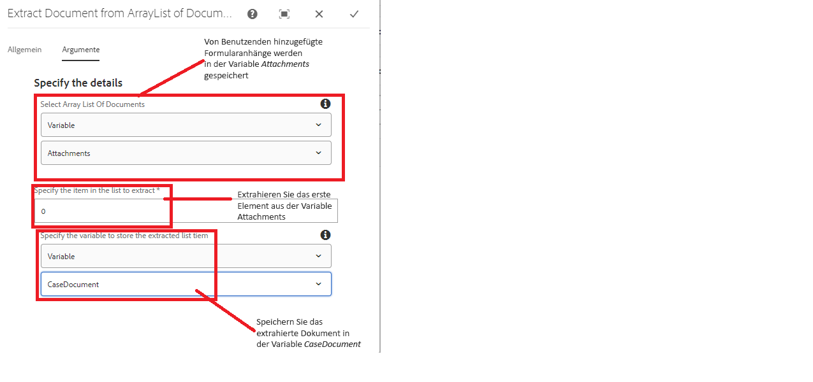
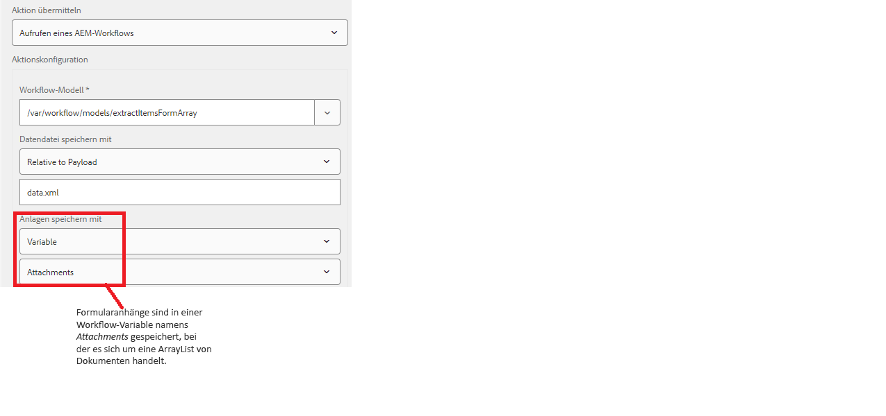

# Dokument aus der Dokumentenliste extrahieren

Ein gängiger Anwendungsfall besteht darin, die Formulardaten und den Formularanhang mithilfe des Schritts Formulardatenmodell aufrufen in einem AEM Workflow an ein externes System zu senden. Wenn Sie z. B. in ServiceNow einen Fall erstellen, möchten Sie die Falldetails mit einem unterstützenden Dokument senden. Die Anlagen, die dem adaptiven Formular hinzugefügt werden, werden in einer Variablen des Typs arraylist of documents gespeichert. Um ein bestimmtes Dokument aus dieser arraylist zu extrahieren, müssen Sie benutzerdefinierten Code schreiben.

In diesem Artikel werden Sie durch die Schritte geführt, die zur Verwendung der benutzerdefinierten Workflow-Komponente zum Extrahieren und Speichern des Dokuments in einer Dokumentvariablen erforderlich sind.

## Workflow erstellen

Für die Verarbeitung der Formularübermittlung muss ein Workflow erstellt werden. Für den Workflow müssen die folgenden Variablen definiert sein:

* Eine Variable vom Typ ArrayList of Document(Diese Variable enthält die vom Benutzer hinzugefügten Formularanhänge)
* Eine Variable des Typs &quot;Document&quot;.(Diese Variable enthält das aus der ArrayList extrahierte Dokument)

* Fügen Sie Ihrem Workflow eine benutzerdefinierte Komponente hinzu und konfigurieren Sie deren Eigenschaften
  

## Adaptives Formular konfigurieren

* Konfigurieren der Sendeaktion des adaptiven Formulars für den Trigger des AEM-Workflows
  

## Testen der Lösung

[Bereitstellen des benutzerdefinierten Bundles mithilfe der OSGi-Web-Konsole](assets/ExtractItemsFromArray.core-1.0.0-SNAPSHOT.jar)

[Importieren der Workflow-Komponente mit Package Manager](assets/Extract-item-from-documents-list.zip)

[Import des Beispiel-Workflows](assets/extract-item-sample-workflow.zip)

[Importieren des adaptiven Formulars](assets/test-attachment-extractions-adaptive-form.zip)

[Formularvorschau](http://localhost:4502/content/dam/formsanddocuments/testattachmentsextractions/jcr:content?wcmmode=disabled)

Fügen Sie eine Anlage zum Formular hinzu und senden Sie es.

>[!NOTE]
>
>Das extrahierte Dokument kann dann in jedem anderen Workflow-Schritt wie E-Mail senden oder FDM-Schritt aufrufen verwendet werden
