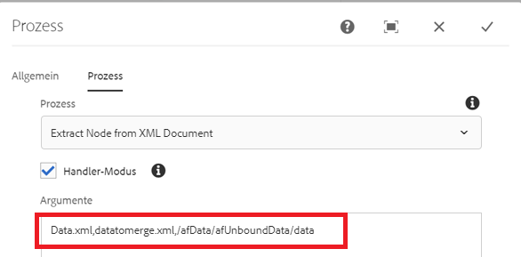

# Extrahieren eines Knotens aus der übermittelten Data.xml-Datei

Dieser benutzerdefinierte Prozessschritt besteht darin, ein neues XML-Dokument zu erstellen, indem Knoten aus einem anderen XML-Dokument extrahiert werden. Sie müssen so vorgehen, wenn Sie die übermittelten Daten mit der XDP-Vorlage in einer PDF-Datei zusammenführen möchten. Wenn Sie beispielsweise ein adaptives Formular übermitteln, befinden sich die Daten, die mit der XDP-Vorlage zusammenzuführen sind, im Datenelement. In diesem Fall müssen Sie ein weiteres XML-Dokument erstellen, indem Sie das entsprechende Datenelement extrahieren.

Der folgende Screenshot zeigt die Argumente, die Sie an den benutzerdefinierten Prozessschritt weitergeben müssen.

Die Parameter lauten wie folgt:
* Data.xml: Die XML-Datei, aus der der Knoten extrahiert werden soll
* datatomerge.xml: Die neue XML-Datei, die mit dem extrahierten Knoten erstellt wurde
* /afData/afUnboundData/data: Der zu extrahierende Knoten

Der folgende Screenshot zeigt die im Payload-Ordner erstellte Datei „datamerge.xml“.

[Das benutzerdefinierte Bundle kann von hier aus heruntergeladen werden:](/help/forms/assets/common-osgi-bundles/SetValueApp.core-1.0-SNAPSHOT.jar)
