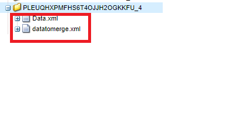

# Knoten aus gesendeter Daten-XML extrahieren

Dieser benutzerdefinierte Prozessschritt besteht darin, ein neues XML-Dokument zu erstellen, indem Knoten aus einem anderen XML-Dokument extrahiert werden. Sie müssen dies verwenden, wenn Sie die gesendeten Daten mit der XDP-Vorlage zusammenführen möchten, um PDF zu generieren. Wenn Sie beispielsweise ein adaptives Formular senden, befinden sich die Daten, die Sie mit der xdp-Vorlage zusammenführen müssen, im Datenelement. In diesem Fall müssen Sie ein weiteres XML-Dokument erstellen, indem Sie das entsprechende Datenelement extrahieren.

Der folgende Screenshot zeigt die Argumente, die Sie an den benutzerdefinierten Prozessschritt übergeben müssen

Im Folgenden finden Sie die Parameter .
* Data.xml - Die XML-Datei, aus der Sie den Knoten extrahieren möchten
* datatomerge.xml - Die neue XML, die mit dem extrahierten Knoten erstellt wurde
* /afData/afUnboundData/data - Der zu extrahierende Knoten

Der folgende Screenshot zeigt die Datei datamerge.xml, die im Payload-Ordner erstellt wird

[Benutzerdefiniertes Bundle kann von hier heruntergeladen werden](/help/forms/assets/common-osgi-bundles/SetValueApp.core-1.0-SNAPSHOT.jar)